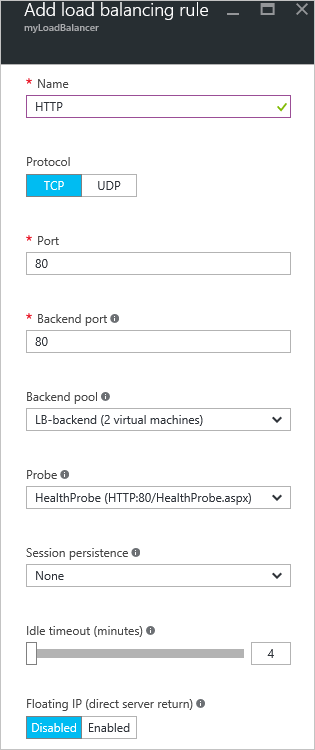

<properties
   pageTitle="Erstellen eines Internet zugänglichen Lastenausgleich in Ressourcenmanager über das Azure-Portal | Microsoft Azure"
   description="Erfahren Sie, wie ein Lastenausgleich internetfähigen in Ressourcenmanager über das Azure-Portal erstellen"
   services="load-balancer"
   documentationCenter="na"
   authors="anavinahar"
   manager="narayan"
   editor=""
   tags="azure-resource-manager"
/>
<tags
   ms.service="load-balancer"
   ms.devlang="na"
   ms.topic="hero-article"
   ms.tgt_pltfrm="na"
   ms.workload="infrastructure-services"
   ms.date="09/14/2016"
   ms.author="annahar" />

# Erstellen eines Internet zugänglichen Lastenausgleich über das Azure-portal

[AZURE.INCLUDE [load-balancer-get-started-internet-arm-selectors-include.md](../../includes/load-balancer-get-started-internet-arm-selectors-include.md)]

[AZURE.INCLUDE [load-balancer-get-started-internet-intro-include.md](../../includes/load-balancer-get-started-internet-intro-include.md)]

[AZURE.INCLUDE [azure-arm-classic-important-include](../../includes/azure-arm-classic-important-include.md)]Dieser Artikel behandelt das Modell zur Bereitstellung von Ressourcenmanager. Sie können auch [Informationen zum Erstellen eines Internet zugänglichen Lastenausgleich klassischen Bereitstellung verwenden](load-balancer-get-started-internet-classic-portal.md)

[AZURE.INCLUDE [load-balancer-get-started-internet-scenario-include.md](../../includes/load-balancer-get-started-internet-scenario-include.md)]

Dies umfasst die Reihenfolge der einzelnen Aufgaben, aber zu tun, um ein Lastenausgleich erstellen und im Detail erläutert, was unternommen wird, um das Ziel zu erreichen.

## Was ist erforderlich, um eine Internet zugänglichen Lastenausgleich erstellen?

Sie müssen erstellen und konfigurieren Sie die folgenden Objekte, um ein Lastenausgleich bereitstellen.

- Front-End-IP-Konfiguration - enthält öffentliche IP-Adressen für eingehende Netzwerkdatenverkehr.

- Back-End-Adresse Ressourcenpool - enthält Netzwerk-Schnittstellen (NICs) für den virtuellen Computern Netzwerkdatenverkehr aus dem Lastenausgleich zu erhalten.

- Regel Lastenausgleich - enthält Regeln, die mit einem öffentlichen Port auf dem Lastenausgleich zu Port Pool Back-End-Adressen zuzuordnen.

- Eingehende Regeln NAT - Regeln, die Verknüpfung mit einem öffentlichen Ports auf dem Lastenausgleich an einen Anschluss für einen bestimmten virtuellen Computer in dem Pool Back-End-Adressen enthält.

- Untersucht - Dienststatus Prüfpunkte verwendet, um die Verfügbarkeit der Instanzen von virtuellen Computern in dem Pool Back-End-Adressen enthält.

Sie können weitere Informationen zu laden Lastenausgleich Komponenten Azure Ressourcenmanager bei [Azure Ressourcenmanager Unterstützung für Lastenausgleich](load-balancer-arm.md)herunterladen.

## Richten Sie ein Lastenausgleich Azure-Portal

> [AZURE.IMPORTANT] In diesem Beispiel wird davon ausgegangen, dass Sie ein virtuelles Netzwerk **MyVNet**aufgerufen haben. Schlagen Sie in der Aktion [virtuelles Netzwerk erstellen](../virtual-network/virtual-networks-create-vnet-arm-pportal.md) . Außerdem wird angenommen vorhanden ist ein Subnetz **MyVNet** aufgerufen **Pfd Subnetz werden** und zwei virtuellen Computern namens **web1** und **web2** Hilfethemas in demselben Satz Verfügbarkeit **MyAvailSet** im **MyVNet**aufgerufen. [Dieser Link](../virtual-machines/virtual-machines-windows-hero-tutorial.md) zum Erstellen von virtuellen Computern verweisen.

1. Navigieren Sie über einen Browser Azure-Portal an: [http://portal.azure.com](http://portal.azure.com) , und melden Sie sich mit Ihrem Azure-Konto.

2. Wählen Sie auf der oberen linken Seite des Bildschirms **neu** > **Networking** > **Lastenausgleich.**

3. Geben Sie einen Namen für Ihre Lastenausgleich, in dem Blade **Erstellen Lastenausgleich** . Hier wird es **MyLoadBalancer**bezeichnet.

4. Wählen Sie unter **Typ** **öffentlichen**ein.

5. Klicken Sie unter **öffentliche IP-Adresse**erstellen Sie eine neue öffentliche IP-Adresse als **MyPublicIP**bezeichnet.

6. Wählen Sie unter Ressourcengruppe **MyRG**ein. Wählen Sie dann auf eine geeignete **Stelle**, und klicken Sie dann auf **OK**. Lastenausgleich startet dann bereitstellen und dauert einige Minuten Bereitstellung erfolgreich abgeschlossen.

## Erstellen einer Back-End-Adresse Ressourcenpool

1. Nachdem Sie Ihre Lastenausgleich erfolgreich bereitgestellt hat, wählen Sie es aus innerhalb der Ressourcen aus. Aktivieren Sie unter Einstellungen die Back-End-Pools aus. Geben Sie einen Namen für die Back-End-Pool an. Klicken Sie dann auf die Schaltfläche **Hinzufügen** , klicken Sie oben des Blades, der angezeigt werden.

2. Klicken Sie auf auf **Hinzufügen eines virtuellen Computers** das Blade **die Back-End-Pool hinzufügen** .  Wählen Sie unter **Festlegen der Verfügbarkeit** **Wählen Sie eine Verfügbarkeit festlegen aus** , und wählen Sie **MyAvailSet**. Als nächstes wählen Sie unter Abschnitt virtuelle Computer in das Blade aus **Wählen Sie die virtuellen Computer aus** , und klicken Sie auf **web1** und **web2**, die zwei virtuellen Computern, die für den Lastenausgleich erstellt. Sicherstellen Sie, dass beide blauen Häkchen links haben, wie in der nachstehenden Abbildung gezeigt. Klicken Sie dann auf **Wählen Sie** in diese Blade gefolgt von in das **Auswählen von virtuellen Computern** Blade auf OK und dann **OK** in das Blade **Back-End-Pool hinzufügen** .

    

3. Überprüfen, um sicherzustellen, dass Ihre Benachrichtigungen Dropdown-Liste ist ein Update zum Laden Lastenausgleich Back-End-Pool zusätzlich zum Aktualisieren der Schnittstelle für die virtuellen Computern **web1** und **web2**speichern.

## Erstellen Sie einen Prüfpunkt, Pfd Regel und NAT-Regeln

1. Erstellen Sie einen Prüfpunkt Dienststatus.

    Aktivieren Sie unter Einstellungen des Ihrer Lastenausgleich Prüfpunkte aus. Klicken Sie auf **Hinzufügen** , die am oberen Rand des Blades.

    Es gibt zwei Methoden zum Konfigurieren eines Prüfpunkts: HTTP oder TCP. Dieses Beispiel zeigt, dass HTTP, aber TCP in ähnlicher Weise konfiguriert werden kann.
    Aktualisieren Sie die erforderlichen Informationen ein. Wie erwähnt, wird **MyLoadBalancer** Saldo Datenverkehr auf Port 80 geladen. Der ausgewählte Pfad ist HealthProbe.aspx Intervall ist 15 Sekunden und fehlerhaften Schwellenwert ist 2. Sobald Sie fertig sind, klicken Sie auf **OK** , um den Prüfpunkt zu erstellen.

    Bewegen Sie den Mauszeiger über die 'i' Symbol, um weitere Informationen zu dieser einzelnen Konfigurationen und wie diese geändert werden können, um zu Ihren Anforderungen Funktionstypen zu behandeln.

    

2. Erstellen einer laden Lastenausgleich Regel.

    Klicken Sie auf Regeln im Abschnitt Einstellungen des Ihrer Lastenausgleich den Lastenausgleich. Klicken Sie in das neue Blade klicken Sie auf **Hinzufügen**. Benennen Sie die Regel ein. Hier ist es HTTP. Wählen Sie die Front-End-Anschluss und Back-End-Anschluss. Hier wird 80 für beide ausgewählt. Wählen Sie als Ihre Back-End-Pool und den zuvor erstellten **HealthProbe** als der Prüfpunkt **Pfd-Back-End-** aus. Andere Konfigurationen können entsprechend Ihren Anforderungen festgelegt werden. Klicken Sie dann auf OK, um den Lastenausgleich, die Regel zu speichern.

    

3. Erstellen von Regeln für eingehende NAT

    Klicken Sie auf NAT eingehende Regeln unter dem Einstellungsabschnitt des Ihrer Lastenausgleich. Klicken Sie in das neue Blade auf, das **Hinzufügen**. Nennen Sie die Regel für eingehende NAT. Hier wird es **inboundNATrule1**bezeichnet. Das Ziel sollte die öffentliche IP-Adresse, die zuvor erstellt. Wählen Sie benutzerdefinierte unter Dienst aus, und wählen Sie das Protokoll aus, die, das Sie verwenden möchten. So wird TCP ausgewählt ist. Geben Sie den Port, 3441, und die Ziel-Port in diesem Fall 3389. Klicken Sie dann auf OK, um die Regel zu speichern.

    Nachdem die erste Regel erstellt wurde, wiederholen Sie diesen Schritt für die zweite Hervorhebung inboundNATrule2 von Port 3442 Zielport 3389 eingehenden NAT Regel ein.

    

## Entfernen eines Lastenausgleichsmoduls

Wählen Sie zum Löschen eines Lastenausgleichsmoduls den Lastenausgleich, die, den Sie entfernen möchten. Klicken Sie in das Blade *Lastenausgleich* auf am oberen Rand des Blades **Löschen** . Wählen Sie dann **Ja,** Wenn Sie dazu aufgefordert werden.

## Nächste Schritte

[Erste Schritte zum Konfigurieren einer internen Lastenausgleich](load-balancer-get-started-ilb-arm-cli.md)

[Konfigurieren eines laden Lastenausgleich Verteilung Modus](load-balancer-distribution-mode.md)

[Konfigurieren von Einstellungen zur im Leerlauf TCP Timeout für Ihre Lastenausgleich](load-balancer-tcp-idle-timeout.md)
