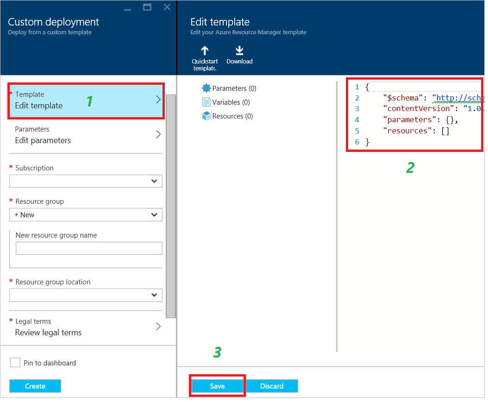
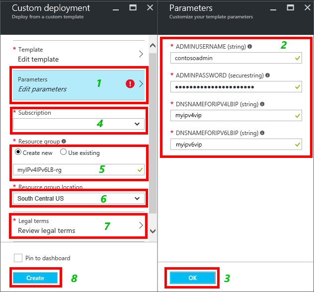

<properties
    pageTitle="Bereitstellen einer internetfähigen Lastenausgleich-Lösung mit IPv6 mithilfe einer Vorlage | Microsoft Azure"
    description="Informationen zum IPv6-Unterstützung für Lastenausgleich Azure und Lastenausgleich virtuellen Computern bereitstellen."
    services="load-balancer"
    documentationCenter="na"
    authors="sdwheeler"
    manager="carmonm"
    editor=""
    tags="azure-resource-manager"
    keywords="IPv6, Azure Lastenausgleich, zwei Stapel, öffentliche IP-Adresse, native ipv6, Mobile, iot"
/>
<tags
    ms.service="load-balancer"
    ms.devlang="na"
    ms.topic="article"
    ms.tgt_pltfrm="na"
    ms.workload="infrastructure-services"
    ms.date="09/14/2016"
    ms.author="sewhee"
/>

# Bereitstellen einer internetfähigen Lastenausgleich-Lösung mit IPv6 mithilfe einer Vorlage

> [AZURE.SELECTOR]
- [PowerShell](./load-balancer-ipv6-internet-ps.md)
- [Azure CLI](./load-balancer-ipv6-internet-cli.md)
- [Vorlage](./load-balancer-ipv6-internet-template.md)

Ein Azure Lastenausgleich ist ein Lastenausgleich Layer 4 (TCP, UDP). Lastenausgleich bietet hohe Verfügbarkeit durch eingehenden Datenverkehr zwischen Dienstinstanzen fehlerfrei, in der Cloud Services oder virtuellen Computern in einer Gruppe von laden Lastenausgleich verteilen. Azure Lastenausgleich können auch Dienste auf mehrere Ports, mehrere IP-Adressen oder beides präsentieren.

## Beispiel für Bereitstellungsszenario

Das folgende Diagramm veranschaulicht den Lastenausgleich Lösung mithilfe der in diesem Artikel beschriebenen Beispielvorlage bereitgestellt wird.

In diesem Szenario erstellen Sie die folgenden Azure Ressourcen:

- eine virtuelle Schnittstelle für jeden virtuellen Computer mit zugewiesenen IPv4 und IPv6-Adressen
- eine Internet zugänglichen Lastenausgleich mit einer IPv4 und IPv6 öffentlichen IP-Adresse
- zwei laden Lastenausgleich Regeln zum Zuordnen der öffentlichen VIPs an die Endpunkte als "Privat"
- eine Verfügbarkeit festzulegen, die die beiden virtuellen Computern enthält.
- zwei virtuellen Computern (virtuellen Computern)

## Bereitstellen der Vorlage über das Azure-portal

In diesem Artikel verweist auf eine Vorlage, die in den Katalog [Azure Schnellstart Vorlagen](https://azure.microsoft.com/documentation/templates/201-load-balancer-ipv6-create/) veröffentlicht wird. Können Sie die Vorlage aus dem Katalog herunterladen oder die Bereitstellung in Azure direkt aus dem Katalog starten. In diesem Artikel wird vorausgesetzt, dass Sie die Vorlage auf Ihrem lokalen Computer heruntergeladen haben.

1. Öffnen Sie die Azure-Portal, und melden Sie sich mit einem Konto mit Berechtigungen zum Erstellen von virtuellen Computern und Netzwerke Ressourcen innerhalb eines Azure-Abonnements. Auch, es sei denn, Sie vorhandene Ressourcen verwenden, benötigt das Konto über die Berechtigung zum Erstellen einer Ressourcengruppe und Speicher-Konto.

2. Klicken Sie auf "+ Neu" im Menü dann den Typ "Vorlage" in das Suchfeld. Wählen Sie "Vorlage Bereitstellung" in den Suchergebnissen aus.

    

3. In der alles Blade, klicken Sie auf "Vorlage Bereitstellung".

    

4. Klicken Sie auf "Erstellen".

    

5. Klicken Sie auf "Vorlage bearbeiten" aus. Löschen Sie den vorhandenen Inhalt kopieren und Einfügen in der gesamte Inhalt der Vorlagendatei (zum Einschließen starten und Beenden von {}), und klicken Sie auf "Speichern".

    > [AZURE.NOTE] Wenn Sie Microsoft Internet Explorer, Sie Sie beim Einfügen verwenden werden Sie aufgefordert, den Zugriff auf die Windows-Zwischenablage zulassen das Dialogfeld wird angezeigt. Klicken Sie auf "Zugriff gewähren" aus.

    

6. Klicken Sie auf "Parameter bearbeiten" aus. Der Parameter Blade Geben Sie die Werte pro den Anweisungen im Abschnitt Parameter Vorlage, und klicken Sie dann klicken Sie auf "Speichern", um das Blade Parameter zu schließen. Wählen Sie Ihr Abonnement, eine vorhandene Ressourcengruppe das benutzerdefinierte Bereitstellung Blade oder erstellen Sie eine. Wenn Sie eine Ressourcengruppe erstellen, wählen Sie einen Speicherort für die Ressourcengruppe. Als Nächstes **Vertragsbedingungen**, klicken Sie auf **Einkauf** für die Vertragsbedingungen. Azure beginnt die Ressourcen bereitstellen. Dauert einige Minuten alle Ressourcen bereitgestellt.

    

    Weitere Informationen zu diesen Parametern finden Sie im Abschnitt " [Vorlagenparameter und Variablen](#template-parameters-and-variables) " weiter unten in diesem Artikel.

7. Um die erstellte Vorlage Ressourcen anzuzeigen, klicken Sie auf Durchsuchen, führen Sie einen Bildlauf in der Liste nach unten aus, bis Sie finden Sie unter "Ressourcengruppen", und sie klicken.

    

8. Klicken Sie auf das Blade Ressource Gruppen klicken Sie auf den Namen der Ressourcengruppe, die Sie in Schritt 6 angegeben haben. Wird eine Liste aller Ressourcen, die bereitgestellt wurden. Wenn alles erfolgreich verläuft, sollten sie "Erfolgreich" unter "Letzte Bereitstellung" angenommen. Wenn nicht, stellen Sie sicher, dass das Konto, das Sie verwenden Berechtigungen zum Erstellen der erforderlichen Ressourcen verfügt.

    

    > [AZURE.NOTE] Wenn Sie Ihre Ressourcengruppen unmittelbar nach Durchführung von Schritt 6 suchen, wird "Letzte Bereitstellung" den Status "Bereitstellen von" angezeigt, während die Ressourcen bereitgestellt werden.

9. Klicken Sie auf "myIPv6PublicIP" in der Liste der Ressourcen. Sie sehen, dass sie eine IPv6-Adresse unter IP-Adresse hat und seinen DNS-Namen der Wert ist, die, den Sie für den Parameter dnsNameforIPv6LbIP in Schritt 6 angegeben haben. Diese Ressource ist der öffentlichen IPv6-Adresse und Host Name, der mit Internet-Clients zugegriffen werden kann.

    

## Überprüfen Sie die Konnektivität

Wenn die Vorlage erfolgreich bereitgestellt haben wurde, können Sie die Verbindung, indem Sie die folgenden Aufgaben überprüfen:

1. Melden Sie sich bei der Azure-Portal und zu den einzelnen der virtuellen Computern erstellte Vorlage-Bereitstellung verbinden. Wenn Sie ein Windows Server virtueller Computer, führen Sie Ipconfig bereitgestellt/alle über eine Befehlszeile. Sie sehen, dass die virtuellen Computern IPv4 und IPv6-Adressen. Wenn Sie Linux virtuellen Computern bereitgestellt haben, müssen Sie das Betriebssystem Linux zum Empfangen von dynamischer IPv6-Adressen anhand der Anweisungen zur Verfügung gestellt Ihrer Linux Verteilung konfigurieren.
2. Rufen Sie einem IPv6 Internet verbundenen-Client eine Verbindung mit der öffentlichen IPv6-Adresse des Lastenausgleich aus. Um zu bestätigen, dass der Lastenausgleich zwischen den beiden virtuellen Computern Lastenausgleich ist, könnten Sie einen Webserver wie Microsoft Internet Information Services (IIS) auf jedem der virtuellen Computern installieren. Der Standard-Webseite auf jedem Server konnte den Text "Server0" oder "Server1" zur eindeutigen Identifizierung enthalten. Klicken Sie dann öffnen Sie einen Internetbrowser auf einem Client IPv6-Internet verbunden, und navigieren Sie Sie zu der Hostname angegeben haben, für den Parameter dnsNameforIPv6LbIP des Lastenausgleich, End-to-End-IPv6-Konnektivität zu jeder virtuellen Computer zu bestätigen. Wenn Sie nur die Webseite mit nur einem Server angezeigt wird, müssen Sie Ihren Browsercache zu leeren. Mehrere private Browsen Sitzungen zu öffnen. Es sollte eine Antwort von jedem Server angezeigt.
3. Rufen Sie einem IPv4 Internet verbundenen-Client eine Verbindung mit der öffentlichen IPv4-Adresse des Lastenausgleich aus. Bestätigen, dass Lastenausgleich den Lastenausgleich der zwei virtuellen Computern ist, können Sie mit IIS, wie in Schritt2 testen.
4. Rufen Sie aus jeder virtueller Computer eine ausgehende Verbindung mit einem Gerät IPv6 oder Internet IPv4 verbunden. In beiden Fällen ist die Quelle IP-Adresse angezeigt, die vom Zielgerät der öffentlichen IPv4 oder IPv6-Adresse des Lastenausgleich.

>[AZURE.NOTE]
ICMP für IPv4 und IPv6 ist im Netzwerk Azure blockiert. Daher fehl ICMP-Tools, wie immer pingen. Verwenden Sie zum Testen der Konnektivität eine Alternative TCP wie TCPing oder das Cmdlet PowerShell Test-NetConnection aus. Beachten Sie, dass die IP-Adressen, die im Diagramm angezeigten Beispiele für Werte sind, die möglicherweise auftreten. Da die IPv6-Adressen dynamisch zugewiesen werden, unterscheiden sich die Adressen, die Sie erhalten, und können variieren je nach Region. Darüber hinaus ist es üblich, für die öffentliche IPv6-Adresse auf dem Lastenausgleich, um ein anderes Präfix als die privaten IPv6-Adressen in die Back-End-Ressourcenpool zu starten.

## Vorlagenparameter und Variablen

Eine Vorlage Azure Ressourcenmanager enthält mehrere Variablen und Parameter, die Sie an Ihre Bedürfnisse anpassen können. Variablen werden für feste Werte verwendet, die Sie nicht, dass einen Benutzer ändern möchten. Parameter dienen Werte, die einen Benutzer angeben, wenn Sie die Vorlage bereitstellen soll. Die Beispielvorlage ist für den in diesem Artikel beschriebenen konfiguriert. Sie können dies in Ihrer Umgebung Anforderungen anpassen.

Der in diesem Artikel verwendeten Beispielvorlage umfasst die folgenden Variablen und Parameter:

| Parameter / Variable | Notizen |
|-----------|-------|
| adminUsername | Geben Sie den Namen des Administratorkontos verwendet, um den virtuellen Computern mit melden Sie sich an. |
| adminPassword | Geben Sie das Kennwort für das Administratorkonto verwendet, um den virtuellen Computern mit melden Sie sich an. |
| dnsNameforIPv4LbIP | Geben Sie den DNS-Hostnamen, die, den Sie als öffentliche Namen des Lastenausgleich zuweisen möchten. Dieser Name wird in den Lastenausgleich öffentlichen IPv4-Adresse aufgelöst werden. Der Name muss Kleinbuchstaben und dem regulären Ausdruck übereinstimmen: ^ [a-z][a-z0-9-]{1,61}[a-z0-9]$. |
| dnsNameforIPv6LbIP | Geben Sie den DNS-Hostnamen, die, den Sie als öffentliche Namen des Lastenausgleich zuweisen möchten. Dieser Name wird in den Lastenausgleich öffentlichen IPv6-Adresse aufgelöst werden. Der Name muss Kleinbuchstaben und dem regulären Ausdruck übereinstimmen: ^ [a-z][a-z0-9-]{1,61}[a-z0-9]$. Dies kann es sich um denselben Namen wie die IPv4-Adresse sein. Wenn ein Client sendet eine DNS-Abfrage für diesen Namen, erhalten Sie Azure Einträge sowohl A als auch AAAA an der Namen freigegeben werden. |
| vmNamePrefix | Geben Sie das Präfix virtueller Computer an. Die Vorlage fügt eine Zahl (0; 1; usw.) auf den Namen, wenn die virtuellen Computern erstellt werden. |
| nicNamePrefix | Geben Sie das Präfix Netzwerk Benutzeroberfläche an. Die Vorlage fügt eine Zahl (0; 1; usw.) auf den Namen, wenn die Netzwerk-Schnittstellen erstellt werden. |
| storageAccountName | Geben Sie den Namen eines vorhandenen Kontos Speicher, oder geben Sie den Namen eines neuen, indem Sie die Vorlage erstellt werden. |
| availabilitySetName | Geben Sie dann die Namen der Verfügbarkeit einzurichten, die mit den virtuellen Computern verwendet werden |
| addressPrefix | Die Adresspräfix verwendet, um den Adressbereich des virtuellen Netzwerks definieren. |
| subnetName | Der Namen der im Subnetz der für die VNet erstellt |
| subnetPrefix | Das Adresspräfix des Adressbereichs eines im Subnetz definieren |
| vnetName | Geben Sie den Namen für die VNet von den virtuellen Computern verwendet. |
| ipv4PrivateIPAddressType | Die Methode der Verteilung für die private IP-Adresse (statisch oder dynamisch) verwendet |
| ipv6PrivateIPAddressType | Die Methode der Verteilung für die private IP-Adresse (Dynamic) verwendet. IPv6 unterstützt nur die dynamische Zuordnung. |
| numberOfInstances | Die Anzahl der Lastenausgleich Instanzen von der Vorlage bereitgestellt |
| ipv4PublicIPAddressName | Geben Sie den DNS-Namen, die, den Sie zur Kommunikation mit der öffentlichen IPv4-Adresse des Lastenausgleich verwenden möchten. |
| ipv4PublicIPAddressType | Die Methode der Verteilung für die öffentliche IP-Adresse (statisch oder dynamisch) verwendet |
| Ipv6PublicIPAddressName | Geben Sie den DNS-Namen, die, den Sie zur Kommunikation mit der öffentlichen IPv6-Adresse des Lastenausgleich verwenden möchten. |
| ipv6PublicIPAddressType | Die Methode der Verteilung für die öffentliche IP-Adresse (Dynamic) verwendet. IPv6 unterstützt nur die dynamische Zuordnung. |
| lbName | Geben Sie den Namen des Lastenausgleich. Dieser Name wird im Portal oder beim Verweisen auf ihn mit einem CLI oder PowerShell-Befehl verwendet. |

Die restlichen Variablen in der Vorlage abgeleiteten Werte enthalten, die zugewiesen werden, wenn Azure die Ressourcen erstellt. Diese Variablen werden nicht geändert werden.
