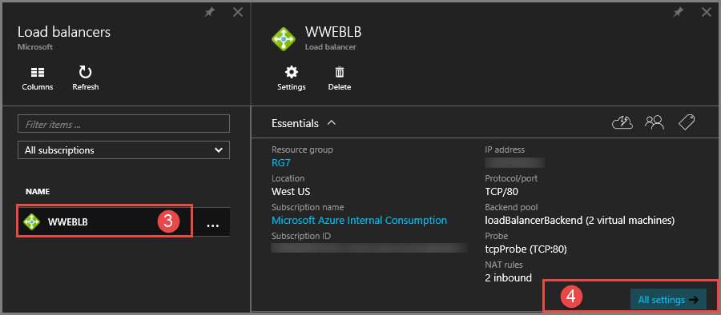

<properties
   pageTitle="Überwachen von Vorgängen, Ereignisse und Indikatoren für Lastenausgleich | Microsoft Azure"
   description="Informationen Sie zum Aktivieren von Ereignissen benachrichtigen und Gesundheit Status Protokollierung für Lastenausgleich Azure Prüfpunkt"
   services="load-balancer"
   documentationCenter="na"
   authors="sdwheeler"
   manager="carmonm"
   editor="tysonn"
   tags="azure-resource-manager"
/>
<tags
   ms.service="load-balancer"
   ms.devlang="na"
   ms.topic="article"
   ms.tgt_pltfrm="na"
   ms.workload="infrastructure-services"
   ms.date="10/24/2016"
   ms.author="sewhee" />

# Log Analytics für Azure Lastenausgleich (Preview)

Sie können verschiedene Arten von Protokollen in Azure verwalten und Behandeln von Problemen mit Lastenausgleich verwenden. Einige dieser Protokolle können über das Portal zugegriffen werden. Alle Protokolle können aus einem Azure Blob-Speicher extrahiert und in anderen Tools, wie etwa Excel und PowerBI angezeigt werden. Sie erhalten weitere Informationen zu den verschiedenen Arten von Protokollen in der nachstehenden Liste aus.

- **Überwachungsprotokolle:** Sie können [Überwachungsprotokolle Azure](../../articles/monitoring-and-diagnostics/insights-debugging-with-events.md) (ehemals Betriebsprotokolle) verwenden, um alle Vorgänge, die auf Ihre Azure-Abonnements und deren Status übermittelt anzuzeigen. Überwachungsprotokolle sind standardmäßig aktiviert, und Sie können im Azure-Portal angezeigt werden.
- **Ereignisprotokollen benachrichtigen:** Sie können dieses Protokoll verwenden, um anzuzeigen, welche Warnungen für Lastenausgleich ausgelöst werden. Der Status für den Lastenausgleich werden alle fünf Minuten erfasst. Dieses Protokoll wird nur geschrieben, wenn eine Benachrichtigung laden Lastenausgleich-Ereignis ausgelöst wird.
- **Gesundheit Prüfpunkt Protokolle:** Dieses Protokoll können zur Suche nach Prüfpunkt Kontrollkästchen Integritätsstatus, wie viele Instanzen laden Lastenausgleich Back-End und Prozentsatz der virtuellen Computern empfangen Netzwerkdatenverkehr aus dem Lastenausgleich online sind. Dieses Protokoll bezieht sich auf Prüfpunkt Status Ereignis ändern.

>[AZURE.IMPORTANT] Melden Sie sich Analytics arbeitet derzeit nur mit Verbindung zum Internet Lastenausgleich. Protokolle stehen nur für Ressourcen, die im Bereitstellungsmodell Ressourcenmanager bereitgestellt. Sie können keine Protokolle für Ressourcen im Bereitstellungsmodell klassischen verwenden. Weitere Informationen über die Bereitstellungsmodelle finden Sie unter [Grundlegendes zu Ressourcenmanager und klassischen Bereitstellung](../../articles/resource-manager-deployment-model.md).

## Aktivieren der Protokollierung

Überwachungsprotokollierung wird automatisch für alle Ressourcen des Ressourcenmanager aktiviert. Sie müssen Ereignis und Gesundheit Prüfpunkt Protokollierung zum Sammeln von Daten über diese Protokolle verfügbar starten aktivieren. Gehen Sie folgendermaßen vor, um die Protokollierung zu aktivieren.

Anmelden Sie bei der [Azure-Portal](http://portal.azure.com). Wenn Sie noch kein Lastenausgleich, [Erstellen Sie ein Lastenausgleich haben](load-balancer-get-started-internet-arm-ps.md) , bevor Sie fortfahren.

1. Klicken Sie im Portal auf **Durchsuchen**.
2. Wählen Sie **zum Lastenausgleich**aus.

    

3. Wählen Sie eine vorhandene Lastenausgleich >> **Alle Einstellungen**.
4. Klicken Sie auf der rechten Seite des Dialogfelds unter dem Namen des Lastenausgleich Ausführen eines Bildlaufs zur **Überwachung**, klicken Sie auf **Diagnose**.

    

5. Wählen Sie im Bereich **Diagnose** unter **Status** **auf**.
6. Klicken Sie auf **Speicher-Konto**.
7. Wählen Sie unter **Protokolle**ein vorhandenes Speicherkonto aus, oder Erstellen eines neuen Kontos. Verwenden Sie den Schieberegler, um zu bestimmen, wie viele Tage Ereignis Dat in den Ereignisprotokollen aufbewahrt werden. 8. Klicken Sie auf **Speichern**.

    

>[AZURE.INFORMATION] Überwachungsprotokolle keiner separaten Speicher-Konto erforderlich. Die Verwendung Speicher für Ereignis und Gesundheit entstehen Prüfpunkt Protokollierung Dienst Gebühren.

## Überwachungsprotokoll

Standardmäßig wird das Überwachungsprotokoll generiert. Die Protokolle werden 90 Tage lang in der Azure-Ereignisprotokollen Store beibehalten. Weitere Informationen zu diesen Protokollen durch [Ereignisse anzeigen und Überwachungsprotokolle](../../articles/monitoring-and-diagnostics/insights-debugging-with-events.md) Artikel lesen.

## Ereignisprotokoll benachrichtigen

Dieses Protokoll wird nur ausgelöst, wenn Sie es aktiviert haben, klicken Sie auf eine pro Lastenausgleich laden. Die Ereignisse sind im JSON-Format protokolliert und im Speicherkonto, die, das Sie angegeben haben, wenn Sie die Protokollierung aktiviert, gespeichert werden. So sieht ein Beispiel für ein Ereignis.

    {
    "time": "2016-01-26T10:37:46.6024215Z",
    "systemId": "32077926-b9c4-42fb-94c1-762e528b5b27",
    "category": "LoadBalancerAlertEvent",
    "resourceId": "/SUBSCRIPTIONS/XXXXXXXXXXXXXXXXX-XXXX-XXXX-XXXXXXXXX/RESOURCEGROUPS/RG7/PROVIDERS/MICROSOFT.NETWORK/LOADBALANCERS/WWEBLB",
    "operationName": "LoadBalancerProbeHealthStatus",
    "properties": {
        "eventName": "Resource Limits Hit",
        "eventDescription": "Ports exhausted",
        "eventProperties": {
            "public ip address": "40.117.227.32"
        }
    }

Die JSON-Ausgabe zeigt die Eigenschaft *Eventname* , in den Grund für eine Benachrichtigung erstellt Lastenausgleich beschrieben wird. In diesem Fall wurde die Benachrichtigung generiert Kaliumchloridvorkommen TCP Port zurückzuführen Quelle IP NAT Grenzwerte (SNAT) ein.

## Gesundheit Prüfpunkt log

Dieses Protokoll wird nur ausgelöst, wenn Sie es aktiviert haben, klicken Sie auf eine pro laden Lastenausgleich Basis als detaillierte oben. Die Daten werden in dem Speicherkonto gespeichert, die Sie angegeben haben, wenn Sie die Protokollierung aktiviert. Ein Container namens 'Einsichten Protokolle Loadbalancerprobehealthstatus' wird erstellt, und die folgenden Daten protokolliert:

    {
        "records":
        {
            "time": "2016-01-26T10:37:46.6024215Z",
            "systemId": "32077926-b9c4-42fb-94c1-762e528b5b27",
            "category": "LoadBalancerProbeHealthStatus",
            "resourceId": "/SUBSCRIPTIONS/XXXXXXXXXXXXXXXXX-XXXX-XXXX-XXXX-XXXXXXXXX/RESOURCEGROUPS/RG7/PROVIDERS/MICROSOFT.NETWORK/LOADBALANCERS/WWEBLB",
            "operationName": "LoadBalancerProbeHealthStatus",
            "properties": {
                "publicIpAddress": "40.83.190.158",
                "port": "81",
                "totalDipCount": 2,
                "dipDownCount": 1,
                "healthPercentage": 50.000000
            }
        },
        {
            "time": "2016-01-26T10:37:46.6024215Z",
            "systemId": "32077926-b9c4-42fb-94c1-762e528b5b27",
            "category": "LoadBalancerProbeHealthStatus",
            "resourceId": "/SUBSCRIPTIONS/XXXXXXXXXXXXXXXXX-XXXX-XXXX-XXXX-XXXXXXXXX/RESOURCEGROUPS/RG7/PROVIDERS/MICROSOFT.NETWORK/LOADBALANCERS/WWEBLB",
            "operationName": "LoadBalancerProbeHealthStatus",
            "properties": {
                "publicIpAddress": "40.83.190.158",
                "port": "81",
                "totalDipCount": 2,
                "dipDownCount": 0,
                "healthPercentage": 100.000000
            }
        }
    }

Die JSON-Ausgabe zeigt die grundlegende Informationen für den Prüfpunkt Status in das Feld "Eigenschaften" aus. Die Eigenschaft " *DipDownCount* " zeigt die Gesamtzahl der Instanzen auf die Back-End der Netzwerkdatenverkehr aufgrund der fehlerhaften Prüfpunkt Antworten werden nicht empfangen werden.

## Anzeigen und Analysieren des Überwachungsprotokolls

Sie können anzeigen und analysieren die Überwachungsprotokolldaten verwenden eine der folgenden Methoden:

- **Azure Tools:** Abrufen von Informationen aus der Überwachungsprotokolle bis Azure PowerShell, Azure Command Line Interface (CLI), die Azure REST-API oder im Portal Azure Vorschau. Eine schrittweise Anleitung für die einzelnen Methoden werden im Artikel [Audit Vorgänge mit Ressourcenmanager](../../articles/resource-group-audit.md) detailliert beschrieben.
- **Power BI:** Wenn Sie noch nicht über eine [Power BI](https://powerbi.microsoft.com/pricing) -Konto verfügen, können Sie ihn kostenlos versuchen. Verwenden die [Überwachungsprotokolle Azure Inhalte Pack für Power BI](https://powerbi.microsoft.com/documentation/powerbi-content-pack-azure-audit-logs), können Sie Ihre Daten mit vorkonfiguriertes Dashboards analysieren oder können Sie Ansichten, die Ihren Anforderungen entsprechend anpassen.

## Zeigen Sie an und analysieren Sie der Prüfpunkt Gesundheit und Ereignisprotokoll

Sie müssen eine Verbindung mit Ihrem Speicherkonto und die JSON-Protokolleinträge für Ereignis und Gesundheit Prüfpunkt Protokolle abrufen. Nachdem Sie die JSON-Dateien heruntergeladen haben, können Sie diese CSV-und Ansicht in Excel, PowerBI oder andere Daten Visualisierungstool konvertieren.

>[AZURE.TIP] Wenn Sie mit Visual Studio und grundlegende Konzepte zum Ändern der Werte für die Konstanten und Variablen in c# vertraut sind, können Sie den [Log Konverter Tools](https://github.com/Azure-Samples/networking-dotnet-log-converter) unter Github.

## Zusätzliche Ressourcen

- [Visualisieren der Überwachungsprotokolle Azure mit Power BI](http://blogs.msdn.com/b/powerbi/archive/2015/09/30/monitor-azure-audit-logs-with-power-bi.aspx) -Blogbeitrag.
- [Anzeigen und Analysieren von Azure Überwachungsprotokolle in Power BI und vieles mehr](https://azure.microsoft.com/blog/analyze-azure-audit-logs-in-powerbi-more/) Blogbeitrag veröffentlichen.

## Nächste Schritte

[Grundlegendes zu laden Lastenausgleich Prüfpunkte](load-balancer-custom-probe-overview.md)
