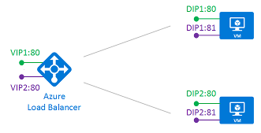

<properties
   pageTitle="Mehrere VIPs für Azure Lastenausgleich | Microsoft Azure"
   description="Übersicht über mehrere VIPs auf Azure Lastenausgleich"
   services="load-balancer"
   documentationCenter="na"
   authors="chkuhtz"
   manager="narayan"
   editor=""
/>
<tags
   ms.service="load-balancer"
   ms.devlang="na"
   ms.topic="article"
   ms.tgt_pltfrm="na"
   ms.workload="infrastructure-services"
   ms.date="08/11/2016"
   ms.author="chkuhtz"
/>

# Mehrere VIPs für Azure Lastenausgleich

Azure Lastenausgleich können Sie Doppelraten-Dienste auf mehrere Ports, mehrere IP-Adressen oder beides zu laden. Öffentliche und interne laden Lastenausgleich Definitionen können Sie um Saldo Zahlungen über eine Reihe von virtuellen Computern zu laden.

In diesem Artikel werden die Grundlagen von dieser Möglichkeit, wichtige Konzepte vorgestellt und Einschränkungen. Wenn Sie nur die Dienste einer IP-Adresse auf dem Server verfügbar machen möchten, finden Sie, dass vereinfachte Anweisungen für [Öffentliche](load-balancer-get-started-internet-portal.md) oder [interne](load-balancer-get-started-ilb-arm-portal.md) Lastenausgleich Konfigurationen laden. Hinzufügen von mehreren VIPs ist inkrementell für eine einzelne VIP-Konfiguration. Die Konzepte in diesem Artikel verwenden, können Sie jederzeit eine vereinfachte Konfiguration erweitern.

Wenn Sie eine Azure Lastenausgleich definieren, sind einer Front-End und einem Back-End-Konfiguration mit Regeln verbunden. Der Dienststatus Prüfpunkt optimiert die Regel wird verwendet, um zu bestimmen, wie neue Zahlungen, die mit einem Knoten in die Back-End-Pool gesendet werden. Durch eine virtuelle IP-Adresse (VIP), ist ein 3-Tupel aus besteht eine IP-Adresse (public oder internal), ein Transportprotokoll (UDP oder TCP) und eine Port-Nummer wird der Front-End definiert. Ein DIP ist eine IP-Adresse auf einer Azure Virtueller NIC, eines virtuellen Computers in die Back-End-Ressourcenpool angefügt.

Die folgende Tabelle enthält einige Beispiel Front-End-Konfigurationen:

| VIP | IP-Adresse | Protokoll | Port |
|-----|------------|----------|------|
|1|65.52.0.1|TCP|80|
|2|65.52.0.1|TCP|_8080_|
|3|65.52.0.1|_UDP_|80|
|4|_65.52.0.2_|TCP|80|

Die Tabelle enthält vier verschiedene Frontends. Frontends #1, #2 und 3 # sind eine einzelne VIP mit mehreren Regeln. Die IP-Adresse wird verwendet, aber die Port oder Protokoll unterscheidet sich für jedes Front-End. Frontends #1 und #4 sind ein Beispiel für mehrere VIPs, wo die gleichen Front-End-Protokoll und den Port über mehrere VIPs wiederverwendet werden.

Azure Lastenausgleich sorgt für Flexibilität in den Lastenausgleich Regeln definieren. Eine Regel deklariert wie eine Adresse und der Front-End-Port an die Zieladresse und den Port auf die Back-End-zugeordnet ist. Unabhängig davon, ob die Back-End-Ports über Regeln wiederverwendet werden, hängt von den Typ der Regel. Jede Regel hat bestimmte Anforderungen, die Host-Konfiguration und Prüfpunkt Entwurf beeinflussen können. Es gibt zwei Arten von Regeln:

1. Der Standard-Regel mit keine Back-End-Anschluss Wiederverwendung
2. Die beweglich IP-Regel, in dem Back-End-Ports wiederverwendet werden

Azure Lastenausgleich können Sie beide Regeltypen auf die gleiche laden Lastenausgleich Konfiguration mischen. Lastenausgleich können sie gleichzeitig für einen bestimmten virtuellen Computer oder eine beliebige Kombination, verwenden, solange Sie die Einschränkungen der Regel erfüllen. Welche Regeltyp, die Sie auswählen, hängt davon ab, den Anforderungen Ihrer Anwendung und die Komplexität der Unterstützung für der Konfigurations. Sie sollten auswerten, welche Regeltypen für Ihr Szenario am besten geeignet sind.

Wir untersuchen diese Szenarios weiteren durch das Standardverhalten ab.

## Regeltyp #1: keine Back-End-Anschluss Wiederverwendung

In diesem Szenario sind die Front-End-VIPs wie folgt konfiguriert:

| VIP | IP-Adresse | Protokoll | Port |
|-----|------------|----------|------|
| 1|65.52.0.1|TCP|80|
| 2|*65.52.0.2*|TCP|80|

DIP ist das Ziel des eingehenden Flusses. In die Back-End-Ressourcenpool macht jedes virtuellen Computer den gewünschten Dienst auf einen eindeutigen Port auf einem DIP verfügbar. Dieser Dienst ist durch eine Regeldefinition der Front-End zugeordnet.

Wir definieren zwei Regeln:

| Regel | Zuordnen der Front-End | Back-End-Pool |
|------|--------------|-----------------|
| 1 |  VIP1:80 |  DIP1:80,  DIP2:80 |
| 2 |  VIP2:80 |  DIP1:81,  DIP2:81 |

Vollständige Zuordnung in Azure Lastenausgleich ist jetzt wie folgt aus:

| Regel | VIP IP-Adresse | Protokoll | Port | Ziel | Port |
|------|----------------|----------|------|-----|------|
| 1|65.52.0.1|TCP|80|Übergang IP-Adresse|80|
| 2|65.52.0.2|TCP|80|Übergang IP-Adresse|81|

Jede Regel muss einen Fluss mit eine eindeutige Kombination aus IP-Zieladresse und Zielanschluss ergeben. Durch variieren des Ziel-Ports des Flusses, können mehrere Regeln Zahlungen denselben DIP andere Ports vorführen.

Gesundheit Prüfpunkte werden immer an DIP eines virtuellen Computers geleitet. Sie müssen Sie sicherstellen, dass Ihre Prüfpunkt die Integrität des den virtuellen Computer wiedergibt.

## Regeltyp #2: Back-End-Anschluss Wiederverwendung mithilfe von IP beweglich

Azure Lastenausgleich bietet die Flexibilität den Front-End-Anschluss über mehrere VIPs unabhängig von der verwendeten Regeltyp wiederverwenden. Darüber hinaus werden einige Anwendungsszenarien lieber oder erfordern den gleichen Anschluss von mehreren Anwendungsinstanzen eines einzelnen virtuellen Computers in die Back-End-Pool verwendet werden soll. Allgemeine Beispiele für Port Wiederverwendung Cluster für eine hohe Verfügbarkeit gehören, -virtuelle Netzwerkgeräte und mehrere TLS Endpunkte ohne erneute Verschlüsselung verfügbar zu machen.

Wenn Sie den Back-End-Anschluss über mehrere Regeln wiederverwenden möchten, müssen Sie in der Regeldefinition beweglich IP-aktivieren.

IP beweglich ist ein Teil des was als direkte Server zurückzugeben (DSR) bekannt ist. DSR besteht aus zwei Teilen: eine Fluss und eine IP-Adresse Zuordnungsschema. Auf einer Plattformebene arbeitet Azure Lastenausgleich immer in einen Fluss Suchtopologie DSR, unabhängig davon, ob beweglich IP-aktiviert ist. Dies bedeutet, dass der ausgehende Teil eines Flusses immer ordnungsgemäß neu geschrieben wird, um direkt auf den Ursprung wieder Datenfluss.

Mit der Standard-Regeltyp macht Azure einer herkömmlichen IP-Adresse Zuordnungsschema für erleichterte Bedienung für den Lastenausgleich verfügbar. Aktivieren von beweglich IP-ändert die IP-Adresse Zuordnungsschema für zusätzliche Flexibilität dürfen, wie unten beschrieben.

Das folgende Diagramm veranschaulicht diese Konfiguration:

In diesem Szenario weist jede virtueller Computer in die Back-End-Ressourcenpool drei Netzwerkschnittstellen:

* DIP: einen virtuellen Netzwerkadapter, mit dem virtuellen Computer (Azure des NIC Ressource) verknüpft ist
* VIP1: eine Loopbackschnittstelle innerhalb Gast OS, die mit IP-Adresse des VIP1 konfiguriert ist
* VIP2: eine Loopbackschnittstelle innerhalb Gast OS, die mit IP-Adresse des VIP2 konfiguriert ist

>[AZURE.IMPORTANT] Die Konfiguration der logischen Schnittstellen erfolgt innerhalb der Gast OS. Diese Konfiguration wird nicht ausgeführt oder vom Azure verwaltet. Ohne diese Konfiguration werden die Regeln nicht funktionieren. Gesundheit Prüfpunktdefinitionen verwenden den virtuellen Computer, anstatt die logische VIP DIP an. Daher muss der Dienst an einem DIP Port, die den Status des Diensts angeboten wirken sich auf die logischen VIP aus Prüfpunkt Antworten bereitstellen.

Nehmen wir an die gleiche Front-End-Konfiguration wie beim vorherigen Szenario:

| VIP | IP-Adresse | Protokoll | Port |
|-----|------------|----------|------|
| 1|65.52.0.1|TCP|80|
| 2|*65.52.0.2*|TCP|80|

Wir definieren zwei Regeln:

| Regel | Zuordnen der Front-End | Back-End-Pool |
|------|--------------|-----------------|
| 1 |  VIP1:80 |  VIP1:80 (in VM1 und VM2) |
| 2 |  VIP2:80 |  VIP2:80 (in VM1 und VM2) |

Die folgende Tabelle zeigt die vollständige Zuordnung in den Lastenausgleich:

| Regel | VIP IP-Adresse | Protokoll | Port | Ziel | Port |
|------|----------------|----------|------|-------------|------|
| 1|65.52.0.1|TCP|80|identisch VIP (65.52.0.1)|identisch VIP (80)|
| 2|65.52.0.2|TCP|80|identisch VIP (65.52.0.2)|identisch VIP (80)|

Das Ziel des eingehenden Flusses ist VIP-Adresse auf die Loopbackschnittstelle auf dem virtuellen Computer an. Jede Regel muss einen Fluss mit eine eindeutige Kombination aus IP-Zieladresse und Zielanschluss ergeben. Durch variieren die Ziel-IP-Adresse des Flusses, ist Port Wiederverwendung des gleichen virtuellen Computers möglich. Der Dienst wird an den Lastenausgleich durch Binden an der VIP-Adresse IP-Adresse und den Port der jeweiligen Loopbackschnittstelle bereitgestellt.

Beachten Sie, dass in diesem Beispiel wird den Ziel-Port nicht geändert wird. Obwohl hier ein beweglich IP-Szenario unterstützt Azure Lastenausgleich auch Definieren einer Regel, den Back-End-Zielanschluss neu zu schreiben und anderen vom Ziel Front-End-Port zu machen.

Der Regeltyp beweglich IP-beruht auf mehrere laden Lastenausgleich Konfigurationsmuster. Ein Beispiel für die aktuell verfügbare ist die Konfiguration [SQL AlwaysOn mit mehreren Empfängern](../virtual-machines/virtual-machines-windows-portal-sql-ps-alwayson-int-listener.md) . Im Laufe der Zeit werden wir mehrere der folgenden Szenarien Dokument.

## Einschränkungen

* Mehrere VIP Konfigurationen werden nur mit IaaS virtuellen Computern unterstützt.
* Mit der Regel beweglich IP-muss die Anwendung DIP für ausgehende Zahlungen verwenden. Falls Ihrer Anwendung an die VIP-Adresse, die so konfiguriert ist, klicken Sie auf die Loopbackschnittstelle im Gast OS bindet, SNAT ist dann nicht verfügbar, den ausgehenden Ablauf neu zu schreiben und des Ablaufs schlägt fehl.
* Öffentliche IP-Adressen müssen einen Effekt auf Abrechnung. Weitere Informationen finden Sie unter [IP-Adresse Preise](https://azure.microsoft.com/pricing/details/ip-addresses/)
* Abonnement Grenzwerte gelten. Weitere Informationen finden Sie unter [Beschränkungen Service](../azure-subscription-service-limits.md#networking-limits) Details.
