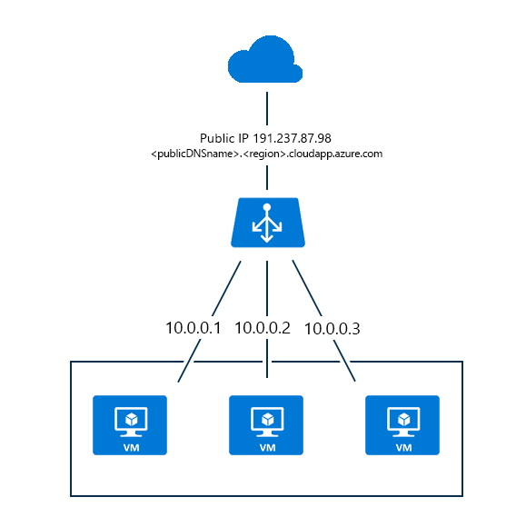

<properties
   pageTitle="Übersicht über die Azure Lastenausgleich | Microsoft Azure"
   description="Übersicht über Features, Architektur und Implementierung Azure Lastenausgleich. Erfahren Sie, wie Lastenausgleich funktioniert und in der Cloud zu nutzen."
   services="load-balancer"
   documentationCenter="na"
   authors="sdwheeler"
   manager="carmonm"
   editor="" />
<tags
   ms.service="load-balancer"
   ms.devlang="na"
   ms.topic="article"
   ms.tgt_pltfrm="na"
   ms.workload="infrastructure-services"
   ms.date="10/24/2016"
   ms.author="sewhee" />

# Azure Lastenausgleich (Übersicht)

Azure Lastenausgleich bietet Verfügbarkeit und Netzwerk-leistungsstarke den Clientanwendungen. Es ist ein Layer 4 (TCP, UDP) Lastenausgleich, die eingehenden Datenverkehr zwischen fehlerfrei Instanzen von Diensten in einem Lastenausgleich definiert verteilt.

Azure Lastenausgleich konfiguriert werden können:

* Laden Sie Saldo eingehenden Internetdatenverkehr an virtuellen Computern an. Diese Konfiguration wird als [Internet zugänglichen Lastenausgleich](load-balancer-internet-overview.md)bezeichnet.
* Laden Saldo Datenverkehr zwischen virtuellen Computern in einem Netzwerk virtuelle, in der Cloud Services-virtuellen Computern oder zwischen dem lokalen Computer und in einem Cross lokale virtuelle Netzwerk-virtuellen Computern. Diese Konfiguration wird als [internen Lastenausgleich](load-balancer-internal-overview.md)bezeichnet.
* Weiterleiten von externen Datenverkehr an einem bestimmten virtuellen Computern.

Alle Ressourcen in der Cloud benötigen Sie eine öffentliche IP-Adresse aus dem Internet erreichbar ist. Die Cloud-Infrastruktur in Azure wird nicht geroutet IP-Adressen für die eigenen Ressourcen verwendet. Azure verwendet Netzwerk Adresse (Netzwerkadressübersetzung) mit öffentlichen IP-Adressen für die Kommunikation mit dem Internet.

## Modelle Azure-Bereitstellung

Es ist wichtig, die Unterschiede zwischen der Azure klassischen und Ressourcenmanager [Bereitstellungsmodelle](../resource-manager-deployment-model.md)zu verstehen. Azure Lastenausgleich wird in jedem Modell anders konfiguriert.

### Klassische Azure-Bereitstellungsmodell

Um ein Lastenausgleich verwenden, können virtuellen Computern innerhalb einer Begrenzung der Cloud-Dienst bereitgestellt gruppiert werden. Diese modellieren einer öffentlichen IP-Adresse und eine Fully Qualified Domain Name, (FQDN) auf einen Clouddienst zugewiesen sind. Lastenausgleich Übersetzung port, und Laden von Salden den Netzwerkdatenverkehr mithilfe der öffentlichen IP-Adresse für den Clouddienst.

Datenfluss Lastenausgleich wird durch die Endpunkte definiert. Port für die Übersetzung Endpunkte verfügen über eine 1: 1-Beziehung zwischen den öffentlichen zugewiesen Port der öffentlichen IP-Adresse und den lokalen Port mit dem Dienst auf eine bestimmte virtuellen Computern zugewiesen. Laden Lastenausgleich Endpunkte verfügen über eine 1: n-Beziehung zwischen der öffentlichen IP-Adresse und die lokalen Ports, die Dienste auf den virtuellen Computern in der Cloud-Dienst zugewiesen ist.

Abbildung 1: Azure Lastenausgleich im Bereitstellungsmodell klassischen

Die Komponenten des Domänennamens für die öffentliche IP-Adresse, den Lastenausgleich für dieses Bereitstellungsmodell verwendet wird \<Cloud-Dienstnamen\>. cloudapp.net. Die folgende Abbildung zeigt den Lastenausgleich Azure in diesem Modell.

### Modell zur Bereitstellung von Azure Ressourcenmanager

Im Bereitstellungsmodell Ressourcenmanager besteht keine Notwendigkeit zum Erstellen eines Cloud-Diensts. Lastenausgleich wird erstellt, um den Datenverkehr zwischen mehreren virtuellen Computern explizit weiterzuleiten.

Eine öffentliche IP-Adresse ist eine einzelne Ressource, die eine Domäne Bezeichnung (DNS-Name) enthält. Die öffentliche IP-Adresse ist die Auslastung Lastenausgleich Ressource zugeordnet. Laden Lastenausgleich und eingehenden NAT-Regeln verwenden die öffentliche IP-Adresse als Endpunkt Internet für die Ressourcen, die Netzwerkverkehr mit Lastenausgleich erhält.

Die Netzwerkschnittstellenressource angefügter eines virtuellen Computers ist eine private oder öffentliche IP-Adresse zugewiesen. Nachdem ein Lastenausgleich Back-End-IP-Adresse Ressourcenpool Netzwerk-Schnittstellen hinzugefügt wird, kann Lastenausgleich senden Lastenausgleich Netzwerkverkehr basierend auf den Lastenausgleich Regeln, die erstellt werden.

Die folgende Abbildung zeigt den Lastenausgleich Azure in diesem Modell:

Abbildung 2: Azure Lastenausgleich in Ressourcenmanager

Lastenausgleich kann über Ressourcenmanager-basierten Vorlagen, APIs und Tools verwaltet werden. Lesen Sie weitere Informationen zu Ressourcenmanager finden Sie die [Ressourcenmanager Übersicht](../azure-resource-manager/resource-group-overview.md)aus.

## Laden Sie Lastenausgleich features

* Hashbasierten Verteilung

    Azure Lastenausgleich verwendet einen hashbasierten Verteilung zurück. Standardmäßig wird einen 5-Tupel Hash setzt sich aus Quelle IP-, Quellport, IP-Zieladresse, Zielport und Protokolltyp verfügbaren Server den Datenverkehr zuzuordnen verwendet. Darüber Klebrigkeit nur *innerhalb* einer Transportregel-Sitzung. In derselben Sitzung TCP- oder UDP-Pakete werden in der gleichen Instanz hinter den Lastenausgleich Endpunkt geleitet. Wenn der Client schließt und öffnet die Verbindung erneut oder eine neue Sitzung von der gleichen Quelle IP-Adresse startet, ändert sich der Quellport aus. Dies kann den Datenverkehr, wechseln Sie zu einem anderen Endpunkt in einem anderen Datencenter führen.

    Weitere Informationen hierzu finden Sie unter [Laden Lastenausgleich Verteilung Modus](load-balancer-distribution-mode.md). Die folgende Abbildung zeigt die Verteilung hashbasierten:

    

    Abbildung 3 - basierten Hash Verteilung

* Port Weiterleitung

    Azure Lastenausgleich bietet, die Sie steuern, wie eingehende Kommunikation über die verwaltet wird. Diese Kommunikation umfasst initiiert von Internet-Hosts, virtuellen Computern in anderen Cloud Services oder virtuelle Netzwerke Datenverkehr an. Dieses Steuerelement wird durch einen Endpunkt (auch von außen liegenden Tabellenblättern genannt) dargestellt.

    Von außen liegenden Tabellenblättern einen öffentlichen Port überwacht und leitet Datenverkehr an einen internen Port. Sie können dieselben Ports für einen internen oder externen Endpunkt zuordnen oder verwenden einen anderen Anschluss für diese. Beispielsweise können Sie einen Port81 anhören, während die Zuordnung öffentlichen Endpunkt Port 80 ist so konfiguriert, dass Webserver haben. Die Erstellung eines öffentlichen Endpunkts löst die Erstellung einer laden Lastenausgleich Instanz aus.

    Beim Verwenden des Portals Azure erstellt im Portal automatisch von Endpunkten in des virtuellen Computers für (Remotedesktopprotokoll) und remote Windows PowerShell-Sitzung den Datenverkehr. Diese Grenzwerte können Sie um über das Internet Remote des virtuellen Computers zu verwalten.

* Automatische neu konfiguriert

    Azure Lastenausgleich konfiguriert selbst sofort, wenn Sie nach oben oder unten Instanzen skalieren. Diese neu konfiguriert beispielsweise passiert, wenn Sie die Anzahl der Instanzen für Web/Worker-Rollen in einen Cloud-Dienst erhöhen, oder wenn Sie zusätzliche virtuelle Computer in demselben Satz mit Lastenausgleich hinzufügen.

* Dienst für die Überwachung

    Azure Lastenausgleich können die Integrität des die verschiedenen Serverinstanzen Prüfpunkt. Wenn ein Prüfpunkt nicht reagiert, stoppt Lastenausgleich neue Verbindungen auf den fehlerhaften Instanzen senden. Vorhandene Verbindungen, sind nicht betroffen.

    Drei Arten von Prüfpunkte werden unterstützt:

    + **Gast Agent Prüfpunkt (auf Plattformen als ein Dienst nur virtuellen Computern):** Lastenausgleich nutzt den Gast-Agent innerhalb des virtuellen Computers. Der Gast Agent überwacht und reagiert mit einer HTTP 200 OK-Antwort nur, wenn die Instanz im Zustand bereit ist (d. h. ist das nicht in einem Zustand wie beschäftigt, Wiederverwendung oder Beenden). Wenn der Agent nicht reagiert mit HTTP 200 OK, Lastenausgleich markiert die Instanz als nicht reagiert, und stoppt Datenverkehr auf diese Instanz zu senden. Lastenausgleich weiterhin die Instanz Signal an. Wenn der Gast-Agent mit einer HTTP 200 reagiert, wird der Lastenausgleich Datenverkehr auf diese Instanz erneut senden. Wenn Sie eine Webrolle verwenden, in der Regel Ihre Website Code ausgeführt wird, in w3wp.exe, die nicht von der Azure überwacht wird Fabric oder Gast Agent. Dies bedeutet, dass Fehler in w3wp.exe (z. B. HTTP 500 Antworten) nicht an den Gast Agent gemeldet werden und Lastenausgleich nicht kennen wird, die betreffende Instanz von Drehung ausführen.
    + **Benutzerdefinierte HTTP-Prüfpunkt:** Dieser Prüfpunkt überschreibt den Standard-Prüfpunkt (Gast Agent). Sie können eigene benutzerdefinierte Logik, um die Integrität des die Instanz der Rolle bestimmen zu erstellen. Lastenausgleich wird regelmäßig mit Ihrem Endpunkt (standardmäßig alle 15 Sekunden) Prüfpunkt. Die Instanz wird im Uhrzeigersinn sein, wenn es in der vorgegebenen Zeit (Standard von 31 Sekunden) mit einem TCP ACK oder HTTP 200 reagiert angesehen. Dies ist nützlich zum Implementieren Ihre eigene Logik zum Entfernen von Instanzen aus dem Lastenausgleich Drehung. Beispielsweise können Sie die Instanz, um eine nicht 200 Status zurück, wenn die Instanz über 90 % CPU konfigurieren. Für Webrollen, in denen w3wp.exe verwendet, Sie auch erhalten automatische Überwachung Ihrer Website, da Fehlern in Ihrer Website Code einen Status nicht 200 für den Prüfpunkt zurückzukehren.
    + **TCP benutzerdefinierten Prüfpunkt:** Dieser Prüfpunkt beruht auf erfolgreiche TCP Sitzung Niederlassung an einen definierten Prüfpunkt Anschluss.

    Weitere Informationen finden Sie unter der [LoadBalancerProbe Schema](https://msdn.microsoft.com/library/azure/jj151530.aspx).

* Quelle NAT

    Alle ausgehender Datenverkehr mit dem Internet, die aus dem Dienst stammen Deklaration Quelle NAT (SNAT) mithilfe derselben Adresse VIP als den eingehenden Datenverkehr an. SNAT bietet wichtige Vorteile:

    + Es ermöglicht einfache Aktualisierung und Disaster Wiederherstellung Dienste, da die VIP dynamisch an eine andere Instanz des Diensts zugeordnet werden kann.
    + Es wird die Access-Steuerelement Zugriffssteuerungsliste Verwaltung erleichtert. ACLs ausgedrückt werden VIPs ändern sich nicht als Services Skalierung nach oben, unten, oder erhalten erneut bereitgestellt.

    Die Konfiguration laden Lastenausgleich unterstützt vollständige Kegel-NAT für UDP an. Vollständige Kegel-NAT ist eine Art NAT, über den Port eingehende Verbindungen von einem beliebigen externen Server (in der Antwort auf eine ausgehende Anfrage) können.

    Für jede neue ausgehende Verbindung, die einer virtuellen Computern eingestellt, wird ein ausgehender Anschluss auch von Lastenausgleich zugewiesen. Der externe Host sieht Datenverkehr mit einem virtuellen IP-Adresse VIP zugewiesenen Anschluss. Für Szenarien, die eine große Anzahl von ausgehende Verbindungen erfordern, empfiehlt es sich [Instanz Ebene öffentlichen IP](../virtual-network/virtual-networks-instance-level-public-ip.md) -Adressen verwenden, damit der virtuelle Computer eine dedizierte ausgehende IP-Adresse für SNAT haben. Dadurch wird das Risiko von Port Erschöpfung verringert.

    Die maximale Anzahl von Ports, die von der VIP oder eine öffentliche Instanz Ebene IP (PIP) verwendet werden kann, ist 64.000. Dies ist eine TCP standard-Einschränkung.

### Unterstützung für mehrere Lastenausgleich IP-Adressen für virtuellen Computern

Sie können eine Reihe von virtuellen Computern mehrere Lastenausgleich öffentliche IP-Adresse zuweisen. Mit dieser Berechtigung können Sie mehrere Websites und SSL und/oder mehrere SQL Server AlwaysOn Availability Group Listener auf demselben Satz von virtuellen Computern hosten. Weitere Informationen finden Sie unter [Mehrere VIPs pro Cloud-Dienst](load-balancer-multivip.md).

[AZURE.INCLUDE [load-balancer-compare-tm-ag-lb-include.md](../../includes/load-balancer-compare-tm-ag-lb-include.md)]

## Nächste Schritte

[Internet zugänglichen laden Lastenausgleich (Übersicht)](load-balancer-internet-overview.md)

[Internen laden Lastenausgleich (Übersicht)](load-balancer-internal-overview.md)

[Erste Schritte beim Erstellen eines Internet zugänglichen Lastenausgleich](load-balancer-get-started-internet-arm-ps.md)