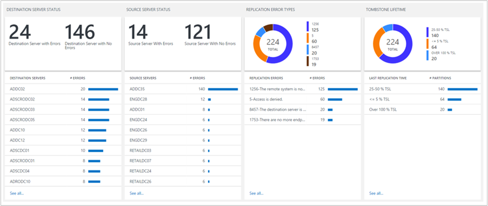

<properties
    pageTitle="Active Directory-Replikationsstatus-Lösung in Log Analytics | Microsoft Azure"
    description="Das Active Directory-Replikationsstatus Lösung Pack regelmäßig überwacht Active Directory-Umgebung für alle Replikationsfehlern und die Ergebnisse des Dashboards OMS-Berichte."
    services="log-analytics"
    documentationCenter=""
    authors="bandersmsft"
    manager="jwhit"
    editor=""/>

<tags
    ms.service="log-analytics"
    ms.workload="na"
    ms.tgt_pltfrm="na"
    ms.devlang="na"
    ms.topic="article"
    ms.date="10/10/2016"
    ms.author="banders"/>

# Active Directory-Replikationsstatus-Lösung in Log Analytics

Active Directory ist eine wichtige Komponente eines Unternehmens IT-Umgebung. Um hohe Verfügbarkeit und hohe Leistung zu gewährleisten, weist jeder Domänencontroller eine eigene Kopie der Active Directory-Datenbank. Domänencontroller repliziert werden miteinander, damit die Änderungen unternehmensweit auf Objektebene überschrieben werden. Eine Vielzahl von Problemen können zu Fehlern in diesem Replikationsprozess unternehmensweit führen.

Das AD Replikationsstatus Lösung Pack regelmäßig überwacht Active Directory-Umgebung für alle Replikationsfehler und die Ergebnisse des Dashboards OMS-Berichte.

## Installieren und konfigurieren die Lösung
Verwenden Sie die folgende Informationen zum Installieren und konfigurieren die Lösung.

- Agents müssen installiert sein, auf Domänencontroller, die Mitglieder der Domäne auszuwertende sind oder auf Element-Servern so konfiguriert, dass AD Replikationsdaten an OMS senden. Um zu verstehen, wie Windows-Computer mit OMS verbinden, finden Sie unter [Verbinden von Windows-Computern Log Analytics](log-analytics-windows-agents.md). Wenn Ihre Domänencontroller noch Teil einer vorhandenen System Center Operations Manager-Umgebung, die Sie zum OMS eine Verbindung herstellen möchten ist, finden Sie unter [Log Analytics Operations Manager verbinden](log-analytics-om-agents.md).
- Fügen Sie die Lösung Active Directory-Replikationsstatus in Ihren OMS Arbeitsbereich mithilfe des Prozesses [Hinzufügen Log Analytics Lösungen aus dem Lösungskatalog](log-analytics-add-solutions.md)beschrieben.  Es ist keine weitere Konfiguration erforderlich.

## AD Replikationsstatus Einzelheiten zur Datensammlung

Die folgende Tabelle zeigt Datensammlungsmethoden und andere Details, wie Daten für die AD-Replikationsstatus erfasst werden.

| Plattform | Direkte Agent | SCOM agent | Azure-Speicher | SCOM erforderlich? | SCOM Agentdaten per Management Group unter gesendeten | Häufigkeit Collection |
|---|---|---|---|---|---|---|
|Windows|||||| alle 5 Tage|

## Aktivieren Sie optional Nichtdomänencontroller AD-Daten an OMS senden
Wenn Sie keine keines Ihrer Domänencontroller direkt an OMS verbinden möchten, können Sie andere OMS verbundenen Computer in Ihrer Domäne zum Sammeln von Daten für die AD-Replikationsstatus Lösung Pack und haben sie die Daten zu senden.

### So aktivieren Sie einen Controller nicht Domänen AD-Daten an OMS senden
1.  Stellen Sie sicher, dass der Computer ein Mitglied der Domäne ist, die mit dem die Lösung AD Replikationsstatus überwacht werden sollen.
2.  [Verbinden mit dem Windows-Computer zu OMS](log-analytics-windows-agents.md) oder [Verbinden Sie es mit Ihrer vorhandenen Operations Manager-Umgebung auf OMS](log-analytics-om-agents.md), falls es noch nicht geschehen ist.
3.  Legen Sie auf diesem Computer den folgenden Registrierungsschlüssel:
    - Schlüssel: **HKEY_LOCAL_MACHINE\SYSTEM\CurrentControlSet\Services\HealthService\Parameters\Management Gruppen\<"Verwaltungsgruppenname" > \Solutions\ADReplication**
    - Value: **IsTarge**
    - Wertdaten: **Wahr**

    >[AZURE.NOTE]Diese Änderungen werden erst Neustart den Microsoft Überwachung Agent-Dienst (HealthService.exe) wirksam.

## Grundlegendes zu Fehlern bei der Replikation
Nachdem Sie die AD-Replikation Statusdaten an OMS gesendet haben, sehen Sie eine Kachel ähnlich wie der folgende auf dem OMS Dashboard, der angibt, wie viele Replikationsfehler, die Sie aktuell arbeiten.  

**Kritische Fehler bei der Replikation** sind diejenigen, die mindestens über 75 % der [Lebensdauer](https://technet.microsoft.com/library/cc784932%28v=ws.10%29.aspx) für Ihre Active Directory-Struktur sind.

Wenn Sie die Kachel klicken, sehen Sie weitere Informationen zu den Fehlern.

### Ziel Server Status- und Quelle Server
Diese Karten zeigen den Status der Ziel und Quellservern, bei die Replikationsfehler auftritt. Die Zahl nach jeder Controller Domänennamen gibt die Anzahl der Replikationsfehler auf diesem Domänencontroller an.

Der Fehler für Zielserver und Quellservern werden angezeigt, da einige Probleme einfacher zu behandeln aus der Quelle Server Perspektive und andere hinsichtlich der Ziel-Server sind.

In diesem Beispiel können Sie sehen, dass viele Zielserver ungefähr die gleiche Anzahl von Fehlern ist, doch es gibt eine Quellserver (ADDC35), die viele weitere Fehler allen anderen enthält. Ist zu rechnen, auf ADDC35, die sie zum Senden von Daten an die Replikationspartner treten verursacht einige Fehler aufgetreten ist. Beheben Probleme auf ADDC35 wird wahrscheinlich viele Fehler beheben, die in die Ziel-Server-Blade angezeigt werden.

### Replikation Fehlertypen
Diese Blade erhalten Sie Informationen zu den Arten von Fehlern in Ihrem Unternehmen erkannt. Jeder Fehler hat einen eindeutigen numerischen Code und einer Nachricht, die Sie die Ursache des Fehlers helfen können.

Der Ring oben können Sie nachvollziehen, welche Fehler mehr angezeigt werden und weniger häufig in Ihrer Umgebung.

Dies können Sie anzeigen, wenn mehrere Domänencontroller denselben Replikationsfehler auftreten. In diesem Fall Sie möglicherweise entdecken Sie eine Lösung auf eine Domänencontroller zu identifizieren, und wiederholen Sie es auf andere Domänencontroller derselbe Fehler auswirken.

### Lebensdauer
Die Lebensdauer bestimmt, wie langes ein gelöschtes Objekt, einer veralteten genannt, wird in der Active Directory-Datenbank beibehalten. Wenn Sie ein gelöschtes Objekt die Lebensdauer übergibt, entfernt eine Garbagecollectionvorgang sie automatisch aus Active Directory-Datenbank.

Liegt die Standardgültigkeitsdauer 180 Tage für die neuesten Versionen von Windows, aber es wurde 60 Tage auf ältere Versionen und explizit von einem Active Directory-Administrator geändert werden.

Es ist wichtig, wenn Fehler bei der Replikation Probleme auftreten, die Annäherung an sind oder haben das Ende der Lebensdauer wissen. Zwei Domäne einen Replikationsfehler auftreten, die ältere die Lebensdauer weiterhin besteht, wird Replikation zwischen diesen Domänencontroller zwei auch, wenn der zugrunde liegende Replikationsfehler behoben ist deaktiviert.

Das Blade Lebensdauer hilft Ihnen stellen identifizieren, wenn dies Gefahr, diesen ist. Jeder Fehler in der **über 100 % TSL** Kategorie stellt eine Partition, die nicht zwischen seinen Quell- und Server, um mindestens die Lebensdauer von veralteten Objekten für die Gesamtstruktur repliziert wurde.

In diesem Fall werden einfach beheben des Fehlers Replikation nicht ausreichend. Zumindest Sie müssen manuell ermitteln, um zu identifizieren und bereinigen veraltete Objekten vor dem Replikation starten können. Möglicherweise müssen auch einen Domänencontroller außer Betrieb genommen.

Neben dem Identifizieren der Replikation Fehlern, die über die Lebensdauer hinaus beibehalten haben, sollten Sie auch auf alle Fehler in der **TSL 50-75 %** oder **100-75 % TSL** Kategorien fallen achten.

Hierbei handelt es sich um Fehler, die sind klar Lösungsvorschläge, nicht vorübergehend, damit sie wahrscheinlich, Ihre Eingriff benötigen zu beheben. Die gute Nachricht ist, dass sie die Lebensdauer noch nicht erreicht haben. Wenn Sie diese Probleme umgehend beheben und *vor* , die sie die Lebensdauer erreichen kann Replikation mit minimalen manuellen Eingriff neu starten.

Wie bereits zuvor erwähnt, zeigt die Kachel Dashboard für die AD-Replikationsstatus-Lösung in Ihrer Umgebung, die als fehlerhaft, die über 75 % der Lebensdauer definiert ist (einschließlich Fehlern, die über 100 % des TSL sind) sind Fehler bei der Replikation an die Anzahl der *kritischen* . Versuchen Sie diese Anzahl bei 0 zu belassen.

>[AZURE.NOTE] Alle die veralteten Lebensdauer Prozentsatz Berechnungen basieren auf die tatsächliche Tombstone für Ihre Active Directory-Struktur, damit Sie vertrauen können, dass diese Prozentsätze korrekt sind, auch wenn Sie einen benutzerdefinierten veralteten Lebensdauer Wert festgelegt haben.

### AD Replikation Statusdetails
Wenn Sie ein beliebiges Element in einer der Listen klicken, sehen Sie weitere Details zu es mithilfe der Suchfunktion Log. Die Ergebnisse werden gefiltert, um nur die Fehler im Zusammenhang mit dem Element anzuzeigen. Beispielsweise, wenn Sie auf der ersten Domänencontroller aufgeführt wird, klicken Sie unter **Ziel Server Status (ADDC02)**klicken, Sie sehen Suchergebnisse gefiltert nach Fehler anzeigen mit dieser Domänencontroller als die Zielserver aufgeführt:

Hier können Sie weiteren filtern, die Suchabfrage ändern und usw.. Weitere Informationen zur Verwendung von Log suchen finden Sie unter [Log Suchbegriffe](log-analytics-log-searches.md).

Das Feld **HelpLink** zeigt die URL einer TechNet-Seite mit zusätzlichen Details zu dieser Fehler an. Sie können kopieren und Einfügen von diesen Link in das Browserfenster, um Informationen zur Problembehandlung und zum Beheben des Fehlers anzuzeigen.

Sie können auch auf **Exportieren** , um die Ergebnisse nach Excel exportieren klicken. So können Sie Replikation Fehlerdaten in keiner Weise zu visualisieren, die Sie möchten.

## AD Replikationsstatus häufig gestellte Fragen
**F: wie oft ist AD Replikation Statusdaten aktualisiert?**
A: die Informationen werden alle 5 Tage aktualisiert.

**F: Gibt es eine Möglichkeit zum Konfigurieren, wie oft diese Daten aktualisiert werden?**
A: zurzeit nicht.

**F: ich alle meine Domänencontroller meinem Arbeitsbereich OMS hinzufügen, um den Replikationsstatus finden Sie unter?**
A: Nein, darf nur ein einzigen Domänencontroller hinzugefügt werden. Wenn Sie mehrere Domänencontroller im Arbeitsbereich OMS haben, werden die Daten aus allen von ihnen an OMS gesendet.

**F: Ich möchten nicht Mein Arbeitsbereich OMS noch Domänencontroller hinzufügen. Kann ich die Lösung AD Replikationsstatus weiterhin verwenden?**
A: Ja. Sie können den Wert eines Registrierungsschlüssels dies aktivieren festlegen. Finden Sie unter [aktivieren einen nicht Domänen Controller OMS AD Daten senden](#to-enable-a-non-domain-controller-to-send-ad-data-to-oms).

**F: Was ist der Name des Prozesses, der die Sammlung von Daten unterstützt?**
A: AdvisorAssessment.exe

**F: dauert wie lange es, für die zu erfassenden Daten?**
A: Daten Websitesammlung Zeit hängt von der Größe der Active Directory-Umgebung, aber in der Regel dauert weniger als 15 Minuten.

**F: welche Art von Daten werden gesammelt?**
A: Replikation Daten über LDAP erfasst.

**F: Gibt es eine Möglichkeit zum Konfigurieren, wenn die Daten erfasst werden?**
A: zurzeit nicht.

**F: erforderlich welche Berechtigungen sind zum Sammeln von Daten?**
A: normalen Benutzerberechtigungen in Active Directory sind in der Regel ausreichend.

## Problembehandlung bei der Daten-Websitesammlung
Um Daten zu erfassen, erfordert das AD-Replikationsstatus Lösung Pack mindestens eine Domänencontroller mit dem Arbeitsbereich OMS verbunden sein. Bis Sie dies tun, wird eine Meldung angezeigt, die **Daten ist immer noch erfasst wird**angezeigt.

Wenn Sie einen der Ihrer Domänencontroller verbinden Hilfe benötigen, können Sie bei [Computern unter Windows Verbinden zur Log Analytics](log-analytics-windows-agents.md)Dokumentation anzeigen. Wenn Ihre Domänencontroller bereits an einer vorhandenen System Center Operations Manager-Umgebung angeschlossen ist, können Sie alternativ Dokumentation am [System Center Operations Manager verbinden, um Log Analytics](log-analytics-om-agents.md)anzeigen.

Wenn Sie keine keines Ihrer Domänencontroller direkt OMS oder SCOM verbinden möchten, finden Sie unter [Nichtdomänencontroller AD Daten OMS senden aktivieren](#to-enable-a-non-domain-controller-to-send-ad-data-to-oms).

## Nächste Schritte

- Verwenden Sie zum Anzeigen der Detaildaten einer Active Directory-Replikation Status [Log durchsucht Log Analytics](log-analytics-log-searches.md) ein.
