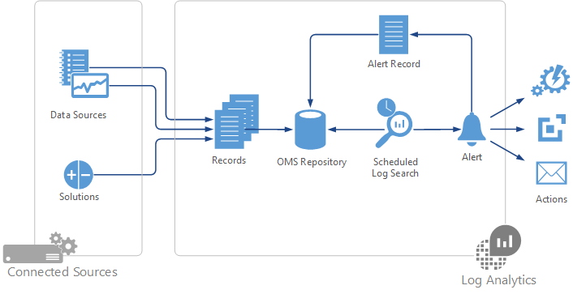
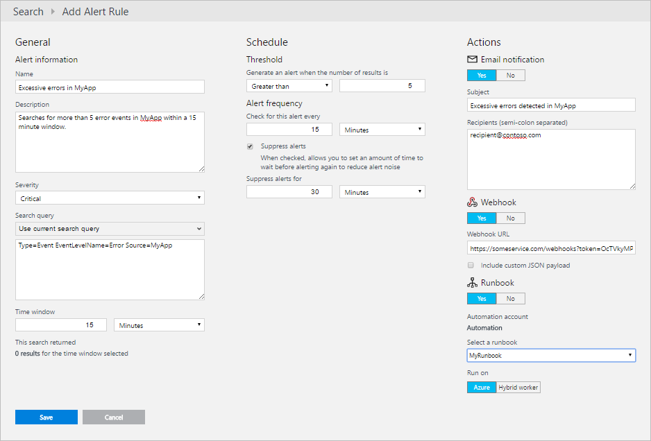
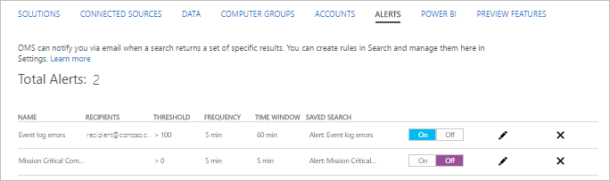

<properties 
   pageTitle="Warnungen im Log Analytics | Microsoft Azure"
   description="Warnungen im Log Analytics können wichtige Informationen in Ihrem Repository OMS identifizieren und die vorausschauende benachrichtigt, Probleme oder aufrufen Aktionen, um eine Verbindung zu korrigieren.  Dieser Artikel beschreibt, wie Sie zum Erstellen einer Regel und Details der verschiedenen Aktionen, die sie ergreifen können."
   services="log-analytics"
   documentationCenter=""
   authors="bwren"
   manager="jwhit"
   editor="tysonn" />
<tags 
   ms.service="log-analytics"
   ms.devlang="na"
   ms.topic="article"
   ms.tgt_pltfrm="na"
   ms.workload="infrastructure-services"
   ms.date="08/22/2016"
   ms.author="bwren" />

# Warnungen im Log Analytics

Warnungen im Log Analytics identifizieren Sie wichtige Informationen in Ihrem Repository OMS.  Warnungsregeln automatisch Log Suchvorgänge nach einem Zeitplan ausführen und erstellen Sie einen Eintrag benachrichtigen, wenn die Ergebnisse bestimmte Kriterien entsprechen.  Die Regel kann dann automatisch ausgeführt werden eine oder mehrere Aktionen aus, um die vorausschauende benachrichtigt, der Warnung oder Aufrufen von einem anderen Prozess verwendet.   

## Erstellen einer Regel
Um eine Regel zu erstellen, zunächst erstellen Sie eine Log-Suche für die Datensätze, die die Benachrichtigung aufrufen soll.  Die Schaltfläche " **Benachrichtigung** " wird dann verfügbar sein, damit Sie können erstellen und konfigurieren die Regel.

1.  Klicken Sie auf **Log suchen**, von der Seite Übersicht OMS.
2.  Entweder erstellen Sie eine neue Log Suchabfrage, oder wählen Sie eine gespeicherte Log-Suche. 
3.  Klicken Sie auf **Benachrichtigen** am oberen Rand der Seite um den Bildschirm **Benachrichtigen Regel hinzufügen** zu öffnen.
4. Schlagen Sie in den folgenden Tabellen Details zu den Optionen so konfigurieren Sie die Benachrichtigung.
5. Wenn Sie das Zeitfenster für die Regel bereitstellen, wird die Anzahl der vorhandenen Datensätze, die die Suchkriterien für die Zeitfenster entsprechen angezeigt.  Dadurch können Sie feststellen, wie oft, mit denen Sie die Anzahl der Ergebnisse erhalten werden, die Sie erwartet.
4.  Klicken Sie auf **Speichern** , um die Regel abzuschließen.  Es wird gestartet, sofort ausgeführt.

| Eigenschaft | Beschreibung |
|:--|:--|
| **Benachrichtigen Informationen** | |
| Namen |  Eindeutiger Name, um die Regel zu identifizieren. |
| Schwere | Schwere der Warnung, die durch diese Regel erstellt wird. |
| Suchabfrage | Wählen Sie die **aktuelle Suchabfrage verwenden** , um die aktuelle Abfrage verwenden, oder wählen eine vorhandene gespeicherte Suche aus der Liste aus.  Die Abfragesyntax werden in das Textfeld bereitgestellt, wo Sie sie bei Bedarf ändern können.  |
| Zeitfensters | Gibt den Zeitraum für die Abfrage an.  Die Abfrage gibt nur Datensätze, die in diesem Bereich der aktuellen Uhrzeit erstellt wurden.  Dies kann einen beliebigen Wert zwischen 5 Minuten und 24 Stunden sein.  Sie sollten größer als oder gleich der Häufigkeit benachrichtigen.     Beispielsweise werden, wenn das Zeitfenster auf 60 Minuten festgelegt ist, und die Abfrage, um 13:15 ausgeführt wird, nur Datensätze zwischen 12:15 PM und 1:15 PM erstellt zurückgegeben. |
| **Zeitplan** |     
| Schwellenwert | Kriterien für eine Benachrichtigung erstellen.  Eine Warnung wird erstellt, wenn die Anzahl der Datensätze, die von der Abfrage zurückgegebenen folgende Kriterien entspricht. |
| Benachrichtigen Häufigkeit | Gibt an, wie oft die Abfrage ausgeführt werden soll.  Einen beliebigen Wert zwischen 5 Minuten und 24 Stunden kann sein.  Gleich oder kleiner als das Zeitfenster sollten. |
| Benachrichtigungen unterdrücken | Wenn Sie für die Regel unterdrücken aktivieren, werden Aktionen für die Regel für einen festgelegten Zeitraum nach dem Erstellen einer neuen Benachrichtigung deaktiviert.  Die Regel wird immer noch ausgeführt und erstellt benachrichtigen Einträge aus, wenn die Kriterien erfüllt ist.  Dies ist zulassen, dass Sie Zeit, um das Problem zu beheben, ohne dass doppelte Aktionen ausgeführt. |
| **Aktionen** | |
| E-Mail-Benachrichtigung | Geben Sie **Ja** , wenn eine e-Mail-Nachricht gesendet werden, wenn die Benachrichtigung ausgelöst wird soll. |
| Betreff    | Betreff der e-Mail ein.  Sie können den Textkörper der Nachricht nicht ändern. |
| Empfänger | Alle Empfänger der e-Mail-Adressen.  Wenn Sie mehr als einer Adresse angeben, trennen Sie die Adressen durch ein Semikolon (;) ein. |
| Webhook | Geben Sie **Ja** , wenn Sie möchten eine Webhook anrufen, wenn die Benachrichtigung ausgelöst wird. |
| Webhook-URL | Die URL für die Webhook. |
| Benutzerdefinierte JSON-Nutzlast enthalten | Wählen Sie diese Option, wenn Sie die standardmäßigen Nutzlast mit einem benutzerdefinierten Nutzlast ersetzen möchten. |
| Geben Sie Ihre benutzerdefinierten JSON-Nutzlast | Den benutzerdefinierten Inhalt für die Webhook werden soll.  Details finden Sie vorhergehenden Abschnitt. |
| Runbooks | Geben Sie **Ja** aus, wenn eine Azure Automatisierung Runbooks beim Auslösen der Warnung zu beginnen soll. |
| Wählen Sie eine Runbooks aus. | Auswählen des Runbooks, von der Runbooks im Automatisierung Konto so konfiguriert, dass Ihre Lösung Automatisierung zu starten. |
| Klicken Sie auf Ausführen | Wählen Sie aus **Azure** des Runbooks in der Cloud Azure ausführen.  Wählen Sie **Hybrid Worker** des Runbooks für eine [Hybrid Runbooks Worker](..\automation\automation-hybrid-runbook-worker.md) in Ihrer lokalen Umgebung ausgeführt. |

## Verwalten von Warnungsregeln
Sie können eine Liste der alle Warnungsregeln in Log Analytics- **Einstellungen**im Menü **Benachrichtigungen** erhalten.  

1. Wählen Sie in der Verwaltungskonsole OMS die Kachel " **Einstellungen** " aus.
2. Wählen Sie die **Benachrichtigungen**aus.

Sie können mehrere Aktionen in dieser Ansicht ausführen.

- Deaktivieren einer Regel, indem Sie neben dem Eintrag **Deaktivieren** auswählen.
- Bearbeiten einer Regel durch Klicken auf das Bleistiftsymbol neben dem Eintrag.
- Entfernen Sie eine Regel durch Klicken auf das Symbol **X** daneben ein. 

## Festlegen von Zeitfenster 

### Ereignis Benachrichtigungen

Ereignisse gehören Datenquellen wie Windows-Ereignisprotokollen Syslog, und benutzerdefinierte protokolliert.  Sie möchten eine Benachrichtigung erstellen, wenn ein bestimmter Fehlerereignis erstellt wird, oder wenn mehrere Fehler Ereignisse in einem bestimmten Zeitfenster erstellt werden.

Um ein einzelnes Ereignis aufmerksam zu machen, legen Sie die Anzahl der Ergebnisse auf größer als 0 und Häufigkeit und Zeitfensters auf 5 Minuten ein.  Die alle 5 Minuten für die Abfrage auszuführen, und prüfen, ob das Eintreten eines einzelnen Ereignisses, die seit dem letzten erstellt wurde, die die Abfrage ausgeführt wurde.  Eine längere Häufigkeit verzögert sich möglicherweise die Zeit zwischen das Ereignis erfasst wird und die Benachrichtigung erstellt wird.

Einige Anwendungen möglicherweise gelegentlichen einen Fehler anmelden, der periodisch eine Warnung erfolgen sollte nicht.  Die Anwendung kann beispielsweise wiederholen Sie den Prozess, der das Fehlerereignis erstellt und erfolgreich klicken Sie dann auf das nächste Mal.  Sie möchten in diesem Fall nicht die Benachrichtigung zu erstellen, es sei denn, mehrere Ereignisse in einem bestimmten Zeitfenster erstellt werden.  

In einigen Fällen können Sie in das Fehlen eines Ereignisses eine Benachrichtigung erstellen möchten.  Ein Vorgang möglicherweise beispielsweise, melden Sie sich reguläre Ereignisse, um anzugeben, dass er ordnungsgemäß arbeitet.  Wenn sie eine der folgenden Ereignisse in einem bestimmten Zeitfenster nicht anmelden können, sollte eine Benachrichtigung erstellt werden.  In diesem Fall legen Sie den Schwellenwert in *weniger als 1*.

### Leistung Benachrichtigungen

[Leistungsdaten](log-analytics-data-sources-performance-counters.md) werden als Datensätze im ähnliche Ereignisse OMS Repository gespeichert.  Der Wert in jedem Datensatz ist, den Mittelwert über die letzten 30 Minuten gemessen wird.  Wenn Sie gewarnt werden, wenn ein Performance-Zähler einen bestimmten Schwellenwert überschreitet möchten, sollten diesen Schwellenwert in die Abfrage eingeschlossen werden.

Beispielsweise, wenn Sie gewarnt werden, wenn der Prozessor ausgeführt wird wollten über 90 % für 30 Minuten, verwenden Sie eine Abfrage wie *Typ = Perf ObjectName = Prozessor CounterName = "% Prozessor Time" Beträge > 90* und den Schwellenwert für die Regel zu *größer gleich 0*.  

 Da [Leistung Einträge](log-analytics-data-sources-performance-counters.md) sind alle 30 Minuten unabhängig davon, wie oft Sie jeden Indikator sammeln zusammengefasster, möglicherweise ein Zeitfenster kleiner als 30 Minuten keine Datensätze zurück.  30 Minuten des Zeitfensters Einstellung wird sichergestellt, dass Sie einen einzelnen Datensatz für jede verbundenen Quelle abrufen, der den Mittelwert über die Zeit darstellt.

## Benachrichtigen Aktionen

Zusätzlich zu einen Benachrichtigung Eintrag zu erstellen, können Sie die Regel zum automatisch eine oder mehrere Aktionen ausführen konfigurieren.  Aktionen können Sie die vorausschauende benachrichtigt, der Warnung oder aufrufen einige Prozess, der versucht, das Problem zu beheben, das erkannt wurde.  Den folgenden Abschnitten werden die Aktionen, die derzeit verfügbar sind.

### E-Mail-Aktionen
E-Mail-Aktionen senden Sie eine e-Mail-Nachricht mit den Details der Warnung an einen oder mehrere Empfänger.  Sie können angeben, den gewünschten Betreff für die e-Mail-Nachrichten, aber es Inhalte ist ein Standardformat erstellt, die durch Log Analytics.  Sie enthält zusammenfassende Informationen wie der Name der Warnung sowie Details von bis zu zehn Datensätzen, die bei der Suche Log zurückgegeben.  Darüber hinaus einen Link zu einer Suche Log in Log Analytics, die den ganzen Satz von Datensätzen in dieser Abfrage zurückgegeben werden.   Der Absender der Nachricht ist *Microsoft Operations Management Suite Team &lt; noreply@oms.microsoft.com *. 

### Webhook Aktionen

Webhook Aktionen ermöglichen es Ihnen, einen externen Prozess über eine einzelne HTTP POST Abfrage aufzurufen.  Der Dienst aufgerufen wird Unterstützung Webhooks und bestimmen, wie die Payload verwendet werden sollte es erhält.  Sie konnte auch ein REST-API aufrufen, die speziell Webhooks nicht unterstützt, solange die Anforderung in einem Format ist, das die API versteht.  Beispiele für die Verwendung eines Webhook in der Antwort auf eine Warnung verwenden einen Service wie [Pufferzeit](http://slack.com) zum Senden einer Nachricht mit den Details der Warnung oder einen Vorfall in einem Dienst wie [PagerDuty](http://pagerduty.com/)zu erstellen.  

Umfassende Informationen zum Erstellen einer Regel mit einer Webhook zu einer Stichprobe Serviceanfrage von steht am [Webhooks Log Analytics Benachrichtigungen](log-analytics-alerts-webhooks.md).

Webhooks gehören einer URL und eine Nutzlast formatiert ist JSON, die die Daten an den externen Dienst gesendet wird.  Standardmäßig wird die Nutzlast die Werte in der folgenden Tabelle enthalten.  Sie können auswählen, dieser Code durch eine eigene benutzerdefinierte zu ersetzen.  In diesem Fall können die Variablen in der Tabelle für jeden Parameter Sie den Wert in der benutzerdefinierten Nutzlast aufnehmen möchten.

| Parameter | Variable | Beschreibung |
|:--|:--|:--|
| AlertRuleName | #alertrulename | Name der Regel benachrichtigen. |
| AlertThresholdOperator | #thresholdoperator | Schwellenwert für den Operator für die Regel.  *Größer* oder *kleiner als*. |
| AlertThresholdValue | #thresholdvalue | Schwellenwert für die Regel. |
| LinkToSearchResults | #linktosearchresults | Link zur Log Analytics Log suchen, die die Datensätze aus der Abfrage zurückgegeben werden, die die Benachrichtigung erstellt. |
| ResultCount  | #searchresultcount | Anzahl von Datensätzen in den Suchergebnissen angezeigt. |
| SearchIntervalEndtimeUtc  | #searchintervalendtimeutc | Endzeit für die Abfrage im UTC-Format. |
| SearchIntervalInSeconds | #searchinterval | Zeitfenster für die Regel. |
| SearchIntervalStartTimeUtc  | #searchintervalstarttimeutc | Startzeit für die Abfrage im UTC-Format. |
| SearchQuery | #SearchQuery | Log Suchabfrage durch die Regel verwendet. |
| Suchergebnisse | Finden Sie unter | Datensätze, die von der Abfrage im JSON-Format zurückgegeben.  Klicken Sie auf der ersten 5.000 Einträge beschränkt. |
| WorkspaceID | #workspaceid | ID des OMS Arbeitsbereich. |

Beispielsweise können Sie die folgende benutzerdefinierte Nutzlast angeben, die einen einzelnen Parameter namens *Text*enthält.  Der Dienst, den diese Webhook ruft würde für diesen Parameter erwartet werden.

    {
        "text":"#alertrulename fired with #searchresultcount over threshold of #thresholdvalue."
    }

Dieser Beispiel-Code würde ungefähr wie folgt vor, wenn die Webhook gesendet aufgelöst.

    {
        "text":"My Alert Rule fired with 18 records over threshold of 10 ."
    }

Um die Suchergebnisse in eine benutzerdefinierte Nutzlast aufnehmen möchten, fügen Sie die folgende Zeile als Eigenschaft auf oberster Ebene in der Json-Nutzlast.  

    "IncludeSearchResults":true

Um eine benutzerdefinierte Nutzlast erstellen, die nur den Namen der Warnung und die Suchergebnisse enthält, konnte Sie beispielsweise die folgenden verwenden. 

    {
       "alertname":"#alertrulename",
       "IncludeSearchResults":true
    }

Sie können ein vollständiges Beispiel für das Erstellen einer Regel mit einer Webhook So starten Sie einen externen Dienst am [Log Analytics benachrichtigen Webhook Stichprobe](log-analytics-alerts-webhooks.md)durchzuführen.

### Runbooks Aktionen

Runbooks Aktionen Starten einer Runbooks in Azure Automatisierung an.  Diese Art von Aktion verwenden möchten, müssen Sie die [Lösung Automatisierung](log-analytics-add-solutions.md) , in dem Arbeitsbereich OMS installiert und konfiguriert haben.  Wenn Sie sie beim Erstellen einer neuen Regel auf benachrichtigen installiert haben, wird eine Verknüpfung mit der Installation angezeigt.  Sie können die Runbooks im Automatisierung Konto auswählen, die Sie in die Automatisierung Lösung konfiguriert.

Runbooks Aktionen Starten des Runbooks mithilfe eines [Webhook](../automation/automation-webhooks.md).  Wenn Sie die Regel erstellen, wird automatisch eine neue Webhook für des Runbooks mit dem Namen erstellt **OMS Benachrichtigung Behebung** , von einer GUID gefolgt.  

Sie können keine Parameter des Runbooks direkt auffüllen, aber der [$WebhookData Parameter](../automation/automation-webhooks.md) werden die Details der Warnung, einschließlich der Ergebnisse der Log-Suche, die sie erstellt enthalten.  Des Runbooks müssen **$WebhookData** als Parameter dafür Zugriff auf die Eigenschaften der Warnung definieren.  Die Benachrichtigung Daten sind im Json-Format in einer einzelnen Eigenschaft mit dem Namen der **Suchergebnisse** in der Eigenschaft **RequestBody** **$WebhookData**verfügbar.  Dies kann mit den Eigenschaften in der folgenden Tabelle sind.

| Knoten | Beschreibung |
|:--|:--|
| ID         | Pfad und GUID der Suche. |
| __metadata | Informationen über die Benachrichtigung, einschließlich der Anzahl von Datensätzen und Status der Suchergebnisse. |
|  Wert     |  Separate Eintrag für jeden Datensatz in den Suchergebnissen angezeigt.  Die Details des Eintrags werden die Eigenschaften und Werte des Datensatzes entsprechen.   |

Beispielsweise würde des folgenden Runbooks Extrahieren der Datensätze, die von der Log-Suche zurückgegebenen und andere Eigenschaften basierend auf den Typ der einzelnen Datensätze zuweisen.  Beachten Sie, dass die Runbooks beginnt mit dem **RequestBody** von Json konvertieren, damit es als Objekt in PowerShell mit bearbeitet werden kann.

    param ( 
        [object]$WebhookData
    )

    $RequestBody = ConvertFrom-JSON -InputObject $WebhookData.RequestBody
    $Records     = $RequestBody.SearchResults.value
    
    foreach ($Record in $Records)
    {
        $Computer = $Record.Computer
        
        if ($Record.Type -eq 'Event')
        {
            $EventNo    = $Record.EventID
            $EventLevel = $Record.EventLevelName
            $EventData  = $Record.EventData
        }
        
        if ($Record.Type -eq 'Perf')
        {
            $Object    = $Record.ObjectName
            $Counter   = $Record.CounterName
            $Instance  = $Record.InstanceName
            $Value     = $Record.CounterValue
        }
    }

## Benachrichtigen Datensätze

Benachrichtigen von Warnungsregeln in Log Analytics erstellte Einträge haben einen **Typ** von **Benachrichtigung** und einem **SourceSystem** von **OMS**.  Sie haben die Eigenschaften in der folgenden Tabelle aus.

| Eigenschaft | Beschreibung |
|:--|:--|
| Typ          | *Benachrichtigen* |
| SourceSystem  | *OMS* |
| AlertSeverity | Die Sicherheitsebene der Benachrichtigung. |
| Existenter Warnname     | Name der Warnung. |
| Abfrage         | Text der Abfrage, die ausgeführt wurde.  |
| QueryExecutionEndTime   | Ende des Zeitraums für die Abfrage. |
| QueryExecutionStartTime | Anfang des Bereichs Zeit für die Abfrage.  |
| TimeGenerated | Datum und Uhrzeit, die die Benachrichtigung erstellt wurde. |

Es gibt andere Arten von Benachrichtigungssounds Einträge erstellt werden, indem Sie die [Benachrichtigung Management-Lösung](log-analytics-solution-alert-management.md) und [Power BI exportiert](log-analytics-powerbi.md).  Diese alle über einen **Typ** von **Benachrichtigen** , jedoch werden durch ihre **SourceSystem**unterschieden.

## Nächste Schritte

- Installieren Sie die [Benachrichtigung Management-Lösung](log-analytics-solution-alert-management.md) zum Analysieren von Benachrichtigungen in Log Analytics zusammen mit Benachrichtigungen erfassten aus System Center Operations Manager (SCOM) erstellt.
- Weitere Informationen zum [Protokoll Suchbegriffe](log-analytics-log-searches.md) , die Benachrichtigungen generieren können.
- Führen Sie eine exemplarische Vorgehensweise zum [Konfigurieren einer Webook](log-analytics-alerts-webhooks.md) mit einer Benachrichtigung Regel ein.  
- Informationen Sie zum Schreiben von [Runbooks in Azure Automatisierung](https://azure.microsoft.com/documentation/services/automation) , um Benachrichtigungen identifizierten Probleme zu beheben.