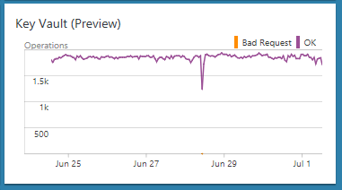
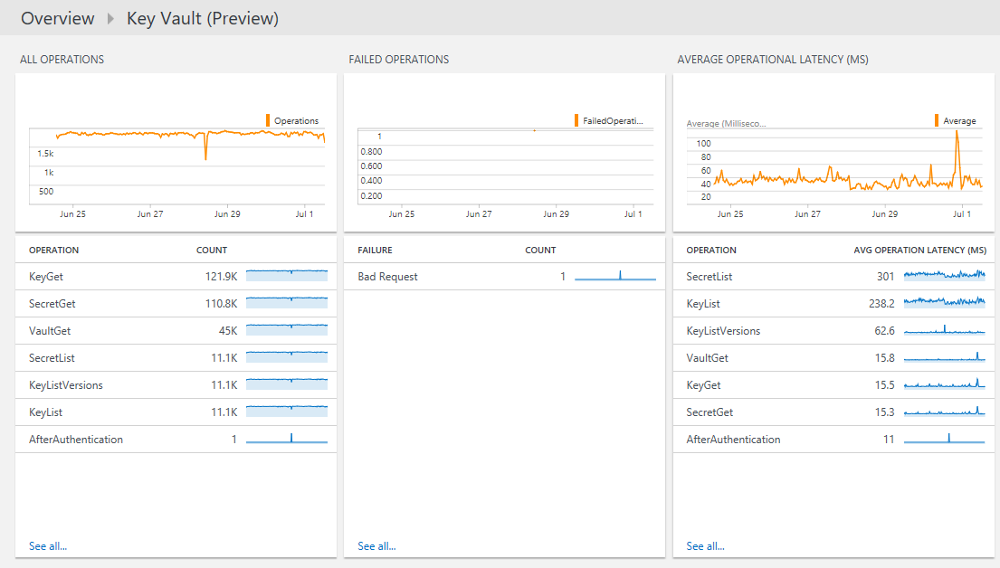

<properties
    pageTitle="Azure-Taste Tresor-Lösung in Log Analytics | Microsoft Azure"
    description="Die Lösung Azure-Taste Tresor können Log Analytics Azure-Taste Tresor Protokolle überprüfen."
    services="log-analytics"
    documentationCenter=""
    authors="richrundmsft"
    manager="jochan"
    editor=""/>

<tags
    ms.service="log-analytics"
    ms.workload="na"
    ms.tgt_pltfrm="na"
    ms.devlang="na"
    ms.topic="article"
    ms.date="07/12/2016"
    ms.author="richrund"/>

# Azure-Taste Tresor (Preview)-Lösung in Log Analytics

>[AZURE.NOTE] Dies ist eine [Vorschau-Lösung](log-analytics-add-solutions.md#log-analytics-preview-solutions-and-features).

Die Lösung Azure-Taste Tresor können in Log Analytics Sie Protokolle Azure-Taste Tresor AuditEvent überprüfen.

Zum Aktivieren der Protokollierung von Ereignissen für Azure-Taste Tresor. Diese Protokolle werden in Azure Blob-Speicher geschrieben, wo sie dann durch Log Analytics für die Suche und Analyse indiziert werden können.

## Installieren und Konfigurieren der Lösung

Verwenden Sie die folgenden Anweisungen zum Installieren und konfigurieren die Lösung Azure-Taste Tresor aus:

1.  Aktivieren Sie [Diagnoseprotokoll für Schlüssel Tresor](../key-vault/key-vault-logging.md) Ressourcen, die zu überwachenden
2.  Konfigurieren von Log Analytics, um die Protokolle mithilfe der Schritte in [JSON-Dateien im BLOB-Speicher](../log-analytics/log-analytics-azure-storage-json.md)von Blob-Speicher zu lesen.
3.  Aktivieren Sie die Lösung Azure-Taste Tresor mithilfe des Prozesses [Hinzufügen Log Analytics Lösungen aus dem Lösungskatalog](log-analytics-add-solutions.md)beschrieben.  

## Überprüfen Sie die Taste Tresor Azure Einzelheiten zur Datensammlung

Azure-Taste Tresor Lösung sammelt Diagnose Protokolle aus Azure Blob-Speicher für Azure-Taste Tresor.
Es ist kein Agent zum Sammeln von Daten erforderlich.

Die folgende Tabelle zeigt Datensammlungsmethoden und andere Details, wie Daten für Azure-Taste Tresor erfasst werden.

| Plattform | Direkte agent | Betriebssysteme Center Operations Manager (SCOM) agent | Azure-Speicher | SCOM erforderlich? | SCOM Agentdaten per Management Group unter gesendeten | Häufigkeit Collection |
|---|---|---|---|---|---|---|
|Azure||||            || 10 Minuten|

## Verwenden von Azure Key Tresor

Nachdem Sie die Lösung installiert haben, können Sie die Zusammenfassung der Anforderung, die über einen Zeitraum für Ihre überwachten Schlüssel Depots mithilfe der **Azure Schlüssel Tresor** Status Kachel auf der Seite **Übersicht** Log Analytics anzeigen.

Nachdem Sie die Kachel " **Übersicht** " geklickt haben, können Sie anzeigen Übersichten der Protokolle und dann einen Drilldown ausführen, um die Details für die folgenden Kategorien:

- Volumen aller wichtigen Tresor Vorgänge über einen Zeitraum
- Fehler beim Vorgang Datenmengen über einen Zeitraum
- Durchschnittliche Betrieb Wartezeit von Vorgang
- Quality of Service für Vorgänge mit der Anzahl der Vorgänge, die mehr als 1000 ms ausführen und eine Liste der Vorgänge, die mehr als 1000 ms ausführen

### Anzeigen von Details für jeden Vorgang

1. Klicken Sie auf der Seite **Übersicht** auf die Kachel **Azure Schlüssel Tresor** .
2. Überprüfen Sie auf dem Dashboard **Azure Schlüssel Tresor** die Zusammenfassungsinformationen in einem Blade, und klicken Sie dann auf eine zum Anzeigen detaillierter Informationen auf der Logseite-Suche.

    Auf den Seiten Log suchen können Sie Ergebnisse nach Zeit, detaillierte Ergebnisse und Verlauf der Log-durchsuchen anzeigen. Sie können auch durch die Ergebnisse eingrenzen Bereichen filtern.

## Analytics Protokolldatensätze

Die Lösung Azure-Taste Tresor analysiert Datensätze, die einen Typ von **KeyVaults** enthalten, die aus den Azure-Diagnose [AuditEvent Protokolle](../key-vault/key-vault-logging.md) erfasst wurden.  Eigenschaften für diese Datensätze werden in der folgenden Tabelle.  

| Eigenschaft | Beschreibung |
|:--|:--|
| Typ | *KeyVaults* |
| SourceSystem | *AzureStorage* |
| CallerIpAddress | IP-Adresse des Clients, die die Anforderung vorgenommen hat. |
| Kategorie      | Für Schlüssel Tresor Protokolle ist AuditEvent der einzelner Wert verfügbar.|
| CorrelationId | Eine optionale GUID, die der Client übergeben kann, um den clientseitigen Protokollen mit Service clientseitigen (Taste Tresor) Protokolle zu koordinieren. |
| DurationMs | Zeit die REST-API Anfrage, in Millisekunden. Dies schließt nicht Netzwerkwartezeit, damit die Zeit, die Sie auf dem Client messen diesmal möglicherweise nicht übereinstimmt. |
| HttpStatusCode_d | HTTP-Code, der von der Anforderung zurückgegebenen |
| Id_s       | Eindeutige ID der Anfrage |
| Identity_o | Identität aus dem Token, das angezeigt wurde, wenn Sie die REST-API Anforderung vornehmen. Dies ist in der Regel ein "Benutzer", "Service Tilgungsanteile" oder eine Kombination wie im Fall einer Anforderung infolge eines Azure PowerShell-Cmdlet "Benutzer + AppId". |
| OperationName      | Name des Vorgangs, wie unter [Azure Schlüssel Tresor Protokollierung](../key-vault/key-vault-logging.md)|
| OperationVersion      | REST-API-Version, die vom Client angeforderten|
| RemoteIPLatitude | Breite des Clients, die die Anforderung vorgenommen hat. |
| RemoteIPLongitude | Länge des Clients, die die Anforderung vorgenommen hat. |
| RemoteIPCountry | Land des Clients, die die Anforderung vorgenommen hat.  |
| RequestUri_s | URI der Anforderung |
| Ressource   | Namen der wichtigsten Tresor |
| ResourceGroup | Die wichtigsten Tresor Ressourcengruppe |
| ResourceId | Azure Ressourcenmanager Ressourcen-ID. Für Schlüssel Tresor Protokolle ist dies immer die Taste Tresor Ressourcen-ID. |
| ResourceProvider | *MICROSOFT. KEYVAULT* |
| ResultSignature  | HTTP-status|
| ResultType-Wert      | Ergebnis der Anforderung REST-API|
| SubscriptionId | Azure-Abonnement-ID des Abonnements, enthält die Taste Tresor |

## Nächste Schritte

- Verwenden Sie [Log Analytics Log durchsucht](log-analytics-log-searches.md) , um Detaildaten Azure-Taste Tresor anzuzeigen.
