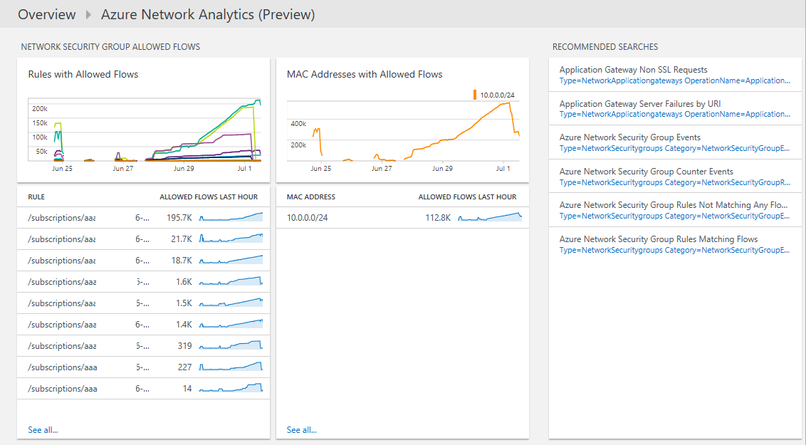

<properties
    pageTitle="Azure Analytics Networking-Lösung in Log Analytics | Microsoft Azure"
    description="Die Azure Networking Analytics-Lösung können in Log Analytics Sie um Protokolle von Azure Netzwerk Sicherheit und Azure Application Gateway Protokolle zu überprüfen."
    services="log-analytics"
    documentationCenter=""
    authors="richrundmsft"
    manager="jochan"
    editor=""/>

<tags
    ms.service="log-analytics"
    ms.workload="na"
    ms.tgt_pltfrm="na"
    ms.devlang="na"
    ms.topic="article"
    ms.date="07/05/2016"
    ms.author="richrund"/>

# Azure Networking Analytics (Preview)-Lösung in Log Analytics

>[AZURE.NOTE] Dies ist eine [Vorschau-Lösung](log-analytics-add-solutions.md#log-analytics-preview-solutions-and-features).

Die Azure Networking Analytics-Lösung können in Log Analytics Sie um Azure Application Gateway Protokolle und Azure Netzwerk Sicherheit Gruppe Protokolle zu überprüfen.

Sie können für Azure Application Gateway Protokolle und Azure Netzwerk Sicherheitsgruppen Protokollierung aktivieren. Diese Protokolle geschrieben werden BLOB-Speicher, wo sie dann durch Log Analytics für die Suche und Analyse indiziert werden können.

Die folgenden Protokolle werden zur Anwendungsgateways unterstützt:

+ ApplicationGatewayAccessLog
+ ApplicationGatewayPerformanceLog

Die folgenden Protokolle werden für Sicherheitsgruppen Netzwerk unterstützt:

+ NetworkSecurityGroupEvent
+ NetworkSecurityGroupRuleCounter

## Installieren und Konfigurieren der Lösung

Verwenden Sie die folgenden Anweisungen zum Installieren und konfigurieren die Lösung Azure Networking Analytics aus:

1.  Aktivieren Sie Diagnoseprotokolle für die Ressourcen, die Sie überwachen möchten:
  + [Application Gateway](../application-gateway/application-gateway-diagnostics.md)
  + [Netzwerk-Sicherheitsgruppe](../virtual-network/virtual-network-nsg-manage-log.md)
2.  Konfigurieren von Log Analytics, um die Protokolle mithilfe der Schritte in [JSON-Dateien im BLOB-Speicher](../log-analytics/log-analytics-azure-storage-json.md)von Blob-Speicher zu lesen.
3.  Aktivieren Sie die Lösung Azure Networking Analytics mithilfe des Prozesses [Hinzufügen Log Analytics Lösungen aus dem Lösungskatalog](log-analytics-add-solutions.md)beschrieben.  

Wenn Sie das Diagnoseprotokoll für einen bestimmten Ressourcentyp nicht aktivieren, werden die Dashboard-Blades für diese Ressource leer sein.

## Überprüfen Sie die Einzelheiten zur Azure Networking Analytics Datensammlung

Die Lösung Azure Networking Analytics sammelt Diagnose Protokolle aus Azure Blob-Speicher für die Anwendungsgateways Azure und Netzwerk-Sicherheitsgruppen.
Es ist kein Agent zum Sammeln von Daten erforderlich.

Die folgende Tabelle zeigt Datensammlungsmethoden und andere Details, wie Daten für Azure Networking Analytics erfasst werden.

| Plattform | Direkte agent | Betriebssysteme Center Operations Manager (SCOM) agent | Azure-Speicher | SCOM erforderlich? | SCOM Agentdaten per Management Group unter gesendeten | Häufigkeit Collection |
|---|---|---|---|---|---|---|
|Azure||||            || 10 Minuten|

## Verwenden von Azure Netzwerke Analytics

Nachdem Sie die Lösung installiert haben, können Sie die Zusammenfassung der Client anzeigen und Fehler bei der Server für Ihre überwachten Anwendungsgateways mithilfe der **Azure Networking Analytics** Kachel auf der Seite **Übersicht** in Log Analytics.

Nachdem Sie die Kachel " **Übersicht** " geklickt haben, können Sie anzeigen Übersichten der Protokolle und dann einen Drilldown ausführen, um die Details für die folgenden Kategorien:

+ Zugriff auf die Anwendung Gateway protokolliert.
  - Client- und Server-Fehler für Application Gateway Zugriff auf Protokolle
  - Anfragen pro Stunde für jedes Gateway-Anwendung
  - Fehler bei der Anfragen pro Stunde für jedes Gateway-Anwendung
  - Fehler vom Benutzer-Agents für die Anwendungsgateways
+ Leistung der Anwendung Gateway
  - Host Gesundheit für Gateway-Anwendung
  - Maximale und 95-Quantil für Anfragen Application Gateway fehlgeschlagen ist
+ Netzwerk-Sicherheitsgruppe blockiert Zahlungen
  - Netzwerk Sicherheit Gruppe Regeln mit gesperrten Zahlungen
  - MAC-Adressen durch blockierte Zahlungen
+ Netzwerk-Sicherheitsgruppe zulässig Zahlungen.
  - Netzwerk Sicherheit Gruppe Regeln mit zulässige Zahlungen
  - MAC-Adressen durch zulässige Zahlungen

### Zum Anzeigen von Details zu einer beliebigen Log Zusammenfassung

1. Klicken Sie auf der Seite **Übersicht** auf die Kachel **Azure Networking Analytics** .
2. Überprüfen Sie auf dem Dashboard **Azure Networking Analytics** die Zusammenfassungsinformationen in einem Blade, und klicken Sie dann auf Termin, um eine ausführliche Informationen auf der Suchseite Log anzeigen.

    Auf den Seiten Log suchen können Sie Ergebnisse nach Zeit, detaillierte Ergebnisse und Verlauf der Log-durchsuchen anzeigen. Sie können auch durch die Ergebnisse eingrenzen Bereichen filtern.

## Nächste Schritte

- Verwenden Sie [Log Analytics Log durchsucht](log-analytics-log-searches.md) , um detaillierte Azure Networking Analytics-Daten anzuzeigen.
