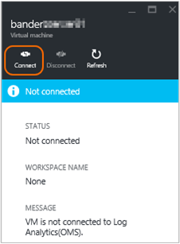

<properties
    pageTitle="Herstellen einer Verbindung Log Analytics mit Azure-virtuellen Computern | Microsoft Azure"
    description="Für Windows und Linux virtuellen Computern in Azure ausgeführt werden wird empfohlen von zusammengestellten Protokolle und Kennzahlen durch die Erweiterung Log Analytics Azure-virtuellen Computer installieren. Der Azure-Portal oder PowerShell können Sie um die Protokolldateien Analytics virtuellen Computern Erweiterung auf Azure-virtuellen Computern zu installieren."
    services="log-analytics"
    documentationCenter=""
    authors="richrundmsft"
    manager="jochan"
    editor=""/>

<tags
    ms.service="log-analytics"
    ms.workload="na"
    ms.tgt_pltfrm="na"
    ms.devlang="na"
    ms.topic="article"
    ms.date="10/10/2016"
    ms.author="richrund"/>

# <a name="connect-azure-virtual-machines-to-log-analytics"></a>Herstellen einer Verbindung Log Analytics mit Azure-virtuellen Computern

Für Windows und Linux Computern empfiehlt sich zum Erfassen von Protokollen und Kennzahlen indem Log Analytics-Agent installieren.

Die einfachste Möglichkeit zum Installieren des Log Analytics-Agents auf Azure-virtuellen Computern erfolgt über die Erweiterung Log Analytics virtueller Computer.  Mit der Erweiterung den Installationsvorgang vereinfacht und konfiguriert automatisch den Agent zum Senden von Daten in den Arbeitsbereich Log Analytics, den Sie angeben. Der Agent wird auch automatisch, aktualisiert, um sicherzustellen, dass Sie die neuesten Features und behoben haben.

Für Windows-virtuellen Computern aktivieren Sie die *Überwachung Microsoft-Agent* virtuellen Computern Erweiterung.
Für Linux-virtuellen Computern aktivieren Sie die Erweiterung *OMS Agent für Linux* virtuellen Computern.

Weitere Informationen zu [Azure-virtuellen Computern Extensions](../virtual-machines/virtual-machines-windows-extensions-features.md) und [Linux Agent] (... / virtual-machines/virtual-machines-linux-agent-user-guide.md).

Wenn Sie Agent-basierten Websitesammlung für Log Daten verwenden, müssen Sie konfigurieren [von Datenquellen in Log Analytics](log-analytics-data-sources.md) zum Angeben der Protokolle und Kriterien, die Sie erfassen möchten.

>[AZURE.IMPORTANT] Wenn Sie Log Analytics Index Log Daten mithilfe von [Azure Diagnose](log-analytics-azure-storage.md)konfigurieren, und Sie den Agent konfigurieren, um die gleichen Protokolle sammeln, werden die Protokolle der zweimal erfasst. Sie unterliegen für beide Datenquellen. Wenn Sie haben der Agent installiert ist, wird Sie Log Daten mithilfe des Agents alleine sammeln sollten – Log Analytics zum Sammeln von Daten aus Azure Diagnose nicht konfigurieren.

Es gibt drei einfache Verfahren in die Protokolldateien Analytics virtuellen Computern Erweiterung zu aktivieren:

+ Mithilfe des Azure-Portals
+ Mithilfe von Azure PowerShell
+ Mithilfe einer Vorlage Azure Ressourcenmanager

## <a name="enable-the-vm-extension-in-the-azure-portal"></a>Aktivieren Sie die virtuellen Computer Erweiterung Azure-Portal

Können Sie den Log Analytics-Agent installieren und der Azure-virtuellen Computern, die ausgeführt wird mithilfe der [Azure-Portal](https://portal.azure.com)auf Verbinden.

### <a name="to-install-the-log-analytics-agent-and-connect-the-virtual-machine-to-a-log-analytics-workspace"></a>Installieren Sie den Log Analytics-Agent und des virtuellen Computers zu einem Arbeitsbereich Log Analytics verbinden

1.  Melden Sie sich bei der [Azure-Portal](http://portal.azure.com)werden soll.
2.  Wählen Sie auf der linken Seite des Portals, **Navigieren** und wechseln Sie zu **Log Analytics (OMS)** , und wählen Sie ihn aus.
3.  Wählen Sie in der Liste der Log Analytics Arbeitsbereiche die, die Sie mit dem Azure-virtuellen Computer verwenden möchten.  
    
4.  Wählen Sie unter **Log Analytics Management** **virtuellen Computern**aus.  
    
5.  Wählen Sie in der Liste von **virtuellen Computern**des virtuellen Computers, auf dem der Agent installiert werden soll. Der **Verbindungsstatus OMS** für den virtuellen Computer zeigt an, dass sie **nicht verbunden**ist.  
    
6.  Wählen Sie die Details für den virtuellen Computer **Verbinden**. Der Agent wird automatisch installiert und konfiguriert für den Arbeitsbereich Log Analytics. Dieser Vorgang dauert einige Minuten, welche Zeitraums OMS Verbindungsstatus *eine Verbindung herstellen ist...*  
    
7.  Nach der Installation und den Agent verbinden, wird der **OMS** Verbindungsstatus aktualisiert werden, um **diesem Arbeitsbereich**anzuzeigen.  
    


## <a name="enable-the-vm-extension-using-powershell"></a>Aktivieren Sie die virtuellen Computer Erweiterung mithilfe der PowerShell

Es gibt verschiedene Befehle zum Azure-virtuellen Computern klassischen und Ressourcenmanager virtuellen Computern aus. Es folgen Beispiele für Classic und Ressourcenmanager virtuellen Computern.

Verwenden Sie für klassische virtuellen Computern im folgende Beispiel der PowerShell aus:

```
Add-AzureAccount

$workspaceId = "enter workspace ID here"
$workspaceKey = "enter workspace key here"
$hostedService = "enter hosted service here"

$vm = Get-AzureVM –ServiceName $hostedService

# For Windows VM uncomment the following line
# Set-AzureVMExtension -VM $vm -Publisher 'Microsoft.EnterpriseCloud.Monitoring' -ExtensionName 'MicrosoftMonitoringAgent' -Version '1.*' -PublicConfiguration "{'workspaceId': '$workspaceId'}" -PrivateConfiguration "{'workspaceKey': '$workspaceKey' }" | Update-AzureVM -Verbose

# For Linux VM uncomment the following line
# Set-AzureVMExtension -VM $vm -Publisher 'Microsoft.EnterpriseCloud.Monitoring' -ExtensionName 'OmsAgentForLinux' -Version '1.*' -PublicConfiguration "{'workspaceId': '$workspaceId'}" -PrivateConfiguration "{'workspaceKey': '$workspaceKey' }" | Update-AzureVM -Verbose
```

Verwenden Sie für Ressourcenmanager virtuellen Computern die im folgende Beispiel der PowerShell aus:

```
Login-AzureRMAccount
Select-AzureSubscription -SubscriptionId "**"

$workspaceName = "your workspace name"
$VMresourcegroup = "**"
$VMresourcename = "**"

$workspace = (Get-AzureRmOperationalInsightsWorkspace).Where({$_.Name -eq $workspaceName})

if ($workspace.Name -ne $workspaceName)
{
    Write-Error "Unable to find OMS Workspace $workspaceName. Do you need to run Select-AzureRMSubscription?"
}

$workspaceId = $workspace.CustomerId
$workspaceKey = (Get-AzureRmOperationalInsightsWorkspaceSharedKeys -ResourceGroupName $workspace.ResourceGroupName -Name $workspace.Name).PrimarySharedKey

$vm = Get-AzureRmVM -ResourceGroupName $VMresourcegroup -Name $VMresourcename
$location = $vm.Location

# For Windows VM uncomment the following line
# Set-AzureRmVMExtension -ResourceGroupName $VMresourcegroup -VMName $VMresourcename -Name 'MicrosoftMonitoringAgent' -Publisher 'Microsoft.EnterpriseCloud.Monitoring' -ExtensionType 'MicrosoftMonitoringAgent' -TypeHandlerVersion '1.0' -Location $location -SettingString "{'workspaceId': '$workspaceId'}" -ProtectedSettingString "{'workspaceKey': '$workspaceKey'}"

# For Linux VM uncomment the following line
# Set-AzureRmVMExtension -ResourceGroupName $VMresourcegroup -VMName $VMresourcename -Name 'OmsAgentForLinux' -Publisher 'Microsoft.EnterpriseCloud.Monitoring' -ExtensionType 'OmsAgentForLinux' -TypeHandlerVersion '1.0' -Location $location -SettingString "{'workspaceId': '$workspaceId'}" -ProtectedSettingString "{'workspaceKey': '$workspaceKey'}"


```
Wenn Sie Ihre virtuellen Computern mithilfe der PowerShell konfigurieren, müssen Sie den **Arbeitsbereich-ID** und die **Primärschlüssel**angeben. Sie können die Id und Key finden Sie auf **der Einstellungsseite des Portals OMS oder mithilfe der PowerShell, wie im vorherigen Beispiel dargestellt** .


## <a name="deploy-the-vm-extension-using-a-template"></a>Bereitstellen der virtuellen Computer Erweiterung mithilfe einer Vorlage

Mithilfe von Azure Ressourcenmanager, können Sie eine einfache Vorlage (im JSON-Format) erstellen, die die Bereitstellung und Konfiguration der Anwendung definiert. Diese Vorlage ist bekannt als Vorlage Ressourcenmanager und deklarativ definieren Bereitstellung bietet. Mithilfe einer Vorlage können Sie wiederholt die Anwendung im gesamten Lebenszyklus app bereitstellen und sicher sein, dass Ihre Ressourcen in einem konsistenten Zustand bereitgestellt werden.

Einschließlich des Log Analytics-Agents als Teil der Vorlage Ressourcenmanager, können Sie sicherstellen, dass jeder virtuelle Computer vorkonfiguriert, zu dem Arbeitsbereich Log Analytics Bericht wird.

Weitere Informationen zu Ressourcenmanager Vorlagen finden Sie unter [Azure Ressourcenmanager Authoring-Vorlagen](../resource-group-authoring-templates.md).

Es folgt ein Beispiel für eine Vorlage Ressourcenmanager, die verwendet wird, für die Bereitstellung von einer virtuellen Computern, die mit der Microsoft-Agent Überwachung Erweiterung installiert Windows ausgeführt wird. Diese Vorlage ist eine Vorlage typische virtuellen Computern mit folgenden Besonderheiten:

+ WorkspaceId und ein Parameter
+ Microsoft.EnterpriseCloud.Monitoring Ressource Erweiterungsabschnitt
+ Die WorkspaceId und WorkspaceSharedKey nachzuschlagen Ausgaben


```
{
  "$schema": "https://schema.management.azure.com/schemas/2015-01-01/deploymentTemplate.json#",
  "contentVersion": "1.0.0.0",
  "parameters": {
    "adminUsername": {
      "type": "string",
      "metadata": {
        "description": "Username for the Virtual Machine."
      }
    },
    "adminPassword": {
      "type": "securestring",
      "metadata": {
        "description": "Password for the Virtual Machine."
      }
    },
    "dnsLabelPrefix": {
       "type": "string",
       "metadata": {
          "description": "DNS Label for the Public IP. Must be lowercase. It should match with the following regular expression: ^[a-z][a-z0-9-]{1,61}[a-z0-9]$ or it will raise an error."
       }
    },
    "workspaceId": {
      "type": "string",
      "metadata": {
        "description": "OMS workspace ID"
      }
    },
    "workspaceName": {
      "type": "string",
      "metadata": {
         "description": "OMD workspace name"
      }
    },
    "windowsOSVersion": {
      "type": "string",
      "defaultValue": "2012-R2-Datacenter",
      "allowedValues": [
        "2008-R2-SP1",
        "2012-Datacenter",
        "2012-R2-Datacenter",
        "Windows-Server-Technical-Preview"
      ],
      "metadata": {
        "description": "The Windows version for the VM. This will pick a fully patched image of this given Windows version. Allowed values: 2008-R2-SP1, 2012-Datacenter, 2012-R2-Datacenter, Windows-Server-Technical-Preview."
      }
    }
  },
  "variables": {
    "storageAccountName": "[concat(uniquestring(resourceGroup().id), 'standardsa')]",
    "apiVersion": "2015-06-15",
    "imagePublisher": "MicrosoftWindowsServer",
    "imageOffer": "WindowsServer",
    "OSDiskName": "osdiskforwindowssimple",
    "nicName": "myVMNic",
    "addressPrefix": "10.0.0.0/16",
    "subnetName": "Subnet",
    "subnetPrefix": "10.0.0.0/24",
    "storageAccountType": "Standard_LRS",
    "publicIPAddressName": "myPublicIP",
    "publicIPAddressType": "Dynamic",
    "vmStorageAccountContainerName": "vhds",
    "vmName": "MyWindowsVM",
    "vmSize": "Standard_DS1",
    "virtualNetworkName": "MyVNET",
    "resourceId": "[resourceGroup().id]",
    "vnetID": "[resourceId('Microsoft.Network/virtualNetworks',variables('virtualNetworkName'))]",
    "subnetRef": "[concat(variables('vnetID'),'/subnets/',variables('subnetName'))]"
  },
  "resources": [
    {
      "type": "Microsoft.Storage/storageAccounts",
      "name": "[variables('storageAccountName')]",
      "apiVersion": "[variables('apiVersion')]",
      "location": "[resourceGroup().location]",
      "properties": {
        "accountType": "[variables('storageAccountType')]"
      }
    },
    {
      "apiVersion": "[variables('apiVersion')]",
      "type": "Microsoft.Network/publicIPAddresses",
      "name": "[variables('publicIPAddressName')]",
      "location": "[resourceGroup().location]",
      "properties": {
        "publicIPAllocationMethod": "[variables('publicIPAddressType')]",
        "dnsSettings": {
          "domainNameLabel": "[parameters('dnsLabelPrefix')]"
        }
      }
    },
    {
      "apiVersion": "[variables('apiVersion')]",
      "type": "Microsoft.Network/virtualNetworks",
      "name": "[variables('virtualNetworkName')]",
      "location": "[resourceGroup().location]",
      "properties": {
        "addressSpace": {
          "addressPrefixes": [
            "[variables('addressPrefix')]"
          ]
        },
        "subnets": [
          {
            "name": "[variables('subnetName')]",
            "properties": {
              "addressPrefix": "[variables('subnetPrefix')]"
            }
          }
        ]
      }
    },
    {
      "apiVersion": "[variables('apiVersion')]",
      "type": "Microsoft.Network/networkInterfaces",
      "name": "[variables('nicName')]",
      "location": "[resourceGroup().location]",
      "dependsOn": [
        "[concat('Microsoft.Network/publicIPAddresses/', variables('publicIPAddressName'))]",
        "[concat('Microsoft.Network/virtualNetworks/', variables('virtualNetworkName'))]"
      ],
      "properties": {
        "ipConfigurations": [
          {
            "name": "ipconfig1",
            "properties": {
              "privateIPAllocationMethod": "Dynamic",
              "publicIPAddress": {
                "id": "[resourceId('Microsoft.Network/publicIPAddresses',variables('publicIPAddressName'))]"
              },
              "subnet": {
                "id": "[variables('subnetRef')]"
              }
            }
          }
        ]
      }
    },
    {
      "apiVersion": "2015-06-15",
      "type": "Microsoft.Compute/virtualMachines",
      "name": "[variables('vmName')]",
      "location": "[resourceGroup().location]",
      "dependsOn": [
        "[concat('Microsoft.Storage/storageAccounts/', variables('storageAccountName'))]",
        "[concat('Microsoft.Network/networkInterfaces/', variables('nicName'))]"
      ],
      "properties": {
        "hardwareProfile": {
          "vmSize": "[variables('vmSize')]"
        },
        "osProfile": {
          "computername": "[variables('vmName')]",
          "adminUsername": "[parameters('adminUsername')]",
          "adminPassword": "[parameters('adminPassword')]"
        },
        "storageProfile": {
          "imageReference": {
            "publisher": "[variables('imagePublisher')]",
            "offer": "[variables('imageOffer')]",
            "sku": "[parameters('windowsOSVersion')]",
            "version": "latest"
          },
          "osDisk": {
            "name": "osdisk",
            "vhd": {
              "uri": "[concat('http://',variables('storageAccountName'),'.blob.core.windows.net/',variables('vmStorageAccountContainerName'),'/',variables('OSDiskName'),'.vhd')]"
            },
            "caching": "ReadWrite",
            "createOption": "FromImage"
          }
        },
        "networkProfile": {
          "networkInterfaces": [
            {
              "id": "[resourceId('Microsoft.Network/networkInterfaces',variables('nicName'))]"
            }
          ]
        },
        "diagnosticsProfile": {
          "bootDiagnostics": {
             "enabled": "true",
             "storageUri": "[concat('http://',variables('storageAccountName'),'.blob.core.windows.net')]"
          }
        }
      },
      "resources": [
        {
          "type": "extensions",
          "name": "Microsoft.EnterpriseCloud.Monitoring",
          "apiVersion": "[variables('apiVersion')]",
          "location": "[resourceGroup().location]",
          "dependsOn": [
            "[concat('Microsoft.Compute/virtualMachines/', variables('vmName'))]"
          ],
          "properties": {
            "publisher": "Microsoft.EnterpriseCloud.Monitoring",
            "type": "MicrosoftMonitoringAgent",
            "typeHandlerVersion": "1.0",
            "autoUpgradeMinorVersion": true,
            "settings": {
              "workspaceId": "[parameters('workspaceId')]"
            },
            "protectedSettings": {
              "workspaceKey": "[listKeys(resourceId('Microsoft.OperationalInsights/workspaces', parameters('workspaceName')), '2015-03-20').primarySharedKey]"
            }
          }
        }
      ]
    }
  ],
  "outputs": {
      "sharedKeyOutput": {
         "value": "[listKeys(resourceId('Microsoft.OperationalInsights/workspaces/', parameters('workspaceName')), '2015-03-20').primarySharedKey]",
         "type": "string"
      },
      "workspaceIdOutput": {
         "value": "[reference(concat('Microsoft.OperationalInsights/workspaces/', parameters('workspaceName')), '2015-03-20').customerId]",
        "type" : "string"
      }
  }
}
```

Sie können eine Vorlage mit dem folgenden PowerShell-Befehl bereitstellen:

```
New-AzureRmResourceGroupDeployment -ResourceGroupName $resourceGroupName -TemplateFile $templateFilePath
```

## <a name="troubleshooting-windows-virtual-machines"></a>Problembehandlung bei Windows-virtuellen Computern

Wenn die *Überwachung Microsoft-Agent* virtueller Computer Agent-Erweiterung nicht installieren oder reporting ist, können Sie die folgenden Schritte zur Behebung des Problems ausführen.

1. Überprüfen Sie, ob der Agent Azure-virtuellen Computer installiert ist und ordnungsgemäß anhand der Schritte in [KB 2965986](https://support.microsoft.com/kb/2965986#mt1)arbeiten.
  + Sie können auch die Protokolldatei virtueller Computer überprüfen.`C:\WindowsAzure\logs\WaAppAgent.log`
  + Wenn das Protokoll nicht vorhanden ist, wird der virtuellen Computer-Agent nicht installiert.
    - [Installieren Sie den Azure-virtuellen Computer-Agent auf klassische virtuellen Computern](../virtual-machines/virtual-machines-windows-classic-agents-and-extensions.md)
2. Bestätigen Sie, dass die Überwachung Microsoft-Agent Erweiterung Heartbeat Aufgabe ausgeführt wird, verwenden die folgenden Schritte aus:
  + Melden Sie sich bei der virtuellen Computern
  + Taskplaner öffnen und suchen Sie die `update_azureoperationalinsight_agent_heartbeat` Aufgabe
  + Bestätigen Sie die Aufgabe aktiviert ist, und einer Minute ausgeführt wird
  + Die Protokolldatei Heartbeat Einchecken`C:\WindowsAzure\Logs\Plugins\Microsoft.EnterpriseCloud.Monitoring.MicrosoftMonitoringAgent\heartbeat.log`
3. Überprüfen Sie die Protokolldateien von Microsoft Agent virtueller Computer für die Überwachung Erweiterung in`C:\Packages\Plugins\Microsoft.EnterpriseCloud.Monitoring.MicrosoftMonitoringAgent`
3. Sicherstellen Sie, dass die virtuellen Computern PowerShell-Skripts ausgeführt werden kann
4. Stellen Sie sicher, dass die Berechtigungen auf C:\Windows\temp nicht geändert wurden
5. Anzeigen des Status des Microsoft-Agents Überwachung durch Eingeben der folgenden in einem erhöhten PowerShell-Fenster des virtuellen Computers`  (New-Object -ComObject 'AgentConfigManager.MgmtSvcCfg').GetCloudWorkspaces() | Format-List`
6. Überprüfen Sie in die Microsoft-Agent Überwachung Setup-Protokolldateien`C:\Windows\System32\config\systemprofile\AppData\Local\SCOM\Logs`

Weitere Informationen finden Sie in der [Windows-Erweiterungen Problembehandlung](../virtual-machines/virtual-machines-windows-extensions-troubleshoot.md).

## <a name="troubleshooting-linux-virtual-machines"></a>Problembehandlung bei Linux virtuellen Computern

Wenn die *OMS-Agent für Linux* virtueller Computer-Agent-Erweiterung nicht installieren oder reporting ist, können Sie die folgenden Schritte zur Behebung des Problems ausführen.

1. Ist der Erweiterungsstatus *unbekannten* überprüfen Sie, ob der Agent Azure-virtuellen Computer installiert ist und überprüfen die Protokolldatei virtueller Computer ordnungsgemäß von arbeiten`/var/log/waagent.log`
  + Wenn das Protokoll nicht vorhanden ist, wird der virtuellen Computer-Agent nicht installiert.
  - [Installieren Sie den Azure-virtuellen Computer-Agent auf Linux virtuellen Computern](../virtual-machines/virtual-machines-linux-agent-user-guide.md)
2. Überprüfen Sie für andere fehlerhaften Status, der OMS-Agent für Linux VM Erweiterung Dateien im protokolliert `/var/log/azure/Microsoft.EnterpriseCloud.Monitoring.OmsAgentForLinux/*/extension.log` und`/var/log/azure/Microsoft.EnterpriseCloud.Monitoring.OmsAgentForLinux/*/CommandExecution.log`
3. Wenn der Erweiterungsstatus fehlerfrei ist, aber keine Daten hochgeladen werden, überprüfen Sie den OMS-Agent für Linux Protokolldateien in`/var/opt/microsoft/omsagent/log/omsagent.log`

Weitere Informationen finden Sie in der [Problembehandlung Linux Erweiterungen](../virtual-machines/virtual-machines-linux-extensions-troubleshoot.md).


## <a name="next-steps"></a>Nächste Schritte

+ Konfigurieren Sie [von Datenquellen in Log Analytics](log-analytics-data-sources.md) zum Angeben der Protokolle und Kennzahlen zu sammeln.
+ Zum Sammeln von Daten aus virtuellen Computern [Log Analytics hinzufügen Lösungen aus dem Lösungskatalog](log-analytics-add-solutions.md).
+ [Sammeln von Daten mithilfe von Azure-Diagnose](log-analytics-azure-storage.md) für weitere Ressourcen, die in Azure ausgeführt werden.

Auf Computern, die nicht in Azure sind, können Sie den Protokoll Analytics-Agent installieren, mithilfe der Methoden, die in den folgenden Artikeln beschrieben sind:

+ [Herstellen einer Verbindung Log Analytics mit Windows-Computern](log-analytics-windows-agents.md)
+ [Herstellen einer Verbindung Log Analytics mit Linux-Computern](log-analytics-linux-agents.md)
