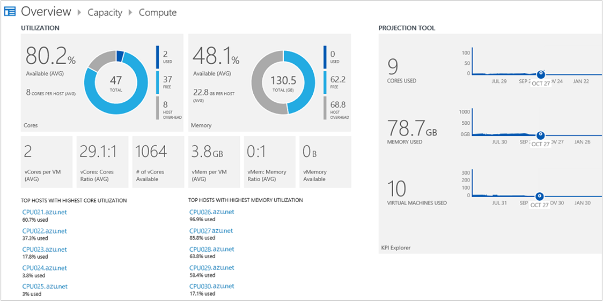

<properties
    pageTitle="Kapazität Management-Lösung in Log Analytics | Microsoft Azure"
    description="Die Kapazität Planning-Lösung können in Log Analytics Sie die Kapazität Ihrer Hyper-V Server verwaltete System Center virtuellen Computern Manager helfen können"
    services="log-analytics"
    documentationCenter=""
    authors="bandersmsft"
    manager="jwhit"
    editor=""/>

<tags
    ms.service="log-analytics"
    ms.workload="na"
    ms.tgt_pltfrm="na"
    ms.devlang="na"
    ms.topic="article"
    ms.date="10/10/2016"
    ms.author="banders"/>

# Kapazität Management-Lösung in Log Analytics

Die Kapazität Planning-Lösung können in Log Analytics Sie die Kapazität Ihrer Hyper-V Server verwaltete System Center virtuellen Computern Manager helfen können. Diese Lösung erfordert sowohl System Center Operations Manager und System Center virtuellen Computern Manager. Kapazität, Planung nicht verfügbar, wenn Sie nur direkt angeschlossenes Agents verwenden. Sie installieren die Lösung, um die Operations Manager-Agent aktualisieren. Die Lösung Leistungsindikatoren auf dem überwachten Server liest und sendet Verwendungsdaten OMS-Dienst in der Cloud für Verarbeitung. Logik wird angewendet, um die Verwendungsdaten und Cloud-Dienst zeichnet die Daten. Im Laufe der Zeit Verwendungsmuster identifiziert werden und Kapazität Erwarteter, basierend auf den Stromverbrauch.

Beispielsweise möglicherweise eine Projektion identifizieren, die für einen einzelnen Server zusätzliche Prozessorkerne oder zusätzlicher Speicher benötigt werden. In diesem Beispiel kann die Projektion darauf hinweisen, dass in 30 Tagen ab der Server zusätzlichen Speicher benötigen. Dies kann Ihnen planen für ein Upgrade Arbeitsspeicher während der nächsten Wartungsfenster des Servers, die zwei Wochen auftreten können.

>[AZURE.NOTE] Die Kapazitätsmanagement-Lösung ist nicht verfügbar, Arbeitsbereiche hinzugefügt werden. Kunden, die Kapazität Management-Lösung installiert haben, können weiterhin die Lösung verwenden.  

Die Kapazität, Planung Lösung ist der folgende Kunde Adresse Herausforderung gemeldet gerade aktualisiert:

- Anforderung von virtuellen Computern-Manager und Operations Manager
- Unfähigkeit zum Anpassen/Filter auf der Grundlage von Gruppen
- Stündlich Datenaggregation häufigere nicht ausreichend
- Keine virtuellen Computer Ebenen Einsichten
- Zuverlässigkeit für Daten

Vorteile der neuen Kapazität Lösung:

- Unterstützen Sie detaillierte Datensammlung mit verbesserte Zuverlässigkeit und Genauigkeit
- Unterstützung für Hyper-V ohne VMM
- Visualisierung von Kriterien in PowerBI
- Einsichten auf oberster Ebene Auslastung virtueller Computer

## Installieren und konfigurieren die Lösung
Verwenden Sie die folgende Informationen zum Installieren und konfigurieren die Lösung.

- Operations Manager ist erforderlich, damit die Kapazitätsmanagement-Lösung.
- Virtuellen Computern Manager ist erforderlich, damit die Kapazitätsmanagement-Lösung.
- Vorgänge-Manager die Verbindung mit virtuellen Computern Manager (VMM) ist erforderlich. Weitere Informationen zum Herstellen einer Verbindung die Systeme, finden Sie unter [VMM mit Operations Manager verbinden](http://technet.microsoft.com/library/hh882396.aspx).
- Operations Manager muss mit Log Analytics verbunden sein.
- Fügen Sie die Kapazitätsmanagement-Lösung in Ihren OMS Arbeitsbereich mithilfe des Prozesses [Hinzufügen Log Analytics Lösungen aus dem Lösungskatalog](log-analytics-add-solutions.md)beschrieben.  Es ist keine weitere Konfiguration erforderlich.

## Kapazität Management Einzelheiten zur Datensammlung

Kapazität Management sammelt Performance-Daten, Metadaten und Bundesstaat-Daten, die über die Agents, die Sie aktiviert haben.

Die folgende Tabelle zeigt Datensammlungsmethoden und andere Details, wie Daten für die Verwaltung von Kapazität erfasst werden.

| Plattform | Direkte Agent | SCOM agent | Azure-Speicher | SCOM erforderlich? | SCOM Agentdaten per Management Group unter gesendeten | Häufigkeit Collection |
|---|---|---|---|---|---|---|
|Windows||||            || stündlich|

Die folgende Tabelle zeigt Beispiele für Datentypen von Kapazitätsmanagement erfasst:

|**Datentyp**|**(Felder)**|
|---|---|
|Metadaten|BaseManagedEntityId, ObjectStatus, OrganizationalUnit, ActiveDirectoryObjectSid, PhysicalProcessors, Netzwerkname, IP-Adresse, ForestDNSName, NetbiosComputerName, VirtualMachineName, LastInventoryDate, HostServerNameIsVirtualMachine, IP-Adresse, NetbiosDomainName, LogicalProcessors, DNS-Name, DisplayName, DomainDnsName, ActiveDirectorySite, ' PrincipalName ', OffsetInMinuteFromGreenwichTime|
|Leistung|Objektname CounterName PerfmonInstanceName PerformanceDataId PerformanceSourceInternalID SampleValue TimeSampled, TimeAdded|
|Bundesstaat|StateChangeEventId, State-ID, NewHealthState, OldHealthState, Kontext, TimeGenerated, TimeAdded, StateId2, BaseManagedEntityId, MonitorId, HealthState, LastModified, LastGreenAlertGenerated, DatabaseTimeModified|

## Kapazität Verwaltungsseite

 Nachdem die Lösung planen Kapazität installiert ist, können Sie die Kapazität Ihrer überwachten Server mithilfe der Kachel **Kapazität Planung** auf der Seite **Übersicht** in OMS anzeigen.

Die Kachel Öffnet das **Kapazitätsmanagement** Dashboard, in dem Sie eine Zusammenfassung Ihrer Server-Kapazität anzeigen können. Die Seite zeigt die folgenden Kacheln, auf den Sie klicken können:

- *Anzahl von virtuellen Computern*: Zeigt die Anzahl der Tage, die für die Kapazität des virtuellen Computern verbleibende
- *Berechnet*: Zeigt Prozessorkerne und verfügbaren Arbeitsspeicher
- *Speicher*: Zeigt den Speicherplatz verwendet und Mittelwert der Datenträgerwartezeit
- *Suche*: Daten-Explorer, die Sie zum Suchen nach Daten in das System OMS verwenden können

### Zum Anzeigen einer Seite Kapazität

- Klicken Sie auf der Seite **Übersicht** klicken Sie auf **Vertrieb Kapazität**, und klicken Sie dann auf **berechnen** oder **Speicher**.

## Berechnen der Seite

Sie können das Dashboard **berechnen** in Microsoft Azure OMS verwenden, um Kapazitätsinformationen Auslastung, Erwarteter Tage Kapazität, und Effizienz, die im Zusammenhang mit Ihrer Infrastruktur anzuzeigen. Sie verwenden den Bereich **Auslastung** , um Core und Speicherkapazität CPU-Auslastung in Ihrer virtuellen Computerhosts anzuzeigen. Das Tool Projektion können Sie schätzen, wie viel Kapazität erwartet wird für einen bestimmten Zeitraum hinweg verfügbar sein. Den Bereich **Effizienz** können Sie sehen, wie effizient Ihre Hosts virtuellen Computern sind. Sie können die Details für verknüpfte Elemente anzeigen, indem Sie darauf klicken.

Sie können eine Excel-Arbeitsmappe für die folgenden Kategorien generieren:

- Verwendete Hosts mit den höchsten Core Auslastung
- Mit den höchsten arbeitsspeichernutzung verwendete hosts
- Verwendete Hosts mit nicht effizient virtuellen Computern
- Verwendete Hosts durch Auslastung
- Unten Hosts durch Auslastung

Auf dem Dashboard **zu berechnen** , werden die folgenden Bereiche angezeigt:

**Auslastung**: Ansicht CPU Core und RAM-Nutzung in Ihrem virtuellen Computerhosts.

- *Kerne verwendet*: Summe für alle Hosts (% von der CPU-Auslastung genutzt multipliziert mit der Anzahl der physische Kerne Host).
- *Kostenlose Kerne*: gesamte physische Kernen minus verwendeten Kerne.
- *Prozentsatz Kerne verfügbar*: physische Kernen geteilt durch die Gesamtzahl der physischen Kernen frei.
- *Virtuelle Kerne pro virtueller Computer*: gesamte virtuelle Kerne im System geteilt durch die Gesamtzahl der virtuellen Computern im System.
- *Virtuelle Kerne physische Kerne Verhältnis*: Verhältnis zwischen der Summe physischen Kernen für physische Kerne, die von virtuellen Computern im System verwendet werden.
- *Anzahl der virtuelle Kerne verfügbar*: virtuelle Core physischen Kernen Verhältnis multipliziert mit den verfügbaren physische Kerne.
- *Arbeitsspeicher verwendet*: Summe der Arbeitsspeicher, die von allen Hosts genutzt wird.
- *Kostenlose Arbeitsspeicher*: Gesamter physischen Speicher Minuszeichen Speicher verwendet.
- *Prozentsatz Arbeitsspeicher verfügbar*: physischen Speicher geteilt durch die Gesamtgröße für den Arbeitsspeicher freigeben.
- *Virtueller Speicher pro virtueller Computer*: virtueller Speicher im System insgesamt dividiert durch die Gesamtzahl der virtuellen Computern im System.
- *Virtueller Speicher zum physischen Arbeitsspeicher Verhältnis*: virtueller Speicher im System insgesamt dividiert durch den gesamten physischen Speicher im System.
- *Virtueller Speicher verfügbar*: virtueller Speicher zum Arbeitsspeicher Verhältnis multipliziert mit den verfügbaren physischen Speicher.

**Projektion tool**

Mithilfe des Tools für die Projektion zu verwenden, können Sie für die Nutzung der Ressource zurückliegenden Trends anzeigen. Dies umfasst die Verwendungstrends für virtuellen Computern, Speicher, Core und Speicher. Die Funktion Projektion verwendet einen Projektion mit deren Hilfe Sie wissen, wann Sie aus jeder der Ressourcen ausgeführt werden. Auf diese Weise können Sie die richtige Kapazität, Planung, damit Sie wissen können, wenn Sie mehr Kapazität (z. B. Arbeitsspeicher, Kerne oder Speicher) kaufen müssen berechnen.

**Effizienz**

- *Im Leerlauf virtueller Computer*: verwenden weniger als 10 % des Arbeitsspeichers CPU- und 10 % für den angegebenen Zeitraum.
- *Überlastet virtueller Computer*: Verwenden von mehr als 90 % des Arbeitsspeichers CPU- und 90 % für den angegebenen Zeitraum.
- *Im Leerlauf Host*: verwenden weniger als 10 % des Arbeitsspeichers CPU- und 10 % für den angegebenen Zeitraum.
- *Überlastet Host*: Verwenden von mehr als 90 % des Arbeitsspeichers CPU- und 90 % für den angegebenen Zeitraum.

### Arbeiten mit Elementen auf der Seite berechnen

1. Auf dem Dashboard **berechnen** im Bereich **Auslastung** zeigen Sie Kapazitätsinformationen zu den CPUs und Speicher verwendet an.
2. Klicken Sie auf ein Element, um in **die Suchseite** öffnen und Anzeigen detaillierter Informationen zu erhalten.
3. Klicken Sie im Tool **Projektion** den Schieberegler Datum eine Projektion der Kapazität angezeigt werden, die auf das Datum verwendet werden, die Sie auswählen.
4. Klicken Sie im Bereich **Effizienz** zeigen Sie Kapazität Effizienz Informationen über virtuellen Computern und virtuellen Computerhosts an

## Direkte angefügt Speicher-Seite

Sie können das **Direkte angefügt Speicher** Dashboard in OMS verwenden, um Kapazitätsinformationen Speicher Nutzung, Datenträger Leistung und geplanten Tage der Speicherkapazität anzuzeigen. Sie verwenden den Bereich **Auslastung** Datenträgerspeicherplatz-Nutzung in Ihrem virtuellen Computerhosts anzeigen aus. Der **Datenträger** Leistungsbereich können Sie in Ihrem virtuellen Computerhosts Datenträgerdurchsatz und Wartezeit anzeigen. Das Tool Projektion können Sie auch schätzen, wie viel Kapazität erwartet wird für einen bestimmten Zeitraum hinweg verfügbar sein. Sie können die Details für verknüpfte Elemente anzeigen, indem Sie darauf klicken.

Sie können eine Excel-Arbeitsmappe aus diesen Kapazitätsinformationen für die folgenden Kategorien generieren:

- Verwendung von verwendete Speicherplatz vom host
- Verwendete durchschnittliche Wartezeit von host

Die folgenden Bereiche sind auf der Seite **Speicher** dargestellt:

- *Auslastung*: Datenträgerspeicherplatz-Nutzung in Ihrem virtuellen Computerhosts anzeigen.
- *Gesamt-Festplattenspeicher*: Summe (logische Speicherplatz) für alle Hosts
- *Festplattenspeicher verwendet*: Summe (verwendeten logischen Speicherplatz) für alle Hosts
- *Verfügbarer Speicherplatz*: Speicherplatz minus verwendeten Speicherplatz insgesamt
- *Prozentsatz Datenträger verwendet*: verwendet Speicherplatz geteilt durch Gesamter Speicherplatz
- *Prozentsatz Datenträger verfügbar*: verfügbarer Speicherplatz geteilt durch die Gesamter Speicherplatz

**Datenträger Leistung**

Mithilfe von OMS, können Sie den Trend zurückliegenden Verwendung Ihrer Festplattenspeicher anzeigen. Die Funktion Projektion verwendet einen Algorithmus, um eine zukünftige Verwendung von Project. Für die Verwendung von Speicherplatz ermöglicht insbesondere der Projektion Videofunktionen project beim möglicherweise nicht genügend Speicherplatz ausführen. Dies hilft Ihnen, die richtige Speicher planen und wissen, wenn Sie mehr Speicherplatz kaufen müssen.

**Projektion Tool**

Mithilfe des Tools für die Projektion zu verwenden, können Sie für Ihre Datenträger Speicherplatz Auslastung zurückliegenden Trends anzeigen. Die Projektion-Funktion können Sie auch project, wenn Sie nicht genügend Speicherplatz ausgeführt werden. Dies hilft Ihnen bei der Planung gemischte Kapazität und wissen, wenn Sie mehr Speicherkapazität kaufen müssen.

### Arbeiten mit Elementen auf der Seite direkt angefügt Speicher

1. Auf dem Dashboard **Direkt angefügt Speicher** können im Bereich **Auslastung** Sie die Auslastung Information anzeigen.
2. Klicken Sie auf ein verknüpftes Element aus, um ihn zu öffnen auf **der Suchseite** Anzeigen detaillierter Informationen zu erhalten.
3. Klicken Sie im Bereich **Datenträger Leistung** können Sie Datenträger Durchsatz und Wartezeit Informationen anzeigen.
4. Klicken Sie im **Tool Projektion**den Schieberegler Datum eine Projektion der Kapazität angezeigt werden, die auf das Datum verwendet werden, die Sie auswählen.

## Nächste Schritte

- Verwenden Sie [Log Analytics Log durchsucht](log-analytics-log-searches.md) , um detaillierte Kapazität Management Daten anzuzeigen.
