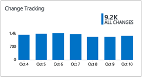
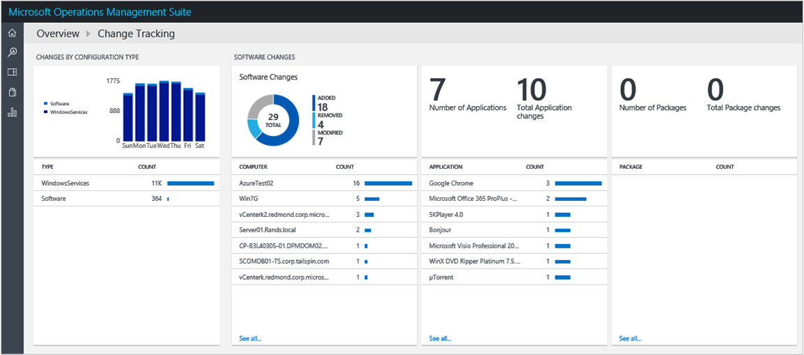

<properties
    pageTitle="Änderungsnachverfolgung-Lösung in Log Analytics | Microsoft Azure"
    description="Sie können die Lösung Änderungsprotokoll muss Konfiguration in Log Analytics verwenden, mit deren Hilfe Sie einfach zu identifizieren, Software und Dienste Windows Änderungen, die in Ihrer Umgebung auftreten – diese Änderungen Konfiguration identifizieren hilft Ihnen, Probleme pinpoint."
    services="operations-management-suite"
    documentationCenter=""
    authors="bandersmsft"
    manager="jwhit"
    editor=""/>

<tags
    ms.service="operations-management-suite"
    ms.workload="na"
    ms.tgt_pltfrm="na"
    ms.devlang="na"
    ms.topic="article"
    ms.date="10/10/2016"
    ms.author="banders"/>

# Verlauf-Lösung in Log Analytics ändern

Sie können die Lösung Änderungsprotokoll muss Konfiguration in Log Analytics verwenden, mit deren Hilfe Sie einfach zu identifizieren, Software und Dienste Windows Änderungen und Linux Daemon Änderungen, die in Ihrer Umgebung auftreten – diese Änderungen Konfiguration identifizieren hilft Ihnen, Probleme pinpoint.

Sie installieren die Lösung, um den Typ des Agents zu aktualisieren, die Sie installiert haben. Änderungen Software installiert, und Windows-Dienste auf den überwachten Servern gelesen wurden, und klicken Sie dann die Daten mit dem Log Analytics-Dienst in der Cloud für die Verarbeitung gesendet werden. Logik wird angewendet, um die empfangenen Daten und der Cloud-Dienst Einträge die Daten. Wenn Änderungen gefunden werden, werden im Dashboard Änderungsprotokoll muss Servers mit Änderungen angezeigt. Unter Verwendung der Informationen auf dem Dashboard Änderungsprotokoll muss, sehen Sie einfach die Änderungen, die in Ihrer Server-Infrastruktur vorgenommen wurden.

## Installieren und konfigurieren die Lösung
Verwenden Sie die folgende Informationen zum Installieren und konfigurieren die Lösung.

- Operations Manager ist für die nachverfolgung von Lösung erforderlich.
- Sie müssen einen Windows oder Operations Manager-Agent auf jedem Computer verfügen, wo Sie Änderungen überwachen möchten.
- Fügen Sie die Lösung Änderungsprotokoll muss in den OMS Arbeitsbereich mithilfe des Prozesses [Hinzufügen Log Analytics Lösungen aus dem Lösungskatalog](log-analytics-add-solutions.md)beschrieben.  Es ist keine weitere Konfiguration erforderlich.

## Einzelheiten zur Datensammlung Verlauf ändern

Änderungsnachverfolgung sammelt die Software Inventory und Windows-Dienst-Metadaten, die mit den Agents, die Sie aktiviert haben.

Die folgende Tabelle zeigt Datensammlungsmethoden und andere Details, wie Daten für das Änderungsprotokoll erfasst werden.

| Plattform | Direkte Agent | SCOM agent | Azure-Speicher | SCOM erforderlich? | SCOM Agentdaten per Management Group unter gesendeten | Häufigkeit Collection |
|---|---|---|---|---|---|---|
|Windows||||            || stündlich|

## Verwenden von Überarbeitungen

Nachdem die Lösung installiert ist, können Sie die Zusammenfassung der Änderungen für Ihre überwachten Servern anzeigen, mithilfe der Kachel **Änderungsprotokoll muss** auf der Seite **Übersicht** in OMS.

Sie können Änderungen an Ihrer Infrastruktur und dann Drillinto Details für die folgenden Kategorien anzeigen:

- Geben Sie Änderungen von Konfiguration für Software und Dienste für Windows
- Software ändert sich in Anwendungen und Updates für einzelne Server
- Gesamtzahl der Software Änderungen für jede Anwendung
- Windows-Dienst Änderungen für einzelne Server

### Zum Anzeigen von ändern Änderungen nach jedem Typ

1. Klicken Sie auf der Seite **Übersicht** auf die Kachel **Überwachung ändern** .
2. Überprüfen Sie auf dem Dashboard **Überwachung ändern** die Zusammenfassungsinformationen in einem Blade Typ ändern, und klicken Sie dann auf Termin, um eine ausführliche Informationen auf der Seite **Log Suche** anzeigen.
3. Auf den Seiten Log suchen können Sie Ergebnisse nach Zeit, detaillierte Ergebnisse und Verlauf der Log-durchsuchen anzeigen. Sie können auch durch die Ergebnisse eingrenzen Bereichen filtern.

## Nächste Schritte

- Verwenden Sie [Log Analytics Log durchsucht](log-analytics-log-searches.md) , um detaillierte Daten im Änderungsprotokoll anzuzeigen.
