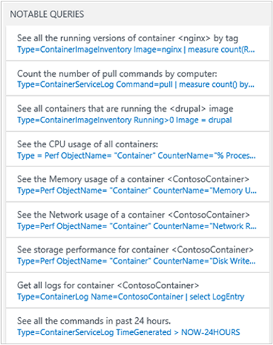

<properties
    pageTitle="Container-Lösung in Log Analytics | Microsoft Azure"
    description="Die Lösung Container in Log Analytics hilft Ihnen der anzeigen und Verwalten Ihrer Docker Container Hosts in einem einzigen Speicherort."
    services="log-analytics"
    documentationCenter=""
    authors="bandersmsft"
    manager="jwhit"
    editor=""/>

<tags
    ms.service="log-analytics"
    ms.workload="na"
    ms.tgt_pltfrm="na"
    ms.devlang="na"
    ms.topic="article"
    ms.date="10/10/2016"
    ms.author="banders"/>


# <a name="containers-preview-solution-log-analytics"></a>Container (Preview) Lösung Log Analytics

Dieser Artikel beschreibt, wie Sie einrichten und verwenden die Lösung Container in Log Analytics, das Sie anzeigen und Verwalten Ihrer Docker Container Hosts in einem einzigen Speicherort unterstützt. Docker ist ein Software-Virtualisierung-System verwendet, um den Container erstellen, die Bereitstellung von Software für ihre IT-Infrastruktur automatisieren.

Mit der Lösung können Sie sehen, welche Container auf Ihre Container Hosts ausgeführt werden, und welche Bilder in den Containern ausgeführt werden. Sie können mit Container verwendete Befehle mit detaillierten Audit-Informationen anzeigen. Und Sie können Container beheben, indem anzeigen und zentralisierte Protokolle ohne Docker Hosts Einsicht in suchen. Sie können Container suchen, die möglicherweise laut und in Anspruch nehmen übermäßige Ressourcen auf einem Host. Und Sie können die zentrale CPU, Arbeitsspeicher, Speicher und Netzwerk Verwendung und Leistung Informationen für Container anzeigen.

## <a name="installing-and-configuring-the-solution"></a>Installieren und konfigurieren die Lösung

Verwenden Sie die folgende Informationen zum Installieren und konfigurieren die Lösung.

Fügen Sie die Lösung Container in den OMS Arbeitsbereich mithilfe des Prozesses [Hinzufügen Log Analytics Lösungen aus dem Lösungskatalog](log-analytics-add-solutions.md)beschrieben.

Es gibt zwei Methoden zum Installieren und Verwenden von Docker mit OMS aus:

- Unter den Betriebssystemen unterstützten Linux installieren Sie und führen Sie Docker aus und dann installieren Sie und konfigurieren Sie OMS-Agent für Linux
- Installieren Sie auf CoreOS und führen Sie Docker aus und konfigurieren Sie der OMSAgent innerhalb eines Containers ausführen

Überprüfen Sie die unterstützten Docker und Linux Betriebssystemversionen für Ihren Container Host auf [GitHub](https://github.com/Microsoft/OMS-docker)ein.

>[AZURE.IMPORTANT] Docker muss laufenden **vor** der [OMS-Agent für Linux](log-analytics-linux-agents.md) auf Ihre Container Hosts zu installieren. Wenn Sie vor der Neuinstallation Docker bereits der Agent installiert haben, müssen Sie den OMS-Agent für Linux neu zu installieren. Weitere Informationen zu Docker finden Sie unter der [Docker-Website](https://www.docker.com).

Sie benötigen die folgenden Einstellungen auf Ihre Container Hosts konfiguriert werden, bevor Sie Container überwachen können.

## <a name="configure-settings-for-the-linux-container-host"></a>Konfigurieren von Einstellungen für den Linux Container host

Nachdem Sie Docker installiert haben, verwenden Sie die folgenden Einstellungen für Ihren Container Host den Agent für die Verwendung mit Docker konfigurieren. Diese Konfigurationsmethode unterstützt keine CoreOS.

### <a name="to-configure-settings-for-the-container-host---systemd-suse-opensuse-centos-7x-rhel-7x-and-ubuntu-15x-and-higher"></a>So konfigurieren Sie die Einstellungen für den Container Host - Systemd (SUSE, OpenSUSE, CentOS 7.x, RHEL 7.x und Ubuntu 15.x und höher)

1. Bearbeiten Sie docker.service, um die folgenden hinzuzufügen:

    ```
    [Service]
    ...
    Environment="DOCKER_OPTS=--log-driver=fluentd --log-opt fluentd-address=localhost:25225"
    ...
    ```

2. Hinzufügen von $DOCKER\_-Optionen &quot;ExecStart = / Usr/Bin/Docker Daemon&quot; in der Datei docker.service. Im folgende Beispiel wird verhindert.

    ```
    [Service]
    Environment="DOCKER_OPTS=--log-driver=fluentd --log-opt fluentd-address=localhost:25225"
    ExecStart=/usr/bin/docker daemon -H fd:// $DOCKER_OPTS
    ```

3. Starten Sie den Docker-Dienst. Beispiel:

    ```
    sudo systemctl restart docker.service
    ```

### <a name="to-configure-settings-for-the-container-host---upstart-ubuntu-14x"></a>So konfigurieren Sie die Einstellungen für den Container Host - Upstart (Ubuntu 14.x)

1. Bearbeiten Sie /etc/default/docker, und fügen Sie Folgendes ein:

    ```
    DOCKER_OPTS="--log-driver=fluentd --log-opt fluentd-address=localhost:25225"
    ```

2. Speichern Sie die Datei, und starten Sie die Dienste Docker und OMS.

    ```
    sudo service docker restart
    ```

### <a name="to-configure-settings-for-the-container-host---amazon-linux"></a>So konfigurieren Sie die Einstellungen für den Container Host - Amazon Linux

1. Bearbeiten Sie /etc/sysconfig/docker, und fügen Sie Folgendes ein:

    ```
    OPTIONS="--log-driver=fluentd --log-opt fluentd-address=localhost:25225"
    ```

2. Speichern Sie die Datei, und starten Sie den Dienst Docker.

    ```
    sudo service docker restart
    ```

## <a name="configure-settings-for-coreos-containers"></a>Konfigurieren von Einstellungen für CoreOS Container

Nachdem Sie Docker installiert haben, verwenden Sie die folgenden Einstellungen für CoreOS Docker ausführen und einen Container erstellen. Sie können eine unterstützte Version von Linux verwenden – einschließlich CoreOS, bei dieser Konfigurationsmethode. Sie benötigen Ihre [OMS Arbeitsbereich-ID und -Taste](log-analytics-linux-agents.md).

### <a name="to-use-oms-for-all-containers-with-coreos"></a>OMS für alle Container mit CoreOS verwendet werden soll.

- Starten Sie den OMS Container, den Sie überwachen möchten. Ändern Sie, und verwenden Sie das folgende Beispiel.

  ```
sudo docker run --privileged -d -v /var/run/docker.sock:/var/run/docker.sock -e WSID="your workspace id" -e KEY="your key" -h=`hostname` -p 127.0.0.1:25224:25224/udp -p 127.0.0.1:25225:25225 --name="omsagent" --log-driver=none --restart=always microsoft/oms
```

### <a name="switching-from-using-an-installed-agent-to-one-in-a-container"></a>Umsteigen von mithilfe einer installierten Agents auf einen in einem container

Wenn Sie zuvor den Agent direkt installiert verwendet und verwenden Sie stattdessen einen Agent in einem Container ausgeführt werden soll, müssen Sie zuerst OMSAgent entfernen. [Schritte zum Installieren des Agents OMS für Linux](https://github.com/Microsoft/OMS-Agent-for-Linux/blob/master/docs/OMS-Agent-for-Linux.md)angezeigt.

## <a name="containers-data-collection-details"></a>Einzelheiten zur Datensammlung Container

Die Lösung Container sammelt verschiedene Leistung Kennzahlen und Log Container Hosts und Container mit den OMS-Agents für Linux, die Sie aktiviert haben, und von OMSAgent im Container ausgeführt.

Die folgende Tabelle zeigt Datensammlungsmethoden und andere Details, wie Daten für Container erfasst werden.

| Plattform | OMS-Agent für Linux | SCOM agent | Azure-Speicher | SCOM erforderlich? | SCOM Agentdaten per Management Group unter gesendeten | Häufigkeit Collection |
|---|---|---|---|---|---|---|
|Linux||||            || alle 3 Minuten|


In der folgenden Tabelle werden Beispiele Datentypen, die von der Lösung Container erfasst:

| Datentyp | (Felder) |
| --- | --- |
| Leistung für Hosts und Container | Computer, Objektname, CounterName und #40; % Prozessorzeit Datenträger liest MB Datenträger schreibt MB, Arbeitsspeicher Verwendung MB, Netzwerk empfangenen Bytes, Netzwerk senden Bytes, Prozessor Verwendung sec, Netzwerk & #41; Beträge, TimeGenerated, CounterPath, SourceSystem |
| Container inventory | TimeGenerated, Computer, Containername, ContainerHostname, Bild, ImageTag, ContinerState, ExitCode, EnvironmentVar, Befehl, CreatedTime, StartedTime, FinishedTime, SourceSystem, ContainerID, ImageID |
| Container Bild inventory | TimeGenerated, Computer, Bild, ImageTag, ImageSize, VirtualSize, Ausführung angehalten, beendet, fehlschlug, SourceSystem, ImageID, TotalContainer |
| Container log | TimeGenerated, Computer, Bild-ID, Containername, LogEntrySource, LogEntry, SourceSystem, ContainerID |
| Container-Protokoll | TimeGenerated, Computer, TimeOfCommand, Bild, Befehl, SourceSystem, ContainerID |

## <a name="monitor-containers"></a>Überwachen von Containern

Nachdem Sie die Lösung im Portal OMS aktiviert haben, sehen Sie die **Container** Kachel mit Zusammenfassungsinformationen zu Ihrem Container Hosts und den Container in Hosts ausgeführt.


Die Kachel zeigt einen Überblick über wie viele Container stehen Ihnen in der Umgebung und gibt an, ob diese fehlgeschlagen sind, ausgeführt wird, oder beendet.

### <a name="using-the-containers-dashboard"></a>Verwenden das Container dashboard

Klicken Sie auf die Kachel **Container** . Von dort aus wird Ansichten geordnet angezeigt:

- Containerereignisse
- Fehler
- Container Status
- Container Bild Inventory
- CPU- und Leistung

Jedes Bereichs im Dashboard ist eine visuelle Darstellung einer Suche, die auf gesammelten Daten ausgeführt wird.


Klicken Sie in das Blade **Container Status** auf oberen Bereich, wie unten dargestellt.


Log suchen wird geöffnet und Informationen zu den Hosts und Container in ihnen ausgeführt.


Von hier aus können Sie die Suchabfrage zum Ändern, um bestimmte Informationen zu finden, dass Sie interessiert bearbeiten. Weitere Informationen zu Log Suchbegriffe finden Sie unter [Log Analytics Log durchsucht](log-analytics-log-searches.md).

Beispielsweise können Sie die Suchabfrage ändern, damit er zeigt die beendet Container anstelle eines laufenden Containers auf **beendet** in der Suchabfrage ändern **ausgeführt** .

## <a name="troubleshoot-by-finding-a-failed-container"></a>Behandeln von Problemen mit anhand der Suche nach einem Fehler beim container

OMS markiert ein Containers als **fehlgeschlagen** , wenn es durch den Beendigungscode ungleich Null beendet wurde. Sie können einen Überblick über die Fehler und Fehlern in der Umgebung in das Blade **Fehler beim Container** anzeigen.

### <a name="to-find-failed-containers"></a>Fehler beim Container finden

1. Klicken Sie auf den **Containerereignisse** Blade.  
  
2. Log-Suchfeld anzeigen des Status von Containern, ähnlich wie der folgende wird geöffnet.  
  
3. Klicken Sie als Nächstes auf den fehlerhaften Wert um zusätzliche Informationen, wie z. B. Bildgröße und die Anzahl der beendet und fehlgeschlagene Bilder anzuzeigen. Erweitern Sie **Weitere anzeigen** , um das Bild-ID anzuzeigen.  
  
4. Suchen Sie als Nächstes den Container, der diese Abbildung ausgeführt wird. Geben Sie in die Suchabfrage Folgendes ein.
  `Type=ContainerInventory <ImageID>`Dadurch wird die Protokolle angezeigt. Sie können einen Bildlauf durchführen, um den fehlerhaften Container anzuzeigen.  
  


## <a name="search-logs-for-container-data"></a>Suchen von Protokollen für Container Daten

Wenn Sie Probleme mit einen bestimmten Fehler sind, kann es hilfreich sehen, wo es in Ihrer Umgebung auftritt. Die folgenden Arten von Log hilft Ihnen Abfragen erstellen, um die Informationen zurückgeben bilden sollen.

- **ContainerInventory** – verwenden Sie diese Art, wenn Sie Informationen zu den Container-Speicherort, was deren Namen sind und welche Bilder möchten sie ausgeführt.
- **ContainerImageInventory** – verwenden Sie diese Art, wenn Sie versuchen, zum Suchen nach Informationen organisiert Bild und Bildinformationen, wie etwa Bild-IDs oder Schriftgrade anzeigen.
- **ContainerLog** – verwenden Sie diese Art, wenn Sie bestimmte Informationen zum Fehlerprotokoll und Einträge suchen möchten.
- **ContainerServiceLog** – verwenden Sie diese Art, wenn Sie versuchen, Prüfprotokollinformation für den Docker Daemon, z. B. starten, beenden, löschen oder Abruf Befehle finden.

### <a name="to-search-logs-for-container-data"></a>So suchen Sie die Protokolle für Container Daten

- Wählen Sie ein Bild, das Sie wissen zuletzt ausgefallen, und suchen die Fehlerprotokolle dafür. Zunächst, suchen einen Containernamen, der mit einem **ContainerInventory** suchen, die diesem Bild ausgeführt wird. Suchen Sie beispielsweise nach`Type=ContainerInventory ubuntu Failed`  
    

  Notieren Sie den Namen des Containers neben **dem Namen**, und suchen Sie für diese Protokolle. In diesem Beispiel ist es `Type=ContainerLog adoring_meitner`.

**Anzeigen von Leistungsinformationen**

Wenn Sie zum Erstellen von Abfragen beginnen möchten, kann es hilfreich finden Sie unter was zuerst möglich ist. Versuchen Sie beispielsweise, um alle Daten anzuzeigen, eine umfassende Abfrage durch Eingabe der folgenden Suchabfrage.

```
Type=Perf
```


Sie können dies in einem Formular weitere grafisch angezeigt, wenn Sie das Wort **Metrik** in den Ergebnissen klicken Sie auf.


Sie können die Leistungsdaten einen Bereich, den, die Sie mit einem bestimmten Container durch Eingeben des Namens, rechts neben Ihrer Abfrage angezeigt werden.

```
Type=Perf <containerName>
```

Die zeigt die Liste der Performance-Werte, die für einen einzelnen Container erfasst wurden.


## <a name="example-log-search-queries"></a>Beispiel für Log Suchabfragen

Es empfiehlt sich häufig zum Erstellen von Abfragen, dann ändern Sie sie, um Ihre Umgebung angepasst werden, und zwar angefangen Beispiel oder zwei. Als Ausgangspunkt können Sie **Wichtige Abfragen** Falz helfen Sie erweiterte Abfragen erstellen mit experimentieren.



## <a name="saving-log-search-queries"></a>Speichern Log Suchabfragen

Speichern von Abfragen ist eine Standardfunktion in Log Analytics. Durch Speicherung, dann müssen, die Sie hilfreiche gefunden haben praktischen für eine zukünftige Verwendung.

Nachdem Sie eine Abfrage, die Sie hilfreich sein erstellen, speichern Sie es durch Klicken auf **"Favoriten"** am oberen Rand der Seite Log suchen. Dann können Sie problemlos darauf später über die Seite **Mein Dashboard** zugreifen.

## <a name="next-steps"></a>Nächste Schritte

- [Suchen von Protokollen](log-analytics-log-searches.md) detaillierte Container von Datensätzen anzeigen.
