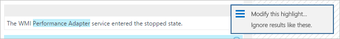
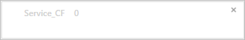

<properties
   pageTitle="Benutzerdefinierte Felder in Log Analytics | Microsoft Azure"
   description="Das Feature "benutzerdefinierte Felder" der Log Analytics können Sie Ihre eigenen benutzerdefinierten durchsuchbare Felder aus OMS Daten zu erstellen, die die Eigenschaften eines Datensatzes zusammengestellten hinzu.  Dieser Artikel beschreibt die Vorgehensweise zum Erstellen eines benutzerdefinierten Felds und stellt eine ausführliche exemplarische mit einer Stichprobe Ereignis."
   services="log-analytics"
   documentationCenter=""
   authors="bwren"
   manager="jwhit"
   editor="tysonn" />
<tags
   ms.service="log-analytics"
   ms.devlang="na"
   ms.topic="article"
   ms.tgt_pltfrm="na"
   ms.workload="infrastructure-services"
   ms.date="10/18/2016"
   ms.author="bwren" />

# Benutzerdefinierte Felder in Log Analytics

Das Feature " **Benutzerdefinierte Felder** " der Log Analytics können Sie vorhandene Einträge im Repository OMS zu erweitern, indem Sie Ihre eigenen durchsuchbare Felder hinzufügen.  Benutzerdefinierte Felder werden automatisch mit Daten aus anderen Eigenschaften in demselben Datensatz extrahiert aufgefüllt.

Angenommen, hat der Beispieleintrag unten verwendbare Daten Nachrichtenordner in die Beschreibung des Ereignisses.  Extrahieren diese Daten in separaten Eigenschaften zur Verfügung, für die Aktionen wie das Sortieren und filtern.

>[AZURE.NOTE] In der Vorschau können Sie auf 100 benutzerdefinierte Felder im Arbeitsbereich beschränkt.  Wenn dieses Feature allgemeinen Verfügbarkeit erreicht werden diese Beschränkung erweitert.

## Erstellen ein benutzerdefiniertes Feld

Wenn Sie ein benutzerdefiniertes Feld erstellen, müssen Log Analytics welche Daten, mit denen den Wert aufgefüllt verstehen.  Eine Technologie von Microsoft Research aufgerufen FlashExtract verwendet, um diese Daten schnell zu erkennen.  Lernt Log Analytics und Sie müssen keine explizite Anweisungen bereitstellen, über die Daten, die Sie zum Extrahieren aus Beispielen, die Sie bereitstellen möchten.

Die folgenden Abschnitte enthalten die Vorgehensweise zum Erstellen eines benutzerdefinierten Felds.  Ist Sie am Ende dieses Artikels eine exemplarische Extraktion von einer Stichprobe aus.

> [!NOTE] Wie Datensätze, die den angegebenen Kriterien entsprechen den Datenspeicher OMS hinzugefügt werden, sodass er nur für Datensätze erfassten nach der Erstellung des benutzerdefinierten Felds angezeigt wird, wird das benutzerdefinierte Feld aufgefüllt.  Das benutzerdefinierte Feld wird nicht mit Datensätzen, die sich bereits im Datenspeicher, bei der Erstellung hinzugefügt werden.

### Schritt 1 – zur Identifizierung von Datensätzen, die das benutzerdefinierte Feld
Dieser erste Schritt besteht, um die Einträge zu identifizieren, die das benutzerdefinierte Feld erhalten.  Beginnen Sie mit dem [Standardformat für Protokolldateien suchen](log-analytics-log-searches.md) und wählen Sie dann einen Eintrag wie das Modell fungieren, die von Log Analytics lernen wird.  Wenn Sie angeben, dass Sie zum Extrahieren von Daten in ein benutzerdefiniertes Feld vertraut sind, kann das **Feld Extraktion-Assistent** geöffnet werden, wo Sie überprüfen, und passen Sie die Kriterien.

2. Wechseln Sie zu **Log suchen** und verwenden Sie einer [Abfrage zum Abrufen der Datensätze](log-analytics-log-searches.md) , die das benutzerdefinierte Feld.
2. Wählen Sie einen Datensatz aus, mit denen Log Analytics dienen als Modell zum Extrahieren von Daten, um das benutzerdefinierte Feld zu füllen.  Sie bestimmt die Daten, die von diesen Eintrag extrahiert werden sollen, und Log Analytics wird mithilfe dieser Informationen um die Logik zum Auffüllen des benutzerdefinierten Felds für alle ähnliche Datensätze zu bestimmen.
3. Klicken Sie auf die Schaltfläche links neben einem beliebigen Texteigenschaft des Datensatzes, und wählen **Sie zum Extrahieren von Feldern aus**.
4. Das **Feld Extraktion-Assistent wird geöffnet**, und den Datensatz, den Sie ausgewählt haben, wird in der Spalte **Primär Beispiel** angezeigt.  Für die Datensätze mit den gleichen Werten in den Eigenschaften, die ausgewählt sind, wird das benutzerdefinierte Feld definiert werden.  
5. Wenn die Auswahl nicht genau Ihren Wünschen entspricht, wählen Sie zusätzliche Felder, die die Kriterien einschränken.  Um die Feldwerte für die Kriterien ändern möchten, müssen Sie Abbrechen und wählen Sie einen anderen Datensatz den gewünschten Kriterien entsprechen.

### Schritt 2 – Ausführen der anfänglichen extrahiert werden.
Nachdem Sie die Einträge, die das benutzerdefinierte Feld festgestellt haben, geben Sie die Daten, die extrahiert werden sollen.  Log Analytics wird diese Informationen verwendet, um ähnliche Muster in ähnlicher Datensätze zu identifizieren.  Innerhalb der folgenden Schritt werden Sie die Ergebnisse zu überprüfen und bieten weitere Details für Protokoll Analytics in ihrer Analyse verwenden können.

1. Markieren Sie den Text in der Stichprobe-Datensatz, den Sie das benutzerdefinierte Feld füllen möchten.  Dann wird mit einem Dialogfeld einen Namen für das Feld angeben und zum Ausführen der anfänglichen extrahiert werden angezeigt.  Die Zeichen ** \_CF** automatisch angefügt werden.
2. Klicken Sie auf **extrahieren** , um eine Analyse von zusammengestellten Datensätzen ausführen.  
3. In den Abschnitten **Zusammenfassung** und **Suchergebnisse** Anzeigen der Ergebnisse der extrahiert werden, damit Sie ihre Richtigkeit prüfen können.  **Zusammenfassung** zeigt die Kriterien zur Identifizierung von Datensätzen und Anzahl für jede der Datenwerte identifiziert.  **Search Results** bietet eine ausführliche Liste der Datensätze, die den Kriterien entsprechen.

### Schritt 3 – Überprüfen Sie die Genauigkeit der der extrahieren und Erstellen von benutzerdefinierten Felds

Nachdem Sie die ursprüngliche extrahieren durchgeführt haben, werden Log Analytics dessen Grundlage der Daten, die bereits gesammelt wurden Ergebnisse angezeigt.  Wenn die Ergebnisse genau aussehen, können Sie das benutzerdefinierte Feld mit keine weiteren Arbeiten erstellen.  Wenn dies nicht der Fall ist, dann können Sie die Ergebnisse optimieren, damit Log Analytics seine Logik verbessert werden kann.

2.  Wenn Sie alle Werte in der ersten extrahiert werden nicht korrekt sind, klicken Sie dann klicken Sie auf das Symbol **Bearbeiten** neben eine falsche Eintrag, und wählen Sie **Ändern dieses hervorheben** akzeptieren, um die Auswahl ändern möchten.
3.  Der Eintrag wird in Abschnitt **Weitere Beispiele** unterhalb der **Primär Beispiel**kopiert.  Sie können die Hervorhebung so anpassen, um Hilfe Log Analytics die Auswahl zu verstehen, die sie vorgenommen haben, sollten.
4.  Klicken Sie auf **extrahieren** , um diese neuen Informationen zu verwenden, um alle vorhandenen Datensätze ausgewertet werden soll.  Die Ergebnisse möglicherweise für Datensätze als das Element, das Sie gerade geändert, basierend auf dieser neuen Intelligence geändert werden.
5.  Weiter mit Korrekturen hinzufügen, bis alle Datensätze in der extrahieren ordnungsgemäß die Daten zum Auffüllen von des neuen benutzerdefinierten Felds zu identifizieren.
6. Wenn Sie mit dem Ergebnis zufrieden sind, klicken Sie auf **Speichern zu extrahieren** .  Das benutzerdefinierte Feld ist jetzt definiert, aber wird nicht Sie noch nicht auf die Datensätze hinzugefügt werden.
7.  Warten Sie für neue Datensätze um erfasst werden, und führen Sie die Suche Log erneut den angegebenen Kriterien entsprechen. Neue Datensätze sollte das benutzerdefinierte Feld enthalten.
8.  Verwenden des benutzerdefinierten Felds wie jede andere Datensatz Eigenschaft.  Sie können sie zum Aggregieren und Gruppieren von Daten und sogar mithilfe dieser um neue Einblicken zu erzeugen.

## Benutzerdefinierte Felder anzeigen
Sie können eine Liste aller benutzerdefinierten Felder in der Verwaltungsgruppe von der Kachel **Einstellungen** des Dashboards OMS anzeigen.  Wählen Sie **Daten** und dann auf **benutzerdefinierte Felder** für eine Liste aller benutzerdefinierten Felder in dem Arbeitsbereich ein.  

## Entfernen ein benutzerdefiniertes Feld
Es gibt zwei Möglichkeiten, um ein benutzerdefiniertes Feld entfernen.  Die erste ist die Option **Entfernen** für jedes Feld aus, wenn die vollständige Liste anzeigen, wie zuvor beschrieben.  Die andere Methode besteht darin Abrufen eines Datensatzes, und klicken Sie auf die Schaltfläche links neben dem Feld.  Klicken Sie im Menü wird eine Option zum Entfernen des benutzerdefinierten Felds haben.

## Beispiel für exemplarische Vorgehensweise

Im folgende Abschnitt führt durch ein vollständiges Beispiel für ein benutzerdefiniertes Feld zu erstellen.  In diesem Beispiel extrahiert den Dienstnamen im Windows-Ereignisse, die einen Dienst ändern Zustand anzeigen.  Dies beruht auf Ereignisse, durch den Dienst-Manager im System Ereignisprotokoll auf Computern unter Windows erstellt werden.  Wenn Sie in diesem Beispiel folgen möchten, müssen Sie das [Sammeln von Informationen zu Ereignissen für das Protokoll](log-analytics-data-sources-windows-events.md)sein.

Wir geben Sie die folgende Abfrage zur Rückkehr alle Ereignisse vom Service Control Manager, die Ereignis-ID 7036 aufweisen, das das Ereignis ist, das einen Dienst starten oder Beenden angibt.

Wir wählen Sie dann einen beliebigen Datensatz mit Ereignis-ID 7036 aus.

Wir wollen den Namen, der in der Eigenschaft **RenderedDescription** angezeigt wird, und wählen Sie die Schaltfläche neben dieser Eigenschaft.

Das **Feld Extraktion-Assistent** wird geöffnet, und die **Ereignisprotokoll** und **EventID** Felder werden in der Spalte **Primär Beispiel** ausgewählt.  Dies zeigt an, dass das benutzerdefinierte Feld für Ereignisse aus dem Protokoll System mit Ereignis-ID 7036 definiert wird.  Dies ist ausreichend, damit wir keine anderen Felder auswählen.

Wir markieren Sie den Namen des Diensts in der Eigenschaft **RenderedDescription** und **Dienst** verwenden, um den Dienstnamen identifizieren.  Das benutzerdefinierte Feld wird als **Service_CF**bezeichnet werden.

Wir sehen, dass der Name korrekt für einige Datensätze jedoch nicht für andere angegeben ist.   Die **Suchergebnisse** zeigen an, dass der Name für den **WMI-Leistungsadapter** markiert wurde nicht.  Die **Zusammenfassung** zeigt, dass vier Datensätze mit **DPRMA** Service falsch ein zusätzliches Wort enthalten, und zwei Datensätze **Module Installer** anstelle von **Windows Module Installer identifiziert**.  

Zunächst mit den Eintrag **WMI Leistung Netzwerkadapter** .  Wir klicken Sie auf dessen Symbol "Bearbeiten" und dann auf **Ändern dieses hervorheben**.  

Wir erhöhen Sie die Hervorhebung, um das Wort **WMI** und anschließend erneut ausführen, die extrahiert werden.  

Wir können sehen, dass die Einträge für **WMI-Leistungsadapter** behoben sind, und Log Analytics diese Informationen auch verwendet korrigieren Sie die Einträge für **Windows-Installationsprogramm**.  Wir können im Abschnitt **Zusammenfassung** anzeigen, obwohl die **DPMRA** nicht weiterhin korrekt erkannt werden.

Wir führen Sie einen Bildlauf zu einem Datensatz mit dem Dienst DPMRA und verwenden Sie das gleiche Verfahren zum Korrigieren Sie des Datensatzes.

 Wenn die Extraktion ausgeführt wird, sehen Sie, dass alle unsere Ergebnisse jetzt korrekt sind.

Wir können sehen, dass **Service_CF** erstellt, aber noch nicht auf die Datensätze hinzugefügt.

Nachdem einige Zeit also neu abgelaufen ist Ereignisse erfasst werden, wir sehen, dass dieser Vergleich, dass das Feld **Service_CF** jetzt hinzugefügt wird unsere Kriterien Einträge.

Wir können jetzt das benutzerdefinierte Feld wie jede andere Datensatz-Eigenschaft verwenden.  Um dies zu veranschaulichen, erstellen wir eine Abfrage, die durch die neuen **Service_CF** Feld zu untersuchenden gruppiert auf welche Dienste die am aktivsten sind.

## Nächste Schritte

- Erfahren Sie mehr über [Log Suchbegriffe](log-analytics-log-searches.md) , zum Erstellen von Abfragen mithilfe von benutzerdefinierten Felder für die Kriterien.
- Überwachen Sie [benutzerdefinierte Protokolldateien](log-analytics-data-sources-custom-logs.md) , die Sie analysieren benutzerdefinierte Felder verwenden.