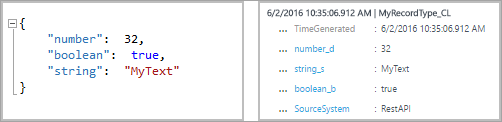
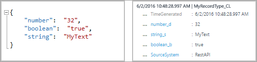

<properties
    pageTitle="Melden Sie sich Analytics HTTP-Datensammlung API | Microsoft Azure"
    description="Log Analytics HTTP Data Collection-API können Sie den Beitrag JSON-Daten in das Protokoll Analytics Repository von einem beliebigen Client hinzufügen, die die REST-API aufrufen können. In diesem Artikel wird beschrieben, wie die-API verwendet, und enthält Beispiele zum Veröffentlichen von Daten mithilfe von verschiedenen Sprachen."
    services="log-analytics"
    documentationCenter=""
    authors="bwren"
    manager="jwhit"
    editor=""/>

<tags
    ms.service="log-analytics"
    ms.workload="na"
    ms.tgt_pltfrm="na"
    ms.devlang="na"
    ms.topic="article"
    ms.date="10/26/2016"
    ms.author="bwren"/>


# <a name="log-analytics-http-data-collector-api"></a>Melden Sie sich Analytics HTTP-Datensammlung API

Wenn Sie die Azure Log Analytics HTTP Data Collection-API verwenden, können Sie von einem beliebigen Client, die die REST-API aufrufen können, Beitrag JavaScript Object Notation (JSON) Daten in das Protokoll Analytics Repository hinzufügen. Mithilfe dieser Methode können Sie Daten aus einer Drittanbieter-Anwendungen oder Skripts, wie aus einer Runbooks in Azure Automatisierung senden.  

## <a name="create-a-request"></a>Erstellen einer Besprechungsanfrage

Die folgenden beiden Tabellen finden Sie die Attributen, die für jede Anforderung an das Protokoll Analytics HTTP Data Collection-API erforderlich sind. Jedes Attribut ausführlicher später in diesem Artikel beschrieben.

### <a name="request-uri"></a>Anfrage-URI

| Attribut | Eigenschaft |
|:--|:--|
| Methode | Bereitstellen |
| URI | https://\<CustomerId\>.ods.opinsights.azure.com/api/logs?api-version=2016-04-01 |
| Inhaltstyp | Anwendung/json |

### <a name="request-uri-parameters"></a>Anfordern von URI-Parameter
| Parameter | Beschreibung |
|:--|:--|
| "CustomerID"  | Der eindeutige Bezeichner für den Arbeitsbereich Microsoft Operations Management Suite. |
| Ressource    | Den Namen der Ressource API: / api/Protokolle. |
| API-Version | Die Version der API zur Verwendung mit dieser Anforderung. Derzeit ist es 2016-04-01. |

### <a name="request-headers"></a>Anfordern von Kopfzeilen
| Kopfzeile | Beschreibung |
|:--|:--|
| Autorisierung | Die Autorisierung Signatur. Später in diesem Artikel können Sie Informationen zum Erstellen einer Kopfzeile HMAC-SHA256 lesen. |
| Log-Datentyp | Geben Sie den Eintrag der Daten, die gesendet werden. Des Typs unterstützt derzeit nur alpha Zeichen. Es unterstützt nicht numerische Werte oder Sonderzeichen. |
| X-ms-Datum | Das Datum, das die Anforderung, im Format RFC 1123 verarbeitet wurde. |
| Time-generiert-Feld | Der Name eines Felds in den Daten, die den Zeitstempel der das Datenelement enthält. Wenn Sie ein Feld angeben, werden deren Inhalt für **TimeGenerated**verwendet. Wenn Sie dieses Feld nicht angeben, wird das Standardformat für **TimeGenerated** die Zeit, die die Nachricht erfasst. Führen Sie den Inhalt des Felds Nachricht sollte ISO 8601 Format JJJJ-MM-: ssZ. |


## <a name="authorization"></a>Autorisierung

Jede Aufforderung zum Log Analytics HTTP Data Collection-API muss eine Kopfzeile Autorisierung beinhalten. Zum Authentifizieren einer Anforderung, müssen Sie die Anforderung mithilfe des primären oder den sekundären Schlüssel für den Arbeitsbereich, der die Anforderung wird beim Anmelden. Klicken Sie dann übergeben Sie die Signatur zu als Teil der Anforderung.   

So sieht das Format für die Autorisierung Kopfzeile aus:

```
Authorization: SharedKey <WorkspaceID>:<Signature>
```

*WorkspaceID* ist die eindeutige ID für den Arbeitsbereich Vorgänge Management Suite. *Signatur* ist eine [Hashbasierten Nachricht Authentifizierung Code (HMAC)](https://msdn.microsoft.com/library/system.security.cryptography.hmacsha256.aspx) , der aus der Anforderung erstellt und dann mit dem [SHA256-Algorithmus](https://msdn.microsoft.com/library/system.security.cryptography.sha256.aspx)berechnet. Klicken Sie dann codieren Sie es mithilfe der Base64-Codierung.

Verwenden Sie dieses Format, wenn die Zeichenfolge **SharedKey** Signatur codiert:

```
StringToSign = VERB + "\n" +
               Content-Length + "\n" +
               Content-Type + "\n" +
               x-ms-date + "\n" +
               "/api/logs";
```

Hier ist ein Beispiel einer Zeichenfolge Signatur ein:

```
POST\n1024\napplication/json\nx-ms-date:Mon, 04 Apr 2016 08:00:00 GMT\n/api/logs
```

Wenn Sie die Signaturzeichenfolge haben, codieren Sie es mit dem HMAC-SHA256-Algorithmus auf die UTF-8-codierte Zeichenfolge, und klicken Sie dann codieren Sie das Ergebnis als Base64. Verwenden Sie dieses Format ein:

```
Signature=Base64(HMAC-SHA256(UTF8(StringToSign)))
```

Die Beispiele in den nächsten Abschnitten haben Stichprobe Code beim Erstellen einer Kopfzeile Autorisierung.

## <a name="request-body"></a>Anforderungstexts

Hauptteil der Nachricht muss in JSON. Sie müssen einen oder mehrere Datensätze mit der Eigenschaft und ein Wertpaar in diesem Format enthalten:

```
{
"property1": "value1",
" property 2": "value2"
" property 3": "value3",
" property 4": "value4"
}
```

Sie können mehrere Datensätze zusammen in einer einzelnen Anforderung Stapel mithilfe von folgendem Format. Alle Datensätze müssen denselben Datensatztyp auswählen.

```
{
"property1": "value1",
" property 2": "value2"
" property 3": "value3",
" property 4": "value4"
},
{
"property1": "value1",
" property 2": "value2"
" property 3": "value3",
" property 4": "value4"
}
```

## <a name="record-type-and-properties"></a>Datensatztyp und Eigenschaften

Definieren Sie einen benutzerdefinierten Datensatztyp, beim Übermitteln von Daten über die Log Analytics HTTP-Daten Collection-API. Sie können keine Daten derzeit vorhandenen Datensatztypen erstellt wurden, die von anderen Datentypen und Lösungen schreiben. Log Analytics liest die eingehenden Daten und erstellt dann auf Eigenschaften, die die Datentypen der Werte übereinstimmen, die Sie eingeben.

Jede Anforderung an das Protokoll Analytics-API muss eine Kopfzeile **Log-Typ** mit dem Namen für den Datensatztyp beinhalten. Das Suffix **_CL** wird automatisch angefügt, um auf den Namen Sie die EINGABETASTE, um ihn von anderen Protokoll als ein benutzerdefiniertes Protokoll zu unterscheiden. Wenn Sie den Namen **MyNewRecordType**eingeben, erstellt der Log Analytics einen Datensatz mit dem Typ **MyNewRecordType_CL**an. Dadurch wird sichergestellt, dass keine Konflikte zwischen Benutzern erstellte Geben Sie die Namen und die im Lieferumfang von aktueller oder zukünftiger Microsoft-Lösungen enthalten sind.

Wenn Sie um eine Eigenschaft Datentyp zu identifizieren, fügt Log Analytics ein Suffix auf den Eigenschaftennamen. Wenn eine Eigenschaft einen null-Wert enthält, wird die Eigenschaft nicht in den Datensatz enthalten. Diese Tabelle listet die Eigenschaft-Datentyp und entsprechende Suffix an:

| Eigenschaft-Datentyp | Suffix |
|:--|:--|
| Zeichenfolge    | _S |
| Boolesch   | _B |
| Double    | _D |
| Datum/Uhrzeit | _T |
| GUID      | _g |


Der Datentyp, den für jede Eigenschaft Log Analytics verwendet, hängt davon ab, ob der Datensatztyp für den neuen Eintrag bereits vorhanden ist.

- Wenn Sie der Datensatztyp nicht vorhanden ist, Sitzung Log Analytics eine neue. Log Analytics verwendet das JSON-Typ abzuleiten, um den Datentyp für jede Eigenschaft für den neuen Datensatz zu ermitteln.
- Wenn Sie der Datensatztyp vorhanden ist, versucht Log Analytics zum Erstellen eines neuen Datensatzes basierend auf vorhandenen Eigenschaften. Wenn der Datentyp für eine Eigenschaft in den neuen Datensatz entsprechen nicht und kann nicht in den vorhandenen Typ konvertiert werden, oder wenn Sie der Eintrag eine Eigenschaft enthält, die nicht vorhanden ist, erstellt Log Analytics eine neue Eigenschaft, die das relevante Suffix besitzt.

Dieser Eintrag Einreichung würden beispielsweise einen Datensatz mit drei Eigenschaften, **Number_d**, **Boolean_b**und **String_s**erstellen:



Wenn Sie diese nächsten Eintrag, klicken Sie dann mit allen Werten, die als Zeichenfolgen formatiert gesendet, würde die Eigenschaften nicht ändern. Diese Werte können in vorhandene Datentypen konvertiert werden:



Aber wenn Sie dann diese weiter Informationen gesendet, Log Analytics, erstellen, die neuen Eigenschaften **Boolean_d** und **String_d**. Diese Werte können nicht konvertiert werden:


Wenn Sie den folgenden Eintrag, klicken Sie dann vor der Datensatztyp erstellt wurde übermittelt, würde Log Analytics einen Datensatz mit drei Eigenschaften, **Zahl_Erfolge**, **Boolean_s**und **String_s**erstellen. In diesem Eintrag wird jede die Anfangswerte als Zeichenfolge formatiert:


## <a name="data-limits"></a>Grenzwerte für Daten
Es gibt einige Einschränkungen, um die Daten auf Log Analytics-Datensammlung API veröffentlicht.

- Bis zu 30 MB pro Beitrag in Log Analytics Data Collection-API. Dies ist eine maximale Größe für einen einzelnen Beitrag aus. Wenn die Daten aus einem einzigen buchen, 30 MB überschreitet, sollten Sie die Daten nach Zeitphasen bis zum kleinere gleicher Breite Abschnitte aufteilen und gleichzeitig zu senden. 
- Bis zu 32 KB-Limit für alle Felder. Wenn der Wert des Felds größer als 32 KB ist, werden die Daten abgeschnitten. 
- Empfohlene maximale Anzahl von Feldern für einen bestimmten Typ ist 50. Dies ist eine praktische Beschränkung aus einer Nutzbarkeit und eine Suche Erfahrung Perspektive.  


## <a name="return-codes"></a>Codes zurückgeben

Der HTTP-Status 202 Code bedeutet, dass die Anforderung wurde zum Verarbeiten angenommen, aber Verarbeitung noch nicht abgeschlossen. Dies zeigt an, dass der Vorgang erfolgreich abgeschlossen.

Diese Tabelle listet die vollständige Menge der Statuscodes, die der Dienst zurückgegeben werden kann:

| Code | Status | Fehlercode | Beschreibung |
|:--|:--|:--|:--|
| 202 | Akzeptiert |  | Die Anforderung wurde erfolgreich angenommen. |
| 400 | Ungültige Anforderung | InactiveCustomer | Der Arbeitsbereich wurde geschlossen. |
| 400 | Ungültige Anforderung | InvalidApiVersion | Die API-Version, die Sie angegeben wurde vom Dienst nicht erkannt. |
| 400 | Ungültige Anforderung | InvalidCustomerId | Die angegebene Arbeitsbereich-ID ist ungültig. |
| 400 | Ungültige Anforderung | InvalidDataFormat | Ungültige JSON wurde übermittelt. Textkörper Antwort möglicherweise weitere Informationen zum Beheben des Fehlers enthalten. |
| 400 | Ungültige Anforderung | InvalidLogType | Des Typs angegebene enthaltenen Sonderzeichen oder numerische Werte. |
| 400 | Ungültige Anforderung | MissingApiVersion | Die API-Version wurde nicht angegeben. |
| 400 | Ungültige Anforderung | MissingContentType | Der Inhaltstyp wurde nicht angegeben. |
| 400 | Ungültige Anforderung | MissingLogType | Erforderlicher Wert des Typs wurde nicht angegeben. |
| 400 | Ungültige Anforderung | UnsupportedContentType | Der Inhaltstyp wurde nicht auf **Anwendung/Json**festgelegt. |
| 403 | Verboten | InvalidAuthorization | Der Dienst konnte die Anforderung authentifiziert. Stellen Sie sicher, dass der Arbeitsbereich-ID und Verbindung Schlüssel gelten. |
| 500 | Interner Serverfehler | UnspecifiedError | Interner Fehler beim Dienst. Wiederholen Sie die Anfrage ein. |
| 503 | Dienst nicht verfügbar | ServiceUnavailable | Der Dienst ist zurzeit erhalten Besprechungsanfragen nicht verfügbar. Wiederholen Sie die Anforderung. |

## <a name="query-data"></a>Abfragen von Daten

Abfragen von Daten von der Log Analytics HTTP Data Collection-API übermittelt, suchen, die Sie angegeben, mit angefügten **_CL**für Datensätze mit dem **Typ** , die gleich dem Wert **LogType** ist. Beispielsweise, wenn Sie **MyCustomLog**verwendet haben, klicken Sie dann Sie würden zurückgegeben alle Datensätze mit **Typ = MyCustomLog_CL**.


## <a name="sample-requests"></a>Beispiel für Besprechungsanfragen

In den nächsten Abschnitten finden Sie Beispiele zum Senden von Daten in das Protokoll Analytics HTTP Data Collection-API mit verschiedenen Sprachen.

Führen Sie für jede Probe folgendermaßen vor, um die Variablen für die Autorisierung Kopfzeile festlegen:

1. Im Portal Vorgänge Management Suite wählen Sie die Kachel " **Einstellungen** " aus, und wählen Sie dann auf die Registerkarte **Datenquellen verbunden** .
2. Rechts neben der **Arbeitsbereich-ID**wählen Sie das Symbol "Kopieren" aus, und fügen Sie die ID, die als Wert der **Kunden-ID** -Variablen.
3. Rechts des **Primärschlüssels**wählen Sie das Symbol "Kopieren" aus, und fügen Sie die ID, die als Wert der Variablen **Schlüssel freigegeben** .

Alternativ können Sie die Variablen für den Log-Typ und JSON-Daten ändern.

### <a name="powershell-sample"></a>PowerShell-Beispiel

```
# Replace with your Workspace ID
$CustomerId = "xxxxxxxx-xxxx-xxxx-xxxx-xxxxxxxxxxxx"  

# Replace with your Primary Key
$SharedKey = "xxxxxxxxxxxxxxxxxxxxxxxxxxxxxx"

# Specify the name of the record type that you'll be creating
$LogType = "MyRecordType"

# Specify a field with the created time for the records
$TimeStampField = "DateValue"


# Create two records with the same set of properties to create
$json = @"
[{  "StringValue": "MyString1",
    "NumberValue": 42,
    "BooleanValue": true,
    "DateValue": "2016-05-12T20:00:00.625Z",
    "GUIDValue": "9909ED01-A74C-4874-8ABF-D2678E3AE23D"
},
{   "StringValue": "MyString2",
    "NumberValue": 43,
    "BooleanValue": false,
    "DateValue": "2016-05-12T20:00:00.625Z",
    "GUIDValue": "8809ED01-A74C-4874-8ABF-D2678E3AE23D"
}]
"@

# Create the function to create the authorization signature
Function Build-Signature ($customerId, $sharedKey, $date, $contentLength, $method, $contentType, $resource)
{
    $xHeaders = "x-ms-date:" + $date
    $stringToHash = $method + "`n" + $contentLength + "`n" + $contentType + "`n" + $xHeaders + "`n" + $resource

    $bytesToHash = [Text.Encoding]::UTF8.GetBytes($stringToHash)
    $keyBytes = [Convert]::FromBase64String($sharedKey)

    $sha256 = New-Object System.Security.Cryptography.HMACSHA256
    $sha256.Key = $keyBytes
    $calculatedHash = $sha256.ComputeHash($bytesToHash)
    $encodedHash = [Convert]::ToBase64String($calculatedHash)
    $authorization = 'SharedKey {0}:{1}' -f $customerId,$encodedHash
    return $authorization
}


# Create the function to create and post the request
Function Post-OMSData($customerId, $sharedKey, $body, $logType)
{
    $method = "POST"
    $contentType = "application/json"
    $resource = "/api/logs"
    $rfc1123date = [DateTime]::UtcNow.ToString("r")
    $contentLength = $body.Length
    $signature = Build-Signature `
        -customerId $customerId `
        -sharedKey $sharedKey `
        -date $rfc1123date `
        -contentLength $contentLength `
        -fileName $fileName `
        -method $method `
        -contentType $contentType `
        -resource $resource
    $uri = "https://" + $customerId + ".ods.opinsights.azure.com" + $resource + "?api-version=2016-04-01"

    $headers = @{
        "Authorization" = $signature;
        "Log-Type" = $logType;
        "x-ms-date" = $rfc1123date;
        "time-generated-field" = $TimeStampField;
    }

    $response = Invoke-WebRequest -Uri $uri -Method $method -ContentType $contentType -Headers $headers -Body $body -UseBasicParsing
    return $response.StatusCode

}

# Submit the data to the API endpoint
Post-OMSData -customerId $customerId -sharedKey $sharedKey -body ([System.Text.Encoding]::UTF8.GetBytes($json)) -logType $logType  
```

### <a name="c-sample"></a>C#-Beispiel

```
using System;
using System.Net;
using System.Security.Cryptography;

namespace OIAPIExample
{
    class ApiExample
    {
// An example JSON object, with key/value pairs
        static string json = @"[{""DemoField1"":""DemoValue1"",""DemoField2"":""DemoValue2""},{""DemoField1"":""DemoValue3"",""DemoField2"":""DemoValue4""}]";

// Update customerId to your Operations Management Suite workspace ID
        static string customerId = "xxxxxxxx-xxx-xxx-xxx-xxxxxxxxxxxx";

// For sharedKey, use either the primary or the secondary Connected Sources client authentication key   
        static string sharedKey = "xxxxxxxxxxxxxxxxxxxxxxxxxxxxxx";

// LogName is name of the event type that is being submitted to Log Analytics
        static string LogName = "DemoExample";

// You can use an optional field to specify the timestamp from the data. If the time field is not specified, Log Analytics assumes the time is the message ingestion time
        static string TimeStampField = "";

        static void Main()
        {
// Create a hash for the API signature
            var datestring = DateTime.UtcNow.ToString("r");
            string stringToHash = "POST\n" + json.Length + "\napplication/json\n" + "x-ms-date:" + datestring + "\n/api/logs";
            string hashedString = BuildSignature(stringToHash, sharedKey);
            string signature = "SharedKey " + customerId + ":" + hashedString;

            PostData(signature, datestring, json);
        }

// Build the API signature
        public static string BuildSignature(string message, string secret)
        {
            var encoding = new System.Text.ASCIIEncoding();
            byte[] keyByte = Convert.FromBase64String(secret);
            byte[] messageBytes = encoding.GetBytes(message);
            using (var hmacsha256 = new HMACSHA256(keyByte))
            {
                byte[] hash = hmacsha256.ComputeHash(messageBytes);
                return Convert.ToBase64String(hash);
            }
        }

// Send a request to the POST API endpoint
        public static void PostData(string signature, string date, string json)
        {
            string url = "https://"+ customerId +".ods.opinsights.azure.com/api/logs?api-version=2016-04-01";
            using (var client = new WebClient())
            {
                client.Headers.Add(HttpRequestHeader.ContentType, "application/json");
                client.Headers.Add("Log-Type", LogName);
                client.Headers.Add("Authorization", signature);
                client.Headers.Add("x-ms-date", date);
                client.Headers.Add("time-generated-field", TimeStampField);
                client.UploadString(new Uri(url), "POST", json);
            }
        }
    }
}
```

### <a name="python-sample"></a>Python-Beispiel

```
import json
import requests
import datetime
import hashlib
import hmac
import base64

# Update the customer ID to your Operations Management Suite workspace ID
customer_id = 'xxxxxxx-xxxx-xxxx-xxxx-xxxxxxxxxxxx'

# For the shared key, use either the primary or the secondary Connected Sources client authentication key   
shared_key = "xxxxxxxxxxxxxxxxxxxxxxxxxxxxxx"

# The log type is the name of the event that is being submitted
log_type = 'WebMonitorTest'

# An example JSON web monitor object
json_data = [{
   "slot_ID": 12345,
    "ID": "5cdad72f-c848-4df0-8aaa-ffe033e75d57",
    "availability_Value": 100,
    "performance_Value": 6.954,
    "measurement_Name": "last_one_hour",
    "duration": 3600,
    "warning_Threshold": 0,
    "critical_Threshold": 0,
    "IsActive": "true"
},
{   
    "slot_ID": 67890,
    "ID": "b6bee458-fb65-492e-996d-61c4d7fbb942",
    "availability_Value": 100,
    "performance_Value": 3.379,
    "measurement_Name": "last_one_hour",
    "duration": 3600,
    "warning_Threshold": 0,
    "critical_Threshold": 0,
    "IsActive": "false"
}]
body = json.dumps(json_data)

#####################
######Functions######  
#####################

# Build the API signature
def build_signature(customer_id, shared_key, date, content_length, method, content_type, resource):
    x_headers = 'x-ms-date:' + date
    string_to_hash = method + "\n" + str(content_length) + "\n" + content_type + "\n" + x_headers + "\n" + resource
    bytes_to_hash = bytes(string_to_hash).encode('utf-8')  
    decoded_key = base64.b64decode(shared_key)
    encoded_hash = base64.b64encode(hmac.new(decoded_key, bytes_to_hash, digestmod=hashlib.sha256).digest())
    authorization = "SharedKey {}:{}".format(customer_id,encoded_hash)
    return authorization

# Build and send a request to the POST API
def post_data(customer_id, shared_key, body, log_type):
    method = 'POST'
    content_type = 'application/json'
    resource = '/api/logs'
    rfc1123date = datetime.datetime.utcnow().strftime('%a, %d %b %Y %H:%M:%S GMT')
    content_length = len(body)
    signature = build_signature(customer_id, shared_key, rfc1123date, content_length, method, content_type, resource)
    uri = 'https://' + customer_id + '.ods.opinsights.azure.com' + resource + '?api-version=2016-04-01'

    headers = {
        'content-type': content_type,
        'Authorization': signature,
        'Log-Type': log_type,
        'x-ms-date': rfc1123date
    }

    response = requests.post(uri,data=body, headers=headers)
    if (response.status_code == 202):
        print 'Accepted'
    else:
        print "Response code: {}".format(response.status_code)

post_data(customer_id, shared_key, body, log_type)
```

## <a name="next-steps"></a>Nächste Schritte

- Verwenden Sie [Ansicht-Designer](log-analytics-view-designer.md) , um benutzerdefinierte Ansichten der Daten erstellen, die Sie senden.
