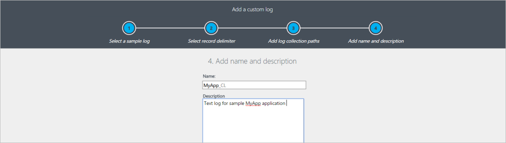

<properties 
   pageTitle="Benutzerdefinierte anmeldet Log Analytics | Microsoft Azure"
   description="Log Analytics können Ereignisse Textdateien auf Windows und Linux Computern zusammenfassen.  Dieser Artikel beschreibt, wie ein neues benutzerdefiniertes Protokoll und Details der Datensätze im Repository OMS erstellten definiert."
   services="log-analytics"
   documentationCenter=""
   authors="bwren"
   manager="jwhit"
   editor="tysonn" />
<tags 
   ms.service="log-analytics"
   ms.devlang="na"
   ms.topic="article"
   ms.tgt_pltfrm="na"
   ms.workload="infrastructure-services"
   ms.date="10/18/2016"
   ms.author="bwren" />

# Benutzerdefinierte Protokolle in die Protokolldateien Analytics

Benutzerdefinierte Protokolle Datenquelle Log Analytics können Sie zum Sammeln von Ereignissen von Textdateien auf Computern für Windows und Linux. Viele Clientanwendungen protokollieren Informationen in Textdateien anstelle der standard-Protokollierung-Diensten wie Windows-Ereignisprotokoll oder Syslog.  Sobald gesammelt, können Sie jeden Eintrag in der Log in einzelne Felder mithilfe der Funktion [Benutzerdefinierte Felder](log-analytics-custom-fields.md) der Log Analytics verarbeiten.

Die zu erfassenden Protokolldateien müssen die folgenden Kriterien entsprechen.

- Das Protokoll müssen Sie einen einzelnen Eintrag pro Zeile haben oder einen Zeitstempel eines der folgenden Formate am Anfang der einzelnen Einträge übereinstimmenden verwenden.

    JJJJ / MM / TT HH: MM:  
  M/T/JJJJ HH: MM: SS AM/PM  
  Mon TT, JJJJ hh: mm:
    
- Die Protokolldatei darf keine kreisförmige Aktualisierungen zulassen, in dem die Datei mit neuen Einträgen überschrieben. 

## Definieren ein benutzerdefiniertes Protokoll

Gehen Sie folgendermaßen vor, um eine benutzerdefinierte Protokolldatei zu definieren.  Führen Sie einen Bildlauf an das Ende des Artikels eine exemplarische Vorgehensweise ein Beispiel für ein benutzerdefiniertes Protokoll hinzufügen.

### Schritt 1. Öffnen Sie den benutzerdefinierten Log-Assistenten

Die benutzerdefinierten Log-Assistent im Portal OMS ausgeführt wird und ermöglicht Ihnen, definieren ein neues benutzerdefiniertes Protokoll zu sammeln.

1.  Wechseln Sie zu **Einstellungen**im Portal OMS.
2.  Klicken Sie auf **Daten** , und klicken Sie dann **benutzerdefinierte Protokolle**.
3.  Standardmäßig werden alle Änderungen der Konfiguration automatisch in alle Agents abgelegt.  Für Linux-Agents wird eine Konfigurationsdatei an der Sammlung Fluentd gesendet.  Wenn Sie diese Datei manuell auf jeden Linux-Agent ändern möchten, deaktivieren Sie das Kontrollkästchen *unterhalb der Konfiguration, die auf meinem Computer Linux übernehmen*klicken.
4.  Klicken Sie auf **Add +** um die benutzerdefinierten Log-Assistenten zu öffnen.

### Schritt 2. Hochladen und ein Beispiel für Protokoll zu analysieren

Beginnen Sie mit eine Stichprobe aus dem benutzerdefinierten Protokoll hochladen.  Der Assistent analysieren und Anzeigen der Einträge in dieser Datei für Sie zu überprüfen.  Log Analytics wird als Trennzeichen verwendet, das Sie angeben, dass Sie jeden Datensatz zu identifizieren.

**Neue Zeile** , wird als Standardtrennzeichen und dient für Protokolldateien, die einen einzigen Eintrag pro Zeile verfügen.  Wenn die Zeile mit einem Datum und Uhrzeit in einem der verfügbaren Formate gestartet wird, können Sie ein Trennzeichen **Zeitstempel** angeben die Einträge unterstützt, die mehr als eine Zeile umfassen. 

Wenn ein Zeitstempel als Trennzeichen verwendet wird, wird die Eigenschaft TimeGenerated jeden Eintrag gehörende Kehrmatrix OMS mit Datum und Uhrzeit der angegebenen für diesen Eintrag in der Protokolldatei gefüllt.  Wenn eine neue Zeile Trennzeichen verwendet wird, wird TimeGenerated mit Datum und Uhrzeit, dass Log Analytics den Eintrag gesammelt aufgefüllt. 

>[AZURE.NOTE]Log Analytics behandelt aktuell auf ein Protokoll mit einem Zeitstempel Trennzeichen als UTC erfassten Datum/Uhrzeit aus.  Dies wird schnell geändert werden, um die gewünschte Zeitzone auf dem Agent verwenden. 
 
1.  Klicken Sie auf **Durchsuchen** , und navigieren Sie zu einer Beispieldatei.  Notiz, die diese Schaltfläche möglicherweise möglicherweise in einigen Browsern **Datei auswählen** beschriftet werden.
2.  Klicken Sie auf **Weiter**. 
3.  Der benutzerdefinierte Log-Assistent die Datei hochladen und Liste die Datensätze, die er identifiziert.
4.  Ändern Sie das Trennzeichen, das verwendet wird, um einen neuen Datensatz zu identifizieren, und wählen Sie das Trennzeichen, das die Einträge in der Protokolldatei am besten identifiziert.
5.  Klicken Sie auf **Weiter**.

### Schritt 3. Log Websitesammlung Pfade hinzufügen

Sie müssen einen oder mehrere Pfade auf dem Agent definieren, in dem sie das benutzerdefinierte Protokoll suchen kann.  Sie können entweder einen bestimmten Pfad und einen Namen für die Protokolldatei bereitstellen, oder geben Sie einen Pfad mit einem Platzhalter für den Namen.  Programme, die Erstellen einer neuen Datei jeden Tag oder bei einer Datei eine bestimmte Dateigröße unterstützt werden.  Sie können auch mehrere Pfade für eine einzelne Protokolldatei bereitstellen.

Beispielsweise kann eine Anwendung erstellen eine Protokolldatei jeden Tag mit dem Datum in den Namen wie log20100316.txt enthalten. Ein Muster für solche ein Protokoll möglicherweise *Log\*txt* die auf eine beliebige Protokolldatei nach Anwendung anwenden möchten das Farbschema benennen.

Die folgende Tabelle enthält Beispiele für gültige Muster verschiedene Protokolldateien angeben. 

| Beschreibung | Pfad |
|:--|:--|
| Alle Dateien im *C:\Logs* mit der Erweiterung TXT auf der Windows-agent | C:\Logs\\\*txt |
| Alle Dateien in *C:\Logs* mit einem Namen beginnend mit der Log und Erweiterung TXT auf der Windows-agent | C:\Logs\log\*txt |
| Alle Dateien im */var/log/audit* mit der Erweiterung TXT auf Linux-agent | /var/log/Audit/*.txt |
| Alle Dateien in */var/log/audit* mit einem Namen beginnend mit der Log und Erweiterung TXT auf Linux-agent | /var/log/Audit/Log\*txt |
  

1.  Select Windows oder Linux um anzugeben, welches Dateiformat Pfad wird hinzugefügt.
2.  Geben Sie den Pfad und klicken Sie auf die **+** Schaltfläche.
3.  Wiederholen Sie den Vorgang für alle zusätzlichen Pfaden aus.

### Schritt 4. Geben Sie einen Namen und eine Beschreibung für das Protokoll

Der Namen, den Sie angeben, wird für des Typs verwendet werden, wie zuvor beschrieben.  Beenden sie immer mit _CL als ein benutzerdefiniertes Protokoll zu unterscheiden.

1.  Geben Sie einen Namen für das Protokoll ein.  Die ** \_CL** Suffix wird automatisch bereitgestellt.
2.  Fügen Sie eine optionale **Beschreibung**hinzu.
3.  Klicken Sie auf **Weiter** , um zu die Definition benutzerdefiniertes Protokoll speichern.

### Schritt 5 fort. Überprüfen Sie, ob die benutzerdefinierte Protokolle gesammelt werden
Sie können in eine Stunde für die Ausgangsdaten aus einem neuen benutzerdefinierten Protokoll in Anspruch Log Analytics angezeigt werden sollen.  Es wird gestartet, sammeln Einträge aus den Protokollen in der Pfad gefunden Sie ab dem Zeitpunkt an, dass Sie das benutzerdefinierte Protokoll definiert angegeben haben.  Es wird nicht beibehalten die Kalendereinträge, die Sie während der Erstellung benutzerdefinierter Log hochgeladen, aber sie bereits vorhandene Einträge in den Protokolldateien, die er findet sammeln.

Nachdem Log Analytics gestartet wird, aus dem benutzerdefinierten Protokoll sammeln, werden deren Datensätze mit einer Suche Log verfügbar sein.  Verwenden Sie den Namen, dass Sie das benutzerdefinierte Protokoll als **Typ** in Ihrer Abfrage gegeben hat.

>[AZURE.NOTE] Wenn Sie die Eigenschaft RawData der Suche nicht vorhanden ist, müssen Sie schließen und erneuten Öffnen von Ihrem Browser.

### Schritt 6 fort. Die benutzerdefinierten Protokolleinträge zu analysieren

Der gesamte Vertrieb wird in einer einzelnen Eigenschaft mit dem Namen **RawData**gespeichert werden.  Sie sollten in den meisten Fällen trennen Sie die einzelnen Informationen in jedem Eintrag in einzelne Eigenschaften, die in den Eintrag gespeichert.  Dazu verwenden Sie das Feature " [Benutzerdefinierte Felder](log-analytics-custom-fields.md) " der Log Analytics.

Hier sind nicht detaillierten Schritte zum Analysieren des Eintrags benutzerdefiniertes Protokoll bereitgestellt.  Lizenzinformationen finden Sie in der Dokumentation [Benutzerdefinierte Felder](log-analytics-custom-fields.md) für diese Informationen.

## Deaktivieren ein benutzerdefiniertes Protokoll

Sie entfernen keine benutzerdefiniertes Protokoll Definition, nachdem es erstellt wurde, aber Sie können es entfernen alle zugehörigen Pfade Websitesammlung deaktivieren.

1.  Wechseln Sie zu **Einstellungen**im Portal OMS.
2.  Klicken Sie auf **Daten** , und klicken Sie dann **benutzerdefinierte Protokolle**.
3.  Klicken Sie auf **Details** neben der Definition benutzerdefiniertes Protokoll zu deaktivieren.
4.  Entfernen Sie die Websitesammlung Pfade für die Definition von benutzerdefinierten Protokoll.

## Datensammlung

Log Analytics erfasst neue Einträge aus jeder benutzerdefinierten Protokoll etwa 5 Minuten.  Der Agent zeichnet seine Position in jeder Protokolldatei, die sie aus erfasst.  Wenn der Agent für einen Zeitraum Offlinemodus wechselt, klicken Sie dann erfasst Log Analytics Einträge aus, in dem letzten Unterbrechung, auch wenn diese Einträge erstellt wurden, während der Agent offline war.

Der gesamte Inhalt der Eintrag werden in einer einzelnen Eigenschaft mit dem Namen **RawData**geschrieben.  Sie können dies in mehreren Eigenschaften analysieren, die analysiert und separat durch definieren [Benutzerdefinierte Felder](log-analytics-custom-fields.md) aus, nach der Erstellung der benutzerdefinierten Log durchsucht werden können.

## Benutzerdefiniertes Protokoll Datensatzeigenschaften

Benutzerdefinierte Protokolldatensätze haben einen Typ mit Name der Protokolldatei, die Sie bereitstellen und die Eigenschaften in der folgenden Tabelle.

| Eigenschaft | Beschreibung |
|:--|:--|
| TimeGenerated | Datum und Uhrzeit, die der Eintrag Protokoll Analytics gesammelt wurde.  Wenn das Protokoll ein Trennzeichen zeitbasierte verwendet ist dies die Uhrzeit auf den Eintrag erfassten. |
| SourceSystem  | Typ des Agents, die von der Eintrag erfasst wurden.   OpsManager – Windows-Agent, entweder direkte verbinden oder SCOM   Linux – alle Linux-agents  |
| RawData             | Vollständigen Text der zusammengestellten Posten. |
| "Verwaltungsgruppenname" | Name der Management Group für SCOM-Agents.  Für andere Agents, dies ist AOI -\<Arbeitsbereich-ID\> |

## Log-Suchvorgänge mit benutzerdefinierten Protokolldatensätze

Benutzerdefinierte Protokolle Datensätze werden im Repository OMS wie Datensätze aus einer anderen Datenquelle gespeichert.  Sie haben einen Typ mit dem Namen, den Sie bereitstellen, wenn Sie das Protokoll zu definieren, damit Sie die Eigenschaft in Ihrer Suche verwenden können, zum Abrufen der Datensätze, die aus einem bestimmten Protokoll erfassten übereinstimmt.

Die folgende Tabelle enthält verschiedene Beispiele für Protokoll suchen, die Datensätze von benutzerdefinierten Protokolle abrufen.

| Abfrage | Beschreibung |
|:--|:--|
| Typ = MyApp_CL | Melden Sie alle Ereignisse über eine benutzerdefinierte benannte MyApp_CL. |
| Typ = MyApp_CL Severity_CF = zurück | Alle Ereignisse aus einem benutzerdefinierten Protokoll mit dem Namen MyApp_CL mit einem Wert *zurück* in ein benutzerdefiniertes Feld mit dem Namen *Severity_CF*aus. |

## Beispiel für ein benutzerdefiniertes Protokoll hinzufügen Exemplarische

Im folgende Abschnitt führt durch ein Beispiel für ein benutzerdefiniertes Protokoll zu erstellen.  Der Stichprobe Log erfasst wird, hat ein Eintrag in jeder Zeile, die ein Datum und Uhrzeit und dann Komma angefangen Felder für Code, Status und Nachricht getrennt.  Beispiele für mehrere Einträge sind nachstehend aufgeführt.

    2016-03-10 01:34:36 207,Success,Client 05a26a97-272a-4bc9-8f64-269d154b0e39 connected
    2016-03-10 01:33:33 208,Warning,Client ec53d95c-1c88-41ae-8174-92104212de5d disconnected
    2016-03-10 01:35:44 209,Success,Transaction 10d65890-b003-48f8-9cfc-9c74b51189c8 succeeded
    2016-03-10 01:38:22 302,Error,Application could not connect to database
    2016-03-10 01:31:34 303,Error,Application lost connection to database

### Hochladen und ein Beispiel für Protokoll zu analysieren

Wir bieten eine der Protokolldateien und Ereignisse, die sie sammeln angezeigt werden.  In diesem Fall ist die neue Zeile ausreichend als Trennzeichen verwendet.  Wenn Sie ein Eintrag in das Protokoll durch mehrere Zeilen umfassen kann, müssten ein Zeitstempel Trennzeichen verwendet werden.

### Log Websitesammlung Pfade hinzufügen

Die Protokolldateien werden im *C:\MyApp\Logs*befinden.  Eine neue Datei wird jeden Tag mit einem Namen erstellt, die das Datum in der Muster *appYYYYMMDD.log*enthält.  Ein ausreichend Muster für dieses Protokoll wäre *C:\MyApp\Logs\\\*.log*.

### Geben Sie einen Namen und eine Beschreibung für das Protokoll

Wir verwenden einen Namen von *MyApp_CL* und ist Typ in eine **Beschreibung**ein.

### Überprüfen Sie, ob die benutzerdefinierte Protokolle gesammelt werden

Wir verwenden eine Abfrage mit *Typ = MyApp_CL* aus dem zusammengestellten Protokoll alle Datensätze zurück.

### Die benutzerdefinierten Protokolleinträge zu analysieren

Wir verwenden benutzerdefinierte Felder zum Definieren von der *EventTime*, *Code*, *Status*und *Nachricht* Felder und wir die Differenz in die Datensätze, die von der Abfrage zurückgegeben werden angezeigt werden.

## Nächste Schritte

- Verwenden Sie [Benutzerdefinierte Felder](log-analytics-custom-fields.md) , um die Einträge in der benutzerdefinierten Log in einzelne Felder zu analysieren.
- Erfahren Sie mehr über [Log Suchbegriffe](log-analytics-log-searches.md) , zum Analysieren der Daten von Datenquellen und Lösungen erfasst. 