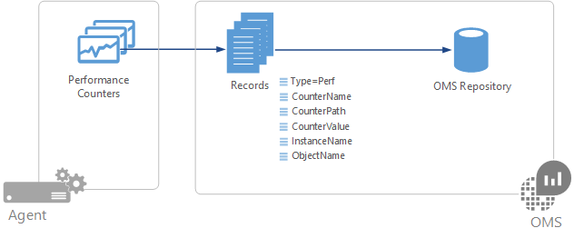

<properties 
   pageTitle="Windows und Linux Leistung Indikatoren in Log Analytics | Microsoft Azure"
   description="Datenquellen werden vom Log Analytics zum Analysieren der Leistung von Windows und Linux-Agents erfasst.  In diesem Artikel beschrieben, wie Sie die Sammlung von Leistungsindikatoren für beide Windows konfigurieren und Linux Agents, diese Details in OMS Repository, und wie Sie diese im Portal OMS analysieren gespeichert sind."
   services="log-analytics"
   documentationCenter=""
   authors="bwren"
   manager="jwhit"
   editor="tysonn" />
<tags 
   ms.service="log-analytics"
   ms.devlang="na"
   ms.topic="article"
   ms.tgt_pltfrm="na"
   ms.workload="infrastructure-services"
   ms.date="10/27/2016"
   ms.author="bwren" />

# Windows und Linux Leistung von Datenquellen in Log Analytics 

Leistungsindikatoren in Windows und Linux Einblicke in die Leistung von Hardware-Komponenten, Betriebssysteme und Anwendungen.  Log Analytics können Datenquellen in regelmäßigen Abständen für die Analyse der in der Nähe Echtzeit (NRT) zusätzlich zum Aggregieren von Daten für mehr Ausdruck Analyse und Berichte sammeln.

## Konfigurieren von Datenquellen

Konfigurieren der Leistungsindikatoren aus dem [Menü ' Daten ' in Log Analytics-Einstellungen](log-analytics-data-sources.md#configuring-data-sources).

Wenn Sie zuerst Windows oder Linux Leistung Indikatoren für einen neuen OMS Arbeitsbereich konfigurieren, erhalten Sie die Möglichkeit, mehrere allgemeine Indikatoren schnell zu erstellen.  Sie sind mit einem Kontrollkästchen neben jedem aufgeführt.  Stellen Sie sicher, dass alle Indikatoren, die Sie zunächst erstellen möchten aktiviert sind, und klicken Sie dann auf **die ausgewählten Leistungsindikatoren hinzufügen**.

Gehen Sie folgendermaßen vor, um einen neuen Windows Performance Indikator zum Erfassen von hinzuzufügen.

1. Geben Sie den Namen der Zähler in das Textfeld in der Format *\counter Objekt (Instanz)*.  Wenn Sie mit der Eingabe beginnen, werden Sie eine übereinstimmende Liste mit allgemeinen Indikatoren angezeigt.  Sie können entweder einen Indikator in der Liste oder geben Sie ein eigenes auswählen.  Sie können auch alle Instanzen für einen bestimmten Indikator zurückkehren, indem Sie *das Objekt/Datenquelle*angeben. 
2. Klicken Sie auf **+** , oder drücken Sie die **EINGABETASTE** , um die Liste der Zähler hinzugefügt.
3. Wenn Sie einen Zähler hinzufügen, wird die Standardeinstellung von 10 Sekunden für die **Stichprobe Intervall**verwendet.  Sie können dies einen höheren Wert von bis zu 1800 Sekunden (30 Minuten) ändern, wenn Sie die Anforderungen Speicher die gesammelten Leistungsdaten verringern möchten.
4. Wenn Sie das Hinzufügen von Indikatoren fertig sind, klicken Sie auf die Schaltfläche " **Speichern** " oben auf dem Bildschirm, um die Konfiguration zu speichern.

Gehen Sie folgendermaßen vor, um einen neuen Linux Leistungsindikator zum Erfassen von hinzuzufügen.

1. Standardmäßig werden alle Änderungen der Konfiguration automatisch in alle Agents abgelegt.  Für Linux-Agents wird eine Konfigurationsdatei an der Sammlung Fluentd gesendet.  Wenn Sie diese Datei manuell auf jeden Linux-Agent ändern möchten, deaktivieren Sie das Kontrollkästchen *unterhalb der Konfiguration, die auf meinem Computer Linux übernehmen*klicken.
2. Geben Sie den Namen der Zähler in das Textfeld in der Format *\counter Objekt (Instanz)*.  Wenn Sie mit der Eingabe beginnen, werden Sie eine übereinstimmende Liste mit allgemeinen Indikatoren angezeigt.  Sie können entweder einen Indikator in der Liste oder geben Sie ein eigenes auswählen.  
2. Klicken Sie auf **+** , oder drücken Sie die **EINGABETASTE** , um die Liste der anderen Indikatoren für das Objekt der Zähler hinzugefügt.
3. Alle Indikatoren für ein Objekt verwenden das gleiche **Beispielintervall**.  Die Standardeinstellung ist 10 Sekunden.  Sie ändern Sie einen höheren Wert 1800 Sekunden (30 Minuten) Wenn Sie die Anforderungen Speicher die gesammelten Leistungsdaten verringern möchten.
4. Wenn Sie das Hinzufügen von Indikatoren fertig sind, klicken Sie auf die Schaltfläche " **Speichern** " oben auf dem Bildschirm, um die Konfiguration zu speichern.

## Datensammlung

Melden Sie sich Analytics sammelt, die alle Datenquellen in deren angegebene Beispiel Intervall für alle Agents, die angegeben, Zähler installiert haben.  Die Daten werden nicht aggregiert, und die unformatierten Daten steht in allen Log Suche Ansichten für die Dauer an, indem Sie Ihr Abonnement OMS angegeben.

## Leistung Datensatzeigenschaften

Leistung Datensätze verfügen über einen Typ von **Perf** und verfügen über die Eigenschaften in der folgenden Tabelle.

| Eigenschaft | Beschreibung |
|:--|:--|
| Computer         | Computer, auf dem das Ereignis von erfasst wurden. |
| CounterName      | Name des Performance-Zähler |
| CounterPath      | Vollständigen Pfad zu der Zähler im Formular \\ \\ \<Computer >\\Objekt(Instanz)\\Zähler. |
| Beträge     | Numerische Wert, der der Zähler.  |
| InstanceName     | Name der Ereignisinstanz.  Wenn keine Instanz leeren. |
| Objektname       | Name des Leistungsobjekts |
| SourceSystem  | Typ des Agents, die die Daten aus erfasst wurden.   OpsManager – Windows-Agent, entweder direkte verbinden oder SCOM   Linux – alle Linux-agents    AzureStorage – Azure-Diagnose |
| TimeGenerated       | Datum und Uhrzeit, die die Daten gemessen wurde. |

## Schätzt die Ziehpunkte

 Eine Schätzung für die Sammlung von einen bestimmten Indikator in Intervallen von 10 Sekunden ist ungefähr 1 MB pro Tag und Instanz.  Sie können die Anforderungen Speicher einen bestimmten Indikator mit der folgenden Formel schätzen.

    1 MB x (number of counters) x (number of agents) x (number of instances)

## Log-Suchvorgänge mit Datensätzen Leistung

Die folgende Tabelle enthält verschiedene Beispiele für Protokoll suchen, die Leistung Datensätze abgerufen werden.

| Abfrage | Beschreibung |
|:--|:--|
| Typ = Perf | Alle Performance-Daten |
| Typ = Perf Computer = "Arbeitsplatz" | Alle Performance-Daten von einem bestimmten computer |
| Typ = Perf CounterName = "Aktuelle Warteschlange" | Alle Daten für einen bestimmten Indikator |
| Typ = Perf (Objektname = Prozessor) CounterName = "% Prozessor Time" InstanceName = _Total & #124; Messen Sie Avg(Average) als AVGCPU vom Computer | Durchschnittliche CPU-Auslastung auf allen Computern |
| Typ = Perf (CounterName = "% Prozessor Time") & #124;  Messen max(Max) vom Computer | Maximale CPU-Auslastung auf allen Computern |
| Typ = Perf Objektname = logischer CounterName = Computer "Aktuelle Datenträger Warteschlangenlänge" = "MyComputerName" & #124; Messen von InstanceName Avg(Average) | Mittelwert der aktuelle Datenträgerwarteschlange Länge über alle Instanzen von einem bestimmten computer |
| Typ = Perf CounterName = "DiskTransfers/sec" & #124; Messen percentile95(Average) vom Computer | 95 %-Quantil der Datenträger/s auf allen Computern |
| Typ = Perf CounterName = "% Prozessor Time" InstanceName = "_Total" & #124; Messen Sie avg(CounterValue) durch Computer Intervall 1 Stunde | Stündlich Mittelwert der CPU-Auslastung auf allen Computern |
| Typ = Perf Computer = "Arbeitsplatz" CounterName = % * InstanceName = _Total & #124; Messen Sie percentile70(CounterValue) durch CounterName Intervall 1 Stunde | Stündlich 70 %-Quantil der jeder % Prozent Indikator für einen bestimmten computer |
| Typ = Perf CounterName = "% Prozessor Time" InstanceName = "_Total" (Computer = "Arbeitsplatz") & #124; Messen von min(CounterValue), avg(CounterValue), percentile75(CounterValue), max(CounterValue) durch Computer Intervall 1 Stunde | Stündlich Mittelwert, minimum, maximum und 75-Quantil CPU-Auslastung für einen bestimmten computer |

## Anzeigen von Performance-Daten

Wenn Sie eine Datensuche Performance Log ausführen, wird die **Log** -Ansicht standardmäßig angezeigt.  Um die Daten grafisch Formular anzeigen möchten, klicken Sie auf **Kriterien**.  Ausführliche grafisch, klicken Sie auf die **+** neben einem Zähler.  

Ist der Zeitraum, die, den Sie ausgewählt haben, 6 Stunden oder weniger, wird das Diagramm alle paar Sekunden aktualisiert.  Livedaten werden auf der rechten Seite des Diagramms in Hellblau angezeigt.

Zum Aggregieren von Performance-Daten in einer Log-Suche finden Sie unter [bei Bedarf metrischen Aggregation und Visualisierung in OMS](http://blogs.technet.microsoft.com/msoms/2016/02/26/on-demand-metric-aggregation-and-visualization-in-oms/).

## Nächste Schritte

- Erfahren Sie mehr über [Log Suchbegriffe](log-analytics-log-searches.md) , zum Analysieren der Daten von Datenquellen und Lösungen erfasst.  
- Zusätzliche Visualisierungen und Analyse exportieren Sie gesammelte Daten zu [Power BI](log-analytics-powerbi.md) .