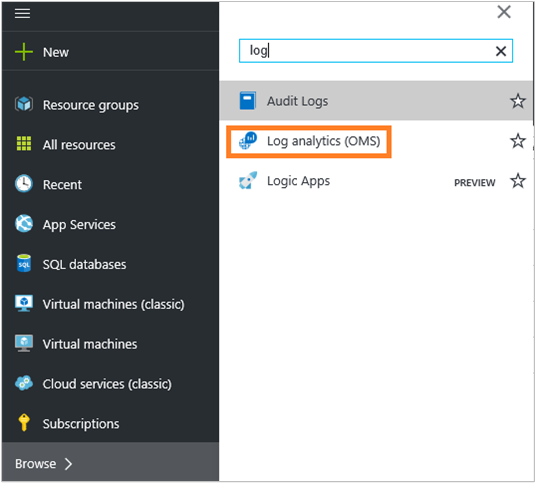
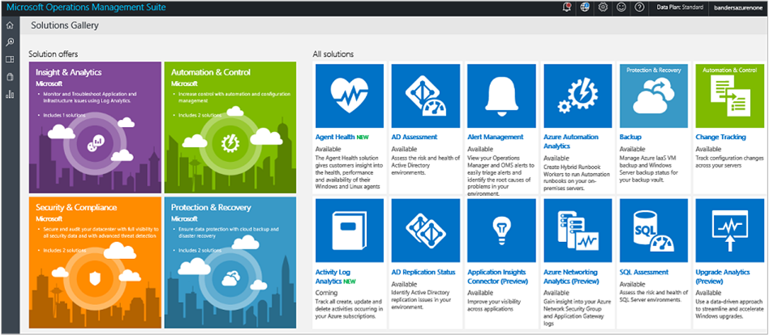
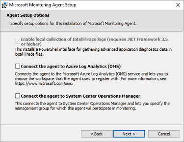

<properties
    pageTitle="Erste Schritte mit Log Analytics | Microsoft Azure"
    description="Sie können in Minuten einsatzbereit mit Log Analytics in Microsoft Operations Management Suite (OMS) erhalten."
    services="log-analytics"
    documentationCenter=""
    authors="bandersmsft"
    manager="jwhit"
    editor=""/>

<tags
    ms.service="log-analytics"
    ms.workload="na"
    ms.tgt_pltfrm="na"
    ms.devlang="na"
    ms.topic="get-started-article"
    ms.date="10/10/2016"
    ms.author="banders"/>

# Erste Schritte mit Log Analytics

Sie können in Minuten einsatzbereit mit Log Analytics in Microsoft Operations Management Suite (OMS) erhalten. Bei der Auswahl zum Erstellen eines Arbeitsbereichs OMS, ähnelt sich mit einer Firma, stehen Ihnen zwei Optionen zur Verfügung:

- Microsoft Operations Management Suite-website
- Microsoft Azure-Abonnement

Sie können einen kostenlosen OMS Arbeitsbereich mithilfe der OMS-Website erstellen. Oder Sie können ein Microsoft Azure-Abonnement verwenden, um ein OMS-Arbeitsbereich erstellen. Beide Arbeitsbereiche sind funktional, außer dass ein kostenloser OMS Arbeitsbereich nur 500 MB Daten täglich an den OMS-Dienst senden kann. Wenn Sie ein Abonnement Azure verwenden, können Sie auch diese Abonnement Zugriff auf andere Dienste Azure verwenden. Unabhängig von der Methode, die Sie verwenden, um den Arbeitsbereich zu erstellen, erstellen Sie den Arbeitsbereich mit einem Microsoft-Konto oder organisationskonto.

Sehen Sie sich an den Prozess:

## Melden Sie sich Analytics erforderliche Komponenten und -Bereitstellung

- Sie benötigen Microsoft Azure Abonnementversion vollständig Log Analytics verwenden. Wenn Sie ein Azure-Abonnement besitzen, erstellen Sie ein [kostenloses Konto](https://azure.microsoft.com/free/) , das Sie Azure Dienste zugreifen können. Oder erstellen Sie ein kostenloses OMS-Konto bei der Website [Vorgänge Management Suite](http://microsoft.com/oms) und klicken Sie auf **Testen Sie kostenlos**.
- Ein Arbeitsbereich OMS
- Jeder Windows-Computer, die Sie Sammeln von Daten aus müssen Windows Server 2008 SP1 ausführen möchten oder höher
- [Firewall](log-analytics-proxy-firewall.md) -Zugriff auf die OMS Webadressen des Diensts
- Einem Server [OMS Log Analytics Weiterleitung](https://blogs.technet.microsoft.com/msoms/2016/03/17/oms-log-analytics-forwarder) (Gateway) von Servern zu OMS, weiterleiten, wenn der Zugriff auf das Internet nicht von allen Computern verfügbar ist
- Wenn Sie Vorgänge Manager Log Analytics unterstützt Operations Manager 2012 SP1 UR6 verwenden und über und Operations Manager 2012 R2 UR2 und höher. Proxy-Unterstützung wurde in Operations Manager 2012 SP1 UR7 und Operations Manager 2012 R2 UR3 hinzugefügt. Stellen Sie fest, wie es mit OMS integriert werden.
- Feststellen Sie, ob Ihr Computer direkten Zugriff auf das Internet haben. Andernfalls erfordern sie ein Gateway-Datenbankserver an den OMS-Dienst Websites zugreifen. Jeder Zugriff erfolgt über HTTPS.
- Legen Sie fest, welche Technologien und Servern Daten zu OMS senden werden. Beispielsweise Domänen-Controller, SQL Server, usw.
- In OMS und Azure Benutzern die erteilen Sie Berechtigung.
- Wenn Sie über die Verwendung von Daten betreffenden befinden, Bereitstellen Sie jede Lösung einzeln und Testen Sie der Leistung durch vor dem Hinzufügen des zusätzlicher Lösungen.
- Überprüfen Sie Ihre Daten Verwendung und Leistung wie Sie Log Analytics Lösungen und Features hinzufügen. Dies umfasst Ereignis Websitesammlung, Log Websitesammlung, Sammlung von Daten. Es ist besser zunächst minimale Websitesammlung bis Datennutzung oder Auswirkung auf die Leistung wurde erkannt.
- Stellen Sie sicher, dass die Windows-Agents werden auch nicht verwaltet mit Operations Manager, andernfalls doppelte Daten führt zu Fehlern. Dies gilt auch für Azure-basierten-Agents mit Azure-Diagnose aktiviert.
- Nachdem Sie Agents installiert haben, stellen Sie sicher, dass der Agent ordnungsgemäß arbeitet. Wenn nicht, überprüfen, um sicherzustellen, dass die Verschlüsselung API: Next Generation (CNG) Schlüssel Isolation mithilfe von Gruppenrichtlinien nicht deaktiviert ist.
- Einige Log Analytics Lösungen haben weitere Anforderungen

## Registrieren Sie sich in 3 Schritten mit der Vorgänge Management Suite

1. Wechseln Sie zu der Website [Vorgänge Management Suite](http://microsoft.com/oms) aus, und klicken Sie auf **Testen Sie kostenlos**. Melden Sie sich mit Ihrem Microsoft-Konto wie Outlook.com oder mit einem organisationskonto von Ihrem Unternehmen oder eine Bildungseinrichtung bereitgestellten zur Verwendung mit Office 365 oder einem anderen Microsoft-Dienst aus.
2. Geben Sie einen eindeutigen Arbeitsbereich an. Ein Arbeitsbereich ist ein logischer Container von Management Daten gespeichert ist. Es bietet eine Möglichkeit, Daten zwischen verschiedenen Teams in Ihrer Organisation, während die Daten zu ihren Arbeitsbereichen exklusiv ist. Geben Sie eine e-Mail-Adresse und den Bereich, in dem Sie Ihre gespeicherten Daten haben möchten.  
    
3. Als Nächstes können Sie ein neues Azure-Abonnement oder eine Verknüpfung zu einem vorhandenen Azure-Abonnement erstellen. Klicken Sie auf **Jetzt nicht**, wenn Sie, um den Vorgang fortzusetzen, verwenden die kostenlose Testversion möchten.  
  

Sie können jetzt mit dem Portal Vorgänge Management Suite Schritte.

Sie können weitere Informationen zum Einrichten von dem Arbeitsbereich und verknüpfen vorhandenen Azure so Arbeitsbereiche erstellt, mit der Vorgänge Management Suite am [Verwalten Zugriff auf Log Analytics](log-analytics-manage-access.md)-Konten.

## Registrieren Sie sich schnell mit Microsoft Azure

1. Wechseln Sie zum [Azure-Portal](https://portal.azure.com) melden Sie an, Durchsuchen Sie die Liste der Dienste, und wählen Sie dann auf **Log Analytics (OMS)**.  
    
2. Klicken Sie auf **Hinzufügen**, und wählen Sie dann die Optionen für die folgenden Elemente:
    - Name der **OMS-Arbeitsbereich**
    - **Abonnement** – Wenn Sie mehrere Abonnements haben, die eine auszuwählen, die Sie den neuen Arbeitsbereich zuordnen möchten.
    - **Ressourcengruppe**
    - **Speicherort**
    - **Preise Ebene**  
        
3. Klicken Sie auf **Erstellen** , und sehen Sie die Details der Arbeitsbereich Azure-Portal.       
             
4. Klicken Sie auf den Link **OMS-Portal** , um die Vorgänge Management Suite-Website mit dem neuen Arbeitsbereich zu öffnen.

Sie sind bereit sind, verwenden das Vorgänge Management Suite Portal.

Sie erhalten weitere Informationen zum Einrichten des Arbeitsbereichs und Verknüpfen vorhandener Arbeitsbereiche, die Sie mit der Vorgänge Management Suite zu Azure [Verwalten Zugriff auf Log Analytics](log-analytics-manage-access.md)-Abonnements erstellt.

## Erste Schritte mit dem Portal Vorgänge Management Suite
Zum Auswählen von Lösungen, und verbinden die Server, die Sie verwalten möchten, klicken Sie auf die Kachel " **Einstellungen** ", und führen Sie die Schritte in diesem Abschnitt.  

  

1. **Hinzufügen von Lösungen** - anzeigen die installierten Lösungen.  
      
    Klicken Sie auf **die Galerie besuchen,** um weitere Solutions hinzuzufügen.  
      
    Wählen Sie eine Lösung aus, und klicken Sie dann auf **Hinzufügen**.
2. **Verbinden einer Quelle** - wählen Sie an, wie die Verbindung zu Ihrem Server-Umgebung zum Sammeln von Daten:
    - Verbinden von jedem Windows-Server oder Client direkt nach der Installation von Agent.
    - Verbinden von Linux-Servern mit dem OMS-Agent für Linux.
    - Verwenden Sie ein Azure-Speicher-Konto, das mit der Windows Linux Azure diagnostic virtueller Computer Erweiterung oder konfiguriert.
    - Verwenden Sie System Center Operations Manager, um Ihre Management Gruppen oder der gesamten Bereitstellung von Operations Manager anzufügen.
    - Aktivieren Sie Windows werden Analytics Upgrade verwenden.
            

3. **Sammeln von Daten** Konfigurieren Sie mindestens eine Datenquelle zum Auffüllen von Daten in den Arbeitsbereich ein. Wenn Sie fertig sind, klicken Sie auf **Speichern**.    

        

## Optional Servern direkt Herstellen einer Verbindung mit der Management-Suite Vorgänge nach der Installation von agent

Im folgende Beispiel wird gezeigt, wie einen Windows-Agent installieren.

1. Klicken Sie auf die Kachel **Einstellungen** , klicken Sie auf die Registerkarte **Datenquellen verbunden** , klicken Sie auf einer Registerkarte für den Typ von Datenquelle, die, den Sie hinzufügen möchten, und entweder Download Agent oder Informationen Sie dazu, wie Sie einen Agent aktivieren. Klicken Sie beispielsweise auf **Herunterladen von Windows-Agent (64-Bit)**. Für Windows-Agents können Sie nur den Agent unter Windows Server 2008 SP 1 oder höher oder unter Windows 7 SP1 oder höher installieren.
2. Installieren Sie den Agent auf einen oder mehrere Server aus. Sie können Agents nacheinander installieren oder verwenden eine weitere automatisierte Methode, um ein [benutzerdefiniertes Skript](log-analytics-windows-agents.md), oder Sie können eine vorhandene Software Verteilung Lösung, die Sie möglicherweise verwenden.
3. Nachdem Sie, um den Lizenzvertrag zustimmen, und wählen Sie den Installationsordner, wählen Sie **Verbinden der Agent zum Azure Log Analytics (OMS)**.   
    

4. Klicken Sie auf der nächsten Seite müssen Sie für Ihren Arbeitsplatz-ID und Arbeitsbereich-Taste. Der Arbeitsbereich-ID und Schlüssel werden auf dem Bildschirm angezeigt, in dem Sie die Datei Agent heruntergeladen haben.  
      

    
5. Während der Installation können Sie **Erweitert** , um die optional Ihres Proxyservers eingerichtet und bieten Authentifizierungsinformationen klicken. Klicken Sie auf die Schaltfläche **Weiter** , um zum Bildschirm Informationen Arbeitsbereich zurückzukehren.
6. Klicken Sie auf **Weiter** , um zu Ihren Arbeitsbereich-ID und Schlüssel überprüfen. Wenn Fehler gefunden werden, können Sie **wieder** zum Korrigieren klicken. Wenn Ihr Arbeitsbereich-ID und Schlüssel überprüft werden, klicken Sie auf **Installieren** , um die Agenteninstallation durchzuführen.
7. Klicken Sie in der Systemsteuerung auf Microsoft Überwachung Agent > Registerkarte Azure Log Analytics (OMS). Einem grünen Häkchen wird angezeigt, wenn die Agents mit dem Vorgänge Management Suite Dienst kommunizieren. Zunächst, etwa 5 bis 10 Minuten gelangen.

>[AZURE.NOTE] Kapazität Lösungen für die Verwaltung und Konfiguration-Bewertung werden durch direkt an die Vorgänge Management Suite verbundenen Server derzeit nicht unterstützt.

Sie können auch den Agent auf System Center Operations Manager 2012 SP1 und höher herstellen. Wählen Sie hierzu **Verbinden des System Center Operations Manager-Agents**aus. Wenn Sie auswählen, Option, Daten an den Dienst senden, ohne zusätzlichen Hardware oder auf Ihrer Management-Gruppen zu laden.

Sie können weitere Informationen zum Verbinden von Agents mit der Vorgänge Management Suite bei [Computern unter Windows Verbinden zur Log Analytics](log-analytics-windows-agents.md).

## Verbinden Sie optional auf Servern mit System Center Operations Manager

1. Wählen Sie in der Verwaltungskonsole Operations Manager **Administration**aus.
2. Erweitern Sie den Knoten **Betrieb Einblicken** , und wählen Sie **Betrieb Einsichten Verbindung**.

  >[AZURE.NOTE] Je nach welche Update Rollup von SCOM Sie verwenden, können Sie einen Knoten für *System Center Advisor*, *Betrieb Einblicken*oder *Vorgänge Management Suite*angezeigt.

3. Klicken Sie auf den Link **zum Betrieb Einsichten registrieren** in Richtung der rechten oberen Ecke, und folgen Sie den Anweisungen.
4. Klicken Sie nach Abschluss der Registrier-Assistent auf den Link zum **Hinzufügen eines Computer/einer Gruppe** .
5. Klicken Sie im Dialogfeld **Computer suchen** können Sie nach Computer oder Gruppen von Operations Manager überwacht suchen. Computer oder Gruppen auswählen auf integrierte diese zu Log Analytics, klicken Sie auf **Hinzufügen**, und klicken Sie dann auf **OK**. Sie können überprüfen, ob der OMS-Dienst Daten empfängt, indem Sie auf die Kachel **Verwendung** im Portal Vorgänge Management Suite. Daten sollte ungefähr 5 bis 10 Minuten angezeigt werden.

Sie können weitere Informationen zum Herstellen einer Verbindung Operations Manager der Vorgänge Management Suite am [Log Analytics Operations Manager verbinden](log-analytics-om-agents.md).

## Analysieren von Daten aus der Cloud-Dienste in Microsoft Azure optional

Mit der Vorgänge Management Suite können Sie schnell Ereignis IIS-Protokolle für Cloud-Diensten und virtuellen Computern durch und Durchsuchen Diagnose für Azure-Cloud-Dienste zu aktivieren. Sie können auch weitere Einsichten für Ihre Azure-virtuellen Computern empfangen, nach der Installation von Microsoft Agent überwachen. Weitere Informationen zum Konfigurieren Ihrer Azure-Umgebung, um die Vorgänge Management Suite am [Verbinden Azure-Speicher auf Log Analytics](log-analytics-azure-storage.md)verwenden.

## Nächste Schritte

- [Hinzufügen von Log Analytics Lösungen aus dem Lösungskatalog](log-analytics-add-solutions.md) zum Hinzufügen von Funktionen und Daten zu sammeln.
- Kennenlernen Sie [Log Suchbegriffe](log-analytics-log-searches.md) , detaillierte von Lösungen gesammelten Informationen anzuzeigen.
- Verwenden Sie [Dashboards](log-analytics-dashboards.md) zu speichern, und zeigen Sie Ihre eigenen benutzerdefinierten suchen.
