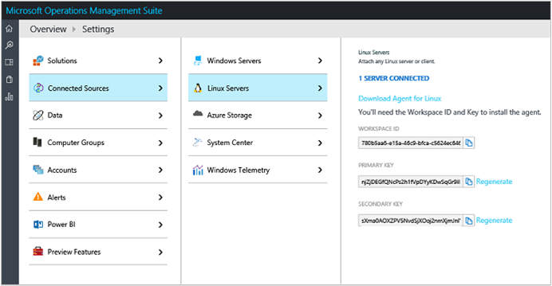
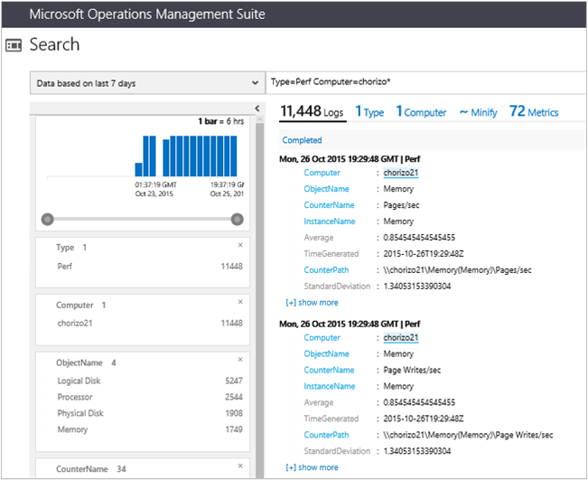
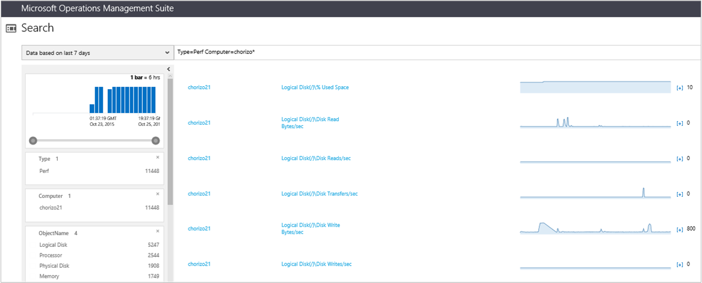
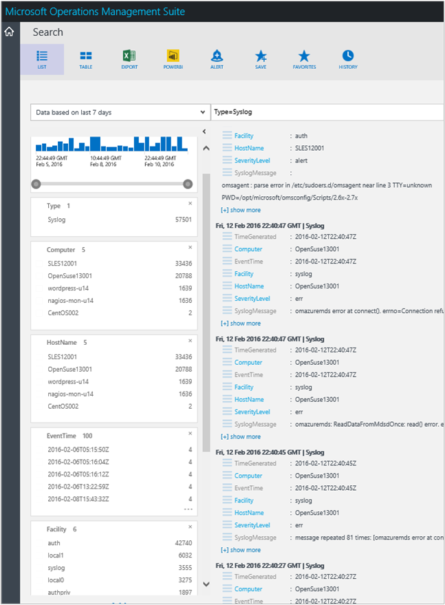

<properties
    pageTitle="Herstellen einer Verbindung Log Analytics mit Linux Computern | Microsoft Azure"
    description="Log Analytics können Sie sammeln und wirken sich auf Daten, die von Linux Computern generiert."
    services="log-analytics"
    documentationCenter=""
    authors="bandersmsft"
    manager="jwhit"
    editor=""/>

<tags
    ms.service="log-analytics"
    ms.workload="na"
    ms.tgt_pltfrm="na"
    ms.devlang="na"
    ms.topic="article"
    ms.date="10/10/2016"
    ms.author="banders"/>

# <a name="connect-linux-computers-to-log-analytics"></a>Herstellen einer Verbindung Log Analytics mit Linux-Computern

Log Analytics können Sie sammeln und wirken sich auf Daten, die von Linux Computern generiert. Hinzufügen von Linux zu OMS erfassten Daten werden, können Sie zum Verwalten von Linux Betriebssysteme und Container Lösungen wie Docker unabhängig davon, wo sich Ihre Computer befinden – Geschäftserfolg. Ja, möglicherweise diese Datenquellen in Ihrem lokalen Datencenter als physischen Servern, virtuellen Computern in einen Cloud-gehosteten Service wie Amazon Web Services (AWS) oder Microsoft Azure oder sogar der Laptop auf Ihrem Schreibtisch befinden. Darüber hinaus sammelt OMS auch Daten von Windows Computern auf ähnliche Weise, damit es ein Hybrid wirklich IT-Umgebung unterstützt.

Sie können anzeigen und Verwalten von Daten aus allen Quellen mit Log Analytics in OMS mit einer einzelnen Verwaltungsportal. Dies nicht mehr erforderlich, viele verschiedene Systeme, ist es einfach zu nutzen, und Sie können Daten aus, die Sie für jeden Business Analytics-Lösung oder exportieren Systems, das Sie bereits mit zu überwachen.

In diesem Artikel wird eine Schnellstartübersicht, mit deren Hilfe Sie sammeln und Verwalten von Daten für Ihre Linux-Computer mit der OMS-Agent für Linux. Weitere technische Details wie Proxyserver-Konfiguration, Informationen zu CollectD Kennzahlen und benutzerdefinierte JSON-Datenquellen, finden Sie diese Daten am [OMS-Agent für Linux Übersicht](https://github.com/Microsoft/OMS-Agent-for-Linux) und [OMS-Agent Linux eine vollständige Dokumentation](https://github.com/Microsoft/OMS-Agent-for-Linux/blob/master/docs/OMS-Agent-for-Linux.md) auf Github.


Aktuell, können Sie die folgenden Arten von Daten von Linux Computern gesammelt:

- Leistungswerte
- Syslog-Ereignis
- Benachrichtigungen von Nagios und Zabbix
- Docker Container Leistungswerte, Inventory und Protokolle

## <a name="supported-linux-versions"></a>Unterstützte Linux-Versionen

Sowohl die X86 X64 Versionen werden formal auf einer Vielzahl von Linux-Versionen unterstützt. Der OMS-Agent für Linux kann jedoch auch in anderen Verteilung nicht aufgeführt ausgeführt werden.

- Amazon Linux 2012.09 bis 2015.09
- CentOS Linux 5, 6 und 7
- Oracle-Linux 5, 6 und 7
- Red Hat Enterprise Linux Server 5, 6 und 7
- Debian GNU/Linux 6, 7 und 8
- Ubuntu 12.04 LTS, 14.04 LTS, 15.04, 15.10
- SUSE Linux Enterprise Server 11 und 12

## <a name="oms-agent-for-linux"></a>OMS-Agent für Linux
Die Vorgänge Management Suite Agent für Linux umfasst mehrere Pakete. Die Release-Datei enthält die folgenden Pakete, zur Verfügung, indem Sie das Shell-Paket mit `--extract`.

**Paket** | **Version** | **Beschreibung**
----------- | ----------- | --------------
omsagent | 1.1.0 | Die Vorgänge Management Suite Agent für Linux
omsconfig | 1.1.1 | Konfigurations-Agent für den OMS-Agent
OMI | 1.0.8.3 | Open-Infrastruktur (OMI) – eine einfache CIM-Server
SCX | 1.6.2 | OMI CIM-Anbieter für das Betriebssystem Performance-Werte
Apache-cimprov | 1.0.0 | Überwachung-Anbieter für OMI Apache HTTP-Server optimale Leistung. Nur installiert, wenn Apache HTTP-Server gefunden wurde.
MySQL-cimprov | 1.0.0 | Überwachung-Anbieter für OMI MySQL-Server optimale Leistung. Nur installiert, wenn der MySQL-MariaDB Server erkannt wird.
Docker-cimprov | 0.1.0 | Docker-Anbieter für OMI. Nur installiert, wenn Docker erkannt wird.

### <a name="additional-installation-artifacts"></a>Zusätzliche Installation Elemente
Nach der Installation des OMS-Agents für Linux Pakete sind folgende zusätzliche System organisationsweite Konfiguration Änderungen angewendet. Diese Elemente werden entfernt, wenn das Paket Omsagent deinstalliert wurde.
- Ein Benutzer ohne Berechtigungen, die mit dem Namen: `omsagent` wird erstellt. Dies ist das Konto ein, dem der Omsagent Daemon als ausgeführt wird.
- Eine Sudoers "include" Datei erstellt am /etc/sudoers.d/omsagent autorisiert dies Omsagent, die Daemons Syslog und Omsagent neu zu starten. Wenn Sudo "include" Richtlinien in der installierten Version des Sudo nicht unterstützt werden, werden diese Einträge in /etc/sudoers geschrieben werden.
- Die Syslog-Konfiguration wird geändert, um eine Teilmenge von Ereignissen an dem Agent weiterzuleiten. Weitere Informationen finden Sie unter Abschnitt **Datensammlung konfigurieren**

### <a name="linux-data-collection-details"></a>Einzelheiten zur Datensammlung Linux

Die folgende Tabelle zeigt Datensammlungsmethoden und andere Details, wie Daten erfasst werden.

| Datenquelle | Direkte Agent | SCOM agent | Azure-Speicher | SCOM erforderlich? | SCOM Agentdaten per Management Group unter gesendeten | Häufigkeit Collection |
|---|---|---|---|---|---|---|
|Zabbix||||            ||1 minute|
|Nagios||||            ||Beim Eintreffen|
|Syslog||||            ||aus Azure-Speicher: 10 Minuten; Agents: beim Eintreffen|
|Linux-Datenquellen||||            ||Wie geplant, Mindestlänge von 10 Sekunden|
|der änderungsnachverfolgung||||            ||stündlich|


### <a name="package-requirements"></a>Paket Anforderungen
| **Erforderliches Paket**  | **Beschreibung**   | **Mindestversion**|
|--------------------- | --------------------- | -------------------|
|Glibc |    GNU C-Bibliothek   | 2,5 bis 12|
|OpenSSL    | OpenSSL-Bibliotheken | 0.9.8E oder 1.0|
|Aufrollen | WebClient Aufrollen | 7.15.5
|Python-ctypes |Bibliotheken (Funktion) | n/v|
|PAM | Austauschbare Authentifizierung Module  |n/v |

>[AZURE.NOTE] Syslog-Nachrichten zu sammeln sind entweder Rsyslog oder Syslog-ng erforderlich. Der standardmäßige Syslog Daemon auf Red Hat Enterprise Linux, CentOS und Oracle Linux Version (Sysklog), Version 5 wird Syslog Ereignis Websitesammlung nicht unterstützt. Zum Sammeln von Daten Syslog von dieser Version von diese Verteilung sollte der Rsyslog Daemon installiert und konfiguriert Sysklog ersetzen.

## <a name="quick-install"></a>Schnelle Installation

Führen Sie die folgenden Befehle zum Herunterladen der Omsagent, überprüfen die Prüfsumme und dann installieren und integrierten der Agent. Befehle sind für 64-Bit-Version. Der Arbeitsbereich-ID und Primärschlüssel befinden sich im Portal OMS unter **Einstellungen** auf der Registerkarte **Datenquellen verbunden** .



```
wget https://github.com/Microsoft/OMS-Agent-for-Linux/releases/download/v1.1.0-28/omsagent-1.1.0-28.universal.x64.sh
sha256sum ./omsagent-1.1.0-28.universal.x64.sh
sudo sh ./omsagent-1.1.0-28.universal.x64.sh --upgrade -w <YOUR OMS WORKSPACE ID> -s <YOUR OMS WORKSPACE PRIMARY KEY>
```

Es gibt eine Vielzahl von anderen Methoden zum Installieren des Agents und aktualisieren ihn aus. Sie können weitere Informationen zu diesen am [Schritte zur Installation des OMS-Agent für Linux](https://github.com/Microsoft/OMS-Agent-for-Linux/blob/master/docs/OMS-Agent-for-Linux.md#steps-to-install-the-oms-agent-for-linux).

Sie können auch die [Azure video Exemplarische Vorgehensweise](https://www.youtube.com/watch?v=mF1wtHPEzT0)anzeigen.

## <a name="choose-your-linux-data-collection-method"></a>Wählen Sie Ihre Linux Daten Websitesammlungs-Methode

Wie wählen Sie die Datentypen aus, die Sie sammeln möchten hängt davon ab, ob das Portal OMS verwenden möchten, oder wenn Sie möchten verschiedene Konfigurationsdateien direkt auf den Linux-Clients zu bearbeiten. Wenn Sie das Portal verwenden, wird die Konfiguration automatisch für alle Kunden Linux gesendet. Wenn Sie verschiedene Konfigurationen für verschiedene Linux-Clients benötigen, müssen Sie die Client-Dateien einzeln – bearbeiten, oder verwenden Sie eine Alternative wie PowerShell DSC, Verwaltungsangestellte oder Marionette.

Sie können angeben, die syslog-Ereignis und Leistungsindikatoren, die Sie sammeln Konfigurationsdateien auf den Computern Linux verwenden möchten. *Wenn Sie Datensammlung konfigurieren, indem Sie die Bearbeitung von Dateien für Agent-Konfiguration ausgewählt haben, sollten Sie die zentrale Konfiguration deaktivieren.*  So konfigurieren Sie Datensammlung in des Kundendienstmitarbeiters Konfigurationsdateien als auch So deaktivieren Sie die zentrale Konfiguration für alle OMS-Agents für Linux oder einzelne Computer werden Anweisungen unter bereitgestellt.

### <a name="disable-oms-management-for-an-individual-linux-computer"></a>Deaktivieren der OMS-Verwaltung für einen einzelnen Linux-computer

Zentralisierte Datensammlung für Konfigurationsdaten ist für einen einzelnen Linux-Computer mit dem Skript OMS_MetaConfigHelper.py deaktiviert. Dies ist nützlich, wenn eine Teilmenge der Computer eine spezielle Konfiguration sein soll.

So deaktivieren Sie zentralisierte Konfiguration

```
sudo /opt/microsoft/omsconfig/Scripts/OMS_MetaConfigHelper.py --disable
```

Um zentralisierte Konfiguration wieder zu aktivieren:

```
sudo /opt/microsoft/omsconfig/Scripts/OMS_MetaConfigHelper.py –enable
```

## <a name="linux-performance-counters"></a>Linux-Datenquellen

Linux-Datenquellen werden ähnlich wie Windows-Datenquellen – beide auf ähnliche Weise angewendet werden. Sie können die folgenden Verfahren hinzufügen und konfigurieren sie verwenden. Nachdem sie zu OMS hinzugefügt wurden, werden Daten für diese alle 30 Sekunden gesammelt.

### <a name="to-add-a-linux-performance-counter-in-oms"></a>So fügen Sie ein Linux Performance-Zähler in OMS hinzu

1. Zum Konfigurieren der OMS-Agents mit dem Portal OMS Linux können Sie Linux-Datenquellen auf der Einstellungsseite hinzuzufügen, klicken Sie auf **Daten**.  
2. Klicken Sie auf der Seite **Einstellungen** unter **Daten** auf **Linux-Datenquellen** wählen Sie aus, oder geben Sie den Namen der Zähler, die, den Sie hinzufügen möchten.  
    
3. Wenn Sie nicht, dass der vollständige Name des der Zähler wissen, können Sie beginnen, einen Teil des Namens eingeben und eine Liste der verfügbaren Indikatoren angezeigt wird. Wenn Sie den Indikator, die, den Sie hinzufügen möchten finden, klicken Sie auf den Namen in der Liste, und klicken Sie dann auf das Pluszeichen Symbol aus, um den Zähler hinzufügen.
4. Den Zähler hinzugefügt haben, wird es in der Liste der Indikatoren, die mit einem farbigen Balken hervorgehoben angezeigt.
5. Standardmäßig ist die Option **anwenden unterhalb der Konfiguration, die auf meinem Computer** aktiviert. Wenn Sie der Daten sendet deaktivieren möchten, deaktivieren Sie die Auswahl.
6. Wenn Sie Datenquellen ändern fertig sind, am unteren Rand der Seite klicken Sie auf **Speichern** , um die Änderungen Fertigstellen. Die Konfiguration Änderungen, die Sie vorgenommen haben werden dann an die OMS-Agents für Linux, die mit OMS registriert sind, in der Regel innerhalb von 5 Minuten gesendet.

### <a name="configure-linux-performance-counters-in-oms"></a>Konfigurieren der OMS Linux-Datenquellen

Für Windows-Leistungsindikatoren können Sie eine bestimmte Instanz für jeden Leistungsindikator auswählen. Für Linux Leistungsindikatoren gilt jeden Instanz der Zähler, die Sie auswählen auf alle untergeordneten Indikatoren von der übergeordneten Zähler. Die folgende Tabelle zeigt die allgemeinen Instanzen Linux und Windows Performance Indikatoren zur Verfügung.

| **Instanznamen** | **Bedeutung** |
| --- | --- |
| \_Summe | Die Summe aller Instanzen |
| \* | Alle Instanzen |
| (/ & #124; / Var) | Instanzen mit dem Namen übereinstimmt: / oder/var |


Alle zugehörigen untergeordneten Indikatoren entsprechend gilt das Stichprobe, das von Ihnen ausgewählten Intervall für einen übergeordneten Zähler. Kurzum, werden alle untergeordneten Zähler Stichprobe Intervallen und Instanzen zusammen verknüpft.

### <a name="add-and-configure-performance-metrics-with-linux"></a>Hinzufügen und Konfigurieren von Leistungswerte mit Linux

Zum Sammeln von Performance-Werte werden durch die Konfiguration in /etc/opt/microsoft/omsagent/conf/omsagent.conf gesteuert. Linux finden Sie unter [Verfügbare Leistungswerte](https://github.com/Microsoft/OMS-Agent-for-Linux/blob/master/docs/OMS-Agent-for-Linux.md#appendix-available-performance-metrics) für eine verfügbare Klassen und Kriterien für den OMS-Agent.

Jedes Objekt oder Kategorie, der zum Sammeln von Performance-Werte in der Konfigurationsdatei als einzelne definiert werden `<source>` Element. Die Syntax der folgt dem nachstehenden Muster.

```
<source>
  type oms_omi  
  object_name "Processor"
  instance_regex ".*"
  counter_name_regex ".*"
  interval 30s
</source>

```

Dieses Element die konfigurierbare Parameter sind:

- **Objekt\_Namen**: die zu verwendenden Objektnamen für die Websitesammlung.
- **Instanz\_Regex**: eine *reguläre Ausdrücke* definieren Instanzen sammeln. Der Wert: `.*` gibt alle Instanzen an. Zum Erfassen von Prozessor Kennzahlen für nur die \_Total Instanz, geben Sie `_Total`. Zum Sammeln von Prozess Kennzahlen für nur die Instanzen Crond oder Sshd könnten Sie angeben: `(crond|sshd)`.
- **Zähler\_Namen\_Regex**: eine *reguläre Ausdrücke* definieren, welche (für das Objekt) Indikatoren um zu sammeln. Um alle Indikatoren für das Objekt zu erfassen, geben: `.*`. Um nur austauschen Leerzeichen Indikatoren für das Objekt Arbeitsspeicher zu erfassen, können Sie Folgendes angeben:`.+Swap.+`
- **Intervall:**: der Häufigkeit, des Objekts Indikatoren erfasst werden.

Die standardmäßige Konfiguration für Leistungswerte lautet:

```
<source>
  type oms_omi
  object_name "Physical Disk"
  instance_regex ".*"
  counter_name_regex ".*"
  interval 5m
</source>

<source>
  type oms_omi
  object_name "Logical Disk"
  instance_regex ".*
  counter_name_regex ".*"
  interval 5m
</source>

<source>
  type oms_omi
  object_name "Processor"
  instance_regex ".*
  counter_name_regex ".*"
  interval 30s
</source>

<source>
  type oms_omi
  object_name "Memory"
  instance_regex ".*"
  counter_name_regex ".*"
  interval 30s
</source>

```

### <a name="enable-mysql-performance-counters-using-linux-commands"></a>Aktivieren Sie mithilfe der Befehle Linux MySQL-Datenquellen

Wenn der MySQL-Server oder MariaDB Server auf dem Computer erkannt wird, wenn das Paket Omsagent installiert ist, wird ein Datenanbieter für MySQL-Server zum Überwachen der Leistung automatisch installiert. Dieser Anbieter eine Verbindung herstellt, auf dem lokalen MySQL-MariaDB Server Leistungsstatistiken verfügbar machen. Sie müssen MySQL-Benutzeranmeldeinformationen so konfigurieren, dass der Anbieter der MySQL-Server zugreifen kann.

Verwenden Sie zum Definieren eines Standard-Benutzerkonto für die MySQL-Server auf lokalen Host Beispiel für den folgenden Befehl ein.

>[AZURE.NOTE] Die Datei Anmeldeinformationen muss durch das Konto Omsagent gelesen werden. Ausführen des Befehls Mycimprovauth als Omsgent wird empfohlen.


```
sudo su omsagent -c '/opt/microsoft/mysql-cimprov/bin/mycimprovauth default 127.0.0.1 <username> <password>'

sudo service omiserverd restart
```


Sie können auch, die erforderlichen MySQL-Anmeldeinformationen in der Datei angeben, indem Sie die Datei erstellen: /var/opt/microsoft/mysql-cimprov/auth/omsagent/mysql-auth. Weitere Informationen zum Verwalten von MySQL-Anmeldeinformationen für die Überwachung der Mysql-Authentifizierung-Datei finden Sie unter [Verwalten von MySQL Überwachung Anmeldeinformationen in der Authentifizierungsdatei](#manage-mysql-monitoring-credentials-in-the-authentication-file).

Details zu Objektberechtigungen der MySQL-Benutzer erforderlich MySQL-Server gesammelt finden Sie unter [Datenbankberechtigungen für den MySQL-Datenquellen erforderlich ist](#database-permissions-required-for-mysql-performance-counters) .

### <a name="enable-apache-http-server-performance-counters-using-linux-commands"></a>Aktivieren Sie Apache HTTP Server Leistungsindikatoren Linux Befehle verwenden

Wenn Sie Apache HTTP-Server auf dem Computer erkannt wird, wenn das Paket Omsagent installiert ist, wird ein Datenanbieter für Apache HTTP Server zum Überwachen der Leistung automatisch installiert. Dieser Anbieter basiert auf einer Apache "Modul", die in den Apache HTTP-Server geladen werden muss, damit die Performance-Daten zugreifen.

Laden Sie das Modul mit den folgenden Befehl aus:

```
sudo /opt/microsoft/apache-cimprov/bin/apache_config.sh -c
```

Um die Überwachung Apache-Modul entfernen möchten, führen Sie den folgenden Befehl aus:

```
sudo /opt/microsoft/apache-cimprov/bin/apache_config.sh -u
```
### <a name="to-view-performance-data-with-log-analytics"></a>Von Leistungsdaten mit Log Analytics anzeigen

1. Klicken Sie im Portal Vorgänge Management Suite auf die Kachel Log suchen.
2. Geben Sie in der Suchleiste `* (Type=Perf)` alle Leistungsindikatoren anzeigen.


Da OMS auch Windows-Leistungsindikatordaten sammelt, sollten Sie die Suche auf Linux-spezifische Daten Bereich ab. So würden im folgende Beispiel Leistungsdaten speziell für ein Beispiel Linux-Server mit dem Namen Chorizo21 angezeigt.

```
Type=Perf Computer=chorizo*
```



Klicken Sie in die Ergebnisse die **Metrik** , um die Indikatoren anzeigen möchten, denen Daten für erfasst wurden. Echtzeitdaten werden als Diagramme für jeden Indikator angezeigt.




## <a name="syslog"></a>Syslog

Syslog ist ein Ereignis Protokollierung Protokoll ähnlich wie in Windows-Ereignisprotokollen – beide funktionieren ähnlich, wenn im OMS angezeigt.

### <a name="to-add-a-new-linux-syslog-facility-in-oms"></a>Hinzufügen eine neue Linux Syslog-Funktion in OMS

1. Klicken Sie auf der Seite **Einstellungen** unter **Daten** klicken Sie auf **Syslog** und links neben dem Plussymbol, geben Sie den Namen der die Syslog-Funktion, die Sie hinzufügen möchten.
    
2.  Wenn Sie nicht, dass der vollständige Name der Einrichtung wissen, können Sie beginnen, einen Teil des Namens eingeben und eine Liste der verfügbaren Syslog-Funktionen wird angezeigt. Wenn Sie die Syslog-Funktion gefunden haben, die Sie hinzufügen möchten, klicken Sie auf den Namen in der Liste, und klicken Sie dann auf das Pluszeichen Symbol aus, um die Syslog-Funktion hinzufügen.
3.  Nach dem Hinzufügen der Funktion wird angezeigt, in der Liste der hervorgehoben mit einem farbigen Balken. Wählen Sie als Nächstes die Schweregrade (Datenkategorien Syslog Einrichtung), die Sie erfassen möchten.
4.  Klicken Sie am unteren Rand der Seite auf **Speichern** , um die Änderungen Fertigstellen. Die Konfiguration Änderungen, die Sie vorgenommen haben werden dann an die OMS-Agents für Linux, die mit OMS registriert sind, in der Regel innerhalb von 5 Minuten gesendet.


### <a name="configure-linux-syslog-facilities-in-linux"></a>Konfigurieren von Linux Syslog-Funktionen in Linux

Syslog Ereignisse werden von der Syslog Daemon, beispielsweise Rsyslog oder Syslog-ng, an einen lokalen Anschluss gesendet, denen der Agent überwacht. Standardmäßig Port 25224. Wenn der Agent installiert ist, wird eine standardmäßige Syslog Konfiguration angewendet. Diese Option befindet am:


Rsyslog: /etc/rsyslog.d/rsyslog-oms.conf

Syslog-ng: /etc/syslog-ng/syslog-ng.conf


Die standardmäßige OMS Agent Syslog Konfiguration uploads Syslog-Ereignis aus allen Orten mit einer Schwere der Warnung oder höher.

>[AZURE.NOTE] Wenn Sie die Bearbeitung der Syslog-Konfiguration, müssen Sie den Daemon Syslog, damit die Änderungen wirksam werden neu starten.

Die standardmäßige Syslog Konfiguration für den OMS-Agent für Linux für OMS ist:

#### <a name="rsyslog"></a>Rsyslog

```
kern.warning       @127.0.0.1:25224
user.warning       @127.0.0.1:25224
daemon.warning     @127.0.0.1:25224
auth.warning       @127.0.0.1:25224
syslog.warning     @127.0.0.1:25224
uucp.warning       @127.0.0.1:25224
authpriv.warning   @127.0.0.1:25224
ftp.warning        @127.0.0.1:25224
cron.warning       @127.0.0.1:25224
local0.warning     @127.0.0.1:25224
local1.warning     @127.0.0.1:25224
local2.warning     @127.0.0.1:25224
local3.warning     @127.0.0.1:25224
local4.warning     @127.0.0.1:25224
local5.warning     @127.0.0.1:25224
local6.warning     @127.0.0.1:25224
local7.warning     @127.0.0.1:25224
```

#### <a name="syslog-ng"></a>Syslog-ng

```
#OMS_facility = all
filter f_warning_oms { level(warning); };
destination warning_oms { tcp("127.0.0.1" port(25224)); };
log { source(src); filter(f_warning_oms); destination(warning_oms); };
```

### <a name="to-view-all-syslog-events-with-log-analytics"></a>Zeigen Sie alle Syslog Ereignisse mit Log Analytics

1. Klicken Sie im Portal Vorgänge Management Suite auf die Kachel **Log suchen** .
2. Wählen Sie in der **Log-Management** Gruppierung eine vordefinierte Syslog suchen aus, und wählen Sie eine um Sie auszuführen.

Dieses Beispiel zeigt alle Syslog-Ereignis.



Jetzt können Sie einen Drilldown in Suchergebnissen durchführen.

## <a name="linux-alerts"></a>Linux Benachrichtigungen

Wenn Sie Nagios oder Zabbix zum Verwalten Ihrer Linux-Computer verwenden, können OMS die von diesen Tools generierten Warnungen erhalten. Es gibt jedoch derzeit keine Methode eingehende Benachrichtigung Daten mit dem Portal OMS konfigurieren. In diesem Fall müssen Sie zum Senden von Benachrichtigungen zu OMS starten eine Config-Datei bearbeiten.


### <a name="collect-alerts-from-nagios"></a>Sammeln Sie Benachrichtigungen aus Nagios

Um von einem Server Nagios Benachrichtigungen zu erfassen, müssen Sie folgende Konfiguration Änderungen vornehmen.

1. Erteilen Sie dem Benutzer **Omsagent** gelesen-Zugriff auf die Protokolldatei Nagios (d. h. /var/log/nagios/nagios.log/var/log/nagios/nagios.log). Die Datei nagios.log Voraussetzung ist im Besitz der Gruppe **Nagios** der **Nagios** Gruppe der Benutzer **Omsagent** hinzugefügt werden können.

    ```
    sudo usermod –a -G nagios omsagent
    ```

2. Ändern Sie die Datei omsagent.confconfiguration (/ etc/opt/microsoft/omsagent/conf/omsagent.conf). Stellen Sie sicher, dass die folgenden Einträge vorhanden und nicht auskommentierte sind:

    ```
    <source>
    type tail
    #Update path to point to your nagios.log
    path /var/log/nagios/nagios.log
    format none
    tag oms.nagios
    </source>

    <filter oms.nagios>
    type filter_nagios_log
    </filter>
    ```

3. Starten Sie den Omsagent Daemon neu:

    ```
    sudo service omsagent restart
    ```

### <a name="collect-alerts-from-zabbix"></a>Sammeln Sie Benachrichtigungen aus Zabbix

Zum Sammeln von Benachrichtigungen von einem Server Zabbix erhalten Sie ähnlich vor, um die Nagios oben, ausführen, mit Ausnahme von müssen Sie einen Benutzer und ein Kennwort in *Klartext*angeben. Dies ist nicht ideal, aber wahrscheinlich bald geändert wird. Um dieses Problem zu beheben, wird empfohlen, Sie den Benutzer erstellen und sie über die Berechtigung zum nur überwachen gewähren.

Ein Beispiel für Abschnitt der Konfigurationsdatei omsagent.conf (/ etc/opt/microsoft/omsagent/conf/omsagent.conf) für Zabbix sollte wie folgt aussehen:

```
<source>
  type zabbix_alerts
  run_interval 1m
  tag oms.zabbix
  zabbix_url http://localhost/zabbix/api_jsonrpc.php
  zabbix_username Admin
  zabbix_password zabbix
</source>

```

### <a name="view-alerts-in-log-analytics-search"></a>Anzeigen von Benachrichtigungen in Log Analytics-Suche

Nachdem Sie Ihre Computer Linux zum Senden von Benachrichtigungen zu OMS konfiguriert haben, können Sie einige einfache Log Suchabfragen verwenden, um die Benachrichtigungen anzuzeigen. Im folgenden Beispiel der Suche Abfrage gibt die aufgezeichneten Benachrichtigungen generiert wurden. Angenommen, wenn Ihre IT-Infrastruktur irgendeine Problem auftritt, können dann Ergebnisse für das folgende Beispielabfrage darauf hinweisen, wenn das Problem stammen möglicherweise. Und Sie können ganz einfach einen Drilldown ausführen, die Benachrichtigungen über Quelle System zum Eingrenzen Ihrer Untersuchung. Der Vorteil besteht darin, dass Sie unbedingt besitzen, fahren Sie mit verschiedenen Management-Systeme ab dem Anfang – vorausgesetzt, dass OMS die Benachrichtigungen gesendet werden, können Sie es starten.

```
Type=Alert
```

#### <a name="to-view-all-nagios-alerts-with-log-analytics"></a>Alle Nagios Benachrichtigungen mit Log Analytics anzeigen
1. Klicken Sie im Portal Vorgänge Management Suite auf die Kachel **Log suchen** .
2. Geben Sie in der Adressleiste Abfrage die folgende Abfrage für die Suche

    ```
    Type=Alert SourceSystem=Nagios
    ```


Nachdem Sie die Suchergebnisse angezeigt, können Sie in wie *AlertState*Weitere Details anzeigen.

### <a name="to-view-all-zabbix-alerts-with-log-analytics"></a>Alle Zabbix Benachrichtigungen mit Log Analytics anzeigen
1. Klicken Sie im Portal Vorgänge Management Suite auf die Kachel **Log suchen** .
2. Geben Sie in der Adressleiste Abfrage die folgende Abfrage für die Suche

    ```
    Type=Alert SourceSystem=Zabbix
    ```


Nachdem Sie die Suchergebnisse angezeigt, können Sie in z. B. *existenter Warnname*Weitere Details anzeigen.


## <a name="compatibility-with-system-center-operations-manager"></a>Kompatibilität mit System Center Operations Manager

Der OMS-Agent für Linux teilt Agent Binärdateien mit dem System Center Operations Manager-Agent an. Installieren der OMS-Agent für Linux auf einem System gerade von Operations Manager verwaltet werden die OMI und SCX Pakete auf dem Computer auf eine neuere Version aktualisiert. Der OMS-Agent für Linux und System Center 2012 R2 sind kompatibel. Jedoch **System Center 2012 SP1 und früheren Versionen sind derzeit nicht unterstützten oder kompatibel mit dem OMS-Agent für Linux.**

>[AZURE.NOTE] Wenn bei einem Computer an, der derzeit nicht von Operations Manager verwaltet wird der OMS-Agent für Linux installiert ist und Sie später mit Operations Manager am Computer verwalten möchten, müssen Sie die Konfiguration OMI ändern, bevor Sie den Computer zu ermitteln. **Dieser Schritt ist nicht erforderlich, wenn der Operations Manager-Agent für Linux vor der OMS-Agent installiert ist.**

### <a name="to-enable-the-oms-agent-for-linux-to-communicate-with-operations-manager"></a>So aktivieren Sie die OMS-Agent für Linux zur Kommunikation mit Operations Manager

1. Bearbeiten Sie die Datei /etc/opt/omi/conf/omiserver.conf
2. Stellen Sie sicher, das den Anfang der Zeile mit **Httpsport =** den Port 1270 definiert. Wie`httpsport=1270`
3. Starten Sie den OMI Server an:

    ```
    service omiserver restart or systemctl restart omiserver
    ```


## <a name="database-permissions-required-for-mysql-performance-counters"></a>Erforderliche Datenbankberechtigungen für MySQL-Datenquellen

Erteilen von Berechtigungen für eine Überwachung MySQL-Benutzer, muss der Benutzer gewähren der Berechtigung "GRANT Option" als auch die Berechtigung erteilt wird verfügen.

Damit die Benutzer MySQL Performance-Daten den Benutzer zurückkehren benötigen Zugriff auf die folgenden Abfragen:

```
SHOW GLOBAL STATUS;
SHOW GLOBAL VARIABLES:
```

Zusätzlich zu diesen Abfragen der MySQL erfordert Benutzer SELECT-Zugriff auf die folgenden standardmäßigen Tabellen:

- INFORMATION_SCHEMA
- MySQL

Diese Berechtigungen können durch Ausführen der folgenden Befehle erteilen erteilt werden.

```
GRANT SELECT ON information_schema.* TO ‘monuser’@’localhost’;
GRANT SELECT ON mysql.* TO ‘monuser’@’localhost’;
```

## <a name="manage-mysql-monitoring-credentials-in-the-authentication-file"></a>Verwalten von Anmeldeinformationen in der Authentifizierungsdatei Überwachung MySQL

In den folgenden Abschnitten können Sie MySQL-Anmeldeinformationen verwalten.

### <a name="configure-the-mysql-omi-provider"></a>Konfigurieren des OMI MySQL-Anbieters

Der OMI MySQL-Anbieter muss ein vorkonfigurierten MySQL-Benutzer und MySQL-Client-Bibliotheken installiert werden, um die Performance-Diagnose Informationen aus der MySQL-Instanz Abfragen.

### <a name="mysql-omi-authentication-file"></a>MySQL OMI Authentifizierungsdatei

MySQL OMI Anbieter verwendet eine Authentifizierungsdatei zu bestimmen, welche Bindung-Adresse und port der MySQL-Instanz überwacht wird und welche Anmeldeinformationen Kennzahlen zusammenbringen verwenden. Während der Installation der MySQL OMI Anbieter MySQL my.cnf Konfigurationsdateien (Standardspeicherorte) für binden-Adresse und den Port Scannen und teilweise den MySQL OMI Authentifizierungsdatei festlegen.

Zum Abschließen einer MySQL-Server-Instanz für die Überwachung, fügen Sie eine zuvor generierte OMI MySQL-Authentifizierung-Datei in das richtige Verzeichnis aus.

### <a name="authentication-file-format"></a>Authentifizierung-Dateiformat

Die OMI MySQL-Authentifizierung-Datei ist eine Textdatei, die Informationen zu enthält:

- Port
- Bindung-Adresse
- MySQL-Benutzername
- Base64-codierte Kennwort

Die Datei OMI MySQL-Authentifizierung gewährt nur Berechtigungen zum Lesen/Schreiben der Linux-Benutzer, der es generiert.

```
[Port]=[Bind-Address], [username], [Base64 encoded Password]
(Port)=(Bind-Address), (username), (Base64 encoded Password)
(Port)=(Bind-Address), (username), (Base64 encoded Password)
AutoUpdate=[true|false]
```

Ein Standardwert OMI MySQL-Authentifizierungsdatei enthält eine Standardinstanz und eine Port-Nummer, je nachdem, welche Informationen verfügbar und analysierten aus der gefundenen MySQL-Konfigurationsdatei ist.

Die Standardinstanz ist eine Möglichkeit zum Verwalten mehrerer Instanzen von MySQL auf einem Linux Host einfacher machen, und durch die Instanz mit Port 0 gekennzeichnet ist. Alle hinzugefügte Instanzen erbt die Eigenschaften von der Standardinstanz festlegen. Angenommen, wenn Port '3308' Abhören MySQL-Instanz hinzugefügt wurde, werden der Standardinstanz binden-Adresse, Benutzername und Kennwort Base64-codierte verwendet zum Testen und Überwachen der Instanz 3308 abhören. Wenn die Instanz auf 3308 eine an eine andere Adresse ist und das gleiche MySQL-Benutzernamen und Ihr Kennwort Paar verwendet nur die Respecification der Bindung-Adresse erforderlich, und die anderen Eigenschaften werden übernommen werden.

Beispiele für die Authentifizierungsdatei folgendermaßen aussehen.

Standardinstanz und Instanz mit Port 3308:

```
0=127.0.0.1, myuser, cnBwdA==3308=, ,AutoUpdate=true
```

Standardinstanz und Instanz mit Port 3308 + anderen Basis 64 codierte Kennwort:

```
0=127.0.0.1, myuser, cnBwdA==3308=127.0.1.1, , AutoUpdate=true
```


| **Eigenschaft** | **Beschreibung** |
| --- | --- |
| Port | Port steht für den aktuellen Port, die, dem die MySQL-Instanz überwacht.  Der Port 0 impliziert, dass die folgenden Eigenschaften für Standardinstanz verwendet werden. |
| Bindung-Adresse | Binden der aktuellen MySQL binden-Adresse ist |
| Benutzername | In der Benutzername, der den MySQL-Benutzer, die Sie zum Überwachen der MySQL-Server-Instanz verwenden möchten. |
| Base64 codierte Kennwort | Dies ist das Kennwort für die Überwachung MySQL-Benutzer in Base64 codiert. |
| AutoUpdate | Wenn der MySQL-Anbieter OMI durchgeführt wurde der Anbieter für Änderungen in der Datei my.cnf erneut scannen und überschreiben die Datei MySQL OMI Authentifizierung. Legen Sie diese Kennzeichnung als WAHR oder falsch, je nach erforderlichen Updates für die Datei OMI MySQL-Authentifizierung ein. |

#### <a name="authentication-file-location"></a>Authentifizierung Dateispeicherort

MySQL OMI Authentifizierungsdatei sollte sich an folgendem Speicherort befindet und mit dem Namen "Mysql-Authentifizierung" werden:

/var/OPT/Microsoft/MySQL-cimprov/AUTH/omsagent/MySQL-auth

Die Datei (und autorisierende/Omsagent Directory) sollte Omsagent Besitz des Benutzers werden.

## <a name="agent-logs"></a>Agentenprotokolle

Die Protokolle für den OMS-Agent für Linux befindet sich an:

/ Var/Suchbegriffen/Microsoft/Omsagent/Log /

Die Protokolle für den OMS-Agent für Linux für Omsconfig (Agent-Konfiguration) Programm befindet sich an:

/ Var/Suchbegriffen/Microsoft/Omsconfig/Log /

Protokolle für die OMI und SCX Komponenten (die Leistung Kennzahlen Daten bieten) befindet sich an:

/ Var/Suchbegriffen/Omi/Log/und /var/opt/microsoft/scx/log

## <a name="troubleshooting-the-oms-agent-for-linux"></a>Problembehandlung bei der OMS-Agent für Linux

Verwenden Sie die folgende Informationen zum Identifizieren und beheben häufig auftretende Probleme.

Wenn keines der Problembehandlungsinformationen in diesem Abschnitt Ihnen hilft, können Sie auch die folgenden Ressourcen verwenden, um Ihr Problem zu lösen.

- Kunden mit Premier Support eine Supportanfrage über [Premier](https://premier.microsoft.com/) anmelden kann
- Kunden mit Azure Support Agreements können im [Portal Azure](https://manage.windowsazure.com/?getsupport=true) -Support-Anfragen protokollieren.
- Ein [Problem GitHub](https://github.com/Microsoft/OMS-Agent-for-Linux/issues) -Datei
- Feedback-Forum für Ideen und erstellen Sie einen Fehler melden [http://aka.ms/opinsightsfeedback](http://aka.ms/opinsightsfeedback)

### <a name="important-log-locations"></a>Wichtige Log Speicherorte

Datei | Pfad
---- | -----
OMS-Agent für Linux-Protokolldatei | `/var/opt/microsoft/omsagent/log/omsagent.log `
OMS Agent Konfigurations-Protokolldatei | `/var/opt/microsoft/omsconfig/omsconfig.log`

### <a name="important-configuration-files"></a>Wichtige Konfigurationsdateien

Catergory | Dateispeicherort
----- | -----
Syslog | `/etc/syslog-ng/syslog-ng.conf`oder `/etc/rsyslog.conf` oder`/etc/rsyslog.d/95-omsagent.conf`
Leistung, Nagios, Zabbix, OMS Ausgabe und allgemeine Agent | `/etc/opt/microsoft/omsagent/conf/omsagent.conf`
Zusätzliche Konfigurationen | `/etc/opt/microsoft/omsagent/conf.d/*.conf`

>[AZURE.NOTE] Bearbeitung Konfigurationsdateien für Datenquellen und Syslog werden überschrieben, wenn OMS Portal-Konfiguration aktiviert ist. Sie können die Konfiguration der OMS-Portal (für alle Knoten) deaktivieren oder für die einzelnen Knoten, indem Sie Folgendes ausführen:

```
sudo su omsagent -c /opt/microsoft/omsconfig/Scripts/OMS_MetaConfigHelper.py --disable
```


### <a name="enable-debug-logging"></a>Aktivieren der Protokollierung Debuggen

Zum Aktivieren der Protokollierung Debuggen können Sie die OMS Ausgabe-Plug-Ins und ausführliche Ausgabe.

#### <a name="oms-output-plugin"></a>OMS Ausgabe-Plug-Ins

FluentD ermöglicht das Plug-in Protokollierung Berechtigungsstufen für verschiedene Log Ebenen für Eingaben und Ausgaben angeben. Um ein anderes Protokollebene für die Ausgabe OMS anzugeben, bearbeiten Sie die allgemeinen Agent-Konfiguration in der `/etc/opt/microsoft/omsagent/conf/omsagent.conf` Datei.

Ändern Sie im unteren Bereich der Konfigurationsdatei der `log_level` Eigenschaft aus `info` auf `debug`.

 ```
 <match oms.** docker.**>
  type out_oms
  log_level debug
  num_threads 5
  buffer_chunk_limit 5m
  buffer_type file
  buffer_path /var/opt/microsoft/omsagent/state/out_oms*.buffer
  buffer_queue_limit 10
  flush_interval 20s
  retry_limit 10
  retry_wait 30s
</match>
 ```

Debuggen Protokollierung ermöglicht Ihnen, gespeicherten Uploads an den OMS-Dienst nach Typ, Anzahl der Datenelemente und Zeit zum Senden getrennt anzuzeigen.

*Beispiel aktiviert Fehlerprotokoll:*
```
Success sending oms.nagios x 1 in 0.14s
Success sending oms.omi x 4 in 0.52s
Success sending oms.syslog.authpriv.info x 1 in 0.91s
```

#### <a name="verbose-output"></a>Ausführliche Ausgabe
Statt die OMS Ausgabe-Plug-in verwenden, können Sie auch ausgeben Datenelemente direkt zu `stdout`, das in der OMS-Agent für Linux Protokolldatei sichtbar ist.

Im Allgemeinen Agentenkonfigurationsdatei OMS auf `/etc/opt/microsoft/omsagent/conf/omsagent.conf`, Kommentar Auschecken der OMS ausgeben-Plug-Ins durch Hinzufügen einer `#` am Anfang jeder Zeile.

```
#<match oms.** docker.**>
#  type out_oms
#  log_level info
#  num_threads 5
#  buffer_chunk_limit 5m
#  buffer_type file
#  buffer_path /var/opt/microsoft/omsagent/state/out_oms*.buffer
#  buffer_queue_limit 10
#  flush_interval 20s
#  retry_limit 10
#  retry_wait 30s
#</match>
```

Unterhalb der Ausgabe-Plug-in, entfernen Sie den Kommentar im folgenden Abschnitt Entfernen der `#` Symbol am Anfang jeder Zeile.

```
<match **>
  type stdout
</match>
```

### <a name="forwarded-syslog-messages-do-not-appear-in-the-log"></a>Weitergeleitete Syslog-Nachrichten werden nicht in das Protokoll angezeigt.

#### <a name="probable-causes"></a>Ursachen

- Die Konfiguration auf dem Server Linux angewendet lässt sich nicht auf die Auflistung des Fertigungsanlagen gesendeten und/oder Log Ebenen
- Syslog wird nicht ordnungsgemäß auf dem Server Linux weitergeleitet.
- Die Anzahl der pro Sekunde weitergeleiteten Nachrichten werden zu groß für die Basis Konfiguration des OMS Agent für Linux verarbeitet

#### <a name="resolutions"></a>Lösungen

- Stellen Sie sicher, dass die Konfiguration der OMS-Portal für Syslog alle Funktionen und die richtige Log Ebenen verfügt
  - **OMS Portal > Einstellungen > Daten > Syslog**
-  Überprüfen Sie die native Syslog Daemons messaging (`rsyslog`, `syslog-ng`) werden die weitergeleiteten Nachrichten empfangen
- Überprüfen Sie die Firewalleinstellungen auf dem Server Syslog, um sicherzustellen, dass Nachrichten nicht blockiert werden
-  Simulieren eine Nachricht Syslog OMS mit den `logger` Befehl – beispielsweise:
  - `logger -p local0.err "This is my test message"`

### <a name="problems-connecting-to-oms-when-using-a-proxy"></a>Probleme bei der Verbindung zu OMS bei Verwendung eines Proxys

#### <a name="probable-causes"></a>Ursachen

- Der Proxy angegeben beim Installieren und Konfigurieren des Agents nicht korrekt ist
- Die Endpunkte OMS-Dienst sind nicht in Ihrem Datencenter whitelistested

#### <a name="resolutions"></a>Lösungen

- Installieren der OMS-Agent für Linux mit dem folgenden Befehl mit der Option `-v` aktiviert. Dadurch wird die ausführliche Ausgabe des Agents Herstellen einer Verbindung über den Proxy an den OMS-Dienst.
  - `/opt/microsoft/omsagent/bin/omsadmin.sh -w <OMS Workspace ID> -s <OMS Workspace Key> -p <Proxy Conf> -v`
  - Überprüfen der Dokumentation zu OMS Proxyserver bei [den Agent für die Verwendung mit einem HTTP-Proxy-Server zu konfigurieren](https://github.com/Microsoft/OMS-Agent-for-Linux/blob/master/docs/OMS-Agent-for-Linux.md#configuring-the-agent-for-use-with-an-http-proxy-server)
- Stellen Sie sicher, dass die folgenden OMS-Dienst Endpunkte weißen Liste enthalten sind

Agent-Ressourcen | Ports
---- | ----
& #42;. ODS.opinsights.Azure.com | Port 443
& #42;. OMS.opinsights.Azure.com | Port 443
ODS.systemcenteradvisor.com | Port 443
& #42;.blob.core.windows.net/ | Port 443

### <a name="a-403-error-is-displayed-when-onboarding"></a>Ein 403 Fehler wird angezeigt, wenn Onboarding

#### <a name="probable-causes"></a>Ursachen

- Datum und Uhrzeit sind falsche auf Linux-Server
- Der Arbeitsbereich-ID und verwendeten Arbeitsbereich Schlüssel sind falsch

#### <a name="resolution"></a>Auflösung

- Überprüfen Sie die Uhrzeit auf dem Linux-Server mit der `date` Befehl. Wenn die Daten größer sind oder kleiner als 15 Minuten, aus der aktuellen Uhrzeit, schlägt Onboarding. Um dies zu beheben, aktualisieren Sie das Datum und/oder die Zeitzone des Servers Linux.
- Die neueste Version von der OMS-Agent für Linux benachrichtigt, wenn es sich bei ein zeitlichen Unterschied Onboarding Fehler verursacht
- Abstände-integrierte mit der richtigen Arbeitsbereich-ID und Arbeitsbereich-Taste. Weitere Informationen finden Sie unter [Onboarding mithilfe der Befehlszeile](https://github.com/Microsoft/OMS-Agent-for-Linux/blob/master/docs/OMS-Agent-for-Linux.md#onboarding-using-the-command-line) .

### <a name="a-500-error-or-404-error-appears-in-the-log-file-after-onboarding"></a>Der Fehler 500 oder mit dem Fehlercode 404 wird in der Protokolldatei nach onboarding

Dies ist ein bekanntes Problem, das beim ersten Upload von Linux Daten in einem Arbeitsbereich OMS auftritt. Dies wirkt sich nicht auf gesendeten Daten oder andere Probleme aus. Sie können die Fehler beim Anfangs ignorieren Onboarding.

### <a name="nagios-data-does-not-appear-in-the-oms-portal"></a>Nagios Daten werden im Portal OMS nicht angezeigt.

#### <a name="probable-causes"></a>Ursachen
- Der Benutzer Omsagent hat keinen Berechtigungen zum Lesen aus der Nagios-Protokolldatei
- In den Abschnitten Nagios, Quell- und Filter sind in der Datei omsagent.conf weiterhin kommentiert.

#### <a name="resolutions"></a>Lösungen

- Fügen Sie den Benutzer Omsagent, um in der Datei Nagios gelesen. Weitere Informationen finden Sie unter [Nagios Benachrichtigungen](https://github.com/Microsoft/OMS-Agent-for-Linux/blob/master/docs/OMS-Agent-for-Linux.md#nagios-alerts) .
- In den OMS-Agent für Linux allgemeine Konfigurationsdatei auf `/etc/opt/microsoft/omsagent/conf/omsagent.conf`, vergewissern Sie sich diese **sowohl** die Quelle Nagios und Filter Abschnitte haben Kommentare entfernte, ähnlich wie im folgenden Beispiel.

```
<source>
  type tail
  path /var/log/nagios/nagios.log
  format none
  tag oms.nagios
</source>

<filter oms.nagios>
  type filter_nagios_log
</filter>
```


### <a name="linux-data-doesnt-appear-in-the-oms-portal"></a>Linux Daten nicht im Portal OMS angezeigt wird.

#### <a name="probable-causes"></a>Ursachen

- Onboarding an den OMS-Dienst fehlgeschlagen ist
- Die Verbindung zum Dienst OMS ist gesperrt.
- Der OMS-Agent für Linux Daten ist gesicherte

#### <a name="resolutions"></a>Lösungen

- Überprüfen Sie die Onboarding an den OMS-Dienst wurde erfolgreich überprüft wurde, ob die `/etc/opt/microsoft/omsagent/conf/omsadmin.conf` vorhanden ist.
- Abstände-integrierte über die Befehlszeile omsadmin.sh. Weitere Informationen finden Sie unter [Onboarding mithilfe der Befehlszeile](https://github.com/Microsoft/OMS-Agent-for-Linux/blob/master/docs/OMS-Agent-for-Linux.md#onboarding-using-the-command-line) .
- Wenn einen Proxy verwenden zu können, wenden Sie den vorstehenden Schritte zur Problembehandlung proxy
- In einigen Fällen Wenn der OMS-Agent für Linux mit dem Dienst OMS kommunizieren kann Daten auf dem Agent ist auf die vollständige Puffergröße von 50 MB gesicherte. Starten Sie den OMS-Agent für Linux durch Ausführen der entweder die `service omsagent restart` oder `systemctl restart omsagent` Befehle.
  >[AZURE.NOTE] Dieses Problem wird in Agent Version 1.1.0-28 und höher behoben.

### <a name="syslog-linux-performance-counter-configuration-is-not-applied-in-the-oms-portal"></a>Syslog Linux Leistung Zähler Konfiguration wird im Portal OMS nicht angewendet.

#### <a name="probable-causes"></a>Ursachen

- Der Konfigurations-Agent im OMS-Agent für Linux weist nicht die neueste Konfiguration vom OMS-Portal abgerufen.
- Die überarbeiteten Einstellungen im Portal wurden nicht angewendet

#### <a name="resolutions"></a>Lösungen

`omsconfig`ist der Konfigurations-Agent im OMS-Agent für Linux, die OMS Portal Konfiguration Änderungen 5 Minuten abruft. Diese Konfiguration dann angewendet wird an den OMS-Agent für Linux Konfigurationsdateien am ansässig `/etc/opt/microsoft/omsagent/conf/omsagent.conf`.

- In einigen Fällen der OMS-Agent für Linux-Konfigurations-Agent zur Kommunikation mit der neuesten Konfiguration nicht angewendeten resultierender Portal Konfigurationsdienst möglicherweise nicht.
- Überprüfen Sie, ob die `omsconfig` Agent mit den folgenden installiert ist:
  - `dpkg --list omsconfig`oder`rpm -qi omsconfig`
  - Wenn nicht installiert haben, installieren Sie die neueste Version von der OMS-Agent für Linux

- Überprüfen Sie, ob die `omsconfig` Agent kommunizieren kann, mit dem OMS-Dienst
  - Führen Sie die `sudo su omsagent -c 'python /opt/microsoft/omsconfig/Scripts/GetDscConfiguration.py'` Befehl
    - Der oben angegebenen Befehl gibt der Konfiguration dieser Agent Ruft aus dem Portal, einschließlich Syslog Einstellungen, Linux-Datenquellen und benutzerdefinierte Protokolle
    - Wenn der Befehl oben fehlschlägt, führen Sie die `sudo su omsagent -c 'python /opt/microsoft/omsconfig/Scripts/PerformRequiredConfigurationChecks.py` Befehl. Dieser Befehl zwingt den Omsconfig Agent mit dem Dienst OMS Abrufen die neuste Konfiguration kommunizieren.


### <a name="custom-linux-log-data-does-not-appear-in-the-oms-portal"></a>Benutzerdefinierte Linux Log Daten werden im Portal OMS nicht angezeigt.

#### <a name="probable-causes"></a>Ursachen

- Onboarding OMS-Dienst fehlgeschlagen ist
- Die Einstellung **übernehmen die folgende Konfiguration auf Meine Linux-Server** wurde nicht ausgewählt.
- Omsconfig wurde nicht von dem neuesten benutzerdefinierten Protokoll aus dem Portal entnommen.
- Die `omsagent` verwenden kann nicht auf das benutzerdefinierte Protokoll wegen unzureichender Berechtigungen zugreifen oder `omsagent` wurde nicht gefunden. In diesem Fall wird die folgende Ausgabe angezeigt:
  - `[DATETIME] [warn]: file not found. Continuing without tailing it.`
  - `[DATETIME] [error]: file not accessible by omsagent.`
- Dies ist ein bekanntes Problem bei der, die in den OMS-Agent für Linux Version 1.1.0-217 behoben wurde

#### <a name="resolutions"></a>Lösungen
- Stellen Sie sicher, dass Sie erfolgreich Onboarded, indem ermittelt haben, ob die `/etc/opt/microsoft/omsagent/conf/omsadmin.conf` Datei vorhanden ist.
  - Falls erforderlich, integrierte Befehlszeile omsadmin.sh erneut zu verwenden. Weitere Informationen finden Sie unter [Onboarding mithilfe der Befehlszeile](https://github.com/Microsoft/OMS-Agent-for-Linux/blob/master/docs/OMS-Agent-for-Linux.md#onboarding-using-the-command-line) .
- Die OMS-Portal unter **Einstellungen** auf der Registerkarte **Daten** stellen Sie sicher, dass die Einstellung für **die folgenden Meine Linux-Server-Konfiguration anwenden** aktiviert ist  
  

- Überprüfen Sie, ob die `omsconfig` Agent kommunizieren kann, mit dem OMS-Dienst
  - Führen Sie die `sudo su omsagent -c 'python /opt/microsoft/omsconfig/Scripts/GetDscConfiguration.py'` Befehl
  - Der oben angegebenen Befehl gibt der Konfiguration dieser Agent Ruft aus dem Portal, einschließlich Syslog Einstellungen, Linux-Datenquellen und benutzerdefinierte Protokolle
  - Wenn der Befehl oben fehlschlägt, führen Sie die `sudo su omsagent -c 'python /opt/microsoft/omsconfig/Scripts/PerformRequiredConfigurationChecks.py` Befehl. Dieser Befehl zwingt des Omsconfig-Agents zur Kommunikation mit OMS-Dienst und die neueste Konfiguration abrufen.


Statt der OMS-Agent für Linux Benutzer als berechtigte Benutzer ausgeführt `root`, der OMS-Agent für Linux ausgeführt wird, als die `omsagent` Benutzer. In den meisten Fällen muss explizite Berechtigung für den Benutzer erteilt werden, um bestimmte Dateien zu lesen.

Um die Berechtigung erteilen, `omsagent` Benutzer, führen Sie die folgenden Befehle:

1. Hinzufügen der `omsagent` Benutzer mit einer bestimmten Gruppe`sudo usermod -a -G <GROUPNAME> <USERNAME>`
2. Universeller Lesezugriff auf die gewünschte Datei mit`sudo chmod -R ugo+rw <FILE DIRECTORY>`

Es ist ein bekanntes Problem bei der, die in den OMS-Agent für Linux Version 1.1.0-217 behoben wurde. Führen Sie nach dem Aktualisieren auf die neueste Agent, zum Abrufen der neuesten Version von der Ausgabe-Plug-in den folgenden Befehl aus:

```
sudo cp /etc/opt/microsoft/omsagent/sysconf/omsagent.conf /etc/opt/microsoft/omsagent/conf/omsagent.conf
```

## <a name="known-limitations"></a>Bekannte Einschränkungen
Überprüfen Sie in den folgenden Abschnitten lernen aktuellen Schwächen der OMS-Agent für Linux.

### <a name="azure-diagnostics"></a>Azure-Diagnose

Für Linux virtuellen Computern in Azure möglicherweise zusätzliche Schritte erforderlich werden dürfen Datensammlung von Azure-Diagnose und Vorgänge Management Suite. **Version 2.2** der Diagnose Erweiterung für Linux ist für die Kompatibilität mit dem OMS-Agent für Linux erforderlich.

Weitere Informationen zum Installieren und konfigurieren die Diagnose Erweiterung für Linux finden Sie unter [Verwenden des Befehls Azure CLI Linux Diagnostic Erweiterung aktivieren](../virtual-machines/virtual-machines-linux-classic-diagnostic-extension.md#use-the-azure-cli-command-to-enable-the-linux-diagnostic-extension).

**Aktualisieren die Erweiterung Linux Diagnose von 2.0 auf 2,2 Azure CLI ASM:**

```
azure vm extension set -u <vm_name> LinuxDiagnostic Microsoft.OSTCExtensions 2.0
azure vm extension set <vm_name> LinuxDiagnostic Microsoft.OSTCExtensions 2.2 --private-config-path PrivateConfig.json
```

**CLOUD**

```
azure vm extension set -u <resource-group> <vm-name> Microsoft.Insights.VMDiagnosticsSettings Microsoft.OSTCExtensions 2.0
azure vm extension set <resource-group> <vm-name> LinuxDiagnostic Microsoft.OSTCExtensions 2.2 --private-config-path PrivateConfig.json
```

In diesen Befehlsbeispielen verweisen auf eine Datei namens PrivateConfig.json. Das Format dieser Datei sollte im folgende Beispiel ähneln.

```
    {
    "storageAccountName":"the storage account to receive data",
    "storageAccountKey":"the key of the account"
    }
```

### <a name="sysklog-is-not-supported"></a>Sysklog wird nicht unterstützt.

Syslog-Nachrichten zu sammeln sind entweder Rsyslog oder Syslog-ng erforderlich. Der standardmäßige Syslog Daemon auf Red Hat Enterprise Linux, CentOS und Oracle Linux Version (Sysklog), Version 5 wird Syslog Ereignis Websitesammlung nicht unterstützt. Zum Sammeln von Daten Syslog von dieser Version von diese Verteilung sollte der Rsyslog Daemon installiert und konfiguriert Sysklog ersetzen. Weitere Informationen zum Austauschen von Sysklog mit Rsyslog finden Sie unter [Installieren der neu erstellten Rsyslog u/Min](http://wiki.rsyslog.com/index.php/Rsyslog_on_CentOS_success_story#Install_the_newly_built_rsyslog_RPM).

## <a name="next-steps"></a>Nächste Schritte

- [Hinzufügen von Log Analytics Lösungen aus dem Lösungskatalog](log-analytics-add-solutions.md) zum Hinzufügen von Funktionen und Daten zu sammeln.
- Kennenlernen Sie [Log Suchbegriffe](log-analytics-log-searches.md) , detaillierte von Lösungen gesammelten Informationen anzuzeigen.
- Verwenden Sie [Dashboards](log-analytics-dashboards.md) zu speichern, und zeigen Sie Ihre eigenen benutzerdefinierten suchen.
