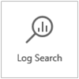
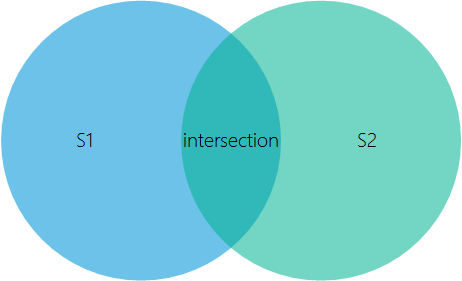
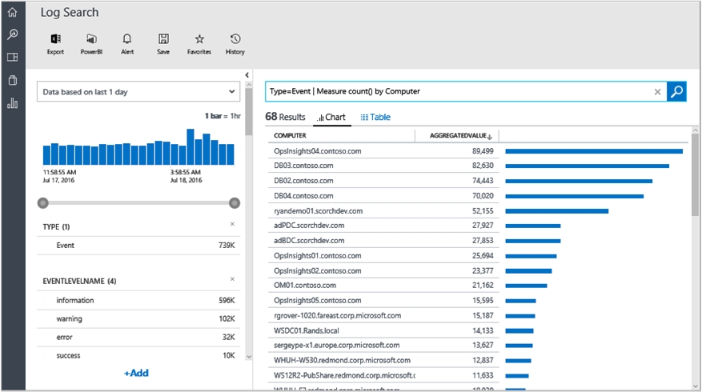
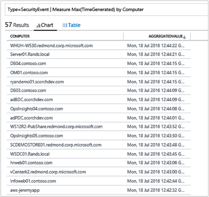

<properties
    pageTitle="Log Analytics Suchbegriffe anmelden | Microsoft Azure"
    description="Log-Suchvorgänge können Sie kombinieren und zu koordinieren Computerdaten aus mehreren Quellen in Ihrer Umgebung."
    services="log-analytics"
    documentationCenter=""
    authors="bandersmsft"
    manager="jwhit"
    editor=""/>

<tags
    ms.service="log-analytics"
    ms.workload="na"
    ms.tgt_pltfrm="na"
    ms.devlang="na"
    ms.topic="article"
    ms.date="10/10/2016"
    ms.author="banders"/>

# <a name="log-searches-in-log-analytics"></a>Log durchsucht Log Analytics

Das zentrale der Log Analytics ist die Suchfunktion Log wodurch Sie kombinieren und zu koordinieren Computerdaten aus mehreren Quellen in Ihrer Umgebung. Lösungen sind auch betrieben Log suchen, Kennzahlen zu schalten gedreht, um ein bestimmtes Problembereich.

Klicken Sie auf der Seite suchen können Sie eine Abfrage erstellen, und klicken Sie dann bei der Suche, Sie können die Ergebnisse mithilfe Filtern Vertriebsstrategie Steuerelemente. Sie können auch auf die Ergebnisse erweiterte Abfragen Transformation, Filter und Bericht erstellen.

Allgemeine Log Suchabfragen angezeigt werden, auf den meisten Seiten der Lösung. In der Verwaltungskonsole OMS können klicken Sie auf Kacheln oder einen Drilldown ausführen, um andere Elemente zum Anzeigen von Details zu dem Element mithilfe der Suchfunktion Log.

In diesem Lernprogramm werde wir durchgehen Beispiele die Grundlagen zum Deckblatt, wenn Sie Log Suche verwenden.

Wir beginnen mit einfachen und praktische Beispiele und erstellen dann wurden, damit Sie einen Überblick über die praktische Verwendung Fällen dazu, wie Sie die Syntax verwenden, um die gewünschte Einsichten aus den Daten extrahieren zugreifen können.

Nachdem Sie die Suche Techniken vertraut haben, können Sie das [Protokoll Analytics melden Sie sich suchen Bezug](log-analytics-search-reference.md)überprüfen.

## <a name="use-basic-filters"></a>Einfache Filter verwenden

Erstes wissen ist, dass im erste Teil einer Suche, bevor Sie eine Abfrage "|" senkrechten Strich Zeichen ist immer einen *Filter*. Sie können es vorstellen als eine WHERE-Klausel in TSQL – *welche* Teilmenge der Daten aus dem Datenspeicher OMS abrufen bestimmt wird. Suchen im Datenspeicher ist weitgehend über das Festlegen der Eigenschaften der Daten, die extrahiert werden sollen, damit es natürlich ist, dass eine Abfrage mit der WHERE-Klausel beginnen möchten.

Die grundlegendsten Filter, die Sie verwenden können, sind *Schlüsselwörter*, z. B. 'Fehler' oder 'Timeout' oder einen Computernamen an. Diese einfache Abfragetypen zurückgeben im Allgemeinen unterschiedliche Formen von Daten innerhalb der gleichen Resultset. Dies ist das Protokoll Analytics verfügt über verschiedene *Arten* von Daten in das System.


### <a name="to-conduct-a-simple-search"></a>Zum Durchführen einer einfachen Suche
1. Klicken Sie im Portal OMS auf **Log suchen**.  
    
2. Geben Sie im Feld Abfrage `error` , und klicken Sie dann auf **Suchen**.  
      
    Angenommen, die Abfrage für `error` in der folgenden Abbildung zurückgegeben 100.000 **Ereignis** Datensätze (erfassten durch Log-Management), 18 **ConfigurationAlert** Datensätze (generiert mit Konfiguration Bewertung) und 12 **ConfigurationChange** Datensätze (indem Sie die Änderung nachverfolgen aufgezeichnet).   
      

Diese Filter sind nicht wirklich Objekt Typen/Klassen. *Typ* ist nur eine Kategorie, eine Eigenschaft oder eine Zeichenfolge/Name/Kategorie, die einer bestimmten Datenmenge zugeordnet ist. Einige Dokumente im System als **Typ: ConfigurationAlert** markiert sind und andere **Typ: Perf**oder **Typ: Ereignis**markiert sind, usw.. Jedes Suchergebnis, Dokument, Datensatz oder Eintrag zeigt alle unformatierten Eigenschaften und ihren Werten für jede dieser Datenelementen, und können diese Feldnamen im Filter angeben, wenn Sie nur die Datensätze abgerufen werden sollen, in dem das Feld enthält, die angegebenen Wert.

*Eigentlich nur ein Feld aus, die alle Datensätze enthalten ist* , ist es nicht von einem anderen Feld. Dies wurde eingerichtet, basierend auf dem Wert im Feld Typ. Dieser Eintrag wird ein anderes Shape oder Formular vorhanden. Übrigen **Typ = Perf**, oder **Typ = Ereignis** wird auch die Syntax, die Sie benötigen, um Abfragen für Performance-Daten oder Ereignisse zu erfahren.

Sie können entweder ein Doppelpunkt (:) oder ein Gleichheitszeichen (=) hinter dem Feldnamen und vor dem Wert verwenden. **Ereignistyp:** und **Typ = Ereignis** sind dieselbe Bedeutung, Sie können auswählen, die Formatvorlage, die Sie bevorzugen.

Wenn also den Typ = Perf Einträge haben ein Feld namens 'CounterName', dann können Sie eine Abfrage ähnlich schreiben `Type=Perf CounterName="% Processor Time"`.

Dadurch erhalten nur die Leistungsdaten Sie, der Namen der Zähler "% Prozessor Time" ist.

### <a name="to-search-for-processor-time-performance-data"></a>So suchen Sie nach Prozessor Leistung Zeitdaten
- Geben Sie in das Suchfeld-Abfrage`Type=Perf CounterName="% Processor Time"`

Sie können auch nicht detaillierter und **InstanceName = _ 'Summe'** in der Abfrage, die ein Windows-Performance-Zähler ist. Sie können auch eine Facette und einen anderen **Feldwert:**auswählen. Der Filter wird automatisch den Filter in der Abfrage Leiste hinzugefügt. Sie können dies in der folgenden Abbildung sehen. Es wird gezeigt, wo durch Klicken hinzufügen **InstanceName: '_Total'** der Abfrage ohne eine Eingabe.


Die Abfrage wird jetzt`Type=Perf CounterName="% Processor Time" InstanceName="_Total"`

In diesem Beispiel müssen Sie nicht angeben **Typ = Perf** , um dieses Ergebnis zu gelangen. Da die Felder CounterName und InstanceName nur für Datensätze vom Typ vorhanden = Perf, die Abfrage ist es ausreichend, um die gleichen Ergebnisse als mehr, vorherigen zurückzukehren:
```
CounterName="% Processor Time" InstanceName="_Total"
```

Dies ist, da alle Filter in der Abfrage als in *und* miteinander ausgewertet werden. Effektiv, die mehrere Felder hinzufügen Sie das Kriterium erhalten Sie kleiner, weitere spezifische und raffiniertes Ergebnisse.

Beispiel: die Abfrage `Type=Event EventLog="Windows PowerShell"` unterscheidet sich von `Type=Event AND EventLog="Windows PowerShell"`. Es gibt alle Ereignisse, die angemeldet und aus dem Windows PowerShell-Ereignisprotokoll erfasst wurden. Wenn Sie einen Filter mehrfach hinzufügen, indem Sie die gleichen Vertriebsstrategie wiederholt auswählen und dann das Problem rein kosmetischen – ist es möglicherweise die Suchleiste Datenmüll, aber es immer noch die gleichen Ergebnisse zurück, da Operators und implizit immer vorhanden ist.

Sie können ganz einfach Operators und implizit mithilfe eines Operators nicht explizit umkehren. Beispiel:

`Type:Event NOT(EventLog:"Windows PowerShell")`oder einem entsprechenden `Type=Event EventLog!="Windows PowerShell"` Ertrag des alle Ereignisse für alle anderen Protokolle, die nicht das Windows PowerShell-Protokoll sind.

Oder Sie können andere booleschen Operator wie verwenden 'Oder'. Die folgende Abfrage gibt die Datensätze, die für die im Ereignisprotokoll entweder Anwendung oder System sind.

```
EventLog=Application OR EventLog=System
```

Verwenden die oben genannte Abfrage, erhalten Sie Einträge für beide Protokolle im gleichen Resultset können.

Jedoch, wenn Sie das oder die implizit verlassen und direkte entfernen, wird dann die folgende Abfrage nicht Ergebnisse, da es nicht ist ein Eintrag im Ereignisprotokoll, der beide Protokolle gehört. Nur eines der beiden Protokolle wurde jeden Eintrag im Ereignisprotokoll geschrieben.

```
EventLog=Application EventLog=System
```


## <a name="use-additional-filters"></a>Verwenden Sie zusätzliche Filter

Die folgende Abfrage gibt die Einträge für 2 Ereignisprotokollen für alle Computer, die Daten gesendet haben.

```
EventLog=Application OR EventLog=System
```


Auswählen eines der Felder oder Filter, Grenzen Sie die Abfrage an einem bestimmten Computer, alle anderen Einstellungen ausschließen. Die resultierende Abfrage sollte wie folgt aussehen.

```
EventLog=Application OR EventLog=System Computer=SERVER1.contoso.com
```

Die entspricht der folgenden aufgrund der implizit und.

```
EventLog=Application OR EventLog=System AND Computer=SERVER1.contoso.com
```

Jede Abfrage wird in der folgenden explizite Reihenfolge ausgewertet. Beachten Sie die Klammer ein.

```
(EventLog=Application OR EventLog=System) AND Computer=SERVER1.contoso.com
```

Wie das Feld Ereignisprotokoll können Abrufen von Daten nur für eine Reihe von bestimmten Computern hinzufügen oder. Beispiel:

```
(EventLog=Application OR EventLog=System) AND (Computer=SERVER1.contoso.com OR Computer=SERVER2.contoso.com OR Computer=SERVER3.contoso.com)
```

Auf ähnliche Weise dadurch die folgende Abfrage zurückgegeben **% CPU-Zeit** für nur die ausgewählten zwei Computer.

```
CounterName="% Processor Time"  AND InstanceName="_Total" AND (Computer=SERVER1.contoso.com OR Computer=SERVER2.contoso.com)
```


### <a name="boolean-operators"></a>Boolesche Operatoren
Mit Datetime und numerische Felder Durchsuchen für Werte *größer als*, mit *geringere als*, und *kleiner oder gleich*. Sie verwenden die einfache Operatoren wie >, <>; =, < =,! = in der Suchleiste Abfrage.


Sie können ein bestimmtes Ereignisprotokoll für einen bestimmten Zeitraum Abfragen. Letzten 24 Stunden wird beispielsweise mit den folgenden mnemonische Ausdruck ausgedrückt.

```
EventLog=System TimeGenerated>NOW-24HOURS
```


#### <a name="to-search-using-a-boolean-operator"></a>So suchen Sie mithilfe eines booleschen Operators
- Geben Sie in das Suchfeld-Abfrage`EventLog=System TimeGenerated>NOW-24HOURS"`  
    

Zwar Sie das Zeitintervall grafisch steuern können und den meisten Fällen möglicherweise Sie erledigen möchten, gibt es Vorteile, einschließlich einer Zeitfilter direkt in die Abfrage ein. Beispielsweise funktioniert dies hervorragend mit Dashboards, die Zeit für jede Kachel, unabhängig von der *globalen* Zeit Ansichtsauswahl auf der Dashboardseite überschrieben werden kann. Weitere Informationen finden Sie unter [Zeit Belange in Dashboard](http://cloudadministrator.wordpress.com/2014/10/19/system-center-advisor-restarted-time-matters-in-dashboard-part-6/).

Beachten Sie beim Filtern nach Zeiten Beachten Sie, dass Sie für den *Schnittpunkt* der beiden Ergebnisse zu erzielen Uhrzeitspanne: angegebenen im Portal OMS (S1) und dem in der Abfrage (S2) angegeben.



Dies bedeutet, wenn die Zeiträume, beispielsweise nicht im Portal OMS schneiden, in dem Sie **Diese Woche** und in der Abfrage, in dem Sie die **letzte Woche**definieren, klicken Sie dann keine Schnittmenge vorliegt und Sie erhalten keine Ergebnisse.

Vergleichsoperatoren, die für das Feld TimeGenerated verwendet sind auch in anderen Situationen nützlich. Beispielsweise mit numerische Felder.

Beispielsweise angegeben, dass Benachrichtigungen Konfigurations-Bewertung die folgenden schwere Werte haben:

- 0 = Informationen
- 1 = Warnung
- 2 = kritisch

Sie können für Warnung und kritisch Benachrichtigungen Abfragen und auch ausschließen informative Netzwerken mit der folgenden Abfrage:

```
Type=ConfigurationAlert  Severity>=1
```


Sie können auch den Bereichsabfragen verwenden. Dies bedeutet, dass Sie den Anfang und ein Ende Wertebereich in einer Sequenz bereitstellen können. Angenommen, Sie gegebenenfalls Ereignisse aus dem Ereignisprotokoll Operations Manager Wo finde ich die EventID größer als oder gleich 2100 aber nicht größer als 2199 würde dann die folgende Abfrage diese zurückgeben.

```
Type=Event EventLog="Operations Manager" EventID:[2100..2199]
```


>[AZURE.NOTE] Die Syntax der Bereich Sie verwenden müssen, ist das Trennzeichen der Doppelpunkt (:) Feldwert: und *nicht* das Gleichheitszeichen (=). Setzen Sie das oberen und unteren Ende des Bereichs in rechteckige Klammern gesetzt und mit zwei Punkten (.) zu trennen.

## <a name="manipulate-search-results"></a>Bearbeiten von Suchergebnissen

Wenn Sie nach Daten suchen, sollten Sie Ihre Suchabfrage verfeinern und einen guten Grad der Kontrolle über die Ergebnisse. Wenn die Ergebnisse abgerufen werden, können Sie die Befehle um Formen anwenden.

Führen Sie die Befehle in Log Analytics Suchbegriffe *müssen* nach dem vertikale Pipe-Zeichen (|). Ein Filter muss immer im ersten Teil einer Abfragezeichenfolge. Der Datenmenge, die Sie beim Arbeiten mit definiert und dann "leitet" Diese Ergebnisse in einen Befehl. Die Pipe können dann weitere Befehle hinzufügen. Dies ist der Windows PowerShell-Verkaufspipeline grob ähnelt.

Im Allgemeinen versucht die Sprache für die Suche Log Analytics folgen PowerShell-Formatvorlagen und Richtlinien, ähnlich wie die IT-Experten wird und der Kurve Learning zu erleichtern.

Befehle haben die Namen der Verben, sodass Sie einfach erkennen können, welche Aufgaben sie ausführen.  

### <a name="sort"></a>Sortieren

Der Befehl ' Sortieren ' können Sie die Sortierreihenfolge von einem oder mehreren Feldern festlegen. Auch wenn Sie es, standardmäßig verwendet werden, wird eine Uhrzeit absteigender Reihenfolge erzwungen. Die letzte Ergebnisse sind immer am oberen Rand der Suchergebnisse. Dies bedeutet, dass beim Ausführen einer Suche mit `Type=Event EventID=1234` ist was Sie wirklich ausgeführt wird:

```
Type=Event EventID=1234 **| Sort TimeGenerated desc**
```

Dies ist, da es sich um den Typ der Benutzeroberfläche handelt, die Sie in Protokollen vertraut sind. Angenommen, in der Windows-Ereignisanzeige.

Sortieren können Sie die Weise ändern, die Ergebnisse zurückgegeben werden. Die folgenden Beispiele zeigen, wie dies funktioniert.

```
Type=Event EventID=1234 | Sort TimeGenerated asc
```

```
Type=Event EventID=1234 | Sort Computer asc
```

```
Type=Event EventID=1234 | Sort Computer asc,TimeGenerated desc
```


Die einfache Beispiele oben zeigen, wie Befehle funktionieren – ändern Sie das Shape der Ergebnisse, die der Filter zurückgegeben.

### <a name="limit-and-top"></a>Oben und Grenzwert
Eine andere weniger bekannter Befehl ist begrenzt. Ein Verb PowerShell-ähnliche beträgt. Grenzwert ist mit der TOP-Befehl funktional identisch. Die folgenden Abfragen zurückgegeben die gleichen Ergebnisse.

```
Type=Event EventID=600 | Limit 1
```

```
Type=Event EventID=600 | Top 1
```


#### <a name="to-search-using-top"></a>So suchen Sie mithilfe der oben
- Geben Sie in das Suchfeld-Abfrage`Type=Event EventID=600 | Top 1`   
    

Im Bild oben, es gibt 358 Tausend Datensätze mit EventID = 600. Aspekte, die Felder und Filter auf der linken Seite anzeigen immer Informationen zu den Ergebnissen *durch den Filter Teil* der Abfrage, zurückgegeben wird, da das Webpart vor einem Pipezeichen ist. Im **Ergebnisbereich** gibt nur das neueste 1 Ergebnis, da der Beispielbefehl Legende geformt und die Ergebnisse transformiert.

### <a name="select"></a>Wählen Sie aus

SELECT-Befehl verhält sich wie Objekte in PowerShell auswählen. Es gibt gefilterten Ergebnisse, die nicht alle ihrer ursprünglichen Eigenschaften verfügen. In diesem Fall markiert nur die Eigenschaften, die Sie angeben.

#### <a name="to-run-a-search-using-the-select-command"></a>Eine Suche mit dem select-Befehl ausführen

1. Geben Sie im Suchfeld, `Type=Event` , und klicken Sie dann auf **Suchen**.
2. Klicken Sie auf **+ mehr anzeigen** in eines der Ergebnisse auf alle Eigenschaften anzeigen, die Ergebnisse enthalten.
3. Wählen Sie einige dieser explizit, und die Abfrage ändert sich in `Type=Event | Select Computer,EventID,RenderedDescription`.  
    

Hierbei handelt es sich um Befehl besonders hilfreich, wenn Sie steuern Ausgabe suchen, und wählen nur die Teile der Daten, die für Ihre Untersuchung, die unerheblich, die häufig den vollständigen Eintrag nicht möchten. Dies ist auch hilfreich, wenn Datensätze zu verschiedenen Arten *einige* gemeinsame Eigenschaften besitzen, aber nicht *Alle* ihre Eigenschaften werden allgemeine. Die, können Sie generieren Ausgaben, die eine Tabelle besser skalieren aussieht oder funktioniert auch, wenn in eine CSV-Datei exportiert, und klicken Sie dann in Excel bearbeitet.


## <a name="use-the-measure-command"></a>Verwenden Sie den Befehl measure

MEASURE ist eine der vielseitigste Befehle in Log Analytics suchen. Sie können Sie statistische *Funktionen* für Ihre Daten und aggregierte Ergebnisse gruppiert nach einem bestimmten Feld anwenden. Es gibt mehrere statistische Funktionen, die die Measure unterstützt.

### <a name="measure-count"></a>Messen count()

Die erste statistische Funktion zum Arbeiten mit, und eine der am einfachsten zu verstehen ist *der Count()-Funktion* .

Ergebnisse aus einem beliebigen Suchabfrage wie `Type=Event`, Filter die Abkürzung Aspekte auf der linken Seite der Suchergebnisse anzuzeigen. Die Filter anzeigen eine Verteilung der Werte durch ein bestimmtes Feld für die Ergebnisse in das Feld Suchen ausgeführt.


Angenommen, in der obigen Abbildung sehen Sie das Feld " **Computer** " und zeigt, die innerhalb der fast 739 Tausend Ereignisse in den Suchergebnissen 68 eindeutigen und distinct-Werte für das Feld **Computer** dieser Datensätze vorhanden sind. Die Kachel nur zeigt die oberen 5, die die am häufigsten verwendeten 5 Werte sind, die in den Feldern **Computer** geschrieben werden), um die Anzahl der Dokumente, den bestimmten Wert in das Feld enthalten, sortiert. In der Abbildung können Sie sehen, dass – zwischen diesen fast 369 Tausend Ereignisse – 90 Tausend kommen aus den Computer OpsInsights04.contoso.com 83 Tausend aus dem Computer DB03.contoso.com usw..


Was passiert, wenn Sie alle Werte anzeigen möchten, da die Kachel nur die oberen 5 nur angezeigt wird?

Dies ist der Befehl "Measure" mit der Count()-Funktion Möglichkeiten. Diese Funktion verwenden keine Parameter. Nur Geben Sie das Feld aus, nach dem Sie in diesem Fall durch – das Feld " **Computer** " gruppieren möchten:

`Type=Event | Measure count() by Computer`



**Computer** ist jedoch nur ein Feld verwendet *in* jedem Datenelement – verbindet keine relationalen Datenbanken vorhanden sind und Objekt vorhanden ist keine separates **Computer** an. Nur die Werte *in* den Daten kann beschreiben welche Entität, und eine Reihe von anderen Merkmale und Aspekte der Daten – daher der Ausdruck *Vertriebsstrategie*generiert. Sie können jedoch genauso gut nach andere Felder gruppieren. Da die ursprünglichen Ergebnisse von fast 739 Tausend Ereignissen, die an den Befehl Measure geleitet werden auch ein Feld namens **EventID**verfügen, können Sie das gleiche Verfahren zum Gruppieren, indem Sie das Feld aus, und erhalten die Anzahl der Ereignisse nach EventID anwenden:

```
Type=Event | Measure count() by EventID
```

Wählen Sie die erste Spalte, wenn Sie nicht interessiert, die Anzahl der ist-Datensätze, die einen bestimmten Wert enthalten, jedoch stattdessen Wenn Sie nur eine Liste der Werte selbst möchten, Sie eines Befehls *Wählen Sie* am Ende, und nur hinzufügen können:

```
Type=Event | Measure count() by EventID | Select EventID
```

Klicken Sie dann weitere komplizierte abgerufen und vor der Sortierung der Ergebnisse der Abfrage, oder Sie können nur die Spalten im Raster zu klicken.

```
Type=Event | Measure count() by EventID | Select EventID | Sort EventID asc
```

#### <a name="to-search-using-measure-count"></a>So suchen Sie mithilfe von Measure zählen

- Geben Sie in das Suchfeld-Abfrage`Type=Event | Measure count() by EventID`
- Anfügen von `| Select EventID` an das Ende der Abfrage.
- Schließlich Anfügen `| Sort EventID asc` an das Ende der Abfrage.


Es gibt einige wichtige Punkte beachten und hervorheben:

Zunächst sind die Ergebnisse, die angezeigt werden, nicht die ursprünglichen unformatierten Ergebnisse nicht mehr. Stattdessen sind sie aggregierte Ergebnisse – im Wesentlichen Gruppen von Ergebnissen. Dies ist kein Problem, aber sollten Sie wissen, dass Sie mit einem ganz anderes Shape Datenseite unterscheidet sich von der ursprünglichen unformatierten Form interaktiv sind, die als Ergebnis der Funktion Aggregation/statistische im laufenden Betrieb erstellt wird.

Zweites, gibt **Measure zählen** zurzeit nur die ersten 100 unterschiedliche Ergebnisse zurück. Diese Einschränkung gilt nicht für andere statistischen Funktionen. Ja, müssen Sie normalerweise präzisen Filter zuerst verwenden, um für bestimmte Elemente zu suchen, bevor Sie Measure count() anwenden.

## <a name="use-the-max-and-min-functions-with-the-measure-command"></a>Verwenden Sie die Funktionen Max und min mit dem Befehl measure

Es gibt verschiedene Szenarien, wobei **Measure Max()** und **Measure Min()** hilfreich sind. Jedoch, da jede Funktion gegenüberliegende ist voneinander, wir Max() veranschaulichen wird und Sie können auf Ihre eigenen mit Min() experimentieren.

Bei einer Abfrage für Sicherheitsereignisse haben sie eine **Ebene** -Eigenschaft, die unterschiedlich sein kann. Beispiel:

```
Type=SecurityEvent
```


Wenn Sie den höchsten Wert aller die Sicherheit anzeigen möchten können Ereignisse ausgehend von einem zentralen Computer, der Gruppe durch ein Feld, Sie

```
Type=ConfigurationAlert | Measure Max(Level) by Computer
```


Es wird anzeigen, für die Computer, die **Ebene** Datensätze aufwiesen, haben die meisten von ihnen abgleichen mindestens 8, viele eine Ebene von 16 hatte.

```
Type=ConfigurationAlert | Measure Max(Severity) by Computer
```



Diese Funktion funktioniert mit den Zahlen, aber es funktioniert auch mit DateTime-Felder. Es ist sinnvoll, für den letzten oder letzte Zeitstempel für alle Daten, die für jeden Computer indiziert überprüfen. Beispiel: Wann wurde das letzte Sicherheitsereignis gemeldet, für jeden Computer?

```
Type=ConfigurationChange | Measure Max(TimeGenerated) by Computer
```

## <a name="use-the-avg-function-with-the-measure-command"></a>Verwenden Sie die Funktion MITTELWERT, mit dem Befehl measure

Mit Measure verwendete die statistische Avg()-Funktion können Sie den Mittelwert der mittlere Wert für einige Feld und Gruppieren von Ergebnissen nach dem gleichen oder einem anderen Feld berechnen. Dies ist in vielen Fällen, wie z. B. Performance-Daten.

Wir beginnen mit Performance-Daten. Beachten Sie, dass OMS aktuell Leistungsindikatoren für Windows und Linux Maschinen erfasst.

Grundlegendste Abfrage wird verwendet um nach *allen* Leistungsdaten suchen:

```
Type=Perf
```


Das erste, was Sie sehen ist, dass Log Analytics Sie drei Perspektiven zeigt: Liste, die Sie anzeigt, die die Datensätze hinter der Diagramme; anzeigt Die Tabelle, die eine Tabellenansicht der Leistungsindikatordaten anzeigt; und Kriterien, die Diagramme für die Leistungsindikatoren anzeigt.

Im Bild oben gibt es zwei Sätze von markierte Felder, die Folgendes angeben:

- Die erste Gruppe identifiziert Windows Performance Zählername, Objektname und Instanznamen im Abfrage-Filter ein. Hierbei handelt es sich um die Felder, die Sie wahrscheinlich am häufigsten als Aspekte/Filter verwendet werden soll
- **Beträge** ist der tatsächliche Wert, der der Zähler. In diesem Beispiel wird der Wert *75*.
- **TimeGenerated** ist 12:51 im 24-Stunden-Zeitformat an.

Hier sind die Kriterien in einem Diagramm eine Ansicht aus.


Measure Avg() können Sie nach dem Lesebereich zu den Datensatz Perf-Shape, und Probleme erfahren Sie mehr über andere Suchtechniken diese Art von numerischen Daten, aggregieren.

Hier ist ein einfaches Beispiel:

```
Type=Perf  ObjectName:Processor  InstanceName:_Total  CounterName:"% Processor Time" | Measure Avg(CounterValue) by Computer
```


In diesem Beispiel wählen Sie die Gesamtzeit, die CPU-Leistung Zähler und den Mittelwert vom Computer aus. Wenn Sie die Ergebnisse in den letzten 6 Stunden beschränken möchten, können Sie Zeit Filter-Steuerelements verwenden oder in der Abfrage angeben:

```
Type=Perf  ObjectName:Processor  InstanceName:_Total  CounterName:"% Processor Time" TimeGenerated>NOW-6HOURS | Measure Avg(CounterValue) by Computer
```

### <a name="to-search-using-the-avg-function-with-the-measure-command"></a>So suchen Sie mit der Mittelwert-Funktion und den Befehl measure
- Geben Sie in das Suchfeld Abfrage `Type=Perf  ObjectName:Processor  InstanceName:_Total  CounterName:"% Processor Time" TimeGenerated>NOW-6HOURS | Measure Avg(CounterValue) by Computer`.


Sie können aggregieren und Koordinieren von Daten *auf* Computern. Angenommen Sie, dass eine Reihe von Hosts in einer Art von Farm, in dem jeder Knoten andere eine gleich ist und sie einfach führen Sie die gleichen eingeben der Arbeit sowie sollte werden ungefähr Lastenausgleich. Sie erhalten ihre Indikatoren Durchgang in einem mit den folgenden Abfragen und Mittelwerte für die gesamte Farm abrufen. Sie können beginnen, indem Sie auf den Computern durch das folgende Beispiel:

```
Type=Perf AND (Computer="AzureMktg01" OR Computer="AzureMktg02" OR Computer="AzureMktg03")
```

Jetzt, da Sie den Computer haben, Sie auch nur zwei Key Performance Indicators (KPIs) auswählen möchten: CPU-Auslastung und % freier Festplattenspeicher. Ja, wird dieser Teil der Abfrage:

```
Type=Perf InstanceName:_Total  ((ObjectName:Processor AND CounterName:"% Processor Time") OR (ObjectName="LogicalDisk" AND CounterName="% Free Space")) AND TimeGenerated>NOW-4HOURS
```

Jetzt können Sie auf Computer und Indikatoren durch das folgende Beispiel hinzufügen:

```
Type=Perf InstanceName:_Total  ((ObjectName:Processor AND CounterName:"% Processor Time") OR (ObjectName="LogicalDisk" AND CounterName="% Free Space")) AND TimeGenerated>NOW-4HOURS AND (Computer="AzureMktg01" OR Computer="AzureMktg02" OR Computer="AzureMktg03")
```

Da Sie einen sehr speziellen markierten haben, kann der **Measure Avg()** Befehl zurück den Mittelwert nicht vom Computer, aber in der Farm, einfach durch Gruppieren nach CounterName. Beispiel:

```
Type=Perf  InstanceName:_Total  ((ObjectName:Processor AND CounterName:"% Processor Time") OR (ObjectName="LogicalDisk" AND CounterName="% Free Space")) AND TimeGenerated>NOW-4HOURS AND (Computer="AzureMktg01" OR Computer="AzureMktg02" OR Computer="AzureMktg03") | Measure Avg(CounterValue) by CounterName
```

Dies bietet Ihnen eine hilfreiche Kompaktansicht von ein paar Ihre Umgebung hinsichtlich KPIs.


Sie können einfach die Suchabfrage in einem Dashboard verwenden. Beispielsweise konnte Sie die Suchabfrage speichern und erstellen Sie ein Dashboard es mit dem Namen *Web Farm KPIs*. Weitere Informationen zur Verwendung von Dashboards finden Sie unter [Erstellen eines benutzerdefinierten Dashboards in Log Analytics](log-analytics-dashboards.md).


### <a name="use-the-sum-function-with-the-measure-command"></a>Verwenden Sie die Summenfunktion mit dem Befehl measure

Die Summe-Funktion ähnelt anderen Funktionen des Befehls Measure. Sie können ein Beispiel dazu, wie Sie verwenden die Summenfunktion am [W3C IIS Protokolle Suchen in Microsoft Azure Betrieb Einsichten](http://blogs.msdn.com/b/dmuscett/archive/2014/09/20/w3c-iis-logs-search-in-system-center-advisor-limited-preview.aspx)anzeigen.

Sie können Max() und Min() mit Zahlen, Datum Zeiten und Textzeichenfolgen verwenden. Mit Textzeichenfolgen alphabetisch sind, und Sie erhalten Sie zuerst und Nachnamen aus.

Sie können keine jedoch Sum() mit einen anderen Wert als numerische Felder verwenden. Dies gilt auch für Avg().

### <a name="use-the-percentile-function-with-the-measure-command"></a>Verwenden Sie die Quantilfunktion mit dem Befehl measure

Das Quantil ähnelt Avg() und Sum(), die Sie nur für numerische Felder verwenden können. Sie können eine beliebige Quantil zwischen 1 und 99 auf ein numerisches Feld verwenden. Sie können auch sowohl **Quantil** und **Pct** Befehle verwenden. Es folgen einige Beispiele:  

```
Type:Perf CounterName:"DiskTransers/sec" |measure percentile95(CurrentValue) by Computer
```
```
Type:Perf ObjectName=LogicalDisk CounterName="Current Disk Queue Length" Computer="MyComputerName" | measure pct65(CurrentValue) by InstanceName
```

## <a name="use-the-where-command"></a>Verwenden die Where Befehl

Die, in der Befehl verhält sich wie ein Filter, jedoch können Sie in der Verkaufspipeline filtern und verfeinern aggregierte Ergebnisse, die durch einen Befehl Measure – hergestellt wurden angewendet werden im Gegensatz zu unformatierten Ergebnisse, die gefiltert werden am Anfang einer Abfrage.

Beispiel:

```
Type=Perf  CounterName="% Processor Time"  InstanceName="_Total" | Measure Avg(CounterValue) as AVGCPU by Computer
```

Sie können eine andere Pipe hinzufügen "|" Zeichen und der Where Befehl, um nur Computer erhalten, deren Mittelwert CPU mehr als 80 %, durch das folgende Beispiel ist:

```
Type=Perf  CounterName="% Processor Time"  InstanceName="_Total" | Measure Avg(CounterValue) as AVGCPU by Computer | Where AVGCPU>80
```

Mit Microsoft System Center - Vorgänge Manager vertraut sind können Sie sich die Where in Management Pack Ausdrücke Befehl vorstellen. Wenn im Beispiel eine Regel wurden, wäre im erste Teil der Abfrage der Datenquelle und der Where Befehl wäre die Bedingung Erkennung.

Können die Abfrage als Kachel in **Mein Dashboard**, als einen Monitor von Arten, um festzustellen, wenn der Computer CPUs überlastet sind. Weitere Informationen zu Dashboards finden Sie unter [Erstellen eines benutzerdefinierten Dashboards in Log Analytics](log-analytics-dashboards.md). Sie können auch erstellen und Verwenden von Dashboards mithilfe von der mobilen app. Weitere Informationen finden Sie unter [OMS Mobile-App ](http://www.windowsphone.com/en-us/store/app/operational-insights/4823b935-83ce-466c-82bb-bd0a3f58d865). In der die folgende Abbildung unten zwei Kacheln, können Sie sehen, der Monitor angezeigt, eine Liste und als Zahl. Im Wesentlichen, möchten Sie immer die Zahl 0 (null) und der Liste leer sein. Andernfalls gibt es eine Benachrichtigung Bedingung an. Bei Bedarf können Sie sie auf einen Blick auf welchen Computern unter Druck sind.


## <a name="use-the-in-operator"></a>Verwenden Sie den Operator in

Der Operator *IN* zusammen mit *NOT IN* ermöglicht Ihnen, Subsearches, verwenden, die durchsucht werden, die eine neue Suche als Argument enthalten. Sie sind in geschweifte innerhalb einer anderen *primären* oder *äußere* Suche enthalten. Das Ergebnis einer Subsearch, oft eine Liste der unterschiedliche Ergebnisse wird dann als Argument in die primäre Suche verwendet.

Subsearches können Sie eine Teilmenge der Daten entsprechen, dass Sie nicht beschreiben können direkt in einem Suchausdruck, aber die aus einer Suche generiert werden können. Beispielsweise, wenn Sie interessiert, verwenden eine Suche zum Auffinden von alle Ereignisse von *fehlenden Sicherheitsupdates Computern*befinden, müssen Sie eine Subsearch entwerfen, die zuerst die *fehlenden Sicherheitsupdates Computern* kennzeichnet, bevor Ereignisse, gehören die Hosts gefunden.

Ja, könnten Sie mit der folgenden Abfrage *Computern aktuell fehlenden erforderlichen Sicherheitsupdates* Ausdrücken:

```
Type:Update UpdateState=Needed Optional=false Classification="Security Updates" TimeGenerated>NOW-24HOURS | measure count() by Computer
```    


Nachdem Sie die Liste haben, können Sie die Suche als eine innere nach der Liste der Computer in eine äußere (primär) nach Feeds, die für Ereignisse für diesen Computern aussehen wird. Dazu die innere Suche in geschweifte Klammern einschließen und eingezogen ihre Ergebnisse als möglichen Werte für ein Filterfeld in das Feld mit dem Operator IN äußeren suchen. Die Abfrage würde so aus:

```
Type=Event Computer IN {Type:Update UpdateState=Needed Optional=false Classification="Security Updates" TimeGenerated>NOW-24HOURS | measure count() by Computer}
```


Beachten Sie auch Zeitfilter innere Suchen verwendet werden, da die System Update Bewertung eine Momentaufnahme der allen Computern innerhalb von 24 Stunden akzeptiert wird. Sie können die innere Abfrage mehr lightweight und präzise machen, indem Sie nur für einen Tag suchen. Die äußere Suche verwendet stattdessen die Uhrzeit Auswahl in der Benutzeroberfläche Abrufen von Ereignissen aus der letzten 7 Tage. Weitere Informationen zu Zeit Operatoren finden Sie unter [boolesche Operatoren](#boolean-operators) .

Da Sie wirklich nur verwenden der Ergebnisse der innere Suche als Filter für die äußere ein Wert, können Sie die Befehle in der äußeren suchen weiterhin anwenden. Beispielsweise können Sie weiterhin die oben aufgeführten Ereignisse mit einem anderen Measure Befehl gruppieren:

```
Type=Event Computer IN {Type:Update UpdateState=Needed Optional=false Classification="Security Updates" TimeGenerated>NOW-24HOURS | measure count() by Computer} | measure count() by Source
```


In der Regel sollen die innere Abfrage schnell ausgeführt werden, da das Protokoll Analytics Dienst angeordneten Zeitlimit dafür hat und eine kleine Menge von Ergebnissen zurück. Wenn die innere Abfrage mehrere Ergebnisse zurückgibt, ruft die Ergebnisliste die verursachen potenziell der äußeren Suche auf falsche Ergebnisse zurück abgeschnitten.

Eine weitere Regel ist, dass die innere Suche aktuell *aggregierte* Ergebnisse bereitstellt muss. Kurzum, muss es einen Befehl *Measure* enthalten. Sie können keine aktuell unformatierten Ergebnisse in eine äußere nach feed.

Darüber hinaus kann nur eine IN-Operator und es muss der letzte Filter in der Abfrage. Mehrere IN Operatoren nicht möglich, oder möchten – im Wesentlichen wird verhindert, dass mehrere Subsearches ausgeführt: wichtig ist, dass nur eine Sub/inneren die Suche für jede äußere Suchen möglich ist.

Auch innerhalb der genannten Einschränkungen IN ermöglicht vieler Arten von korrelierte Suchbegriffe, und ermöglicht es Ihnen, ähnlich wie z. B. Computern, Gruppen definieren Benutzer oder Dateien – versetzt die Felder in den Daten enthalten. Hier finden Sie weitere Beispiele:

**Alle Updates fehlen auf Computern, in denen Einstellung für automatische Updates deaktiviert ist**

```
Type=Update UpdateState=Needed Optional=false Computer IN {Type=UpdateSummary WindowsUpdateSetting=Manual | measure count() by Computer} | measure count() by KBID
```

**Alle Fehlerereignisse von Computern mit SQL Server (=, auf dem SQL-Bewertung ausgeführt hat)**

```
Type=Event EventLevelName=error Computer IN {Type=SQLAssessmentRecommendation | measure count() by Computer}
```

**Alle Sicherheitsereignisse von allen Computern, die Domänencontroller sind (= Ausführungsort AD Bewertung wurde)**

```
Type=SecurityEvent Computer IN { Type=ADAssessmentRecommendation | measure count() by Computer }
```

**Die anderen Konten auf dieselben Computer unter angemeldet, in dem Konto BACONLAND\jochan angemeldet hat?**

```
Type=SecurityEvent EventID=4624   Account!="BACONLAND\\jochan" Computer IN { Type=SecurityEvent EventID=4624   Account="BACONLAND\\jochan" | measure count() by Computer } | measure count() by Account
```

## <a name="use-the-distinct-command"></a>Verwenden Sie den Befehl distinct

Wie der Name sagt, stellt dieser Befehl eine Liste der distinct-Werte für ein Feld aus. Es ist erstaunlich einfach, aber sehr nützlich sein. Die gleiche konnte ebenfalls, wie unten dargestellt mit Measure count() Befehl erzielt werden.

```
Type=Event | Measure count() by Computer
```


Wenn Sie alle interessiert ist nur eine Liste der unterschiedlichen Werte und nicht die Anzahl von Dokumenten mit Werten, und klicken Sie dann auf DISTINCT bereitstellen kann jedoch optimiert und einfacher zu lesen Ausgabe und Standardsyntax wie unten gezeigt.

```
Type=Event | Distinct Computer
```


## <a name="use-the-countdistinct-function-with-the-measure-command"></a>Verwenden Sie die Countdistinct-Funktion mit dem Befehl measure
Die Countdistinct-Funktion zählt die Anzahl eindeutiger Werte innerhalb jeder Gruppe. Beispielsweise könnten sie zum zählen der Anzahl der eindeutigen Computer für die einzelnen reporting verwendet werden:

```
* | measure countdistinct(Computer) by Type
```


## <a name="use-the-measure-interval-command"></a>Verwenden Sie den Befehl Measure Intervall
Mit in der Nähe Datensammlung in Echtzeit Leistung, können Sie sammeln und Visualisieren alle Performance-Zähler in Log Analytics. Eingabe einfach auf die Abfrage, die **Typ: Perf** Tausende von metrischen Diagramme zurückgeben, basierend auf die Anzahl der Indikatoren und in Ihrer Umgebung Log Analytics-Servern. Mit metrischen Aggregation bei Bedarf können Sie prüfen Sie den übergeordneten Unternehmensdaten in Ihrer Umgebung zu einem hoher Ebene und Tiefer Einblick in detailliertere Daten nach Bedarf.

Angenommen, Sie möchten Sie wissen, was die durchschnittliche CPU über alle Ihre Computer ist. Der Mittelwert CPU für jeden Computer betrachtet hilfreich möglicherweise nicht da Ergebnisse möglicherweise werden geglättet erhalten. Um weitere Details zu suchen, können Sie aggregieren Ihrer Ergebnis in kleineren nacheinander Fenster aufteilt, und suchen Sie in eine Zeitreihe über verschiedene Dimensionen hinweg. Beispielsweise können Sie den stündlichen Mittelwert der CPU-Auslastung über alle Ihre Computer wie folgt ausführen:

```
Type:Perf CounterName="% Processor Time" InstanceName="_Total" | measure avg(CounterValue) by Computer Interval 1HOUR
```


Standardmäßig werden diese Ergebnisse in einem Liniendiagramm mit mehreren Datenreihen interaktive angezeigt.  Ein Diagramm dieses Typs unterstützt Reihe umschalten (mit y-Achse Skalierung), Zoomen und bewegen.  Die Tabelle Anzeigeoption steht weiterhin zum Anzeigen der unformatierten Daten, falls erforderlich.

Sie können auch nach anderen Feldern zu gruppieren. In diesem Beispiel verwende ich die alle % Indikatoren für einen bestimmten Computer betrachtet, und ich möchte wissen, was die stündlich 70 Quantile zwischen der jeder Zähler ist:

```
Type:Perf Computer=beefpatty4 CounterName=%* InstanceName=_Total | measure percentile70(CounterValue) by CounterName Interval 1HOUR
```
Eine ist zu beachten, dass diese Abfragen nicht auf Datenquellen beschränkt sind. Sie können diese auf einer Metrik anwenden. In diesem Beispiel verwende ich W3C IIS-Protokolle betrachten. Ich möchte wissen, was die maximale Zeit ist, die für ein Intervall 5 Minuten für die Verarbeitung jeder Anforderung benötigt wird:

```
Type:W3CIISLog | measure max(TimeTaken) by csMethod Interval 5MINUTES
```

### <a name="use-multiple-aggregates-in-one-query"></a>Verwenden Sie mehrere Aggregate in einer Abfrage
Sie können mehrere aggregieren Klauseln in einem Measure Befehl angeben.  Jeweils kann als Alias unabhängig sein.  Wenn sie einen Alias nicht angegeben, wird werden der resultierende Feldname, dass die Aggregatfunktion, die wurde (d. h. "avg(CounterValue)" für avg(CounterValue)). verwendet

 ```
Type=WireData | measure avg(ReceivedBytes), avg(SentBytes) by Direction interval 1hour
```


Hier ist ein weiteres Beispiel:
 ```
* | measure countdistinct(Computer) as Computers, count() as TotalRecords by Type
```


## <a name="next-steps"></a>Nächste Schritte

Weitere Informationen zu Log Suchbegriffe finden Sie unter:

- Verwenden Sie [benutzerdefinierte Felder in Log Analytics](log-analytics-custom-fields.md) um Log Suchbegriffe zu erweitern.
- Überprüfen Sie das [Protokoll Analytics melden Sie sich suchen Bezug](log-analytics-search-reference.md) zum Anzeigen aller Felder für die Suche und Aspekte in Log Analytics verfügbar.
