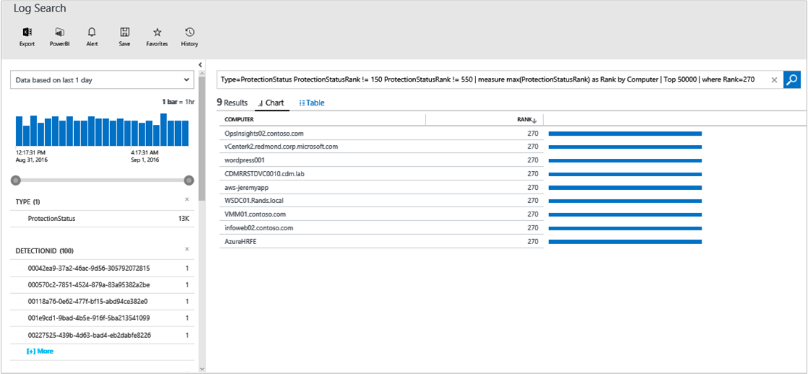

<properties
    pageTitle="Schadsoftware Bewertung-Lösung in Log Analytics | Microsoft Azure"
    description="Die Modul-Lösung können in Log Analytics Sie den Status des Schutzes Modul in Ihrer Infrastruktur Bericht."
    services="log-analytics"
    documentationCenter=""
    authors="bandersmsft"
    manager="jwhit"
    editor=""/>

<tags
    ms.service="log-analytics"
    ms.workload="na"
    ms.tgt_pltfrm="na"
    ms.devlang="na"
    ms.topic="article"
    ms.date="10/10/2016"
    ms.author="banders"/>

# Schadsoftware Bewertung-Lösung in Log Analytics

Die Modul-Lösung können in Log Analytics Sie den Status des Schutzes Modul in Ihrer Infrastruktur Bericht. Installieren der Lösung aktualisiert OMS-Agents und Basis Konfiguration für OMS. Modul Schutzstatus und erkannten Risiken auf den überwachten Servern gelesen wurden, und klicken Sie dann die Daten mit dem Log Analytics-Dienst in der Cloud für die Verarbeitung gesendet werden. Logik wird angewendet, um die empfangenen Daten und der Cloud-Dienst Einträge die Daten. Server mit erkannten Risiken und Server mit unzureichender Schutz werden im **Modul** Dashboard angezeigt. Die Informationen in dem **Modul** Dashboard verwenden, können Sie einen Plan zum Schutz auf die Server anwenden, die sie benötigen, identifizieren.

## Installieren und konfigurieren die Lösung
Verwenden Sie die folgende Informationen zum Installieren und konfigurieren die Lösung.

- Fügen Sie die Lösung Schadsoftware Bewertung in den OMS Arbeitsbereich mithilfe des Prozesses [Hinzufügen Log Analytics Lösungen aus dem Lösungskatalog](log-analytics-add-solutions.md)beschrieben.  Es ist keine weitere Konfiguration erforderlich.

## Verwenden von Modul

Melden Sie sich Analytics Berichte Modul Status für:

- Computern unter Windows Defender unter Windows 8, Windows 8.1, Windows 10 und Windows Server 2016 TP4 oder höher
- Windows-Sicherheitscenter (WSC) auf Windows 8, Windows 8.1, 10 für Windows, Windows Server 2016 TP4 oder höher
- Servern mit System Center Endpunkt Protection (v4.5.216 oder höher), Azure-virtuellen Computern mit der [Erweiterung Modul](http://go.microsoft.com/fwlink/?linkid=398023)und Windows-Tool zum Entfernen bösartiger Software (MSRT)  
- Mit Windows Management Framework 3 & #40; Servern oder höher & #41; [WMF 3.0](https://support.microsoft.com/kb/2506143), [WMF 4.0](http://www.microsoft.com/download/details.aspx?id=40855).

Die Lösung Modul meldet derzeit nicht auf:

- Server unter WindowsServer 2008 und frühere Versionen
- Web und Worker Rollen in Microsoft Azure
- 3rd Party Antimalware-Produkte

Sie können das Hinzufügen von neuen Features priorisieren durch Abstimmung oder Hinzufügen eines neuen Vorschlags auf unserer [Seite "Feedback"](http://feedback.azure.com/forums/267889-azure-operational-insights/category/88093-malware-assessment-solution)helfen.

## Einzelheiten zur Bewertung von Schadsoftware Datensammlung

Schadsoftware Bewertung sammelt Konfigurationsdaten, Metadaten und Bundesstaat-Daten, die über die Agents, die Sie aktiviert haben.

Die folgende Tabelle zeigt Datensammlungsmethoden und andere Details, wie Daten für Schadsoftware Bewertung erfasst werden.

| Plattform | Direkte Agent | SCOM agent | Azure-Speicher | SCOM erforderlich? | SCOM Agentdaten per Management Group unter gesendeten | Häufigkeit Collection |
|---|---|---|---|---|---|---|
|Windows||||            || stündlich|

Die folgende Tabelle zeigt Beispiele von Schadsoftware Bewertung gesammelten Datentypen:

|**Datentyp**|**(Felder)**|
|---|---|
|Konfiguration|"CustomerID", AgentID, %EntityID, ManagedTypeID, ManagedTypePropertyID, CurrentValue, ChangeDate|
|Metadaten|BaseManagedEntityId, ObjectStatus, OrganizationalUnit, ActiveDirectoryObjectSid, PhysicalProcessors, Netzwerkname, IP-Adresse, ForestDNSName, NetbiosComputerName, VirtualMachineName, LastInventoryDate, HostServerNameIsVirtualMachine, IP-Adresse, NetbiosDomainName, LogicalProcessors, DNS-Name, DisplayName, DomainDnsName, ActiveDirectorySite, ' PrincipalName ', OffsetInMinuteFromGreenwichTime|
|Bundesstaat|StateChangeEventId, State-ID, NewHealthState, OldHealthState, Kontext, TimeGenerated, TimeAdded, StateId2, BaseManagedEntityId, MonitorId, HealthState, LastModified, LastGreenAlertGenerated, DatabaseTimeModified|

## Überprüfen von Risiken für Server

Wenn Ihre Computer angemessen geschützt werden, wird aktive Risiken schnell durch die Software Modul unter Quarantäne gestellt und sollte selten als aktiven Risiken angezeigt werden. Überprüfen Sie deshalb diese beseitigt Risiken, die die Effektivität der Lösung Modul Bewertung im folgenden Beispielverfahren anzeigen aus.

1. Klicken Sie auf der Seite **Übersicht** auf die Kachel **Modul Bewertung** .  
    
2. Klicken Sie auf dem Dashboard **Modul** überprüfen Sie das Blade **Risiken erkannt** , und klicken Sie auf einen Servernamen mit Risiken diese beseitigt.  
    
3. Klicken Sie auf **der Seite** sehen Sie detaillierte Informationen über das Risiko unter Quarantäne. Neben **Bedrohung**klicken Sie auf **Ansicht**.  
    
4. Klicken Sie auf der Suchseite **die Schadsoftware Enzyklopädie** auf Schadsoftware Element, um weitere Details anzeigen.  
    
5. Überprüfen Sie auf der Seite Microsoft **Malware Protection Center** für das Element Schadsoftware Informationen im Abschnitt **Zusammenfassung** ein. In diesem Abschnitt beschrieben, wie die Software Modul erkennen kann und entfernen das Risiko und stellt Informationen wie Verfahren zum Erstellen von Schadsoftware möglicherweise auf Ihre Computer.  
    

## Prüfstatus Schutz

1. Überprüfen Sie auf dem Dashboard **Modul** das Blade **Schutzstatus** , und klicken Sie auf **keine Echtzeit-Schutz**.  
    
2. Suche zeigt eine Liste der Server ohne Schutz.  
    
3. Server ohne Echtzeit Schutz werden angezeigt.

Auf Computern, die nicht Antischadsoftware unterstützt haben, führen Sie werden als **kein Echtzeit Schutz**gemeldet.

## Nächste Schritte

- Verwenden Sie [Log Analytics Log durchsucht](log-analytics-log-searches.md) , um detaillierte Schadsoftware Bewertungsdaten anzuzeigen.
