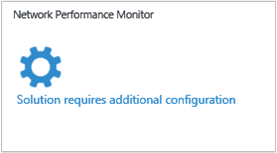
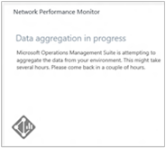
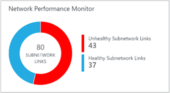
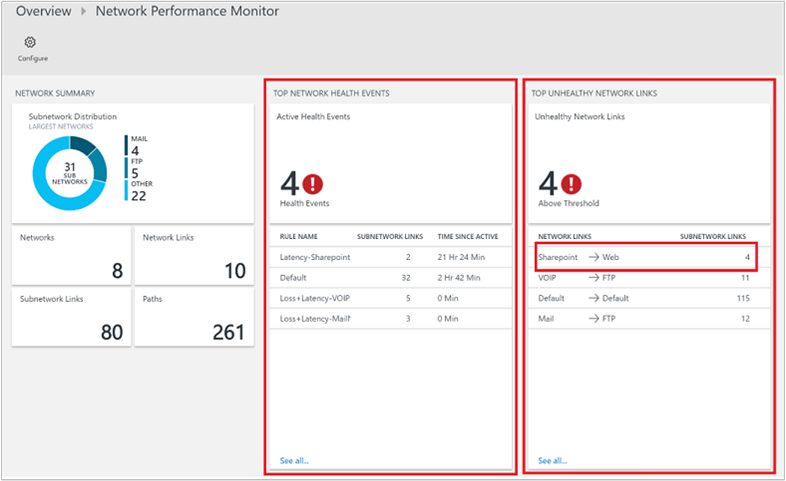

<properties
    pageTitle="Netzwerk-Performance Monitor-Lösung in OMS | Microsoft Azure"
    description="Netzwerk Performance Monitor können Sie die Leistung des Netzwerken in in der Nähe real-einmalig an überwachen erkennen und suchen Sie nach network Leistungsengpässe."
    services="log-analytics"
    documentationCenter=""
    authors="bandersmsft"
    manager="jwhit"
    editor=""/>

<tags
    ms.service="log-analytics"
    ms.workload="na"
    ms.tgt_pltfrm="na"
    ms.devlang="na"
    ms.topic="article"
    ms.date="07/28/2016"
    ms.author="banders"/>

# Netzwerk-Performance Monitor (Preview)-Lösung in OMS

>[AZURE.NOTE] Dies ist eine [Vorschau-Lösung](log-analytics-add-solutions.md#log-analytics-preview-solutions-and-features).

Dieses Dokument beschreibt, wie Netzwerk im Netzwerk Performance Monitor-Lösung in OMS, die Sie die Leistung des Netzwerken in in der Nähe real-einmalig an überwachen hilft erkennen und suchen Sie nach einzurichten Leistungsengpässe. Mit der Lösung Netzwerk Performance Monitor können Sie die Verlust und Wartezeit zwischen zwei Netzwerken, Subnetzen oder Servern überwachen. Netzwerk Performance Monitor erkennt Netzwerkproblemen wie Datenverkehr Blackholing, Weiterleitung Fehler und Probleme, die Überwachung Methoden herkömmlichen Netzwerk nicht erkennen können. Netzwerk Performance Monitor Benachrichtigungen generiert und als und für ein Schwellenwert für eine Verknüpfung im Netzwerk verletzt wird benachrichtigt. Diese Schwellenwerte können vom System automatisch Kenntnisse oder Sie können sie zum Verwenden von benutzerdefinierter Warnungsregeln konfigurieren. Netzwerk Performance Monitor: Damit ist sichergestellt schnell Erkennung von Netzwerkproblemen der Leistung und zur Lokalisierung der Ursache des Problems zu einem bestimmten Netzwerksegment oder Gerät.

Sie können mit dem Dashboard Lösung Netzwerkproblemen erkennen, die zusammengefasste Informationen zu Ihrem Netzwerk, einschließlich zuletzt verwendete Netzwerk Systemereignisse, Netzwerk fehlerhaften Verknüpfungen und Subnetz Links, die hoch Pakete verloren gehen und Wartezeit gegenüberliegende werden angezeigt. Sie können eine Verknüpfung im Netzwerk den aktuellen Status des Subnetz Links sowie Links zu Knoten anzeigen Drilldowns. Sie können auch die Trend im Verlauf hinsichtlich Verlust und Wartezeit auf Netzwerk, Subnetz und -Knoten Ebene anzeigen. Sie können vorübergehende Netzwerkprobleme erkennen, indem Sie zurückliegenden Trenddiagramme für Pakete verloren gehen und Wartezeit anzeigen, und suchen Sie Netzwerkengpässe auf einer Karte Suchtopologie. Das Diagramm interaktiv Suchtopologie können Sie die Abschnitte durch Abschnitts Netzwerk leitet visualisieren und bestimmen Sie die Ursache des Problems. Wie alle anderen Lösungen können Sie Log nach verschiedenen Analytics Anforderungen zum Erstellen benutzerdefinierter Berichte basierend auf von Netzwerk Performance Monitor gesammelten Daten verwenden.

Die Lösung verwendet synthetische Transaktionen als ein primären Verfahren zu Netzwerkfehlern erkennen. Ja, können Sie es ohne Berücksichtigung des Herstellers oder das Modell ein bestimmtes Netzwerk-Gerät verwenden. Es eignet sich für lokale, Cloud (IaaS) und hybridumgebungen. Die Lösung erkennt automatisch die Suchtopologie Netzwerk und verschiedene Pfade in Ihrem Netzwerk.

Überwachung typische Netzwerk-Produkte Fokussierung auf die Integrität des Netzwerks Gerät (Router, Schalter usw.) für die Überwachung jedoch bieten keine Einblicke in die tatsächliche Qualität der Netzwerkkonnektivität zwischen zwei Punkten Netzwerk Performance Monitor unterstützt.

### Mithilfe des eigenständigen Lösung

Wenn Sie die Qualität des Netzwerk-Verbindungen zwischen ihren kritischen Auslastung überwachen möchten, können Netzwerke, Rechenzentren oder Office-Websites, können Sie die Lösung Network Performance Monitor allein Sie Konnektivität zwischen überwachen:

- mehrere Rechenzentren oder Office-Websites, die mit einem öffentlichen oder privaten Netzwerk verbunden sind
- kritische Auslastung, die branchenanwendungen ausgeführt werden
- öffentlichen Cloud-Dienste wie Microsoft Azure oder Amazon Web Services (AWS) und lokale Netzwerke, wenn (Neuerung) zur Verfügung stehen Ihnen und Gateways, die so konfiguriert, dass zulassen der Kommunikation zwischen lokalen Netzwerke und Cloud Netzwerke
- Azure und lokale Netzwerke bei der Verwendung von Express-Routing

### Verwenden die Lösung mit anderen Netzwerk-tools

Wenn Sie eine branchenspezifische Anwendung überwachen möchten, können Sie die Lösung Network Performance Monitor als Companion Lösung für andere Netzwerk-Tools verwenden. Eine langsame kann dazu führen, dass langsam Applikationen und Netzwerk Performance Monitor helfen Ihnen die Anwendung Leistungsprobleme zu ermitteln, die von der zugrunde liegenden Netzwerke Probleme verursacht werden. Da die Lösung keine Zugriff auf Netzwerkgeräte erforderlich ist, muss der Anwendungsadministrator nicht verlassen Sie sich auf einem Netzwerke Team Angaben dazu, wie das Netzwerk Applikationen auswirkt.

Auch wenn Sie bereits in anderen Netzwerk-Überwachungstools investieren, ergänzen klicken Sie dann die Lösung diese Tools, da die meisten herkömmlichen Netzwerk Überwachung Solutions Einblicke in Performance-Werte wie Verlust und Wartezeit End-to-End-Netzwerk nicht bereitstellen.  Die Lösung Network Performance Monitor hilft Ihnen dieser Lücke zu füllen.

## Installieren und Konfigurieren von Agents für die Lösung

Verwenden von grundlegenden Vorgängen zum Installieren von Agents bei [Computern unter Windows Verbinden zur Log Analytics](log-analytics-windows-agents.md) und [Log Analytics Operations Manager verbinden](log-analytics-om-agents.md).

>[AZURE.NOTE]
Sie müssen mindestens 2 Agents installieren, um genügend Daten zu erkennen und Netzwerkressourcen überwachen. Andernfalls wird die Lösung in einem Konfigurieren von Zustand verbleiben, bis Sie installieren und Konfigurieren von zusätzlichen-Agents.

### WHERE zum Installieren der agents

Erwägen Sie vor der Installation von Agents der Suchtopologie Ihres Netzwerks und welche Teile des Netzwerks, das Sie überwachen möchten. Es empfiehlt sich, dass Sie mehr als ein Agent für jedes Subnetz installiert haben, die Sie überwachen möchten. Kurzum, für jedes Subnetz, das Sie überwachen möchten, wählen Sie zwei oder mehr Servern oder virtuellen Computern, und installieren Sie den Agent wurden.

Wenn Sie die Suchtopologie Ihres Netzwerks unsicher sind, installieren Sie die Agents auf Servern mit kritischen Auslastung, für die Leistung des Netzwerks überwachen möchten. Möglicherweise möchten Sie beispielsweise eine Verbindung zwischen einem Webserver und einem Server mit SQL Server verfolgen. In diesem Beispiel möchten Sie einen Agent auf beiden Servern installieren.

Agents überwachen Netzwerkkonnektivität (Links) zwischen Hosts – nicht die Hosts selbst. Um eine Verknüpfung im Netzwerk zu überwachen, müssen Sie Ja, Agents auf beide Endpunkte dieser Verknüpfung installieren.

### Konfigurieren von agents

Nachdem Sie Agents installiert haben, müssen Sie zum Öffnen von Firewallports für diesen Computern, um sicherzustellen, dass Agents kommunizieren können. Sie müssen zum Herunterladen, und führen Sie dann das [EnableRules.ps1 PowerShell-Skript](https://gallery.technet.microsoft.com/OMS-Network-Performance-04a66634) ohne Parameter in einem PowerShell-Fenster mit Administratorrechten

Das Skript wird erstellt im Netzwerk Performance Monitor erforderliche Registrierungsschlüssel und Windows-Firewall-Regeln zum Zulassen von Agents TCP-Verbindungen mit miteinander zu erstellen. Die Registrierungsschlüssel erstellt, das Skript angeben auch fest, ob die Protokolle Debuggen und den Pfad für die Datei Protokolle protokolliert. Darüber hinaus definiert den Agent TCP-Anschluss für die Kommunikation verwendet. Die Werte für diese Schlüssel werden automatisch durch das Skript festgelegt, sodass Sie diese Schlüssel nicht manuell ändern sollte.

Der Port standardmäßig geöffnet ist 8084. Sie können einen benutzerdefinierten Port verwenden, indem Sie den Parameter `portNumber` an das Skript. Denselben Port sollte jedoch auf allen Computern verwendet werden, auf dem das Skript ausgeführt wird.

>[AZURE.NOTE] Das Skript EnableRules.ps1 konfiguriert die Windows-Firewall-Regeln nur auf dem Computer, auf dem das Skript ausgeführt wird. Wenn Sie eine Netzwerkfirewall haben, sollten Sie sicherstellen, dass dies Datenverkehr für die Beantwortung von Netzwerk Performance Monitor TCP-zulässt.

## Konfigurieren die Lösung

Verwenden Sie die folgende Informationen zum Installieren und konfigurieren die Lösung.

1. Die Lösung Network Performance Monitor erhält Daten aus Computern unter Windows Server 2008 SP, 1 oder höher oder Windows 7 SP1 oder höher, die die gleichen Vorschriften als Microsoft Überwachung-Agent (MMA).
2. Fügen Sie die Lösung Network Performance Monitor in den OMS Arbeitsbereich mithilfe des Prozesses [Hinzufügen Log Analytics Lösungen aus dem Lösungskatalog](log-analytics-add-solutions.md)beschrieben.  
  
3. Im Portal OMS sehen Sie eine neue Kachel mit dem Titel **Netzwerk Performance Monitor** mit der Meldung *Lösung ist zusätzliche Konfiguration erforderlich*. Sie müssen so konfigurieren Sie die Lösung zum Hinzufügen von Netzwerken auf Grundlage Teilnetzwerken und Knoten, die durch Agents erkannt werden. Klicken Sie auf **Netzwerk Performance Monitor** zum Starten das Standardnetzwerk konfigurieren.  
  

### Konfigurieren Sie die Lösung mit einem Standardnetzwerk

Klicken Sie auf der Konfigurationsseite sehen Sie ein einzelnes Netzwerk mit dem Namen **Standard**. Wenn Sie alle Netzwerke definiert haben, werden alle automatisch erkannt Subnetze im Netzwerk Standard platziert.

Immer, wenn Sie über ein Netzwerk erstellen, ein Subnetz hinzugefügt und dieses Subnetz aus dem Standard-Netzwerk entfernt wird. Wenn Sie über ein Netzwerk löschen, werden alle entsprechenden Subnetzen automatisch mit dem Standard-Netzwerk zurückgegeben.

Kurzum, ist das Standard-Netzwerk den Container für alle Subnetze, die nicht in einem beliebigen Netzwerk User defined enthalten sind. Sie können nicht bearbeiten oder löschen das Standard-Netzwerk. Es wird immer im System bleibt. Allerdings können Sie beliebig viele Netzwerke benötigten erstellen.

In den meisten Fällen die Subnetze in Ihrer Organisation in mehr als einem Netzwerk angeordnet werden, und erstellen Sie ein oder mehrere Netzwerke, um Ihre Subnetze logisch zu gruppieren.

### Erstellen Sie neue Netzwerke

Ein Netzwerk im Netzwerk Performance Monitor ist ein Container für Subnetze. Sie können ein Netzwerk mit einem beliebigen Namen erstellen und Subnetze mit dem Netzwerk hinzufügen möchten. Beispielsweise können ein Netzwerk namens *Building1* erstellen und dann Subnetze hinzufügen, oder Sie können ein Netzwerk namens *DMZ* erstellen und Hinzufügen klicken Sie dann auf alle Subnetze zu demilitarisierte Zone zu diesem Netzwerk gehören.

#### So erstellen ein neues Netzwerk

1. Klicken Sie auf **Netzwerk hinzufügen** , und geben Sie dann den Netzwerknamen und die Beschreibung.
2.  Wählen Sie eine oder mehrere Subnets, und klicken Sie dann auf **Hinzufügen**.
3. Klicken Sie auf **Speichern** , um die Konfiguration zu speichern.  
  

### Warten auf Datenaggregation

Nachdem Sie die Konfiguration zum ersten Mal gespeichert haben, wird die Lösung gestartet, Sammeln von Netzwerk Paket Verlust und Wartezeit zwischen den Knoten, in dem Agents installiert sind. Dieser Vorgang kann Minuten dauern, manchmal über 30 Minuten. Während dieser Status zeigt die Kachel Netzwerk Performance Monitor in der Prozessübersicht Meldung mit dem Hinweis *Aggregation von Daten im Prozess*an.

Wenn die Daten hochgeladen wurde, sehen Sie die Network Performance Monitor aktualisiert Kachel mit Daten.

Klicken Sie auf die Kachel zum Anzeigen eines Dashboards Netzwerk Performance Monitor.

### Bearbeiten der Überwachung Einstellungen für Subnetze

Alle Subnetze dem mindestens ein Agent installiert wurde, werden auf der Registerkarte **Teilnetzwerken** auf der Konfigurationsseite aufgeführt.

#### So aktivieren oder deaktivieren die Überwachung für bestimmte Teilnetzwerken

1. Wählen Sie aus, oder deaktivieren Sie das Kontrollkästchen neben der **Subnetz-ID** und anschließend sicherstellen Sie, dass **für die Überwachung verwenden** ausgewählt oder gelöscht, je nach Bedarf ist. Sie können aktivieren oder Deaktivieren von mehreren Subnetzen. Wenn deaktiviert, werden nicht Teilnetzwerken überwacht, wie die Agents aktualisiert werden sollen, um andere Agents anpingen zu beenden.
2. Wählen Sie die Knoten, die Sie für ein bestimmtes Subnetz überwachen, durch die Subnetz aus der Liste auswählen und verschieben die erforderlichen Knoten zwischen den beiden Listen, die nicht überwachte und überwachte Knoten enthält möchten.
Sie können eine benutzerdefinierte **Beschreibung** der Subnetz bei Bedarf hinzufügen.
3. Klicken Sie auf **Speichern** , um die Konfiguration zu speichern.  
  

### Wählen Sie zum Überwachen der Knoten

Alle Knoten, die auf diese einen Agent installiert haben, werden auf der Registerkarte **Knoten** aufgeführt.

#### So aktivieren oder deaktivieren die Überwachung für Knoten

1. Aktivieren Sie oder deaktivieren Sie die Knoten, die Sie überwachen oder die Überwachung beenden möchten.
2. Klicken Sie auf **für die Überwachung verwenden**, oder deaktivieren Sie es, je nach Bedarf.
3. Klicken Sie auf **Speichern**.  
  

### Regeln für die Überwachung festlegen

Netzwerk Performance Monitor generiert Systemereignisse über die Konnektivität zwischen zwei Knoten oder Subnetz oder Netzwerk Links, wenn Sie ein Schwellenwert verletzt wird. Diese Schwellenwerte können vom System automatisch Kenntnisse oder Sie können diese benutzerdefinierte Warnungsregeln konfigurieren.

Wird die *Regel standardmäßig* vom System erstellt und es wird ein Ereignis Dienststatus bei jedem Verlust oder Wartezeit zwischen zwei beliebigen Netzwerke oder Subnetz Verletzung links den oberen Schwellenwert der System Kenntnisse erstellt. Sie können auswählen, um die Regel standardmäßig deaktiviert und erstellen benutzerdefinierte Regeln für die Überwachung

#### Zum Erstellen von benutzerdefinierter Regeln für die Überwachung

1. Klicken Sie auf der Registerkarte **Monitor** auf **Regel hinzufügen** , und geben Sie die Regelname und Beschreibung.
2. Wählen Sie die Kombination von Netzwerk- oder Subnetz Links zu überwachen aus den Listen aus.
3. Wählen Sie zuerst das Netzwerk, in dem die erste Subnetz/s relevante enthalten ist, aus Netzwerk, und wählen Sie dann aus der entsprechenden Subnetz Dropdown-Liste der Subnetz/s.
Wählen Sie **Alle Teilnetzwerken** , wenn Sie alle Teilnetzwerken in einem Netzwerklink überwachen möchten. Wählen Sie die anderen Subnetz/s relevante auf ähnliche Weise aus. Und klicken Sie auf **Ausnahme hinzufügen** , um die Überwachung für bestimmte Subnetz Links aus der vorgenommenen Auswahl ausschließen.
4. Wenn Sie nicht Systemereignisse für die Elemente, die Sie ausgewählt haben, erstellen möchten, deaktivieren Sie dann **Dienststatus auf die Links verdeckt werden, indem Sie diese Regel für die Überwachung aktivieren**.
5. Wählen Sie die Bedingungen für die Überwachung aus.
Sie können benutzerdefinierte Schwellenwerte für Gesundheit Generieren von Ereignissen durch Eingeben der Schwellenwerte festlegen. Immer, wenn der Wert der Bedingung über den ausgewählten Schwellenwert für das ausgewählte Netzwerk/Subnetz Paar verläuft, wird ein Ereignis Gesundheit generiert.
6. Klicken Sie auf **Speichern** , um die Konfiguration zu speichern.  
  

## Einzelheiten zur Datensammlung

Netzwerk Performance Monitor verwendet TCP SYN-SYNACK-Bestätigung Handshake Pakete Verlust sammeln und Wartezeit Informationen und Traceroute dient auch zur Suchtopologie Informationen zu erhalten.

Die folgende Tabelle zeigt Datensammlungsmethoden und andere Details, wie Daten für Netzwerk Performance Monitor erfasst werden.

| Plattform | Direkte Agent | SCOM agent | Azure-Speicher | SCOM erforderlich? | SCOM Agentdaten per Management Group unter gesendeten | Häufigkeit Collection |
|---|---|---|---|---|---|---|
| Windows ||||            || TCP Handshakes gesendet werden alle 5 Sekunden, Daten alle 3 Minuten |

Die Lösung nutzt synthetische Transaktionen, die Integrität des Netzwerks bewerten. OMS-Agents installiert an verschiedenen Punkt in den Exchange TCP-Paketen miteinander und im Prozess, erfahren Schleife Zeit und Paket verloren gehen, sofern vorhanden. Jeder Agent führt regelmäßig auch eine Spur Routing dort zum Auffinden aller verschiedene Pfade im Netzwerk, die getestet werden müssen. Mit diesen Daten sind die Agents Möglichkeit im Netzwerkwartezeit und Paket Verlustzahlen abzuleiten. Die Tests werden alle fünf Sekunden wiederholt und Daten werden von den Agents vor dem Hochladen der Datei auf OMS für einen Zeitraum von drei Minuten aggregiert.

>[AZURE.NOTE] Obwohl Agents häufig kommunizieren, generieren sie während der Ausführung von die Tests nicht viele Netzwerkverkehr. Agents benötigen nur TCP SYN-SYNACK-Bestätigung Handshake Pakete den Verlust und Wartezeit – Pakete ausgetauscht werden keine Daten zu bestimmen. Während dieses Vorgangs Agents miteinander kommunizieren nur bei Bedarf, und der Agent Kommunikation Suchtopologie wurde optimiert, um den Netzwerkverkehr zu reduzieren.

## Verwenden die Lösung

In diesem Abschnitt wird erläutert, alle das Dashboard Funktionen und deren Verwendung.

### Übersicht über die Kachel der Lösung

Nachdem Sie die Lösung Network Performance Monitor aktiviert haben, bietet die Lösung Kachel auf der Seite Übersicht OMS einen schnellen Überblick über die Integrität des Netzwerks ein. Ein Ringdiagramm mit der Anzahl der fehlerfrei und fehlerhaften Subnetz Links angezeigt. Wenn Sie die Kachel klicken, wird das Lösung Dashboard geöffnet.

### Netzwerk Performance Monitor Lösung dashboard

Das **Netzwerk Zusammenfassung** Blade zeigt eine Zusammenfassung der Netzwerke und deren relative Größe. Daraufhin wird Kacheln mit der Gesamtzahl der Netzwerk-Links, Subnetz Links und Pfade im System (ein Pfad besteht aus zwei Hosts mit Agents und alle Abschnitte zwischen ihnen die IP-Adressen).

Das **Oberen Netzwerk Systemereignisse** Blade enthält eine Liste der zuletzt Systemereignisse und Benachrichtigungen in das System und die Uhrzeit, seit dem das Ereignis aktiv. Ein Ereignis Gesundheit oder eine Warnung wird ausgelöst, wenn die Pakete verloren gehen oder Wartezeit eines Links Netzwerk oder Subnetz einen Schwellenwert überschreitet.

Das Blade **Fehlerhaften Netzwerk-Links oben** zeigt eine Liste mit fehlerhaften Netzwerklinks. Dies sind die Netzwerklinks, die eine oder mehrere unerwünschten Gesundheit Ereignis im Moment dafür haben.

Die **Oberen Subnetz Links am häufigsten Verlust** und **Subnetz Verknüpfungen mit am häufigsten Wartezeit** Blades Anzeigen der obersten Subnetz Hyperlinks nach Paketverlust und Subnetz oben Links von der Wartezeit. Wartezeit oder einige Zeitspanne Pakete verloren gehen möglicherweise auf bestimmte Netzwerklinks erwartet werden. Solche Links in der obersten zehn Listen angezeigt, aber nicht fehlerhaft gekennzeichnet.

Das **Allgemeine Abfragen** Blade enthält eine Reihe von Suchabfragen, die unformatierten Daten direkt Überwachung Netzwerk abgerufen werden. Sie können diese Abfragen als Ausgangspunkt verwenden, für Ihre eigenen Abfragen für benutzerdefinierte Berichte erstellen.

### Drilldown für Tiefe

Sie können verschiedene Verknüpfungen auf die Lösung Dashboard zu Drilldown tieferen in einen beliebigen Bereich relevante klicken. Beispielsweise, wenn eine Warnung oder einer Verknüpfung mit fehlerhaften Netzwerk angezeigt, auf dem Dashboard angezeigt wird, können Sie es weiter untersuchen klicken. Eine Seite wird geöffnet werden, die die Subnetz Links für den Netzwerklink bestimmten Listen. Sie werden möglicherweise den Verlust, Wartezeit und Gesundheit Status der einzelnen Subnetz links und schnell finden Sie heraus, welche Links Subnetz das Problem verursacht werden. Anschließend können Sie die **Ansicht Knoten Links** , um die Knoten Links für die Verknüpfung fehlerhaft Subnetz finden Sie unter klicken. Klicken Sie dann können Sie einzelne-Knoten Links angezeigt und den fehlerhaften Knoten Links finden.

Sie können die **Ansicht Suchtopologie** zum Anzeigen der Suchtopologie Abschnitte durch Abschnitts von der leitet zwischen den Quell- und Zielfelder Knoten klicken. Die fehlerhaften weitergeleitet oder Abschnitte werden in Rot angezeigt, damit Sie schnell das Problem auf einen bestimmten Teil des Netzwerks erkennen.

#### Trenddiagramme

Bei jeder Ebene, die Sie Drilldowns, kann den Trend des Verlust und Wartezeit für eine Verknüpfung im Netzwerk angezeigt. Trenddiagramme werden auch für Subnetz und Knoten Links zur Verfügung. Sie können das Zeitintervall für das Diagramm gezeichnet mithilfe des Steuerelements für die am oberen Rand des Diagramms ändern.

Trenddiagramme zeigen, eine Perspektive der Historie der Leistung von einer Verknüpfung im Netzwerk. Einige Netzwerkproblemen sind vorübergehend Natur und wäre unübersichtlich werden, indem Sie nur den aktuellen Status des Netzwerks betrachtet abzufangen. Dies liegt daran Probleme schnell bereitstellen und verschwindet, bevor jemand bemerkt nur, wenn Sie zu einem späteren Zeitpunkt erneut angezeigt wird, können. Solche vorübergehende Probleme können auch für Administratoren schwierig sein, da die Probleme häufig Fläche Unerklärliches zunehmender Anwendung Antwort Zeitpunkt, selbst wenn alle Komponenten der Anwendung reibungslos angezeigt.

Sie können diese Arten von Problemen einfach erkennen, indem Sie ein Trend Diagramm, in dem das Problem im Netzwerkwartezeit oder Pakete verloren gehen als eine plötzlich Sammlung angezeigt wird.

#### Abschnitte durch Abschnitts Suchtopologie Karte

Netzwerk Performance Monitor zeigt Ihnen die Suchtopologie Abschnitte durch Abschnitts des leitet zwischen zwei Knoten in einer interaktiven Suchtopologie Zuordnung. Sie können die Suchtopologie Karte anzeigen, indem Sie einen Link Knoten auswählen und dann auf **Ansicht Suchtopologie**. Darüber hinaus können Sie die Suchtopologie Karte anzeigen, indem Sie auf die Kachel der **Pfade** auf dem Dashboard. Wenn Sie auf dem Dashboard **Pfade** klicken, müssen Sie im linken Bereich die Quell- und Zielfelder Knoten auswählen, und klicken Sie dann auf **Zeichnung** , um die Arbeitspläne zwischen den beiden Knoten darstellen.

Die Suchtopologie Karte zeigt an, wie viele leitet zwischen den beiden Knoten und was sind Pfade die Datenpakete ausführen. Netzwerk Leistungsengpässe sind auf der Karte Suchtopologie rot gekennzeichnet. Sie können eine fehlerhafte Netzwerkverbindung oder fehlerhafte Netzwerkgeräte durch rote farbigen Elemente auf der Karte Suchtopologie betrachtet finden.

Wenn Sie einen Knoten oder Hover über die Schaltfläche auf der Karte Suchtopologie klicken, sehen Sie die Eigenschaften des Knotens wie FQDN und die IP-Adresse. Klicken Sie auf einen Abschnitt, um anzuzeigen, dass sie die IP-Adresse ist. Sie können bestimmte leitet hervorheben, indem deaktivieren und dann auswählen nur die weitergeleitet, die auf der Karte hervorgehoben werden sollen. Sie können aus der Suchtopologie Karte vergrößert oder mithilfe des Mausrads.

Beachten Sie, dass der Suchtopologie in der Karte dargestellt Schicht 3 Suchtopologie ist und nicht, Layer 2-Geräte und Verbindungen enthalten.

#### Fehlerstrukturanalyse-Lokalisierung

Network Performance Monitor ist die Netzwerkengpässen ohne Herstellen einer Verbindung mit anderen Geräten im Netzwerk finden können. Basierend auf den Daten, die es aus dem Netzwerk und durch Anwenden einer erweiterte Algorithmen im Netzwerk Diagramm sammelt, macht Netzwerk Performance Monitor einer Schätzung probabilistisch Teile des Netzwerks, die wahrscheinlich die Ursache des Problems.

Dieser Ansatz ist hilfreich, die Netzwerkengpässen festzustellen, wenn der Zugriff auf Abschnitte nicht verfügbar ist, da alle Daten aus der Netzwerkgeräte wie Router oder Schalter zusammengestellt werden nicht erforderlich. Dies ist auch hilfreich, wenn die Abschnitte zwischen zwei Knoten nicht in Ihrer Verwaltungsfunktionen sind. Beispielsweise möglicherweise die Abschnitte ISP-Routern.

### Melden Sie sich Analytics-Suche

Alle Daten, die verfügbar gemachten grafisch durch das Netzwerk Performance Monitor Dashboard und Drilldown-Seiten steht auch systembedingt in Log Analytics suchen. Sie können die Daten mithilfe der Suche Abfragesprache Abfragen und benutzerdefinierte Berichte erstellen, indem Sie die Daten in Excel oder PowerBI exportieren. **Allgemeine Abfragen** vorher in dem Dashboard enthält einige hilfreiche Abfragen, die Sie als Ausgangspunkt zum Erstellen Ihrer eigenen Abfragen und Berichten verwenden können.

## Ermitteln Sie die Ursache einer Warnung Dienststatus

Jetzt, da Sie über Netzwerk Performance Monitor gelesen haben, sehen wir uns eine einfache Untersuchung in die Ursache für ein Ereignis Dienststatus.

1. Klicken Sie auf der Seite Übersicht erhalten Sie eine schnelle Übersicht über den Zustand Ihres Netzwerks verwenden, indem Sie die Kachel **Netzwerk Performance Monitor** beobachten. Beachten Sie, dass aus die zu überwachenden 80 Teilnetzwerken Verknüpfungen 43 fehlerhaft sind. Dies garantiert Untersuchung. Klicken Sie auf die Kachel zum Anzeigen eines Dashboards Lösung.  
  

2. Im folgenden Beispielbild sehen Sie sich, dass es gibt 4 Systemereignisse aktuell und 4 Netzwerklinks aus, die Probleme aufweisen. Entscheiden Sie sich das Problem untersuchen, und klicken auf der **Sharepoint-Web-** Netzwerklink, um herauszufinden, die die Ursache des Problems.  
  

3. Die Drilldown-Seite zeigt alle Subnetz Links in **Sharepoint-Web** -Netzwerk-Link an. Sie sehen, dass für beide Subnetz Links, die Wartezeit den Schwellenwert für den Netzwerklink fehlerhaften ausführenden überschritten hat. Sie können auch die Trends Wartezeit der beiden Subnetz Links anzeigen. Können die Uhrzeit Auswahl Steuerelement in dem Diagramm auf die erforderlichen Zeitraums vereinfacht. Sie können die Uhrzeit des Tages anzeigen, wenn Wartezeit deren Höchstwert erreicht ist. Sie können die Protokolle für dieses Zeitraums das Problem untersuchen später suchen. Klicken Sie auf **Ansicht Knoten Links** zu weiteren Drilldown.  
  

4.  Ähnlich wie der vorherige Seite, Listen die Drilldown-Seite für den Link bestimmten Subnetz nach unten seine enthaltenen Knoten Links ein. Sie können ähnliche Aktionen ausführen können, wie im vorherigen Schritt. Klicken Sie auf **Ansicht Suchtopologie** zum Anzeigen der Suchtopologie zwischen den Knoten 2.  
  

5. Alle Pfade zwischen den 2 ausgewählten Knoten sind in der Suchtopologie Karte dargestellt. Sie können die Abschnitte durch Abschnitts Suchtopologie der leitet zwischen zwei Knoten in der Suchtopologie Karte darstellen. Erhalten Sie ein Bild löschen vorhanden, wie viele leitet zwischen den beiden Knoten und was sein Pfade die Datenpakete abzubrechen. Rote Farbe sind Leistungsengpässe Netzwerk gekennzeichnet. Sie können eine fehlerhafte Netzwerkverbindung oder fehlerhafte Netzwerkgeräte durch rote farbigen Elemente auf der Karte Suchtopologie betrachtet finden.  
  

6. Im Bereich **Der Pfad-Details** können verloren gehen, Wartezeit und die Anzahl der Abschnitte in jeder Pfad überprüft werden. In diesem Beispiel können Sie sehen, dass 3 fehlerhaften Pfade vorhanden sind, wie Sie im Bereich erwähnt. Verwenden Sie die Bildlaufleiste, um die Details dieser fehlerhafte Pfade anzuzeigen.  Verwenden Sie die Kontrollkästchen, um einen der Pfade aktivieren, damit der Suchtopologie für nur einen Pfad gezeichnet wird. Sie können das Mausrad zum Vergrößern oder Verkleinern der Suchtopologie Karte verwenden.

  In der unter dem Bild können Sie klar die Ursache der Problembereiche zum gewünschten Abschnitt des Netzwerks anzeigen, indem Sie die Pfade und Abschnitte in rote Farbe ansehen. Durch Klicken auf einen Knoten in der Suchtopologie Karte den Knoten den vollqualifizierten Domänennamen, einschließlich die Eigenschaften angezeigt und IP-Adresse. Indem Sie auf einen Abschnitt zeigt die IP-Adresse für den Abschnitt.  
  

## Nächste Schritte

- [Suchen von Protokollen](log-analytics-log-searches.md) detaillierte Netzwerk Leistung von Datensätzen anzeigen.
