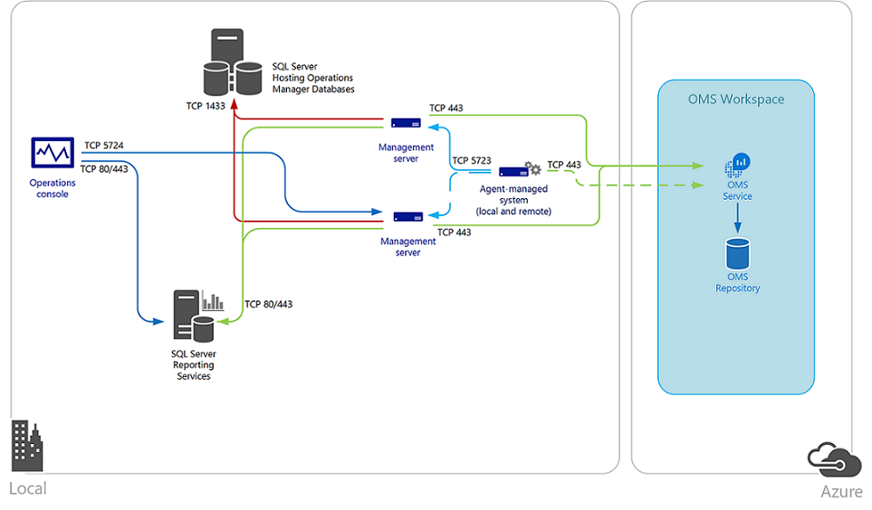

<properties
    pageTitle="Herstellen einer Verbindung Log Analytics mit Operations Manager | Microsoft Azure"
    description="Zum Verwalten Ihrer vorhandenen Investition in System Center Operations Manager und erweiterte Funktionen mit Log Analytics verwenden, können Sie mit dem Arbeitsbereich OMS Operations Manager integrieren."
    services="log-analytics"
    documentationCenter=""
    authors="MGoedtel"
    manager="jwhit"
    editor=""/>

<tags
    ms.service="log-analytics"
    ms.workload="na"
    ms.tgt_pltfrm="na"
    ms.devlang="na"
    ms.topic="article"
    ms.date="09/08/2016"
    ms.author="magoedte"/>

# <a name="connect-operations-manager-to-log-analytics"></a>Herstellen einer Verbindung Log Analytics mit Operations Manager

Zum Verwalten Ihrer vorhandenen Investition in System Center Operations Manager und erweiterte Funktionen mit Log Analytics verwenden, können Sie mit dem Arbeitsbereich OMS Operations Manager integrieren.  Auf diese Weise können Sie die Verkaufschancen OMS nutzen, verschiebe Operations Manager zu verwenden:

- Fortzusetzen Sie die Integrität Ihrer IT-Dienste mit Operations Manager Überwachung
- Aufrechterhalten der Integration mit Ihrem ITSM Lösungen Vorfall und Problem Management unterstützen
- Verwalten des Lebenszyklus von Agents auf lokale und öffentliche Cloud IaaS virtuellen Computern, die Sie mit Operations Manager überwachen bereitgestellt

Integration mit System Center Operations Manager bereichert strategische Vorgänge Dienst durch Nutzung der Geschwindigkeit und Effizienz des OMS in sammeln, speichern und Analysieren von Daten aus Operations Manager.  OMS hilft zu koordinieren und rechts die Fehlern des Probleme identifizieren und Einbinden von Reoccurrences zur Unterstützung der vorhandenen Problem Management Prozess arbeiten.   Die Flexibilität der Leistung, Ereignis und benachrichtigen Daten mit Rich-Dashboards und reporting-Funktionen für diese Daten auf sinnvolle Weise verfügbar machen untersuchen Suchmaschine veranschaulicht die Stärke, die OMS bringt in Webabfragen Operations Manager.

Die mit dem Management Group unter Operations Manager-Agents Sammeln von Daten von Ihren Servern basierend auf dem Log Analytics Datenquellen und Lösungen, die Sie in Ihrem Abonnement OMS aktiviert haben.  Je nach der Lösung aktiviert haben, Daten aus den folgenden Lösungsvorschlägen entweder gesendet werden direkt aus einem Operations Manager Management Server an den OMS-Webdienst oder aufgrund der Lautstärke auf dem System Agents verwalteten gesammelten Daten direkt vom Agent zum OMS-Webdienst gesendet werden. Der Server Management direkt Daten OMS den Webdienst OMS weiterleitet, wird es niemals zur Datenbank "OperationsManagerMonitoring" oder OperationsManagerDW geschrieben.  Wenn ein Management Server Connectivity mit dem OMS-Webdienst verliert, speichert die Daten, lokal bis Kommunikation mit OMS erneut hergestellt wird.  Wenn der Server Management aufgrund der geplanten Wartung oder ungeplanten Ausfall offline ist, wird ein anderes Management Server in der Gruppe Management Verbindungen mit OMS fortsetzen.  

Das folgende Diagramm enthält die Verbindung zwischen der Server für die Verwaltung und Agents in einer Management Group unter System Center Operations Manager und OMS, einschließlich der Richtung und Ports.   



## <a name="system-requirements"></a>Systemanforderungen
Überprüfen Sie bevor Sie beginnen die folgenden Details zu überprüfen, ob Sie Voraussetzungen entsprechen.

- OMS unterstützt nur Operations Manager 2012 SP1 UR6 und höher, und Operations Manager 2012 R2 UR2 und höher.  Proxy-Unterstützung wurde in Operations Manager 2012 SP1 UR7 und Operations Manager 2012 R2 UR3 hinzugefügt.
- Alle Operations Manager-Agents müssen minimale Unterstützung erfüllen. Sicherstellen Sie, dass Agents auf den minimalen aktualisieren, andernfalls Windows-Agent Datenverkehr fehl schlägt und viele Fehler möglicherweise im Ereignisprotokoll Operations Manager ausfüllen.
- Ein OMS-Abonnement.  Weitere Informationen finden Sie in [Erste Schritte mit Log Analytics](log-analytics-get-started.md).

## <a name="connecting-operations-manager-to-oms"></a>Herstellen einer Verbindung Operations Manager zu OMS
Führen Sie die folgenden Reihe von vor, um die Operations Manager Management Gruppe für die Verbindung zu einem Ihrer Arbeitsbereiche OMS konfigurieren.

1. Wählen Sie in der Verwaltungskonsole Operations Manager **Administration** Arbeitsbereich ein.
2. Erweitern Sie den Knoten Vorgänge Management Suite aus, und klicken Sie auf **Verbindung**.
3. Klicken Sie auf den Link **zu Vorgängen Management Suite registrieren** .
4. Klicken Sie auf die **Vorgänge Management Suite Onboarding-Assistenten: Authentifizierung** Seite, geben Sie die e-Mail-Adresse oder Telefonnummer und das Kennwort für das Administratorkonto, die mit Ihrem OMS-Abonnement verknüpft ist, und klicken Sie auf **Anmelden**.
5. Nachdem Sie erfolgreich, aktivieren authentifiziert wurden der **Vorgänge Management Suite Onboarding-Assistenten: Wählen Sie Arbeitsbereich** Seite, Sie werden aufgefordert, um den Arbeitsbereich OMS auszuwählen.  Wenn Sie mehr als einen Arbeitsbereich verfügen, wählen Sie den Arbeitsbereich zu registrieren, mit der Operations Manager Management Group unter in der Dropdown-Liste aus, und klicken Sie dann auf **Weiter**.

    >[AZURE.NOTE] Operations Manager unterstützt nur eine OMS Arbeitsbereich nacheinander aus. Die Verbindung und den Computer, die mit dem vorherigen Arbeitsbereich zu OMS registriert wurden, werden von OMS entfernt.

6. Klicken Sie auf die **Vorgänge Management Suite Onboarding-Assistent: Zusammenfassung** Seite, bestätigen Sie Ihre Einstellungen, und wenn sie richtig sind, klicken Sie auf **Erstellen**.
7. Klicken Sie auf die **Vorgänge Management Suite Onboarding-Assistenten: Ende** Seite, klicken Sie auf **Schließen**.

### <a name="add-agent-managed-computers"></a>Hinzufügen von Agents verwalteten Computern
Nach dem Konfigurieren der Integration mit dem Arbeitsbereich OMS, dies stellt nur eine Verbindung mit OMS, keine Daten werden von den Agents zur Gruppe Management reporting erfasst. Dies wird nicht bis geschehen, nachdem Sie konfigurieren, welche Agents verwalteten Computer Daten für Protokoll Analytics erfasst. Sie können entweder Computerobjekte einzeln auswählen, oder Sie können eine Gruppe für die Windows-Computerobjekte enthält auswählen. Sie können eine Gruppe nicht auswählen die Instanzen von einer anderen Klasse, wie logische Datenträger oder SQL-Datenbanken enthält.

1. Öffnen Sie die Operations Manager-Verwaltungskonsole, und wählen Sie im Arbeitsbereich für die **Verwaltung** .
2. Erweitern Sie den Knoten Vorgänge Management Suite aus, und klicken Sie auf **Verbindung**.
3. Klicken Sie unter Aktionen auf den Link zum **Hinzufügen eines Computer/einer Gruppe** auf der rechten Seite des Bereichs Überschrift.
4. Klicken Sie im Dialogfeld **Computer suchen** können Sie nach Computer oder Gruppen von Operations Manager überwacht suchen. Wählen Sie Computern oder Gruppen, um zu OMS integrierten, klicken Sie auf **Hinzufügen**, und klicken Sie dann auf **OK**.

Sie können Computer und Gruppen, die so konfiguriert, dass das Sammeln von Daten aus den Knoten verwaltete Computer unter Vorgänge Management Suite im Arbeitsbereich **Verwaltung** der Konsole Vorgänge anzeigen.  Hier können Sie hinzufügen oder Entfernen von Computern und Gruppen nach Bedarf.

### <a name="configure-oms-proxy-settings-in-the-operations-console"></a>Konfigurieren von Proxyeinstellungen OMS in der Operations
Führen Sie die folgenden Schritte aus, ist ein interne Proxyserver zwischen Management Group unter und OMS-Webdienst.  Diese Einstellungen werden zentral verwaltete aus der Verwaltungsgruppe und auf Agents verwalteten Systeme, die in den Bereich zum Sammeln von Daten für OMS enthalten sind verteilt.  Dies ist besonders bei Wenn bestimmte Lösungen umgehen den Management Server und Daten direkt an OMS-Webdienst senden.

1. Öffnen Sie die Operations Manager-Verwaltungskonsole, und wählen Sie im Arbeitsbereich für die **Verwaltung** .
2. Erweitern Sie Vorgänge Management Suite, und klicken Sie dann auf **Verbindungen**.
3. Klicken Sie in der Ansicht OMS Verbindung auf **Proxyserver konfigurieren**.
4. Klicken Sie auf **Vorgänge Management Suite-Assistenten: Proxyserver** Seite, wählen Sie **die Vorgänge Management Suite Zugriff auf einen Proxyserver verwenden**, und geben dann die URL für die Port-Nummer, beispielsweise Http://corpproxy:80 und klicken Sie dann auf **Fertig stellen**.

Wenn Sie der Proxyserver-Authentifizierung erforderlich ist, führen Sie die folgenden Schritte aus, um das Konfigurieren von Anmeldeinformationen und Einstellungen, die für verwaltete Computer verteilen, die in der Verwaltungsgruppe zu OMS meldet, müssen.

1. Öffnen Sie die Operations Manager-Verwaltungskonsole, und wählen Sie im Arbeitsbereich für die **Verwaltung** .
2. Wählen Sie unter **"Runas" Konfiguration** **Profile**aus.
3. Öffnen Sie das **System Center Advisor ausführen als Profil Proxy** -Profil.
4. Klicken Sie im Ausführen als Profil-Assistenten auf Hinzufügen, um ein Konto ausführen als verwenden. Sie können ein neues [Konto ausführen als](https://technet.microsoft.com/library/hh321655.aspx) erstellen oder vorhandenes Konto verwenden. Dieses Konto muss auf dem Proxyserver passieren berechtigt sind.
5. Wenn das Konto zu verwalten, und wählen Sie **Ausgewählte Klassen-, Gruppe oder Objekt**festlegen möchten, klicken Sie auf **auswählen...** und klicken Sie dann auf **Gruppe...** So öffnen Sie im Feld **Gruppe suchen** .
6. Suchen nach, und wählen Sie dann auf **Microsoft System Center Advisor Überwachung Server-Gruppe**.  Klicken Sie nach der Auswahl der Gruppe in das Suchfeld der **Gruppe** schließen auf **OK** .
7.  Klicken Sie auf **OK** , um das **Konto ausführen als hinzufügen** zu schließen.
8.  Klicken Sie auf **Speichern** , um den Assistenten beenden und die Änderungen zu speichern.

Nachdem die Verbindung erstellt wird, und Sie konfigurieren, welche Agents sammeln und Berichtsdaten zu OMS werden, wird die folgende Konfiguration in der Gruppe Management nicht unbedingt in der Reihenfolge angewendet werden:

- Das Konto ausführen als **Microsoft.SystemCenter.Advisor.RunAsAccount.Certificate** wird erstellt.  Das Profil ausführen als **Microsoft System Center Advisor ausführen als Profil Blob** zugeordnet ist, und zwei Klassen - **Websitesammlung Server** und **Management Group unter Operations Manager**bildet.
- Es werden zwei Connectors erstellt.  Die erste heißt **Microsoft.SystemCenter.Advisor.DataConnector** und ist ein Abonnement, die alle Benachrichtigungen aus Instanzen aller Klassen in der Verwaltungsgruppe zu OMS Log Analytics generiert weiterleiten wird automatisch konfiguriert. Die zweite wurde **Advisor Verbinder**, die für die Kommunikation mit OMS-Webdienst und Freigeben von Daten verantwortlich ist.
- Agents und Gruppen aus, die Sie, zum Sammeln von Daten in der Gruppe Management ausgewählt haben werden der **Microsoft System Center Advisor Überwachung Server Gruppe**hinzugefügt werden.

## <a name="management-pack-updates"></a>Management Pack-updates
Nach Abschluss der Konfiguration stellt die Operations Manager Management Group unter eine Verbindung mit dem OMS-Dienst her.  Der Server Management mit dem Webdienst synchronisieren und erhalten aktualisierte Konfigurationsinformationen in Form von Management Packs für Lösungen mit Operations Manager integrieren aktiviert sind.   Operations Manager prüft nach Updates für diese Management Packs automatisch heruntergeladen und importieren, wenn sie zur Verfügung stehen.  Es gibt zwei Regeln insbesondere die dieses Verhalten zu steuern:

- **Microsoft.SystemCenter.Advisor.MPUpdate** - aktualisiert die Basis OMS Management Packs. Alle zwölf (12) Stunden ausgeführt wird, standardmäßig wird.
- **Microsoft.SystemCenter.Advisor.Core.GetIntelligencePacksRule** - Updates Lösung Management Packs im Arbeitsbereich aktiviert. Führt alle fünf (5) Minuten standardmäßig an.

Sie können Überschreiben dieser beiden Regeln um automatischen Downloads verhindern, indem Sie sie zu deaktivieren, oder ändern die Häufigkeit für wie oft der Management Server mit OMS synchronisiert, um festzustellen, ob ein neues Management Pack steht und heruntergeladen werden sollen.  Führen Sie die Schritte [zum Außerkraftsetzen von einer Regel oder Monitor](https://technet.microsoft.com/library/hh212869.aspx) so ändern Sie den Parameter **Häufigkeit** mit einem Wert in Sekunden dauern, bis den Synchronisierungszeitplan ändern, oder ändern Sie den Parameter **aktiviert** , um die Regeln zu deaktivieren.  Adressieren Sie die überschreibt auf alle Objekte der Klasse Manager Management Group unter Vorgänge an.

Wenn Sie Ihre vorhandene ändern Steuerelement Prozess zum Steuern der Management Pack-Versionen in der Gruppe der Fertigung Management fortsetzen möchten, können Sie die Regeln deaktivieren und Teilnahmeberechtigungen während bestimmter Zeiten, wenn Updates zulässig sind. Wenn Sie eine Entwicklung oder Management Group unter f & a in Ihrer Umgebung und sie über eine Verbindung mit dem Internet verfügt, können Sie diese Gruppe Management mit einem OMS-Arbeitsbereich zu unterstützen dieses Szenario konfigurieren.  Damit können Sie überprüfen und die iterativen OMS Management Packs-Versionen vor der Freigabe von in der Herstellung Management Group unter bewerten.

## <a name="switch-an-operations-manager-group-to-a-new-oms-workspace"></a>Wechseln Sie zu einem neuen OMS Arbeitsbereich einer Gruppe Operations Manager
1. Melden Sie sich bei Ihrem Abonnement OMS und Erstellen von neuen Arbeitsbereich in [Microsoft Operations Management Suite](http://oms.microsoft.com/).
2. Öffnen Sie die Operations Manager-Konsole mit einem Konto, ein Mitglied der Rolle der Operations Manager-Administratoren ist, und wählen Sie im Arbeitsbereich für die **Verwaltung** .
3. Erweitern Sie Vorgänge Management Suite, und wählen Sie **Verbindungen**aus.
4. Klicken Sie auf der Mitte-Seite des im Bereich Link **Vorgang Management-Suite neu zu konfigurieren** .
5. Führen Sie die **Vorgänge Management Suite Onboarding-Assistenten** , und geben Sie die e-Mail-Adresse oder Telefonnummer und das Kennwort für das Administratorkonto, das Ihren neuen OMS Arbeitsbereich zugeordnet ist.

    > [AZURE.NOTE] Die **Vorgänge Management Suite Onboarding-Assistenten: Wählen Sie Arbeitsbereich** Seite präsentiert den vorhandenen Arbeitsbereich, der verwendet wird.


## <a name="validate-operations-manager-integration-with-oms"></a>Überprüfen Sie die Vorgänge Manager Integration in OMS
Es gibt verschiedene Weise können Sie überprüfen, dass Ihre OMS zu Operations Manager Integration erfolgreich ist.

### <a name="to-confirm-integration-from-the-oms-portal"></a>Zur Bestätigung Integration vom OMS-portal

1.  Klicken Sie auf die Kachel " **Einstellungen** " im Portal OMS auf
2.  Wählen Sie aus **Quellen verbunden**.
3.  In der Tabelle klicken Sie im Abschnitt System Center Operations Manager sollte den Namen der Management Group unter mit der Anzahl von Agents und Status aufgeführt wird, wenn Daten zuletzt eingegangenen angezeigt werden.

    

4.  Beachten Sie unter der linken Seite der Seite Einstellungen den **Arbeitsbereich-ID** -Wert.  Es wird anhand Ihrer Operations Manager Management Group unter folgenden überprüft werden.  

### <a name="to-confirm-integration-from-the-operations-console"></a>Integration von der Konsole Vorgänge bestätigen

1.  Öffnen Sie die Operations Manager-Verwaltungskonsole, und wählen Sie im Arbeitsbereich für die **Verwaltung** .
2.  Wählen Sie **Management Packs** und in der **Suchen:** Typ des Textfelds **Advisor** oder **Intelligence**.
3.  Je nach den Lösungen, die Sie aktiviert haben, wird ein entsprechendes Management Pack aufgeführt, die in den Suchergebnissen angezeigt.  Beispielsweise, wenn Sie die Benachrichtigung Management-Lösung aktiviert haben, das Management Pack Microsoft System Center Advisor Alert Management in der Liste werden.
4.  Navigieren Sie in der Ansicht **Überwachung** der Ansicht **Vorgänge Management Suite\Health Zustand** .  Wählen Sie einen Management Server klicken Sie im Bereich **Management Server Zustand** und im Bereich **Detailansicht** zu bestätigen Sie, dass der Wert für die Eigenschaft **Authentifizierung service URI** der Arbeitsbereich OMS-ID übereinstimmt.

    


## <a name="remove-integration-with-oms"></a>Integration in OMS entfernen
Wenn Sie Integration zwischen Ihrem Management Group unter Operations Manager und OMS Arbeitsbereich nicht mehr benötigen, es gibt verschiedene Schritte erforderlich, um die Verbindung und Konfiguration ordnungsgemäß in der Verwaltungsgruppe zu entfernen. Das folgende Verfahren haben Sie den Arbeitsbereich OMS aktualisieren, indem Sie den Bezug der Management Gruppe löschen, löschen die Verbinder OMS und Management Packs unterstützende OMS dann löschen.   

1.  Öffnen Sie die Vorgänge Manager Befehlsshell mit einem Konto, ein Mitglied der Rolle der Operations Manager-Administratoren ist.

    >[AZURE.WARNING] Überprüfen Sie, ob Sie keinen benutzerdefinierten Management Packs mit dem Wort Advisor oder IntelligencePack in den Namen, bevor Sie fortfahren, andernfalls die folgenden Schritte aus, aus der Gruppe Management löschen werden.

2.  Geben Sie über die Befehlszeile shell`Get-SCOMManagementPack -name "*advisor*" | Remove-SCOMManagementPack`

3.  Nächste Typ`Get-SCOMManagementPack -name “*IntelligencePack*” | Remove-SCOMManagementPack`

4.  Öffnen Sie die Konsole Operations Manager Vorgänge, mit einem Konto, ein Mitglied der Rolle der Operations Manager-Administratoren ist.
5.  Wählen Sie unter **Verwaltung**den Knoten **Management Packs** und in der **Suchen:** Mastername ein **Advisor** und überprüfen Sie die folgenden Management Packs immer noch in Ihrem Management Group unter importiert werden:

    - Microsoft System Center Advisor
    - Microsoft System Center Advisor internen

6. Klicken Sie im Portal OMS auf die Kachel " **Einstellungen** ".
7.  Wählen Sie aus **Quellen verbunden**.
8.  In der Tabelle klicken Sie im Abschnitt System Center Operations Manager sollte den Namen der Management Group angezeigt werden, die Sie aus dem Arbeitsbereich entfernen möchten.  Klicken Sie unter der Spalte **Zuletzt Daten**klicken Sie auf **Entfernen**.  

    >[AZURE.NOTE] Der Link **Entfernen** werden nicht verfügbar bis nach 14 Tagen, wenn keine aus der Gruppe verbundenen Management erkannt Aktivität.  
   
9.  Ein Fenster wird angezeigt, mit der Frage, um zu bestätigen, dass Sie die Deinstallation fortsetzen möchten.  Klicken Sie auf **Ja,** um den Vorgang fortzusetzen. 

So löschen Sie die zwei Verbinder - Microsoft.SystemCenter.Advisor.DataConnector Advisor Verbinder, speichern das folgende PowerShell-Skript auf Ihrem Computer und führen Sie die folgenden Beispiele geben.

```
    .\OM2012_DeleteConnector.ps1 “Advisor Connector” <ManagementServerName>
    .\OM2012_DeleteConnectors.ps1 “Microsoft.SytemCenter.Advisor.DataConnector” <ManagementServerName>
```

>[AZURE.NOTE] Der Computer Sie dieses Skript aus, wenn dies nicht der einem Server Management ausführen sollte die Operations Manager 2012 SP1 oder R2 Befehlsshell je nach Ihrer Management Group unter-Version installiert haben.

```
    `param(
    [String] $connectorName,
    [String] $msName="localhost"
    )
    $mg = new-object Microsoft.EnterpriseManagement.ManagementGroup $msName
    $admin = $mg.GetConnectorFrameworkAdministration()
    ##########################################################################################
    # Configures a connector with the specified name.
    ##########################################################################################
    function New-Connector([String] $name)
    {
         $connectorForTest = $null;
         foreach($connector in $admin.GetMonitoringConnectors())
    {
    if($connectorName.Name -eq ${name})
    {
         $connectorForTest = Get-SCOMConnector -id $connector.id
    }
    }
    if ($connectorForTest -eq $null)
    {
         $testConnector = New-Object Microsoft.EnterpriseManagement.ConnectorFramework.ConnectorInfo
         $testConnector.Name = $name
         $testConnector.Description = "${name} Description"
         $testConnector.DiscoveryDataIsManaged = $false
         $connectorForTest = $admin.Setup($testConnector)
         $connectorForTest.Initialize();
    }
    return $connectorForTest
    }
    ##########################################################################################
    # Removes a connector with the specified name.
    ##########################################################################################
    function Remove-Connector([String] $name)
    {
        $testConnector = $null
        foreach($connector in $admin.GetMonitoringConnectors())
       {
        if($connector.Name -eq ${name})
       {
         $testConnector = Get-SCOMConnector -id $connector.id
       }
      }
     if ($testConnector -ne $null)
     {
        if($testConnector.Initialized)
     {
     foreach($alert in $testConnector.GetMonitoringAlerts())
     {
       $alert.ConnectorId = $null;
       $alert.Update("Delete Connector");
     }
     $testConnector.Uninitialize()
     }
     $connectorIdForTest = $admin.Cleanup($testConnector)
     }
    }
    ##########################################################################################
    # Delete a connector's Subscription
    ##########################################################################################
    function Delete-Subscription([String] $name)
    {
      foreach($testconnector in $admin.GetMonitoringConnectors())
      {
      if($testconnector.Name -eq $name)
      {
        $connector = Get-SCOMConnector -id $testconnector.id
      }
    }
    $subs = $admin.GetConnectorSubscriptions()
    foreach($sub in $subs)
    {
      if($sub.MonitoringConnectorId -eq $connector.id)
      {
        $admin.DeleteConnectorSubscription($admin.GetConnectorSubscription($sub.Id))
      }
     }
    }
    #New-Connector $connectorName
    write-host "Delete-Subscription"
    Delete-Subscription $connectorName
    write-host "Remove-Connector"
    Remove-Connector $connectorName
```

In der Zukunft, wenn Sie eine neue Verbindung herstellen Ihrer Management Group unter zu einem Arbeitsbereich OMS möchten, Sie müssen erneut zu importieren der `Microsoft.SystemCenter.Advisor.Resources.\<Language>\.mpb` Management Pack-Datei in das letzte Updaterollup Ihrer Management Group unter angewendet.  Sie finden diese Datei in der `%ProgramFiles%\Microsoft System Center 2012` oder die `System Center 2012 R2\Operations Manager\Server\Management Packs for Update Rollups` Ordner.

## <a name="next-steps"></a>Nächste Schritte

- [Hinzufügen von Log Analytics Lösungen aus dem Lösungskatalog](log-analytics-add-solutions.md) zum Hinzufügen von Funktionen und Daten zu sammeln.
- [Konfigurieren von Proxy und Firewall-Einstellungen in Log Analytics](log-analytics-proxy-firewall.md) Wenn Ihre Organisation einen Proxyserver oder eine Firewall verwendet, damit Agents mit der Log Analytics-Dienst kommunizieren können.
