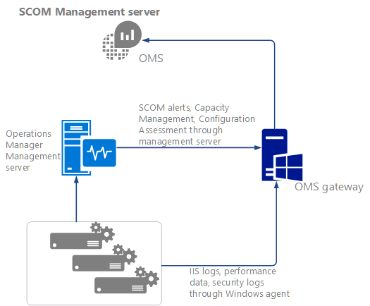
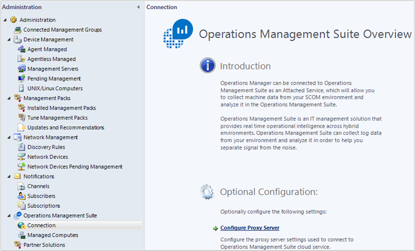
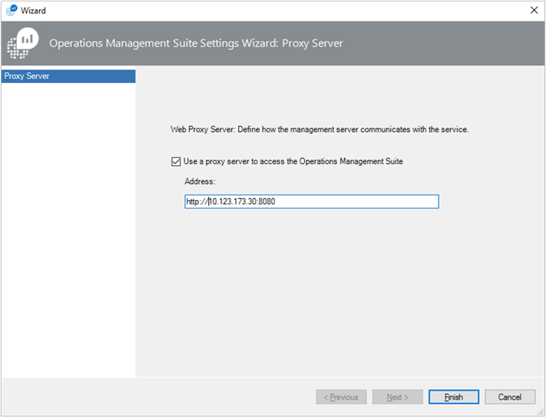
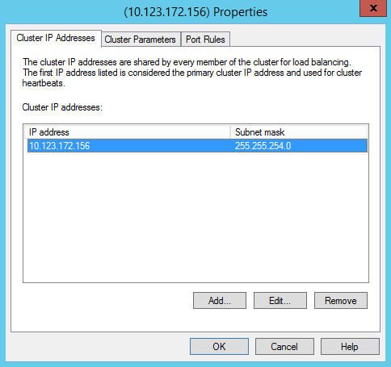
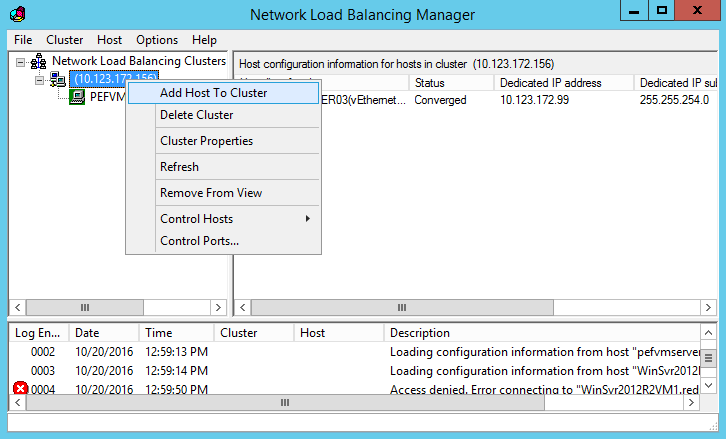
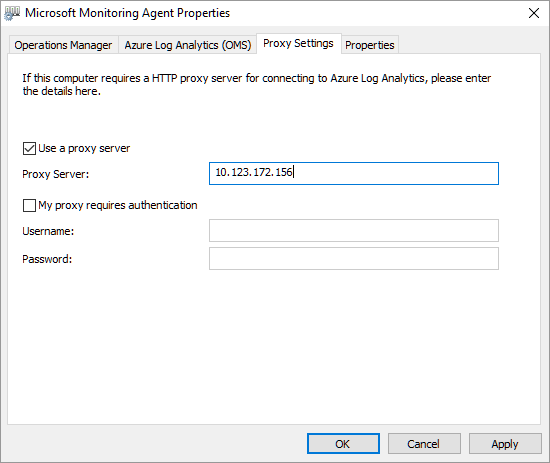
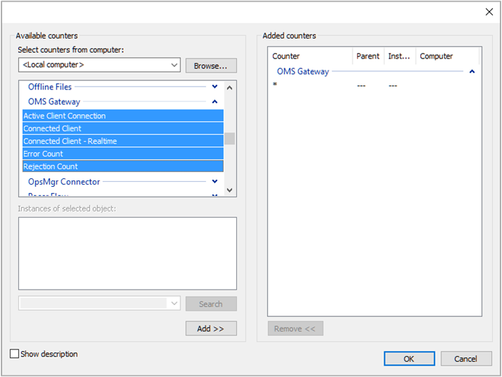

<properties
    pageTitle="Herstellen einer Verbindung mit dem Gateway OMS OMS mit Computern und Geräten | Microsoft Azure"
    description="Verbinden Sie Ihre OMS-verwalteten Geräten und Computern Operations Manager überwacht mit dem Gateway OMS Daten an den OMS-Dienst gesendet werden, wenn sie nicht Zugriff auf das Internet haben."
    services="log-analytics"
    documentationCenter=""
    authors="bandersmsft"
    manager="jwhit"
    editor=""/>
<tags
    ms.service="log-analytics"
    ms.workload="na"
    ms.tgt_pltfrm="na"
    ms.devlang="na"
    ms.topic="article"
    ms.date="10/26/2016"
    ms.author="banders"/>

# Herstellen einer Verbindung mit dem Gateway OMS OMS mit Computern und Geräten

Dieses Dokument beschreibt, wie Ihre OMS-verwalteten Geräten und System Center Operations Manager SCOM überwacht Computern Daten an den OMS-Dienst senden können, wenn sie nicht Zugriff auf das Internet verfügen. Das Gateway OMS können Sie die Daten sammeln und an den OMS-Dienst in ihrem Auftrag zu senden.

Das Gateway ist eine forward HTTP-Proxy, die, der HTTP-Tunnel mit dem Befehl Verbinden HTTP unterstützt. Das Gateway kann bis zu 2000 OMS gleichzeitig verbunden Geräte bei der Ausführung unter einer 4-Core-CPU 16-GB-Server unter Windows behandeln.

Beispielhaft Ihr Unternehmen oder großen Unternehmen möglicherweise Servers mit der Netzwerkkonnektivität aber möglicherweise keine Verbindung mit dem Internet. Ein weiteres Beispiel müssen Sie möglicherweise viele Punkt Verkauf (POS) Geräte mit keine bedeutet, dass direkt zu überwachen. Und in einem anderen Beispiel Operations Manager OMS Gateways als einen Proxyserver verwenden können. In diesen Beispielen können das Gateway OMS Daten von den Agents übertragen, die für diese Servern oder POS Geräten OMS installiert werden.

Statt jedes einzelne Agentdaten direkt an sendet OMS und sich eine direkte Verbindung zum Internet werden alle Agentdaten stattdessen über einen einzelnen Computer, der Verbindung zum Internet wurde gesendet. Der Computer ist, wo Sie installieren und Verwenden des Gateways. In diesem Szenario können Sie Agents auf Computern installieren, in dem Sie Daten sammeln möchten. Das Gateway dann Datenübertragung von den Agents zu OMS direkt – das Gateway nicht analysieren der Daten, die übertragen werden.

Um das Gateway OMS überwachen und Analysieren Leistung oder Daten für den Server, in dem es installiert ist, müssen OMS Installation des Agents auf dem Computer, auf das Gateway auch installiert ist.

Das Gateway muss mit dem Internet Hochladen von Daten in OMS zugreifen können. Jeder Agent müssen auch Netzwerkkonnektivität mit seiner Gateway, damit Agents automatisch Daten an und von Gateways übertragen werden können. Die besten Ergebnisse erzielen Sie installieren Sie das Gateway nicht auf einem Computer, der auch als Domäne eingerichtet ist.

Hier ist ein Diagramm, Datenfluss aus direkten Agents zu OMS darstellt.

Hier ist ein Diagramm, Datenfluss aus Operations Manager zu OMS darstellt.

## Installieren Sie das Gateway OMS

Installieren dieses Gateway ersetzt frühere Versionen des Gateways, dass Sie (Log Analytics Weiterleitung) installiert haben.

Voraussetzungen: für .net Framework 4.5, Windows Server 2012 R2 SP1 und höher

1. Laden Sie die neueste Version des Gateways OMS vom [Microsoft Download Center](http://download.microsoft.com/download/2/5/C/25CF992A-0347-4765-BD7D-D45D5B27F92C/OMS%20Gateway.msi).
2. Doppelklicken Sie auf **OMS Gateway.msi**, um die Installation zu starten.
3. Klicken Sie auf der Seite Willkommen **Weiter**.  
    
4. Wählen Sie auf der Seite Lizenzvertrag **annehmen im Lizenzvertrag** zustimmen den Endbenutzer-Lizenzvertrag ein, und klicken Sie dann auf **Weiter**.
5. Klicken Sie auf den Port und Proxy Adresse-Seite:
    1. Geben Sie die TCP-Anschluss ein, für das Gateway verwendet werden soll. Setup wird diese Port-Nummer von Windows-Firewall geöffnet. Der Standardwert ist 8080.
    Die Nummer des Ports gültige Bereich ist 1-65535. Wenn die Eingabe nicht in diesem Bereich liegt, wird eine Fehlermeldung angezeigt.
    2. Wenn der Server, auf das Gateway installiert ist, zur Verwendung eines Proxy muss, geben Sie optional die Proxyadresse, wo das Gateway eine Verbindung herstellen muss. Beispielsweise `http://myorgname.corp.contoso.com:80` ist leer, das Gateway versucht, direkt mit dem Internet verbinden. Anderenfalls verbindet das Gateway an den Proxy ein. Wenn Sie der Proxyserver-Authentifizierung erforderlich ist, geben Sie Ihren Benutzernamen und Ihr Kennwort ein.
          
    3. Klicken Sie auf **Weiter**
6. Wenn Sie nicht Microsoft-Updates aktiviert haben, wird die Microsoft Update-Seite, in dem Sie auswählen können, aktivieren Sie Microsoft Updates. Treffen Sie eine Auswahl, und klicken Sie dann auf **Weiter**. Andernfalls fahren Sie mit dem nächsten Schritt fort.
7. Klicken Sie auf der Seite Zielordner lassen Sie die standardmäßigen Ordner **%ProgramFiles%\OMS Gateway** oder geben Sie die Stelle, an der Sie Gateway installieren, und klicken Sie dann auf **Weiter**.
8. Klicken Sie auf der Seite bereit zum Installieren klicken Sie auf **Installieren**. Eine Benutzerkontensteuerung möglicherweise Anfordern der Genehmigung für die Installation angezeigt. Wenn dies der Fall ist, klicken Sie auf **Ja**.
9. Nach Abschluss der Installation klicken Sie auf **Fertig stellen**. Sie können überprüfen, ob der Dienst ausgeführt wird, indem Sie das services.msc-Snap-in öffnen, und stellen Sie sicher, dass **OMS Gateway** in der Liste der Dienste angezeigt wird.  
    

## Installieren eines Agents auf Geräten

Falls erforderlich, finden Sie unter [Verbinden von Windows-Computern Log Analytics](log-analytics-windows-agents.md) Informationen dazu, wie Sie direkt installieren Agents verbunden. Dieser Artikel beschreibt, wie Sie den Agent über den Setup-Assistenten installieren können oder über die Befehlszeile.

## Konfigurieren von OMS-agents

Finden Sie unter [Konfigurieren von Proxy und Firewall-Einstellungen mit Microsoft Agent Überwachung](log-analytics-proxy-firewall.md) Informationen zum Konfigurieren von Agent, um einen Proxyserver verwenden, der in diesem Fall ist das Gateway ist.

Operations Manager-Agents Senden einiger Daten wie Operations Manager Benachrichtigungen, Konfiguration Bewertung, Instanz Leerzeichen und Kapazitätsdaten über den Management Server. Andere großer Datenmengen, z. B. IIS-Protokolle, Leistung und Sicherheit werden direkt an das Gateway OMS gesendet. Finden Sie unter [Hinzufügen von Log Analytics Lösungen aus dem Lösungskatalog](log-analytics-add-solutions.md) eine vollständige Liste der Daten, die durch jeden Kanal gesendet wird.

>[AZURE.NOTE]
Wenn Sie beabsichtigen, das Gateway mit Netzwerklastenausgleich verwenden, finden Sie unter [Netzwerklastenausgleich optional konfigurieren](#optionally-configure-network-load-balancing).

## Konfigurieren eines Proxyservers SCOM

Sie konfigurieren Operations-Manager, um das Gateway zu dienen als einen Proxyserver hinzuzufügen. Wenn Sie die Proxy-Konfiguration aktualisieren, wird die Proxy-Konfiguration automatisch auf alle Agents mit Operations Manager angewendet.

Um das Gateway zur Unterstützung von Operations Manager zu verwenden, müssen Sie haben:

- Überwachen von Microsoft-Agent (Agent-Version – **8.0.10900.0** und höher) auf dem Gateway-Server installiert und konfiguriert für die OMS Arbeitsbereiche, mit denen Sie kommunizieren möchten.
- Das Gateway muss Internet Connectivity oder an einen Proxyserver, mit der unterhält verbunden sein.

### So konfigurieren Sie SCOM für das gateway

1. Öffnen Sie die Operations Manager-Konsole unter **Vorgänge Management Suite**aus, klicken Sie auf **Verbindung** , und klicken Sie dann auf **Dem Proxyserver konfigurieren**:  
    
2. Wählen Sie **die Vorgänge Management Suite Zugriff auf einen Proxyserver verwenden** , und geben Sie dann die IP-Adresse des Servers OMS Gateway. Stellen Sie sicher, dass Sie beginnen Sie mit der `http://` Präfix:  
    
3. Klicken Sie auf **Fertig stellen**. Ihre Operations Manager-Server ist mit dem Arbeitsbereich OMS verbunden.

## Konfigurieren von Netzwerklastenausgleich

Sie können das Gateway hohen Verfügbarkeit Netzwerk einen Lastenausgleich durch Erstellen eines Clusters konfigurieren. Cluster verwaltet Datenverkehr von Agents auf, indem Sie die angeforderten Verbindungen aus der Microsoft-Agents Überwachung über seine Knoten umleiten. Wenn ein Gateway-Server fällt aus, erhält der Datenverkehr an andere Knoten umgeleitet.

1. Lastenausgleich-Manager zu öffnen Sie, und erstellen Sie einen Cluster.
2. Mit der rechten Maustaste im Clusters vor dem Hinzufügen der Gateways, und wählen Sie **Clustereigenschaften.** Konfigurieren Sie den Cluster, um eine eigene IP-Adresse:  
    
3. Informationen zum Verbinden einen OMS Gateway-Server mit dem Microsoft Überwachung Agent installiert mit der rechten Maustaste in die IP-Adresse ein, und klicken Sie dann auf **Host zu Cluster hinzufügen**.  
    
4. Geben Sie die IP-Adresse des Servers des Gateways, die Sie verbinden möchten:  
    
5. Werden Sie auf Computern, die keine Verbindung mit dem Internet haben sicherstellen, dass die IP-Adresse die Cluster verwenden, wenn Sie die **Überwachung Microsoft Agent-Eigenschaften**konfigurieren:  
    

## Konfigurieren von für die Automatisierung Hybrid Kollegen

Wenn Sie in Ihrer Umgebung Automatisierung Hybrid Kollegen haben, bieten die folgenden Schritte manuelle, temporäre problemumgehungen zum Konfigurieren des Gateways zur Unterstützung.

In den folgenden Schritten müssen Sie die Azure Region wissen, wo das Automatisierung Konto befindet. Um den Speicherort zu suchen:

1. Melden Sie sich mit dem [Azure-Portal](https://portal.azure.com/)aus.
2. Wählen Sie den Azure Automatisierung Dienst an.
3. Wählen Sie das entsprechende Automatisierung Azure-Konto an.
4. Anzeigen von seinem Bereich unter **Speicherort**.  
    

Verwenden Sie die folgenden Tabellen, um die URL für jeden Standort zu ermitteln:

**Position Laufzeit Data Service-URLs**

| **Speicherort** | **URL** |
| --- | --- |
| Nord-zentralen US | Ncus-Jobruntimedata-Prod-su1.azure-automation.net |
| Westen Europa | Wir-Jobruntimedata-Prod-su1.azure-automation.net |
| Süd zentralen US | Scus-Jobruntimedata-Prod-su1.azure-automation.net |
| Ostasiatische US | Eus-Jobruntimedata-Prod-su1.azure-automation.net |
| Zentrale Kanada | cc-Jobruntimedata-Prod-su1.azure-automation.net |
| North Europa | Neuer-Jobruntimedata-Prod-su1.azure-automation.net |
| Süd Ostasien | beringsee-Jobruntimedata-Prod-su1.azure-automation.net |
| Zentrale Indien | CID-Jobruntimedata-Prod-su1.azure-automation.net |
| Japan | Jpe-Jobruntimedata-Prod-su1.azure-automation.net |
| Australien | ASE-Jobruntimedata-Prod-su1.azure-automation.net |

**Agent Service-URLs**

| **Speicherort** | **URL** |
| --- | --- |
| Nord-zentralen US | Ncus-Agentservice-FA-1.azure-automation.net |
| Westen Europa | Wir-Agentservice-FA-1.azure-automation.net |
| Süd zentralen US | Scus-Agentservice-FA-1.azure-automation.net |
| Ostasiatische US | eus2-Agentservice-FA-1.azure-automation.net |
| Zentrale Kanada | cc-Agentservice-FA-1.azure-automation.net |
| North Europa | Neuer-Agentservice-FA-1.azure-automation.net |
| Süd Ostasien | beringsee-Agentservice-FA-1.azure-automation.net |
| Zentrale Indien | CID-Agentservice-FA-1.azure-automation.net |
| Japan | Jpe-Agentservice-FA-1.azure-automation.net |
| Australien | ASE-Agentservice-FA-1.azure-automation.net |

Wenn Ihr Computer als ein Hybrid Worker automatisch registriert ist für die Update-Lösung mit Patch, verwenden Sie folgende Schritte aus:

1. Fügen Sie in der Liste zulässige Host auf dem Gateway OMS Auftrag Laufzeit Daten Dienst URLs hinzu. Beispiel: `Add-OMSGatewayAllowedHost we-jobruntimedata-prod-su1.azure-automation.net`
2. Starten Sie den OMS-Gateway-Dienst mithilfe des folgenden PowerShell-Cmdlets aus:`Restart-Service OMSGatewayService`

Wenn Ihr Computer auf-umgeben zu Azure Automatisierung mithilfe des Hybrid Worker Registrierung Cmdlets ist, verwenden Sie folgende Schritte aus:

1. Die Registrierung-Agent URL zur Liste zulässige Host auf dem Gateway OMS hinzufügen. Beispiel:`Add-OMSGatewayAllowedHost ncus-agentservice-prod-1.azure-automation.net`
2. Fügen Sie in der Liste zulässige Host auf dem Gateway OMS Auftrag Laufzeit Daten Dienst URLs hinzu. Beispiel: `Add-OMSGatewayAllowedHost we-jobruntimedata-prod-su1.azure-automation.net`
3. Starten Sie den OMS Gateway-Dienst an.
    `Restart-Service OMSGatewayService`

## Hilfreiche PowerShell-cmdlets

Cmdlets helfen Ihnen die Erledigung der Vorgänge, die erforderlich sind, den OMS Gateway Konfiguration aktualisiert. Bevor Sie sie verwenden, müssen Sie unbedingt:

1. Installieren Sie das Gateway OMS (MSI).
2. Das PowerShell-Fenster zu öffnen.
3. Um das Modul zu importieren, geben Sie diesen Befehl aus:`Import-Module OMSGateway`
4. Wenn Sie im vorherigen Schritt kein Fehler aufgetreten ist, das Modul wurde erfolgreich importiert, und die Cmdlets verwendet werden können. Typ`Get-Module OMSGateway`
5. Nachdem Sie Änderungen vorgenommen haben, mithilfe der Cmdlets, stellen Sie sicher, dass Sie den Gateway-Dienst neu starten.

Wenn Sie in Schritt 3 ein Fehler ausgegeben wird, wurde nicht das Modul importiert. Der Fehler kann auftreten, wenn PowerShell das Modul finden kann. Können Sie es in den Gateway Installationspfad finden: c:\Programme c:\Programme\Microsoft OMS Gateway\PowerShell.

| **Cmdlet** | **Parameter** | **Beschreibung** | **Beispiele** |
| --- | --- | --- | --- |
| `Set-OMSGatewayConfig` | Key (erforderlich)   Wert | Ändert sich die Konfiguration des Diensts | `Set-OMSGatewayConfig -Name ListenPort -Value 8080` |
| `Get-OMSGatewayConfig` | Schlüssel | Ruft die Konfiguration des Diensts ab | `Get-OMSGatewayConfig`     `Get-OMSGatewayConfig -Name ListenPort` |
| `Set-OMSGatewayRelayProxy` | Adresse   Benutzername   Kennwort | Legt die Adresse (und die Anmeldeinformationen) der Relay (Upstreamproxy) | 1. festlegen Sie Proxy Antworten und die Anmeldeinformationen:`Set-OMSGatewayRelayProxy -Address http://www.myproxy.com:8080 -Username user1 -Password 123`     2 Legen Sie 2 einen Antwort Proxy Authentifizierung, die nicht:`Set-OMSGatewayRelayProxy -Address http://www.myproxy.com:8080`     3. deaktivieren die Antwort Proxyeinstellung, d. h., brauchen nicht Proxy Antworten:`Set-OMSGatewayRelayProxy -Address ""` |
| `Get-OMSGatewayRelayProxy` |   | Ruft die Adresse der Relay (Upstreamproxy) | `Get-OMSGatewayRelayProxy` |
| `Add-OMSGatewayAllowedHost` | Host (erforderlich) | Fügt den Host zur Liste zugelassenen | `Add-OMSGatewayAllowedHost -Host www.test.com` |
| `Remove-OMSGatewayAllowedHos`t | Host (erforderlich) | Entfernt den Host aus der Liste der zugelassenen | `Remove-OMSGatewayAllowedHost -Host www.test.com` |
| `Get-OMSGatewayAllowedHost` |   | Ruft den aktuell zulässige Host ab (nur die lokal konfigurierten Host zulässig, nehmen Sie nicht automatisch heruntergeladenen zulässige Hosts) | `Get-OMSGatewayAllowedHost` |
| `Add-OMSGatewayAllowedClientCertificate` | Betreff (erforderlich) | Fügt das Clientzertifikat unterliegen der Liste der zugelassenen | `Add-OMSGatewayAllowedClientCertificate -Subject mycert` |
| `Remove-OMSGatewayAllowedClientCertificate` | Betreff (erforderlich) | Entfernt den Betreff der Client-Zertifikat aus der Liste der zugelassenen | `Remove- OMSGatewayAllowedClientCertificate -Subject mycert` |
| `Get-OMSGatewayAllowedClientCertificat`e |   | Ruft die derzeit zulässigen Client Zertifikat Betreffzeilen (nur die lokal konfigurierten zulässigen Themen enthalten nicht automatisch heruntergeladene zulässige Themen) | `Get-OMSGatewayAllowedClientCertificate` |

## Behandeln von Problemen mit

Es empfiehlt sich, dass Sie den OMS-Agent auf Computern installieren, die das Gateway installiert haben. Den Agent können dann um die Ereignisse zu erfassen, die vom Gateway angemeldet sind.

**OMS Gateway-Ereignis-IDs und Beschreibungen**

Die folgende Tabelle zeigt das Ereignis-IDs und Beschreibungen für OMS Gateway Protokollieren von Ereignissen.

| **ID** | **Beschreibung** |
| --- | --- |
| 400 | Alle Anwendungsfehler, die nicht mit eine bestimmte ID verfügt |
| 401 | Falsche Konfiguration. Beispiel: listenport soll = "Text" kein ganze Zahl |
| 402 | Ausnahme beim Analysieren der TLS-Handshake Nachrichten |
| 403 | Netzwerke zurück. Beispiel: kann keine Verbindung mit dem Ziel-Server |
| 100 | Allgemeine Informationen |
| 101 | Dienst wurde gestartet. |
| 102 | Dienst wurde beendet |
| 103 | Erhalten einen Befehl Verbinden HTTP-Desktopclient |
| 104 | Nicht verbinden HTTP-Befehl |
| 105 | Zielserver ist nicht in der Liste der zugelassenen oder der Zielanschluss ist nicht sicherer Port (443)     Stellen Sie sicher, dass der MMA-Agent auf dem Gateway-Server und die Kommunikation mit dem Gateway-Agents mit dem gleichen Protokoll Analytics Arbeitsbereich verbunden sind.|
| 105 | Fehler TcpConnection – ungültige Client-Zertifikat: CN = Gateway    Überprüfen Sie Folgendes:     & #149; Verwenden Sie einen Gateway mit Versionsnummer 1.0.395.0 oder höher.   & #149; Der MMA-Agent auf dem Gateway-Server und die Kommunikation mit dem Gateway-Agents sind mit den gleichen Log Analytics Arbeitsbereich verbunden. |
| 106 | Aus irgendeinem Grund, die die TLS-Sitzung verdächtige und abgelehnten ist |
| 107 | Die TLS-Sitzung wurde überprüft |

**Leistungsindikatoren zu sammeln**

Die folgende Tabelle zeigt die Leistungsindikatoren verfügbar für das Gateway OMS. Sie können die Indikatoren mit Performance Monitor hinzufügen.

| **Namen** | **Beschreibung** |
| --- | --- |
| OMS Gateway/aktiv-Client-Verbindung | Anzahl von aktiven Clients (TCP)-Netzwerk verbunden |
| Zählen von OMS Gateway-Fehler | Anzahl der Fehler |
| Gateway/verbunden OMS-Client | Anzahl der verbundenen clients |
| OMS Gateway/Ablehnung zählen | Anzahl der abgelehnte aufgrund einer beliebigen Überprüfungsfehler TLS |

## Abrufen von Hilfe

Wenn Sie die Azure-Portal angemeldet sind, können Sie einen Antrag auf Unterstützung mit dem Gateway OMS oder anderen Azure Service oder Feature eines Diensts erstellen.
Um Unterstützung anzufordern, klicken Sie auf das Fragezeichen-Symbol in der oberen rechten Ecke des Portals, und klicken Sie dann auf **neue support-Anfragen**. Führen Sie das neue Anforderung Supportformular an.

Sie können auch Feedback zu OMS oder Log Analytics am [Microsoft Azure Feedback Forum](https://feedback.azure.com/forums/267889)lassen.

## Nächste Schritte

- [Hinzufügen von Datenquellen](log-analytics-data-sources.md) zum Sammeln von Daten aus Quellen im Arbeitsbereich OMS verbunden, und speichern es im Repository OMS.
