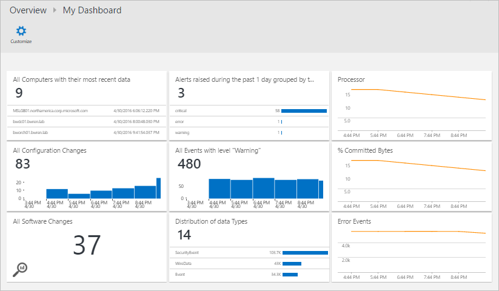

<properties
   pageTitle="Was ist Log Analytics? | Microsoft Azure"
   description="Log Analytics ist ein Dienst in Vorgänge Management Suite (OMS), die hilft Ihnen sammeln und Betrieb von Ressourcen in der Cloud generierte Daten analysieren und lokalen Umgebung.  Dieser Artikel enthält eine kurze Übersicht über die verschiedenen Komponenten des Log Analytics und Links zu ausführlichen Inhalt."
   services="log-analytics"
   documentationCenter=""
   authors="bwren"
   manager="jwhit"
   editor="tysonn" />
<tags
   ms.service="log-analytics"
   ms.devlang="na"
   ms.topic="hero-article"
   ms.tgt_pltfrm="na"
   ms.workload="infrastructure-services"
   ms.date="09/06/2016"
   ms.author="bwren" />

# Was ist Log Analytics?
Log Analytics ist ein Dienst [Vorgänge Management Suite \(OMS\) ](../operations-management-suite/operations-management-suite-overview.md) , die Ihnen hilft, sammeln und Analysieren von Daten von Ressourcen in der Cloud generiert und lokale Umgebungen. Sie erfahren in Echtzeit Einsichten mithilfe von Such- und benutzerdefinierte Dashboards Millionen von Datensätzen über alle Auslastung und Servern unabhängig von deren Standort leicht zu analysieren.

## Melden Sie sich Analytics-Komponenten
Bei Center Log Analytics ist OMS Repository die in der Cloud Azure gehostet wird.  Daten werden in das Repository von verbundenen Datenquellen durch Konfigurieren von Datenquellen und Hinzufügen von Lösungen für Ihr Abonnement erfasst.  Datenquellen und Lösungen erstellt jede verschiedene Datensatztypen, die ihre eigenen Gruppe von Eigenschaften, aber möglicherweise noch analysiert werden zusammen in Abfragen zum Repository.  So können Sie die gleichen Tools und Methoden für die Arbeit mit verschiedenen Arten von von verschiedenen Quellen gesammelten Daten verwenden.

Verbundene Datenquellen werden die Computern und anderen Ressourcen, die vom Protokoll Analytics erfassten Daten generieren.  Hierzu gehören Agents installiert unter [Windows](log-analytics-windows-agents.md) und [Linux](log-analytics-linux-agents.md) auf Computern, die direkt verbinden oder von Agents in einer [Management Group unter System Center Operations Manager verbunden](log-analytics-om-agents.md).  Log Analytics können auch Daten aus [Azure-Speicher](log-analytics-azure-storage.md)sammeln.

[Datenquellen](log-analytics-data-sources.md) werden die verschiedenen Arten von zusammengestellten Daten aus jeder verbundenen Quelle.  Dies umfasst Ereignisse und [Leistungsdaten](log-analytics-data-sources-performance-counters.md) von [Windows](log-analytics-data-sources-windows-events.md) und Linux-Agents sowie Quellen wie z. B. [IIS-Protokolle](log-analytics-data-sources-iis-logs.md)und [Protokolle benutzerdefiniertem Text](log-analytics-data-sources-custom-logs.md)ein.  Sie konfigurieren die einzelnen Datenquellen, die Sie erfassen möchten, und die Konfiguration wird automatisch an jede verbundenen Quelle übermittelt.

## Analysieren von Log Analytics-Daten
Die meisten für die Interaktion mit Log Analytics werden über das Portal OMS, die in einem beliebigen Browser ausgeführt wird und Sie Zugriff auf die Konfiguration von Einstellungen und mehrere Tools zum Analysieren und dienen auf gesammelten Daten enthält.  Aus dem Portal können Sie [Log Suchbegriffe](log-analytics-log-searches.md) nutzen, in dem Sie Abfragen gesammelte Daten, [Dashboards](log-analytics-dashboards.md) analysieren, die Sie grafisch Ansichten von Spieler Suchbegriffe und [Lösungen](log-analytics-add-solutions.md) anpassen können die bieten zusätzliche Funktionen und Analysetools erstellen.

Log Analytics stellt eine Abfragesyntax, um schnell abrufen und Konsolidieren von Daten im Repository.  Sie erstellen und speichern Sie die [Protokolldateien Suchbegriffe](log-analytics-log-searches.md) zum Analysieren von Daten im Portal OMS direkt können oder haben Log Suchbegriffe automatisch ausgeführt um eine Benachrichtigung erstellen, wenn die Ergebnisse der Abfrage eine wichtige Bedingung anzugeben.

Eine schnelle grafische Übersicht über die Integrität des der gesamten Umgebung zu verleihen, können Sie Visualisierungen für Suchvorgänge gespeichertes Protokoll zu Ihrem [Dashboard](log-analytics-dashboards.md)hinzufügen.   

Zum Analysieren von Daten außerhalb Log Analytics, können Sie die Daten aus dem OMS Repository in Tools, wie [Power BI](log-analytics-powerbi.md) oder Excel exportieren.  Sie können auch nutzen [Log Suche API](log-analytics-log-search-api.md) benutzerdefinierte Lösungen zu erstellen, die Log Analytics-Daten nutzen oder mit anderen Systemen integriert werden soll.

## Lösungen
Lösungen hinzugefügt Log Analytics Funktionalität.  Diese hauptsächlich in der Cloud und bieten Analyse der Daten im Repository OMS erfasst. Sie können auch neue Datensatztypen erfasst werden definieren, die mit Log Suchbegriffe oder zusätzliche Benutzeroberfläche, die von der Lösung im Dashboard OMS bereitgestellten analysiert werden können.  

Lösungen für eine Reihe von Funktionen verfügbar sind, und Sie können ganz einfach durchsuchen verfügbar Lösungen und aus dem Lösungskatalog [in den Arbeitsbereich OMS hinzufügen](log-analytics-add-solutions.md) .  Viele automatisch bereitgestellt und sofort, während andere wiederum einige Konfiguration erfordern möglicherweise mit der Arbeit beginnen.

## Melden Sie sich Analytics Architektur
Die Anforderungen Bereitstellung Log Analytics sind minimal, da das zentrale Element in der Cloud Azure gehostet werden.  Dies umfasst das Repository sowie die Dienste, mit denen Sie zu Strukturierung und Analyse der gesammelte Daten.  Im Portal kann über einen beliebigen Browser zugegriffen werden, sodass es nicht erforderlich, für die Clientsoftware ist.

Sie müssen die Agents auf [Windows-](log-analytics-windows-agents.md) und [Linux](log-analytics-linux-agents.md) -Computer installieren, aber ist kein zusätzlicher Agent erforderlich auf Computern, die bereits Mitglied einer [Management Group unter SCOM verbunden](log-analytics-om-agents.md)sind.  SCOM Agents weiterhin mit Management-Servern kommunizieren, die ihre Daten zu Log Analytics weitergeleitet werden.  Einige Lösungen benötigen durch Agents direkt mit Log Analytics kommunizieren.  Die Dokumentation für jede Lösung wird die Anforderungen Kommunikation angeben.

Wenn Sie [für Protokoll Analytics registrieren](log-analytics-get-started.md), Sie einen OMS Arbeitsbereich erstellt.  Sie können den Arbeitsbereich als einen eindeutigen OMS-Umgebung, die mit einem eigenen Datenrepository, Datenquellen und Lösungen vorstellen. Sie können mehrere Arbeitsbereiche erstellen, in Ihrem Abonnement unterstützt mehrere Umgebungen wie Herstellung und testen.

## Nächste Schritte

- Testen Sie in Ihrer eigenen Umgebung [für ein kostenloses Log Analytics-Konto anmelden](log-analytics-get-started.md) .
- Anzeigen der unterschiedlichen [Datenquellen](log-analytics-data-sources.md) zum Sammeln von Daten in das Repository OMS verfügbar.
- [Durchsuchen Sie die Lösung im Lösungskatalog](log-analytics-add-solutions.md) , Log Analytics Funktionen hinzu.
