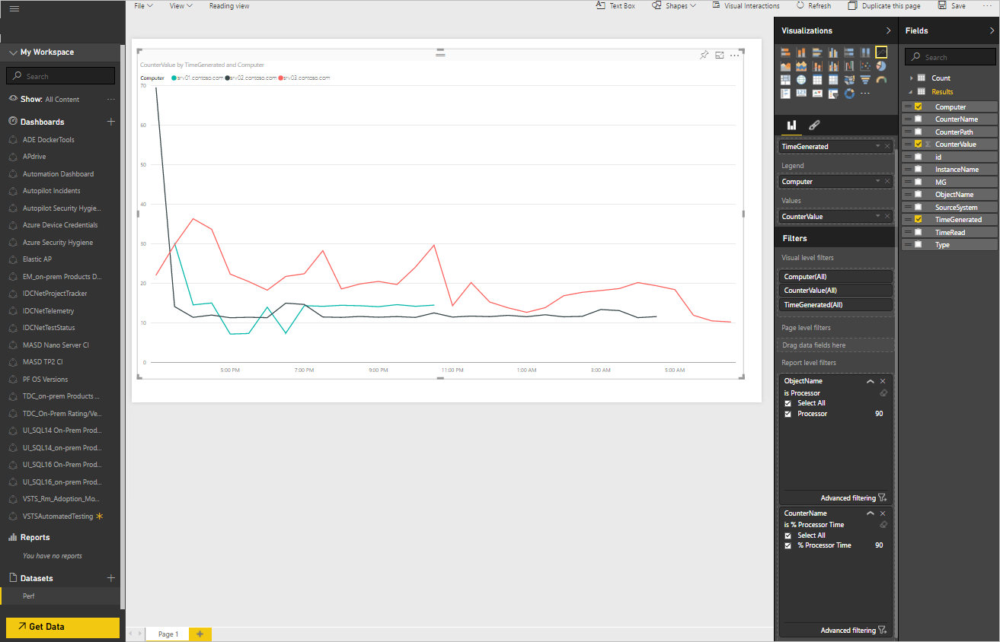

<properties
   pageTitle="Exportieren von Log Analytics-Daten in Power BI | Microsoft Azure"
   description="Power BI ist eine cloudbasierte Business Analytics-Dienst von Microsoft, die Bandbreite von Darstellungen und Berichte für verschiedene Datenmengen Analysen enthält.  Log Analytics können kontinuierlich Exportieren von Daten aus dem OMS Repository in Power BI, sodass Sie deren Bandbreite von Darstellungen und Analysetools nutzen können.  Dieser Artikel beschreibt, wie Abfragen in Log Analytics konfiguriert werden, die automatisch in regelmäßigen Abständen in Power BI zu exportieren."
   services="log-analytics"
   documentationCenter=""
   authors="bwren"
   manager="jwhit"
   editor="tysonn" />
<tags
   ms.service="log-analytics"
   ms.devlang="na"
   ms.topic="article"
   ms.tgt_pltfrm="na"
   ms.workload="infrastructure-services"
   ms.date="10/18/2016"
   ms.author="bwren" />

# Exportieren von Log Analytics-Daten in Power BI

[Power BI](https://powerbi.microsoft.com/documentation/powerbi-service-get-started/) ist eine cloudbasierte Business Analytics-Dienst von Microsoft, die Bandbreite von Darstellungen und Berichte für verschiedene Datenmengen Analysen enthält.  Log Analytics können automatisch Exportieren von Daten aus dem OMS Repository in Power BI, sodass Sie deren Bandbreite von Darstellungen und Analysetools nutzen können.

Wenn Sie Power BI-Protokoll Analysefunktionen konfigurieren, erstellen Sie Protokolldateien Abfragen, die ihre Ergebnisse in die entsprechenden Datensätze in der Power BI exportieren.  Abfrage- und Exportieren weiterhin automatisch nach einem Zeitplan ausgeführt, die Sie definieren, um das Dataset mit den neuesten von Log Analytics gesammelten Daten auf dem neuesten Stand zu halten.

## Power BI-Zeitpläne

Eine *Power BI-Zeitplan* enthält ein Protokoll suchen, die eine Reihe von Daten aus dem OMS Repository, zu einem entsprechenden Dataset in Power BI und einen Zeitplan, der definiert exportiert, wie oft diese Suche ausgeführt wird, um das Dataset auf dem neuesten Stand zu halten.

Die Felder im Dataset werden von der Log-Suche zurückgegebenen Datensätze übereinstimmen.  Wenn die Suche Datensätze zu verschiedenen Arten gibt wird das Dataset aller Eigenschaften aus den einzelnen Datensatztypen enthalten enthalten.  

> [AZURE.NOTE] Es ist eine bewährte Methode, eine Suchabfrage Log verwenden, die unformatierte Daten enthalten, während eine Konsolidierung mit den Befehlen [Measure](log-analytics-search-reference.md#measure)Durchführung zurückgibt.  Sie können alle Aggregation und Berechnungen in Power BI aus den unformatierten Daten durchführen.

## Herstellen einer Verbindung OMS Arbeitsbereich zu Power BI

Bevor Sie auf Power BI aus Log Analytics exportieren können, müssen Sie bei Ihrem Power BI-Konto, gehen Sie folgendermaßen vor den Arbeitsbereich OMS verbinden.  

1. Klicken Sie in der OMS-Verwaltungskonsole auf die Kachel " **Einstellungen** ".
2. Wählen Sie **Konten**aus.
3. Klicken Sie im Abschnitt **Arbeitsbereichsinformationen** auf **Power BI-Konto verbinden**.
4. Geben Sie die Anmeldeinformationen für Ihr Konto Power BI aus.

## Erstellen Sie einen Power BI-Zeitplan

Erstellen Sie einen Power BI-Zeitplan für jedes Dataset mit dem folgenden Verfahren ein.

1. Klicken Sie in der OMS-Verwaltungskonsole auf die Kachel **Log suchen** .
2. Geben Sie in eine neue Abfrage ein, oder wählen Sie eine gespeicherte Suche, die die Daten zurückgibt, die Sie in **Power BI**exportieren möchten.  
3. Klicken Sie auf die Schaltfläche **Power BI** am oberen Rand der Seite, um das **Power BI** -Dialogfeld zu öffnen.
4. Geben Sie die Informationen in der folgenden Tabelle aus, und klicken Sie auf **Speichern**.

| Eigenschaft | Beschreibung |
|:--|:--|
| Namen | Namen, um den Zeitplan zu identifizieren, wenn Sie die Liste der Power BI-Zeitpläne anzeigen. |
| Gespeicherte Suche | Die Suche Log ausführen.  Sie können wählen Sie aus der aktuellen Abfrage, oder wählen Sie eine vorhandene gespeicherte Suche aus dem Dropdownfeld aus. |
| Zeitplan | Wie häufig führen Sie die gespeicherte Suche und dem Power BI-DataSet exportieren.  Der Wert muss zwischen 15 Minuten und 24 Stunden sein. |
| DataSet-Name | Der Name des Datasets in Power BI.  Es wird erstellt, wenn es nicht vorhanden ist und aktualisiert werden, wenn er vorhanden ist. |

## Anzeigen und Entfernen von Zeitplänen für Power BI

Anzeigen der Liste der vorhandenen Power BI-Zeitpläne mit dem folgenden Verfahren.

1. Klicken Sie in der OMS-Verwaltungskonsole auf die Kachel " **Einstellungen** ".
2. Wählen Sie die **Power BI**aus.

Zusätzlich zu den Details des Zeitplans festzulegen wie oft, der der Zeitplan in der letzten Woche ausgeführt hat und den Status der letzten Synchronisierung angezeigt.  Wenn die Synchronisierung Fehler auftreten, können Sie den Link, um eine Log-Suche für Datensätze mit Details des Fehlers ausführen klicken.

Sie können einen Zeitplan entfernen, indem Sie auf das **X** in der **Spalte entfernen**.  Sie können einen Zeitplan deaktivieren, indem Sie **Deaktivieren**auswählen.  Um einen Zeitplan zu ändern müssen Sie es entfernen und mit der neuen Einstellungen neu erstellen.

## Beispiel für exemplarische Vorgehensweise
Im folgende Abschnitt führt durch ein Beispiel für einen Power BI-Zeitplan erstellen und Verwenden von deren Dataset zum Erstellen eines einfachen Berichts.  In diesem Beispiel wird alle Performance-Daten für eine Reihe von Computern zu Power BI exportiert und ein Liniendiagramm wird dann erstellt, um eine Auslastung anzuzeigen.

### Erstellen von Log-Suche
Zunächst erstellen eine Log-Suche für die Daten, die wir an das Dataset senden möchten.  In diesem Beispiel wird eine Abfrage verwendet, die alle Performance-Daten für Computer mit einem Namen zurückgibt, die mit *Srv*beginnt.  

### Erstellen von Power BI-Suche
Wir klicken Sie auf die **Power BI** -Schaltfläche, um die Power BI-Dialogfeld zu öffnen und die benötigten Informationen.  Diese Suche einmal pro Stunde ausführen, und erstellen ein Dataset namens *"Contoso" Perf*sollen.  Da wir die Suche öffnen, die die Daten erstellt wird, bereits haben sollen, wir übernehmen Sie den Standardnamen der *aktuellen Suchabfrage verwenden* für die **Suche gespeichert**.

### Überprüfen Sie die Power BI-Suche
Um zu überprüfen, dass wir den Terminplan ordnungsgemäß erstellt, anzeigen wir die Liste der Power BI-Suchvorgänge unter die Kachel " **Einstellungen** " im Dashboard OMS.  Wir warten Sie einige Minuten, und aktualisieren Sie diese Ansicht aus, bis sie Berichte, die nach dem Ausführen synchronisieren.

### Vergewissern Sie sich das Dataset im Power BI
Wir melden Sie sich bei Ihrem Konto bei [powerbi.microsoft.com](http://powerbi.microsoft.com/) und Durchführen eines Bildlaufs zur **Datasets** unten im linken Bereich.  Wir sehen, dass das Dataset *Contoso Perf* aufgeführt ist, dass unsere exportieren erfolgreich ausgeführt wurde.

### Erstellen Sie Bericht auf Grundlage dataset
Wir wählen Sie das Dataset **Contoso Perf** , und klicken Sie dann auf **Ergebnisse** im Bereich **Felder** auf der rechten Seite, um die Felder anzuzeigen, die Bestandteil dieses Dataset sind.  Führen wir die folgenden Aktionen aus, um ein Liniendiagramm, für jeden Computer eine Auslastung zu erstellen.

1. Wählen Sie die Linie Diagramm Visualisierung aus.
2. Ziehen Sie **Objektname** zu **Berichten Ebene Filter** , und aktivieren Sie **Prozessor**.
3. Ziehen Sie **CounterName** melden **Ebene Filter** , und aktivieren Sie **% CPU-Zeit**.
4. Ziehen Sie **Beträge** **Werte**ein.
5. Ziehen Sie die **Computer** auf **Legende**.
6. Ziehen Sie **TimeGenerated** **Achse**ein.

Wir sehen können, das sich daraus ergebende Liniendiagramm mit den Daten aus unserem Dataset angezeigt wird.

### Speichern Sie den Bericht
Wir speichern Sie den Bericht, indem Sie auf die Schaltfläche Speichern am oberen Rand des Bildschirms, und überprüfen Sie, dass sie jetzt im Abschnitt Berichte im linken Bereich aufgeführt.

## Nächste Schritte

- Erfahren Sie mehr über [Log Suchbegriffe](log-analytics-log-searches.md) , zum Erstellen von Abfragen, die auf Power BI exportiert werden kann.
- Weitere Informationen zu [Power BI](http://powerbi.microsoft.com) basierte auf Log Analytics Exporte Visualisierungen erstellen.
