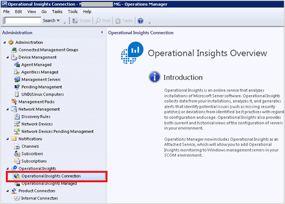
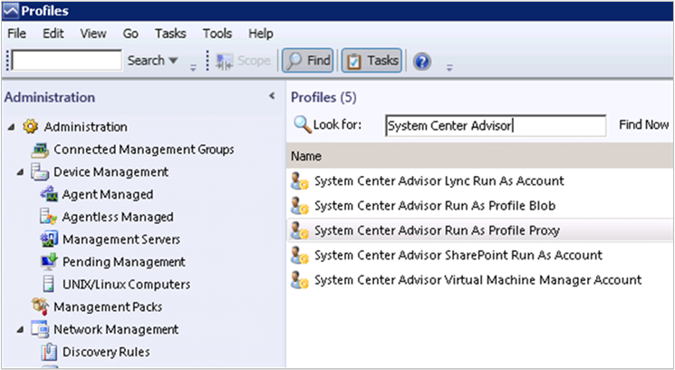
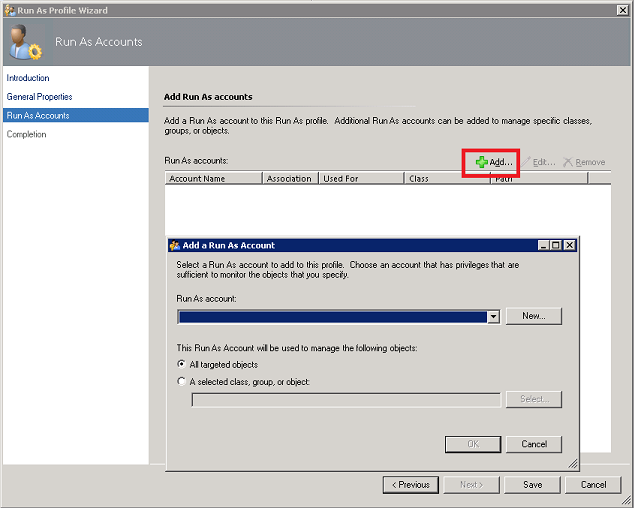
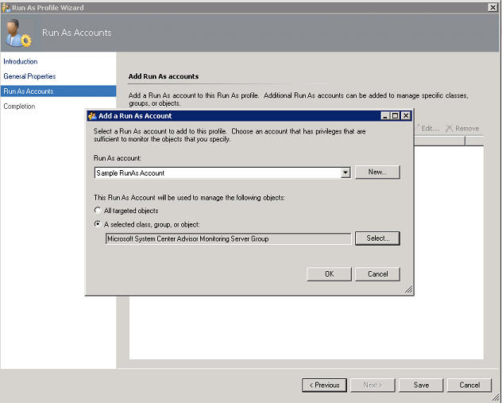
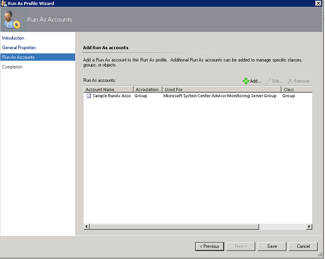

<properties
    pageTitle="Konfigurieren von Proxy und Firewall-Einstellungen in Log Analytics | Microsoft Azure"
    description="Konfigurieren Sie Proxy und Firewall-Einstellungen aus, wenn Ihre Agents oder OMS Services bestimmte Ports verwenden müssen."
    services="log-analytics"
    documentationCenter=""
    authors="bandersmsft"
    manager="jwhit"
    editor=""/>

<tags
    ms.service="log-analytics"
    ms.workload="na"
    ms.tgt_pltfrm="na"
    ms.devlang="na"
    ms.topic="get-started-article"
    ms.date="08/23/2016"
    ms.author="banders;magoedte"/>

# <a name="configure-proxy-and-firewall-settings-in-log-analytics"></a>Konfigurieren von Proxy und Firewall-Einstellungen in Log Analytics

Aktionen erforderlich Proxy konfigurieren und Firewalleinstellungen für Protokoll Analytics in OMS unterscheiden sich bei der Verwendung von Operations Manager und deren Agents im Vergleich zu Microsoft Überwachung Agents, die direkt auf den Server zugreifen. Überprüfen Sie in den folgenden Abschnitten für den Typ des Agents, die Sie verwenden.

## <a name="configure-proxy-and-firewall-settings-with-the-microsoft-monitoring-agent"></a>Konfigurieren von Einstellungen zur Proxy und Firewall mit dem Microsoft-Agent für die Überwachung

Für den Microsoft Überwachung-Agent zum Herstellen einer Verbindung mit und mit dem OMS-Dienst registrieren müssen sie Zugriff auf die Nummer des Domänen und die URLs. Wenn Sie einen Proxyserver für die Kommunikation zwischen dem Agent und OMS-Dienst verwenden, müssen Sie sicherstellen, dass die geeigneten Ressourcen zugegriffen werden kann. Wenn Sie eine Firewall zum Einschränken des Zugriffs mit dem Internet verwenden, müssen Sie zum Konfigurieren der Firewall, um zu OMS Zugriff gewähren. In den folgenden Tabellen sind die Ports, die OMS muss aufgelistet.

|**Agent-Ressourcen**|**Ports**|**Umgehen HTTPS-Prüfung**|
|--------------|-----|--------------|
|\*. ods.opinsights.azure.com|443|Ja|
|\*. oms.opinsights.azure.com|443|Ja|
|\*. blob.core.windows.net|443|Ja|
|ODS.systemcenteradvisor.com|443| |

Das folgende Verfahren können für den Microsoft Überwachung Agent über systemsteuerung Proxyeinstellungen konfigurieren. Sie müssen das Verfahren für jeden Server verwenden. Wenn Sie viele Server, die Sie konfigurieren möchten verfügen, können Sie ein Skript verwenden, um dieses Verfahren zu automatisieren einfacher. In diesem Fall finden Sie die nächsten Schritte [zum Konfigurieren von Proxyeinstellungen für Microsoft Überwachung Agent mithilfe eines Skripts](#to-configure-proxy-settings-for-the-microsoft-monitoring-agent-using-a-script)aus.

### <a name="to-configure-proxy-settings-for-the-microsoft-monitoring-agent-using-control-panel"></a>So konfigurieren Sie Proxyeinstellungen für Microsoft Überwachung Agent über systemsteuerung

1. Öffnen Sie die **Systemsteuerung**.

2. **Microsoft Agent für die Überwachung**zu öffnen.

3. Klicken Sie auf die Registerkarte **Proxyeinstellungen** .<br>  
  

4. Wählen Sie **einen Proxyserver verwenden** , und geben Sie die URL und port-Nummer, eine ist erforderlich, ähnlich wie im Beispiel dargestellt. Wenn der Proxyserver-Authentifizierung erforderlich ist, geben Sie den Benutzernamen und das Kennwort Zugriff auf den Proxyserver aus.

Gehen Sie folgendermaßen vor, um ein PowerShell-Skript zu erstellen, die ausgeführt werden können, um die Proxyeinstellungen für jeden Agent festzulegen, die direkt mit Servern verbunden.

### <a name="to-configure-proxy-settings-for-the-microsoft-monitoring-agent-using-a-script"></a>So konfigurieren Sie Proxyeinstellungen für Microsoft Überwachung Agent mithilfe eines Skripts

Kopieren Sie im folgende Beispiel, mit speziellen Informationen zur Ihrer Umgebung zu aktualisieren Sie, speichern Sie sie mit der Erweiterung PS1, und führen Sie dann das Skript auf jedem Computer, direkt an den OMS-Dienst verbunden.

        
    param($ProxyDomainName="http://proxy.contoso.com:80", $cred=(Get-Credential))

    # First we get the Health Service configuration object.  We need to determine if we
    #have the right update rollup with the API we need.  If not, no need to run the rest of the script.
    $healthServiceSettings = New-Object -ComObject 'AgentConfigManager.MgmtSvcCfg'

    $proxyMethod = $healthServiceSettings | Get-Member -Name 'SetProxyInfo'

    if (!$proxyMethod)
    {
         Write-Output 'Health Service proxy API not present, will not update settings.'
         return
    }

    Write-Output "Clearing proxy settings."
    $healthServiceSettings.SetProxyInfo('', '', '')

    $ProxyUserName = $cred.username

    Write-Output "Setting proxy to $ProxyDomainName with proxy username $ProxyUserName."
    $healthServiceSettings.SetProxyInfo($ProxyDomainName, $ProxyUserName, $cred.GetNetworkCredential().password)
        

## <a name="configure-proxy-and-firewall-settings-with-operations-manager"></a>Konfigurieren von Proxy und Firewall-Einstellungen mit Operations Manager

Für die Gruppe ein Operations Manager Management zum Herstellen einer Verbindung mit und mit dem OMS-Dienst registrieren müssen sie Zugriff auf die Portnummern Ihrer Domänen und URLs. Wenn Sie einen Proxyserver für die Kommunikation zwischen dem Operations Manager Management Server und dem OMS-Dienst verwenden, müssen Sie sicherstellen, dass die geeigneten Ressourcen zugegriffen werden kann. Wenn Sie eine Firewall zum Einschränken des Zugriffs mit dem Internet verwenden, müssen Sie zum Konfigurieren der Firewall, um zu OMS Zugriff gewähren. Auch wenn ein Operations Manager Management Server nicht hinter einem Proxyserver ist, möglicherweise den Agents. In diesem Fall sollte der Proxyserver auf die gleiche Weise konfiguriert sein, wie Agents werden müssen, um zu aktivieren und ermöglichen Sicherheit und -Verwaltung Lösungsdaten Abrufen die OMS gesendet-Webdienst ab.

Damit Operations Manager-Agents zur Kommunikation mit dem Dienst OMS sollte die Operations Manager-Infrastruktur (einschließlich Mitarbeiter) die richtigen Proxyeinstellungen und Version verfügen. Die Proxyeinstellung für Agents wird in der Operations Manager-Verwaltungskonsole angegeben. Die von Ihnen verwendete sollten eine der folgenden Aktionen aus:

- Operations Manager 2012 SP1 Updaterollup 7 oder höher
- Operations Manager 2012 R2 Updaterollup 3 oder höher


In den folgenden Tabellen sind die Ports, die im Zusammenhang mit folgenden Aufgaben aufgelistet.

>[AZURE.NOTE] Einige der folgenden Ressourcen erwähnen Advisor und Betrieb Einblicken, beide früheren Versionen von OMS wurden. Aufgelisteten Ressourcen werden jedoch in der Zukunft ändern.

Hier ist eine Liste der Agentenressourcen und Ports aus:<br>

|**Agent-Ressourcen**|**Ports**|
|--------------|-----|
|\*. ods.opinsights.azure.com|443|
|\*. oms.opinsights.azure.com|443|
|\*.BLOB.Core.Windows.NET/\*|443|
|ODS.systemcenteradvisor.com|443|
<br>
Hier ist eine Liste der Verwaltung von Serverressourcen und Ports aus:<br>

|**Management Server-Ressourcen**|**Ports**|**Umgehen HTTPS-Prüfung**|
|--------------|-----|--------------|
|Service.systemcenteradvisor.com|443| |
|\*. service.opinsights.azure.com|443| |
|\*. blob.core.windows.net|443|Ja| 
|Data.systemcenteradvisor.com|443| | 
|ODS.systemcenteradvisor.com|443| | 
|\*. ods.opinsights.azure.com|443|Ja| 
<br>
Hier ist eine Liste der OMS und Operations Manager Console-Ressourcen und Ports.<br>

|**OMS und Operations Manager Console-Ressourcen**|**Ports**|
|----|----|
|Service.systemcenteradvisor.com|443|
|\*. service.opinsights.azure.com|443|
|\*. live.com|Port 80 und 443|
|\*. microsoft.com|Port 80 und 443|
|\*. microsoftonline.com|Port 80 und 443|
|\*. mms.microsoft.com|Port 80 und 443|
|Login.Windows.NET|Port 80 und 443|
<br>

Verwenden Sie die folgenden Verfahren, um Ihre Management Group unter Operations Manager mit dem OMS-Dienst registrieren. Wenn der Kommunikation zwischen der Verwaltungsgruppe und dem OMS-Dienst Probleme auftreten, verwenden Sie die Überprüfung Verfahren zum Behandeln von Problemen mit der Datenübertragung an den OMS-Dienst.

### <a name="to-request-exceptions-for-the-oms-service-endpoints"></a>So fordern Sie Ausnahmen für die Endpunkte des OMS-Dienst an

1. Verwenden Sie die Informationen aus der ersten Tabelle, die zuvor präsentiert, um sicherzustellen, dass die Ressourcen für den Operations Manager Management Server erforderlich sind über Firewalls zugegriffen werden kann, dass Sie gegebenenfalls haben.
2. Verwenden Sie die Informationen aus der zweiten Tabelle, die zuvor präsentiert, um sicherzustellen, dass die Ressourcen für die Vorgänge Konsole in Operations Manager und OMS erforderlich sind über Firewalls zugegriffen werden kann, dass Sie gegebenenfalls haben.
3. Wenn Sie einen Proxyserver mit Internet Explorer verwenden, stellen Sie sicher, dass es konfiguriert ist und ordnungsgemäß funktioniert. Um zu überprüfen, können Sie eine sichere Internet-Verbindung (HTTPS), beispielsweise [https://bing.com](https://bing.com)öffnen. Wenn die Verbindung secure Web in einem Browser funktioniert, funktionieren es wahrscheinlich in der Operations Manager-Verwaltungskonsole nicht bei Webdienste in der Cloud.

### <a name="to-configure-the-proxy-server-in-the-operations-manager-console"></a>So konfigurieren Sie den Proxyserver in der Operations Manager-Verwaltungskonsole

1. Öffnen Sie die Operations Manager-Verwaltungskonsole, und wählen Sie im Arbeitsbereich für die **Verwaltung** .

2. Erweitern Sie **Betrieb Einsichten**zu, und wählen Sie dann **Betrieb Einsichten Verbindung**.<br>  
    
3. Klicken Sie in der Ansicht OMS Verbindung auf **Proxyserver konfigurieren**.<br>  
    
4. In Betrieb Einsichten Einstellungsassistenten: Proxyserver, auswählen **den Betrieb Einsichten Webdienst Zugriff auf einen Proxyserver verwenden**, und geben Sie dann die URL für den Port zu nummerieren, z. B. **Http://myproxy:80**.<br>  
    


### <a name="to-specify-credentials-if-the-proxy-server-requires-authentication"></a>Anmeldeinformationen angeben, wenn der Proxyserver Authentifizierung erforderlich ist.
 Proxy-Serveranmeldeinformationen und Einstellungen für verwaltete Computer verteilen, die an OMS Berichten werden müssen. Diese Server sollten in der *Gruppe von Microsoft System Center Advisor Überwachung Server*. Anmeldeinformationen verschlüsselt sind in der Registrierung von jedem Server in der Gruppe.

1. Öffnen Sie die Operations Manager-Verwaltungskonsole, und wählen Sie im Arbeitsbereich für die **Verwaltung** .
2. Wählen Sie unter **"Runas" Konfiguration** **Profile**aus.
3. Öffnen Sie das **System Center Advisor ausführen als Profil Proxy** -Profil.  
    
4. Klicken Sie im Ausführen als Profil-Assistenten auf **Hinzufügen** , um ein Konto ausführen als verwenden. Sie können ein neues Konto ausführen als erstellen oder vorhandenes Konto verwenden. Dieses Konto muss auf dem Proxyserver passieren berechtigt sind.  
    
5. Wählen Sie das Konto verwalten um festzulegen, **ausgewählten Klassen-, Gruppe oder Objekt** in das Suchfeld Objekt zu öffnen.  
    
6. Suchen Sie nach, und wählen Sie **Microsoft System Ressourcengruppe Advisor Überwachung Server aus**.  
    
7. Klicken Sie auf **OK** , um das Hinzufügen eines Felds ausführen als Konto zu schließen.  
    
8. Schließen Sie den Assistenten und speichern Sie die Änderungen zu.  
    


### <a name="to-validate-that-oms-management-packs-are-downloaded"></a>Um zu überprüfen, dass OMS Management Packs heruntergeladen werden

Wenn Sie Lösungen OMS hinzugefügt haben, können Sie diese Management Packs klicken Sie unter **Verwaltung**in der Operations Manager-Verwaltungskonsole anzeigen. Suchen Sie nach *System Center Advisor* , um diese schnell zu finden.  
     , oder Sie können auch für OMS Management Packs überprüfen, indem Sie mit dem folgenden Windows PowerShell-Befehl im Operations Manager Management Server:

    ```
    Get-ScomManagementPack | where {$_.DisplayName -match 'Advisor'} | select Name,DisplayName,Version,KeyToken
    ```

### <a name="to-validate-that-operations-manager-is-sending-data-to-the-oms-service"></a>Um zu überprüfen, dass Vorgänge-Manager ist der OMS-Dienst senden von Daten

1. Klicken Sie im Operations Manager Management Server öffnen Sie Performance Monitor (perfmon.exe) zu, und wählen Sie die **Leistung überwachen**.
2. Klicken Sie auf **Hinzufügen**, und wählen Sie dann auf **Health Service Management Gruppen**.
3. Fügen Sie alle Indikatoren, die mit **HTTP**beginnen.  
    
4. Wenn Ihre Konfiguration Operations Manager sinnvoll ist, die Aktivität für Gesundheit Servicemanagement Zähler Ereignisse und andere Datenelemente angezeigt werden, basierend auf den Management Packs, die Sie in OMS und die Richtlinie konfigurierten Log Websitesammlung hinzugefügt.  
    


## <a name="next-steps"></a>Nächste Schritte

- [Hinzufügen von Log Analytics Lösungen aus dem Lösungskatalog](log-analytics-add-solutions.md) zum Hinzufügen von Funktionen und Daten zu sammeln.
- Kennenlernen Sie [Log Suchbegriffe](log-analytics-log-searches.md) , detaillierte von Lösungen gesammelten Informationen anzuzeigen.
