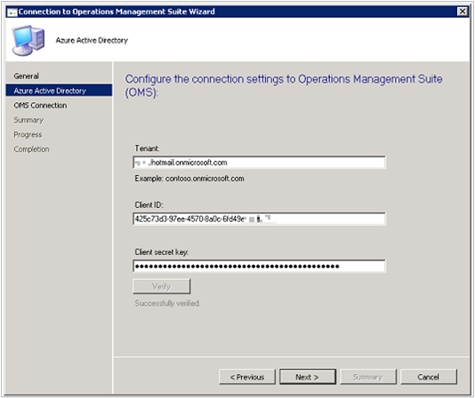
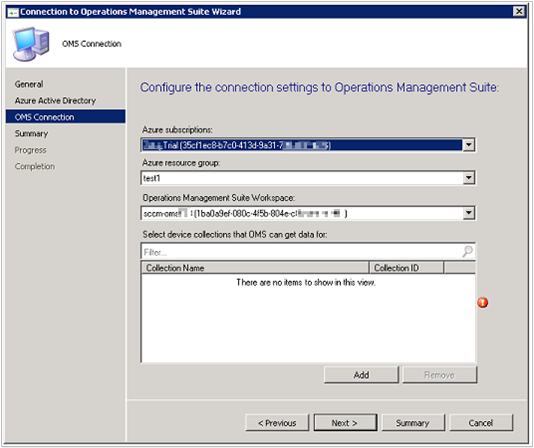
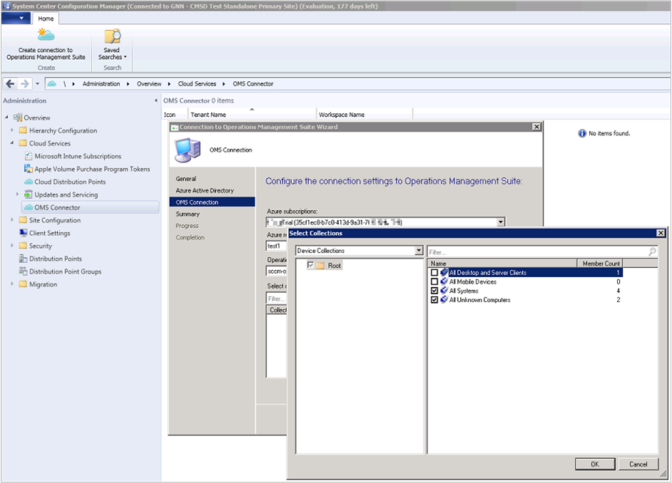
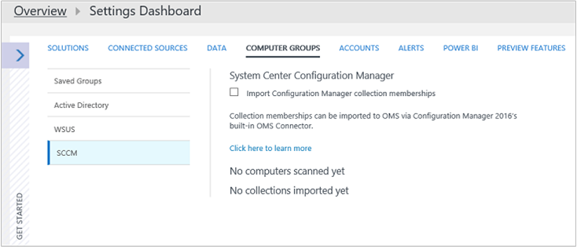
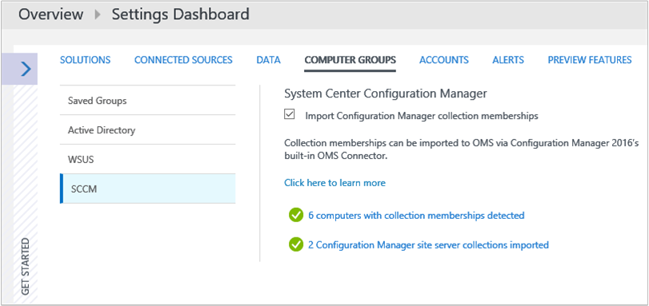

<properties
    pageTitle="Herstellen einer Verbindung Log Analytics mit Konfigurations-Manager | Microsoft Azure"
    description="In diesem Artikel werden die Schritte zum Herstellen einer Verbindung Log Analytics mit Konfigurations-Manager und Analysieren von Daten zu starten."
    services="log-analytics"
    documentationCenter=""
    authors="bandersmsft"
    manager="jwhit"
    editor=""/>

<tags
    ms.service="log-analytics"
    ms.workload="na"
    ms.tgt_pltfrm="na"
    ms.devlang="na"
    ms.topic="article"
    ms.date="08/29/2016"
    ms.author="banders"/>

# Herstellen einer Verbindung Log Analytics mit Konfigurations-Manager

Sie können System Center-Konfigurations-Manager mit Log Analytics in OMS zu synchronisieren Websitesammlung Gerätedaten verbinden. Dadurch wird die Daten aus der Bereitstellung Konfigurations-Manager in OMS verfügbar.

Es gibt eine Reihe von Konfigurations-Manager mit OMS, verbinden, damit es eine Auflistung der gesamten folgt erforderlichen Schritte ein:

1. Klicken Sie in der Azure-Verwaltungsportal Konfigurations-Manager als app-Webanwendung und/oder Web-API registrieren, und stellen Sie sicher, dass Sie die Client-ID und Client geheimen von der Registrierung von Azure Active Directory haben. Finden Sie unter [verwenden Portal zum Erstellen von Active Directory-Anwendung und dem Hauptbenutzer, die Ressourcen zugreifen können](../resource-group-create-service-principal-portal.md) ausführliche Informationen zum Durchführen dieses Schritts.
2. Im Azure-Verwaltungsportal, [über die Berechtigung zum Zugreifen auf OMS-Konfigurations-Manager (der registrierten Web app) bieten](#provide-configuration-manager-with-permissions-to-oms).
3. Im Konfigurations-Manager, [Hinzufügen einer Verbindung mit dem Assistenten zum Hinzufügen von OMS Verbindung](#add-an-oms-connection-to-configuration-manager).
4. Im Konfigurations-Manager können Sie [die Verbindungseigenschaften zu aktualisieren](#update-oms-connection-properties) , wenn der Kennwort oder Client geheime Schlüssel jemals läuft ab oder verloren geht.
5. Zeigen Sie mit Informationen aus dem Portal OMS [herunterladen und installieren Sie den Microsoft-Agent für die Überwachung](#download-and-install-the-agent) auf dem Computer mit den Konfigurations-Manager-Verbindung Website Systemrolle ein. Der Agent sendet Konfigurations-Manager-Daten zu OMS.
6. In OMS, als Computergruppen [Importieren Websitesammlungen im Konfigurations-Manager](#import-collections) .
7. Anzeigen von Daten aus dem Konfigurations-Manager in OMS als [Computergruppen](log-analytics-computer-groups.md).

Sie können weitere Informationen zum Verbinden von Konfigurations-Manager mit OMS [Synchronisieren](https://technet.microsoft.com/library/mt757374.aspx)Daten der Microsoft Operations Management-Suite von Konfigurations-Manager.

## Konfigurations-Manager mit Berechtigungen für OMS bereitstellen

Das folgende Verfahren erläutert die Azure-Verwaltungsportal mit Berechtigungen für den OMS Zugriff auf. Insbesondere müssen Sie die *Rolle "Mitwirkender"* für Benutzer in der Ressourcengruppe gewähren. Wiederum ermöglicht, die der Azure-Verwaltungsportal in Verbindung mit OMS-Konfigurations-Manager.

>[AZURE.NOTE] Sie müssen die Berechtigung zum OMS für Konfigurations-Manager angeben. Andernfalls erhalten Sie eine Fehlermeldung, wenn Sie den Kontokonfigurations-Assistenten im Konfigurations-Manager verwenden.

1. Öffnen Sie das [Azure-Portal](https://portal.azure.com/) , und klicken Sie auf **Durchsuchen** > **Log Analytics (OMS)** , um das Blade Log Analytics (OMS) zu öffnen.  
2. Klicken Sie auf das Blade **Log Analytics (OMS)** klicken Sie auf **Hinzufügen** , um das Blade **OMS Arbeitsbereich** zu öffnen.  
  
3. Klicken Sie auf das Blade **OMS Arbeitsbereich** Angaben Sie folgende, und klicken Sie dann auf **OK**.
  - **OMS-Arbeitsbereich**
  - **Abonnement**
  - **Ressourcengruppe**
  - **Speicherort**
  - **Preise Ebene**  
      

    >[AZURE.NOTE] Im oben genannten Beispiel erstellt eine neue Ressourcengruppe. Die Ressourcengruppe dient nur Konfigurations-Manager Berechtigungen für den Arbeitsbereich OMS in diesem Beispiel zur Verfügung zu stellen.

4. Klicken Sie auf **Durchsuchen** > **Ressourcengruppen** , um das Blade **Ressourcengruppen** zu öffnen.
5. Klicken Sie auf der Ressourcengruppe, die Sie soeben erstellt haben, um zu öffnen, in das Blade **Ressourcengruppen** der &lt;Gruppe Ressourcenname&gt; Einstellungen Blade.  
  
6. In der &lt;Gruppe Ressourcenname&gt; Blade Einstellungen, klicken Sie auf Access-Steuerelement (IAM) zu öffnen der &lt;Gruppe Ressourcenname&gt; Benutzer Blade.  
    
7. In der &lt;Gruppe Ressourcenname&gt; Benutzer Blade, klicken Sie auf **Hinzufügen** , um das Blade **Access hinzufügen** zu öffnen.
8. Klicken Sie in das Blade **Access hinzufügen** auf, **Wählen Sie eine Rolle aus**, und wählen Sie dann die Rolle " **Mitwirkender** ".  
    
9. Klicken Sie auf **Benutzer hinzufügen**, wählen Sie den Benutzer-Konfigurations-Manager, klicken Sie auf **auswählen**, und klicken Sie dann auf **OK**.  
    

## Hinzufügen einer OMS-Verbindungs zu Konfigurations-Manager

Um eine OMS-Verbindung hinzugefügt haben, müssen Ihre Umgebung Konfigurations-Manager eine [Verbindung mit dem Dienst zeigen](https://technet.microsoft.com/library/mt627781.aspx) für Onlinemodus konfiguriert.

1. Wählen Sie im Arbeitsbereich **Verwaltung** der Konfigurations-Manager **OMS-Verbinder**aus. **Hinzufügen von OMS Datenverbindungs-Assistent**wird geöffnet. Wählen Sie **Weiter**aus.

2. Bestätigen Sie auf dem Bildschirm **Allgemein** , dass Sie die folgenden Aktionen getan haben und Sie haben die Details für jedes Element, und wählen Sie dann **Weiter**.
  1. Im Verwaltungsportal Azure haben Sie sich registriert als Webanwendung und/oder API Web app-Konfigurations-Manager, und dass Sie die [Client-ID in der Registrierung](../active-directory/active-directory-integrating-applications.md)verfügen.
  2. Im Verwaltungsportal Azure haben Sie einen app geheimen Schlüssel für die registrierten app in Azure Active Directory erstellt.  
  3. Im Verwaltungsportal Azure haben Sie die registrierten Web app mit Zugriffsberechtigung für OMS bereitgestellt.  
  

3. Konfigurieren Sie auf dem Bildschirm **Azure Active Directory** Ihre Verbindung zum OMS durch die Bereitstellung Ihrer **Mandanten** , **Client-ID** und **Client geheim-Taste** , und wählen Sie dann **Weiter**.  
  

4. Wenn Sie die anderen Verfahren wurde erfolgreich durchgeführt haben, wird automatisch die Informationen auf dem Bildschirm **OMS Verbindungskonfiguration** auf dieser Seite angezeigt. Informationen für die Verbindungseinstellungen sollte für Ihre **Azure-Abonnement** , **Azure Ressourcengruppe** und **Vorgänge Management Suite Arbeitsbereich**angezeigt werden.  
  

5. Der Assistent eine Verbindung mit der OMS-Dienst, der unter Verwendung der Informationen, die Sie eingegeben haben. Wählen Sie die Gerät-Sammlungen, die Sie mit OMS synchronisieren, und klicken Sie dann auf **Hinzufügen**möchten.  
  

6. Überprüfen Sie die Verbindungseinstellungen auf dem Bildschirm **Zusammenfassung** , und wählen Sie dann **Weiter**. **Die Fortschrittsanzeige** zeigt den Status der Verbindung, und klicken Sie dann sollten **abgeschlossen**.

>[AZURE.NOTE] Sie müssen OMS zu der Website der obersten Ebene der Hierarchie eines verbinden. Wenn Sie eine Verbindung mit einem eigenständigen primären Standort OMS herstellen und dann eine Website für die Zentraladministration zum Ihrer Umgebung hinzufügen, müssen Sie löschen und neu erstellen die Verbindung OMS in die neue Hierarchie.

Nachdem Sie Konfigurations-Manager zu OMS vorhanden sind, können Sie hinzufügen oder Entfernen von Websitesammlungen, und zeigen Sie die Eigenschaften der Verbindung OMS.

## Aktualisieren von OMS Verbindungseigenschaften

Wenn Sie ein geheimer Schlüssel Kennwort oder Client jemals läuft ab oder geht verloren, müssen Sie die Verbindungseigenschaften OMS manuell zu aktualisieren.

1. Navigieren Sie im Konfigurations-Manager zu der **Cloud Services** , und wählen Sie dann **OMS Verbinder** , um die **Verbindungseigenschaften OMS** -Seite zu öffnen.
2. Klicken Sie auf dieser Seite auf der Registerkarte **Azure Active Directory** zum Anzeigen Ihrer **Mandanten**, **Client-ID**, **Client geheimen Key Ablauf**. **Überprüfen** des **geheimen Schlüssel Client** , falls dieses abgelaufen ist.

## Herunterladen Sie und installieren Sie den agent

1. Die OMS-Portal [die Agent-Setupdatei vom OMS herunterladen](log-analytics-windows-agents.md#download-the-agent-setup-file-from-oms).
2. Verwenden Sie eine der folgenden Methoden zum Installieren und Konfigurieren des Agents auf dem Computer mit der Konfigurations-Manager Service Verbindung Punkt Website Rolle aus:
  - [Installieren Sie den Agent mithilfe von setup](log-analytics-windows-agents.md#install-the-agent-using-setup)
  - [Installieren Sie den Agent über die Befehlszeile](log-analytics-windows-agents.md#install-the-agent-using-the-command-line)
  - [Installieren Sie den Agent DSC in Azure Automatisierung verwenden](log-analytics-windows-agents.md#install-the-agent-using-dsc-in-azure-automation)

## Importieren von Websitesammlungen

Nachdem Sie eine Verbindung OMS-zum Konfigurations-Manager hinzugefügt und den Agent installiert haben auf dem Computer mit den Konfigurations-Manager-Verbindung, zeigen Sie auf Website Systemrolle, im nächsten Schritt wird zum Importieren von Websitesammlungen in OMS als Computergruppen von Konfigurations-Manager.

Nach dem Import aktiviert ist, wird die Informationen zur Mitgliedschaft alle 3 Stunden abgerufen, um die Websitesammlung Mitgliedschaften auf dem neuesten Stand zu halten. Sie können auch Import zu einem beliebigen Zeitpunkt zu deaktivieren.

1. Klicken Sie im Portal OMS auf **Einstellungen**.
2. Klicken Sie auf der Registerkarte **Computergruppen** , und klicken Sie dann auf die Registerkarte **SCCM** .
3. Wählen Sie **die Websitesammlung Mitgliedschaften importieren Konfigurations-Manager** aus, und klicken Sie dann auf **Speichern**.  
  

## Anzeigen von Daten aus dem Konfigurations-Manager

Nachdem Sie hinzugefügt eine OMS Verbindung zum Konfigurations-Manager und den Agent auf dem Computer mit der Konfigurations-Manager Service Verbindung Punkt Website-Rolle installiert haben, werden die Daten aus der Agent an OMS gesendet. OMS Ihrer Websitesammlungen Konfigurations-Manager als [Computergruppen](log-analytics-computer-groups.md)angezeigt. Sie können die Gruppen von der Seite **Konfigurations-Manager** , klicken Sie unter **Computergruppen** in den **Einstellungen**anzeigen.

Nachdem die Websitesammlungen importiert wurden, können Sie sehen, wie vielen Computern mit Websitesammlung Mitgliedschaften gefunden wurden. Sie können auch die Anzahl der Websitesammlungen anzeigen, die importiert wurden.

Wenn Sie entweder eine klicken, suchen wird geöffnet, für die Anzeige entweder alle der importierten Gruppen oder alle Computer, auf die einzelnen Gruppen angehören. [Log suchen](log-analytics-log-searches.md)können Sie genaue Analyse für Daten-Konfigurations-Manager starten.

## Nächste Schritte

- Verwenden Sie [Log suchen](log-analytics-log-searches.md) , um ausführliche Informationen zu Ihren Konfigurations-Manager-Daten anzuzeigen.
