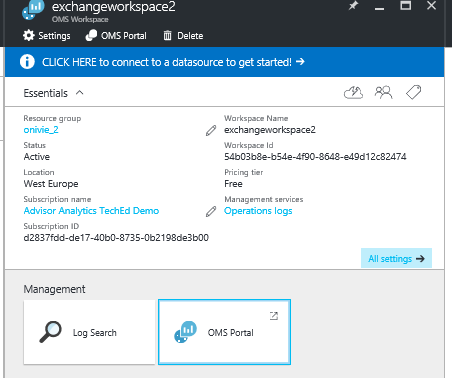
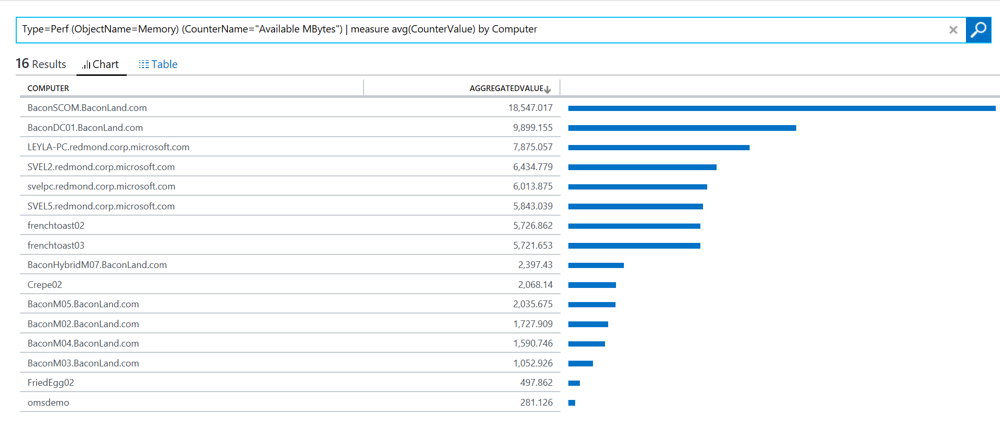

<properties
    pageTitle="Optimieren Sie Ihre Umgebung mit der Dienst Fabric-Lösung in Log Analytics | Microsoft Azure"
    description="Die Lösung Service Fabric können Sie das Risiko und Integritätsstatus Ihrer Dienst Fabric Applications, Micro-Dienste, Knoten und Cluster bewerten."
    services="log-analytics"
    documentationCenter=""
    authors="niniikhena"
    manager="jochan"
    editor=""/>

<tags
    ms.service="log-analytics"
    ms.workload="na"
    ms.tgt_pltfrm="na"
    ms.devlang="na"
    ms.topic="article"
    ms.date="09/21/2016"
    ms.author="nini"/>


# <a name="service-fabric-solution-in-log-analytics"></a>Dienst Fabric-Lösung in Log Analytics

> [AZURE.SELECTOR]
- [Ressourcenmanager](log-analytics-service-fabric-azure-resource-manager.md)
- [PowerShell](log-analytics-service-fabric.md)

Dieser Artikel beschreibt, wie die Lösung Service Fabric in Log Analytics besser erkennen und Behandeln von Problemen über Ihren Cluster Service Fabric.

Die Dienst Fabric-Lösung verwendet Diagnose Azure-Daten aus Ihrem Dienst Fabric virtuellen Computern, durch die Erfassung dieser Daten aus Azure WAD Tabellen. Log Analytics liest dann Fabric Service Framework Ereignisse, einschließlich der **Zuverlässigen Dienstereignisse**, **Akteur**, **Betriebsereignisse**auch **benutzerdefinierte ETW Ereignisse**an. Mit dem Dashboard Lösung können Sie wichtige Punkte beachten und relevante Ereignisse in Ihrer Umgebung Dienst Fabric anzeigen.

Um mit der Lösung beginnen, müssen Sie Ihren Cluster Service Fabric zu einem Arbeitsbereich Log Analytics verbinden. Hier sind drei Szenarios zu berücksichtigen:

1. Wenn Sie nicht Ihren Cluster Service Fabric bereitgestellt haben, führen Sie die Schritte in ***Bereitstellen einer Dienst Fabric Cluster verbunden zu einem Arbeitsbereich Log Analytics*** Bereitstellen eines neuen Clusters und als Bericht Log Analytics konfiguriert haben.

2. Wenn Sie Datenquellen aus Ihrer ' Hosts ' mit anderen OMS-Lösungen, wie z. B. Sicherheit auf Ihrem Dienst Fabric Cluster sammeln müssen, führen Sie die Schritte in ***bereitstellen, die einem Dienst Fabric Cluster mit OMS Arbeitsbereich mit der Erweiterung des virtuellen Computer installiert verbunden.***

3. Wenn Sie Ihren Cluster Service Fabric und gewünschte für die Verbindung zum Log Analytics bereits bereitgestellt haben, führen Sie die Schritte in ***Hinzufügen eines vorhandenen Speicher-Kontos zu Log Analytics.***


##<a name="deploy-a-service-fabric-cluster-connected-to-a-log-analytics-workspace"></a>Bereitstellen eines Service Fabric Cluster zu einem Arbeitsbereich Log Analytics verbunden.
Diese Vorlage führt Folgendes aus:


1. Wird einen Azure Service Fabric Cluster bereits eine Verbindung mit einem Arbeitsbereich Log Analytics bereitgestellt. Sie haben die Möglichkeit, einen neuen Arbeitsbereich erstellen, während Sie die Vorlage, oder geben Sie den Namen eines bereits vorhandenen Log Analytics Workspace.
2. Der Arbeitsbereich Log Analytics hinzugefügt diagnostic Speicherkonto.
3. Ermöglicht die Lösung Service Fabric im Arbeitsbereich Log Analytics an.

[](https://portal.azure.com/#create/Microsoft.Template/uri/https%3A%2F%2Fraw.githubusercontent.com%2Fazure%2Fazure-quickstart-templates%2Fmaster%2Fservice-fabric-oms%2F%2Fazuredeploy.json)


Nachdem Sie oben auf die Schaltfläche bereitstellen auswählen, werden Sie mit Parametern zum Bearbeiten der Azure-Portal werden. Achten Sie darauf, dass Sie eine neue Ressourcengruppe erstellen, wenn Sie einen neuen Namen ein Protokoll Analytics Arbeitsbereich Eingabemethoden: 


Akzeptieren Sie die Vertragsbedingungen, und drücken Sie die "Erstellen", um die Bereitstellung zu starten. Nach Abschluss die Bereitstellung auftreten Sie den neuen Arbeitsbereich und Cluster erstellt und die WADServiceFabric * Ereignis, WADWindowsEventLogs und WADETWEvent Tabellen hinzugefügt:


##<a name="deploy-a-service-fabric-cluster-connected-to-an-oms-workspace-with-vm-extension-installed"></a>Bereitstellen einer Dienst Fabric Cluster verbunden mit OMS Arbeitsbereich mit der Erweiterung des virtuellen Computer installiert ist.
Diese Vorlage führt Folgendes aus:

1. Wird einen Azure Service Fabric Cluster bereits eine Verbindung mit einem Arbeitsbereich Log Analytics bereitgestellt. Sie können einen neuen Arbeitsbereich erstellen oder ein vorhandenes zu verwenden.
2. Fügt die Diagnose Speicherkonten in den Arbeitsbereich Log Analytics hinzu.
3. Ermöglicht die Lösung Service Fabric im Log Analytics-Arbeitsbereich.
4. Installiert die MMA-Agent-Erweiterung in jeder virtuellen Computer Maßstab in Ihrem Dienst Fabric Cluster festlegen. Mit dem MMA-Agent installiert haben können Sie zu Ihrem Knoten Performance-Werte anzeigen.


[](https://portal.azure.com/#create/Microsoft.Template/uri/https%3A%2F%2Fraw.githubusercontent.com%2Fazure%2Fazure-quickstart-templates%2Fmaster%2Fservice-fabric-vmss-oms%2F%2Fazuredeploy.json)


Denselben Schritten oben die erforderlichen Eingabeparameter, und Starten eines Deaktivieren einer bereitstellungs. Erneut sollten Sie den neuen Arbeitsbereich, Cluster und WAD Tabellen alle erstellten sehen:


###<a name="viewing-performance-data"></a>Anzeigen von Performance-Daten

So zeigen Sie Leistungsdatensammlungs aus Ihrem Knoten an:
</br>
- Starten des Log Analytics-Arbeitsbereichs aus dem Azure-Portal an.



- Wechseln Sie im linken Bereich auf Einstellungen, und wählen Sie die Daten >> Windows-Datenquellen >> 'Die ausgewählte Leistungsindikatoren hinzufügen': 

- Log-Suche verwenden Sie die folgenden Abfragen, um in wichtigen Kriterien zu Ihrem Knoten ausführlicher behandelt:
</br>

    ein. Vergleichen die durchschnittliche CPU-Auslastung über alle Ihre Knoten in der letzten Stunde um anzuzeigen, welche Knoten Problemen und auf welche Zeitintervall hatte ein Knoten einer Sammlung:

    ``` Type=Perf ObjectName=Processor CounterName="% Processor Time"|measure avg(CounterValue) by Computer Interval 1HOUR. ```

    


    b. Zeigen Sie auf den einzelnen Knoten mit dieser Abfrage ähnlich wie Liniendiagramme für verfügbaren Arbeitsspeicher an:

    ```Type=Perf ObjectName=Memory CounterName="Available MBytes Memory" | measure avg(CounterValue) by Computer Interval 1HOUR.```

    Verwenden Sie diese Abfrage, um eine Liste aller Knoten, mit den genauen Mittelwert der mittlere Wert für verfügbare MB für jeden Knoten anzuzeigen:

    ```Type=Perf (ObjectName=Memory) (CounterName="Available MBytes") | measure avg(CounterValue) by Computer ```

    


    c. In der Groß-/Kleinschreibung, die Sie in einem bestimmten Knoten Drilldowns durch die stündlich Mittelwert, minimum, maximum und 75-Quantil CPU-Auslastung untersuchen möchten, können Sie mithilfe dieser Abfrage (ersetzen Feld "Computer") ausführen können:

    ```Type=Perf CounterName="% Processor Time" InstanceName=_Total Computer="BaconDC01.BaconLand.com"| measure min(CounterValue), avg(CounterValue), percentile75(CounterValue), max(CounterValue) by Computer Interval 1HOUR```

    

    Lesen Sie weitere Informationen zu Performance-Werte in Log Analytics [here]. (https://blogs.technet.microsoft.com/msoms/tag/metrics/)


##<a name="adding-an-existing-storage-account-to-log-analytics"></a>Hinzufügen eines vorhandenen Speicher-Kontos zu Log Analytics

Diese Vorlage fügt einfach Ihrer vorhandenen Speicherkonten zu einem neuen oder vorhandenen Log Analytics-Arbeitsbereich.
</br>

[](https://portal.azure.com/#create/Microsoft.Template/uri/https%3A%2F%2Fraw.githubusercontent.com%2FAzure%2Fazure-quickstart-templates%2Fmaster%2Foms-existing-storage-account%2Fazuredeploy.json)

>[AZURE.NOTE] Wenn Sie mit einem bereits vorhandenen Protokoll Analytics Arbeitsbereich arbeiten, wählen Sie bei der Auswahl einer Ressourcengruppe "Vorhandene verwenden" und suchen Sie nach der Ressourcengruppe, die den Arbeitsbereich OMS enthält. Erstellen Sie eine neue eine If andernfalls.


Nachdem Sie diese Vorlage bereitgestellt wurde, werden Sie finden in der Speicher-Konto mit dem Arbeitsbereich Log Analytics verbunden sein. In diesem Fall hinzugefügt der Exchange-Arbeitsbereich über erstellten eine weitere Speicher-Konto.


## <a name="view-service-fabric-events"></a>Anzeigen von Ereignissen Fabric Service

Sobald die Bereitstellungen abgeschlossen werden und die Lösung Service Fabric im Arbeitsbereich aktiviert wurde, wählen Sie die **Fabric Service** -Kachel im Log Analytics-Portal zu das Dienst Fabric Dashboard zu starten. Das Dashboard enthält die Spalten in der folgenden Tabelle. Jede Spalte listet die obersten zehn Ereignisse nach übereinstimmenden Spalte die Kriterien für den angegebenen Zeitraum zählen. Sie können ein Protokoll suchen ausführen, die die gesamte Liste, indem Sie auf unten rechts der einzelnen Spalten **finden Sie unter alle** oder indem Sie auf die Überschrift der Spalte enthält.

| **Dienst Fabric-Ereignis** | **Beschreibung** |
| --- | --- |
| Wichtige Punkte | Eine Anzeige der Probleme wie RunAsyncFailures RunAsynCancellations und Knoten sollen Feldüberschriften. |
| Betrieb Ereignisse | Wichtige Betrieb Ereignisse wie Anwendungsupgrade und Bereitstellungen. |
| Zuverlässigen Service Ereignisse | Wichtige zuverlässigen Service Ereignisse solche Runasyncinvocations ein. |
| Akteur Ereignisse | Wichtige Akteur Ereignisse durch Ihre Micro-Dienste, wie eine Methode Akteur, Akteur Vorgänge und Deactivations usw. ausgelöste Ausnahmen generiert werden. |
| Anwendungsereignisse | Alle benutzerdefinierten ETW von generierte Ereignisse einer Anwendung. |


Die folgende Tabelle zeigt Datensammlungsmethoden und andere Details, wie Daten für den Dienst Fabric erfasst werden.

| Plattform | Direkte Agent | SCOM agent | Azure-Speicher | SCOM erforderlich? | SCOM Agentdaten per Management Group unter gesendeten | Häufigkeit Collection |
|---|---|---|---|---|---|---|
|Windows||| |            ||10 Minuten |


>[AZURE.NOTE] Sie können den Umfang der folgenden Ereignisse in der Dienst Fabric-Lösung ändern, indem Sie oben auf dem Dashboard **Daten basieren auf der letzten 7 Tage** auf. Sie können auch innerhalb der letzten 7 Tage, 1 Tag oder sechs Stunden generierte Ereignisse anzeigen. Oder Sie können **benutzerdefinierte** an einen benutzerdefinierten Datumsbereich auswählen.


## <a name="next-steps"></a>Nächste Schritte

- Verwenden Sie [Log durchsucht Log Analytics](log-analytics-log-searches.md) detaillierte Dienst Fabric Ereignisdaten anzeigen.
