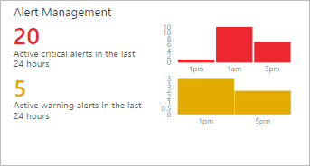

<properties
   pageTitle="Benachrichtigen Management-Lösung in Vorgänge Management Suite (OMS) | Microsoft Azure"
   description="Die Benachrichtigung Management-Lösung in Log Analytics hilft Ihnen der alle der Warnungen in Ihrer Umgebung zu analysieren.  Zusätzlich zum Konsolidieren von Benachrichtigungen in OMS generiert, importiert Benachrichtigungen aus verbundenen System Center Operations Manager (SCOM) Management Gruppen in Log Analytics."
   services="log-analytics"
   documentationCenter=""
   authors="bwren"
   manager="jwhit"
   editor="tysonn" />
<tags
   ms.service="operations-management-suite"
   ms.devlang="na"
   ms.topic="article"
   ms.tgt_pltfrm="na"
   ms.workload="infrastructure-services"
   ms.date="10/06/2016"
   ms.author="bwren" />

# Benachrichtigen Sie Management-Lösung in Vorgänge Management Suite (OMS)

 Die Benachrichtigung Management-Lösung hilft Ihnen der alle der Warnungen in Ihrer Umgebung zu analysieren.  Zusätzlich zum Konsolidieren von Benachrichtigungen in OMS generiert, importiert Benachrichtigungen aus verbundenen System Center Operations Manager (SCOM) Management Gruppen in Log Analytics.  In Umgebungen mit mehreren Management Gruppen wird die Alert-Management-Lösung eine konsolidierte Übersicht Benachrichtigungen über alle Management Gruppen bereitstellen.

## Erforderliche Komponenten

- Zum Importieren von Benachrichtigungen aus SCOM erfordert diese Lösung eine Verbindung zwischen dem Arbeitsbereich OMS und einer Management Group unter SCOM mithilfe des Prozesses [Verbinden Operations Manager Log Analytics](log-analytics-om-agents.md)beschrieben.  

## Konfiguration

Hinzufügen der Alert Management-Lösung in Ihren OMS Arbeitsbereich mithilfe des Prozesses [Hinzufügen Lösungen](log-analytics-add-solutions.md)beschrieben.  Es ist keine weitere Konfiguration erforderlich.

## Management packs

Wenn Ihre SCOM Management Group unter zu dem Arbeitsbereich OMS angeschlossen ist, werden dann die folgenden Management Packs in SCOM installiert, wenn Sie diese Lösung hinzufügen.  Es gibt keine Konfiguration oder Wartung der diese Management Packs erforderlich.  

- Microsoft System Center Advisor Alert-Management (Microsoft.IntelligencePacks.AlertManagement)

Weitere Informationen darüber, wie die Lösung Management Packs aktualisiert werden finden Sie unter [Log Analytics Operations Manager verbinden](log-analytics-om-agents.md).

## Datensammlung

### Agents

Die folgende Tabelle beschreibt die verbundenen Datenquellen, die durch diese Lösung unterstützt werden.

| Verbundenen Datenquellen | Support | Beschreibung |
|:--|:--|:--|
| [Windows-agents](log-analytics-windows-agents.md) | Nein | Direkte Windows-Agents generieren nicht SCOM Benachrichtigungen. |
| [Linux-agents](log-analytics-linux-agents.md) | Nein | Direkte Linux-Agents generieren nicht SCOM Benachrichtigungen. |
| [Management Group unter SCOM](log-analytics-om-agents.md) | Ja | Benachrichtigungen, die auf SCOM Agents generiert werden werden an die Gruppe Management übermittelt, und klicken Sie dann an Log Analytics weitergeleitet.  Eine direkte Verbindung SCOM-Agents mit Log Analytics ist nicht erforderlich. Benachrichtigen Daten werden aus der Gruppe Management an Repository OMS weitergeleitet. |
| [Azure-Speicher-Konto](log-analytics-azure-storage.md) | Nein | SCOM Benachrichtigungen werden in Azure-Speicherkonten nicht gespeichert. |

### Häufigkeit Collection

In OMS generierte Warnungen stehen für die Lösung sofort.  Benachrichtigen Daten werden aus der Management Group unter SCOM an Log Analytics alle 3 Minuten gesendet.  

## Verwenden die Lösung

Wenn Sie die Benachrichtigung Management-Lösung in den Arbeitsbereich OMS hinzufügen, wird die Kachel **Alert Management** des Dashboards OMS hinzugefügt werden.  Diese Kachel zeigt die Anzahl und grafisch dargestellt, die Anzahl der aktuell aktiv Benachrichtigungen, die innerhalb der letzten 24 Stunden generiert wurden.  Sie können dieses Zeitraums nicht ändern.

Klicken Sie auf die Kachel **Alert-Management** , um das **Alert Management** Dashboard zu öffnen.  Das Dashboard enthält die Spalten in der folgenden Tabelle.  Jede Spalte werden die obersten zehn Benachrichtigungen zählen Kriterien der Spalte für den angegebenen Bereich und Zeitraums aufgelistet.  Sie können ein Protokoll suchen ausführen, die die gesamte Liste, indem Sie auf **Alles anzeigen** am unteren Rand der Spalte oder indem Sie auf die Überschrift der Spalte bereitstellt.

| Spalte| Beschreibung |
|:--|:--|
| Kritische Benachrichtigungen | Alle Warnungen mit einer Schwere der gruppiert nach Name Warnung kritisch.  Klicken Sie auf der Name einer Warnung eine Log-Suche zurückgeben alle Datensätze für diese Benachrichtigung ausführen. |
| Warnung Benachrichtigungen | Alle Warnungen mit einer Schwere der Warnung gruppiert nach Name Warnung.  Klicken Sie auf der Name einer Warnung eine Log-Suche zurückgeben alle Datensätze für diese Benachrichtigung ausführen. |
| Aktive SCOM Benachrichtigungen | Alle SCOM Benachrichtigungen mithilfe einer state andere als *geschlossen* gruppiert nach Quelle, die die Benachrichtigung generiert. |
| Alle aktiven Benachrichtigungen | Alle Warnungen mit einer beliebigen schwere gruppiert nach Name Warnung. Nur enthält SCOM Benachrichtigungen mit einem anderen Status als *geschlossen*.|

Wenn Sie einen Bildlauf nach rechts durchführen, wird das Dashboard mehrere allgemeine Abfragen angegeben werden, denen Sie auf klicken, um eine [Log-Suche](log-analytics-log-searches.md) für benachrichtigen Daten durchführen.

## Umfang und Zeitbereich

Standardmäßig ist der Umfang der in der Benachrichtigung Management-Lösung analysiert Warnungen aus allen verbundenen Management Gruppen innerhalb der letzten 7 Tage generiert.  

- Wenn Management Gruppen in die Analyse einbezogen ändern möchten, klicken Sie auf **Bereich** oben auf dem Dashboard.  Sie können entweder **Global** für alle verbundenen Management Gruppen oder **Durch Management Group unter** wählen Sie eine einzelne Management Group unter auswählen.

- Wählen Sie am oberen Rand des Dashboards **ausgehend von Daten** aus, um den Zeitbereich des Benachrichtigungen zu ändern.  Sie können innerhalb der letzten 7 Tage, 1 Tag oder 6 Stunden generierte Warnungen auswählen.  Oder Sie können **benutzerdefinierte** auswählen, und geben Sie einen benutzerdefinierten Datumsbereich.

## Analytics Protokolldatensätze

Die Benachrichtigung Management-Lösung analysiert einen beliebigen Datensatz, der einen Typ von **Alert**.  Es wird auch Benachrichtigungen aus SCOM importieren und erstellen Sie einen entsprechenden Eintrag für jede mit einem Typ von **Benachrichtigung** und einem SourceSystem von **OpsManager**.  Diese Datensätze verfügen über die Eigenschaften in der folgenden Tabelle.  

| Eigenschaft | Beschreibung |
|:--|:--|
| Typ | *Benachrichtigen* |
| SourceSystem | *OpsManager* |
| AlertContext | Details des Datenelements, das die Benachrichtigung in XML-Format generiert werden soll. |
| AlertDescription | Detaillierte Beschreibung der Warnung. |
| AlertId | GUID der Warnung. |
| Existenter Warnname | Name der Warnung. |
| AlertPriority | Priorität der Warnung an. |
| AlertSeverity | Die Sicherheitsebene der Benachrichtigung. |
| AlertState | Neueste Auflösungsstatus der Warnung. |
| Zuletzt geändert von | Name des Benutzers, dem die Warnung zuletzt geändert. |
| "Verwaltungsgruppenname" | Name der Management Group, bei denen die Benachrichtigung generiert wurde. |
| RepeatCount | Die Anzahl von Zeiträumen, die dieselbe Warnung, für das gleiche generiert wurde überwacht Objekt seit gelöst. |
| ResolvedBy | Name des Benutzers, dem die Benachrichtigung gelöst. Leer, falls die Benachrichtigung noch nicht gelöst wurde. |
| SourceDisplayName | Anzeigename des Objekts, das die Warnung generiert Überwachung. |
| SourceFullName | Vollständige Name des Objekts, das die Warnung generiert Überwachung. |
| TicketId | Ticket-ID für die Benachrichtigung, wenn die Umgebung SCOM in einem Prozess zum Zuweisen von Tickets für Benachrichtigungen integriert ist.  Leeren des keine Tickets ID wird zugewiesen. |
| TimeGenerated | Datum und Uhrzeit, die die Benachrichtigung erstellt wurde. |
| TimeLastModified | Datum und Uhrzeit, die die Warnung zuletzt geändert wurde. |
| TimeRaised | Datum und Uhrzeit, die die Benachrichtigung generiert wurde. |
| TimeResolved | Datum und Uhrzeit, die die Warnung gelöst wurde. Leer, falls die Benachrichtigung noch nicht gelöst wurde. |

## Beispiel für Log Suchbegriffe

Die folgende Tabelle enthält die Stichprobe Log gegen benachrichtigen Datensätze, die von dieser Lösung erfasst.  

| Abfrage | Beschreibung |
|:--|:--|
| Typ = Alert SourceSystem = OpsManager AlertSeverity = Fehler TimeRaised > jetzt - 24 Stunden | Kritische Benachrichtigungen ausgelöst, während der letzten 24 Stunden |
| Typ = Alert AlertSeverity = Warnung TimeRaised > jetzt - 24 Stunden | Warnung Benachrichtigungen ausgelöst, während der letzten 24 Stunden  |
| Typ = Alert SourceSystem = OpsManager AlertState! = geschlossenen TimeRaised > jetzt - 24 Stunden & #124; Messen Sie count() als Anzahl von SourceDisplayName | Datenquellen mit der aktiven Benachrichtigungen ausgelöst, während der letzten 24 Stunden |
| Typ = Alert SourceSystem = OpsManager AlertSeverity = Fehler TimeRaised > jetzt - 24-Stunden-AlertState! = geschlossen | Kritische Benachrichtigungen ausgelöst, während der letzten 24 Stunden, die noch aktiv sind |
| Typ = Alert SourceSystem = OpsManager TimeRaised > jetzt - 24-Stunden-AlertState = geschlossen | Benachrichtigungen ausgelöst, während der letzten 24 Stunden, die jetzt geschlossen werden |
| Typ = Alert SourceSystem = OpsManager TimeRaised > jetzt 1 Tag & #124; Messen Sie count() als Anzahl von AlertSeverity | Während der vergangenen 1 Tag gruppiert nach deren schwere ausgelöst Benachrichtigungen |
| Typ = Alert SourceSystem = OpsManager TimeRaised > jetzt 1 Tag & #124; RepeatCount Desc sortieren | Während der vergangenen 1 Tag sortiert nach deren wiederholen Count-Wert ausgelöst Benachrichtigungen |

## Nächste Schritte

- Erfahren Sie mehr über [Warnungen im Log Analytics](log-analytics-alerts.md) , Details zum Generieren von Benachrichtigungen aus Log Analytics.
