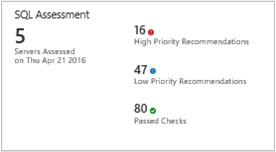

<properties
    pageTitle="Optimieren Sie Ihre Umgebung mit der Bewertung der SQL-Lösung in Log Analytics | Microsoft Azure"
    description="Die Bewertung der SQL-Lösung können Sie um die Risiken und Integritätsstatus Ihrer Server-Umgebungen in regelmäßigen Abständen zu ermitteln."
    services="log-analytics"
    documentationCenter=""
    authors="bandersmsft"
    manager="jwhit"
    editor=""/>

<tags
    ms.service="log-analytics"
    ms.workload="na"
    ms.tgt_pltfrm="na"
    ms.devlang="na"
    ms.topic="article"
    ms.date="08/11/2016"
    ms.author="banders"/>

# <a name="optimize-your-environment-with-the-sql-assessment-solution-in-log-analytics"></a>Optimieren Sie Ihre Umgebung mit der Bewertung der SQL-Lösung in Log Analytics


Die Bewertung der SQL-Lösung können Sie um die Risiken und Integritätsstatus Ihrer Server-Umgebungen in regelmäßigen Abständen zu ermitteln. In diesem Artikel helfen Ihnen die Lösung installieren, sodass Sie auf mögliche Probleme Maßnahmen ergreifen können.

Diese Lösung bietet eine Liste mit Prioritätsstufe empfohlenen speziell für Ihre Serverinfrastruktur bereitgestellten. Die Empfehlungen über sechs eingestuft werden Schwerpunkte dessen Hilfe Sie schnell das Risiko verstehen und Ausführen von Maßnahmen.

Empfehlungen im Zusammenhang mit der vorgenommenen basieren auf das Wissen und die Erfahrung von Microsoft-Experten aus Tausende von Kundenbesuchen. Jede Empfehlungen bietet eine Anleitung zum warum möglicherweise ein Problem für Sie unerheblich, und wie Sie die vorgeschlagenen Änderungen implementieren.

Sie können den Fokus Bereiche auswählen, die für Ihre Organisation wichtigsten und Nachverfolgen Ihrer Fortschritt im Hinblick auf Computern Risiko frei / fehlerfrei eingerichtet.

Nachdem Sie die Lösung hinzugefügt haben, und eine Bewertung abgeschlossen, Zusammenfassung ist werden Informationen für Bereiche des Fokus auf dem Dashboard **SQL-Bewertung** für die Infrastruktur in Ihrer Umgebung angezeigt. In den folgenden Abschnitten wird beschrieben, wie die Informationen auf dem Dashboard **SQL-Bewertung** zu verwenden, wo Sie anzeigen und dann die empfohlene Aktionen für eine SQL Server-Infrastruktur ausführen können.




## <a name="installing-and-configuring-the-solution"></a>Installieren und konfigurieren die Lösung
SQL-Bewertung funktioniert mit allen derzeit unterstützten Versionen von SQL Server für die Standard, Developer und Enterprise-Editionen.

Verwenden Sie die folgende Informationen zum Installieren und konfigurieren die Lösung.

- Agents müssen auf Servern installiert werden, die SQL Server installiert ist.
- Die Bewertung der SQL-Lösung erfordert .NET Framework 4 auf jedem Computer, die ein OMS-Agent ist installiert.
- Wenn den Operations Manager-Agent mit SQL-Bewertung verwenden zu können, müssen Sie ein Operations Manager Run-As-Konto verwenden. Weitere Informationen finden Sie unter [Operations Manager ausführen als Konten für OMS](#operations-manager-run-as-accounts-for-oms) unter.

    >[AZURE.NOTE] Der Agent MMA unterstützt Operations Manager Run-As Konten nicht.

- Fügen Sie die Bewertung SQL-Lösung in Ihren OMS Arbeitsbereich mithilfe des Prozesses [Hinzufügen Log Analytics Lösungen aus dem Lösungskatalog](log-analytics-add-solutions.md)beschrieben. Es ist keine weitere Konfiguration erforderlich.

>[AZURE.NOTE] Nachdem Sie die Lösung hinzugefügt haben, wird die Datei AdvisorAssessment.exe auf Servern mit Agents hinzugefügt. Konfigurationsdaten gelesen und dann an die OMS-Dienst in der Cloud für die Verarbeitung gesendet werden. Logik wird angewendet, um die empfangenen Daten und der Cloud-Dienst Einträge die Daten.

## <a name="sql-assessment-data-collection-details"></a>Einzelheiten zur Datensammlung SQL-Bewertung

SQL-Bewertung sammelt WMI-Daten, Registrierungsdaten, Performance-Daten und SQL Server Management dynamische Anzeigen der Ergebnisse mit der Agents, die Sie aktiviert haben.

Die folgende Tabelle zeigt Datensammlungsmethoden für Agents, ob Operations Manager (SCOM) erforderlich ist, und wie oft Daten von einem Agent erfasst.

| Plattform | Direkte Agent | SCOM agent | Azure-Speicher | SCOM erforderlich? | SCOM Agentdaten per Management Group unter gesendeten | Häufigkeit Collection |
|---|---|---|---|---|---|---|
|Windows||||    ||   7 Tage|

## <a name="operations-manager-run-as-accounts-for-oms"></a>Vorgänge Manager ausführen als Konten für OMS

Melden Sie sich Analytics OMS verwendet die Operations Manager-Agents und Verwaltung der Gruppe zum Sammeln und Senden von Daten an den OMS-Dienst. OMS baut auf Management Packs für Auslastung bereitstellen hinzufügen Services Wert. Jede Arbeitsbelastung erfordert Arbeitsbelastung-spezifischen Berechtigungen zum Ausführen von Management Packs in einer anderen sicherheitsgrupe Kontext, wie etwa ein Domänenkonto. Sie müssen Anmeldeinformationen bereitstellen, indem Sie ein Operations Manager ausführen als Konto konfigurieren.

Verwenden Sie die folgende Informationen, um das Konto Operations Manager ausführen als für SQL-Bewertung festzulegen.

### <a name="set-the-run-as-account-for-sql-assessment"></a>Legen Sie das Konto ausführen als für SQL-Bewertung

 Wenn Sie bereits das SQL Server Management Pack verwenden, sollten Sie diesem Konto ausführen als verwenden.

#### <a name="to-configure-the-sql-run-as-account-in-the-operations-console"></a>So konfigurieren Sie das Konto SQL ausführen als in der Operations

>[AZURE.NOTE] Wenn Sie die direkte OMS-Agent, statt der SCOM-Agent verwenden, wird das Management Pack immer im Kontext des Kontos Lokales System ausgeführt. Überspringen Sie die Schritte 1 bis 5 unten, und führen Sie entweder den T-SQL oder Powershell Beispiel Systemkonto: als den Benutzernamen angeben.

1. Öffnen Sie in Operations Manager die Vorgänge-Verwaltungskonsole, und klicken Sie dann auf **Verwaltung**.

2. Klicken Sie unter **Als Konfiguration ausführen**klicken Sie auf **Profile**und öffnen Sie **OMS SQL Bewertung Ausführen als Profil**zu.

3. Klicken Sie auf der Seite **Ausführen als Konten** auf **Hinzufügen**.

4. Wählen Sie ein Windows ausführen als Konto, das die Anmeldeinformationen für SQL Server enthält, oder klicken Sie auf **neu** , um eine zu erstellen.
    >[AZURE.NOTE] Führen Sie als Kontotyp muss Windows. Das Ausführen als Konto muss auch in der Gruppe Lokale Administratoren alle Instanzen von SQL Server hosten unter Windows Server.

5. Klicken Sie auf **Speichern**.

6. Ändern Sie, und führen Sie die im folgende Beispiel der T-SQL auf jede SQL Server-Instanz den minimale Berechtigungen für Ausführen als Konto in SQL-Bewertung ausführen gewähren. Sie müssen jedoch nicht vorgehen, wenn Sie ein Konto ausführen als bereits Teil der Rolle Sysadmin auf SQL Server-Instanzen ist.

```
---
    -- Replace <UserName> with the actual user name being used as Run As Account.
    USE master

    -- Create login for the user, comment this line if login is already created.
    CREATE LOGIN [<UserName>] FROM WINDOWS

    -- Grant permissions to user.
    GRANT VIEW SERVER STATE TO [<UserName>]
    GRANT VIEW ANY DEFINITION TO [<UserName>]
    GRANT VIEW ANY DATABASE TO [<UserName>]

    -- Add database user for all the databases on SQL Server Instance, this is required for connecting to individual databases.
    -- NOTE: This command must be run anytime new databases are added to SQL Server instances.
    EXEC sp_msforeachdb N'USE [?]; CREATE USER [<UserName>] FOR LOGIN [<UserName>];'

```
#### <a name="to-configure-the-sql-run-as-account-using-windows-powershell"></a>So konfigurieren Sie das SQL ausführen als Konto mithilfe von Windows PowerShell

Öffnen Sie ein PowerShell-Fenster, und führen Sie das folgende Skript aus, nachdem Sie ihn durch Ihre Daten aktualisiert haben:

```

    import-module OperationsManager
    New-SCOMManagementGroupConnection "<your management group name>"
     
    $profile = Get-SCOMRunAsProfile -DisplayName "OMS SQL Assessment Run As Profile"
    $account = Get-SCOMrunAsAccount | Where-Object {$_.Name -eq "<your run as account name>"}
    Set-SCOMRunAsProfile -Action "Add" -Profile $Profile -Account $Account
```

## <a name="understanding-how-recommendations-are-prioritized"></a>Grundlegendes zu wie Empfehlungen Priorität zugewiesen sind

Jeder Empfehlungen vorgenommen wird gewichteten Werten angegeben, die die relative Wichtigkeit von empfohlen identifiziert. Es werden nur die zehn wichtigsten Empfehlungen angezeigt.

### <a name="how-weights-are-calculated"></a>Wie werden-Stärken berechnet.

Wobei werden zusammengefasste Werte basierend auf drei wichtige Faktoren:

- Die *Wahrscheinlichkeit* , dass ein Problem identifiziert Probleme verursachen kann. Eine höhere Wahrscheinlichkeit entspricht eine größere allgemeine Bewertung für empfohlen.

- Die *Auswirkungen* des Problems auf Ihrer Organisation, wenn es ein Problem verursacht. Eine höhere Auswirkung entspricht eine größere allgemeine Bewertung für empfohlen.

- Der *Aufwand* erforderlich, um die Empfehlungen implementieren. Eine höhere Initiative entspricht eine kleinere allgemeine Bewertung für empfohlen.

Die Gewichtung für jede Empfehlungen ist ausgedrückt als Prozentsatz der das Gesamtergebnis für jeden Fokusbereich zur Verfügung. Beispielsweise weist eine Empfehlungen im Fokusbereich Sicherheit und Einhaltung von Vorschriften eine Bewertung von 5 %, wird dieser Empfehlungen implementieren Ihre allgemeine Sicherheit und Kompatibilität Punktzahl von 5 % vergrößern

### <a name="focus-areas"></a>Fokus Bereiche

**Sicherheit und Einhaltung von Vorschriften** – in diesem Fokusbereich zeigt Empfehlungen für potenzielle Sicherheitsrisiken und Verletzung, Unternehmensrichtlinien und technische, rechtliche Hinweise und gesetzlichen Vorschriften.

**Verfügbarkeit und Geschäftskontinuität** – in diesem Fokusbereich zeigt Empfehlungen für die Verfügbarkeit von Diensten, Stabilität Ihrer Infrastruktur und Schutz des Unternehmens.

**Leistung und Skalierbarkeit** – in diesem Fokusbereich zeigt Empfehlungen Ihrer Organisation helfen IT-Infrastruktur wächst, stellen Sie sicher, dass Ihre IT-Umgebung aktuelle Leistung Anforderungen erfüllt, und zum Ändern von Infrastruktur Anforderungen reagieren.

**Upgrade-Migration und-Bereitstellung** – in diesem Fokusbereich zeigt Empfehlungen, mit deren Hilfe Sie das upgrade, migrieren und Bereitstellen von SQL Server in eine vorhandene Infrastruktur.

**Vorgänge und Überwachung** – in diesem Fokusbereich zeigt Empfehlungen besser optimieren Sie alle Ihre IT-Vorgänge, Wartung implementieren und Leistung maximieren.

**Ändern und Konfiguration Verwaltung** – in diesem Fokusbereich zeigt Empfehlungen helfen täglichen Vorgänge schützen, stellen Sie sicher, dass Änderungen nicht negativ beeinflussen Ihrer Infrastruktur, Steuerelement Änderungskontrollverfahren, einführen zu verfolgen und Überwachen von Systemkonfigurationen.

### <a name="should-you-aim-to-score-100-in-every-focus-area"></a>Sie sollten (100 %) in jedem Fokusbereich erhalten sollen?

Nicht unbedingt. Die Empfehlungen basieren auf die Kenntnisse und Erfahrung gewonnen von Microsoft-Experten über Tausende von Kundenbesuchen. Jedoch keine zwei Server-Infrastruktur sind gleich, und Empfehlungen im Zusammenhang mit bestimmten möglicherweise mehr oder weniger für Sie interessanten. Einige Mittelpunkt möglicherweise beispielsweise weniger relevant, wenn Ihre virtuellen Computer nicht mit dem Internet verbunden sind. Einige Verfügbarkeit Empfehlungen für Dienste weniger relevante möglicherweise, die niedriger Priorität ad-hoc-Datensammlung und Berichte bereitstellen. Probleme, die zu einem Reifen Unternehmen wichtig sind möglicherweise weniger wichtig ist, für den ein Start. Möglicherweise möchten identifizieren, welche Bereiche Fokus Ihren Prioritäten sind und prüfen, wie Ihre Ergebnisse im Zeitverlauf ändern.

Jeder Empfehlungen enthält Anleitung, warum es wichtig ist. Verwenden Sie diese Anleitung für ausgewertet werden soll, ob implementieren empfohlen für Sie geeigneten die Art Ihrer IT-Dienste und der geschäftliche Anforderungen Ihrer Organisation angegeben ist.

## <a name="use-assessment-focus-area-recommendations"></a>Verwenden Sie die Bewertung Fokus Bereich Empfehlungen

Bevor Sie eine Bewertung-Lösung in OMS verwenden können, müssen Sie die Lösung installiert haben. Weitere Informationen zum Installieren von Lösungen, finden Sie unter [Hinzufügen von Log Analytics Lösungen aus dem Lösungskatalog](log-analytics-add-solutions.md). Nachdem es installiert ist, können Sie die Zusammenfassung der Empfehlungen mithilfe der Kachel SQL-Bewertung auf der Seite Übersicht in OMS anzeigen.

Anzeigen der zusammengefasste Compliance-Bewertung für Ihre Infrastruktur und klicken Sie dann auf Drillinto Empfehlungen an.

### <a name="to-view-recommendations-for-a-focus-area-and-take-corrective-action"></a>Empfehlungen für einen Fokusbereich anzeigen und Ausführen von Maßnahmen

1. Klicken Sie auf der Seite **Übersicht** auf die Kachel " **SQL-Bewertung** ".
2. Klicken Sie auf der Seite **SQL-Bewertung** überprüfen Sie die Zusammenfassungsinformationen in einem Bereich den Fokus Blade, und klicken Sie dann auf Termin, um Empfehlungen für den betreffenden Fokusbereich anzeigen.
3. Klicken Sie auf eine der Fokus im Bereichsseiten können Sie die Priorität Empfehlungen für Ihre Umgebung vorgenommen anzeigen. Klicken Sie unter **Betroffene Objekte** Anzeigen von Details zu den Empfehlungen Warum erfolgt auf empfohlen.  
    
4. Sie können die erforderlichen Maßnahmen, die im **Vorgeschlagenen Aktionen**vorgeschlagen. Wenn das Element gerichtet worden ist, werden später Bewertung aufzeichnen, die ergriffen wurden, und Ihr Ergebnis Compliance nimmt empfohlen. Korrigierte Elemente werden als **Objekte übergeben**.

## <a name="ignore-recommendations"></a>Empfehlungen ignorieren

Wenn Sie Empfehlungen, die Sie ignorieren möchten haben, können Sie eine Textdatei erstellen, die OMS verwendet werden, um zu verhindern, dass Empfehlungen in Ihre Bewertungsergebnisse angezeigt werden.

### <a name="to-identify-recommendations-that-you-will-ignore"></a>Um Empfehlungen zu identifizieren, die Sie ignorieren wird

1.  Melden Sie sich bei dem Arbeitsbereich, und öffnen Sie Log suchen. Verwenden Sie die folgende Abfrage in der Liste Empfehlungen, die fehlgeschlagen ist für Computer in Ihrer Umgebung an.

    ```
    Type=SQLAssessmentRecommendation RecommendationResult=Failed | select  Computer, RecommendationId, Recommendation | sort  Computer
    ```

    Hier ist ein Screenshot mit der Log Suchabfrage: 

2.  Wählen Sie Empfehlungen, die Sie ignorieren möchten. Sie können die Werte für RecommendationId im nächsten Verfahren verwenden.


### <a name="to-create-and-use-an-ignorerecommendationstxt-text-file"></a>Erstellen und Verwenden einer Textdatei IgnoreRecommendations.txt

1.  Erstellen Sie eine Datei namens IgnoreRecommendations.txt.
2.  Fügen Sie ein, oder geben Sie jede RecommendationId für jede Empfehlungen gewünschte OMS zu ignorieren in einer separaten Zeile und klicken Sie dann auf Speichern und schließen Sie die Datei.
3.  Setzen Sie die Datei im folgenden Ordner auf jedem Computer, der Sie OMS Empfehlungen ignorieren möchten.
    - Auf Computern mit dem Microsoft Überwachung-Agent (direkt oder durch Operations Manager verbunden sind) – *Systemlaufwerk*: \Programme\Microsoft Überwachung Agent\Agent
    - Klicken Sie auf die Operations Manager Management Server - *Systemlaufwerk*: \Programme\Microsoft System Center 2012 R2\Operations Manager\Server

### <a name="to-verify-that-recommendations-are-ignored"></a>Um sicherzustellen, dass Empfehlungen ignoriert werden

1.  Nach dem nächsten Bewertung ausgeführt, standardmäßig alle 7 Tage geplant, die angegebenen Empfehlungen werden ignoriert gekennzeichnet, und Sie werden nicht auf dem Dashboard Bewertung angezeigt werden.
2.  Die folgenden Log Suchabfragen können Sie alle ignorierten empfohlenen Liste.

    ```
    Type=SQLAssessmentRecommendation RecommendationResult=Ignored | select  Computer, RecommendationId, Recommendation | sort  Computer
    ```
3.  Wenn Sie später entscheiden, dass ignorierte Empfehlungen angezeigt werden sollen, entfernen Sie alle Dateien IgnoreRecommendations.txt, oder Sie können RecommendationIDs daraus entfernen.

## <a name="sql-assessment-solution-faq"></a>SQL-Bewertung Lösung häufig gestellte Fragen

*Wie oft kann eine Bewertung werden ausgeführt?*
- Die Bewertung werden alle 7 Tage ausgeführt wird.

*Gibt es eine Möglichkeit zum Konfigurieren, wie oft die Bewertung ausgeführt wird?*
- Nicht zu diesem Zeitpunkt.

*Wenn Sie einen anderen Server für erkannt wird, nachdem ich die SQL-Lösung Bewertung hinzugefügt haben, wird es werden überprüft?*
- Ja, sobald sich herausstellt, dass es aus, dann alle 7 Tage bewertet wird.

*Wenn eine erfüllt ist, wird Wenn sie über die Bewertung werden entfernt?*
- Wenn ein Server Daten nicht für 3 Wochen sendet, wird es entfernt.

*Was ist der Name des Prozesses, der die Sammlung von Daten unterstützt?*
- AdvisorAssessment.exe

*Wie lange dauert es, für die zu erfassenden Daten?*
- Die Sammlung von ist-Daten auf dem Server dauert ungefähr 1 Stunde. Es dauert länger auf Servern werden, die eine große Anzahl von SQL Server-Instanzen oder Datenbanken haben.

*Welche Art von Daten gesammelt?*
- Die folgenden Arten von Daten erfasst werden:
    - WMI
    - Registrierung
    - -Datenquellen
    - SQL-dynamische Management-Ansichten (DMV).

*Gibt es eine Möglichkeit zum Konfigurieren, wenn die Daten erfasst werden?*
- Nicht zu diesem Zeitpunkt.

*Warum muss ich mich Konfigurieren eines Kontos ausführen als?*
- Für SQL Server werden einige wenige SQL-Abfragen ausgeführt werden. Damit bis ausführen können muss ein Ausführen als Konto VIEW SERVER STATE-Berechtigung für SQL verwendet werden.  Darüber hinaus stehen damit WMI Abfragen, lokalen Administratorberechtigungen erforderlich.

*Warum werden angezeigt nur die Top 10 Empfehlungen?*
- Anstatt Sie eine vollständige überwältigende Liste von Vorgängen, empfehlen wir, dass Sie sich auf die Priorität Empfehlungen zuerst adressieren konzentrieren. Nachdem Sie sich damit befassen, werden zusätzliche Informationen verfügbar. Wenn Sie ausführliche Liste anzeigen möchten, können Sie alle empfohlenen mithilfe der Suchfunktion die OMS-Protokoll anzeigen.

*Gibt es eine Möglichkeit, ein Empfehlungen ignorieren?*
- Ja, finden Sie [Empfehlungen ignorieren](#ignore-recommendations) Abschnitt oben.


## <a name="next-steps"></a>Nächste Schritte

- [Suchen von Protokollen](log-analytics-log-searches.md) zum Anzeigen der Detaildaten einer SQL-Bewertung und Empfehlungen.
