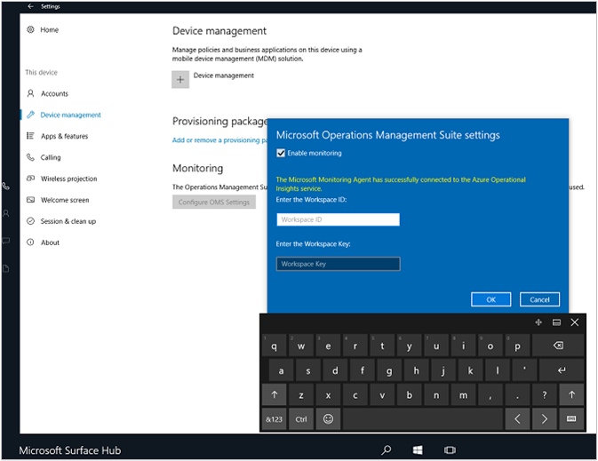

<properties
    pageTitle="Surface Hubs mit Log Analytics überwachen | Microsoft Azure"
    description="Mit der Oberfläche Hub Lösung können die Integrität des Ihrer Fläche Hubs nachverfolgen und zu verstehen, wie sie genutzt werden."
    services="log-analytics"
    documentationCenter=""
    authors="bandersmsft"
    manager="jwhit"
    editor=""/>

<tags
    ms.service="log-analytics"
    ms.workload="na"
    ms.tgt_pltfrm="na"
    ms.devlang="na"
    ms.topic="article"
    ms.date="08/11/2016"
    ms.author="banders"/>

# Monitor einbinden Hubs mit Log Analytics

Dieser Artikel beschreibt, wie Sie die Lösung Surface-Hub in Log Analytics verwenden können, Microsoft Surface Hub Geräte mit Microsoft Operations Management Suite (OMS) zu überwachen. Log Analytics hilft Ihnen, die Integrität des Ihrer Fläche Hubs nachverfolgen sowie zu verstehen, wie sie genutzt werden.

Jede Fläche Hub verfügt über Microsoft Überwachung Agent installiert. Der durch den Agent, dass Sie Daten aus Ihrem Hub Fläche OMS senden können. Protokolldateien werden auf Ihrem Hubs Fläche und werden gelesen, und klicken Sie dann auf den OMS-Dienst gesendet werden. Probleme wie Servern offline, den Kalender, der nicht synchronisiert, oder ist das Gerät Konto Anmeldung bei nicht möglich sind Skype in OMS im Dashboard-Oberfläche Hub angezeigt. Mithilfe der Daten im Dashboard können Sie Geräte identifizieren, die nicht ausgeführt werden oder andere Probleme sind, und die potenziell Anwenden der erkannten Probleme behoben.

## Installieren und konfigurieren die Lösung

Verwenden Sie die folgende Informationen zum Installieren und konfigurieren die Lösung. Um Ihre Oberfläche Hubs aus Microsoft Operations Management Suite (OMS) verwalten, benötigen Sie Folgendes:

- Ein gültiger [OMS](http://www.microsoft.com/oms)-Abonnement.
- Ein [Abonnement OMS](https://azure.microsoft.com/pricing/details/log-analytics/) Ebene, die die Anzahl der Geräte unterstützt werden, die Sie überwachen möchten. OMS Preise abhängig von wie vielen Geräten registriert sind, und wie viele Daten sie Prozesse. Sie möchten dies berücksichtigen bei der Planung der Oberfläche Hub UC-Bereitstellung.

Weiter, Sie entweder ein Abonnement OMS zu Ihrer vorhandenen Microsoft Azure-Abonnement hinzufügen oder erstellen ein neues Arbeitsbereichs direkt über das OMS-Portal. Ausführliche Informationen zur Verwendung der beiden Methoden ist unter [Erste Schritte mit Log Analytics](log-analytics-get-started.md). Nachdem Sie das Abonnement OMS eingerichtet haben, gibt es zwei Methoden zum Registrieren der Oberfläche Hub-Geräte:

- Automatisch bis InTune
- Manuell über die **Einstellungen** auf Ihrem Gerät Fläche Hub.

## Richten Sie für die Überwachung

Sie können die Gesundheit und die Aktivität von der Oberfläche Hub mit Analytics Log in OMS überwachen. Sie können den Surface-Hub in OMS mithilfe von InTune oder lokal mithilfe von **Einstellungen** auf der Oberfläche Hub registrieren.

## Herstellen einer Verbindung durch InTune OMS mit einbinden Hubs

Sie benötigen das Arbeitsbereich-ID und der Arbeitsbereich Schlüssel für den Arbeitsbereich OMS, mit die der Oberfläche Hubs verwaltet werden. Sie können die vom OMS-Portal erhalten.

InTune ist ein Microsoft-Produkt, mit dem Sie für die zentrale Verwaltung von Einstellungen der OMS-Konfiguration, die auf eine oder mehrere Ihrer Geräte angewendet werden. Wie folgt vor, um Ihre Geräte über InTune zu konfigurieren:

1. Melden Sie sich bei InTune.
2. Navigieren Sie zu **Settings** > **Datenquellen verbunden**.
3. Erstellen oder Bearbeiten einer richtlinienbasiertes basierend auf der Oberfläche Hub-Vorlage.
4. Navigieren Sie zum Abschnitt OMS (Azure Betrieb Einsichten) der Richtlinie, und fügen Sie die *Arbeitsbereich-ID* und der *Arbeitsbereich-Taste* auf die Richtlinie.
5. Speichern Sie die Richtlinie ein.
6. Ordnen Sie die Richtlinie die entsprechende Gruppe von Geräten.

  

InTune synchronisiert klicken Sie dann die Einstellungen OMS mit den Geräten in die Zielgruppe, diese in dem Arbeitsbereich OMS registrieren.

## Herstellen einer Verbindung mit den Einstellungen-app OMS mit Fläche Hubs

Sie benötigen das Arbeitsbereich-ID und der Arbeitsbereich Schlüssel für den Arbeitsbereich OMS, mit die der Oberfläche Hubs verwaltet werden. Sie können die vom OMS-Portal erhalten.

Wenn Sie zum Verwalten Ihrer Umgebung nicht InTune arbeiten, können Sie die Geräte manuell über die **Einstellungen** auf jede Fläche Hub registrieren:

1. Öffnen Sie in der Oberfläche-Hub **Einstellungen**aus.
2. Geben Sie die Gerät Administrator-Anmeldeberechtigungen Wenn Sie dazu aufgefordert werden.
3. Klicken Sie auf **das Gerät**, und die unter **Überwachung**, klicken Sie auf **Einstellungen für OMS konfigurieren**.
4. Wählen Sie **die Überwachung aktivieren**.
6. Klicken Sie im Dialogfeld Einstellungen OMS Geben Sie der **Arbeitsbereich-ID** , und geben Sie den **Arbeitsbereich-Taste**.  
  
7. Klicken Sie auf **OK** , um die Konfiguration abzuschließen.

Eine Bestätigung darüber informiert werden, unabhängig davon, ob die Konfiguration OMS erfolgreich an das Gerät angewendet wurde. Wenn es wurde, wird eine Meldung, die besagt, dass der Agent erfolgreich an den OMS-Dienst verbunden. Das Gerät startet dann Senden von Daten an OMS, wo Sie anzeigen und darauf reagieren können.

## Monitor einbinden Hubs

Überwachung der Oberfläche Hubs ähnelt mit OMS Überwachung registrierten andere Geräte.

1. Melden Sie sich mit dem Portal OMS aus.
2. Navigieren Sie zu dem Fläche Hub Lösung Pack Dashboard.
3. Integrität des Geräts wird angezeigt.

  

Sie können [Benachrichtigungen](log-analytics-alerts.md) auf Grundlage der vorhandenen oder benutzerdefinierten Log Suche erstellen. Verwenden die Daten, die die OMS aus der Oberfläche Hubs sammelt, können Sie suchen für Probleme und Benachrichtigung für die Konditionen, die Sie für Ihre Geräte definieren.

## Nächste Schritte

- Verwenden Sie [Log Analytics Log durchsucht](log-analytics-log-searches.md) , um Detaildaten Surface-Hub anzuzeigen.
- Erstellen Sie [Benachrichtigungen](log-analytics-alerts.md) , um Sie benachrichtigt werden, wenn Probleme mit der Oberfläche Hubs auftreten.
