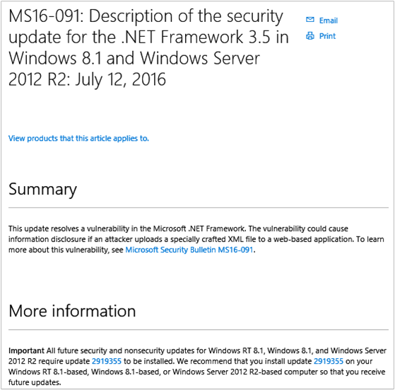
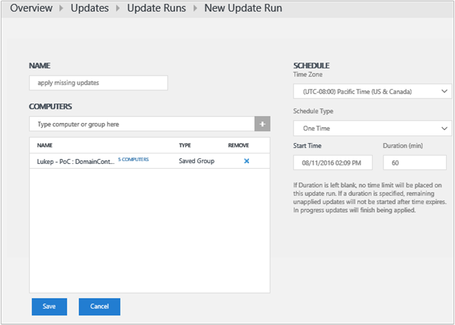
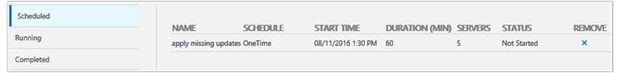
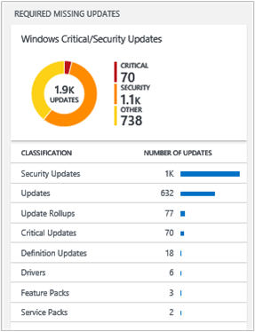

<properties
    pageTitle="System Update Bewertung-Lösung in Log Analytics | Microsoft Azure"
    description="Die Lösung System-Updates können in Log Analytics Sie fehlende Updates auf Servern in Ihrer Infrastruktur anwenden."
    services="log-analytics"
    documentationCenter=""
    authors="bandersmsft"
    manager="jwhit"
    editor=""/>

<tags
    ms.service="log-analytics"
    ms.workload="na"
    ms.tgt_pltfrm="na"
    ms.devlang="na"
    ms.topic="article"
    ms.date="08/11/2016"
    ms.author="banders"/>

# System Update Bewertung-Lösung in Log Analytics

Die Lösung System-Updates können in Log Analytics Sie fehlende Updates auf Servern in Ihrer Infrastruktur anwenden. Nachdem Sie die Lösung installiert haben, können Sie die Updates anzeigen, die von Ihrer überwachten Servern fehlen mithilfe der Kachel **System Update Bewertung** auf der Seite **Übersicht** in OMS.

Wenn Sie fehlende Updates gefunden werden, werden auf dem Dashboard **Updates** Details angezeigt. Das **Updates** Dashboard können Sie mit fehlenden Updates funktionieren, und entwickeln einen Plan für diese auf die Server anwenden, die sie benötigen.

## Installieren und konfigurieren die Lösung
Verwenden Sie die folgende Informationen zum Installieren und konfigurieren die Lösung.

- Fügen Sie die Lösung System Update Bewertung in den OMS Arbeitsbereich mithilfe des Prozesses [Hinzufügen Log Analytics Lösungen aus dem Lösungskatalog](log-analytics-add-solutions.md)beschrieben.  Es ist keine weitere Konfiguration erforderlich.

## System Update Einzelheiten zur Datensammlung

System Update Bewertung sammelt Metadaten und Zustand von Daten mit den Agents, die Sie aktiviert haben.

Die folgende Tabelle zeigt Datensammlungsmethoden und andere Details, wie Daten für System Update Bewertung erfasst werden.

| Plattform | Direkte Agent | SCOM agent | Azure-Speicher | SCOM erforderlich? | SCOM Agentdaten per Management Group unter gesendeten | Häufigkeit Collection |
|---|---|---|---|---|---|---|
|Windows||||            || Mindestens 2 Mal pro Tag und 15 Minuten nach der Installation eines Updates|

Die folgende Tabelle zeigt Beispiele für Datentypen, die vom System Update Bewertung gesammelt:

|**Datentyp**|**(Felder)**|
|---|---|
|Metadaten|BaseManagedEntityId, ObjectStatus, OrganizationalUnit, ActiveDirectoryObjectSid, PhysicalProcessors, Netzwerkname, IP-Adresse, ForestDNSName, NetbiosComputerName, VirtualMachineName, LastInventoryDate, HostServerNameIsVirtualMachine, IP-Adresse, NetbiosDomainName, LogicalProcessors, DNS-Name, DisplayName, DomainDnsName, ActiveDirectorySite, ' PrincipalName ', OffsetInMinuteFromGreenwichTime|
|Bundesstaat|StateChangeEventId, State-ID, NewHealthState, OldHealthState, Kontext, TimeGenerated, TimeAdded, StateId2, BaseManagedEntityId, MonitorId, HealthState, LastModified, LastGreenAlertGenerated, DatabaseTimeModified|

### Für die Arbeit mit updates

1. Klicken Sie auf der Seite **Übersicht** auf die Kachel **System Update Bewertung** .  
    
2. Zeigen Sie auf dem Dashboard **Updates** Update Kategorien aus.  
    
3. Führen Sie einen Bildlauf nach rechts von der Seite, um das **Windows-kritisch/Sicherheitsupdates** Blade anzeigen, und klicken Sie dann unter **Klassifizierung**, auf **Sicherheitsupdates**.  
    
4. Klicken Sie auf der Seite Log wird eine Vielzahl von Informationen zu den Sicherheitsupdates angezeigt, die in Ihrer Infrastruktur von Servern fehlende gefunden wurden. Klicken Sie auf **Liste** , um ausführliche Informationen zu den Updates anzuzeigen.  
    
5. Klicken Sie auf der Seite Log ausführliche Informationen zu den einzelnen Updates werden. Klicken Sie neben der Nummer KBID auf **Ansicht** , um den entsprechenden Artikel anzuzeigen, klicken Sie auf der Website Microsoft Support.  
    
6. Webbrowser wird die Microsoft Support-Webseite für die Aktualisierung in einer neuen Registerkarte geöffnet. Hier werden die Informationen über das Update, das nicht vorhanden ist.  
    
7. Mit den Informationen verwenden Sie gefunden haben, können Sie einen Plan zum manuellen Anwenden von fehlenden Updates erstellen, oder können Sie weiterhin die verbleibenden Schritte ausführen, das Update automatisch angewendet.
8. Wenn Sie das fehlende Update automatisch anwenden möchten, kehren Sie zu dem Dashboard **Updates** und unter **Aktualisieren ausgeführt wird**, klicken Sie dann auf **klicken, um ein Update ausführen planen**.  
    
9. Klicken Sie auf **Hinzufügen** , um einen neuen Vorgang Update ausführen zu erstellen, auf der Seite auf die Registerkarte **Geplante** **Aktualisieren ausgeführt** .  
    
10. Klicken Sie auf der Seite **Neue Update ausführen zu können** , geben Sie ein Namen für das Update ausführen, fügen Sie einzelne Computer oder Computergruppen hinzu, definieren Sie einen Zeitplan, und klicken Sie dann auf **Speichern**.  
    
11. Die Registerkarte **Geplante** das **Aktualisieren ausgeführt** Seite zeigt das neue Update ausführen, haben Sie berechnet.  
    
12. Beim Start des Updates ausführen, sehen Sie für diese Informationen auf der Registerkarte **ausgeführt** .  
    
13. Nach Abschluss die Aktualisierung ausführen, wird die Registerkarte **abgeschlossen** angezeigt.
14. Wenn Updates aus dem Update ausführen, in der **Windows-kritisch/Sicherheitsupdates** Blade angewendet wurden, sehen Sie, dass die Anzahl der Updates reduziert ist.  
    

## Nächste Schritte

- [Suchen von Protokollen](log-analytics-log-searches.md) detaillierte System Updatedaten anzeigen.
