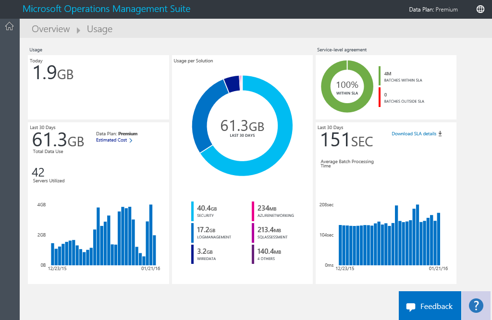

<properties
    pageTitle="Analysieren von Daten Verwendung in Log Analytics | Microsoft Azure"
    description="Sie können die Seite für die Verwendung in Log Analytics verwenden, um anzuzeigen, wie viele Daten an den OMS-Dienst gesendet werden."
    services="log-analytics"
    documentationCenter=""
    authors="bandersmsft"
    manager="jwhit"
    editor=""/>

<tags
    ms.service="log-analytics"
    ms.workload="na"
    ms.tgt_pltfrm="na"
    ms.devlang="na"
    ms.topic="get-started-article"
    ms.date="08/11/2016"
    ms.author="banders"/>

# Verwendung von Daten in Log Analytics analysieren

Log Analytics in Vorgänge Management Suite (OMS) sammelt Daten und wird regelmäßig mit dem OMS-Dienst gesendet.  Sie können die Seite für die **Verwendung** verwenden, um anzuzeigen, wie viele Daten an den OMS-Dienst gesendet werden. Der **Verwendung** Seite finden Sie auch, wie viele Daten täglich von Lösungen gesendet werden und wie oft die Server Daten senden möchten.

>[AZURE.NOTE] Wenn Sie ein kostenloses Konto mithilfe der [OMS-Website](http://www.microsoft.com/oms)erstellt haben, können Sie auf Senden 500 MB an Daten mit dem Dienst OMS täglich beschränkt. Wenn Sie das tägliche Limit erreicht haben, wird Datenanalyse beenden und am Anfang des nächsten Tag fortsetzen. Sie müssen alle Daten, die akzeptiert oder verarbeiteten OMS wurde nicht erneut zu senden.

Sie können Ihre Verwendung mithilfe der Kachel **Verwendung** auf dem Dashboard **Übersicht** in OMS anzeigen.

Wenn Sie die tägliche Verwendung überschritten haben oder wenn Sie in der Nähe der Grenzwert sind, können Sie optional eine Lösung, um die Datenmenge zu verringern, die Sie beim OMS-Dienst senden entfernen. Weitere Informationen zum Entfernen von Lösungen finden Sie unter [Hinzufügen von Log Analytics Lösungen aus dem Lösungskatalog](log-analytics-add-solutions.md).

Die Seite **Verwendung** zeigt die folgenden Informationen:

- Durchschnittliche Verwendung pro Tag
- Verwendung von Daten für jede Lösung innerhalb der letzten 30 Tage
- Wie viel sind die Server in Ihrer Umgebung OMS-Dienst in den letzten 30 Tagen Senden von Daten
- Ihre Datentarif Preise Ebene und geschätzte Kosten
- Informationen zu Ihrer Vereinbarung zum Servicelevel (Vereinbarung zum SERVICELEVEL), einschließlich wie lange dauert OMS, Ihre Daten zu verarbeiten

## Für die Arbeit mit der von Verwendungsdaten

1. Klicken Sie auf der Seite **Übersicht** auf die Kachel **Verwendung** .
2. Zeigen Sie auf der Seite **Verwendung** Verwendung Kategorien, die Bereiche zeigen, dass Sie Gedanken über befinden.
3. Wenn Sie eine Lösung, die zu viele Ihrer täglichen Upload Quote in Anspruch nimmt haben, sollten Sie die Lösung entfernen.

## So zeigen Sie Ihre geschätzten Kosten und Rechnungsinformationen an
1. Klicken Sie auf der Seite **Übersicht** auf die Kachel **Verwendung** .
2. Klicken Sie auf der Seite **Verwendung** unter **Verwendung**auf das Chevron (**>**) neben **geschätzte Kosten**.
3. In der erweiterten **Ihrer Datentarif** Details, Sie können Ihre geschätzten monatliche Kosten anzeigen.  
    
4. Wenn Sie Ihre Abrechnungsinformationen anzeigen möchten, klicken Sie auf **Ansicht meiner Zahlung** zum Anzeigen von Informationen zu Ihrem Abonnement.
    - Klicken Sie auf der Seite Abonnements auf Ihr Abonnement zum Anzeigen von Details und eine Liste mit Elementen Zeile der Verwendung.  
        
    - Klicken Sie auf der Seite "Zusammenfassung" für Ihr Abonnement können Sie eine Vielzahl von Aufgaben zum Verwalten und Anzeigen weiterer Details zu Ihrem Abonnement ausführen.  
        

## Anzeigen von Daten Stapel für Ihre Vereinbarung zum SERVICELEVEL
1. Klicken Sie auf der Seite **Übersicht** auf die Kachel **Verwendung** .
2. **Service Level Agreement**klicken Sie auf **herunterladen Vereinbarung zum SERVICELEVEL Details**.
3. Eine Excel-XLSX-Datei wird Sie zur Überprüfung heruntergeladen.  
    

## Nächste Schritte

- Finden Sie unter [Log Analytics Log durchsucht](log-analytics-log-searches.md) , detaillierte von Lösungen gesammelten Informationen anzuzeigen.
