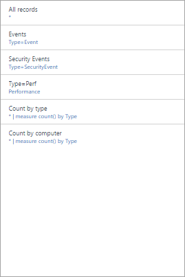
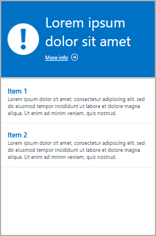

<properties
    pageTitle="Melden Sie sich Analytics Ansicht-Designer | Microsoft Azure"
    description="Ansicht-Designer im Log Analytics können Sie benutzerdefinierte Ansichten erstellen, in der OMS-Verwaltungskonsole, die Daten im Repository OMS andere Visualisierungen enthalten. Dieser Artikel bietet einen Bezug der Einstellungen für jede der Visualisierung Webparts zur Verwendung in Ihre benutzerdefinierten Ansichten zur Verfügung."
    services="log-analytics"
    documentationCenter=""
    authors="bwren"
    manager="jwhit"
    editor=""/>

<tags
    ms.service="log-analytics"
    ms.workload="na"
    ms.tgt_pltfrm="na"
    ms.devlang="na"
    ms.topic="article"
    ms.date="10/20/2016"
    ms.author="bwren"/>

# Melden Sie sich Analytics Ansicht-Designer Visualisierung Webpart Bezug
Die Ansicht-Designer im Log Analytics können Sie benutzerdefinierte Ansichten erstellen, in der OMS-Verwaltungskonsole, die andere Visualisierungen von Daten aus dem OMS Repository enthalten. Dieser Artikel bietet einen Bezug der Einstellungen für jede der Visualisierung Webparts zur Verwendung in Ihre benutzerdefinierten Ansichten zur Verfügung.

Weitere Artikel, die für die Ansicht-Designer verfügbar sind:

- [Ansicht-Designer](log-analytics-view-designer.md) - Übersicht über die Ansicht-Designer und Verfahren zum Erstellen und benutzerdefinierte Ansichten bearbeiten.
- [Kachel Verweis](log-analytics-view-designer-tiles.md) - Bezug der Einstellungen für jede der Kacheln zur Verwendung in Ihre benutzerdefinierten Ansichten zur Verfügung. 

Die folgende Tabelle beschreibt die verschiedenen Typen von Kacheln in der Ansicht-Designer zur Verfügung.  In den folgenden Abschnitten wird jeder Kachel-Elementtyp im Detail und ihre Eigenschaften beschrieben.

| Ansichtstyp | Beschreibung |
|:--|:--|
| [Liste der Abfragen](#list-of-queries-part) | Zeigt eine Liste der Log Suchabfragen.  Der Benutzer kann in jeder Abfrage, um deren Ergebnisse anzuzeigen, klicken.  |
| [Anzahl & Liste](#number-amp-list-part) | Kopfzeile verfügt über eine einzelne Zahl mit zählen von Datensätzen aus einer Suchabfrage Log.  Liste zeigt die zehn wichtigsten Suchergebnisse aus einer Abfrage mit einem Diagramm angezeigt, das den relativen Wert numerische Spalten oder deren Änderung im Zeitverlauf an. |
| [Zwei Zahlen und Liste](#two-numbers-amp-list-part) | Kopfzeile weist zwei Zahlen mit der Anzahl der Datensätze aus separaten Log Suchabfragen.  Liste zeigt die zehn wichtigsten Suchergebnisse aus einer Abfrage mit einem Diagramm angezeigt, das den relativen Wert numerische Spalten oder deren Änderung im Zeitverlauf an. |
| [Ring- und Liste](#donut-amp-list-part) | Kopfzeile zeigt eine einzelne Zahl, die aus einer Wertespalte in einer Abfrage Log zusammengefasst.  Der Ring zeigt die Ergebnisse der obersten drei Datensätze grafisch an. |
| [Zwei Zeitachsen & Liste](#two-timelines-amp-list-part) | Kopfzeile zeigt die Ergebnisse von zwei Log-Abfragen über einen Zeitraum als Säulendiagramme mit einer Beschriftung anzeigen einer einzelnen Zahl aus einer Wertespalte in einer Abfrage Log zusammengefasst.  Liste zeigt die zehn wichtigsten Suchergebnisse aus einer Abfrage mit einem Diagramm angezeigt, das den relativen Wert numerische Spalten oder deren Änderung im Zeitverlauf an. |   
| [Informationen](#information-part) | Kopfzeile Zeigt statischen Text und eine optionale verknüpfen.  Liste zeigt eine oder mehrere Elemente mit statischem Text und Titel. |
| [Liniendiagramm, Legende und Liste](#line-chart-callout-amp-list-part) | Kopfzeile zeigt ein Liniendiagramm mit mehrere Datenreihen aus einer Abfrage Log über Zeit und eine Legende mit einem zusammengefassten Wert an.  Liste zeigt die zehn wichtigsten Suchergebnisse aus einer Abfrage mit einem Diagramm angezeigt, das den relativen Wert numerische Spalten oder deren Änderung im Zeitverlauf an. |
| [Liniendiagramm & Liste](#line-chart-amp-list-part) | Kopfzeile zeigt ein Liniendiagramm mit mehrere Datenreihen aus einer Abfrage Log über einen Zeitraum.  Liste zeigt die zehn wichtigsten Suchergebnisse aus einer Abfrage mit einem Diagramm angezeigt, das den relativen Wert numerische Spalten oder deren Änderung im Zeitverlauf an. |
| [Stapel von Zeilen Diagramme Webparts](#stack-of-line-charts-part) | Zeigt drei separate Liniendiagrammen mit mehrere Datenreihen aus einer Abfrage Log über einen Zeitraum an. |

## Liste der Abfragen-Webpart

Zeigt eine Liste der Log Suchabfragen.  Der Benutzer kann in jeder Abfrage, um deren Ergebnisse anzuzeigen, klicken.  Die Ansicht wird standardmäßig eine einzelne Abfrage enthalten, und klicken Sie auf **+ Abfrage** um zusätzliche Abfragen hinzuzufügen.

| Einstellung | Beschreibung |
|:--|:--|
| **Allgemeine** |
| Titel | Text am oberen Rand der Ansicht angezeigt werden. |
| Neue Gruppe | Wählen Sie zum Erstellen einer neuen Gruppe in der Ansicht der aktuellen Ansicht ab. |
| Vor dem ausgewählten Filter | Durch Trennzeichen getrennte Liste der Eigenschaften in der linken Filterbereich einbezogen werden soll, wenn der Benutzer eine Abfrage auswählt. |
| Rendern Modus | Anfängliche Ansicht angezeigt, wenn die Abfrage ausgewählt ist.  Der Benutzer kann alle verfügbaren Ansichten nach dem Öffnen der Abfrage auswählen. |
| **Abfragen** |
| Suchabfrage | Abfrage ausführen. |
| Anzeigename | Beschreibender Name der Abfrage und dem Benutzer angezeigt werden. |

## Anzahl & Liste Webpart

Kopfzeile verfügt über eine einzelne Zahl mit zählen von Datensätzen aus einer Suchabfrage Log.  Liste zeigt die zehn wichtigsten Suchergebnisse aus einer Abfrage mit einem Diagramm angezeigt, das den relativen Wert numerische Spalten oder deren Änderung im Zeitverlauf an.

| Einstellung | Beschreibung |
|:--|:--|
| **Allgemeine** |
| Gruppentitel | Text am oberen Rand der Ansicht angezeigt werden. |
| Neue Gruppe | Wählen Sie zum Erstellen einer neuen Gruppe in der Ansicht der aktuellen Ansicht ab. |
| Symbol | Der Bilddatei, die neben dem Ergebnis in der Kopfzeile angezeigt werden soll.
| Symbol verwenden | Wählen Sie die Anzeige des Symbols haben. |
| **Titel** |
| Legende | Text am oberen Rand der Kopfzeile angezeigt werden. |
| Abfrage | Die Abfrage in der Kopfzeile ausgeführt.  Die Anzahl der Datensätze, die von der Abfrage zurückgegebenen wird angezeigt. |
| **Liste** |
| Abfrage | Die Abfrage in der Liste ausgeführt.  Die ersten beiden Eigenschaften für den ersten zehn Datensätzen in den Ergebnissen werden angezeigt.  Die erste Eigenschaft sollten einen Textwert und die zweite Eigenschaft einen numerischen Wert an.  Balken werden automatisch basierend auf dem relativen Wert der numerischen Spalte erstellt.  Verwenden Sie der Befehl ' Sortieren ' in der Abfrage, um die Einträge in der Liste sortieren.  Der Benutzer kann Klicken Sie auf alle anzeigen, um die Abfrage auszuführen und alle Datensätze zurück. |
| Ausblenden der Größenachse | So deaktivieren Sie das Diagramm rechts neben der numerische Spalte auswählen |
| Aktivieren von sparklines | Wählen Sie Sparkline statt horizontale Leiste angezeigt werden.  Details finden Sie unter [Allgemeine Einstellungen](#sparklines) . |
| Farbe | Die Farbe des Balken oder Sparklines. |
| Name und Wert Trennzeichen | Einzelnen Trennzeichen, wenn Sie die Texteigenschaft in mehrere Werte zu analysieren möchten.  Details finden Sie unter [Allgemeine Einstellungen](#name-value-separator) . |
| Navigationsbereich-Abfrage | Abfrage ausführen, wenn der Benutzer ein Element in der Liste auswählt.  Details finden Sie unter [Allgemeine Einstellungen](#navigation-query) . |
| **Liste** | **> Spaltentiteln** |
| Namen | Text am oberen Rand der ersten Spalte der Liste angezeigt werden. |
| Wert | Text am oberen Rand der zweiten Spalte der Liste angezeigt werden. |
| **Liste** | **> Schwellenwerte** |
| Aktivieren Sie Schwellenwerte | Wählen Sie Schwellenwerte aktivieren aus.  Details finden Sie unter [Allgemeine Einstellungen](#thresholds) . |

## Zwei Zahlen und Listenansicht Webpart

Kopfzeile weist zwei Zahlen mit der Anzahl der Datensätze aus separaten Log Suchabfragen.  Liste zeigt die zehn wichtigsten Suchergebnisse aus einer Abfrage mit einem Diagramm angezeigt, das den relativen Wert numerische Spalten oder deren Änderung im Zeitverlauf an.

| Einstellung | Beschreibung |
|:--|:--|
| **Allgemeine** |
| Gruppentitel | Text am oberen Rand der Ansicht angezeigt werden. |
| Neue Gruppe | Wählen Sie zum Erstellen einer neuen Gruppe in der Ansicht der aktuellen Ansicht ab. |
| Symbol | Der Bilddatei, die neben dem Ergebnis in der Kopfzeile angezeigt werden soll.
| Symbol verwenden | Wählen Sie die Anzeige des Symbols haben. |
| **Titel** |
| Legende | Text am oberen Rand der Kopfzeile angezeigt werden. |
| Abfrage | Die Abfrage in der Kopfzeile ausgeführt.  Die Anzahl der Datensätze, die von der Abfrage zurückgegebenen wird angezeigt. |
| **Liste** |
| Abfrage | Die Abfrage in der Liste ausgeführt.  Die ersten beiden Eigenschaften für den ersten zehn Datensätzen in den Ergebnissen werden angezeigt.  Die erste Eigenschaft sollten einen Textwert und die zweite Eigenschaft einen numerischen Wert an.  Balken werden automatisch basierend auf dem relativen Wert der numerischen Spalte erstellt.  Verwenden Sie der Befehl ' Sortieren ' in der Abfrage, um die Einträge in der Liste sortieren.  Der Benutzer kann Klicken Sie auf alle anzeigen, um die Abfrage auszuführen und alle Datensätze zurück. |
| Ausblenden der Größenachse | So deaktivieren Sie das Diagramm rechts neben der numerische Spalte auswählen |
| Aktivieren von sparklines | Wählen Sie Sparkline statt horizontale Leiste angezeigt werden.  Details finden Sie unter [Allgemeine Einstellungen](#sparklines) . |
| Farbe | Die Farbe des Balken oder Sparklines. |
| Vorgang | Vorgang für die Sparkline ausgeführt werden.  Details finden Sie unter [Allgemeine Einstellungen](#sparklines) . |
| Name und Wert Trennzeichen | Einzelnen Trennzeichen, wenn Sie die Texteigenschaft in mehrere Werte zu analysieren möchten.  Details finden Sie unter [Allgemeine Einstellungen](#name-value-separator) . |
| Navigationsbereich-Abfrage | Abfrage ausführen, wenn der Benutzer ein Element in der Liste auswählt.  Details finden Sie unter [Allgemeine Einstellungen](#navigation-query) . |
| **Liste** | **> Spaltentiteln** |
| Namen | Text am oberen Rand der ersten Spalte der Liste angezeigt werden. |
| Wert | Text am oberen Rand der zweiten Spalte der Liste angezeigt werden. |
| **Liste** | **> Schwellenwerte** |
| Aktivieren Sie Schwellenwerte | Wählen Sie Schwellenwerte aktivieren aus.  Details finden Sie unter [Allgemeine Einstellungen](#thresholds) . |

## Ring- und Liste Webpart

Kopfzeile zeigt eine einzelne Zahl, die aus einer Wertespalte in einer Abfrage Log zusammengefasst.  Der Ring zeigt die Ergebnisse der obersten drei Datensätze grafisch an.

| Einstellung | Beschreibung |
|:--|:--|
| **Allgemeine** |
| Gruppentitel | Text am oberen Rand der Kachel angezeigt werden. |
| Neue Gruppe | Wählen Sie zum Erstellen einer neuen Gruppe in der Ansicht der aktuellen Ansicht ab. |
| Symbol | Der Bilddatei, die neben dem Ergebnis in der Kopfzeile angezeigt werden soll. |
| Symbol verwenden | Wählen Sie die Anzeige des Symbols haben. |
| **Kopfzeile** |
| Titel | Text am oberen Rand der Kopfzeile angezeigt werden.
| Untertitel | Text, der unter dem Titel am oberen Rand der Kopfzeile angezeigt.
| **Ring** |
| Abfrage | Die Abfrage in der Ring ausgeführt.  Die erste Eigenschaft sollten einen Textwert und die zweite Eigenschaft einen numerischen Wert an. |
| **Ring** |  **> Center** |
| Text | Klicken Sie unter den Wert innerhalb der Ring anzuzeigende Text. |
| Vorgang | Klicken Sie auf die Value-Eigenschaft zu einem einzelnen Wert Zusammenfassung auszuführenden Vorgangs.  -Summe: Fügen Sie die Werte aller Datensätze hinzu. -Prozentsatz: Prozentsatz der Datensätze mit den Werten im **Ergebniswerte in Center Vorgang verwendet werden** , die Gesamtanzahl der Datensätze in der Abfrage zurückgegeben. |
| Ergebniswerte in Center Vorgang verwendet werden | Klicken Sie optional auf das Pluszeichen, um einen oder mehrere Werte zu addieren.  Die Ergebnisse der Abfrage werden auf Datensätze mit den Eigenschaftswerten beschränkt, die Sie angeben.  Wenn keine Werte hinzugefügt werden, werden alle Datensätze in die Abfrage eingeschlossen. |
| **Weitere Optionen** | **> Farben** |
| Farbe 1 Farbe 2 Farbe 3 | Wählen Sie die Farbe für jede der Werte in den Ring angezeigt. |
| **Weitere Optionen** | **> Zuordnung erweiterte Farbe** |
| Feldwert | Geben Sie den Namen eines Felds als eine andere Farbe angezeigt werden, wenn es in den Ring enthalten ist. |
| Farbe | Wählen Sie die Farbe für das eindeutige Feld ein. |
| **Liste** |
| Abfrage | Die Abfrage in der Liste ausgeführt.  Die Anzahl der Datensätze, die von der Abfrage zurückgegebenen wird angezeigt. |
| Ausblenden der Größenachse | So deaktivieren Sie das Diagramm rechts neben der numerische Spalte auswählen |
| Aktivieren von sparklines | Wählen Sie Sparkline statt horizontale Leiste angezeigt werden.  Details finden Sie unter [Allgemeine Einstellungen](#sparklines) . |
| Farbe | Die Farbe des Balken oder Sparklines. |
| Vorgang | Vorgang für die Sparkline ausgeführt werden.  Details finden Sie unter [Allgemeine Einstellungen](#sparklines) . |
| Name und Wert Trennzeichen | Einzelnen Trennzeichen, wenn Sie die Texteigenschaft in mehrere Werte zu analysieren möchten.  Details finden Sie unter [Allgemeine Einstellungen](#name-value-separator) . |
| Navigationsbereich-Abfrage | Abfrage ausführen, wenn der Benutzer ein Element in der Liste auswählt.  Details finden Sie unter [Allgemeine Einstellungen](#navigation-query) . |
| **Liste** | **> Spaltentiteln** |
| Namen | Text am oberen Rand der ersten Spalte der Liste angezeigt werden. |
| Wert | Text am oberen Rand der zweiten Spalte der Liste angezeigt werden. |
| **Liste** | **> Schwellenwerte** |
| Aktivieren Sie Schwellenwerte | Wählen Sie Schwellenwerte aktivieren aus.  Details finden Sie unter [Allgemeine Einstellungen](#thresholds) . |

## Zwei Liste und Zeitachsen-Webpart

Kopfzeile zeigt die Ergebnisse von zwei Log-Abfragen über einen Zeitraum als Säulendiagramme mit einer Beschriftung anzeigen einer einzelnen Zahl aus einer Wertespalte in einer Abfrage Log zusammengefasst.  Liste zeigt die zehn wichtigsten Suchergebnisse aus einer Abfrage mit einem Diagramm angezeigt, das den relativen Wert numerische Spalten oder deren Änderung im Zeitverlauf an.

| Einstellung | Beschreibung |
|:--|:--|
| **Allgemeine** |
| Gruppentitel | Text am oberen Rand der Kachel angezeigt werden. |
| Neue Gruppe | Wählen Sie zum Erstellen einer neuen Gruppe in der Ansicht der aktuellen Ansicht ab. |
| Symbol | Der Bilddatei, die neben dem Ergebnis in der Kopfzeile angezeigt werden soll. |
| Symbol verwenden | Wählen Sie die Anzeige des Symbols haben. |
| **Zuerst Diagramm zweite Diagramm** |
| Legende | Klicken Sie unter der Beschriftung für die erste Datenreihe anzuzeigende Text. |
| Farbe | Die Farbe für die Spalten in der Reihe verwendet werden soll. |
| Abfrage | Die Abfrage in der ersten Datenreihe ausgeführt.  Die Anzahl von Datensätzen über jede Zeitintervall wird durch das Diagramm Spalten dargestellt werden. |
| Vorgang | Der Vorgang auf die Value-Eigenschaft zu einem einzelnen Wert für die Legende und ausführen.  -Summe: Die Summe der Werte aus allen Datensätzen. -Durchschnitt: Den Mittelwert der Werte aus allen Datensätzen. -Letzte-Beispiel: Wert aus dem letzten Intervall im Diagramm enthalten. -Erste Beispiel: Wert aus dem ersten Intervall im Diagramm enthalten. -Anzahl: Anzahl aller Datensätze, die von der Abfrage zurückgegeben.|
| **Liste** |
| Abfrage | Die Abfrage in der Liste ausgeführt.  Die Anzahl der Datensätze, die von der Abfrage zurückgegebenen wird angezeigt. |
| Ausblenden der Größenachse | So deaktivieren Sie das Diagramm rechts neben der numerische Spalte auswählen |
| Aktivieren von sparklines | Wählen Sie Sparkline statt horizontale Leiste angezeigt werden.  Details finden Sie unter [Allgemeine Einstellungen](#sparklines) . |
| Farbe | Die Farbe des Balken oder Sparklines. |
| Vorgang | Vorgang für die Sparkline ausgeführt werden.  Details finden Sie unter [Allgemeine Einstellungen](#sparklines) . |
| Navigationsbereich-Abfrage | Abfrage ausführen, wenn der Benutzer ein Element in der Liste auswählt.  Details finden Sie unter [Allgemeine Einstellungen](#navigation-query) . |
| **Liste** | **> Spaltentiteln** |
| Namen | Text am oberen Rand der ersten Spalte der Liste angezeigt werden. |
| Wert | Text am oberen Rand der zweiten Spalte der Liste angezeigt werden. |
| **Liste** | **> Schwellenwerte** |
| Aktivieren Sie Schwellenwerte | Wählen Sie Schwellenwerte aktivieren aus.  Details finden Sie unter [Allgemeine Einstellungen](#thresholds) . |

## Teil der Informationen

Kopfzeile Zeigt statischen Text und eine optionale verknüpfen.  Liste zeigt eine oder mehrere Elemente mit statischem Text und Titel.

| Einstellung | Beschreibung |
|:--|:--|
| **Allgemeine** |
| Gruppentitel | Text am oberen Rand der Kachel angezeigt werden. |
| Neue Gruppe | Wählen Sie zum Erstellen einer neuen Gruppe in der Ansicht der aktuellen Ansicht ab. |
| Farbe | Hintergrundfarbe der Kopfzeile. |
| **Kopfzeile** |
| Bild | Bilddatei in der Kopfzeile angezeigt werden. |
| Beschriftung | Text, der in der Kopfzeile angezeigt. |
| **Kopfzeile** | **> Link** |
| Beschriftung | Der Linktext. |
| URL | Die URL für den Link. |
| **Informationselemente** |
| Titel | Text für den Titel der einzelnen Elemente angezeigt werden sollen. |
| Inhalt | Text für jedes Element angezeigt werden sollen. |

## Liniendiagramm, Legende und Listenansicht Webpart

Kopfzeile zeigt ein Liniendiagramm mit mehrere Datenreihen aus einer Abfrage Log über Zeit und eine Legende mit einem zusammengefassten Wert an.  Liste zeigt die zehn wichtigsten Suchergebnisse aus einer Abfrage mit einem Diagramm angezeigt, das den relativen Wert numerische Spalten oder deren Änderung im Zeitverlauf an.

| Einstellung | Beschreibung |
|:--|:--|
| **Allgemeine** |
| Gruppentitel | Text am oberen Rand der Kachel angezeigt werden. |
| Neue Gruppe | Wählen Sie zum Erstellen einer neuen Gruppe in der Ansicht der aktuellen Ansicht ab. |
| Symbol | Der Bilddatei, die neben dem Ergebnis in der Kopfzeile angezeigt werden soll. |
| Symbol verwenden | Wählen Sie die Anzeige des Symbols haben. |
| **Kopfzeile** |
| Titel | Text am oberen Rand der Kopfzeile angezeigt werden. |
| Untertitel | Text, der unter dem Titel am oberen Rand der Kopfzeile angezeigt. |
| **Liniendiagramm** |
| Abfrage | Die Abfrage in das Liniendiagramm ausgeführt.  Die erste Eigenschaft sollten einen Textwert und die zweite Eigenschaft einen numerischen Wert an.  Dies ist in der Regel eine Abfrage, die das Schlüsselwort **Measure** wird verwendet, um die Ergebnisse zusammengefasst.  Wenn die Abfrage das Schlüsselwort **Intervall** verwendet, wird die X-Achse des Diagramms dieses Zeitintervall verwendet.  Wenn die Abfrage nicht das Schlüsselwort **Intervall** werden stündliche Intervallen für die X-Achse verwendet. |
| **Liniendiagramm** | **> Legende** |
| Legende mit Titel | Text oberhalb des Werts Beschriftung angezeigt werden. |
| Name der Datenreihe | Eigenschaftenwert für die Reihe für den Wert für die Beschriftung verwendet werden soll.  Wenn keine Datenreihe angegeben wird, werden alle Datensätze aus der Abfrage verwendet. |
| Vorgang | Der Vorgang auf die Value-Eigenschaft zu einem einzelnen Wert für die Legende und ausführen.  -Durchschnitt: Den Mittelwert der Werte aus allen Datensätzen. -Count Anzahl aller Datensätze, die von der Abfrage zurückgegeben. -Letzte-Beispiel: Wert aus dem letzten Intervall im Diagramm enthalten. -Max: Maximalwert Intervalle im Diagramm enthalten. -Min: Minimalwert Intervalle im Diagramm enthalten. -Summe: Die Summe der Werte aus allen Datensätzen. |
| **Liniendiagramm** | **> Y-Achse** |
| Logarithmische Skala verwenden | Wählen Sie als logarithmische Skala für die Y-Achse verwendet werden soll. |
| Einheiten | Geben Sie die Einheiten für die von der Abfrage zurückgegebenen Werte an.  Diese Informationen werden verwendet, Etiketten auf das Diagramm, das Werttypen angibt und optional zum Konvertieren von die Werte angezeigt werden soll.  Der Typ der Einheit gibt die Kategorie der Einheit und definiert den Typ der aktuellen Organisationseinheit Werte, die verfügbar sind.  Wenn Sie einen Wert auswählen konvertieren Sie in dann der numerischen Werte in konvertieren geben aus dem aktuellen Einheit Typ konvertiert werden. |
| Benutzerdefinierten Etiketts | Text für die Y-Achse neben der Beschriftung für den Typ der Maßeinheit angezeigt werden sollen.  Wenn keine Bezeichnung angegeben ist, wird nur der Maßeinheit Typ angezeigt. |
| **Liste** |
| Abfrage | Die Abfrage in der Liste ausgeführt.  Die Anzahl der Datensätze, die von der Abfrage zurückgegebenen wird angezeigt. |
| Ausblenden der Größenachse | So deaktivieren Sie das Diagramm rechts neben der numerische Spalte auswählen |
| Aktivieren von sparklines | Wählen Sie Sparkline statt horizontale Leiste angezeigt werden.  Details finden Sie unter [Allgemeine Einstellungen](#sparklines) . |
| Farbe | Die Farbe des Balken oder Sparklines. |
| Vorgang | Vorgang für die Sparkline ausgeführt werden.  Details finden Sie unter [Allgemeine Einstellungen](#sparklines) . |
| Name und Wert Trennzeichen | Einzelnen Trennzeichen, wenn Sie die Texteigenschaft in mehrere Werte zu analysieren möchten.  Details finden Sie unter [Allgemeine Einstellungen](#name-value-separator) . |
| Navigationsbereich-Abfrage | Abfrage ausführen, wenn der Benutzer ein Element in der Liste auswählt.  Details finden Sie unter [Allgemeine Einstellungen](#navigation-query) . |
| **Liste** | **> Spaltentiteln** |
| Namen | Text am oberen Rand der ersten Spalte der Liste angezeigt werden. |
| Wert | Text am oberen Rand der zweiten Spalte der Liste angezeigt werden. |
| **Liste** | **> Schwellenwerte** |
| Aktivieren Sie Schwellenwerte | Wählen Sie Schwellenwerte aktivieren aus.  Details finden Sie unter [Allgemeine Einstellungen](#thresholds) . |

## Zeile Liste und Diagramm-Webpart

Kopfzeile zeigt ein Liniendiagramm mit mehrere Datenreihen aus einer Abfrage Log über einen Zeitraum.  Liste zeigt die zehn wichtigsten Suchergebnisse aus einer Abfrage mit einem Diagramm angezeigt, das den relativen Wert numerische Spalten oder deren Änderung im Zeitverlauf an.

| Einstellung | Beschreibung |
|:--|:--|
| **Allgemeine** |
| Gruppentitel | Text am oberen Rand der Kachel angezeigt werden. |
| Neue Gruppe | Wählen Sie zum Erstellen einer neuen Gruppe in der Ansicht der aktuellen Ansicht ab. |
| Symbol | Der Bilddatei, die neben dem Ergebnis in der Kopfzeile angezeigt werden soll. |
| Symbol verwenden | Wählen Sie die Anzeige des Symbols haben. |
| **Kopfzeile** |
| Titel | Text am oberen Rand der Kopfzeile angezeigt werden. |
| Untertitel | Text, der unter dem Titel am oberen Rand der Kopfzeile angezeigt. |
| **Liniendiagramm** |
| Abfrage | Die Abfrage in das Liniendiagramm ausgeführt.  Die erste Eigenschaft sollten einen Textwert und die zweite Eigenschaft einen numerischen Wert an.  Dies ist in der Regel eine Abfrage, die das Schlüsselwort **Measure** wird verwendet, um die Ergebnisse zusammengefasst.  Wenn die Abfrage das Schlüsselwort **Intervall** verwendet, wird die X-Achse des Diagramms dieses Zeitintervall verwendet.  Wenn die Abfrage nicht das Schlüsselwort **Intervall** werden stündliche Intervallen für die X-Achse verwendet. |
| **Liniendiagramm** | **> Y-Achse** |
| Logarithmische Skala verwenden | Wählen Sie als logarithmische Skala für die Y-Achse verwendet werden soll. |
| Einheiten | Geben Sie die Einheiten für die von der Abfrage zurückgegebenen Werte an.  Diese Informationen werden verwendet, Etiketten auf das Diagramm, das Werttypen angibt und optional zum Konvertieren von die Werte angezeigt werden soll.  Der Typ der Einheit gibt die Kategorie der Einheit und definiert den Typ der aktuellen Organisationseinheit Werte, die verfügbar sind.  Wenn Sie einen Wert auswählen konvertieren Sie in dann der numerischen Werte in konvertieren geben aus dem aktuellen Einheit Typ konvertiert werden. |
| Benutzerdefinierten Etiketts | Text für die Y-Achse neben der Beschriftung für den Typ der Maßeinheit angezeigt werden sollen.  Wenn keine Bezeichnung angegeben ist, wird nur der Maßeinheit Typ angezeigt. |
| **Liste** |
| Abfrage | Die Abfrage in der Liste ausgeführt.  Die Anzahl der Datensätze, die von der Abfrage zurückgegebenen wird angezeigt. |
| Ausblenden der Größenachse | So deaktivieren Sie das Diagramm rechts neben der numerische Spalte auswählen |
| Aktivieren von sparklines | Wählen Sie Sparkline statt horizontale Leiste angezeigt werden.  Details finden Sie unter [Allgemeine Einstellungen](#sparklines) . |
| Farbe | Die Farbe des Balken oder Sparklines. |
| Vorgang | Vorgang für die Sparkline ausgeführt werden.  Details finden Sie unter [Allgemeine Einstellungen](#sparklines) . |
| Name und Wert Trennzeichen | Einzelnen Trennzeichen, wenn Sie die Texteigenschaft in mehrere Werte zu analysieren möchten.  Details finden Sie unter [Allgemeine Einstellungen](#name-value-separator) . |
| Navigationsbereich-Abfrage | Abfrage ausführen, wenn der Benutzer ein Element in der Liste auswählt.  Details finden Sie unter [Allgemeine Einstellungen](#navigation-query) . |
| **Liste** | **> Spaltentiteln** |
| Namen | Text am oberen Rand der ersten Spalte der Liste angezeigt werden. |
| Wert | Text am oberen Rand der zweiten Spalte der Liste angezeigt werden. |
| **Liste** | **> Schwellenwerte** |
| Aktivieren Sie Schwellenwerte | Wählen Sie Schwellenwerte aktivieren aus.  Details finden Sie unter [Allgemeine Einstellungen](#thresholds) . |

## Stapel von Zeilen Diagramme Webparts

Zeigt drei separate Liniendiagrammen mit mehrere Datenreihen aus einer Abfrage Log über einen Zeitraum an.

| Einstellung | Beschreibung |
|:--|:--|
| **Allgemeine** |
| Gruppentitel | Text am oberen Rand der Kachel angezeigt werden. |
| Neue Gruppe | Wählen Sie zum Erstellen einer neuen Gruppe in der Ansicht der aktuellen Ansicht ab. |
| Symbol | Der Bilddatei, die neben dem Ergebnis in der Kopfzeile angezeigt werden soll. |
| **Erstellen eines Diagramms 1 Diagramm 2 Diagramm 3** | **> Kopfzeile** |
| Titel | Text am oberen Rand des Diagramms angezeigt werden. |
| Untertitel | Text, der unter dem Titel am oberen Rand des Diagramms angezeigt. |
| **Erstellen eines Diagramms 1 Diagramm 2 Diagramm 3** | **Liniendiagramm** |
| Abfrage | Die Abfrage in das Liniendiagramm ausgeführt.  Die erste Eigenschaft sollten einen Textwert und die zweite Eigenschaft einen numerischen Wert an.  Dies ist in der Regel eine Abfrage, die das Schlüsselwort **Measure** wird verwendet, um die Ergebnisse zusammengefasst.  Wenn die Abfrage das Schlüsselwort **Intervall** verwendet, wird die X-Achse des Diagramms dieses Zeitintervall verwendet.  Wenn die Abfrage nicht das Schlüsselwort **Intervall** werden stündliche Intervallen für die X-Achse verwendet. |
| **Diagramm** | **> Y-Achse** |
| Logarithmische Skala verwenden | Wählen Sie als logarithmische Skala für die Y-Achse verwendet werden soll. |
| Einheiten | Geben Sie die Einheiten für die von der Abfrage zurückgegebenen Werte an.  Diese Informationen werden verwendet, Etiketten auf das Diagramm, das Werttypen angibt und optional zum Konvertieren von die Werte angezeigt werden soll.  Der Typ der Einheit gibt die Kategorie der Einheit und definiert den Typ der aktuellen Organisationseinheit Werte, die verfügbar sind.  Wenn Sie einen Wert auswählen konvertieren Sie in dann der numerischen Werte in konvertieren geben aus dem aktuellen Einheit Typ konvertiert werden. |
| Benutzerdefinierten Etiketts | Text für die Y-Achse neben der Beschriftung für den Typ der Maßeinheit angezeigt werden sollen.  Wenn keine Bezeichnung angegeben ist, wird nur der Maßeinheit Typ angezeigt. |

## Allgemeine Einstellungen
Den folgenden Abschnitten werden die gemeinsame Einstellungen für verschiedene Teile der Visualisierung.

### <a name="name-value-separator">Name und Wert Trennzeichen</a>
Einzelnen Trennzeichen, wenn Sie die Texteigenschaft aus einer Listenabfrage in mehrere Werte zu analysieren möchten.  Wenn Sie ein Trennzeichen angeben, können Sie den Namen für jedes Feld, das durch das gleiche Trennzeichen in das Feld Name getrennt bereitstellen.

Betrachten Sie beispielsweise eine Eigenschaft namens *Speicherort* , die Werte z. B. *Redmond-Baustein 41* und *Detmold-Building12*enthalten.  Sie können – für den Namen und Wert Trennzeichen und *Ort-Baustein* für den Namen angeben.  Dies würde jeder Wert in zwei Eigenschaften *Ort* und *Gebäude*analysiert werden. 

### <a name="navigation-query">Navigationsbereich-Abfrage</a>
Abfrage ausführen, wenn der Benutzer ein Element in der Liste auswählt.  Verwenden Sie *{Ausgewähltes Element}* , um die Syntax für das Element einzubeziehen, die der Benutzer ausgewählt.

Wenn die Abfrage eine Spalte mit der Bezeichnung *Computer* und die Navigation Abfrage enthält beträgt beispielsweise *{Ausgewähltes Element}*, eine Abfrage wie *Computer = "Arbeitsplatz"* würde ausgeführt werden, wenn der Benutzer einen Computer ausgewählt.  Ist die Navigation Abfrage *Typ Ereignis {ausgewähltes Element} =* klicken Sie dann auf die Abfrage *Typ = Ereignis Computer = "Arbeitsplatz"* würde ausgeführt werden.

### <a name="sparklines">Sparklines</a>
Eine Sparkline ist eine kleine Liniendiagramm, das den Wert für einen Eintrag über einen Zeitraum veranschaulicht.  Für Visualisierung Webparts mit einer Liste können Sie einen horizontalen Balken, die den relativen angibt numerische Spalten oder eine Sparkline, der angibt, deren Werts über einen Zeitraum angezeigt werden, ob auswählen.

Die folgende Tabelle beschreibt die Einstellungen für Sparklines.

| Einstellung | Beschreibung |
|:--|:--|
| Aktivieren von Sparklines | Wählen Sie Sparkline statt horizontale Leiste angezeigt werden. |
| Vorgang | Wenn Sparklines aktiviert sind, ist dies der Vorgang, für jede Eigenschaft in der Liste, um die Berechnung der Werte für die Sparkline auszuführen.  -Letzte-Beispiel: Letzten Wert für die Reihe über den Zeitraum aus. -Max: Maximalwert für die Reihe über den Zeitraum aus. -Min: Minimalwert für die Reihe über den Zeitraum aus. -Summe: Die Summe der Werte für die Reihe über den Zeitraum aus. -Zusammenfassung: Verwendet Measure denselben Befehl wie die Abfrage in der Kopfzeile. |

### <a name="thresholds">Schwellenwerte</a>
Schwellenwerte können Sie ein farbiges Symbol neben jedem Element in einer Liste, die Sie als schnelle Anzeige des Elemente, die einen bestimmten Wert überschreiten oder innerhalb eines bestimmten Bereichs liegen zugewiesen angezeigt.  Beispielsweise können Sie ein grünes Symbol für Elemente mit einer zulässige Wert, Gelb, wenn der Wert in einem Bereich ist, die eine Warnung gibt an, und Rot darstellen, wenn sie keinen Fehlerwert überschreitet.

Wenn Sie Schwellenwerte für ein Webpart aktivieren möchten, müssen Sie eine oder mehrere Schwellenwerte angeben.  Wenn der Wert eines Elements größer als ein gegebener und kleiner als der nächsten Schwellenwert ist, wird diese Farbe verwendet.  Wenn das Element größer als dann höchsten Schwellenwert ist, wird diese Farbe festgelegt.   

Jede Schwellenwert besitzt eine Schwellenwert mit dem Wert **Standard**.  Dies ist die Farbe festgelegt, wenn keine anderen Werte überschritten werden.  Können Sie hinzufügen oder Entfernen von Schwellenwerten, indem Sie die **+** oder die Schaltfläche **X** .

Die folgende Tabelle beschreibt die Einstellungen für Kapitalbeteiligungen.

| Einstellung | Beschreibung |
|:--|:--|
| Aktivieren Sie Schwellenwerte | Wählen Sie eine Farbe Symbol links neben jeder Wert, der angibt, deren Status im Verhältnis zur angegebenen Grenzwerte angezeigt werden. |
| Namen | Name den Schwellenwert identifizieren müssen. |
| Schwellenwert | Der Wert für den Schwellenwert.  Die Gesundheit Farbe für jedes Listenelement wird in die Farbe des den höchsten Schwellenwert überschritten werden, indem Sie den Wert des Elements festgelegt.  Es gibt eine Standard-Schwellenwert, die die Farbe wird, wenn keine Schwellenwerte überschritten werden. |
| Farbe | Die Farbe für den Schwellenwert. |

## Nächste Schritte

- Erfahren Sie mehr über [Log Suchbegriffe](log-analytics-log-searches.md) , zur Unterstützung der Abfragen in Visualisierung teilen.