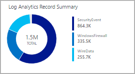

<properties
    pageTitle="Melden Sie sich Analytics Ansicht-Designer-Kachel Verweis | Microsoft Azure"
    description="Ansicht-Designer im Log Analytics können Sie benutzerdefinierte Ansichten erstellen, in der OMS-Verwaltungskonsole, die Daten im Repository OMS andere Visualisierungen enthalten. Dieser Artikel bietet einen Bezug der Einstellungen für jede der Kacheln zur Verwendung in Ihre benutzerdefinierten Ansichten zur Verfügung."
    services="log-analytics"
    documentationCenter=""
    authors="bwren"
    manager="jwhit"
    editor=""/>

<tags
    ms.service="log-analytics"
    ms.workload="na"
    ms.tgt_pltfrm="na"
    ms.devlang="na"
    ms.topic="article"
    ms.date="09/27/2016"
    ms.author="bwren"/>

# Log Analytics Ansicht-Designer-Kachel Bezug
Die Ansicht-Designer im Log Analytics können Sie benutzerdefinierte Ansichten erstellen, in der OMS-Verwaltungskonsole, die Daten im Repository OMS andere Visualisierungen enthalten. Dieser Artikel bietet einen Bezug der Einstellungen für jede der Kacheln zur Verwendung in Ihre benutzerdefinierten Ansichten zur Verfügung.

Weitere Artikel, die für die Ansicht-Designer verfügbar sind:

- [Ansicht-Designer](log-analytics-view-designer.md) - Übersicht über die Ansicht-Designer und Verfahren zum Erstellen und benutzerdefinierte Ansichten bearbeiten.
- [Visualisierung Webpart Verweis](log-analytics-view-designer-parts.md) - Bezug der Einstellungen für jede der Kacheln zur Verwendung in Ihre benutzerdefinierten Ansichten zur Verfügung. 

Die folgende Tabelle listet die verschiedenen Typen von Kacheln in der Ansicht-Designer zur Verfügung.  In den folgenden Abschnitten wird jeder Kachel-Elementtyp im Detail und ihre Eigenschaften beschrieben.

| Kachel | Beschreibung |
|:--|:--|
| [Zahl](#number-tile) | Einzelne Zahl mit der Anzahl von Datensätzen aus einer Abfrage. |
| [Zweier Zahlen zurück](#two-numbers-tile) | Zwei einfache Zahlen mit der Anzahl der Datensätze aus zwei unterschiedlichen Abfragen. |
| [Ring](#donut-tile) | Ringdiagramm auf Grundlage einer Abfrage mit einer Zusammenfassung Wert in der Mitte. |
| [Legende & Liniendiagramm](#line-chart-amp-callout-tile) | Basierend auf einer Abfrage und eine Legende mit einem Wert Zusammenfassung Liniendiagramm. |
| [Liniendiagramm](#line-chart-tile) | Das Liniendiagramm auf Grundlage einer Abfrage. |
| [Zwei Zeitachsen](#two-timelines-tile) | Säulendiagramm mit zwei Datenreihe, die jeweils auf einer separaten Abfrage basierend. |

## Zahl-Kachel

Die Kachel " **Zahl** " zeigt eine Zahl mit der Anzahl von Datensätzen aus einer Abfrage Log und eine Bezeichnung.

| Einstellung | Beschreibung |
|:--|:--|
| Namen        | Text am oberen Rand der Kachel angezeigt werden. |
| Beschreibung | Text, der unter dem Kachelnamen angezeigt.    |
| **Kachel** |
| Legende | Klicken Sie unter den Wert anzuzeigende Text. |
| Abfrage | Abfrage ausführen.  Die Anzahl der Datensätze, die von der Abfrage zurückgegebenen wird angezeigt. |
| **Erweiterte** |  **> Datenfluss Überprüfung** |
| Aktiviert | Wählen Sie aus, wenn für die Kachel Datenfluss Überprüfung aktiviert werden soll.  Dies stellt eine alternative Nachricht, wenn Daten nicht für die Kachel verfügbar ist.  Hiermit wird in der Regel eine Nachricht in der Zeitspanne angeben, wenn die Ansicht installiert ist und die Daten zur Verfügung. |
| Abfrage | Abfrage ausführen, um zu überprüfen, ob die Daten für die Ansicht verfügbar ist.  Wenn die Abfrage keine Ergebnisse zurückgibt, wird eine Meldung anstelle des Werts aus der Abfrage Hauptfenster angezeigt. |
| Nachricht | Meldung, die angezeigt wird, wenn die Abfrage den Datenfluss Überprüfung keine Daten zurückgibt.  Wenn Sie keine Nachricht bereitstellen, wird die *Bewertung Durchführung* angezeigt. |
| **Zeitintervall** |
| Dauer | Dauer ab dem aktuellen Datum für den Zeitraum aus der Abfrage verwendet werden soll.  Beispielsweise **7 Tage** angegeben ist, beträgt dann die Abfrage Datensätze von 7 Tagen auf das aktuelle Datum erstellt. |
| Ende Datenoffset | Optionaler Offset aus den aktuellen Daten für den Zeitraum aus dem Hauptfenster Abfrage verwendet werden soll.  Beispielsweise wird für das **Ende Datum Offset** und **7 Tage** für die **Dauer**verwendet **-1 Tag** verwendet, beträgt dann die Abfrage Datensätze von 8 Tagen zu gestern erstellt. |

## Kachel zweier Zahlen zurück

Die Kachel **Zwei Zahl** zeigt zwei Zahlen mit der Anzahl der Datensätze aus zwei verschiedenen Log Abfragen und eine Bezeichnung für jede.

| Einstellung | Beschreibung |
|:--|:--|
| Namen        | Text am oberen Rand der Kachel angezeigt werden. |
| Beschreibung | Text, der unter dem Kachelnamen angezeigt.    |
| **Erste Kachel** |
| Legende | Klicken Sie unter den Wert anzuzeigende Text. |
| Abfrage | Abfrage ausführen.  Die Anzahl der Datensätze, die von der Abfrage zurückgegebenen wird angezeigt. |
| **Zweite Kachel** |
| Legende | Klicken Sie unter den Wert anzuzeigende Text. |
| Abfrage | Abfrage ausführen.  Die Anzahl der Datensätze, die von der Abfrage zurückgegebenen wird angezeigt. |
| **Erweiterte** | **> Datenfluss Überprüfung** |
| Aktiviert | Wählen Sie aus, wenn für die Kachel Datenfluss Überprüfung aktiviert werden soll.  Dies stellt eine alternative Nachricht, wenn Daten nicht für die Kachel verfügbar ist.  Hiermit wird in der Regel eine Nachricht in der Zeitspanne angeben, wenn die Ansicht installiert ist und die Daten zur Verfügung. |
| Abfrage | Abfrage ausführen, um zu überprüfen, ob die Daten für die Ansicht verfügbar ist.  Wenn die Abfrage keine Ergebnisse zurückgibt, wird eine Meldung anstelle des Werts aus der Abfrage Hauptfenster angezeigt. |
| Nachricht | Meldung, die angezeigt wird, wenn die Abfrage den Datenfluss Überprüfung keine Daten zurückgibt.  Wenn Sie keine Nachricht bereitstellen, wird die *Bewertung Durchführung* angezeigt. |
| **Zeitintervall** |
| Dauer | Dauer ab dem aktuellen Datum für den Zeitraum aus der Abfrage verwendet werden soll.  Beispielsweise **7 Tage** angegeben ist, beträgt dann die Abfrage Datensätze von 7 Tagen auf das aktuelle Datum erstellt. |
| Ende Datenoffset | Optionaler Offset aus den aktuellen Daten für den Zeitraum aus dem Hauptfenster Abfrage verwendet werden soll.  Beispielsweise wird für das **Ende Datum Offset** und **7 Tage** für die **Dauer**verwendet **-1 Tag** verwendet, beträgt dann die Abfrage Datensätze von 8 Tagen zu gestern erstellt. |

## Ring-Kachel

Die Kachel **Ring** zeigt eine einzelne Zahl, die aus einer Wertespalte in einer Abfrage Log zusammengefasst.  Der Ring zeigt die Ergebnisse der obersten drei Datensätze grafisch an.

| Einstellung | Beschreibung |
|:--|:--|
| Namen        | Text am oberen Rand der Kachel angezeigt werden. |
| Beschreibung | Text, der unter dem Kachelnamen angezeigt.    |
| **Ring** |
| Abfrage | Die Abfrage in der Ring ausgeführt.  Die erste Eigenschaft sollten einen Textwert und die zweite Eigenschaft einen numerischen Wert an.  Dies ist in der Regel eine Abfrage, die das Schlüsselwort **Measure** wird verwendet, um die Ergebnisse zusammengefasst. |
| **Ring** | **> Center** |
| Text | Klicken Sie unter den Wert innerhalb der Ring anzuzeigende Text. |
| Vorgang | Klicken Sie auf die Value-Eigenschaft zu einem einzelnen Wert Zusammenfassung auszuführenden Vorgangs.  -Summe: Fügen Sie die Werte aller Datensätze mit dem Eigenschaftswert hinzu. -Prozentsatz: Prozentsatz der summierten Werte aus der Datensätze mit dem Eigenschaftswert auf die summierten Werte aller Datensätze verglichen. |
| Ergebniswerte in Center Vorgang verwendet werden | Klicken Sie optional auf das Pluszeichen, um einen oder mehrere Werte zu addieren.  Die Ergebnisse der Abfrage werden auf Datensätze mit den Eigenschaftswerten beschränkt, die Sie angeben.  Wenn keine Werte hinzugefügt werden, werden als alle Datensätze in die Abfrage eingeschlossen. |
| **Ring** | **> Weitere Optionen** |
| Farben | Die Farbe für jede der drei verwendete Eigenschaften angezeigt werden sollen.  Wenn Sie alternative Farben für bestimmte Immobilienwerte angeben möchten, verwenden Sie erweiterte Farbe Zuordnung. |
| Erweiterte Farbe Zuordnung | Zeigt eine Farbe für bestimmte Immobilienwerte an.  Ist der Wert, den Sie angeben, in der oberen drei, wird die Alternative Farbe statt der Standardfarbe angezeigt.  Wenn die Eigenschaft nicht in der oberen drei ist, wird die Farbe nicht angezeigt. |
| **Erweiterte** | **> Datenfluss Überprüfung** |
| Aktiviert | Wählen Sie aus, wenn für die Kachel Datenfluss Überprüfung aktiviert werden soll.  Dies stellt eine alternative Nachricht, wenn Daten nicht für die Kachel verfügbar ist.  Hiermit wird in der Regel eine Nachricht in der Zeitspanne angeben, wenn die Ansicht installiert ist und die Daten zur Verfügung. |
| Abfrage | Abfrage ausführen, um zu überprüfen, ob die Daten für die Ansicht verfügbar ist.  Wenn die Abfrage keine Ergebnisse zurückgibt, wird eine Meldung anstelle des Werts aus der Abfrage Hauptfenster angezeigt. |
| Nachricht | Meldung, die angezeigt wird, wenn die Abfrage den Datenfluss Überprüfung keine Daten zurückgibt.  Wenn Sie keine Nachricht bereitstellen, wird die *Bewertung Durchführung* angezeigt. |
| **Zeitintervall** |
| Dauer | Dauer ab dem aktuellen Datum für den Zeitraum aus der Abfrage verwendet werden soll.  Beispielsweise **7 Tage** angegeben ist, beträgt dann die Abfrage Datensätze von 7 Tagen auf das aktuelle Datum erstellt. |
| Ende Datenoffset | Optionaler Offset aus den aktuellen Daten für den Zeitraum aus dem Hauptfenster Abfrage verwendet werden soll.  Beispielsweise wird für das **Ende Datum Offset** und **7 Tage** für die **Dauer**verwendet **-1 Tag** verwendet, beträgt dann die Abfrage Datensätze von 8 Tagen zu gestern erstellt. |

## Diagramm-Kachel Linie

Die Kachel **Liniendiagramm** zeigt ein Liniendiagramm mit mehrere Datenreihen aus einer Abfrage Log über einen Zeitraum.  

| Einstellung | Beschreibung |
|:--|:--|
| Namen        | Text am oberen Rand der Kachel angezeigt werden. |
| Beschreibung | Text, der unter dem Kachelnamen angezeigt.    |
| **Liniendiagramm** |  
| Abfrage | Die Abfrage in das Liniendiagramm ausgeführt.  Die erste Eigenschaft sollten einen Textwert und die zweite Eigenschaft einen numerischen Wert an.  Dies ist in der Regel eine Abfrage, die das Schlüsselwort **Measure** wird verwendet, um die Ergebnisse zusammengefasst.  Wenn die Abfrage das Schlüsselwort **Intervall** verwendet, wird die X-Achse des Diagramms dieses Zeitintervall verwendet.  Wenn die Abfrage nicht das Schlüsselwort **Intervall** werden stündliche Intervallen für die X-Achse verwendet. |
| **Liniendiagramm** | **> Y-Achse** |
| Logarithmische Skala verwenden | Wählen Sie als logarithmische Skala für die Y-Achse verwendet werden soll. |
| Einheiten | Geben Sie die Einheiten für die von der Abfrage zurückgegebenen Werte an.  Diese Informationen werden verwendet, Etiketten auf das Diagramm, das Werttypen angibt und optional zum Konvertieren von die Werte angezeigt werden soll.  Den **Typ der Einheit** gibt die Kategorie der Einheit und definiert den **Typ der aktuellen Organisationseinheit** Werte, die verfügbar sind.  Wenn Sie einen Wert in **Konvertieren in** auswählen werden der numerischen Werte aus dem **Aktuellen Einheit** Typ in den Typ **Konvertieren in** konvertiert. |
| Benutzerdefinierten Etiketts | Text für die Y-Achse neben der Beschriftung für den Typ der Maßeinheit angezeigt werden sollen.  Wenn keine Bezeichnung angegeben ist, wird nur der Maßeinheit Typ angezeigt. |
| **Erweiterte** | **> Datenfluss Überprüfung** |
| Aktiviert | Wählen Sie aus, wenn für die Kachel Datenfluss Überprüfung aktiviert werden soll.  Dies stellt eine alternative Nachricht, wenn Daten nicht für die Kachel verfügbar ist.  Hiermit wird in der Regel eine Nachricht in der Zeitspanne angeben, wenn die Ansicht installiert ist und die Daten zur Verfügung. |
| Abfrage | Abfrage ausführen, um zu überprüfen, ob die Daten für die Ansicht verfügbar ist.  Wenn die Abfrage keine Ergebnisse zurückgibt, wird eine Meldung anstelle des Werts aus der Abfrage Hauptfenster angezeigt. |
| Nachricht | Meldung, die angezeigt wird, wenn die Abfrage den Datenfluss Überprüfung keine Daten zurückgibt.  Wenn Sie keine Nachricht bereitstellen, wird die *Bewertung Durchführung* angezeigt. |
| **Zeitintervall** |
| Dauer | Dauer ab dem aktuellen Datum für den Zeitraum aus der Abfrage verwendet werden soll.  Beispielsweise **7 Tage** angegeben ist, beträgt dann die Abfrage Datensätze von 7 Tagen auf das aktuelle Datum erstellt. |
| Ende Datenoffset | Optionaler Offset aus den aktuellen Daten für den Zeitraum aus dem Hauptfenster Abfrage verwendet werden soll.  Beispielsweise wird für das **Ende Datum Offset** und **7 Tage** für die **Dauer**verwendet **-1 Tag** verwendet, beträgt dann die Abfrage Datensätze von 8 Tagen zu gestern erstellt. |

## Zeile Legende & Diagramm-Kachel

Die Kachel **Legende & Liniendiagramm** zeigt ein Liniendiagramm mit mehrere Datenreihen aus einer Abfrage Log über Zeit und eine Legende mit einem zusammengefassten Wert an.  

| Einstellung | Beschreibung |
|:--|:--|
| Namen        | Text am oberen Rand der Kachel angezeigt werden. |
| Beschreibung | Text, der unter dem Kachelnamen angezeigt.    |
| **Liniendiagramm** |  
| Abfrage | Die Abfrage in das Liniendiagramm ausgeführt.  Die erste Eigenschaft sollten einen Textwert und die zweite Eigenschaft einen numerischen Wert an.  Dies ist in der Regel eine Abfrage, die das Schlüsselwort **Measure** wird verwendet, um die Ergebnisse zusammengefasst.  Wenn die Abfrage das Schlüsselwort **Intervall** verwendet, wird die X-Achse des Diagramms dieses Zeitintervall verwendet.  Wenn die Abfrage nicht das Schlüsselwort **Intervall** werden stündliche Intervallen für die X-Achse verwendet. |
| **Liniendiagramm** | **> Legende** |
| Popup | Titeltext über den Wert für die Legende an. |
| Name der Datenreihe | Eigenschaftenwert für die Reihe für den Wert für die Beschriftung verwendet werden soll.  Wenn keine Datenreihe angegeben wird, werden alle Datensätze aus der Abfrage verwendet. |
| Vorgang | Der Vorgang auf die Value-Eigenschaft zu einem einzelnen Wert für die Legende und ausführen. -Durchschnitt: Den Mittelwert der Werte aus allen Datensätzen.  -Anzahl: Anzahl aller Datensätze, die von der Abfrage zurückgegeben. -Letzte-Beispiel: Wert aus dem letzten Intervall im Diagramm enthalten. -Max: Maximalwert Intervalle im Diagramm enthalten. -Min: Minimalwert Intervalle im Diagramm enthalten. -Summe: Die Summe der Werte aus allen Datensätzen. |
| **Liniendiagramm** | **> Y-Achse** |
| Logarithmische Skala verwenden | Wählen Sie als logarithmische Skala für die Y-Achse verwendet werden soll. |
| Einheiten | Geben Sie die Einheiten für die von der Abfrage zurückgegebenen Werte an.  Diese Informationen werden verwendet, Etiketten auf das Diagramm, das Werttypen angibt und optional zum Konvertieren von die Werte angezeigt werden soll.  Den **Typ der Einheit** gibt die Kategorie der Einheit und definiert den **Typ der aktuellen Organisationseinheit** Werte, die verfügbar sind.  Wenn Sie einen Wert in **Konvertieren in** auswählen werden der numerischen Werte aus dem **Aktuellen Einheit** Typ in den Typ **Konvertieren in** konvertiert. |
| Benutzerdefinierten Etiketts | Text für die Y-Achse neben der Beschriftung für den Typ der Maßeinheit angezeigt werden sollen.  Wenn keine Bezeichnung angegeben ist, wird nur der Maßeinheit Typ angezeigt. |
| **Erweiterte** | **> Datenfluss Überprüfung** |
| Aktiviert | Wählen Sie aus, wenn für die Kachel Datenfluss Überprüfung aktiviert werden soll.  Dies stellt eine alternative Nachricht, wenn Daten nicht für die Kachel verfügbar ist.  Hiermit wird in der Regel eine Nachricht in der Zeitspanne angeben, wenn die Ansicht installiert ist und die Daten zur Verfügung. |
| Abfrage | Abfrage ausführen, um zu überprüfen, ob die Daten für die Ansicht verfügbar ist.  Wenn die Abfrage keine Ergebnisse zurückgibt, wird eine Meldung anstelle des Werts aus der Abfrage Hauptfenster angezeigt. |
| Nachricht | Meldung, die angezeigt wird, wenn die Abfrage den Datenfluss Überprüfung keine Daten zurückgibt.  Wenn Sie keine Nachricht bereitstellen, wird die *Bewertung Durchführung* angezeigt. |
| **Zeitintervall** |
| Dauer | Dauer ab dem aktuellen Datum für den Zeitraum aus der Abfrage verwendet werden soll.  Beispielsweise **7 Tage** angegeben ist, beträgt dann die Abfrage Datensätze von 7 Tagen auf das aktuelle Datum erstellt. |
| Ende Datenoffset | Optionaler Offset aus den aktuellen Daten für den Zeitraum aus dem Hauptfenster Abfrage verwendet werden soll.  Beispielsweise wird für das **Ende Datum Offset** und **7 Tage** für die **Dauer**verwendet **-1 Tag** verwendet, beträgt dann die Abfrage Datensätze von 8 Tagen zu gestern erstellt. |

## Zwei Zeitachsen-Kachel

Die Kachel **zwei Zeitachsen** zeigt die Ergebnisse von zwei Log-Abfragen über einen Zeitraum als Säulendiagramme.  Für jede Datenreihe wird eine Legende angezeigt.  

| Einstellung | Beschreibung |
|:--|:--|
| Namen        | Text am oberen Rand der Kachel angezeigt werden. |
| Beschreibung | Text, der unter dem Kachelnamen angezeigt.    |
| Erste Diagramm   
| Legende | Klicken Sie unter der Beschriftung für die erste Datenreihe anzuzeigende Text.
| Farbe | Die Farbe für die Spalten in der ersten Reihe verwendet werden soll.
| Diagramm-Abfrage | Die Abfrage in der ersten Datenreihe ausgeführt.  Die Anzahl von Datensätzen über jede Zeitintervall wird durch das Diagramm Spalten dargestellt werden.
| Vorgang | Der Vorgang auf die Value-Eigenschaft zu einem einzelnen Wert für die Legende und ausführen.  -Durchschnitt: Den Mittelwert der Werte aus allen Datensätzen. -Anzahl: Anzahl aller Datensätze, die von der Abfrage zurückgegeben. -Letzte-Beispiel: Wert aus dem letzten Intervall im Diagramm enthalten. -Max: Maximalwert Intervalle im Diagramm enthalten.
| **Im zweiten Diagramm** |
| Legende | Klicken Sie unter der Beschriftung für den zweiten Reihe anzuzeigende Text.
| Farbe | Für die Spalten in der zweiten Reihe zu verwendende Farbe.
| Diagramm-Abfrage | Die Abfrage in der zweiten Reihe ausgeführt.  Die Anzahl von Datensätzen über jede Zeitintervall wird durch das Diagramm Spalten dargestellt werden.
| Vorgang | Der Vorgang auf die Value-Eigenschaft zu einem einzelnen Wert für die Legende und ausführen.  -Durchschnitt: Den Mittelwert der Werte aus allen Datensätzen. -Anzahl: Anzahl aller Datensätze, die von der Abfrage zurückgegeben. -Letzte-Beispiel: Wert aus dem letzten Intervall im Diagramm enthalten. -Max: Maximalwert Intervalle im Diagramm enthalten. |
| **Erweiterte** | **> Datenfluss Überprüfung** |
| Aktiviert | Wählen Sie aus, wenn für die Kachel Datenfluss Überprüfung aktiviert werden soll.  Dies stellt eine alternative Nachricht, wenn Daten nicht für die Kachel verfügbar ist.  Hiermit wird in der Regel eine Nachricht in der Zeitspanne angeben, wenn die Ansicht installiert ist und die Daten zur Verfügung. |
| Abfrage | Abfrage ausführen, um zu überprüfen, ob die Daten für die Ansicht verfügbar ist.  Wenn die Abfrage keine Ergebnisse zurückgibt, wird eine Meldung anstelle des Werts aus der Abfrage Hauptfenster angezeigt. |
| Nachricht | Meldung, die angezeigt wird, wenn die Abfrage den Datenfluss Überprüfung keine Daten zurückgibt.  Wenn Sie keine Nachricht bereitstellen, wird die *Bewertung Durchführung* angezeigt. |
| **Zeitintervall** |
| Dauer | Dauer ab dem aktuellen Datum für den Zeitraum aus der Abfrage verwendet werden soll.  Beispielsweise **7 Tage** angegeben ist, beträgt dann die Abfrage Datensätze von 7 Tagen auf das aktuelle Datum erstellt. |
| Ende Datenoffset | Optionaler Offset aus den aktuellen Daten für den Zeitraum aus dem Hauptfenster Abfrage verwendet werden soll.  Beispielsweise wird für das **Ende Datum Offset** und **7 Tage** für die **Dauer**verwendet **-1 Tag** verwendet, beträgt dann die Abfrage Datensätze von 8 Tagen zu gestern erstellt. |

## Nächste Schritte

- Erfahren Sie mehr über [Log Suchbegriffe](log-analytics-log-searches.md) , zur Unterstützung der Abfragen auf Kacheln.
- Hinzufügen von [Visualisierung Webparts](log-analytics-view-designer-parts.md) können Sie Ihre benutzerdefinierten Ansicht.