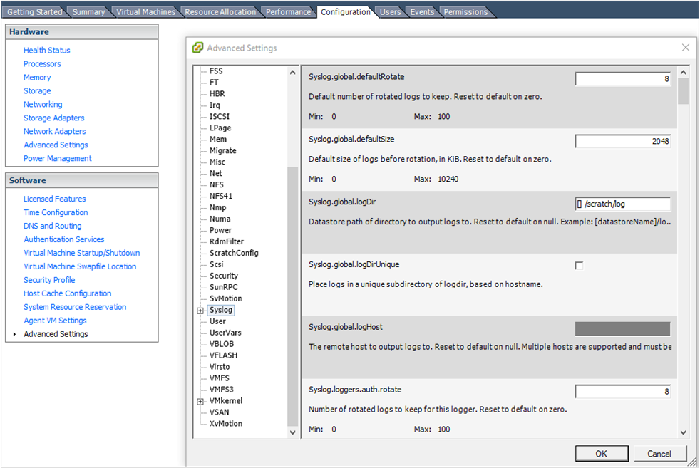

<properties
    pageTitle="Überwachen von VMware-Lösung in Log Analytics | Microsoft Azure"
    description="Erfahren Sie, wie Sie die Lösung für die Überwachung VMware Protokolle verwalten und überwachen ESXi Hosts organisieren kann."
    services="log-analytics"
    documentationCenter=""
    authors="bandersmsft"
    manager="jwhit"
    editor=""/>

<tags
    ms.service="log-analytics"
    ms.workload="na"
    ms.tgt_pltfrm="na"
    ms.devlang="na"
    ms.topic="article"
    ms.date="10/28/2016"
    ms.author="banders"/>

# <a name="vmware-monitoring-preview-solution-in-log-analytics"></a>VMware Überwachung (Preview)-Lösung in Log Analytics

Die Lösung VMware Überwachung in Log Analytics ist eine Lösung, die Ihnen dabei hilft eine zentrale Protokollierung und Ansatz für große VMware Protokolle für die Überwachung erstellen. Dieser Artikel beschreibt, wie Sie behandeln von Problemen mit, erfassen und Verwalten der ESXi Hosts in einem einzigen Speicherort mithilfe der Lösung. Mit der Lösung sehen Sie die Detaildaten für alle ESXi Hosts in einem einzigen Speicherort. Finden Sie unter verwendete Ereignis zählt, Status und Trends von virtuellen Computer und ESXi Hosts über die Protokolle der ESXi Host bereitgestellt. Sie können nach anzeigen und Durchsuchen zentralisierte ESXi Host Protokolle behandeln. Und Sie können Benachrichtigungen basierend auf Log Suchabfragen erstellen.

Die Lösung verwendet systemeigene Syslog Funktionalität des Hosts ESXi Pushbenachrichtigungen Daten auf ein Ziel virtueller Computer, die OMS-Agent ist. Jedoch Schreiben nicht die Lösung Dateien in Syslog innerhalb des Ziels virtueller Computer. Der OMS-Agent öffnet den Port 1514 und überwacht folgt. Nachdem sie die Daten empfängt, legt der OMS-Agent die Daten OMS.

## <a name="installing-and-configuring-the-solution"></a>Installieren und konfigurieren die Lösung

Verwenden Sie die folgende Informationen zum Installieren und konfigurieren die Lösung.

- Fügen Sie die Lösung für die Überwachung VMware in Ihren OMS Arbeitsbereich mithilfe des Prozesses [Hinzufügen Log Analytics Lösungen aus dem Lösungskatalog](log-analytics-add-solutions.md)beschrieben.

#### <a name="supported-vmware-esxi-hosts"></a>Unterstützte VMware ESXi hosts
vSphere ESXi Host 5.5 und 6.0

#### <a name="prepare-a-linux-server"></a>Vorbereiten eines Linux-Servers
Erstellen einer Linux Betriebssystem virtuellen Computer alle Syslog Daten von der ESXi Hosts empfangen. Der [OMS Linux-Agent](log-analytics-linux-agents.md) ist der Websitesammlung für alle ESXi Host Syslog Daten. Sie können mehrere ESXi Hosts verwenden, um Protokolle an einen einzelnen Linux-Server, wie im folgenden Beispiel weiterzuleiten.  

   

### <a name="configure-syslog-collection"></a>Konfigurieren von Syslog Websitesammlung

1. Richten Sie Syslog-Weiterleitung für VSphere aus. Ausführliche Informationen zum Einrichten der Weiterleitung Syslog helfen, finden Sie unter [Konfigurieren von Syslog auf ESXi 5.x und 6.0 (2003322)](https://kb.vmware.com/selfservice/microsites/search.do?language=en_US&cmd=displayKC&externalId=2003322). Wechseln Sie zu **ESXi Hostkonfiguration** > **Software** > **Erweiterte Einstellungen** > **Syslog**.
    

2. Fügen Sie im Feld *Syslog.global.logHost* Ihrem Linux-Server und den Port Zahl *1514*aus. Beispielsweise `tcp://hostname:1514` oder`tcp://123.456.789.101:1514`

3. Öffnen Sie die Firewall ESXi Host für Syslog ein. **Hostkonfiguration ESXi** > **Software** > **Security-Profil** > **Firewall** und **Eigenschaften**öffnen.  

      

      

4. Überprüfen Sie die vSphere Console, um sicherzustellen, dass die Syslog ordnungsgemäß eingerichtet ist. Bestätigen Sie auf dem Host ESXI diesen Port **1514** konfiguriert ist.

5. Testen Sie die Konnektivität zwischen dem Linux-Server und dem ESXi Host mithilfe der `nc` auf dem ESXi Host Befehl. Beispiel:

    ```
    [root@ESXiHost:~] nc -z 123.456.789.101 1514
    Connection to 123.456.789.101 1514 port [tcp/*] succeeded!
    ```

6. Herunterladen und Installieren der OMS-Agent für Linux auf dem Server Linux. Weitere Informationen finden Sie in der [Dokumentation für OMS-Agent für Linux](https://github.com/Microsoft/OMS-Agent-for-Linux).

7. Nachdem der OMS-Agent für Linux installiert ist, wechseln Sie zu dem Verzeichnis /etc/opt/microsoft/omsagent/sysconf/omsagent.d, und kopieren Sie die vmware_esxi.conf Datei /etc/opt/microsoft/omsagent/conf/omsagent.d Verzeichnis zu ändern, die/der Gruppe Besitzer und die Berechtigungen der Datei. Beispiel:

    ```
    sudo cp /etc/opt/microsoft/omsagent/sysconf/omsagent.d/vmware_esxi.conf /etc/opt/microsoft/omsagent/conf/omsagent.d
sudo chown omsagent:omiusers /etc/opt/microsoft/omsagent/conf/omsagent.d/vmware_esxi.conf
    ```

8.  Starten Sie den OMS-Agent für Linux durch Ausführen `sudo /opt/microsoft/omsagent/bin/service_control restart`.

9. Führen Sie im Portal OMS eine Log-Suche nach `Type=VMware_CL`. Wenn OMS Syslog Daten sammelt, beibehalten das Format Syslog. Im Portal werden einige bestimmte Felder wie *Hostname* und *ProcessName*erfasst.  

      

    Wenn Sie Ihre Ansicht Log Suchergebnisse der vorstehende Abbildung ähneln, sind Sie mit dem OMS VMware Überwachung Lösung Dashboard festlegen.  

## <a name="vmware-data-collection-details"></a>Einzelheiten zur Datensammlung VMware

Die Lösung für die Überwachung VMware sammelt verschiedene Leistung Kennzahlen und melden Sie sich Daten von ESXi Hosts mithilfe der OMS-Agents für Linux, die Sie aktiviert haben.

Die folgende Tabelle zeigt Datensammlungsmethoden und andere Details, wie Daten erfasst werden.

| Plattform | OMS-Agent für Linux | SCOM agent | Azure-Speicher | SCOM erforderlich? | SCOM Agentdaten per Management Group unter gesendeten | Häufigkeit Collection |
|---|---|---|---|---|---|---|
|Linux||||            || alle 3 Minuten|


In der folgenden Tabelle werden Beispiele Datenfelder durch die Lösung für die Überwachung VMware erfasst:

| Feldname | Beschreibung |
| --- | --- |
| Device_s| VMware Speichergeräte |
| ESXIFailure_s | die Fehlertypen |
| EventTime_t | Zeit als Ereignis auftrat |
| HostName_s | ESXi Hostname |
| Operation_s | Erstellen von virtuellen Computer oder Löschen von virtuellen Computer |
| ProcessName_s | Name des Ereignisses |
| ResourceId_s | Name des Hosts VMware |
| ResourceLocation_s | VMware |
| ResourceName_s | VMware |
| ResourceType_s | Hyper-V |
| SCSIStatus_s | VMware SCSI-status |
| SyslogMessage_s | Syslog-Daten |
| UserName_s | Benutzer, der erstellt oder gelöscht virtueller Computer |
| VMName_s | Name des virtuellen Computers |
| Computer | Host-computer |
| TimeGenerated | Uhrzeit, zu dem Generieren der Daten |
| DataCenter_s | VMware datacenter |
| StorageLatency_s | Speicher Wartezeit (ms) |

## <a name="vmware-monitoring-solution-overview"></a>Übersicht über die Lösung für die Überwachung von VMware

Die Kachel VMware wird im Portal OMS angezeigt. Es bietet einen Überblick über alle Fehler. Wenn Sie die Kachel klicken, wechseln Sie in einem Dashboard-Ansicht.


#### <a name="navigate-the-dashboard-view"></a>Navigieren Sie in der Dashboardansicht

Blades sind in der Ansicht **VMware** Dashboard in unterteilt:

- Anzahl der Fehler Status
- Zählt die oberen Host nach Wettkampf
- Anzahl der obersten-Ereignis
- Aktivitäten von virtuellen Computern
- ESXi Host Datenträger Ereignisse


Klicken Sie auf eine beliebige Blade zum Log Analytics-Suche (Bereich) zu öffnen, die detaillierten Informationen für das Blade bestimmte zeigt.

Von hier aus können Sie die Suchabfrage, um nach einem bestimmten Thema ändern, bearbeiten. Ein Lernprogramm auf die Grundlagen des OMS suchen, sehen Sie sich die [OMS Log Suche Lernprogramm.](log-analytics-log-searches.md)

#### <a name="find-esxi-host-events"></a>Suchen nach ESXi Hostereignisse

Ein einzelner ESXi Host generiert mehrere Protokolle, basierend auf deren Prozesse an. Die Lösung für die Überwachung VMware zentrales diese und enthält eine Übersicht über das Ereignis zählt. Diese zentralisierte Ansicht hilft zu verstehen, welche ESXi Host eine hohe Anzahl von Ereignissen hat und welche Ereignisse am häufigsten in Ihrer Umgebung auftreten.


Sie können einen Drilldown durchführen weiteren, indem Sie auf eine ESXi Host oder ein Ereignistyp.

Wenn Sie einen Hostnamen ESXi klicken, zeigen Sie Informationen aus, ESXi hosten. Wenn Sie mit den Ereignistyp Ergebnisse einschränken möchten, fügen Sie `“ProcessName_s=EVENT TYPE”` in Ihrer Suchabfrage. Sie können in den Suchfilter **ProcessName** auswählen. Das beschränkt die Informationen für Sie.


#### <a name="find-high-vm-activities"></a>Suchen nach Aktivitäten mit hohem virtueller Computer

Eine virtuellen Computern können erstellt und auf einem beliebigen Host ESXi gelöscht werden. Es empfiehlt sich für einen Administrator voraus, wie viele virtuelle Computer identifizieren ein ESXi Host erstellt. Die in-aktivieren, können Sie um Planung und Leistung zu verstehen. Nachverfolgen von virtuellen Computer Aktivitätsereignisse ist entscheidend, wenn Sie Ihre Umgebung verwalten.


Wenn Sie weitere ESXi Host virtueller Computer Erstellung Daten anzeigen möchten, klicken Sie auf eine ESXi Hostname.


#### <a name="common-search-queries"></a>Häufige Suchabfragen

Die Lösung umfasst andere nützlichen Abfragen, mit denen Sie Ihre ESXi Hosts, wie hoch Speicherplatz, Speicher Wartezeit und Fehler bei der Pfad verwalten können.


#### <a name="save-queries"></a>Speichern von Abfragen

Speichern Suchabfragen ist eine Standardfunktion in OMS und helfen Ihnen, alle Abfragen beibehalten möchten, die Sie hilfreiche gefunden haben. Nachdem Sie eine Abfrage, die Sie hilfreich sein erstellen, speichern Sie es durch Klicken auf den **Favoriten**. Eine gespeicherte Abfrage können Sie ganz einfach es später über die Seite [Mein Dashboard](log-analytics-dashboards.md) wiederverwenden können Sie Ihre eigenen benutzerdefinierten Dashboards erstellen.


#### <a name="create-alerts-from-queries"></a>Erstellen von Benachrichtigungen aus Abfragen

Nachdem Sie Ihre Abfragen erstellt haben, sollten Sie die Abfragen verwenden, um Sie zu warnen, wenn bestimmte Ereignisse auftreten. Informationen zum Erstellen von Benachrichtigungen finden Sie unter [Warnungen im Log Analytics](log-analytics-alerts.md) . Beispiele für Warnung von Abfragen und andere Beispiele für die Abfrage finden Sie im [Monitor VMware verwenden OMS Log Analytics](https://blogs.technet.microsoft.com/msoms/2016/06/15/monitor-vmware-using-oms-log-analytics) Blogbeitrag.

## <a name="frequently-asked-questions"></a>Häufig gestellte Fragen

### <a name="what-do-i-need-to-do-on-the-esxi-host-setting-what-impact-will-it-have-on-my-current-environment"></a>Was muss ich auf die ESXi Einstellung hosten kann? Welche Auswirkung wird es auf meine aktuelle Umgebung haben?
Die Lösung verwendet systemeigene ESXi Host Syslog Verfahren weiterleiten. Sie benötigen keine zusätzlichen Microsoft Software auf dem ESXi Host auf die Protokolle zu erfassen. Es muss eine geringe Auswirkung auf die vorhandene Umgebung verfügen. Allerdings muss Sie Syslog-Weiterleitung festlegen, also ESXI Funktionalität.

### <a name="do-i-need-to-restart-my-esxi-host"></a>Muss ich meine ESXi Host neu starten?
Nein. Dieses Verfahren erfordert einen Neustart nicht. Manchmal ist es aktualisiert vSphere nicht ordnungsgemäß Syslog. Melden Sie in diesem Fall sich an den Host ESXi und Laden Sie Syslog neu zu. Sie keine erneut, den Host neu zu starten, damit dieses Verfahren für Ihre Umgebung Unterbrechung nicht zur Verfügung.

### <a name="can-i-increase-or-decrease-the-volume-of-log-data-sent-to-oms"></a>Kann ich erhöhen oder verringern die Lautstärke Log Daten an OMS gesendet werden?
Ja, können Sie aus. Sie können die Einstellungen ESXi Host Logebene in vSphere verwenden. Log-Auflistung basiert auf der Ebene *Informationen* . Wenn Sie die Erstellung virtueller Computer oder Löschung überwachen möchten, müssen Sie Ja, die Ebene *Info* auf Hostd beibehalten. Weitere Informationen finden Sie im [VMware Knowledge Base](https://kb.vmware.com/selfservice/microsites/search.do?&cmd=displayKC&externalId=1017658).

### <a name="why-is-hostd-not-providing-data-to-oms-my-log-setting-is-set-to-info"></a>Warum bietet Hostd keine Daten zu OMS? Meine Log-Einstellung wird auf Status festgelegt.
Es wurde ein ESXi Host Fehler für den Zeitstempel Syslog ein. Weitere Informationen finden Sie im [VMware Knowledge Base](https://kb.vmware.com/selfservice/microsites/search.do?language=en_US&cmd=displayKC&externalId=2111202). Nachdem Sie die Schritte ausgeführt haben, sollte Hostd normal funktionieren.

### <a name="can-i-have-multiple-esxi-hosts-forwarding-syslog-data-to-a-single-vm-with-omsagent"></a>Kann ich mehrere ESXi Hosts Weiterleiten von Syslog Daten an einen einzelnen virtuellen Computer mit Omsagent verwenden?
Ja. Sie können mehrere ESXi Hosts weiterleiten an einen einzelnen virtuellen Computer mit Omsagent haben.

### <a name="why-dont-i-see-data-flowing-into-oms"></a>Warum angezeigt nicht Datenfluss in OMS?

Mehrere Ursachen möglich:

- Daten ist in der virtuelle Computer ausgeführt Omsagent nicht ordnungsgemäß der Host ESXi ablegen. Um zu testen, führen Sie die folgenden Schritte aus:
    1. Um zu bestätigen, melden Sie sich bei des Verwendung von ssh ESXi Hosts, und führen Sie den folgenden Befehl aus:`nc -z ipaddressofVM 1514`

        Wenn dies nicht erfolgreich ist, sind vSphere Einstellungen für die erweiterte Konfiguration wahrscheinlich nicht korrigiert. Informationen zum Einrichten des ESXi Hosts für die Weiterleitung Syslog finden Sie unter [Konfigurieren Syslog Websitesammlung](#configure-syslog-collection) .

    2. Wenn Syslog Port-Konnektivität kann erfolgreich zurückgerufen werden, aber keine Daten weiterhin angezeigt wird, laden Sie das Syslog auf dem Host ESXi, mithilfe von ssh den folgenden Befehl ausführen:` esxcli system syslog reload`

- Der virtuellen Computer mit OMS-Agent ist nicht richtig eingestellt. Um dies zu testen, führen Sie die folgenden Schritte aus:
    1. OMS an den Port 1514 überwacht und legt OMS Daten. Um zu überprüfen, dass er geöffnet ist, führen Sie den folgenden Befehl aus:`netstat -a | grep 1514`
    2. Sie auftreten Port `1514/tcp` zu öffnen. Wenn Sie nicht der Fall ist, stellen Sie sicher, dass die Omsagent ordnungsgemäß installiert ist. Wenn Sie die Portinformationen nicht angezeigt werden, ist nicht der Port Syslog des virtuellen Computers öffnen.
        1. Stellen Sie sicher, dass der OMS-Agent, mithilfe von ausgeführt wird `ps -ef | grep oms`. Wenn er nicht ausgeführt wird, starten Sie den Prozess, indem Sie den Befehl ausführen` sudo /opt/microsoft/omsagent/bin/service_control start`
        2. Öffnen der `/etc/opt/microsoft/omsagent/conf/omsagent.d/vmware_esxi.conf` Datei.

            Stellen Sie sicher, dass der richtige Benutzer und Gruppe Einstellung gültige, ähnlich wie:`-rw-r--r-- 1 omsagent omiusers 677 Sep 20 16:46 vmware_esxi.conf`

            Wenn die Datei ist nicht vorhanden, oder die Benutzer und die Einstellung für die Gruppe ist falsch, Ausführen von Maßnahmen durch [Vorbereiten eines Linux-Servers](#prepare-a-linux-server).

## <a name="next-steps"></a>Nächste Schritte

- Verwenden von [Log Suchvorgänge](log-analytics-log-searches.md) in Log Analytics VMware Host Detaildaten anzeigen.
- [Erstellen eigener Dashboards](log-analytics-dashboards.md) mit VMware Hostdaten.
- [Erstellen von Benachrichtigungen](log-analytics-alerts.md) beim Auftreten bestimmter VMware Hostereignisse.
