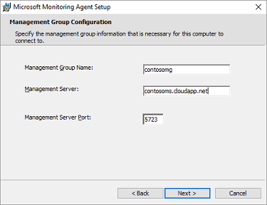
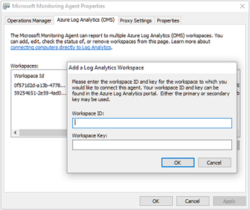

<properties
    pageTitle="Herstellen einer Verbindung Log Analytics mit Windows-Computer | Microsoft Azure"
    description="In diesem Artikel werden die Schritte zum Verbinden die Windows-Computer in Ihrer lokalen Infrastruktur direkt an OMS mithilfe einer benutzerdefinierten Version von Microsoft für die Überwachung-Agent (MMA)."
    services="log-analytics"
    documentationCenter=""
    authors="bandersmsft"
    manager="jwhit"
    editor=""/>

<tags
    ms.service="log-analytics"
    ms.workload="na"
    ms.tgt_pltfrm="na"
    ms.devlang="na"
    ms.topic="article"
    ms.date="08/11/2016"
    ms.author="banders"/>


# <a name="connect-windows-computers-to-log-analytics"></a>Herstellen einer Verbindung Log Analytics mit Windows-Computern

In diesem Artikel werden die Schritte zum Verbinden die Windows-Computer in Ihrer lokalen Infrastruktur direkt an OMS Arbeitsbereiche mithilfe einer benutzerdefinierten Version von Microsoft für die Überwachung-Agent (MMA). Sie müssen installieren und Verbinden von Agents für alle Computer die gewünschte mit integrierten zu OMS in Reihenfolge für diese Daten an OMS senden und zum Anzeigen und wirken sich auf die Daten im Portal OMS. Jeder Agent kann mehrere Arbeitsbereiche melden.

Sie können mit dem Setupprogramm Befehlszeile, Agents installieren oder mit gewünscht Zustand Konfiguration (DSC) in Azure Automatisierung.  

>[AZURE.NOTE] Für virtuellen Computern kann in Azure ausgeführt Installation vereinfachen, mit der [Erweiterung des virtuellen Computers](log-analytics-azure-vm-extension.md).

Auf Computern mit Internet Connectivity wird der Agent die Verbindung zum Internet zum Senden von Daten zu OMS verwenden. Auf Computern, die nicht über eine Verbindung mit dem Internet verfügen, können Sie einen Proxy oder die OMS Log Analytics Weiterleitung verwenden.

Verbinden Ihre Windows-Computer mit OMS ist einfach mithilfe von 3 einfachen Schritten:

1. Die Agent-Setup-Datei nicht herunterladen
2. Installieren Sie den Agent mithilfe der Methode, die Sie auswählen
3. Konfigurieren des Agents oder fügen Sie gegebenenfalls zusätzliche Arbeitsbereiche hinzu

Das folgende Diagramm zeigt die Beziehung zwischen Ihrem Windows-Computern und OMS, nachdem Sie installiert und Agents konfiguriert haben.


## <a name="system-requirements-and-required-configuration"></a>Systemvoraussetzungen und erforderliche Konfiguration
Vor der Installation oder Agents bereitstellen, überprüfen Sie die folgenden Details, um sicherzustellen, dass die notwendigen erfüllen.

- Sie können nur die OMS MMA auf Computern unter Windows Server 2008 SP 1 oder höher oder Windows 7 SP1 installieren oder höher.
- Benötigen Sie ein Abonnement OMS ein.  Weitere Informationen finden Sie unter [Erste Schritte mit Log Analytics](log-analytics-get-started.md).
- Jeder Windows-Computer muss eine Verbindung mit dem Internet mit HTTPS herstellen. Diese Verbindung kann direkt, über einen Proxy, oder über die OMS Log Analytics Weiterleitung sein.
- Sie können die OMS MMA auf eigenständigen Computern, Servern und virtuellen Computern installieren. Wenn Sie OMS gehostet Azure virtuellen Computern herstellen möchten, finden Sie unter [Verbinden Azure-virtuellen Computern zu Log Analytics](log-analytics-azure-vm-extension.md).
- Der Agent muss TCP-Port 443 für verschiedene Ressourcen verwendet werden soll. Weitere Informationen finden Sie unter [Konfigurieren von Proxy und Firewall-Einstellungen in Log Analytics](log-analytics-proxy-firewall.md).

## <a name="download-the-agent-setup-file-from-oms"></a>Die Agent-Setupdatei vom OMS herunterladen
1. Klicken Sie im Portal OMS auf der Seite **Übersicht** auf die Kachel " **Einstellungen** ".  Klicken Sie auf der Registerkarte **Datenquellen verbunden** oben.  
    
2. Klicken Sie unter **Computern direkt anfügen**klicken Sie auf **Herunterladen von Windows-Agent** anwendbar den Typ des Computers Prozessor zum Herunterladen der Setupdatei.
3. Klicken Sie auf der rechten Seite der **Arbeitsbereich-ID**klicken Sie auf das Symbol "Kopieren", und fügen Sie die ID in Editor.
4. Klicken Sie auf der rechten Seite des **Primärschlüssels**klicken Sie auf das Symbol "Kopieren", und fügen Sie die Taste in Editor.     
    

## <a name="install-the-agent-using-setup"></a>Installieren Sie den Agent mithilfe von setup
1. Führen Sie Setup aus, um den Agent auf einem Computer installieren, die Sie verwalten möchten.
2. Klicken Sie auf der Seite Willkommen auf **Weiter**.
3. Klicken Sie auf der Seite Lizenzbedingungen lesen Sie die Lizenz, und klicken Sie dann auf **ich stimme zu**.
4. Klicken Sie auf der Seite Zielordner ändern Sie oder behalten Sie den Standardordner für die Installation, und klicken Sie dann auf **Weiter**.
5. Auf der Seite Setupoptionen Agent die Möglichkeit, den Agent zum Azure Log Analytics (OMS), Operations Manager, verbinden, oder Sie können die Auswahlmöglichkeiten leer lassen, wenn Sie den Agent später konfigurieren möchten. Klicken Sie auf **Weiter**.   
    - Wenn Sie zum Azure Log Analytics (OMS) eine Verbindung herstellen möchten, fügen Sie der **Arbeitsbereich-ID** und der **Arbeitsbereich Schlüssel (Primärschlüssel)** , die Sie in Editor im vorangehenden Verfahren kopiert, und klicken Sie dann auf **Weiter**.  
        
    - Wenn Sie mit Operations Manager verbinden möchten, geben Sie **Gruppennamen Management**, **Verwaltung** Servernamen und **Serverport Verwaltung**, und klicken Sie dann auf **Weiter**. Klicken Sie auf der Seite Agent Aktionskonto wählen Sie entweder das lokale Systemkonto oder ein Konto lokale Domäne, und klicken Sie dann auf **Weiter**.  
        

6. Klicken Sie auf der Seite bereit zum Installieren überprüfen Sie Ihre Auswahl, und klicken Sie dann auf **Installieren**.
7. Klicken Sie auf die Konfiguration wurde erfolgreich abgeschlossen Seite, klicken Sie auf **Fertig stellen**.
8. Wenn Sie fertig sind, wird der **Microsoft-Agent für die Überwachung** in **Der Systemsteuerung**. Können Sie es die Konfiguration überprüfen und stellen Sie sicher, dass der Agent zum Betrieb Einsichten (OMS) verbunden ist. Wenn mit OMS verbunden, der Agent zeigt eine Meldung: **der Microsoft Überwachung Agent zum Dienst Microsoft Operations Management Suite erfolgreich eine Verbindung hergestellt hat.**

## <a name="install-the-agent-using-the-command-line"></a>Installieren Sie den Agent über die Befehlszeile
- Ändern, und klicken Sie dann im folgenden Beispiel wird zum Installieren des Agents über die Befehlszeile verwenden.

    >[AZURE.NOTE] Wenn Sie einen Agent aktualisieren möchten, müssen Sie das Protokoll Analytics Skripting-API verwenden. Finden Sie im nächsten Abschnitt, einen Agent zu aktualisieren.

    ```
    MMASetup-AMD64.exe /Q:A /R:N /C:"setup.exe /qn ADD_OPINSIGHTS_WORKSPACE=1 OPINSIGHTS_WORKSPACE_ID=<your workspace id> OPINSIGHTS_WORKSPACE_KEY=<your workspace key> AcceptEndUserLicenseAgreement=1"
    ```

## <a name="upgrade-the-agent-and-add-a-workspace-using-a-script"></a>Aktualisieren Sie den Agent, und fügen Sie einen Arbeitsbereich mit einem Skript hinzu.
Können Sie einen Agent aktualisieren und fügen Sie einen Arbeitsbereich mithilfe der Log Analytics Skripting-API durch das folgende Beispiel der PowerShell hinzu.

```
$mma = New-Object -ComObject 'AgentConfigManager.MgmtSvcCfg'
$mma.AddCloudWorkspace($workspaceId, $workspaceKey)
$mma.ReloadConfiguration()
```

>[AZURE.NOTE] Wenn Sie haben die Befehlszeile oder das Skript zuvor installieren oder Konfigurieren des Agents `EnableAzureOperationalInsights` wurde ersetzt durch `AddCloudWorkspace`.

## <a name="install-the-agent-using-dsc-in-azure-automation"></a>Installieren Sie den Agent DSC in Azure Automatisierung verwenden

>[AZURE.NOTE] In diesem Beispiel Prozedur und Skript kann einen vorhandenen Agent nicht aktualisiert werden.

1. Importieren Sie die xPSDesiredStateConfiguration DSC Modul aus [http://www.powershellgallery.com/packages/xPSDesiredStateConfiguration](http://www.powershellgallery.com/packages/xPSDesiredStateConfiguration) in Azure Automatisierung.  
2.  Erstellen von Azure Automatisierung Variable Posten für *OPSINSIGHTS_WS_ID* und *OPSINSIGHTS_WS_KEY*. *OPSINSIGHTS_WS_ID* auf Ihre OMS Log Analytics-Arbeitsbereich-ID und festgelegt *OPSINSIGHTS_WS_KEY* auf den Primärschlüssel der dem Arbeitsbereich.
3.  Verwenden Sie das folgende Skript, und speichern Sie es als MMAgent.ps1
4.  Ändern Sie, und verwenden Sie das folgende Beispiel zum Installieren des Agents DSC in Azure Automatisierung verwenden. Importieren von MMAgent.ps1 in Azure Automatisierung mithilfe der Automatisierung Azure-Benutzeroberfläche oder Cmdlet.
5.  Weisen Sie einen Knoten an der Konfiguration aus. Innerhalb von 15 Minuten wird der Knoten seine Konfiguration überprüfen und die MMA werden auf den Knoten abgelegt werden.

```
Configuration MMAgent
{
    $OIPackageLocalPath = "C:\MMASetup-AMD64.exe"
    $OPSINSIGHTS_WS_ID = Get-AutomationVariable -Name "OPSINSIGHTS_WS_ID"
    $OPSINSIGHTS_WS_KEY = Get-AutomationVariable -Name "OPSINSIGHTS_WS_KEY"


    Import-DscResource -ModuleName xPSDesiredStateConfiguration

    Node OMSnode {
        Service OIService
        {
            Name = "HealthService"
            State = "Running"
            DependsOn = "[Package]OI"
        }

        xRemoteFile OIPackage {
            Uri = "http://download.microsoft.com/download/0/C/0/0C072D6E-F418-4AD4-BCB2-A362624F400A/MMASetup-AMD64.exe"
            DestinationPath = $OIPackageLocalPath
        }

        Package OI {
            Ensure = "Present"
            Path  = $OIPackageLocalPath
            Name = "Microsoft Monitoring Agent"
            ProductId = "8A7F2C51-4C7D-4BFD-9014-91D11F24AAE2"
            Arguments = '/C:"setup.exe /qn ADD_OPINSIGHTS_WORKSPACE=1 OPINSIGHTS_WORKSPACE_ID=' + $OPSINSIGHTS_WS_ID + ' OPINSIGHTS_WORKSPACE_KEY=' + $OPSINSIGHTS_WS_KEY + ' AcceptEndUserLicenseAgreement=1"'
            DependsOn = "[xRemoteFile]OIPackage"
        }
    }
}  


```


## <a name="configure-an-agent-manually-or-add-additional-workspaces"></a>Konfigurieren Sie Agent manuell, oder fügen Sie zusätzliche Arbeitsbereiche
Wenn Sie Agents installiert haben, aber nicht diese konfiguriert haben oder der Agent an mehrere Arbeitsbereiche Berichten soll, können Sie die folgende Informationen Agent aktivieren, oder es neu zu konfigurieren. Nachdem Sie den Agent konfiguriert haben, wird mit der Agent-Dienst registriert und erhalten erforderlichen Konfigurationsinformationen und Management Packs, die Informationen zur Lösung enthalten.

1. Nachdem Sie die Überwachung Microsoft Agent installiert haben, öffnen Sie die **Systemsteuerung**.
2. Öffnen Sie die **Microsoft-Agent für die Überwachung** , und klicken Sie dann auf die Registerkarte **Azure Log Analytics (OMS)** .   
3. Klicken Sie auf **Hinzufügen** , um das **Hinzufügen einer Log Analytics-Arbeitsbereich** zu öffnen.
4. Fügen Sie der **Arbeitsbereich-ID** und der **Arbeitsbereich Schlüssel (Primärschlüssel)** , die Sie in Editor im vorangehenden Verfahren für den Arbeitsbereich kopiert, die Sie verwenden möchten haben, hinzufügen, und klicken Sie dann auf **OK**.  
    

Nachdem Daten aus Computern, die vom Agent überwacht gesammelt wurden, wird die Anzahl von OMS überwacht Computer als **Server verbunden**im Portal OMS auf der Registerkarte **Verbunden Quellen** in den **Einstellungen** angezeigt.


## <a name="to-disable-an-agent"></a>So deaktivieren Sie einen agent
1. Öffnen Sie nach der Installation des Agents **Control Panel**.
2. Öffnen Sie die Microsoft-Agent für die Überwachung, und klicken Sie dann auf die Registerkarte **Azure Log Analytics (OMS)** .
3. Wählen Sie einen Arbeitsbereich aus, und klicken Sie dann auf **Entfernen**. Wiederholen Sie diesen Schritt für alle anderen Arbeitsbereiche aus.


## <a name="optionally-configure-agents-to-report-to-an-operations-manager-management-group"></a>Konfigurieren von Agents für die Berichterstattung zu einer Management Group unter Operations Manager optional

Wenn Sie in Ihrer IT-Infrastruktur Operations Manager verwenden, können Sie auch den MMA-Agent als Agent Operations Manager.

### <a name="to-configure-mma-agents-to-report-to-an-operations-manager-management-group"></a>So konfigurieren Sie MMA Agents für die Berichterstattung zu einer Management Group unter Operations Manager
1.  Öffnen Sie auf dem Computer, auf dem der Agent installiert ist, **Control Panel**ein.
2.  Öffnen Sie **Microsoft Überwachung Agent** , und klicken Sie dann auf die Registerkarte **Vorgänge-Manager** .
    
3.  Wenn Ihre Operations Manager-Server-Integration in Active Directory verfügen, klicken Sie auf **Verwaltung Gruppe Zuordnungen aus AD DS automatisch aktualisiert**.
4.  Klicken Sie auf **Hinzufügen** , um das Dialogfeld **Management Gruppe hinzufügen** zu öffnen.  
    
5.  Geben Sie den Namen der Verwaltungsgruppe, im **Management Gruppennamen** .
6.  Geben Sie im Feld **primäre Management Server** den Netzwerknamen des primären Management-Servers ein.
7.  Geben Sie im Feld **Management Serverport** die TCP Port-Nummer aus.
8.  Wählen Sie unter **Agent Aktionskonto**entweder das lokale Systemkonto oder ein Konto lokale Domäne aus.
9.  Klicken Sie auf **OK** , um Schließen des Dialogfelds **Management Gruppe hinzufügen** , und klicken Sie dann auf **OK** , um das Dialogfeld **Eigenschaften von Microsoft für die Überwachung Agent** schließen.

## <a name="optionally-configure-agents-to-use-the-oms-log-analytics-forwarder"></a>Konfigurieren Sie optional-Agents die OMS Log Analytics Weiterleitung verwenden

Wenn Sie Ihren Servern oder Clients, die nicht über eine Verbindung mit dem Internet verfügen, können Sie diese Daten mithilfe der OMS Log Analytics Weiterleitung an OMS zu senden haben.  Wenn Sie die Weiterleitung verwenden, werden alle Daten von Agents über einen einzelnen Server, der mit dem Internet zugreifen gesendet. Die Weiterleitung weiterleitet Daten von den Agents zu OMS direkt ohne Analysieren von Daten, die übertragen werden.

Finden Sie unter [OMS Log Analytics Weiterleitung](https://blogs.technet.microsoft.com/msoms/2016/03/17/oms-log-analytics-forwarder) erfahren Sie mehr über die Weiterleitung, einschließlich Installation und Konfiguration.

Informationen zum Konfigurieren Ihrer-Agents einen Proxyserver verwenden, der in diesem Fall die Weiterleitung OMS ist, finden Sie unter [Konfigurieren Proxy und der Firewall in Log Analytics](log-analytics-proxy-firewall.md).

## <a name="optionally-configure-proxy-and-firewall-settings"></a>Konfigurieren Sie optional Proxy und firewall
Wenn Sie Ihren Proxy-Servern oder Firewalls in Ihrer Umgebung, die Zugriff auf das Internet einschränken, finden Sie unter [Konfigurieren von Proxy und Firewall-Einstellungen in Log Analytics](log-analytics-proxy-firewall.md) Ihrer Agents zur Kommunikation mit dem Dienst OMS aktivieren.

## <a name="next-steps"></a>Nächste Schritte

- [Hinzufügen von Log Analytics Lösungen aus dem Lösungskatalog](log-analytics-add-solutions.md) zum Hinzufügen von Funktionen und Daten zu sammeln.
- [Konfigurieren von Proxy und Firewall-Einstellungen in Log Analytics](log-analytics-proxy-firewall.md) Wenn Ihre Organisation einen Proxyserver oder eine Firewall verwendet, damit Agents mit der Log Analytics-Dienst kommunizieren können.
