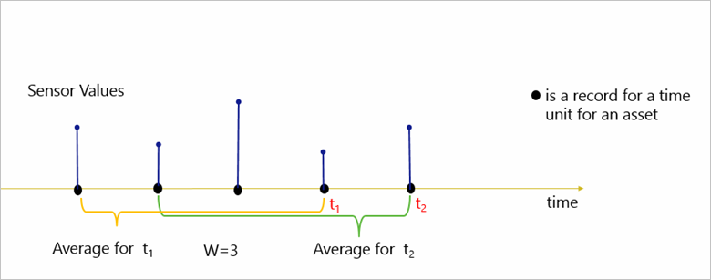
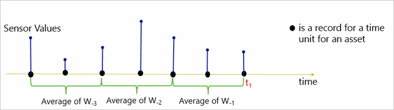
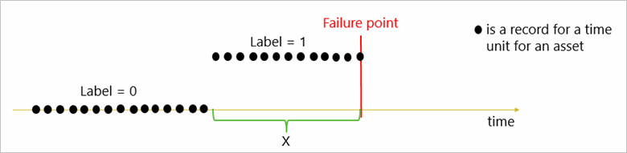
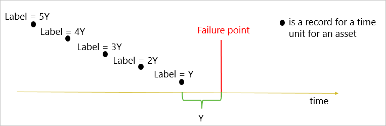
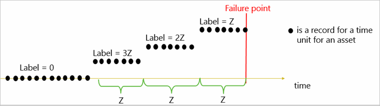
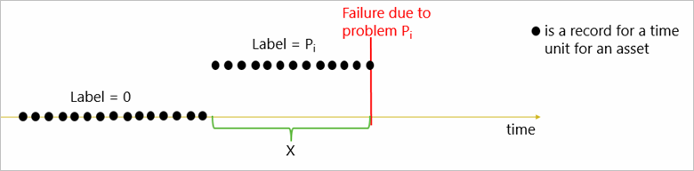
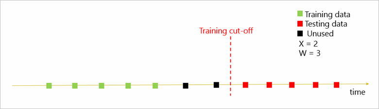
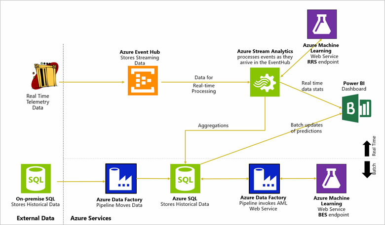

<properties
    pageTitle="Cortana Intelligence Lösung Vorlage Playbook für Vorhersage Wartung in Luftfahrt und anderen Unternehmen | Microsoft Azure"
    description="Eine Lösung Vorlage mit Microsoft Cortana Intelligence für Vorhersage Wartung in Aerospace, Dienstprogramme und Shapes für Transport."
    services="cortana-analytics"
    documentationCenter=""
    authors="fboylu"
    manager="jhubbard"
    editor="cgronlun"/>

<tags
    ms.service="cortana-analytics"
    ms.workload="data-services"
    ms.tgt_pltfrm="na"
    ms.devlang="na"
    ms.topic="article"
    ms.date="09/12/2016"
    ms.author="fboylu" />

# Cortana Intelligence Lösung Vorlage Playbook für Vorhersage Wartung in Luftfahrt und anderen Unternehmen

## Geschäftsleitung Zusammenfassung  
Vorhersagen Wartung ist der den am häufigsten angeforderten Clientanwendungen von Vorhersageanalytik mit unarguable Vorteile einschließlich umfangreiche Kosten sparen. Diese Playbook soll Bereitstellen eines Verweises für Vorhersage Wartung Lösungen mit Schwerpunkt auf Fällen Haupt-verwenden.
Halten Sie dem Leser Geben Sie einen Überblick über die am häufigsten verwendeten Business Szenarien Vorhersage Wartung, Probleme eines in Frage kommenden Business Probleme für solche Lösungen, Daten zur Lösung dieser Probleme Business, Vorhersage modeling Verfahren zum Erstellen von Lösungen mithilfe dieser Daten erforderlich ist, und bewährte Methoden für die Stichprobe Lösungsarchitekturen.
Darüber hinaus werden die Einzelheiten der Vorhersage Modelle entwickelt wurden, z. B. Feature technisch, Entwicklung und Leistung Auswertung modellieren. Im Wesentlichen vereint dieser Playbook die Business und analytischen Richtlinien für eine erfolgreiche Entwicklung und Bereitstellung von Lösungen Vorhersage Wartung erforderlich. Erstellen eine anfängliche-Lösung mit Cortana Intelligence Suite und speziell Azure-Computer-Schulung als Ausgangspunkt in ihrer langfristiges Vorhersage Wartung Strategie Zielgruppe helfen werden diesen Richtlinien vorbereitet. Dokumentation zum Thema Cortana Intelligence Suite und Azure-Computer-Schulung finden Sie im [Cortana Analytics](http://www.microsoft.com/server-cloud/cortana-analytics-suite/overview.aspx) und [Azure maschinellen Learning](https://azure.microsoft.com/services/machine-learning/) Seiten.

>[AZURE.TIP]
Einen technischen Leitfaden für die Implementierung von dieser Vorlage Lösung finden Sie unter [technischen Leitfaden für die Vorlage Cortana Intelligence Lösung, für die Vorhersage Wartung](cortana-analytics-technical-guide-predictive-maintenance.md).
Zum Herunterladen eines Diagramms, das bietet einen Überblick über diese Vorlage finden Sie unter [Architektur der Vorlage Cortana Intelligence Lösung für die Vorhersage Wartung](cortana-analytics-architecture-predictive-maintenance.md).

## Playbook Übersicht und Ziel Zielgruppe  
Diese Playbook ist organisiert, um die Vorteile der technischen und nicht technischen Teilnehmer mit unterschiedlichen Hintergründe und Interessen im Raum Vorhersage Wartung. Die Playbook befasst sich mit sowohl auf hoher Ebene Aspekten für die verschiedenen Typen von Vorhersage Wartung Lösungen und Details zum implementieren können. Wird der Inhalt um beide ausstatten verteilt die Zielgruppe, die nur Grundlegendes zu der Lösung Leerzeichen und den Typ von Applications sowie zum Implementieren der folgenden Lösungsvorschlägen gefunden werden, sind daher technische Details interessiert körperlich interessiert sind.

Hauptteil des Inhalts in dieser Playbook wird nicht davon ausgegangen vorherige Daten Wissenschaft wissen oder Fachwissen. Einige Teile der Playbook erforderlich Vertrautheit mit Daten Wissenschaft Konzepte werden sollen, führen Sie die Implementierungsdetails jedoch etwas. Einführung Ebene Daten Wissenschaft Qualifikationen sind vollständig aus dem Material in den Abschnitten profitieren erforderlich.

Die erste Hälfte der im Hintergrund Playbook eine Einführung in Vorhersage Wartung Applications, wie eine Vorhersage Wartung qualifizieren verwenden Lösung, eine Auflistung von gemeinsamer Fällen mit den Details des Problems des Unternehmens, verwenden Sie die Daten umgebenden diese Anfragen und die Vorteile der folgenden Lösungsvorschlägen Vorhersage Wartung implementieren. Diese Abschnitte erforderlich nicht in der Domäne Vorhersageanalytik keine technische Kenntnisse.

In der zweiten Hälfte von der Playbook behandeln wir die Typen von Vorhersage Modellierung Techniken für Applikationen Vorhersage Wartung und wie diese Modelle durch Beispiele von Anfragen verwenden in der ersten Hälfte des der Playbook gegliederter implementiert wird. Zum besseren Verständnis durch die Schritte des Präprozessorlaufs Daten gezeigt, wie Daten beschriften und Features Technik, Modellieren bewährte Methoden für die Auswertung von Auswahl, Schulung/testen und Leistung. Diese Abschnitte sind für technische Zielgruppe geeignet.

## Vorhersagen Wartung in IoT
Die Auswirkung ungeplanten Ausrüstung Ausfall kann extrem destruktive für Unternehmen sein. Es ist entscheidend, Feld Ausrüstung ausgeführt, um die Nutzung und Leistung maximieren beibehalten und minimiert teure, unregelmäßigen Ausfallzeiten. Warten auf den Fehler auftreten ist einfach, nicht in dem heutigen Business Vorgänge Szene kostengünstiger. Um Mitbewerber bleiben, Unternehmen, suchen Sie nach neue Möglichkeiten für die Anlage Leistung durch ausführenden maximieren Verwendung von Daten aus verschiedenen Kanäle erfasst. Eine wichtige Möglichkeit, diese Informationen analysieren ist Vorhersage analytische Techniken nutzen, mit denen zurückliegende Mustern Vorhersagen zukünftigen Aufgabenergebnisse. Eine der am häufigsten verwendeten der folgenden Lösungsvorschlägen heißt Vorhersage Wartung der in der Regel werden können als definiert, aber nicht beschränkt auf die Möglichkeit von Fehlern einer Anlage in Kürze Vorhersage, damit die Anlagen überwacht werden können, um die vorausschauende Identifizieren von Fehlern und agieren, bevor der Fehler auftreten. Diese Lösungen erkennen Fehler Mustern Ermittlung Anlagen, die das größte Risiko des Fehlers berücksichtigt werden. Diese frühe Identifizierung der Probleme hilft eingeschränkte Wartungsressourcen kostengünstiger so bereitstellen und Qualität zu verbessern und Kette Prozesse angeben.

Mit der zunehmenden Internet der Dinge (IoT)-Anwendung, Vorhersage Wartung der zunehmenden Aufmerksamkeit der Branche als die Sammlung von Daten erlangen wurde und Verarbeitung Technologien ausgereift hat, ausreichend zu generieren übermitteln, speichern, und alle Arten von Daten in Stapeln oder in Echtzeit zu analysieren. Solche Technologie einfache Entwicklung und Bereitstellung von End-to-End-Lösungen mit erweiterten Analytics-Lösungen mit Vorhersage Wartung Lösungen bereitstellen wohl des größten Vorteil zu aktivieren.

Business Probleme im Domänenbereich Vorhersage Wartung von hohem Betrieb Risiko aufgrund unerwarteter Fehler "und" Eingeschränkte Einblick in die Ursache von Problemen in komplexe Business-Umgebungen. Die meisten dieser Probleme kann eingestuft werden, um unter den folgenden Business Fragen liegen:

-   Was ist die Wahrscheinlichkeit, die ein Ausrüstungsgegenstand in Kürze fehlschlägt?
-   Was ist die verbleibende Nutzungsdauer der Ausrüstung?
-   Was sind die Ursachen von Fehlern und welche Wartungsaktionen ausgeführt werden soll, um diese Probleme zu beheben?

Durch die Nutzung von Vorhersage Wartung, um die folgenden Fragen beantworten, können Unternehmen:

-   Verringern Sie Betrieb Risiken und erhöhen Sie Zinsfuß zu Anlagen, indem Sie Saisonverkäufen Fehlern, bevor sie aufgetreten sind
-   Reduzieren Sie unnötige zeitbasierte Wartungsvorgänge und Steuern von Kosten für Wartung
-   Bild für insgesamt Marke verbessern, Image und resultierende verlorene Umsätze von Kunden Verluste zu unterdrücken.
-   Niedrigere Inventory-Kosten durch die Ebenen Inventory durch den Punkt neu anordnen Vorhersage verringern
-   Ermitteln Sie bei einer Verbindung zu verschiedenen Probleme bei der Wartung Mustern

Vorhersagen Wartung Lösungen können Unternehmen mit Key Performance Indicators z. B. Gesundheit Ergebnisse in Echtzeit Anlage Bedingung, eine Schätzung der die verbleibende Lebensdauer der Vermögenswerte, Empfehlungen für proaktive Wartungsaktivitäten und geschätzte Bestelldaten für den Austausch von Teilen überwachen bereitstellen.

## Kriterien für Vorhersage Wartung die Qualifikation
Es ist wichtig, um hervorzuheben, dass nicht für alle Fälle verwenden oder geschäftliche Probleme effektiv durch Vorhersage Wartung gelöst werden können. Wichtig, dass Qualifikationskriterien enthalten sind, ob das Problem Vorhersage Natur, ist, die ein klaren Weg Aktion vorhanden ist, um Fehler zu verhindern, wenn sie vorher und vor allem erkannt werden ist Daten mit ausreichende Qualität zur Unterstützung der Anwendungsfall-verfügbar. Hier liegt der Schwerpunkt auf den Anforderungen der Daten für die Erstellung einer Lösung erfolgreiche Vorhersage Wartung.

Beim Erstellen von Vorhersagen Modelle verwenden wir zurückliegende Daten zum Modell Schulen können dann verborgene Mustern erkannt und näher an dieser Muster in den zukünftigen Daten. Diese Modelle werden mit Beispielen, die von den Features und das Ziel des Vorhersage beschriebenen angewiesen. Vorhersagen am Ziel zu machen, indem Sie nur die Features der neuen Beispiele betrachtet wird das Modell ausgebildete erwartet. Es ist entscheidend, dass das Modell die Beziehung zwischen Features und das Ziel des Vorhersage erfassen. Um eine effektive maschinellen learning Modell Schulen, benötigen wir Schulungsdaten, die Features enthält, von denen tatsächlich Vorhersage Power in Richtung das Ziel des Vorhersage, was bedeutet, dass die Daten für das Ziel Vorhersage zu erwarten präzise vorhersagen relevant sein sollen.

Beispielsweise ist das Ziel Fehlern Zug Räder Vorhersagen, sollte die Schulungsdaten mit Mausrad miteinander verwandt (z. B. werden über den Status des Räder, die mit, Auto laden usw. die entsprechenden.) enthalten. Ist das Ziel Zug-Engine Fehlern Vorhersagen, benötigen wir jedoch wahrscheinlich einen weiteren Satz Schulungsdaten, die-Engine miteinander verwandt wurde. Vor dem Erstellen von Vorhersagen Models, erwarten wir Unternehmen Experten zu verstehen die Daten Relevanz Anforderung und die Domäne kennt, die erforderlich ist, um relevante Daten für die Analyse eine Teilmenge zu markieren.

Es gibt drei grundlegende Datenquellen, die wir bei qualifizieren ein geschäftliches Problem, eignet sich für eine Lösung Vorhersage Wartung:

1.  Fehler Verlauf: In der Regel werden in Clientanwendungen Vorhersage Wartung, fehlgeschlagene Ereignisse sehr seltene. Jedoch muss beim Vorhersage Modelle erstellen, die Vorhersagen von Fehlern, der Algorithmus der normalen Betrieb Muster als auch der Fehler Muster und den Entscheidungsprozess Schulung erfahren. Daher ist es wichtig, dass die Schulungsdaten ausreichende Anzahl von Beispielen in beiden Kategorien enthält, und erfahren Sie, diese zwei unterschiedlichen Mustern. Aus diesem Grund erforderlich ist, dass Daten ausreichende Anzahl von fehlgeschlagene Ereignisse verfügt. Fehlgeschlagene Ereignisse finden Sie unter Wartung Datensätze und Webparts Ersatz Verlauf oder Abweichung der Schulungsdaten können auch verwendet werden als Fehlern durch Experten bezeichnet.
2.  Wartung/Reparieren Verlauf: Eine grundlegende Datenquelle für Vorhersage Wartung Lösungen ist den Wartungsverlauf detaillierte der Anlage, die Informationen zu den Komponenten ersetzt enthält, Wartung aktiviert usw. ausgeführte. Es ist sehr wichtig, diese Ereignisse als diese wirkt die Verschlechterung Muster zu erfassen und da diese Informationen fehlen bewirkt, dass irreführende Ergebnisse.
3.  Maschinelle Zustände: Um vorhersagen, wie viele weitere Tage (Stunden, Meilen, Transaktionen usw.) ein Computer dauert vor dem Ausfall, wird davon ausgegangen, dass über einen Zeitraum während des Betriebs des Computers Integritätsstatus beeinträchtigt wird. Daher erwarten wir die Daten zeitlich veränderlichen Funktionen enthalten, die erfassen dieses Rückblick Muster und alle Bildschirmdarstellung auftreten, die zu einer Verschlechterung führt. In Clientanwendungen IoT darstellen werden Daten aus verschiedenen Sensoren eine gute Beispiel. Um vorhersagen, wenn ein Computer innerhalb eines Zeitrahmens treten vertraut ist, sollte idealerweise die Daten erniedrigende Trend während dieses Zeitraums vor dem Ereignis tatsächlichen Fehler erfassen.

Darüber hinaus benötigen wir die Daten, die direkt auf die Geschäftsbedingungen der Anlage Ziel der Vorhersage beziehen. Die Entscheidung des Ziels basiert auf beide Verfügbarkeit von Business Anforderungen und Daten. Aufzeichnen der Zug Mausrad Fehler vorhersagefeatures beispielhaft, können wir Vorhersagen "Wenn das Mausrad aufgewendet wird, haben Sie einen Fehler" oder "der gesamte Zug aufgewendet wird, haben Sie einen Fehler". Der ersten Phase richtet sich an eine weitere spezifische Komponente während der zweiten Phase Ausfall der Zug ausgerichtet. Die zweite ist eine weitere allgemeine Frage, die viel mehr verteilten Datenelemente als der ersten Phase, wodurch es schwieriger zur Erstellung eines Modells erforderlich sind. Umgekehrt versuchen, Mausrad Fehlern Vorhersagen, indem Sie einfach auf hoher Ebene Zug Bedingungsdaten betrachtet soweit möglich möglicherweise nicht wie keine Informationen auf der Komponentenebene enthalten sind. Im Allgemeinen ist es weitere sinnvolle zu bestimmten fehlgeschlagene Ereignisse Weitere allgemeine vorliegende Vorhersagen.

Häufige gestellte Frage ein, die in der Regel zu Verlauf Fehlerdaten aufgefordert wird ist "wie viele fehlgeschlagene Ereignisse sind erforderlich zum Schulen von einem Modell und wie viele als"ausreichend"betrachtet werden? Keine löschen Antwort auf diese Frage in vielen Vorhersageanalytik Situationen, es ist normalerweise der Qualität der Daten, die bestimmen, welche zulässig ist. Wenn das Dataset keine Features enthält, die zum Fehler Vorhersage relevant sind, klicken Sie dann, auch wenn es viele fehlgeschlagene Ereignisse gibt, erstellen ein guter Modell möglicherweise nicht möglich. Faustregel ist jedoch, dass die weitere die Ereignisse bessere das Modell ist und eine Schätzung der wie viele Fehler Beispiele erforderlich sind ist eine sehr Kontext bereitstellen und Daten-abhängige Measure. Dieses Problem wird im Abschnitt für den Umgang mit Arbeitsvorgänge Datasets behandelt, in dem wir Methoden, um das Problem nicht genügend Fehlern bewältigen vorschlagen.

## Beispiele für die Verwendung
In diesem Abschnitt Schwerpunkt auf eine Zusammenstellung von Vorhersage Wartung verwenden Fällen aus mehreren Branchen wie Aerospace, Dienstprogramme und Shapes für Transport. Jeder Unterabschnitt erzeugt in den auf diese Bereiche erfassten Fallstudien und behandelt das Problem Business, die Daten umgebenden des Problems des Unternehmens und die Vorteile einer Lösung Vorhersage Wartung.

### Luftfahrt
#### Anwendungsfall-1: Flight Verzögerung und absagen
##### *Business Problem und Datenquellen*
Eines der wichtigsten Business Probleme, die Airlines Smiley erheblichen Kosten ist, die aufgrund von Problemen mechanischen verzögert wird Flüge zugeordnet sind. Wenn die mechanischen Fehler repariert werden können, möglicherweise auch Flüge abgebrochen werden. Dies ist sehr teure verspätungen Probleme in Planung und Vorgänge, Ursachen schlechten Ruf und Kunden führen sowie viele andere Probleme erstellen. Airlines sind besonders interessiert Vorhersage von solche mechanischen Fehler im voraus, dass sie Flight Delays oder absagen reduziert werden können. Das Ziel der Lösung Vorhersage Wartung in diesen Fällen ist die Wahrscheinlichkeit, dass ein Flugzeug verzögert oder abgebrochen, basierend auf den relevanten Datenquellen wie Wartung Verlauf und Flight Routing Informationen Vorhersagen. Die zwei Bereiche Datenquellen für diese Anwendungsfall-werden die Flight Beine und die Seite Protokolle. Legende Flugdaten enthält Daten über die Flight Routing Details wie das Datum und Uhrzeit der sehen und verspäteten, Sie sehen und verspäteten Flughäfen, usw. an. Seite Log Daten enthält eine Reihe von Fehler und Wartung Codes, die von der Wartungspersonal aufgezeichnet werden.

##### *Business Wert des Modells Vorhersage*
Verwenden die verfügbaren zurückliegenden Daten, wurde ein Modells Vorhersage bauen eines Algorithmus mit mehreren Klassifizierung auf den Typ des mechanischen Problem Vorhersagen die Ergebnisse in eine Verzögerung oder die Löschung einen Flug innerhalb der nächsten 24 Stunden. Indem Sie diese Vorhersage machen, können notwendigen Wartungsaktionen ausgeführt werden, während ein Flugzeug bearbeitet wird, ist das Risiko und somit zu verhindern, dass mögliche verzögert oder absagen. Mithilfe des Azure maschinellen Learning-Webdiensts, können die Vorhersage Modelle nahtlos und einfach in Airlines vorhandenen Geschäftsjahre Plattformen integriert werden. 

#### Anwendungsfall-2: Ausfall Flugzeug-Komponente
##### *Business Problem und Datenquellen*
Flugzeug TTS äußerst sensible und teure Textstellen Geräte und Engine Webpart Ersatz sind zwischen den am häufigsten verwendeten Wartungsaufgaben in der Branche Fluglinie. Wartung-Lösungen für Airlines erfordern sorgfältige Verwaltung von vorhandenen Verfügbarkeit von Komponenten, Übermittlung und planen. Die Möglichkeit zum Sammeln, dass Intelligence auf Komponente Zuverlässigkeit zu wesentliche Verminderung auf Investitionskosten führt. Die wichtigsten Datenquelle für diese Anwendungsfall-ist werden erfassten Daten werden von einer Vielzahl von Sensoren in das Flugzeug mit Informationen auf Flugzeug bleibt unverändert. Wartung Datensätze wurden auch verwendet, um zu identifizieren, wenn Fehler bei der Komponente und Ersetzung vorgenommen.

##### Business Wert des Modells Vorhersage
Ein Modell mit mehreren Klasse Klassifizierung wurde erstellt, die die Wahrscheinlichkeit, dass ein Fehler aufgrund einer bestimmten Komponente innerhalb des nächsten Monats Vorhersagen. Durch die Verwendung von folgenden Lösungsvorschlägen, können Airlines Komponente reparieren senken, verbessern die Verfügbarkeit von vorhandenen Komponenten, Inventory Ebenen verwandter Anlagen verringern und verbessern Wartung planen.

### Dienstprogramme
#### Anwendungsfall-1: ATM Cashflow verzichten Fehler
##### *Business Problem und Datenquellen*
Geschäftsführer in Anlage stark Branchen häufig staatliche, dass primäre Betrieb Risiken für ihr Geschäft unerwarteter Fehler aus ihren Ressourcen ist. Als Beispiel ist Ausfall der Maschinen, z. B. Geldautomaten in banking Industry eine sehr häufig auftretendes häufig Problem an. Diese Art von Problemen stellen Vorhersage Wartung Lösungen für Operatoren der solche Maschinen sehr wünschenswert. Vorhersage Problems darin, in diesem Fall verwenden die Wahrscheinlichkeit, dass eine ATM Cashflow Entzug Transaktion aufgrund eines Fehlers in der Cashflow-Verteiler wie ein Papierstau oder ein Webpart Fehler unterbrochen ruft zu berechnen. Haupt-Datenquellen für diesem Fall sind Sensorwerte, die Maße sammeln während Cashflow Notizen Schiffsteil abgesehen wird sind und auch Wartung Datensätze zusammengestellten über einen Zeitraum. Sensordaten enthalten Sensorwerte pro jede Transaktion abgeschlossen und auch Sensorwerte pro jede Notiz Schiffsteil abgesehen. Beachten Sie die Maße Sensor bereitgestellten angezeigt, wie Lücken zwischen Notizen Stärke, Ankunfts-Abstand usw. aus. Wartung Daten enthalten Fehlercodes und Hinweise reparieren. Diese wurden verwendet, um Fehler Fälle zu identifizieren.

##### *Business Wert des Modells Vorhersage*
Zwei Vorhersage Modelle wurden zum Vorhersagen von Fehlern in den Cashflow Entzug Transaktionen und Fehlern in den einzelnen Notizen während einer Transaktion Schiffsteil abgesehen erstellt. Durch die Möglichkeit zum Transaktionsfehlern im Voraus Vorhersagen, können die vorausschauende Geldautomaten gewartet werden, um Fehler zu vermeiden. Darüber hinaus Notiz Fehler Vorhersage, wenn eine Transaktion ist zu rechnen ist, fehlschlägt, bevor er aufgrund einer Notiz abgeschlossen ist verzichten Fehler, es möglicherweise am sinnvollsten, beenden Sie den Prozess und warnen den Kunden für unvollständig Transaktion und nicht für den Dienst Wartung warten nach einem Fehler, die zu größeren Kunden führen führen können, erreicht.

#### Anwendungsfall-2: Wind Turbine Fehlern
##### *Business Problem und Datenquellen*
Mit der Heraufstufen des Umweltbewusstseins Wind Turbinen geworden eine der wichtigsten Quellen der Aufwand Generation und diese in der Regel Millionen von Dollar Kosten. Eines der Hauptkomponenten von Wind Turbinen ist die Generator-motorischer der ausgestattet ist bei vielen bestimmt, die Turbine Bedingungen und den Status überwachen können Sie auch bei. Die Sensorwerte enthalten wertvollen Informationen, die zum Erstellen eines Modells für Vorhersagen Vorhersagen kritische Key Performance Indicators (KPIs) verwendet werden kann, wie z. B. Zwischenzeit auf Fehler bei der Komponenten von Wind Turbine. Daten für diese Anwendungsfall-stammen aus mehreren Wind Turbinen, die sich in drei anderen Farm Speicherorten befinden. Maße aus, in der Nähe hundert Sensoren aus jeder Turbine wurden alle 10 Sekunden ein Jahr aufgezeichnet. Diese Werte enthalten Maße wie Temperatur, Generator Geschwindigkeit, Turbine Power und Generator Auflösung an.

##### *Business Wert des Modells Vorhersage*
Vorhersagen Modelle wurden zum Schätzen der verbleibende Nutzungsdauer für Generators und Temperatursensoren erstellt. Durch Vorhersage die Wahrscheinlichkeit für den Ausfall, können Wartung Technikern auf verdächtige Turbinen konzentrieren, die wahrscheinlich bald zur Behandlung zeitbasierte Wartung Ergänzung fehlschlägt.
Darüber hinaus bringen Vorhersage Modelle Einblick in die Ebene des Beitrags für verschiedene Faktoren auf die Wahrscheinlichkeit eines Fehlers der hilft, Business können die Ursache der Probleme besseren zu verstehen.

#### Anwendungsfall-3: Schutzschalter Fehlern
##### *Business Problem und Datenquellen*
Elektrizität und Gas Vorgänge, die ersten Generation, Verteilung und den Verkauf von elektrischen Aufwand enthalten erfordern viel Wartung, um sicherzustellen, dass Stromleitungen jederzeit zu gewährleisten Übermittlung Aufwand an private Haushalte funktionsfähig sind. Fehler bei der solcher Operationen ist entscheidend, wie fast jede Entität erfolgt durch Power Probleme in den Bereichen, die sie auftreten. Leistungsschalter sind für solche Vorgänge entscheidend, wie sie einen Ausrüstungsgegenstand, die Ausschneiden von elektrischen aktuelle bei Problemen und kurz Schaltkreise sind zu Schäden zu Stromleitungen zu verhindern. Des Problems des Unternehmens für diese Anwendungsfall-ist Vorhersagen Schutzschalter Fehlern Wartung Protokolle, Befehle und technischen Spezifikationen angegeben.

Drei wichtigsten Datenquellen für diesem Fall Wartung Protokolle sind, die Aktionen Berichtigung, vorbeugende und systematische enthalten, senden Sie Betrieb Daten, die automatischen und manuellen Befehle enthält an betätigt, wie öffnende und schließende Aktionen und technische Spezifikation Daten über die Eigenschaften eines einzelnen Schutzschalter z. B. Jahr vorgenommen, Speicherort, Modell usw..

##### *Business Wert des Modells Vorhersage*
Vorhersagen Wartung Lösungen Hilfe reparieren senken und des Lebenszyklus von Gerät, beispielsweise Leistungsschalter vergrößern. Diese Modelle Verbesserung auch die Qualität des Netzwerks Power da Modelle Warnungen im Voraus erzielt werden, die unerwartete Fehler zu weniger Interruptions zum Dienst führen zu verringern.

#### Anwendungsfall-4: Vorteile Tür-Fehlern
##### *Business Problem und Datenquellen*
Die meisten große Vorteile Unternehmen müssen in der Regel Millionen von Fahrstühlen auf der ganzen Welt ausgeführt. Um erlangen, konzentrieren sie Zuverlässigkeit an ihre Kunden verpassen also ein. Zeichnen auf das Internet der Dinge, die möglicherweise durch ihre Fahrstühlen in der Cloud verbinden und zum Sammeln von von Vorteile Sensoren und Systeme, können sie zum Umwandeln von Daten in wertvolle Business Intelligence die deutliche Verbesserung der Vorgänge durch das Angebot Vorhersagen und unterbrechen Wartung, die nicht etwas ist, die noch die Mitbewerber zur Verfügung steht. Die geschäftliche Anforderung für diesen Fall ist eine Vorhersage Knowledge Base-Anwendung bereitstellen, die sagt voraus, dass das Risiko von Fehlern Tür-bewirkt, dass. Die benötigten Daten für diese Implementierung besteht aus drei Teilen die Vorteile statischen Features (z. B. Bezeichnern, Vertrag Wartung Häufigkeit, Gebäude Typ usw.), sind Verwendungsinformationen (z. B. Anzahl Tür-Zyklen, Mittelwert Tür-schließen Zeit usw.) und Fehler Verlauf (d. h. zurückliegenden Fehler Datensätze und deren Ursachen).

Ein Modell multiclass logistische Regression wurde mit Azure maschinellen Schulung zur Lösung des Problems Vorhersage, mit die integrierten statischen Features Verwendungsdaten als Features und die Ursachen von zurückliegenden Fehler Datensätzen als Klasse Etiketten erstellt. Dieses Modell Vorhersage wird von einer app auf einem mobilen Gerät genutzt, die von Technikern Feld verwendet wird, zur Verbesserung der Effizienz arbeiten. Ein auf Website Reparieren einer Vorteile verläuft, kann er auf diese app für empfohlene Ursachen und beste Kurse Wartung Aktionen, die Vorteile Türen möglichst schnell zu beheben verweisen.

### Shapes für Transport und Logistik
#### Anwendungsfall-1: Einer Datenträger Fehlern
##### *Business Problem und Datenquellen*
Typische Wartungsrichtlinien für Fahrzeuge gehören Berichtigung und vorbeugende Wartung. Berichtigung Wartung setzt voraus, dass das Fahrzeug ist repariert, nachdem ein Fehler aufgetreten ist, was eine schwerwiegende Ihr Verständnis an den Treiber als Ergebnis ein unerwarteter Fehler führen können, und die Uhrzeit auf ein Besuch Mechanic verschwendet. Die meisten Fahrzeuge sind ebenfalls Gegenstand einer Richtlinie Wartung, die Durchführung von bestimmter Kontrolle bei nicht den tatsächlichen Zustand der Sub-Systeme Auto berücksichtigt wird nach einem Zeitplan erfordert. Keiner der folgenden Verfahren ist bei der Behebung von Problemen mit vollständig erfolgreich. Hier die bestimmte Anwendungsfall-ist einer Datenträger Fehler Vorhersagefunktionen basierend auf Daten gesammelte bis Sensoren installiert im System Tire eines Autos der protokolliert wird, zurückliegende steuernde Muster und andere, die das Auto verfügbar gemacht wird. Die wichtigste Datenquelle für diesen Fall ist die Sensordaten, die beispielsweise Accelerations, Mustern, Abstände, Geschwindigkeit usw. steuernde Bremsung messen. Diese Informationen, zusammen mit anderen statischen Informationen wie Auto Features Hilfe Build einen guten vorausgesagt festlegen, die in einem Modell Vorhersage verwendet werden können. Wichtige Informationen einen weiteren Satz ist die Fehlerdaten, die von der Datenbank des Webparts Reihenfolge (wird verwendet, um die freie Webpart Bestelldaten und Mengen behalten Autos verwaltet werden, werden in der Händler) abgeleitet werden.

##### *Business Wert des Modells Vorhersage*
Der Wert Business hier eine Vorhersage Ansatz ist wesentlichen. Ein System Vorhersage Wartung kann einen Besuch der Händler, basierend auf einer Vorhersage Modell planen. Das Modell kann auf sensorische Informationen basieren, die aktuellen Status des Autos und den Verlauf steuernde darstellt, ist. Dieser Ansatz kann das Risiko von unerwartete Fehler minimieren, die vor der nächsten periodischen Wartung auch auftreten können.
Sie können auch die unnötige Wartung verringern. Treiber kann vorausschauende informiert werden, dass eine Änderung der Webparts möglicherweise in einigen Wochen erforderlich sein und Händler mit dieser Informationen angeben. Händler konnte dann ein Wartungspaket einzelne der Treiber im Voraus vorzubereiten.

#### Anwendungsfall-2: U-Bahn Zug Tür-Fehlern
##### *Business Problem und Datenquellen*
Eine über die wichtigsten Gründe für die Verzögerung und Probleme auf u-Bahn Vorgänge ist Tür-Fehlern von Zug Autos. Vorhersage, wenn ein Zug Auto möglicherweise ein Fehler Tür- oder wird die Anzahl der Tage bis zum des Fehlers Nachbarschaft SCHÄTZER können muss, ist äußerst wichtig Zukunftsforschung. Es bietet Ihnen die Möglichkeit zur Optimierung der Zug Tür-Wartung und Reduzieren des Zug nach unten Uhrzeit.

#### Datenquellen

Drei Datenquellen in dieser Anwendungsfall-sind 

- **Schulen von Ereignis**, also die Datensätze über zurückliegende Zug Ereignisse, 
- **Wartung Daten** wie Wartung Typen, Arbeit Reihenfolge und Prioritätscodes  
- **Datensätze zu Fehlern**.

##### *Business Wert des Modells Vorhersage*
Zwei Modelle wurden zum nächsten Tag Fehler Wahrscheinlichkeit mit binäre Klassifizierung und Tage bis zum Fehler beim Verwenden der Regression Vorhersagen erstellt. Ähnlich wie in früheren Fälle, erstellen Sie die Modelle Perspektiven zur Verbesserung der Qualität der Dienst und die Akzeptanz des Kunden ergänzen der regelmäßigen Wartung Behandlung.

## Vorbereiten der Daten
### Datenquellen
Die allgemeinen Datenelemente für Probleme bei der Vorhersage Wartung können wie folgt zusammengefasst werden:

-   Fehler bei der Verlauf: den Fehler Verlauf von einem Computer oder einer Komponente innerhalb des Computers.
-   Wartungsverlauf: den Verlauf Reparieren eines Computers, z. B. Fehlercodes, vorherigen Wartungsaktivitäten oder Komponente Ersatz.
-   Rechner Konditionen und die Verwendung: die Betriebssystem Bedingungen eines Computers z. B. Daten auf Sensoren erfassten.
-   Rechner Features: die Features von einem Computer, z. B. Engine Größe Marke und das Modell, Speicherort.
-   Operator Features: die Features des Operators, z. B. gender, die Erfahrung.

Es ist möglich und normalerweise den Fall, dass Fehler Verlauf im Wartungsverlauf wie in Form von speziellen Fehlercodes oder Bestelldaten für freie Teile enthalten ist. In diesen Fällen können Fehler aus den Daten Wartung extrahiert werden. Darüber hinaus möglicherweise Domänen von anderen Unternehmen eine Vielzahl von Datenquellen, die Fehler Mustern beeinflussen, die hier nicht umfassend aufgeführt sind. Diese sollte bietet Beratungsdienste Experten beim Erstellen von Vorhersagen Modelle identifiziert werden.

Einige Beispiele für über Datenelemente aus verwenden Fällen sind:

Fehler bei der Verlauf: Bekämpfung Verzögerung Datumsangaben, Flugzeug Komponente Fehler Datumsangaben, Inhaltstypen, ATM Cashflow Entzug Transaktionsfehlern, Zug/Vorteile Tür-Fehlern, einer Datenträger Ersatz Bestelldaten, Wind Turbine Fehler Datums- und Schutzschalter Befehl Fehlern.

Wartungsverlauf: Flight Fehlerprotokolle, ATM Transaktion Fehlerprotokolle, Schulen Wartung Datensätze einschließlich Wartung, kurze Beschreibung usw. und Schutzschalter Wartung Datensätze.

Rechner Konditionen und die Verwendung: Flight weiterleitet und-Zeiten, Schulen Sensordaten auf Flugzeugmotoren, Sensorwerte von ATM Transaktionen, erfassten Ereignisdaten, Sensorwerte Wind Turbinen, Fahrstühlen und verbundenen Autos.

Rechner Features: Schutzschalter Technische Daten wie Spannung Ebenen, geografischen Standort oder Auto Features wie erstellen, Modell, -Engine Größe Tire-Typen Niederlassung usw..

Ausgehend von der oben genannten Datenquellen, sind die zwei Hauptfenster Datentypen, die wir in Vorhersage Wartung Domäne beobachten zeitliche Daten und statische Daten.
Fehler Verlauf, Computer Geschäftsbedingungen und Reparieren Verlauf, Verwendung Verlauf fast immer einfügt mit Zeitstempel, den Zeitpunkt der Auflistung für jedes Datenelement angibt. Maschinelle Features und Funktionen Operator sind im Allgemeinen statisch, da sie normalerweise die technischen Spezifikationen von Computern oder des Operators Eigenschaften beschreiben. Es ist möglich, dass diese Funktionen, die im Laufe der Zeit ändern und in diesem Fall sollten sie als Zeitstempel Datenquellen behandelt werden.

### Zusammenführen von Datenquellen

Bevor Sie in ein beliebiges Feature technisch oder Adressetiketten Prozesse abrufen, müssen wir unsere Daten in das Formular zur Features aus erstellen zuerst vorbereiten. Das ultimative Ziel ist zu generieren, die einen Eintrag für jede Zeiteinheit für jedes Objekt mit den Funktionen und Etiketten, in dem Computer learning Algorithmus eingeführt werden. Damit diese bereinigen abgeschlossen Datenmenge vorbereiten, müssen einige vor der Verarbeitung Schritte ausgeführt werden. Zunächst wird die Dauer der Datensammlung in Zeiteinheiten dividiert wird jedes Datensatzes, wo eine Einheit für eine Anlage gehört. Datensammlung kann auch in anderen Einheiten z. B. Aktionen, unterteilt werden, jedoch zur Vereinfachung wir Zeiteinheiten für die restlichen die erläuterungen verwenden.

Die Maßeinheit für Zeit kann in Sekunden, Minuten, Stunden, Tage, Monate, Zyklen, sein Meilen oder Transaktionen je nach der Effizienz von Daten zur Vorbereitung und die Änderungen berechneter unter Berücksichtigung der Anlage aus einem Zeiteinheit anderen oder andere spezifisch für die Domäne. Kurzum, muss die Zeiteinheit keinen werden, dass genau wie die Häufigkeit der Datensammlung wie in vielen Fällen auch um Daten keine Differenz von eine Einheit zu einem anderen anzeigen kann. Angenommen, wenn die Temperaturwerte alle 10 Sekunden gesammelt wurden, vergrößert eine Zeiteinheit von 10 Sekunden für die gesamte Analyse auswählen die Anzahl der Beispiele ohne zusätzliche Informationen bereitzustellen. Bessere Strategie wäre Mittelwert mehr als eine Stunde als Beispiel verwenden.

Beispiel für generische Daten mithilfe von Schemas für die möglichen Datenquellen aus dem vorherigen Abschnitt erläutert werden:

Wartung Einträge: Dies sind die Datensätze der Wartungsaktionen ausgeführt. Die Wartung unformatierten Daten im Lieferumfang von in der Regel ein Objekt-ID und Zeitstempel mit Informationen zu diesem Zeitpunkt welche Wartungsaktivitäten durchgeführt wurden. Bei solchen unformatierten Daten müssen Wartungsaktivitäten kategorisierten Spalten mit jeder Kategorie entspricht einem Aktionstyp Wartung übersetzt werden. Das Datenschema grundlegende für Wartung Datensätze zählen Objekt-ID, Zeit und Wartung Aktion Spalten.

Fehler bei der Einträge: Dies sind die Datensätze, die auf das Ziel des Vorhersage gehören, die wir Fehlern oder Grund für Fehler nennen. Dies können bestimmte Fehlercodes oder Ereignisse der Fehler nach bestimmten Business Bedingung definiert sein. In einigen Fällen umfasst Daten mehrere Fehlercodes, von die einige zu Fehlern relevante entsprechen. Nicht alle Fehler sind Ziel Vorhersage, damit andere Fehler in der Regel verwendet werden, um die Features zu erstellen, die mit Fehlern zu koordinieren kann. Das Datenschema grundlegende für Datensätze Fehler würde Aktiva-ID, Zeit und Fehler oder Fehler bei der Grund Spalten einbeziehen, sofern Grund verfügbar ist.

Rechner Bedingungen: Hierbei handelt es sich um vorzugsweise Echtzeit Überwachung von Daten über die Geschäftsbedingungen der Daten. Bei Fehlern Tür-sind Tür-öffnen und Zeiten schließende gute Indikatoren zum aktuellen Status der Türen. Das Datenschema der grundlegenden für maschinelle Bedingungen würde Objekt-ID, Zeit und Bedingung Wertspalten enthalten.

Computer und Operator Daten: Computer- und Operator Daten in ein Schema zu identifizieren, welche Anlage von welcher Operator zusammen mit den Eigenschaften Anlage und Operator betrieben wurde zusammengeführt werden können. Beispielsweise ein Auto normalerweise ein Treiber mit den Attributen, wie etwa Alter, zielgerichteten Erfahrung usw. gehört. Wenn diese Daten über einen Zeitraum verwandelt hat, werden diese Daten sollte ebenfalls eine Zeitspalte sind und als Zeit mit wechselnder Daten zur Generierung von Features behandelt werden müssen. Das Datenschema der grundlegenden für maschinelle Bedingungen würde Aktiva-ID, Anlage Features, Operator-ID und Operator Features enthalten.

Die endgültige Tabelle, damit der zweiten Generation beschriften und Features nach links verknüpfen maschinelle Bedingungstabelle mit Fehler Datensätzen Aktiva-ID und Uhrzeitfelder generiert werden kann. In dieser Tabelle können Sie dann mit Wartung Datensätze auf Aktiva-ID verknüpft werden und Zeit Felder und schließlich mit Computer- und Operator features auf Objekt-ID. Die erste linke Verknüpfung verlässt null-Werte für Fehler bei der Spalte aus, wenn im normalen Betrieb Computer ist, diese durch einen Indikator für einen Wert für den normalen Betrieb verwertet werden können. Dieser Fehler bei der Spalte dient zum Erstellen von Etiketten für das Modell Vorhersage.

### Feature technisch
Dieser erste Schritt in Modellierung ist technisch Feature. Die Idee der Features der zweiten Generation besteht darin, im Prinzip beschreiben und abstrakte des Computers Gesundheit Bedingung zu einem bestimmten Zeitpunkt mithilfe von zurückliegenden bis zu gesammelten Daten, die in der Zeit verweisen. Im nächsten Abschnitt stellen wir einen Überblick über den Typ der Techniken, die für Vorhersage Wartung und fertig wie die Beschriftungen für jede Methode verwendet werden können. Welche Technik, die verwendet werden soll, hängt von das Problem Daten und Business. Allerdings können Feature engineering die folgenden Schritte zum Erstellen von Features Basisplan verwendet werden. Anhand der erläutern wir positiven-Funktionen, die von Datenquellen, die im Zusammenhang mit Zeitstempel und auch statische Features Dokumentvorlagen statischen Datenquellen erstellt werden müssen, und geben Sie Beispiele für von Anfragen verwenden.

#### Positiven features
Wie bereits in Vorhersage Wartung, erwähnt im Lieferumfang zurückliegende Daten in der Regel werden, die den Zeitpunkt der Auflistung für jedes Datenelement angibt. Es gibt viele Verfahren zum Erstellen von Features aus den Daten, die im Lieferumfang von Daten mit einem Zeitstempel versehen. In diesem Abschnitt erläutern wir einige dieser Methoden für die Wartung Vorhersage verwendet. Wir werden jedoch nicht durch diese Methoden allein begrenzt. Da Feature technisch eine der am häufigsten kreative Bereiche des Vorhersage Modellierung betrachtet wird, könnte es viele andere Methoden zum Erstellen von Features. Hier stellen wir einige allgemeinen Techniken.

##### *Paralleles Aggregate*
Wählen Sie für jeden Datensatz einer Anlage wir ein paralleles Fenster Größe "W" also die Anzahl der Einheiten, die Zeit, die wir zurückliegenden Aggregate für berechnen möchten. Wir berechnen dann parallelen aggregieren Features, die mit den W Perioden vor dem Datum des Datensatzes. Einige Beispiel parallelen Aggregate zählt, bedeutet, Standardabweichungen, basierend auf Standardabweichungen Ausreißern parallelen werden kann, CUSUM measures, Mindest- und Höchstwerte für das Fenster. Eine andere interessante Methode besteht darin, erfassen Trend Änderungen, Spitzen und Änderungen auf Websiteebene vorzunehmen, die mithilfe von Algorithmen, die Bildschirmdarstellung auftreten in Daten mithilfe von Anomalie Erkennung Algorithmen zu erkennen.

Demo finden Sie unter Abbildung 1, wo wir Sensorwerte aufgezeichnet für eine Anlage für jede Zeiteinheit mit blauen Linien darzustellen, und kennzeichnen die paralleles Mittelwert Feature Berechnung für W = 3 für die Einträge bei t-1 und t2 der jeweils durch "Orange" und Grün Gruppierungen gekennzeichnet sind.

Abbildung 1. Paralleles aggregate-Funktionen

Als Beispiele wurden für Flugzeug Komponentenfehler, Sensorwerte aus der letzten Woche, letzte drei Tagen und letzten Tag verwendet paralleles bedeutet, die Standardabweichung und Summe Features zu erstellen. Ebenso wurden für ATM Fehlern, unformatierten Sensorwerte sowohl parallelen bedeutet Median, Bereich, Standardabweichungen, Anzahl von Ausreißern jenseits drei Standardabweichungen oberen und unteren CUMSUM Features verwendet.

Für die Verzögerung Vorhersage Flight zählt der Fehler, die aus der letzten Woche Codes zum Erstellen von Features verwendet wurden. Bei Fehlern Tür-Zug wurden zählt der Ereignisse am letzten Tag, Anzahl der Ereignisse in den vorherigen 2 Wochen und die Varianz der Anzahl von Ereignissen der vorherigen 15 Tage zum positiven Features zu erstellen. Zählen von derselben wurde für Wartung bezogene Ereignisse verwendet.

Darüber hinaus ist durch Auswählen einer W, die sehr groß (ex. Jahre), ist es möglich, den gesamten Verlauf einer Anlage, z. B. alle Datensätze Wartung, werden gezählt eigenständig Fehlern usw.. bis zu dem Zeitpunkt des Datensatzes. Diese Methode wurde für die Zählung Schutzschalter Fehlern für den letzten drei Jahren verwendet. Auch wurden für Zug Fehlern, alle Wartung Ereignisse berücksichtigt, um ein Feature zum Erfassen der langfristiges Wartung Effekte zu erstellen.

##### *Tumbling Aggregate*
Für jeden Datensatz beschriftete eines Wirtschaftsguts wählen wir ein Fenster Größe "W-k"k Wo finde ich die Anzahl von Windows Größe "W", die wir positiven Features für erstellen möchten. "k" kann als eine große Anzahl zu erfassen langfristiges Verschlechterung Muster oder eine kleine Zahl und kurzfristig Effekte erfassen entnommen werden. Anschließend verwenden wir k tumbling Windows W –k , W –(k-1),..., W –2 , W –1 aggregate-Funktionen für die Zeiträume vor dem von Aufzeichnungsdatum und Uhrzeit (siehe Abbildung 2) erstellen. Diese sind auch im Wechsel Windows auf Datensatzebene für eine Einheit das nicht erfasst ist in Abbildung 2, aber die Idee ist dieselben wie in der Abbildung 1, t2 zum veranschaulichen des parallelen Effekts auch verwendet wird.

Abbildung 2. Tumbling aggregate-Funktionen

Als Beispiel für Wind Turbinen, W = 1 und k = 3 Monate zum Erstellen von positiven Features für jede der letzten 3 Monate mithilfe des oberen und unteren Ausreißern verwendet wurden.

#### Statische Funktionen
Hierbei handelt es sich um technischen Spezifikationen für das Gerät, beispielsweise Datum der Herstellung, Modell Zahl, Speicherort. Während der positiven Features hauptsächlich numerische Natur sind, werden statische Funktionen normalerweise kategorisierten Variablen in den Modellen. Als Beispiel, Schutzschalter Eigenschaften wie Spannung, aktuelle und Power Spezifikationen mit Transformer Typen wurden Power Datenquellen usw. verwendet. Bei einer Datenträger Fehlern Rädern der Typ des Tire beispielsweise, als wäre sie sind aus oder Stahl als einiger statischen Funktionen verwendet wurden.

Während der zweiten Generation Feature sollten einige wichtige Schritte z. B. Umgang mit fehlenden Werten und Normalisierung ausgeführt werden. Es gibt zahlreiche Methoden der fehlende Wert Herausgabepflicht und auch Daten Normalisierung das hier nicht beschrieben wird. Es ist jedoch Vorteil, versuchen Sie es unterschiedliche Methoden, um festzustellen, ob eine erhöhen Vorhersage Leistungsabfall möglich ist.

Die endgültige Featuretabelle nach Feature Technik aus dem vorherigen Abschnitt beschriebenen Schritte sollte das folgende Beispielschema Daten entsprechen, wenn Zeiteinheit Tag ist:

|Aktiva-ID|Zeit|Feature Spalten|Beschriftung|
|---|---|---|---|
|1|Tag 1|||
|1|Tag 2|||
|...|...|||
|2|Tag 1|||
|2|Tag 2|||
|...|...|||

## Techniken für die Modellierung
Vorhersagen Wartung ist eine sehr umfangreichen Domäne häufig mit Business Fragen, die aus vielen verschiedenen Blickwinkeln zu der Vorhersage Modellierung Perspektive erreicht werden können. In den nächsten Abschnitten stellen wir Hauptfenster Techniken, mit denen Modellieren von anderen Unternehmensfragen, die mit Vorhersage Wartung Lösungen beantwortet werden können. Sind, zwar vergleichbar kann jedes Modell einen eigenen Erstellen von Etiketten die ausführlich beschrieben werden. Als zugehörige Ressource können Sie auf die Vorlage Vorhersage Wartung verweisen, die in die Stichprobe Versuche innerhalb von Azure maschinellen Learning enthalten ist. Die Links, um das online Material für diese Vorlage werden im Ressourcenabschnitt bereitgestellt. Sie können sehen, wie einige der Features engineering Techniken oben beschriebenen und die Modellierung Technik, die in den nächsten Abschnitten beschrieben ist werden angewendet, um vorhersagen Flugzeug-Engine Fehlern Azure maschinellen Learning verwenden.

### Binäre Klassifizierung für die Vorhersage Wartung
Binäre Klassifizierung für die Vorhersage Wartung wird verwendet, um die Wahrscheinlichkeit Vorhersagen, die Ausrüstung innerhalb eines zukünftigen Zeitraums fehlschlägt. Der Zeitraum ist durch bestimmt und basierend auf Business Regeln und die Daten zur hand. Einige gemeinsamer Zeiträume sind minimale Lead Zeitaufwand erwerben freie Komponenten ersetzen wahrscheinlich Schäden Komponenten oder Zeit für die Bereitstellung Wartungsressourcen zum Ausführen von Instandhaltungsroutinen zum Beheben des Problems, die wahrscheinlich innerhalb dieses Zeitraums ist erforderlich. Wir nennen diese zukünftigen Horizont Periode "X".

Binäre Klassifizierung verwenden möchten, müssen zwei Arten von Beispielen identifizieren die wir positive und negative nennen. Jedes Beispiel ist ein Datensatz, der eine Einheit für eine Anlage im Prinzip beschreiben erstellte und deren Geschäftsbedingungen auf die Zeiteinheit bis Feature engineering mit zurückliegenden und anderen Datenquellen, die zuvor beschriebenen gehört. Im Kontext binäre Klassifizierung für die Vorhersage Wartung, um eine positive Typ Fehlern (Beschriftung 1) und negative Typ eine normale Vorgänge (Bezeichnung = 0), wo sind die Etiketten vom Typ kategorisierte. Ziel ist es, ein Modell zu finden, die identifiziert jede neues Beispiel als wahrscheinlich nicht funktioniert oder normal arbeiten innerhalb der nächsten X Zeiteinheiten.

#### Beschriftung Bauweise
Zum Erstellen ein Modells Vorhersage, um die Frage beantworten "Was die Wahrscheinlichkeit ist, der die Anlage in den nächsten fehlschlägt X Zeiteinheiten?", beschriften erfolgt durch Aufnahme X-Datensätze vor dem Fehler eine Anlage und beschriften diese als "Info zu fail" (Bezeichnung = 1) während alle anderen Datensätzen als "normal" beschriften (Bezeichnung = 0). Bei dieser Methode sind Etiketten kategorisierten Variablen (siehe Abbildung 3).

Abbildung 3. Beschriftungen für binäre Klassifizierung

Für Flight Delays und absagen ist X als einen Tag entnommen, Vorhersagen verspätungen in den nächsten 24 Stunden. Alle Flüge, die innerhalb von 24 Stunden vor Fehlern als 1 s mit der Bezeichnung wurden sind. Für ATM Cashflow verzichten Fehlern, zwei binäre Klassifizierung Modelle die Wahrscheinlichkeit bei einer Transaktion in den nächsten 10 Minuten Vorhersagen und die Wahrscheinlichkeit von Setupfehler in den nächsten 100 Notizen Schiffsteil abgesehen Vorhersagen erstellt wurden. Alle Transaktionen, die innerhalb der letzten 10 Minuten des Fehlers Vorkommnissen sind als 1 für das erste Modell bezeichnet. Und alle Notizen, die innerhalb der letzten 100 Notizen eines Fehlers Schiffsteil abgesehen als 1 für das zweite Modell gekennzeichnet wurden. Bei Fehlern Schutzschalter besteht die Aufgabe die Wahrscheinlichkeit, die der nächste Schutzschalter Befehl fehlschlägt Vorhersagen in der Fall X ausgewählt ist, um einen zukünftigen Befehl werden. Bei Fehlern Tür-Zug wurde binäre Klassifizierung Modell erstellt, um Vorhersagen von Fehlern innerhalb der nächsten 7 Tage. Bei Fehlern Turbine Wind wurde X als 3 Monate ausgewählt.

Wind Turbine und Schulen erfolgt, auch Fälle verwendet werden, indem Sie eine andere Adressetiketten Strategie, die im nächsten Abschnitt erläutert wird, aber für Regressionsanalyse Vorhersagen verbleibende Nutzungsdauer dieselben Daten verwenden.

### Für die Wartung Vorhersagen Regressionsanalyse
Regression Modelle in Vorhersage Wartung werden verwendet, um die verbleibende Nutzungsdauer (RUL) einer Anlage zu berechnen, die als die Zeitdauer, die die Anlage funktionsfähig ist definiert ist, bevor der nächste Fehler auftritt. Identisch mit binäre Klassifizierung, jedem Beispiel ist ein Datensatz, der eine Zeiteinheit "Y" für eine Anlage gehört. Im Kontext der Regression ist das Ziel ein Modells zu finden, das die verbleibende Nutzungsdauer eines jeden neuen Beispiels als fortlaufende Zahl berechnet, also den Zeitraum vor dem Ausfall verbleibende. Wir nennen dieses Zeitraums einige Vielfache von Y. Jedes Beispiel enthält auch eine verbleibende Nutzungsdauer der durch die verbleibende Zeitspanne für dieses Beispiel vor dem nächsten Fehler messen berechnet werden kann.

#### Beschriftung Bauweise
Angegebenen der Frage "Was die verbleibende Nutzungsdauer der Ausrüstung ist?
", Etiketten für Regressionsmodell erstellt werden kann, indem Sie jeden Eintrag vor dem Fehler aufzeichnen und Beschriften von durch berechnen, wie viele Zeiteinheiten vor dem nächsten Fehler bleiben. Bei dieser Methode sind Etiketten fortlaufender Variablen (siehe Abbildung 4).

Abbildung 4. Beschriftungen für regression

Binäre Einstufung, für Regression unterscheiden, können Anlagen ohne Fehler in den Daten verwendet werden für die Modellierung als Beschriftungen in Bezug auf einen Punkt Fehler abgeschlossen ist und seine Berechnung nicht möglich, ist ohne zu wissen, wie lange die Anlage vor dem Fehler noch vorhanden sind. Dieses Problem wird am besten durch eine andere statistische Methode namens Survival Analysis beschrieben.
Wir werden nicht in dieser Playbook Survival Analyse aufgrund der Komplikationen diskutieren, die auftreten können, wenn die Methode zum Vorhersagen Wartung verwenden Fällen anwenden, die Daten mit regelmäßigen Abständen zeitlich veränderlichen betreffen.

### Mehrere Klasse Klassifikation für Vorhersage Wartung
Mehrere Klasse Klassifikation für Vorhersage Wartung kann zwei zukünftigen Aufgabenergebnisse Vorhersagen verwendet werden. Der ersten Phase besteht aus einem von mehreren möglichen Zeiträume von eines Zeitraums auf Fehler für jedes Objekt gewähren ein Wirtschaftsguts zuweisen. Die zweite besteht darin, die Wahrscheinlichkeit eines Fehlers in einer zukünftigen Periode wegen einer der die mehrere Ursachen zu identifizieren. Mit der Wartungspersonal, die mit diesem Wissen ausgestattet sind, um die Probleme im Voraus zu behandeln. Ein weiteres mit mehreren Klasse Modellierung Verfahren zu ermitteln, die wahrscheinlich die Ursache des Schwerpunkt einer angegebenen einen Fehler. Dadurch wird die Empfehlungen für die obersten Wartungsaktionen ausgeführt werden, um einen Fehler zu beheben gegeben werden soll.
Wenn eine bewertete Liste Stamm bewirkt, dass und damit verbundene reparieren Aktionen,  
Technikern können in aufzeichnen ihrer ersten reparieren Aktionen nach Fehlern effektiver sein.

#### Beschriftung Bauweise
Angegebenen die sind zwei Fragen "Neuigkeiten die Wahrscheinlichkeit, die eine Anlage in der nächsten"BW"Zeiteinheiten fehlschlägt, in"a"die Anzahl der Perioden ist" und "Was die Wahrscheinlichkeit ist, der die Anlage in den nächsten fehlschlägt X Zeiteinheiten aufgrund eines Problems" Pi","i"ist die Anzahl der möglichen Ursachen beschriften, auf folgende Weise, dass dies Techniken abgeschlossen ist.

Für die erste Frage, beschriften erfolgt über BW Datensätze vor dem Fehler eines Wirtschaftsguts aufzeichnen und beschriften diese Buckets Zeit (3Z, 2Z, Z) als ihre Etiketten verwenden, während alle anderen Datensätzen als "normal" beschriften (Bezeichnung = 0). Bei dieser Methode wird Bezeichnung kategorisierten Variable (siehe Abbildung 5).

Abbildung 5. Beschriftungen für multiclass Klassifizierung für Fehler Zeit Vorhersage

Für die zweite Frage beschriften geschieht durch Aufnahme X-Datensätze vor dem Fehler eine Anlage und beschriften diese als "Info zu schlägt fehl, weil Problem Pi"(Bezeichnung = Pi) während alle anderen Datensätzen als "normal" beschriften (Bezeichnung = 0). Bei dieser Methode sind Etiketten kategorisierten Variablen (siehe Abbildung 6).

Abbildung 6. Beschriftungen für multiclass Klassifizierung für die Quadratwurzel Ursache Vorhersage

Das Modell weist eine Wahrscheinlichkeit Fehler aufgrund von jeder Pi und die Wahrscheinlichkeit, dass keine Fehler auf. Diese Wahrscheinlichkeiten können durch Größe zu Vorhersage Probleme, die am ehesten in der Zukunft auftreten, sortiert werden. Flugzeug Komponente Fehler Anwendungsfall-wurde als ein Problem multiclass Klassifizierung strukturiert. Dadurch wird die Vorhersage der Wahrscheinlichkeiten der Fehler aufgrund von zwei verschiedenen Druck hydrogeräten Komponenten innerhalb des nächsten Monats auftritt.

Für empfehlen Wartungsaktionen nach Fehlern, sind die Beschriftungen einer zukünftigen Horizont entnommen werden nicht erforderlich. Dies ist, da das Modell nicht Fehler in der Zukunft Vorhersage ist jedoch die Ursache höchstwahrscheinlich wird nur auftreten, nachdem Sie der Fehler bereits geschehen ist. Vorteile Tür-Fehlern fallen in der dritten Fall das Ziel darin, die Ursache des Fehlers angegebenen zurückliegende Daten auf Betriebs Vorhersagen. Dieses Modell wird dann zum Vorhersagen, dass der häufigsten Ursachen, nachdem ein Fehler aufgetreten ist. Ein Vorteil dieses Modells ist bestätigt, dass es mit wenig Erfahrung Technikern leicht diagnostizieren und Beheben von Problemen, die andernfalls Dienstjahre Einheiten im Wert von Erfahrung müssten.

## Schulung, Überprüfung und Testen Methoden in Vorhersage Wartung
Die normalen Schulung und Tests routinemäßige tragen müssen generalize die Uhrzeit unterschiedliche Aspekte zum besseren in Vorhersage Wartung, ähnlich wie auf einen beliebigen anderen Lösung Speicherplatz mit Daten mit einem Zeitstempel versehen nicht gelesenen zukünftigen Daten.

### Cross Überprüfung
Viele Computer Learning Algorithmen abhängig eine Reihe von Hyperparameters, die Leistung des Modells erheblich ändern können. Die optimalen Werte für diese Hyperparameters werden nicht automatisch berechnet, wenn das Datenmodell, Schulung, aber durch Daten Scientist angegeben werden sollte. Es gibt mehrere Methoden für gute Werte Hyperparameters suchen. Der am häufigsten verwendeten "k gefaltete übergreifende Überprüfung" die in den Beispielen "k" Falten zufällig aufgeteilt ist. Für jeden Satz von Werten Hyperparameters ist Learning Algorithmus Zeiten ausführen k. Bei jeder Iteration die Beispiele in der aktuellen Faltung als Überprüfung verwendet werden, der Rest der Beispiele als Schulung verwendet werden. Die Algorithmus Zügen über Schulung Beispiele und Performance-Werte werden über Überprüfung Beispiele berechnet. Am Ende dieses Schleife für jeden Satz von Werten Hyperparameter wir Mittelwert der Leistung metrischen k Werte berechnen und wählen Sie Hyperparameter Werte, die die beste Mittelwert Leistung aufweisen.

Wie oben erwähnt, Vorhersage Wartung führt, werden die Daten als eine Uhrzeit Reihe von Ereignissen aufgezeichnet, die aus mehreren Datenquellen stammen. Diese Datensätze können nach Beschriften eines Datensatzes oder ein Beispiel für die Anzeigedauer sortiert werden. Daher, wenn wir das Dataset zufällig Schulung und Überprüfung festlegen folgendermaßen unterteilt, sind einige Beispiele Schulung späteren Zeitpunkt als einige Beispiele für die Überprüfung. Dadurch-Schätzung zukünftigen Leistung von Hyperparameter Werte basierend auf den Daten, die vor dem Modell gelernt wurde eingegangen. Abschätzung möglicherweise zu optimistischen, insbesondere dann, wenn Zeit-Serie nicht Briefpapier sind und deren Verhalten über einen Zeitraum ändern. Daher optimal möglicherweise ausgewählten Hyperparameter Werte.

Eine bessere Methode zum Auffinden gute Werte Hyperparameters ist für die Beispiele Schulung und Überprüfung auf eine Weise Abhängigkeit von der Zeit festlegen Teilung, dass alle Beispiele für die Überprüfung nach Zeitpunkt alle Schulung Beispiele liegen. Klicken Sie dann für jeden Satz von Werten der Hyperparameters wir Schulen den Algorithmus über Schulung festlegen, Messen des Modells mit demselben Satz Überprüfung, und wählen Hyperparameter Werte, die die optimale Leistung anzeigen. Wenn Time-Serie Daten kein Briefpapier und weiterentwickelt im Laufe der Zeit Hyperparameter Werte ausgewählt durch Zug/Validierung Teilen Lead in eine bessere Zukunft "des Modells Leistung als mit den Werten, die durch übergreifende Überprüfung zufällig ausgewählt.

Das endgültige Modell wird durch Schulung einen Learning-Algorithmus über den gesamten Daten unter Verwendung der beste Hyperparameter Werte, die mithilfe von Schulung/Überprüfung geteilte oder übergreifende Überprüfung gefunden werden generiert.

### Testen der Leistung Modell
Nach dem Erstellen eines Modells müssen schätzen seine zukünftige Leistung auf neue Daten verwendet werden. Die einfachste Schätzung könnte die Leistung des Modells für angezeigten Schulungsdaten. Aber diese Schätzung ist zu optimistischen, da das Modell zu den Daten zugeschnitten sind, die zum Schätzen der Leistung verwendet wird. Eine bessere Schätzung könnte Leistungsmetrik Hyperparameter Werte, die über die Überprüfung Menge berechnet oder eine Leistungsmetrik Mittelwert aus übergreifende Überprüfung berechnet wird. Aber den gleichen Gründen wie zuvor erwähnt, sind Abschätzung immer noch eine derartig. Wir benötigen weitere realistische Ansätze für das Modell Leistung messen.

Eine Möglichkeit besteht darin die Daten Schulung, Überprüfung und Test Sätze zufällig unterteilt. Die Sätzen Schulung und Überprüfung werden verwendet, wählen Sie die Werte von Hyperparameters und Schulen können das Modell mit ihnen. Die Leistung des Modells wird über dem Satz Test gemessen.

Eine weitere Möglichkeit für relevanten Vorhersage Wartung, ist die Beispiele in Schulung, Überprüfung und Test Datensätze in Abhängigkeit von der Zeit Weise teilen, sodass alle Beispiele für das Testen nach Zeitpunkt alle Schulung und Validierung Beispiele liegen. Nach der Teilung Modell Generation und Leistung Maße fertig sind die gleichen wie zuvor beschrieben.

Wenn Time-Serie Briefpapier und einfach zu Vorhersagen sind generieren beide Ansätze ähnliche Abschätzung der zukünftigen Leistung aus. Aber wenn Zeit-Serie nicht Briefpapier und/oder schwer Vorhersagen sind, wird die zweite Vorgehensweise mehr realistische schätzt der zukünftigen Leistung als der ersten Phase generiert.

### Abhängigkeit von der Zeit Teilen
Als bewährte Methode in diesem Abschnitt dauern wir Detail zum Implementieren der geteilten Abhängigkeit von der Zeit. Wir beschreiben eine Abhängigkeit von der Zeit bidirektionale Teilung zwischen Schulung und Test Mengen angezeigt werden, jedoch genau die gleiche Logik für Abhängigkeit von der Zeit für Schulung und Validierung Mengen teilen angewendet werden soll.

Nehmen Sie an, dass wir einen Stream mit einem Zeitstempel versehen Ereignisse wie Maße aus verschiedenen Sensoren haben. Features von Schulung und Beispiele für das Testen sowie deren Etiketten, werden über einen Zeitrahmen definiert werden, die mehrere Ereignisse enthalten.
Beispielsweise für binäre Einstufung, wie in den Abschnitten Feature Engineering und Modeling Techniken beschrieben, Features basierend auf vergangenen Ereignissen und Etiketten sind erstellt basierend auf zukünftige Ereignisse in "X" in der Zukunft Zeiteinheiten. Auf diese Weise kommt der Adressetiketten Zeitrahmen eines Beispiels erst später klicken Sie dann den Zeitrahmen seiner Features. Für geteilte Abhängigkeit von der Zeit wählen wir einen Punkt, wir ein Modells mit optimierten Hyperparameters mithilfe von zurückliegenden Daten bis zu schulen, zeigen Sie auf die, Uhrzeit aus. Um Offenlegung zukünftigen Etiketten verhindert, dass hinter dem Schulung Grenzwert in Schulungsdaten, wir wählen Sie den neuesten Zeitrahmen zu Bezeichnung Schulung Beispielen werden X Einheiten vor der Stichtag Schulung. Abbildung 7 repräsentiert jede einfarbiger Kreis eine Zeile in Datenmenge abgeschlossen Feature für die die Features und Etiketten gemäß der oben beschriebenen Methode berechnet werden. Angegeben, die, dargestellt in der Abbildung die Datensätze, die in Schulung und Testen der Datensätze beim Implementieren der geteilten Abhängigkeit von der Zeit für X = 2 und W = 3 eingefügt werden sollen:

Abbildung 7. Abhängigkeit von der Zeit für die binäre Klassifizierung Teilen

Die grünen Quadrate darstellen der Datensätze im Besitz der Zeiteinheiten, die für die Schulung verwendet werden können. Wie zuvor beschrieben, wird jede Schulung Beispiel in der Tabelle als letztes Feature von betrachtet generiert vergangenen 3 Perioden Feature generiert und 2 zukünftigen Perioden zum Beschriften vor dem Schulung Tag Grenzwert. Wir verwenden Beispiele nicht in der Ausbildung festgelegt, wenn Sie einen beliebigen Teil 2 dieser beispielsweise zukünftigen Perioden hinter dem Grenzwert Schulung befindet, da davon ausgegangen, dass wir nicht Sichtbarkeit hinter dem Grenzwert Schulung verfügen. Aufgrund dieser Einschränkung darstellen schwarze Beispiele für die Datensätze der endgültigen beschriftete Dataset an, der nicht in der Datenmenge Schulung verwendet werden soll. Diese Datensätze wird nicht verwendet werden, Daten entweder testen, da sie vor dem Grenzwert Schulung und deren Beschriftungen sind Zeitrahmen hängen teilweise des Schulung Zeitrahmens der nicht der Fall sein sollte, wie wir möchten, trennen Sie Adressetiketten Zeitrahmen für Schulung und Testen zum Verhindern von Datenverlust Bezeichnung vollständig.

Dieses Verfahren ermöglicht für Überlappung in die Daten für das Feature der zweiten Generation zwischen Schulung und Testen der Beispiele, bei die in der Nähe der Schulung abgeschnitten werden. Eine Trennung noch mehr schwerwiegende kann je nach Verfügbarkeit von Daten mithilfe von jedem der Beispiele Test festlegen, die innerhalb der Zeiteinheiten W, von dem Grenzwert Schulung sind nicht erfolgen.

Aus unserem Arbeit wir, dass Regression Modelle für die verbleibende Nutzungsdauer Vorhersage verwendet Weitere stark von dem Offenlegung Problem betroffen werden und Verwenden einer Teilung zufälligen zu extrem Overfitting führt gefunden. Auf ähnliche Weise Regressionsprobleme, die Teilung hinzugefügt werden, dass Datensätze im Besitz Anlagen mit Fehlern vor abgeschnitten Schulung verwendet werden soll, für die Ausbildung festlegen und Anlagen, die Fehler enthalten, nach dem Grenzwert Testzwecken festlegen verwendet werden soll.

Eine weitere wichtige bewährte Methode für aufteilen für Schulung und Testen der Daten werden als ein allgemeines Verfahren eine Teilung von Aktiva-ID verwenden, damit keine Anlagen, die in Schulung verwendet wurden zum Testen, da die Idee des Testens ist, um sicherzustellen, dass das Modell realistische Ergebnisse, wenn eine neue Anlage Vorhersagen vornehmen verwendet wird bereitstellt, verwendet werden.

### Behandeln von Arbeitsvorgänge Daten
Klassifizierung von Problemen Wenn es weitere Beispiele für eine Klasse als von den anderen werden werden die Daten als bezeichnet, Arbeitsvorgänge. Idealerweise möchten wir haben genügend Vertreter jeder Klasse in den Daten Schulung, um zwischen unterschiedlichen Klassen zu unterscheiden zu können. Ist eine Klasse weniger als 10 % der Daten, können wir sagen, dass die Daten Arbeitsvorgänge und wir die underrepresented Dataset Minderheit-Klasse aufrufen. In vielen Fällen finden wir erheblich, Arbeitsvorgänge Datasets, wo eine Klasse stark underrepresented ist, im Vergleich zu anderen beispielsweise indem nur 0,001 % der Datenpunkte bilden. Verzicht Modell zugeordnet ist ein Problem in vielen Domänen einschließlich Betrugsversuche, Angriffen auf Netzwerke und Vorhersage Wartung, Fehlern normalerweise seltene Vorkommen in der Lebensdauer der Vermögenswerte sind, die die Minderheit Klasse Beispiele zusammensetzt.

Bei Klasse Modell zugeordnet wird Leistung von den meisten standard Learning Algorithmen beeinträchtigt, wie sie Ziel zu Fehlerrate allgemeine zu minimieren. Für ein Dataset mit 99 % negative Klasse und die 1 % positive Klasse Beispiele, können wir beispielsweise Abrufen 99 % Genauigkeit beschriften einfach alle Instanzen als negativ. Jedoch misclassifies dies alle positive Beispiele, damit der Algorithmus nicht neben dem Namen ist, obwohl die Genauigkeit Metrik sehr hoch ist. Daher sind herkömmlichen Auswertung Kennzahlen z. B. generelle Genauigkeit auf Fehler Zins, nicht ausreichend bei Arbeitsvorgänge Schulung. Andere Kennzahlen, z. B. Genauigkeit, zurückrufen, F1 Bewertungen der Lesbarkeit und Kosten angepasste ROC Kurven für Auswertung bei Arbeitsvorgänge Datasets verwendet werden, der im Abschnitt Auswertung Kennzahlen erläutert wird.

Es gibt jedoch einige Methoden, mit deren Hilfe Klasse Rechtsmittel Problem Modell zugeordnet. Zwei Bereiche diejenigen sind Techniken Stichproben und vertrauliche Learning Kosten.

#### Methoden werden
Die Verwendung der Stichprobe Methoden Arbeitsvorgänge interessante besteht aus Änderung des Datasets durch einige Verfahren um ein Dataset angeglichene bereitstellen zu können. Obwohl es zahlreiche verschiedene werden Techniken gibt, die meisten direkt weiterleiten sind zufällige oversampling, und klicken Sie unter Stichprobe.

Einfach angegeben, Zufallszahl erzeugen beim ist eine Stichprobe von Minderheit Class, repliziert in diesen Beispielen und Schulung Datenmenge hinzufügen auswählen. Erhöht die Anzahl der total Beispielen Minderheit Class, und schließlich die Anzahl der Beispiele für unterschiedliche Klassen abzuwägen. Eine Gefahr erzeugen beim ist, dass mehrere Instanzen von bestimmter Beispiele für die Klassifizierung, die auch bestimmte führenden zu Overfitting führen können.
Diese Schulung hohe Genauigkeit ergibt, aber Leistung auf die Daten testen sichtbar ist möglicherweise sehr beeinträchtigt. Umgekehrt wird unter werden zufällige zufällige zu eine Stichprobe Mehrzahl Klassen- und entfernen diese Beispiele Schulung Dataset auswählen. Beispiele für die meisten Klasse entfernen kann jedoch die Klassifizierung, die wichtige Konzepte vorgestellt, die die meisten Klasse betreffen verpasst führen. Hybrid werden, wo Minderheit Klasse ist Malmaskenmodus und Mehrzahl Klasse ist unter Stichprobe zur gleichen Zeit, ist ein anderer realisierbar Ansatz. Vorhanden sind, dass viele andere komplexeren werden Techniken zur Verfügung stehen und effektiven werden Methoden für Klasse Modell zugeordnet ist eine beliebte Recherchieren Bereich in viele Kanäle, dass die Konstante Aufmerksamkeit und Spenden. Verwenden verschiedener Verfahren auf die am effektivsten Ordnern entscheiden ist in der Regel von links nach Daten bei Recherchieren und experimentieren und die Dateneigenschaften hochgradig abhängig sind. Darüber hinaus ist es wichtig, um sicherzustellen, dass nur zu werden Methoden angewendet werden die Schulung festgelegt, aber nicht der Test.

#### Vertrauliche Learning Kosten
In Vorhersage Wartung, Fehlern, die die Minderheit Klasse bilden sind weitere relevante als normaler Beispielen und somit der Fokus auf die Leistung des Algorithmus zu Fehlern ist normalerweise den Fokus. Dies ist im Allgemeinen als ungleiche Verlust oder asymmetrische Kosten der Elemente verschiedener Klassen, in dem Kosten kann falsch Vorhersage eine positive Zahl als negativ, sicherzustellen bezeichnet mehr als umgekehrt. Die gewünschte Klassifizierung sollte hohe Vorhersage Genauigkeit gegenüber der Klasse Minderheit ergeben, ohne auf die Genauigkeit für die meisten Klasse sehr zu beeinträchtigen können.

Es gibt verschiedene Arten, um die dies erreicht werden kann. Indem Einreihungsfehler der Klasse Minderheit hohe Kosten zuweisen, und versuchen, die Gesamtkosten für das Minimieren, das Problem der Ungleichheit verliert mit effektiv behandelt werden kann. Einige Computer Learning Algorithmen verwenden diese Idee grundsätzlich wie SVMs (Support Vektor Maschinen), in dem Kosten Beispiele für positive und negative während Schulung integriert werden kann. Ebenso steigern Methoden werden verwendet, und in der Regel gute Leistung bei der Entscheidung Arbeitsvorgänge Daten wie verstärkt Struktur Algorithmen anzeigen.

## Auswertung Kennzahlen
Wie zuvor schon erwähnt, versucht Klasse Modell zugeordnet beeinträchtigt Leistung wie Algorithmen sind in der Regel Mehrzahl Klasse Beispiele in Ausgaben für Minderheit Klasse Fällen während des Fehlers total Einreihungsfehler viel verbesserte ist, wenn Mehrzahl Klasse ordnungsgemäß mit der Bezeichnung besser zu klassifizieren. Dadurch wird von niedrig Rückruf Sätzen und wird eine größere Problem, wenn die Kosten des falsch Alarme für das Unternehmen sehr hoch ist. Genauigkeit ist die am häufigsten verwendeten Metrik zur Beschreibung einer Klassifizierung Leistung verwendet. Wie bereits dargelegt Genauigkeit nicht wirksam ist, und die reale Leistung von einer Klassifizierung Funktionalität nicht wiedergegeben, wie es ist sehr vertrauliche Daten auf. Stattdessen dienen anderer Größen Auswertung Arbeitsvorgänge Learning Probleme bewerten. In diesen Fällen sollten Genauigkeit, zurückrufen und F1 Ergebnisse der anfänglichen Metrik, die beim Auswerten Vorhersage Wartung Modell Leistung betrachten. In Vorhersage Wartung bezeichnen Rückruf Sätzen an, wie viele der Fehler in der Gruppe Test durch das Modell ordnungsgemäß identifiziert wurden. Höhere Rückruf Raten bedeutet, dass das Modell abgefangen der WAHR Fehlern erfolgreich ist. Genauigkeit Metrisch bezieht sich auf den Zinsfuß falsch Alarme, in dem untere Genauigkeit Sätzen höhere falsch Alarme entsprechen. F1 Punktzahl betrachtet sowohl Genauigkeit und Rückruf Sätzen mit optimale Wert 1 und am schlechtesten 0 an.

Darüber hinaus werden für binäre Klassifizierung, Decile Tabellen, und heben Sie Diagramme sehr informativen beim Auswerten der Leistung. Konzentrieren Sie sich nur auf die positive Klasse (Fehler), und bieten die Leistung Algorithmus komplexere Bild als was angezeigt wird, indem nur einen festen Geschäftsjahre Punkt der Kurve ROC (Empfänger Betrieb Merkmale) ansehen.
Decile Tabellen werden in den Beispielen Test gemäß ihren geschätzten Wahrscheinlichkeit von Fehlern berechnet, indem Sie das Modell vor dem Schwellenwert auf dem endgültigen Etikett entscheiden Sortierung abgerufen. Die Ziffern oder Buchstaben sortierte Beispiele sind in Deciles (d. h. die Beispiele 10 % mit der größten Wahrscheinlichkeit und dann 20 %, 30 % usw.) dann gruppiert. Durch das Verhältnis zwischen WAHR positive Zinsfuß jedes Decile und deren zufällige geplante (d. h. 0,1, 0,2...) computing kann eine schätzen, wie sich die Leistung Algorithmus bei jeder Decile ändert. Heben Sie Diagramme werden verwendet, um die Decile Werte darstellen, durch positive Rate true Decile im Vergleich zu Zufallszahl WAHR positive Rate Paare für alle Deciles zu zeichnen. In der Regel sind die ersten Deciles den Fokus der Ergebnisse, da hier die größten Gewinne ist zu sehen. Erste Deciles können auch als Vertreter für "Risiko", wenn für die Wartung Vorhersage verwendet angezeigt werden.

## Beispiel für Lösungsarchitektur
Wenn Sie eine Lösung Vorhersage Wartung bereitstellen, sind wir eine durchgehende-Lösung, die einen fortlaufenden Kreis der Erfassung von Daten, die Speicherung von Daten für Modell Schulung, Feature Generation, Vorhersage und Visualisierung der Ergebnisse sowie eine Benachrichtigung, die zum Generieren von beispielsweise eine Anlage Überwachung Dashboard bietet interessiert. Wir wollen eine Verkaufspipeline Daten, die zukünftige Einsichten für den Benutzer in automatisierte fortlaufend bereitstellt. Abbildung 8 ist eine Beispiel Vorhersage Wartung Architektur für solche einer IoT Verkaufspipeline Daten dargestellt. In der Architektur werden in Echtzeit werden in einem Ereignis-Hub erfasst das streaming Daten speichert. Diese Daten ist durch Stream Analytics für in Echtzeit Verarbeitung von Daten, z. B. Feature Generation aufgenommen. Die Features werden verwendet, um den Webdienst Vorhersage Modell aufzurufen und die Ergebnisse auf dem Dashboard angezeigt werden. Zur gleichen Zeit, Motor angesaugten Daten auch in einer Datenbank zurückliegenden gespeichert und mit externen Datenquellen wie Daten lokal zusammengeführt Basis Schulung Beispiele für Modellierung erstellen.
Derselben Daten Lager können für Stapel Beispielen bewerten und Speichern der Ergebnisse der erneut kann, zur Bereitstellung von Vorhersage Berichten auf dem Dashboard verwendet werden verwendet werden.

Abbildung 8. Beispiel für Architektur der Lösung für die Vorhersage Wartung

Weitere Informationen zu den einzelnen Komponenten der Architektur finden Sie in [Azure](https://azure.microsoft.com/) -Dokumentation.
