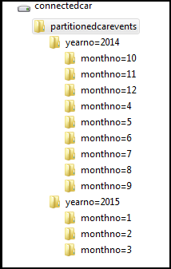
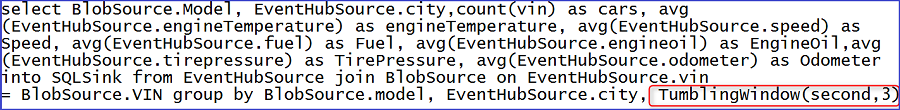
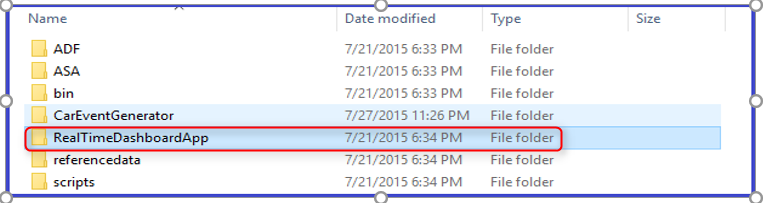
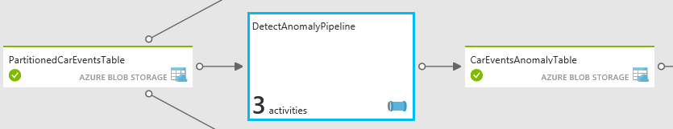
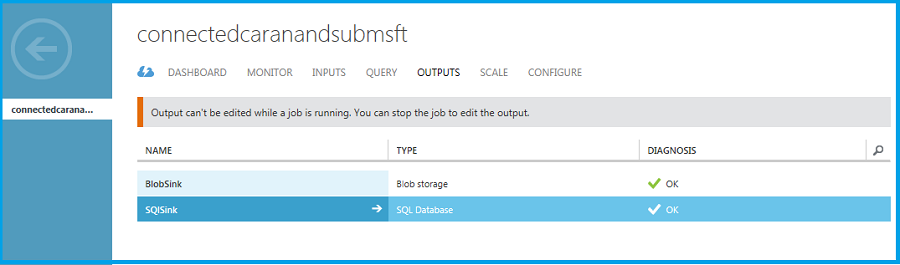

<properties 
    pageTitle="Fahrzeug werden Analytics Lösung Playbook: Tiefer Einblick in die Lösung | Microsoft Azure" 
    description="Verwenden Sie die Funktionen von Cortana Intelligence um zu gewinnen in Echtzeit und Vorhersage Einblicke auf Fahrzeug Gesundheit und steuernde Listen." 
    services="machine-learning" 
    documentationCenter="" 
    authors="bradsev" 
    manager="jhubbard" 
    editor="cgronlun" />

<tags 
    ms.service="machine-learning" 
    ms.workload="data-services" 
    ms.tgt_pltfrm="na" 
    ms.devlang="na" 
    ms.topic="article" 
    ms.date="09/12/2016" 
    ms.author="bradsev" />

# Fahrzeug werden Analytics Lösung Playbook: Tiefer Einblick in die Lösung

Diese **Menü** enthält Links zu den Abschnitten der diese Playbook: 

[AZURE.INCLUDE [cap-vehicle-telemetry-playbook-selector](../../includes/cap-vehicle-telemetry-playbook-selector.md)]

Dieser Abschnitt einen Drilldown in Stufen in der Architektur mit Anweisungen und Laserpointer für die Anpassung der Lösung dargestellt. 

## Datenquellen

Die Lösung verwendet zwei verschiedenen Datenquellen:

- **simuliertes Fahrzeug Eigenschaften und diagnostic Dataset** und 
- **Instrumententafel im Katalog**

Ein Fahrzeug Telematik Simulator ist Bestandteil dieser Lösung. Es gibt Diagnoseinformationen aus und zeigt den Status des Fahrzeug und die steuernde Muster zu einem bestimmten Zeitpunkt im Zeit entspricht. Klicken Sie auf [Fahrzeug Telematik Simulator](http://go.microsoft.com/fwlink/?LinkId=717075) , um die **Fahrzeug Telematik Simulator Visual Studio-Lösung** für Ihren Anforderungen entsprechend Anpassungen herunterladen. Instrumententafel im Katalog enthält ein Dataset Bezug mit einem VIN zum Modell Zuordnung an.

*Abbildung 2 – Fahrzeug Telematik Simulator*

Dies ist ein JSON-formatierte Dataset, die das folgende Schema enthält.

Spalte | Beschreibung | Werte 
 ------- | ----------- | --------- 
VIN | Erzeugten Fahrzeug Identifikationsnummer | Dies ist eine Masterliste mit 10.000 erzeugten Fahrzeug Identifikationsnummern abgerufen.
Externe Temperatur | Die externe Temperatur, in dem das Fahrzeug gesteuert wird | Erzeugten Zufallszahl zwischen 0 und 100
Engine Temperatur | Die Farbtemperatur Engine Fahrzeug | Erzeugten Zahl von 0 bis 500
Geschwindigkeit | Die Geschwindigkeit, das Fahrzeug gesteuert wird | Erzeugten Zufallszahl zwischen 0 und 100
Kraftstoff | Dem Kraftstoffspiegel im Fahrzeug | Erzeugten Zufallszahl zwischen 0 und 100 (zeigt an den Prozentsatz Kraftstoff)
EngineOil | Die Engine Oil Ebene im Fahrzeug | Erzeugten Zufallszahl zwischen 0 und 100 (zeigt an Engine Oil Ebene Prozent)
Reifendruck | Der Reifendruck im Fahrzeug | Zufällig generierte Zahl von 0 bis 50 (zeigt an Tire Druck Ebene Prozent)
Kilometerstand | Die Kilometerzählers im Fahrzeug | Erzeugten Zahl von 0-200000
Accelerator_pedal_position | Die Position der Accelerator Pedal im Fahrzeug | Erzeugten Zufallszahl zwischen 0 und 100 (zeigt an den Prozentsatz Accelerator)
Parking_brake_status | Gibt an, ob das Fahrzeug oder nicht seine ist | True oder False
Headlamp_status | Zeigt an, wo die gegebenenfalls vorhandenen aktiviert ist, oder nicht | True oder False
Brake_pedal_status | Gibt an, ob die Bremspedal oder nicht gedrückt wird | True oder False
Transmission_gear_position | Die Übertragung Zahnrad Position im Fahrzeug | Zustände: ersten, zweiten Sie, dritten, vierten, fünften, sechsten, siebter, achten
Ignition_status | Gibt an, ob das Fahrzeug ausgeführt oder beendet wird. | True oder False
Windshield_wiper_status | Gibt an, ob die Windschutzscheibe Scheibenwischer oder nicht aktiviert ist | True oder False
ABS | Gibt an, ob ABS oder nicht aktiviert ist | True oder False
Zeitstempel | Der Zeitstempel, wenn der Datenpunkt erstellt wurde | Datum
Ort | Die Position des Fahrzeug | 4 Orte in dieser Lösung: Detmold, Redmond, Sammamish, Frankfurt am Main

Instrumententafel im Modell Bezug Dataset enthält VIN zur Zuordnung Modell. 

VIN | Modell |
--------------|------------------
FHL3O1SA4IEHB4WU1 | Sedan |
8J0U8XCPRGW4Z3NQE | Hybrid |
WORG68Z2PLTNZDBI7 | Familiäre Stufenhecklimousine |
JTHMYHQTEPP4WBMRN | Sedan |
W9FTHG27LZN1YWO0Y | Hybrid |
MHTP9N792PHK08WJM | Familiäre Stufenhecklimousine |
EI4QXI2AXVQQING4I | Sedan |
5KKR2VB4WHQH97PF8 | Hybrid |
W9NSZ423XZHAONYXB | Familiäre Stufenhecklimousine |
26WJSGHX4MA5ROHNL | Konvertiert werden kann. |
GHLUB6ONKMOSI7E77 | Kombilimousine |
9C2RHVRVLMEJDBXLP | Komprimieren Auto |
BRNHVMZOUJ6EOCP32 | Kleine Geländewagen |
VCYVW0WUZNBTM594J | Sportwagen |
HNVCE6YFZSA5M82NY | Medium Geländewagen |
4R30FOR7NUOBL05GJ | Kombilimousine |
WYNIIY42VKV6OQS1J | Große Geländewagen |
8Y5QKG27QET1RBK7I | Große Geländewagen |
DF6OX2WSRA6511BVG | Coupé |
Z2EOZWZBXAEW3E60T | Sedan |
M4TV6IEALD5QDS3IR | Hybrid |
VHRA1Y2TGTA84F00H | Familiäre Stufenhecklimousine |
R0JAUHT1L1R3BIKI0 | Sedan |
9230C202Z60XX84AU | Hybrid |
T8DNDN5UDCWL7M72H | Familiäre Stufenhecklimousine |
4WPYRUZII5YV7YA42 | Sedan |
D1ZVY26UV2BFGHZNO | Hybrid |
XUF99EW9OIQOMV7Q7 | Familiäre Stufenhecklimousine
8OMCL3LGI7XNCC21U | Konvertiert werden kann. |
…….  |   |

### Zum Generieren von simulierter Daten
1.  Wenn das Daten Simulator-Paket herunterladen möchten, klicken Sie auf den Pfeil in der oberen rechten Ecke des Knotens Fahrzeug Telematik Simulator. Speichern und die Dateien lokal auf Ihrem Computer zu extrahieren. *Abbildung 3 – Fahrzeug werden Analytics Lösung Entwurf*

2.  Auf Ihrem lokalen Computer wechseln Sie zu dem Ordner, in dem Sie das Fahrzeug Telematik Simulator-Paket extrahiert. *Abbildung 4 – Fahrzeug Telematik Simulator Ordner*

3.  Führen Sie die Anwendung **CarEventGenerator.exe**.

### Verweise

[Fahrzeug Telematik Simulator Visual Studio-Lösung](http://go.microsoft.com/fwlink/?LinkId=717075) 

[Azure Ereignis Hub](https://azure.microsoft.com/services/event-hubs/)

[Factory Azure-Daten](https://azure.microsoft.com/documentation/learning-paths/data-factory/)

## Aufnahme
Kombinationen aus Azure Ereignis Hubs, Stream Analytics und Daten Factory werden genutzt, um die Fahrzeug Videosignale, die Diagnose Ereignisse Aufnahme und in Echtzeit und Stapel Analytics. Alle diese Komponenten erstellt und konfiguriert sind als Teil der Bereitstellung der Lösung. 

### Analyse in Echtzeit
Die von der Fahrzeug Telematik Simulator generierten Ereignisse werden an den Ereignis-Hub mit dem Ereignis Hub SDK veröffentlicht. Der Auftrag Stream Analytics ingests diese Ereignisse vom Ereignis Hub und verarbeitet die Daten in Echtzeit, um die Integrität Fahrzeug zu analysieren. 

 

*Abbildung 5 - Ereignis Hub dashboard*

 

*Abbildung 6: Stream Analytics Auftrag verarbeiten von Daten*

Die Position des Streams Analytics;

- Daten aus dem Ereignis Hub ingests 
- führt eine Verknüpfung mit den Daten Bezug Fahrzeug VIN auf das entsprechende Modell zuordnen 
- behält diese in Azure Blob-Speicher für Rich-Stapel Analytics. 

Die folgende Abfrage der Stream Analytics dient zum Beibehalten der Daten in Azure Blob-Speicher. 

 

*Abbildung 7: Stream Analytics Auftrag Abfrage für die Erfassung von Daten*

### Stapel-Analyse
Wir sind auch eine zusätzliche Lautstärke simulierten Fahrzeug Eigenschaften und diagnostic Dataset für reichhaltigere Stapel Analytics generieren. Dies ist erforderlich, um eine gute Vertreter Datenmenge für Stapelverarbeitung sicherzustellen. Zu diesem Zweck werden wir eine Verkaufspipeline mit dem Namen "PrepareSampleDataPipeline" im Workflow Azure Data Factory verwenden, um ein Jahr Einheiten im Wert von simulierten Fahrzeug Eigenschaften und diagnostic Dataset generieren. Klicken Sie auf [benutzerdefinierter Aktivität Daten Factory](http://go.microsoft.com/fwlink/?LinkId=717077) , um die Daten Factory benutzerdefinierte DotNet Aktivität Visual Studio-Lösung für Ihren Anforderungen entsprechend Anpassungen herunterladen. 

 

*Abbildung 8: Vorbereiten von Beispieldaten für Stapel Verarbeitung von Workflows*

Der Verkaufspipeline besteht aus einer benutzerdefinierten ADF .net Aktivität, hier anzeigen:

 

*Abbildung 9: PrepareSampleDataPipeline*

Sobald der Verkaufspipeline erfolgreich ausgeführt wird, und "RawCarEventsTable" Dataset wird ein Jahr im Wert von simulierten Fahrzeug Signalen und Diagnose "Bereit" markiert werden Daten erzeugt. Sie finden Sie in den folgenden Ordner und die Datei in Ihr Speicherkonto unter dem Container "Connectedcar" erstellt:

 

*Abbildung 10 - PrepareSampleDataPipeline Ausgabe*

### Verweise

[Azure Ereignis Hub SDK für Stream Aufnahme](../event-hubs/event-hubs-csharp-ephcs-getstarted.md)

[Azure Data Factory Daten Bewegungsfunktionen](../data-factory/data-factory-data-movement-activities.md)
[Azure Daten Factory DotNet Aktivität](../data-factory/data-factory-use-custom-activities.md)

[Azure Daten Factory DotNet Aktivität visual Studio-Lösung für die Vorbereitung von Beispieldaten](http://go.microsoft.com/fwlink/?LinkId=717077) 

## Partition dataset

Die unformatierten teilweise strukturierten Fahrzeug Signale und diagnostic Dataset werden im Schritt Daten Vorbereitung in ein Jahr-Monat-Format aufgeteilt. Diese Aufteilung stuft effizienter Abfragen und skalierbare langfristiges Speicher durch Fehlerstrukturanalyse-Over aus einem Blob-Konto zum nächsten aktivieren, das erste Konto Breite ausgefüllt. 

>[AZURE.NOTE] Dieser Schritt in die Lösung ist nur für die Stapelverarbeitung.

Eingabe- und datenverwaltung Daten:

- Die **Ausgabedaten** (mit der Bezeichnung *PartitionedCarEventsTable*) ist für eine längere Zeit aufbewahrt werden, wie das Formular grundlegenden / "rawest" der Daten in der Kunden "dem Daten". 
- Diese Verkaufspipeline die **Eingabedaten** würde normalerweise verworfen werden, wie die Ausgabedaten vollständige Genauigkeit mit der Eingabe hat-er nur (aufgeteilt) besser zur späteren Verwendung gespeichert ist.

*Abbildung 11 – Partition Auto Ereignisse workflow*

Die unformatierten Daten werden mit einer HDInsight Struktur Aktivitäten in "PartitionCarEventsPipeline" aufgeteilt. Die Beispieldaten, die in Schritt 1 für ein Jahr generiert werden durch Jahr-Monat unterteilt. Die Partitionen werden verwendet, um die Fahrzeug Eigenschaften und diagnostic Daten für jeden Monat eines Jahres (12 Partitionen gesamt) generieren. 

*Abbildung 12: PartitionCarEventsPipeline*

Das folgende Struktur Skript, mit dem Namen "partitioncarevents.hql", wird für die Partitionierung verwendet und befindet sich im Ordner "\demo\src\connectedcar\scripts" von der heruntergeladenen Zip. 

    SET hive.exec.dynamic.partition=true;
    SET hive.exec.dynamic.partition.mode = nonstrict;
    set hive.cli.print.header=true;

    DROP TABLE IF EXISTS RawCarEvents; 
    CREATE EXTERNAL TABLE RawCarEvents 
    (
                vin                             string,
                model                           string,
                timestamp                       string,
                outsidetemperature              string,
                enginetemperature               string,
                speed                           string,
                fuel                            string,
                engineoil                       string,
                tirepressure                    string,
                odometer                        string,
                city                            string,
                accelerator_pedal_position      string,
                parking_brake_status            string,
                headlamp_status                 string,
                brake_pedal_status              string,
                transmission_gear_position      string,
                ignition_status                 string,
                windshield_wiper_status         string,
                abs                             string,
                gendate                         string
                
    ) ROW FORMAT DELIMITED FIELDS TERMINATED BY ',' LINES TERMINATED BY '10' STORED AS TEXTFILE LOCATION '${hiveconf:RAWINPUT}'; 

    DROP TABLE IF EXISTS PartitionedCarEvents; 
    CREATE EXTERNAL TABLE PartitionedCarEvents 
    (
                vin                             string,
                model                           string,
                timestamp                       string,
                outsidetemperature              string,
                enginetemperature               string,
                speed                           string,
                fuel                            string,
                engineoil                       string,
                tirepressure                    string,
                odometer                        string,
                city                            string,
                accelerator_pedal_position      string,
                parking_brake_status            string,
                headlamp_status                 string,
                brake_pedal_status              string,
                transmission_gear_position      string,
                ignition_status                 string,
                windshield_wiper_status         string,
                abs                             string,
                gendate                         string
    ) partitioned by (YearNo int, MonthNo int) ROW FORMAT DELIMITED FIELDS TERMINATED BY ',' LINES TERMINATED BY '10' STORED AS TEXTFILE LOCATION '${hiveconf:PARTITIONEDOUTPUT}';

    DROP TABLE IF EXISTS Stage_RawCarEvents; 
    CREATE TABLE IF NOT EXISTS Stage_RawCarEvents 
    (
                vin                             string,
                model                           string,
                timestamp                       string,
                outsidetemperature              string,
                enginetemperature               string,
                speed                           string,
                fuel                            string,
                engineoil                       string,
                tirepressure                    string,
                odometer                        string,
                city                            string,
                accelerator_pedal_position      string,
                parking_brake_status            string,
                headlamp_status                 string,
                brake_pedal_status              string,
                transmission_gear_position      string,
                ignition_status                 string,
                windshield_wiper_status         string,
                abs                             string,
                gendate                         string,
                YearNo                          int,
                MonthNo                         int) 
    ROW FORMAT delimited fields terminated by ',' LINES TERMINATED BY '10';

    INSERT OVERWRITE TABLE Stage_RawCarEvents
    SELECT
        vin,            
        model,
        timestamp,
        outsidetemperature,
        enginetemperature,
        speed,
        fuel,
        engineoil,
        tirepressure,
        odometer,
        city,
        accelerator_pedal_position,
        parking_brake_status,
        headlamp_status,
        brake_pedal_status,
        transmission_gear_position,
        ignition_status,
        windshield_wiper_status,
        abs,
        gendate,
        Year(gendate),
        Month(gendate)

    FROM RawCarEvents WHERE Year(gendate) = ${hiveconf:Year} AND Month(gendate) = ${hiveconf:Month}; 

    INSERT OVERWRITE TABLE PartitionedCarEvents PARTITION(YearNo, MonthNo) 
    SELECT
        vin,            
        model,
        timestamp,
        outsidetemperature,
        enginetemperature,
        speed,
        fuel,
        engineoil,
        tirepressure,
        odometer,
        city,
        accelerator_pedal_position,
        parking_brake_status,
        headlamp_status,
        brake_pedal_status,
        transmission_gear_position,
        ignition_status,
        windshield_wiper_status,
        abs,
        gendate,
        YearNo,
        MonthNo
    FROM Stage_RawCarEvents WHERE YearNo = ${hiveconf:Year} AND MonthNo = ${hiveconf:Month};

*Abbildung 13: PartitionConnectedCarEvents Struktur-Skript*

Sobald der Verkaufspipeline erfolgreich ausgeführt wurde, wird die folgenden Partitionen in Ihr Speicherkonto unter dem Container "Connectedcar" generiert.

*Abbildung 14 - partitionierten Ausgabe*

Die Daten nun optimiert ist, ist überschaubarer und bereit für die weitere Verarbeitung um Rich-Stapel Einsichten zu erhalten. 

## Analyse-Funktionen

In diesem Abschnitt erfahren Sie, wie Azure Stream Analytics, Azure maschinellen Schulung, Azure Data Factory und Azure HDInsight für Rich erweiterte Analytics Fahrzeug Integrität und steuernde Listen kombinieren. Es gibt drei Unterabschnitte so aus:

1.  **Computer-Schulung**: Dieser Unterabschnitt enthält Informationen zu den Anomalie Erkennung experimentieren, die wir in dieser Lösung verwendet haben, um vorhersagen Fahrzeuge mit Anforderung der Wartung Wartung und Fahrzeuge mit Anforderung der Rückrufe aufgrund von Problemen mit Sicherheit.
2.  **Analyse in Echtzeit**: Dieser Unterabschnitt enthält Informationen zu den in Echtzeit Analytics mithilfe der Stream Analytics-Abfragesprache und den Computer Learning Versuch in Echtzeit mithilfe einer benutzerdefinierten Anwendung operationalizing.
3.  **Stapel Analyse**: Dieser Unterabschnitt enthält Informationen bezüglich der transformieren und der Stapeldaten mithilfe von Azure HDInsight und Azure-Computer-Schulung von Azure Daten Factory operationalized Verarbeitung.

### Computer-Schulung

Unser Ziel ist die Fahrzeuge Vorhersagen, die Wartung oder Rückruf basierend auf bestimmten Health Statistiken erfordern. Wir stellen Sie die folgenden Annahmen

- Wenn Sie eine der folgenden drei Bedingungen zutreffen, erfordern die Fahrzeuge **Wartung Wartung**:
    - Reifendruck ist niedrig
    - Motoröl ist niedrig
    - Engine Temperatur ist hoch.

- Wenn Sie eine der folgenden Bedingungen zutreffen, Fahrzeuge möglicherweise ein **Sicherheitsproblem** und **Rückruf**erforderlich:
    - Engine Temperatur ist ausreichend, aber Temperatur ist niedrig
    - Engine Temperatur ist auf Niedrig, aber Temperatur ist ausreichend

Je nach den vorherigen Erfordernissen, haben zwei separate Modelle zum Ermitteln von Bildschirmdarstellung auftreten, Fahrzeug Wartung Erkennung und Fahrzeug Rückruf Erkennung erstellt. In dieser beiden Modellen wird der integrierten Hauptbenutzer Komponente Analyse (PCA) Algorithmus für Normalbetriebswerte verwendet. 

**Wartung Erkennung Modell**

Wenn Sie eine der drei Indikatoren – Reifendruck, Engine Oil oder Engine Temperatur – die entsprechenden Bedingung erfüllt, Berichte Wartung Erkennung Modell eine Anomalie aus. Daher müssen wir nur diese drei Variablen in der Erstellung des Modells zu berücksichtigen. In unseren experimentieren Azure Computer interessante verwenden wir zuerst ein Modul **Spalten im Dataset auswählen** , um diese drei Variablen zu extrahieren. Als Nächstes verwenden wir Modul für die Erkennung Anomalie PCA-basierten um Anomalie Erkennung Modell zu erstellen. 

Analyse der Tilgungsanteile (PCA) ist eine definierte Computer interessante, die Featureauswahl, Klassifizierung und Normalbetriebswerte angewendet werden können. PCA konvertiert eine Reihe von Fall, oftmals korrelierte Variablen in eine Reihe von Wertemenge Hauptkomponenten enthält. Die wichtige Vorstellung davon PCA-basierten Modellierung besteht, Projektdaten auf einen unteren mehrdimensional Raum, damit Features und Bildschirmdarstellung auftreten einfacher identifiziert werden können.
 
Für jede neue Eingabe in das Datenmodell Erkennung der Erkennung Anomalie berechnet zunächst seine Projektion auf der Eigenvectors, und dann berechnet den standardisierten rekonstruieren zurück. Dieser standardisierten Fehler ist die Bewertung Anomalie. Je höher der Fehler, die mehr abweichenden ist die Instanz. 

In das Problem Wartung Erkennung kann jeden Eintrag gilt als ein Punkt in einem Leerzeichen 3 mehrdimensional Reifendruck Engine Oil und Engine Temperatur Koordinaten definiert. Zum Erfassen diese Bildschirmdarstellung auftreten, können wir die Originaldaten in dem Bereich 3 mehrdimensional auf einen 2 mehrdimensional Raum mit PCA Projekt. Auf diese Weise festlegen wir den Parameter Anzahl Komponenten in PCA verwenden, 2. Für diesen Parameter spielt eine wichtige Rolle PCA-basierten Normalbetriebswerte anwenden. Nachdem überstehende Daten PCA verwenden können wir diese Bildschirmdarstellung auftreten leichter identifizieren.

**Zurückrufen Anomalie Erkennung Modell** Im Modell Erkennung Rückruf Anomalie verwenden wir wählen Sie Spalten im Dataset und PCA-basierten Anomalie Erkennung Module in ähnlicher Weise. Insbesondere extrahieren wir zuerst drei Variablen - Engine Temperatur, externe Temperatur und Geschwindigkeit - mit dem Modul **Spalten im Dataset auswählen** . Wir enthalten auch die Geschwindigkeit Variable, da die Engine Temperatur in der Geschwindigkeit normalerweise Beziehung gesetzt werden kann. Als Nächstes verwenden wir PCA-basierten Anomalie Erkennungsmodul die Daten aus den 3 mehrdimensional Abstand auf einen 2 mehrdimensional Raum project. Die Rückruf Kriterien erfüllt sind und das Fahrzeug erfordert Rückruf beim Engine Temperatur und externe Temperatur hochgradig negativ in Beziehung gesetzt werden. Mit Anomalie PCA-basierten Erkennungsalgorithmus, können wir die Bildschirmdarstellung auftreten nach Durchführung PCA erfassen. 

Wenn entweder Modell Schulung, müssen wir normalen, verwenden Sie die nicht Wartung oder Rückruf als die Eingabedaten zum Schulen von PCA-basierten Anomalie Erkennung Modell erforderlich ist. In der Punktzahl experimentieren verwenden wir ausgebildeten Anomalie Erkennung Modell um zu erkennen, ob das Fahrzeug Wartung oder Rückruf erforderlich ist. 

### Analyse in Echtzeit

Die folgenden Stream Analytics SQL-Abfrage wird verwendet, um den Mittelwert aller wichtigen Fahrzeug Parameter wie Fahrzeug Geschwindigkeit, Kraftstoffmenge, Engine Temperatur, Kilometerzählers, Reifendruck, Engine Oil Ebene und andere abzurufen. Die Durchschnittswerte verwendeten erkennen Bildschirmdarstellung auftreten, Emission Benachrichtigungen, und generelle Gesundheit Bedingungen Fahrzeuge in bestimmten Region betrieben ermitteln und es dann Demographie entsprechen. 

Abbildung 15 – Stream Analytics Abfrage für die Verarbeitung in Echtzeit

Über eine 3 Sekunden TumblingWindow werden alle die Mittelwerte berechnet. Wir verwenden TubmlingWindow in diesem Fall, da wir übereinander und zusammenhängenden Zeitintervalle erforderlich. 

Weitere Informationen zu den "Windowing"-Funktionen in Azure Stream Analytics zu finden, klicken Sie auf [Windowing (Azure Stream Analytics)](https://msdn.microsoft.com/library/azure/dn835019.aspx).

**In Echtzeit Vorhersage**

Eine Anwendung ist Bestandteil der Lösung für das Modell maschinellen Learning in Echtzeit Prozessen umsetzen. Diese Anwendung mit dem Namen "RealTimeDashboardApp" erstellt und als Teil der Bereitstellung der Lösung konfiguriert wurden. Die Anwendung folgende Aktionen ausgeführt:

1.  Überwacht ein Ereignis Hub Instanz, in dem Stream Analytics der Ereignisse in einem Muster kontinuierlich veröffentlichen ist. *Abbildung 16 – Stream Analytics Abfrage für die Veröffentlichung von Daten in eine Ausgabe Ereignis Hub Instanz* 

2.  Für jedes Ereignis, das diese Anwendung empfängt: 

    - Verarbeitet die Daten mit Endpunkt maschinellen Learning Anforderung / Antwort bewerten (RRS). Der Endpunkt RRS wird automatisch als Teil der Bereitstellung veröffentlicht.
    - Die Ausgabe RRS wird in ein PowerBI Dataset mithilfe der Pushbenachrichtigungen APIs veröffentlicht.

Dieses Muster gilt auch für Szenarien, die in dem aus eine Zeile der branchenspezifische Anwendung im Griff in Echtzeit Analytics für Szenarien wie Benachrichtigungen, Benachrichtigungen und messaging integriert werden soll.

Klicken Sie auf, um die RealtimeDashboardApp Visual Studio-Lösung für Anpassungen herunterladen [RealtimeDashboardApp herunterladen](http://go.microsoft.com/fwlink/?LinkId=717078) . 

**Auszuführende Real-Time-Dashboard-Anwendung**

1.  Klicken Sie auf der PowerBI-Knoten in der Diagrammansicht, und klicken Sie auf den Link "Real-Time Dashboardanwendung herunterladen" im Eigenschaftenbereich. *Abbildung 17 – Anweisungen zum Einrichten von PowerBI dashboard*
2.  Extrahiert und lokal speichern  *Abbildung 18 – RealtimeDashboardApp Ordner*
3.  Führen Sie die Anwendung RealtimeDashboardApp.exe
4.  Geben Sie gültige Power BI-Anmeldeinformationen, melden Sie sich, und klicken Sie auf annehmen  

*Abbildung 19 – RealtimeDashboardApp: Anmelden bei PowerBI*

>[AZURE.NOTE] Wenn Sie das Dataset PowerBI leeren möchten, führen Sie die RealtimeDashboardApp mit dem Parameter "Flushdata": 

    RealtimeDashboardApp.exe -flushdata

### Stapel-Analyse

Das Ziel Hier wird angezeigt, wie "Contoso" Motors die Azure Berechnungsfunktionen, um große Daten, um Rich-Einsichten auf Muster, Verwendung Verhalten und Fahrzeug Gesundheit steuernde erlangen nutzen nutzt. Hierdurch können:

- Das Programm zur Verbesserung und machen Sie es kostengünstiger, durch die Bereitstellung Einsichten auf Listen und Kraftstoff effiziente steuernde Verhaltensweisen steuernde
- Lernen Sie die vorausschauende Kunden und deren steuernde Patters Business Entscheidungen Aufsicht und das beste Class-Produkte und-Services im bereitstellen

In dieser Lösung haben wir die folgende Metrik abgesehen:

1.  **Anspruchsvollen steuernde Verhalten**: den Trend des Modelle, Orte, steuernde Bedingungen, und der Uhrzeit des Jahres erhalten Sie einen Einblick in anspruchsvollen steuernde Muster bezeichnet. Contoso-Motors können diese Einblicke für Marketingkampagnen, zielgerichteten neue individuelle Funktionen und die Verwendung-basierten Versicherungsnummer.
2.  **Kraftstoff effiziente steuernde Verhalten**: den Trend des Modelle, Orte, steuernde Bedingungen, und der Uhrzeit des Jahres zu gewinnen Einsichten auf Kraftstoff effiziente steuernde Muster bezeichnet. Contoso Motors können diese Einblicke für Marketingkampagnen, zielgerichteten neuen Features und Umgebung und effektivsten geeignet steuernde Listen proaktive Berichterstattung an die Treiber für Kosten. 
3.  **Zurückrufen Modelle**: Modelle mit Anforderung der Rückrufe nach der Anomalie Erkennung maschinellen experimentieren learning operationalizing bezeichnet

Lassen Sie uns die Details der einzelnen diese Kennzahlen nähere,

**Anspruchsvollen steuernde Muster**

Die partitionierte Fahrzeug Signale und diagnostic Daten werden in der Verkaufspipeline mit dem Namen "AggresiveDrivingPatternPipeline" mit Struktur bestimmt die Modelle, Speicherort, Fahrzeug, steuernde Bedingungen und andere Parameter, die strengen steuernde Muster weist verarbeitet.

 
*Abbildung 20 – Aggressive steuernde Muster workflow*

Das Struktur Skript mit dem Namen "aggresivedriving.hql" für die Analyse der strengen steuernde Bedingung Muster verwendet steht zur Verfügung "\demo\src\connectedcar\scripts" Ordner, der die heruntergeladenen Zip. 

    DROP TABLE IF EXISTS PartitionedCarEvents; 
    CREATE EXTERNAL TABLE PartitionedCarEvents
    (
                vin                             string,
                model                           string,
                timestamp                       string,
                outsidetemperature              string,
                enginetemperature               string,
                speed                           string,
                fuel                            string,
                engineoil                       string,
                tirepressure                    string,
                odometer                        string,
                city                            string,
                accelerator_pedal_position      string,
                parking_brake_status            string,
                headlamp_status                 string,
                brake_pedal_status              string,
                transmission_gear_position      string,
                ignition_status                 string,
                windshield_wiper_status         string,
                abs                             string,
                gendate                         string
                                
    ) ROW FORMAT DELIMITED FIELDS TERMINATED BY ',' LINES TERMINATED BY '10' STORED AS TEXTFILE LOCATION '${hiveconf:PARTITIONEDINPUT}';

    DROP TABLE IF EXISTS CarEventsAggresive; 
    CREATE EXTERNAL TABLE CarEventsAggresive
    (
                vin                         string, 
                model                       string,
                timestamp                   string,
                city                        string,
                speed                       string,
                transmission_gear_position  string,
                brake_pedal_status          string,
                Year                        string,
                Month                       string
                                
    ) ROW FORMAT DELIMITED FIELDS TERMINATED BY ',' LINES TERMINATED BY '10' STORED AS TEXTFILE LOCATION '${hiveconf:AGGRESIVEOUTPUT}';

    INSERT OVERWRITE TABLE CarEventsAggresive
    select
    vin,
    model,
    timestamp,
    city,
    speed,
    transmission_gear_position,
    brake_pedal_status,
    "${hiveconf:Year}" as Year,
    "${hiveconf:Month}" as Month
    from PartitionedCarEvents
    where transmission_gear_position IN ('fourth', 'fifth', 'sixth', 'seventh', 'eight') AND brake_pedal_status = '1' AND speed >= '50'

*Abbildung 21 – Aggressive steuernde Muster Struktur Abfrage*

Es verwendet die Kombination der Fahrzeug Übertragung Zahnrad Position, einer Pedal Status und Geschwindigkeit, um halsbrecherischen/anspruchsvollen steuernde Verhalten basierend auf Bremsung Muster mit hoher Geschwindigkeit zu erkennen. 

Sobald der Verkaufspipeline erfolgreich ausgeführt wurde, wird die folgenden Partitionen in Ihr Speicherkonto unter dem Container "Connectedcar" generiert.

 

*Abbildung 22 – AggressiveDrivingPatternPipeline Ausgabe*

**Kraftstoff effiziente steuernde Muster**

Die partitionierte Fahrzeug Signale und diagnostic Daten werden in der Verkaufspipeline mit dem Namen "FuelEfficientDrivingPatternPipeline" ausgeführt. Struktur wird verwendet, um zu bestimmen, die Modelle, Speicherort, Fahrzeug, steuernde Bedingungen und andere Eigenschaften, die Kraftstoff effiziente steuernde Muster aufweisen.

 

*Abbildung 23 – Kraftstoff effizienten steuernde Muster workflow*

Das Struktur Skript mit dem Namen "fuelefficientdriving.hql" für die Analyse der strengen steuernde Bedingung Muster verwendet steht zur Verfügung "\demo\src\connectedcar\scripts" Ordner, der die heruntergeladenen Zip. 

    DROP TABLE IF EXISTS PartitionedCarEvents; 
    CREATE EXTERNAL TABLE PartitionedCarEvents
    (
                vin                             string,
                model                           string,
                timestamp                       string,
                outsidetemperature              string,
                enginetemperature               string,
                speed                           string,
                fuel                            string,
                engineoil                       string,
                tirepressure                    string,
                odometer                        string,
                city                            string,
                accelerator_pedal_position      string,
                parking_brake_status            string,
                headlamp_status                 string,
                brake_pedal_status              string,
                transmission_gear_position      string,
                ignition_status                 string,
                windshield_wiper_status         string,
                abs                             string,
                gendate                         string
                                
    ) ROW FORMAT DELIMITED FIELDS TERMINATED BY ',' LINES TERMINATED BY '10' STORED AS TEXTFILE LOCATION '${hiveconf:PARTITIONEDINPUT}';

    DROP TABLE IF EXISTS FuelEfficientDriving; 
    CREATE EXTERNAL TABLE FuelEfficientDriving
    (
                vin                         string, 
                model                       string,
                city                        string,
                speed                       string,
                transmission_gear_position  string,                
                brake_pedal_status          string,            
                accelerator_pedal_position  string,                             
                Year                        string,
                Month                       string
                                
    ) ROW FORMAT DELIMITED FIELDS TERMINATED BY ',' LINES TERMINATED BY '10' STORED AS TEXTFILE LOCATION '${hiveconf:FUELEFFICIENTOUTPUT}';

    INSERT OVERWRITE TABLE FuelEfficientDriving
    select
    vin,
    model,
    city,
    speed,
    transmission_gear_position,
    brake_pedal_status,
    accelerator_pedal_position,
    "${hiveconf:Year}" as Year,
    "${hiveconf:Month}" as Month
    from PartitionedCarEvents
    where transmission_gear_position IN ('fourth', 'fifth', 'sixth', 'seventh', 'eight') AND parking_brake_status = '0' AND brake_pedal_status = '0' AND speed <= '60' AND accelerator_pedal_position >= '50'

*Abbildung 24 – Kraftstoff effiziente steuernde Muster Struktur Abfragen*

Es verwendet die Kombination der Fahrzeug Übertragung Zahnrad Position, einer Pedal Status, Geschwindigkeit und Accelerator pedal Position Kraftstoff effiziente steuernde Verhalten basierend auf Beschleunigung, Bremsung, erkennen und Mustern beschleunigen. 

Sobald der Verkaufspipeline erfolgreich ausgeführt wurde, wird die folgenden Partitionen in Ihr Speicherkonto unter dem Container "Connectedcar" generiert.

 

*Abbildung 25 – FuelEfficientDrivingPatternPipeline Ausgabe*

**Zurückrufen Vorhersagen**

Der Computer learning experimentieren ist nach der Bereitstellung und als Webdienst als Teil der Lösung Bereitstellung veröffentlicht. Der Endpunkt bewerten Stapel wird in dieser Workflow, der als Factory verknüpft Data Service registriert und operationalized mit Daten Factory Stapel Aktivität bewerten genutzt werden.

 

*Abbildung 26 – Computer learning Endpunkt als verknüpfte Dienst in Daten Factory registriert*

Der registrierte verknüpfte Dienst wird in der DetectAnomalyPipeline zur die Daten mithilfe des Anomalie Erkennung Modells Punktzahl. 

 

*Abbildung 27 – Azure maschinellen Learning Stapel bewerten Aktivität in Daten factory* 

Es gibt einige Schritte in dieser Verkaufspipeline für die Vorbereitung der Daten, damit sie mit dem Blattnamen bewerten Webdienst operationalized werden kann. 

 

*Abbildung 28 – DetectAnomalyPipeline zur Vorhersage mit Anforderung der Rückrufe Fahrzeuge* 

Nachdem Sie die Bewertung abgeschlossen ist, wird eine HDInsight Aktivität verwendet, um verarbeiten und Aggregieren von Daten, die als Bildschirmdarstellung auftreten, indem Sie das Modell mit einer Wahrscheinlichkeit-Bewertung von 0,60 kategorisierten oder höher sind.

    DROP TABLE IF EXISTS CarEventsAnomaly; 
    CREATE EXTERNAL TABLE CarEventsAnomaly 
    (
                vin                         string,
                model                       string,
                gendate                     string,
                outsidetemperature          string,
                enginetemperature           string,
                speed                       string,
                fuel                        string,
                engineoil                   string,
                tirepressure                string,
                odometer                    string,
                city                        string,
                accelerator_pedal_position  string,
                parking_brake_status        string,
                headlamp_status             string,
                brake_pedal_status          string,
                transmission_gear_position  string,
                ignition_status             string,
                windshield_wiper_status     string,
                abs                         string,
                maintenanceLabel            string,
                maintenanceProbability      string,
                RecallLabel                 string,
                RecallProbability           string
                                
    ) ROW FORMAT DELIMITED FIELDS TERMINATED BY ',' LINES TERMINATED BY '10' STORED AS TEXTFILE LOCATION '${hiveconf:ANOMALYOUTPUT}';

    DROP TABLE IF EXISTS RecallModel; 
    CREATE EXTERNAL TABLE RecallModel 
    (

                vin                         string,
                model                       string,
                city                        string,
                outsidetemperature          string,
                enginetemperature           string,
                speed                       string,
                Year                        string,
                Month                       string              
                                
    ) ROW FORMAT DELIMITED FIELDS TERMINATED BY ',' LINES TERMINATED BY '10' STORED AS TEXTFILE LOCATION '${hiveconf:RECALLMODELOUTPUT}';

    INSERT OVERWRITE TABLE RecallModel
    select
    vin,
    model,
    city,
    outsidetemperature,
    enginetemperature,
    speed,
    "${hiveconf:Year}" as Year,
    "${hiveconf:Month}" as Month
    from CarEventsAnomaly
    where RecallLabel = '1' AND RecallProbability >= '0.60'

Sobald der Verkaufspipeline erfolgreich ausgeführt wurde, wird die folgenden Partitionen in Ihr Speicherkonto unter dem Container "Connectedcar" generiert.

 

*Abbildung 30 – Abbildung 30 – DetectAnomalyPipeline Ausgabe*

## Veröffentlichen

### Analyse in Echtzeit

Eine der Abfragen im Auftrag Analytics Stream veröffentlicht der Ereignisse in eine Ausgabe Ereignis Hub Instanz. 

*Abbildung 31 – Stream Analytics-Auftrag, der Ausgabe veröffentlicht Ereignis Hub Instanz*

*Abbildung 32 – Stream Analytics Veröffentlichung auf die Ausgabe der Abfrage Ereignis Hub Instanz*

Dieser Stream von Ereignissen wird von der in der Lösung enthalten RealTimeDashboardApp genutzt. Diese Anwendung nutzt den Webdienst Anforderung / Antwort-Computer Schulung zur Bewertung in Echtzeit und die resultierenden Daten auf ein Dataset PowerBI für Ernährung veröffentlicht. 

### Stapel-Analyse

Die Ergebnisse der Stapelverarbeitung und in Echtzeit Verarbeitung werden mit den Tabellen Azure SQL-Datenbank für die Ernährung veröffentlicht. Azure SQL Server-Datenbank und die Tabellen werden automatisch als Teil der Setup-Skript erstellt. 

*Abbildung 33 – Stapelverarbeitung Ergebnisse kopieren Daten Mart Workflow*

*Abbildung 34 – Stream Analytics Auftrag zu Datamart veröffentlicht*

*Abbildung 35 – Datamart in Stream Analytics Position festlegen*

## Nutzen

Power BI bietet diese Lösung ein Rich-Dashboards für Echtzeitdaten und Vorhersageanalytik Visualisierungen. 

Klicken Sie hier, detaillierte Informationen zum Einrichten der PowerBI Berichten und Dashboards zu erhalten. Das endgültige Dashboard sieht wie folgt aus:

*Abbildung 36 - PowerBI-Dashboard*

## Zusammenfassung

Dieses Dokument enthält eine ausführliche Drilldown der Lösung Analytics Fahrzeug werden. Dadurch werden die ein Lambda-Architekturmuster für in Echtzeit und Stapel Analytics mit Vorhersagen und Aktionen. Dieses Muster gilt für eine Vielzahl von Fällen verwenden, die langsamste Pfad (in Echtzeit) erfordern und Analytics kalt Pfad (Stapel). 
