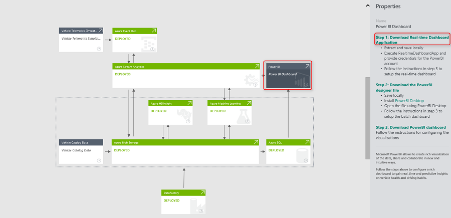
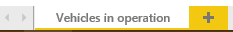
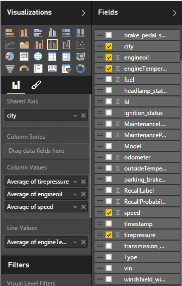
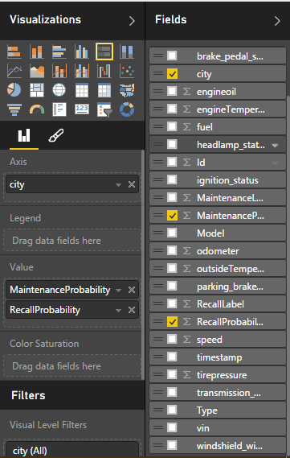
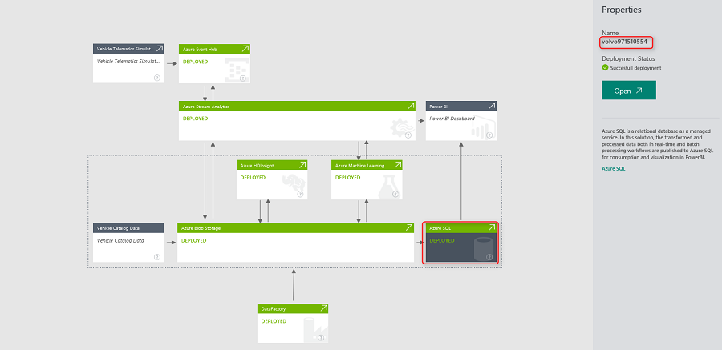
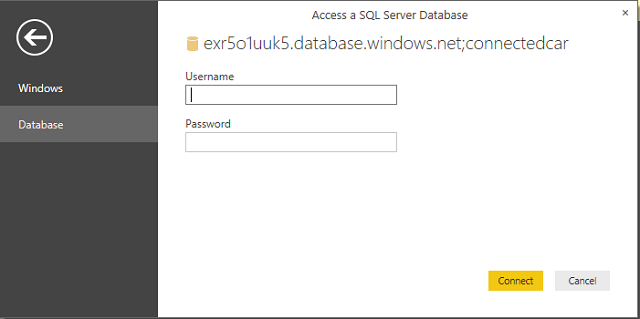
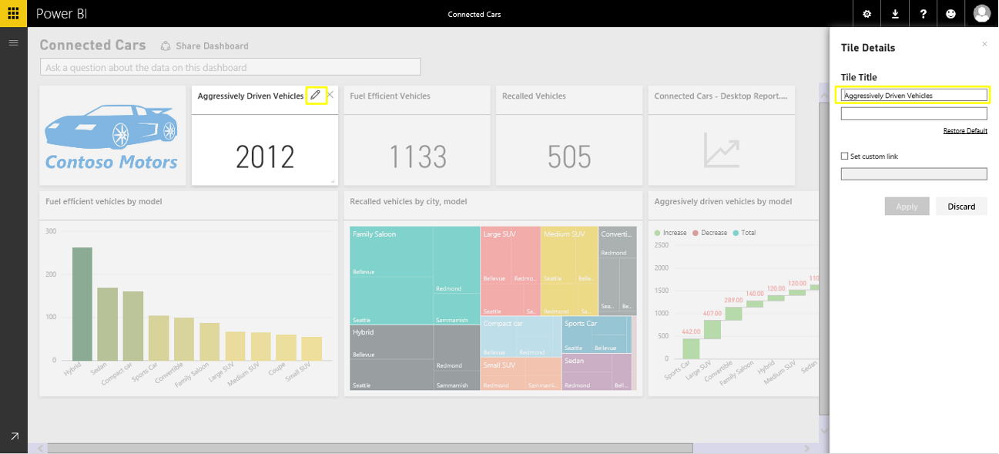

<properties 
    pageTitle="Anweisungen für die Einrichtung Fahrzeug werden Analytics Lösungsvorlage PowerBI Dashboard | Microsoft Azure" 
    description="Verwenden Sie die Funktionen von Cortana Intelligence um zu gewinnen in Echtzeit und Vorhersage Einblicke auf Fahrzeug Gesundheit und steuernde Listen." 
    services="machine-learning" 
    documentationCenter="" 
    authors="bradsev" 
    manager="jhubbard" 
    editor="cgronlun" />

<tags 
    ms.service="machine-learning" 
    ms.workload="data-services" 
    ms.tgt_pltfrm="na" 
    ms.devlang="na" 
    ms.topic="article" 
    ms.date="09/12/2016" 
    ms.author="bradsev" />

# Fahrzeug werden Analytics Lösung Vorlage PowerBI Dashboard Anweisungen zum Einrichten

Dieses **Menü** Links auf die Kapitel in dieser Playbook. 

[AZURE.INCLUDE [cap-vehicle-telemetry-playbook-selector](../../includes/cap-vehicle-telemetry-playbook-selector.md)]

Die Lösung Fahrzeug werden Analytics werden die wie Auto Händler, Autos Hersteller und Formulars für Unternehmen nutzen, können die Funktionen von Cortana Intelligence zu gewinnen in Echtzeit und Vorhersage Einblicke Fahrzeug Integrität und Laufwerk Verbesserungen in den Bereich des Kunden steuernde Listen zur Verfügung steht, R & D und marketing-massensendungen zu ermitteln. Dieses Dokument enthält schrittweise Anweisungen wie Sie die PowerBI Berichten und Dashboards konfigurieren können, nachdem die Lösung im Rahmen Ihres Abonnements bereitgestellt wird. 

## Erforderliche Komponenten
1.  Bereitstellen der Lösung Fahrzeug werden Analytics durch Navigieren zur [https://gallery.cortanaanalytics.com/SolutionTemplate/Vehicle-Telemetry-Analytics-3](https://gallery.cortanaanalytics.com/SolutionTemplate/Vehicle-Telemetry-Analytics-3)  
2.  [Microsoft Power BI-Desktop installiert](http://www.microsoft.com/download/details.aspx?id=45331)
3.  Ein [Azure-Abonnement](https://azure.microsoft.com/pricing/free-trial/). Wenn Sie ein Azure-Abonnement besitzen, erste Schritte mit Azure kostenloses Abonnement
4.  PowerBI Microsoft-Konto
    

## Cortana Intelligence Suite-Komponenten
Als Teil der Vorlage Fahrzeug werden Analytics Lösung werden die folgenden Cortana Intelligence-Dienste in Ihrem Abonnement bereitgestellt.

- **Ereignis Hubs** für Aufnahme Millionen Fahrzeug werden Ereignisse in Azure.
- **Analytisches Stream**s für in Echtzeit Einsichten Fahrzeug Integrität erlangen und die Daten in langfristiges Speicher für reichhaltigere Stapel Analytics beibehalten.
- **Computer-Schulung** für Normalbetriebswerte in Echtzeit und Stapelverarbeitung zu Vorhersage Einsichten zu gewinnen.
- **HDInsight** wird um bei Datentransformation genutzt
- **Daten Factory** übernimmt Orchestrierung, Planung, ressourcenverwaltung und für die Überwachung von der Verkaufspipeline Stapelverarbeitung.

**Power BI** bietet diese Lösung ein Rich-Dashboards für Echtzeitdaten und Vorhersageanalytik Visualisierungen. 

Die Lösung verwendet zwei verschiedenen Datenquellen: **simulierten Fahrzeug Eigenschaften und diagnostic Dataset** und **Fahrzeug-Katalog**.

Ein Fahrzeug Telematik Simulator ist Bestandteil dieser Lösung. Es gibt Diagnoseinformationen aus und weist, zielgerichteten Muster zu einem bestimmten Zeitpunkt und den Status des Fahrzeug entspricht. 

Instrumententafel im Katalog ist ein Bezug Dataset enthaltenden VIN zum Modell-Zuordnung

## PowerBI Dashboard Vorbereitung

### Bereitstellung

Nachdem die Bereitstellung abgeschlossen ist, sollte das folgende Diagramm mit diesen Komponenten in grün markiert angezeigt werden. 

- Zum Navigieren Sie zu der entsprechenden Services, um zu überprüfen, ob alle diese erfolgreich bereitgestellt haben, klicken Sie auf den Pfeil in der oberen rechten Ecke der grünen Knoten.
- Wenn das Daten Simulator-Paket herunterladen möchten, klicken Sie auf den Pfeil neben der oben rechts auf dem **Fahrzeug Telematik Simulator** -Knoten. Speichern und die Dateien lokal auf Ihrem Computer zu extrahieren. 

Nun können Sie das PowerBI-Dashboard mit Darstellungen in Echtzeit erhalten konfigurieren, und Vorhersage Erkenntnisse im Fahrzeug Gesundheit und steuernde Listen. Es dauert ungefähr 45 Minuten in eine Stunde um alle Berichte erstellen und Konfigurieren von dem Dashboard. 

### Für die Einrichtung in Echtzeit Power BI-Dashboard

**Generieren von simulierten Daten**

1. Auf Ihrem lokalen Computer wechseln Sie zu dem Ordner, in dem Sie das Fahrzeug Telematik Simulator-Paket extrahiert
2.  Führen Sie die Anwendung ***CarEventGenerator.exe***.
3.  Es gibt Diagnoseinformationen aus und weist, zielgerichteten Muster zu einem bestimmten Zeitpunkt und den Status des Fahrzeug entspricht. Dies ist eine Instanz Azure Ereignis Hub veröffentlicht, das als Teil der Bereitstellung konfiguriert ist.

     
**Starten Sie die Dashboardanwendung in Echtzeit**

Die Lösung umfasst eine Anwendung, die ein Dashboard in Echtzeit in PowerBI generiert. Diese Anwendung überwacht ein Ereignis Hub-Instanz, aus dem Stream Analytics die Ereignisse kontinuierlich veröffentlicht. Für jedes Ereignis, das diese Anwendung empfängt, verarbeitet er die Daten mithilfe eines Punktzahl Anforderung / Antwort-Computer Learning-Endpunkts an. Der resultierende Datensatz wird in der PowerBI Pushbenachrichtigungen APIs für Visualisierung veröffentlicht. 

Die Anwendung herunterladen zu können:

1.  Klicken Sie auf der PowerBI-Knoten in der Diagrammansicht, und klicken Sie auf die **Real-Time Dashboard-Anwendung herunterladen**' Link im Bereich Eigenschaften.
2.  Extrahiert und speichern Sie die Anwendung lokal

3.  Führen Sie die Anwendung **RealtimeDashboardApp.exe**
4.  Geben Sie gültige Power BI-Anmeldeinformationen, melden Sie sich, und klicken Sie auf **annehmen**
    
    
    
    

### Konfigurieren von Berichten PowerBI
Die Berichte in Echtzeit und dem Dashboard in Anspruch nehmen etwa 30-45 Minuten. Navigieren Sie zu [http://powerbi.com](http://powerbi.com) und melden Sie sich an.

In Power BI wird ein neues Dataset generiert. Klicken Sie auf das Dataset **ConnectedCarsRealtime** .

Speichern Sie leeren Bericht mit **STRG + s**.

Geben Sie Bericht an *Fahrzeug werden Analytics Real-Time - Berichte*.

## Berichte in Echtzeit
Es gibt drei Berichte in Echtzeit in dieser Lösung:

1.  Fahrzeuge der Vorgang
2.  Fahrzeuge mit Anforderung der Wartung
3.  Fahrzeuge Gesundheitsstatistik

Sie können auswählen, konfigurieren die drei in Echtzeit-Berichte oder nach einem beliebigen Zeitpunkt beenden, und fahren Sie mit dem nächsten Abschnitt der Konfiguration der Stapel Berichte. Wir empfehlen Ihnen, die drei Berichte zum Visualisieren der vollständigen Einsichten den in Echtzeit Pfad der Lösung zu erstellen.  

### 1. Vorgang Fahrzeuge
  
Doppelklicken Sie auf **Seite 1** und benennen Sie sie in "Fahrzeuge der Vorgang"  
      

Wählen Sie aus **Feldern** **vin** -Feld aus, und wählen Sie visualisierungsart als **"Karte"**.  

Kartenvisualisierung wird erstellt, wie in der Abbildung dargestellt.  
    

Klicken Sie auf den leeren Bereich, um eine neue Visualisierung hinzufügen.  

Wählen Sie **Ort** und **vin** aus Feldern ein. Ändern der Visualisierung zu **"Karte"**. Ziehen Sie im Wertebereich **vin** ein. Ziehen Sie **Ort** aus Feldern zum Bereich der **Legende** ein.   
    
  
Wählen Sie im Abschnitt **Format** von **Visualisierungen**aus, klicken Sie auf **Titel** , und ändern Sie den **Text** für **"Fahrzeuge der Vorgang nach Ort"**.  
       

Endgültige Visualisierung sieht wie in der Abbildung dargestellt.    
    

Klicken Sie auf den leeren Bereich, um eine neue Visualisierung hinzufügen.  

Wählen Sie **Ort** und **vin**, **Gruppiertes Säulendiagramm**Visualisierung ändern. Vergewissern Sie sich **Ort** das Feld **Achse Bereich** und **vin** **Wert** im Bereich  

Sortieren Sie nach **"Anzahl vin"** Diagramm  
      

Ändern Sie Diagramm **Titel** für **"Fahrzeuge der Vorgang nach Ort"**  

Klicken Sie auf den Abschnitt " **Format** ", und wählen Sie dann **Daten Farben**, klicken Sie auf **"Auf"** auf **Alle anzeigen**  
      

Ändern der Farbe einzelner Ort, indem Sie auf das Symbol "Farbe".  
      

Klicken Sie auf den leeren Bereich, um eine neue Visualisierung hinzufügen.  

Wählen Sie **Gruppiertes Säulendiagramm** Visualisierung von Visualisierungen aus, und ziehen Sie Feld ' **Ort** ' **Achse** Bereich **Modell** im Bereich der **Legende** und **vin** **Wert** im Bereich.  
      
    
  
Anordnen Sie alle Visualisierung auf dieser Seite, wie in der Abbildung dargestellt.  
    

Bericht in Echtzeit "Fahrzeuge der Vorgang" wurde erfolgreich konfiguriert. Sie können mit den nächsten in Echtzeit Bericht erstellen oder hier beenden und Konfigurieren des Dashboards fortfahren. 

### 2. Fahrzeuge mit Anforderung der Wartung
  
Klicken Sie auf  zum Hinzufügen eines neuen Berichts, benennen Sie sie in **"Fahrzeuge mit Anforderung der Wartung"**

  

Wählen Sie **vin** Feld aus, und ändern Sie visualisierungsart auf **Karte**.  
      

Wir haben ein Feld mit dem Namen "MaintenanceLabel" im Dataset aus. Dieses Feld kann den Wert "0" oder "1" aufweisen." Es wird durch das Modell Azure maschinellen Schulung nach der Bereitstellung im Rahmen der Lösung und durch den Pfad in Echtzeit integriert festgelegt. Der Wert "1" gibt an, dass ein Fahrzeug Wartung erfordert. 

Hinzufügen ein Filters **Seitenebene** für Fahrzeuge enthalten, die Wartung erforderlich sind: 

1. Ziehen Sie das Feld **"MaintenanceLabel"** in **Seite Ebene Filter**ein.  
  

2. Klicken Sie auf **Die Standardfilterung** Menü präsentieren am Fuß des MaintenanceLabel Seite Ebene filtern.  
  

3.  Legen Sie den Filterwert **"** 1"    
  

Klicken Sie auf den leeren Bereich, um eine neue Visualisierung hinzufügen.  

Wählen Sie **Gruppiertes Säulendiagramm** von Visualisierungen  
  

Ziehen Sie Feld **Modell** in **Achse** Bereich **Vin** zum Bereich **Wert** ein. Klicken Sie dann sortieren Sie nach **Anzahl der vin**Visualisierung aus.  Ändern der **Diagrammtitel** **"** Fahrzeuge mit Anforderung der Wartung vom Modell"  

Ziehen Sie Felder **vin** in **Farbsättigung** am **Felder** vorhanden  Abschnitt der Registerkarte **Visualisierung**  
  

Ändern von **Farben Daten** in Visualisierungen aus dem Abschnitt " **Format** "  
Ändern der Farbe Minimum: **F2C812**  
Ändern der Farbe Maximum: **FF6300**  
  
  

Klicken Sie auf den leeren Bereich, um eine neue Visualisierung hinzufügen.  

Wählen Sie **gruppierte Säulendiagramm** aus Visualisierungen, ziehen Sie **vin** -Feld in der **Wert** im Bereich, ziehen Sie das Feld " **Ort** " in **Achse** Bereich. Sortieren Sie nach **"Anzahl vin"**Diagramm. Ändern Sie Diagramm **Titel** **"** Fahrzeuge mit Anforderung der Wartung nach Ort"   
  

Klicken Sie auf den leeren Bereich, um eine neue Visualisierung hinzufügen.  

Wählen Sie **Mehrerer Zeilen** kartenvisualisierung von Visualisierungen aus, und ziehen Sie in den **Feldern** Bereich **Model** and **vin** .  
    

Neuanordnen von allen der Visualisierung, sieht der endgültige Bericht wie folgt aus:  
  

Bericht in Echtzeit "Fahrzeuge mit Anforderung der Wartung" wurde erfolgreich konfiguriert. Sie können mit den nächsten in Echtzeit Bericht erstellen oder hier beenden und Konfigurieren des Dashboards fortfahren. 

### 3. Gesundheit-Statistik Fahrzeuge
  
Klicken Sie auf  zum Hinzufügen neuen Berichts benennen Sie sie in **"Fahrzeuge Gesundheitsstatistik"**  

Wählen Sie **Monitor** -Visualisierung von Visualisierungen aus, und ziehen Sie dann das Feld " **Geschwindigkeit** " in **Wert, Minimalwert, Maximalwert** Bereiche.  
  

Ändern Sie die Standardaggregation **Geschwindigkeit** in **Wertebereich** in **Mittelwert** 

Ändern Sie die Standardaggregation **Geschwindigkeit** **Minimum** Bereich auf ein **Minimum beschränken**

Ändern Sie die Standardaggregation **Geschwindigkeit** **Maximum** Bereich auf **Maximum**

  

Benennen Sie den **Titel der Monitor** in **"Durchschnittliche Geschwindigkeit"** 
 
  

Klicken Sie auf den leeren Bereich, um eine neue Visualisierung hinzufügen.  

Fügen Sie einen **Monitor** für **Mittelwert-Engine Oil**, **durchschnittliche**und **Mittelwert-Engine gemäßigten**auf ähnliche Weise hinzu.  

Änderung, die die Standardaggregation von Feldern im jeden Monitor als pro über in **"Durchschnittliche Geschwindigkeit"** Schritte-Zeitachse.

Klicken Sie auf den leeren Bereich, um eine neue Visualisierung hinzufügen.

Wählen Sie **Zeilen- und gruppiertes Säulendiagramm** aus Visualisierungen, ein, und klicken Sie dann ziehen Feld **Ort** in **Achse freigegeben**, ziehen Sie **Geschwindigkeit**, **Tirepressure und Engineoil Felder** in der **Spalte** Wertebereich, ändern Sie deren Aggregationstyp in **Mittelwert**. 

Ziehen Sie das Feld " **EngineTemperature** " in **Zeile** Wertebereich, ändern Sie den Aggregationstyp in **Mittelwert**. 

Ändern Sie das Diagramm **Titel** **"durchschnittliche Geschwindigkeit, Reifendruck, Engine Oil**und-Engine Temperatur" ein.  

Klicken Sie auf den leeren Bereich, um eine neue Visualisierung hinzufügen.

Wählen Sie **Treemap** Visualisierung von Visualisierungen, ziehen Sie das **Modell** -Feld in den Bereich **Gruppieren** , und ziehen Sie das Feld **MaintenanceProbability** in den Bereich **Werte** .

Ändern Sie das Diagramm **Titel** in **"Fahrzeug Modelle mit Anforderung der Wartung"**ein.

Klicken Sie auf den leeren Bereich, um eine neue Visualisierung hinzufügen.

Wählen Sie aus der Visualisierung aus **(100 %), gestapeltes Balkendiagramm** , ziehen Sie das Feld " **Ort** " in den Bereich der **Achse** , und ziehen Sie die **MaintenanceProbability**, **RecallProbability** Felder in den Bereich **Wert** .

Klicken Sie auf **Format**, wählen Sie **Farben Daten**aus, und legen Sie die Farbe **MaintenanceProbability** auf den Wert **"F2C80F"**.

Ändern Sie den **Titel** des Diagramms in **"Wahrscheinlichkeit von Fahrzeug Wartung und zurückrufen nach Ort"**ein.

Klicken Sie auf den leeren Bereich, um eine neue Visualisierung hinzufügen.

Wählen Sie aus der Visualisierung von Visualisierungen **Flächendiagramm** , ziehen Sie das **Modell** -Feld in den Bereich der **Achse** , und ziehen Sie die Felder **EngineOil, Tirepressure, Geschwindigkeit und MaintenanceProbability** in den Bereich **Werte** . Ändern Sie die Aggregationstyp in **"Mittelwert"**ein. 

Ändern Sie den Titel des Diagramms in **"Mittelwert-Engine Oil, Druck, Geschwindigkeit und Wartung Wahrscheinlichkeit von Datenmodell Gummirings"**ein.

Klicken Sie auf den leeren Bereich, um eine neue Visualisierung hinzufügen:

1. Wählen Sie **Punkt (XY)-Diagramm** -Visualisierung von Visualisierungen aus.
2. Ziehen Sie das **Modell** -Feld in den Bereich **Details** und **Legende** ein.
3. Ziehen Sie das Feld **Kraftstoff** in den Bereich **X-Achse** , ändern Sie die Aggregation in **Mittelwert**.
4. Ziehen Sie **EngineTemparature** in **Y-Achse Bereich**, ändern Sie die Aggregation in **Mittelwert**
5. Ziehen Sie das **vin** -Feld in den Bereich **Größe** ein.

Ändern Sie das Diagramm **Titel** in **"Durchschnitte der Kraftstoff, Engine Temperatur von Datenmodell"**ein.

Der endgültige Bericht sieht so aus wie unten dargestellt.

### PIN-Visualisierungen aus den Berichten zum Dashboard in Echtzeit
  
Erstellen Sie ein leeres Dashboard, indem Sie auf das Pluszeichen neben Dashboards auf. Sie können sie "Fahrzeug Telemetriedashboard Analytics" nennen

Fixieren der Visualisierung aus den oben genannten Berichten zum Dashboard. 
 

Das Dashboard sollte wie folgt aussehen, wenn alle drei Berichte erstellt werden und entsprechenden Visualisierungen auf dem Dashboard angehefteten sind. Wenn Sie nicht alle Berichte erstellt haben, könnte Ihr Dashboard anders. 

Herzlichen Glückwunsch! Sie haben das Dashboard in Echtzeit erfolgreich erstellt. Wenn Sie nun zum Ausführen von CarEventGenerator.exe und RealtimeDashboardApp.exe, sollte live Updates auf dem Dashboard angezeigt werden. Es sollte ungefähr 10 bis 15 Minuten die folgenden Schritte ausführen.

 
##  Power BI Stapel Verarbeitung Dashboard für die Einrichtung

>[AZURE.NOTE] Es dauert etwa zwei Stunden (über den erfolgreichen Abschluss der Bereitstellung) für die durchgehende Stapelverarbeitung Verkaufspipeline zum Beenden der Ausführung und ein Jahr im Wert von generierten Daten zu verarbeiten. Warten Sie also für die Verarbeitung auf Fertig stellen, bevor Sie mit den nächsten Schritten fort. 

**Die PowerBI-Designer-Datei nicht herunterladen**

-   Eine vorkonfigurierte PowerBI-Designer-Datei ist Bestandteil der Bereitstellung
-   Klicken Sie auf der PowerBI-Knoten in der Diagrammansicht, und klicken Sie auf Link im Eigenschaftenbereich **die PowerBI-Designer-Datei nicht herunterladen**

-   Lokales speichern

**Konfigurieren von Berichten PowerBI**

-   Öffnen Sie die Designer-Datei 'VehicleTelemetryAnalytics - Desktop-Report.pbix PowerBI Desktop verwenden. Wenn Sie noch nicht verfügen, installieren Sie den PowerBI Desktop aus [PowerBI Desktop zu installieren](http://www.microsoft.com/download/details.aspx?id=45331). 

-   Klicken Sie auf das **Bearbeiten von Abfragen**.

- Doppelklicken Sie auf die **Datenquelle**.

- Aktualisieren Sie Verbindungszeichenfolge Server mit dem SQL Azure-Server, der als Teil der Bereitstellung bereitgestellt haben. Klicken Sie auf der SQL Azure-Knoten auf das Diagramm, und zeigen Sie den Servernamen im Eigenschaftenbereich.

- Lassen Sie als *Connectedcar* **Datenbank** ein.

- Klicken Sie auf **OK**.
- **Windows-Anmeldeinformationen** Registerkarte vom ausgewählten Standard, ändern ihn in die **Datenbank, Anmeldeinformationen** , indem Sie auf der Registerkarte **Datenbank** rechts wird angezeigt.
- Geben Sie **Benutzername** und **Kennwort** Ihrer Azure SQL-Datenbank, die während der Einrichtung Bereitstellung angegeben wurde.

- Klicken Sie auf **Verbinden**
- Wiederholen Sie die obigen Schritte für jeden der drei verbleibenden Abfragen am rechten Bereich präsentieren, und klicken Sie dann aktualisieren Sie die Details der Datenquelle Verbindung.
- Klicken Sie auf **Schließen, und Laden**. Power BI-Desktop-Datei Datasets besteht SQL Azure-Datenbanktabellen.
- **Schließen** Power BI-Desktop-Datei.

- Klicken Sie auf **Speichern** , um die Änderungen zu speichern. 
 
Sie haben nun alle Berichte, die dem Stapel Verarbeitung Pfad in die Lösung entspricht konfiguriert. 

## Hochladen Sie auf *powerbi.com*
 
1.  Navigieren Sie zu der PowerBI Web-Portal unter http://powerbi.com, und melden Sie sich an.
2.  Klicken Sie auf **Daten**  
3.  Laden Sie die Power BI-Desktop-Datei hoch.  
4.  Wenn Sie hochladen möchten, klicken Sie auf **-Daten abrufen > Dateien erhalten -> Lokale Dateien**  
5.  Navigieren Sie zu der **"VehicleTelemetryAnalytics – Desktop Report.pbix"**  
6.  Nachdem die Datei hochgeladen wird, werden Sie wieder auf Ihrer Power BI-Arbeitsbereich navigiert werden.  

Ein Dataset, Bericht und ein leeres Dashboard werden für Sie erstellt.  
 

PIN Diagramme zu vorhandenen Dashboards **Fahrzeug Analytics Telemetriedashboard** in **Power BI**. Klicken Sie auf die oben erstellte leere Dashboard, und navigieren Sie dann klicken Sie im Abschnitt **Berichte** auf den Bericht neu hochgeladenen.  

 

**Beachten Sie, dass der Bericht sechs Seiten umfasst:**  
Seite 1: Fahrzeug Dichtefunktion  
Seite 2: In Echtzeit Fahrzeug Dienststatus  
Seite 3: Leistungsgesteuert verkleinert Fahrzeuge   
Seite 4: Zurückgerufen Fahrzeuge  
Seite 5: Kraftstoff effizient leistungsgesteuert Fahrzeuge  
Seite 6: Contoso-Logo  

 

**Von Seite 3**, Pin Folgendes:  

1.  Anzahl der VIN  
     

2.  Leistungsgesteuert verkleinert Fahrzeuge nach Modell – Wasserfall-Diagramm  
    

**Von Seite 5**, Pin Folgendes: 
 
1.  Anzahl der vin    
      
2.  Kraftstoff effiziente Fahrzeuge von Datenmodell: Säulendiagramm  
    

**Von Seite 4**, Pin Folgendes:  

1.  Anzahl der vin  
     

2.  Modellieren zurückgerufenen Fahrzeuge nach Ort: Treemap  
      

**Von der Seite 6**, Pin Folgendes:  

1.  Contoso-Motors-logo  
    

**Organisieren von dem dashboard**  

1.  Navigieren Sie zu dem dashboard
2.  Zeigen Sie auf jedes Diagramm und umbenennen, die sie basierend auf die Benennung im Bild unten abgeschlossen Dashboard bereitgestellt. Verschieben Sie, auch die Diagramme um zu dem folgenden Dashboard aussehen.  
      
    
3.  Wenn Sie alle Berichte erstellt haben, wie in diesem Dokument erwähnt, sollte das endgültige fertige Dashboard wie in der folgenden Abbildung aussehen. 

Herzlichen Glückwunsch! Sie haben die Berichte erfolgreich erstellt und das Dashboard in Echtzeit, Vorhersage erlangen und Erkenntnisse im Fahrzeug Gesundheit und steuernde Stapel Listen.  
