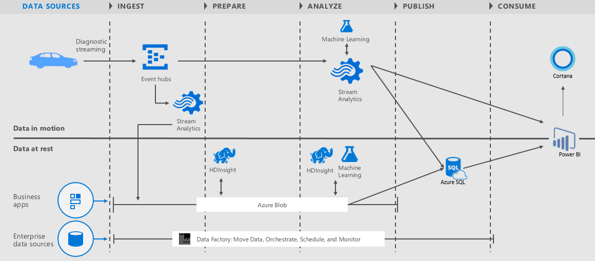

<properties 
    pageTitle="Fahrzeug werden Analytics Lösung Playbook | Microsoft Azure" 
    description="Verwenden Sie die Funktionen von Cortana Intelligence um zu gewinnen in Echtzeit und Vorhersage Einblicke auf Fahrzeug Gesundheit und steuernde Listen." 
    services="machine-learning" 
    documentationCenter="" 
    authors="bradsev" 
    manager="jhubbard" 
    editor="cgronlun" />

<tags 
    ms.service="machine-learning" 
    ms.workload="data-services" 
    ms.tgt_pltfrm="na" 
    ms.devlang="na" 
    ms.topic="article" 
    ms.date="09/12/2016" 
    ms.author="bradsev" />

# Fahrzeug werden Analytics Lösung playbook

Dieses **Menü** Links auf die Kapitel in dieser Playbook. 

[AZURE.INCLUDE [cap-vehicle-telemetry-playbook-selector](../../includes/cap-vehicle-telemetry-playbook-selector.md)]

## (Übersicht)
Übergeordnete Computern außerhalb der Übung verschoben haben und in unseren Garage geparkter sind! Diese herausragende Autos enthalten sehr viele Sensoren, sodass sie Funktionen verfolgen und Überwachen von Millionen von Ereignissen pro Sekunde. Wir erwarten 2020, indem Sie die meisten der folgenden Autos mit dem Internet verbunden sein werden. Stellen Sie sich vor tippen in dieser Fülle von Daten, die am besten in Klasse Sicherheit, Zuverlässigkeit und steuernde Erfahrung! Microsoft hat dies realisieren mit Cortana Intelligence träumen gestaltet.

Microsoft Cortana Intelligence ist eine vollständig verwaltete big Data und die erweiterte Analytics-Suite aus, die Sie zum Umwandeln der Daten in intelligente Aktion ermöglicht. Wir möchten Sie die Vorlage Cortana Intelligence Fahrzeug werden Analytics Lösung vorstellen. Diese Lösung wird veranschaulicht, wie Auto Händler, Autos Herstellern und Formulars für Unternehmen die Funktionen von Cortana Intelligence verwenden können, um in Echtzeit erhalten und Vorhersage Erkenntnisse im Fahrzeug Gesundheit und steuernde Listen. 

Die Lösung wird als [Lambda-Architekturmuster](https://en.wikipedia.org/wiki/Lambda_architecture) mit der vollständigen der Plattform Cortana Intelligence für potenzielle implementiert in Echtzeit und Stapelverarbeitung. Die Lösung: 

- Stellt eine Fahrzeug Telematik simulator
- nutzt Ereignis Hubs für Millionen von simulierten Fahrzeug werden Ereignisse in Azure Aufnahme 
- Stream Analytics verwendet, um in Echtzeit Einsichten Fahrzeug Integrität zu erhalten
-  behält die Daten in langfristiges Speicher für reichhaltigere Stapel Analytics an. 
- nutzt maschinellen Learning für Normalbetriebswerte in Echtzeit und Stapel Verarbeitung um Vorhersage Einsichten zu erhalten.
- nutzt HDInsight, um die Daten im Maßstab und Daten Factory Orchestrierung, Planung, ressourcenverwaltung und für die Überwachung von der Verkaufspipeline Stapelverarbeitung verarbeitet transformieren 
- bietet diese Lösung ein Rich-Dashboards für Echtzeitdaten und Vorhersageanalytik Visualisierungen mit Power BI

## Architektur

*Abbildung 1 – Fahrzeug werden Analytics Lösungsarchitektur*

Diese Lösung umfasst die folgenden **Komponenten Cortana Intelligence** und zeigt ihre durchgehende-integration

- **Ereignis Hubs** für Aufnahme Millionen Fahrzeug werden Ereignisse in Azure.
- **Stream Analytics** für in Echtzeit Einsichten Fahrzeug Integrität erlangen und die Daten in langfristiges Speicher für reichhaltigere Stapel Analytics beibehalten.
- **Computer-Schulung** für Normalbetriebswerte in Echtzeit und Stapelverarbeitung zu Vorhersage Einsichten zu gewinnen.
- **HDInsight** wird um bei Datentransformation genutzt
- **Daten Factory** übernimmt Orchestrierung, Planung, ressourcenverwaltung und für die Überwachung von der Verkaufspipeline Stapelverarbeitung.
- **Power BI** bietet diese Lösung ein Rich-Dashboards für Echtzeitdaten und Vorhersageanalytik Visualisierungen.

Diese Lösung greift auf zwei verschiedenen **Datenquellen**: 

- **Eines simulierten Fahrzeug Eigenschaften und Diagnose**: eine Fahrzeug Telematik Simulator Diagnoseinformationen und den Status des Fahrzeug und das steuernde Muster zu einem bestimmten Zeitpunkt entsprechen Signale Zeitpunkt ausgegeben. 
- **Instrumententafel im Katalog**: ein Bezug Dataset mit einem VIN zum Modell Zuordnung.
