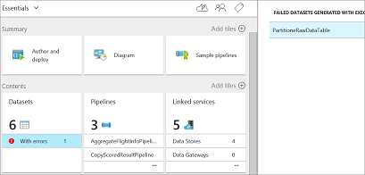

<properties
    pageTitle="Technischen Leitfaden für die Vorlage Cortana Intelligence Lösung, für die Vorhersage Wartung in Luftfahrt und anderen Unternehmen | Microsoft Azure"
    description="Technischen Leitfaden zur Lösung Vorlage mit Microsoft Cortana Intelligence für Vorhersage Wartung in Aerospace, Dienstprogramme und Shapes für Transport."
    services="cortana-analytics"
    documentationCenter=""
    authors="fboylu"
    manager="jhubbard"
    editor="cgronlun"/>

<tags
    ms.service="cortana-analytics"
    ms.workload="data-services"
    ms.tgt_pltfrm="na"
    ms.devlang="na"
    ms.topic="article"
    ms.date="09/13/2016"
    ms.author="fboylu" />

# Technischen Leitfaden für die Vorlage Cortana Intelligence Lösung, für die Vorhersage Wartung in Luftfahrt und anderen Unternehmen

## **Empfangsbestätigungen**
In diesem Artikel wird von Daten Wissenschaftler Yan Zhang, Gauher Shaheen, Fidan Boylu Uz und Softwareentwickler Dan Grecoe bei Microsoft verfasst.

## **(Übersicht)**

Lösungsvorlagen sind für die Erstellung einer E2E Demo auf Cortana Intelligence Suite Beschleunigung. Bereitgestellte Vorlage Ihres Abonnements mit den notwendigen Cortana Intelligence-Komponenten bereitstellt und die Beziehungen zwischen ihnen erstellen. Außerdem wird der Verkaufspipeline Daten basiert, mit Beispieldaten generiert aus einer Daten-Generator-Anwendung, die Sie herunterladen und auf dem lokalen Computer installieren, nachdem Sie die Lösungsvorlage bereitgestellt werden. Die Daten aus dem Generator generiert werden unterbrechen, die Daten Verkaufspipeline und Computer Learning Vorhersagen die klicken Sie dann auf dem Power BI-Dashboard visualisiert werden soll, können zu erzeugen. Verfahren führt Sie durch die verschiedenen Schritte, um Ihre Anmeldeinformationen Lösung einzurichten. Stellen Sie sicher, dass Sie diese Anmeldeinformationen wie Lösungsname, Benutzername und Kennwort ein, das Sie während der Bereitstellung bieten aufzeichnen.  

Das Ziel dieses Dokuments wird die Verweis-Architektur und unterschiedlichen Komponenten nach der Bereitstellung in Ihrem Abonnement als Teil dieser Lösungsvorlage erläutert. Das Dokument spricht auch Informationen zum Ersetzen der Beispieldaten mit realen Daten eigene Einsichten und Vorhersagen von Ihren eigenen Daten sehen können. Darüber hinaus werden im Dokument die Teile der Vorlage Lösung, die geändert werden soll, wenn Sie die Lösung für Ihre eigenen Daten anpassen wollten müssten. Anweisungen zum Erstellen des Power BI-Dashboards für diese Vorlage Lösung werden am Ende bereitgestellt.

>[AZURE.TIP] Sie können herunterladen und Drucken einer [PDF-Version dieses Dokuments](http://download.microsoft.com/download/F/4/D/F4D7D208-D080-42ED-8813-6030D23329E9/cortana-analytics-technical-guide-predictive-maintenance.pdf).

## **Großes Bild**

Verschiedene Azure Dienste Cortana Analytics-Suite sind aktiviert, wenn die Lösung bereitgestellt wird, (*d. h.* Ereignis Hub *Stream Analytics, HDInsight, Daten Factory, Computer-Schulung usw.*). Das Architekturdiagramm oben angezeigt wird, auf hoher Ebene, wie die Vorhersage Wartung für Luft-Lösungsvorlage von End-to-End erstellt wird. Sie können werden diese Dienste Azure-Portal, indem Sie auf die Lösung Vorlage Diagramm mit für die Bereitstellung der Lösung mit Ausnahme von HDInsight erstellt werden, wie bei Bedarf diesen Dienst bereitgestellt wird, wenn die zugehörigen Verkaufspipeline Aktivitäten anschließend ausführen und gelöschten erforderlich sind, klicken Sie auf überprüfen.
Sie können ein [Diagramm in voller](http://download.microsoft.com/download/1/9/B/19B815F0-D1B0-4F67-AED3-A40544225FD1/ca-topologies-maintenance-prediction.png)herunterladen.

Den folgenden Abschnitten werden die jeweiligen Textabschnitts.

## **Datenquelle und Gliederung**

### Synthetische Datenquelle

Für diese Vorlage wird die Datenquelle verwendet aus einer desktop-Anwendung generiert, die Sie herunterladen und nach der erfolgreichen Bereitstellung lokal ausgeführt werden. Finden Sie die Anweisungen zum Herunterladen und installieren diese Anwendung in der Eigenschaften-Leiste, wenn Sie auf dem ersten Knoten Vorhersage Wartung Daten-Generator im Diagramm der Lösung Vorlage auswählen. Diese Anwendung feeds [Azure Ereignis Hub](#azure-event-hub) Dienst mit Datenpunkten oder Ereignissen, die in den Rest der Lösung illustrieren verwendet werden soll. Diese Datenquelle ist besteht aus oder abgeleitet von öffentlich zugängliche Daten aus dem [NASA Datenrepository](http://ti.arc.nasa.gov/tech/dash/pcoe/prognostic-data-repository/) mithilfe der [Turbofan Engine Verschlechterung Simulation Datengruppe zurück](http://ti.arc.nasa.gov/tech/dash/pcoe/prognostic-data-repository/#turbofan).

Die Ereignis Generation Anwendung wird das Ereignis Azure-Hub füllen Sie nur während der auf dem Computer ausgeführt wird.

### Azure Ereignis hub

Der Dienst [Azure Ereignis Hub](https://azure.microsoft.com/services/event-hubs/) ist der Empfänger der Eingabe von oben beschriebenen synthetische Datenquelle bereitgestellt.

## **Vorbereiten der Daten und Analyse**

### Azure Stream Analytics

Der [Azure Stream Analytics](https://azure.microsoft.com/services/stream-analytics/) -Dienst wird verwendet, bieten eine nahezu in Echtzeit Analytics im Eingabewerte Stream vom Dienst [Azure Ereignis Hub](#azure-event-hub) und die Ergebnisse auf einer [Power BI](https://powerbi.microsoft.com) -Dashboard sowie alle unformatierten eingehende Ereignisse in der [Azure](https://azure.microsoft.com/services/storage/) -Speicherdienst für eine spätere Verarbeitung vom Dienst [Azure Data Factory](https://azure.microsoft.com/documentation/services/data-factory/) Archivierung veröffentlichen.

### HD-Einsichten benutzerdefinierte aggregation

Der Dienst Azure HD Einblicke dient zum [Struktur](http://blogs.msdn.com/b/bigdatasupport/archive/2013/11/11/get-started-with-hive-on-hdinsight.aspx) Skripts (von Azure Daten Factory koordiniert) ausführen, um Aggregationen auf die unformatierten Ereignisse bereitzustellen, die mithilfe des Diensts für Azure Stream Analytics archiviert wurden.

### Learning Azure-Computern

Der [Azure maschinellen Learning](https://azure.microsoft.com/services/machine-learning/) -Dienst wird (von Azure Daten Factory koordiniert) verwendet die verbleibende Nutzungsdauer (RUL) angegebenen Eingaben empfangen eine bestimmte Flugzeug-Engine Vorhersagen vornehmen.

## **Daten für die Veröffentlichung**

### SQL Azure-Datenbank-Dienst

Der Dienst [Azure SQL-Datenbank](https://azure.microsoft.com/services/sql-database/) wird verwendet, um speichern (verwaltet von Azure Daten Factory) die Vorhersagen vom Dienst Azure maschinellen Schulung, die in der [Power BI](https://powerbi.microsoft.com) -Dashboard verwendet werden.

## **Daten Verbrauch**

### Power BI

Der [Power BI](https://powerbi.microsoft.com) -Dienst wird verwendet, um ein Dashboard anzuzeigen, die enthält Aggregationen und Benachrichtigungen bereitgestellt, die vom Dienst [Azure Stream Analytics](https://azure.microsoft.com/services/stream-analytics/) sowie RUL Vorhersagen in [Azure SQL-Datenbank](https://azure.microsoft.com/services/sql-database/) gespeichert, die mit den [Azure maschinellen Learning](https://azure.microsoft.com/services/machine-learning/) -Dienst erstellt wurden. Anweisungen zum Erstellen des Power BI-Dashboards für diese Vorlage Lösung finden Sie weiter unten im Abschnitt.

## **So zeigen Sie Ihre eigenen Daten**

In diesem Abschnitt beschrieben, wie Sie Ihre eigenen Daten an Azure bringen, und welche Bereiche müssten Änderungen für die Daten, die Sie in diese Architektur bringen.

Es ist wahrscheinlich nicht, dass alle Dataset aus, die Sie wieder abrufen Dataset verwendet durch den [Turbofan Engine Verschlechterung Simulation Datengruppe zurück](http://ti.arc.nasa.gov/tech/dash/pcoe/prognostic-data-repository/#turbofan) , die für diese Lösungsvorlage verwendet übereinstimmen würden. Grundlegendes zu Ihren Daten und die Anforderungen ist werden entscheidend in, wie Sie diese Vorlage für die Arbeit mit Ihren eigenen Daten ändern. Ist dies der ersten anzeigen zum Dienst Azure maschinellen Schulung, können Sie eine Einführung zu erhalten, anhand des Beispiels in [zum Erstellen Ihrer ersten experimentieren](machine-learning-create-experiment.md).

In den folgenden Abschnitten werden in den Abschnitten der Vorlage an, die Änderungen erfordern wird, wenn ein neues Dataset eingeführt wird.

### Azure Ereignis Hub

Der Dienst Azure Ereignis Hub ist sehr generische, sodass Daten an den Hub im JSON oder CSV-Format veröffentlicht werden können. Keine besondere Verarbeitung im Hub Azure Ereignis eintritt, aber es ist wichtig, dass Sie die Daten verstehen, die darin eingezogen wird.

Dieses Dokument beschreibt nicht, wie Sie Ihre Daten Aufnahme, aber Sie können einfach senden Ereignisse oder Daten an einen Hub an Azure Ereignis mit der Ereignis-Hub-API.

### Azure Stream Analytics

Der Azure Stream Analytics-Dienst wird verwendet, um durch die Datenstreams lesen und Ausgeben von Daten in eine beliebige Anzahl von Datenquellen in der Nähe in Echtzeit Analytics zu ermöglichen.

Für die Vorhersage Wartung für Luft-Lösungsvorlage besteht aus vier Unterabfragen, jede in Anspruch nehmen Ereignisse aus den Dienst Azure Ereignis Hub und vier unterschiedlichen Speicherorten Ausgaben müssen die Azure Stream Analytics-Abfrage. Diese Ausgaben bestehen aus drei Power BI-Datasets und einen Speicherort für die Azure.

Die Abfrage Azure Stream Analytics kann vom gefunden werden:

-   Anmeldung beim Azure-portal

-   Speicherorte der Stream Analytics Aufträge  , generiert wurden, wenn die Lösung bereitgestellt wurde (*z. B.*, **maintenancesa02asapbi** und **maintenancesa02asablob** für die Lösung Vorhersage Wartung)

-   Auswählen

    -   ***EINGABEN*** für die Eingabe der Abfrage anzeigen

    -   ***Abfrage*** die Abfrage selbst anzeigen

    -   ***Gibt*** die verschiedenen Ausgaben anzeigen

Informationen zum Erstellen der Abfrage Azure Stream Analytics finden Sie im [Stream Analytics Abfrage Bezug](https://msdn.microsoft.com/library/azure/dn834998.aspx) auf MSDN.

In dieser Lösung ausgeben die Abfragen drei Datasets mit in der Nähe in Echtzeit Analytics Informationen zu den eingehenden Datenstream zu einem Power BI-Dashboard, die als Teil dieser Lösungsvorlage bereitgestellt wird. Da es implizit Kenntnisse über das eingehende Datenformat ist, müssten diese Abfragen geändert werden, basierend auf Ihrer Datenformat.

Die Abfrage in der zweiten Stream Analytics Auftrag **maintenancesa02asablob** gibt einfach alle [Ereignis-Hub](https://azure.microsoft.com/services/event-hubs/) Ereignisse zu [Azure-Speicher](https://azure.microsoft.com/services/storage/) und erfordert daher keine Änderung, unabhängig von der Datenformat aus, wie die vollständige Ereignisinformationen zu Speicher gestreamt werden.

### Factory Azure-Daten

Der Dienst [Azure Data Factory](https://azure.microsoft.com/documentation/services/data-factory/) koordiniert Bewegung und Verarbeitung von Daten. In der Vorhersage Wartung für Luft-Lösungsvorlage die Daten Factory besteht aus drei [Rohrleitungen](../data-factory/data-factory-create-pipelines.md) , die wechseln und die Daten mit verschiedenen Technologien verarbeiten.  Sie können Ihre Daten Factory zugreifen, indem Sie öffnen die der Daten Factory-Knoten am unteren Rand des Diagramms der Lösung Vorlage erstellt, mit der Bereitstellung der Lösung. Dadurch gelangen Sie Daten Fabrik Ihrer Azure-Portal. Wenn unter Ihrem Datasets Fehler angezeigt wird, können Sie die ignorieren, wie sie sind aufgrund von Daten Factory bereitgestellt wird, bevor der Daten-Generator eingeleitet wurde. Dieser Fehler verhindern Ihre Daten Factory nicht funktioniert nicht.

In diesem Abschnitt wird erläutert, die erforderlichen [Rohrleitungen](../data-factory/data-factory-create-pipelines.md) und [Aktivitäten](../data-factory/data-factory-create-pipelines.md) , die in der [Factory der Azure-Daten](https://azure.microsoft.com/documentation/services/data-factory/)enthalten sind. Im folgenden finden Sie die Diagrammansicht der Lösung.

Zwei der Pipelines dieser Factory enthalten [Struktur](http://blogs.msdn.com/b/bigdatasupport/archive/2013/11/11/get-started-with-hive-on-hdinsight.aspx) Skripts, mit denen unterteilen und Aggregieren von Daten aus. Wenn notiert haben, werden die Skripts in das während der Installation erstellte [Azure-Speicher](https://azure.microsoft.com/services/storage/) Konto befinden. Kann ich die Standortinformationen: Maintenancesascript\\\\Skript\\\\Struktur\\ \\ (oder https://[Your Lösung name].blob.core.windows.net/maintenancesascript).

Ähnlich wie der [Azure Stream Analytics](#azure-stream-analytics-1) Abfragen, die [Struktur](http://blogs.msdn.com/b/bigdatasupport/archive/2013/11/11/get-started-with-hive-on-hdinsight.aspx) Skripts implizit Kenntnisse über das eingehende Datenformat haben, diese Abfragen möchten müssen geändert werden basierend auf Ihren Anforderungen Format und [Features technisch](machine-learning-feature-selection-and-engineering.md) .

#### *AggregateFlightInfoPipeline*

Diese [Verkaufspipeline](../data-factory/data-factory-create-pipelines.md) enthält eine einzelne Aktivität - eine [HDInsightHive](../data-factory/data-factory-hive-activity.md) Aktivität mit einer [HDInsightLinkedService](https://msdn.microsoft.com/library/azure/dn893526.aspx) , die eine [Struktur](http://blogs.msdn.com/b/bigdatasupport/archive/2013/11/11/get-started-with-hive-on-hdinsight.aspx) Skript, mit dem die Daten in [Azure-Speicher](https://azure.microsoft.com/services/storage/) setzen, während der Auftrag [Azure Stream Analytics](https://azure.microsoft.com/services/stream-analytics/) aufgeteilt ausgeführt wird.

Das Skript [Struktur](http://blogs.msdn.com/b/bigdatasupport/archive/2013/11/11/get-started-with-hive-on-hdinsight.aspx) für diese vorherigen Vorgang ist ***AggregateFlightInfo.hql***

#### *MLScoringPipeline*

Diese [Verkaufspipeline](../data-factory/data-factory-create-pipelines.md) enthält mehrere Aktivitäten und diese Lösungsvorlage zugeordnet, deren Ergebnis ist, dass die bewertete Vorhersagen von der [Azure maschinellen Learning](https://azure.microsoft.com/services/machine-learning/) experimentieren.

Die Aktivitäten, die diese enthalten sind:

-   [HDInsightHive](../data-factory/data-factory-hive-activity.md) Aktivität mit einer [HDInsightLinkedService](https://msdn.microsoft.com/library/azure/dn893526.aspx) , die eine [Struktur](http://blogs.msdn.com/b/bigdatasupport/archive/2013/11/11/get-started-with-hive-on-hdinsight.aspx) Skript Aggregationen und Feature technisch für den Versuch [Azure maschinellen Learning](https://azure.microsoft.com/services/machine-learning/) notwendigen ausführt.
    Das Skript [Struktur](http://blogs.msdn.com/b/bigdatasupport/archive/2013/11/11/get-started-with-hive-on-hdinsight.aspx) für diese vorherigen Vorgang ist ***PrepareMLInput.hql***.

-   [Kopieren](https://msdn.microsoft.com/library/azure/dn835035.aspx) von Aktivitäten, die die Ergebnisse aus der Aktivität [HDInsightHive](../data-factory/data-factory-hive-activity.md) in ein einzelnes [Speicher Azure](https://azure.microsoft.com/services/storage/) Blob verschiebt, die Zugriff durch die Aktivität [AzureMLBatchScoring](https://msdn.microsoft.com/library/azure/dn894009.aspx) werden können.

-   [AzureMLBatchScoring](https://msdn.microsoft.com/library/azure/dn894009.aspx) Aktivitäten, die die [Azure maschinellen Learning](https://azure.microsoft.com/services/machine-learning/) ruft experimentieren Sie die in den Ergebnissen wird in ein einzelnes [Speicher Azure](https://azure.microsoft.com/services/storage/) Blob setzen ergibt.

#### *CopyScoredResultPipeline*

Diese [Verkaufspipeline](../data-factory/data-factory-create-pipelines.md) enthält eine einzelne Aktivität - eine Aktivität [Kopieren](https://msdn.microsoft.com/library/azure/dn835035.aspx) , die verschoben wird, dass die Ergebnisse der [Azure maschinellen Learning](#azure-machine-learning) experimentieren aus der ***MLScoringPipeline*** zur [Azure SQL-Datenbank](https://azure.microsoft.com/services/sql-database/) , das als Teil der Installation der Lösung Vorlage bereitgestellt wurde.

### Learning Azure-Computern

Die für diese Lösungsvorlage verwendet [Azure maschinellen Learning](https://azure.microsoft.com/services/machine-learning/) experimentieren bietet die verbleibende hilfreiche Nutzungsdauer (RUL) von einem Flugzeug-Engine. Der Versuch gilt nur für den Datensatz ein verbraucht und daher erfordern Änderung oder Ersatz speziell für die Daten, die in eingebracht wurde.

Informationen darüber, wie die Azure maschinellen Learning experimentieren erstellt wurde, finden Sie unter [Vorhersagen Wartung: Schritt 1 von 3, Daten zur Vorbereitung und Features technisch](http://gallery.cortanaanalytics.com/Experiment/Predictive-Maintenance-Step-1-of-3-data-preparation-and-feature-engineering-2).

## **Überwachen des Fortschritts**
 Nach dem Start der Daten-Generator der Verkaufspipeline beginnt hydrated erhalten, und die verschiedenen Komponenten des Ihre Lösung starten eigene in Aktion folgenden die Befehle von der Factory Daten ausgestellt. Es gibt zwei Möglichkeiten, die Sie der Verkaufspipeline überwachen können.

1. Eine des Streams Analytics Auftrags schreibt die unformatierten eingehenden Daten zu Blob-Speicher. Wenn Sie auf Blob-Speicher Komponente Ihrer Lösung auf dem Bildschirm Sie erfolgreich auf die Lösung bereitgestellt, und klicken Sie im rechten Bereich auf Öffnen, gelangen Sie zum [Verwaltungsportal](https://portal.azure.com/). Einmal vorhanden ist, klicken Sie auf Blobs. Im nächsten Bereich wird eine Liste der Container angezeigt. Klicken Sie auf **Maintenancesadata**. Im nächsten Bereich sehen Sie den Ordner **Rawdata** . In den Ordner Rawdata sehen Sie Ordner mit dem Namen Stunde = 17, Stunde = 18 usw.. Wenn Sie diese Ordner angezeigt wird, gibt an, dass die unformatierten Daten erfolgreich ist auf Ihrem Computer generiert und im Blob-Speicher gespeichert wird. CSV-Dateien, die Größen begrenzte in MB in diesen Ordnern sein soll, sollte angezeigt werden.

2. Der letzte Schritt darin, von der Verkaufspipeline ist zum Schreiben von Daten (z. B. Vorhersagen von maschinellen Learning) in der SQL-Datenbank. Sie müssen möglicherweise warten, bis zu drei Stunden für die Daten in SQL-Datenbank angezeigt werden. Eine Möglichkeit zum Überwachen, wie viele Daten in einer SQL-Datenbank verfügbar ist, erfolgt über [Azure-Portal](https://manage.windowsazure.com/). Suchen Sie auf klicken Sie im linken Bereich SQL-Datenbanken  , und klicken Sie darauf. Klicken Sie dann suchen Sie Ihre Datenbank **Pmaintenancedb** , und klicken Sie darauf. Klicken Sie auf der nächsten Seite unten auf Verwalten

    .

    Hier können Sie neue Abfrage und Abfrage für die Anzahl von Zeilen (z. B. select count(*) aus PMResult) klicken. Zunehmender Ihrer Datenbank sollte die Anzahl der Zeilen in der Tabelle vergrößern.

## **Power BI-Dashboard**

### (Übersicht)

In diesem Abschnitt beschrieben, wie Power BI-Dashboards zum Darstellen Ihrer Echtzeitdaten aus Azure Stream Analytics (langsamste Pfad) einrichten sowie Stapel Vorhersageergebnisse von Azure maschinellen learning (kalt Pfad).

### Setup kalt Pfad dashboard

Das grundlegende Ziel ist in der Verkaufspipeline kalt Pfad Daten Vorhersage RUL (Verbleibende Nutzungsdauer) der einzelnen Flugzeug-Engine erhalten, nachdem sie einen Flug (Cycle) endet. Das Vorhersageergebnis wird aktualisiert, alle 3 Stunden für die Vorhersage Flugzeug Module, die einen Flug während der letzten 3 Stunden abgeschlossen haben.

Power BI stellt eine Verbindung mit einer SQL Azure-Datenbank als Datenquelle, die Vorhersageergebnisse gespeichert sind. Hinweis: 1) beim Bereitstellen Ihrer Lösung, wird eine reale Vorhersage in der Datenbank innerhalb von 3 Stunden angezeigt.
Die Pbix-Datei, die im Lieferumfang des Generator Downloads enthält einige Ausgangswerte, damit Sie das Power BI-Dashboard sofort erstellen zu können. 2) in diesem Schritt ist die Voraussetzung herunterladen und Installieren von kostenlosen [Power BI-Desktop](https://powerbi.microsoft.com/documentation/powerbi-desktop-get-the-desktop/)-Software aus.

Die folgenden Schritte führt Sie auf die Datei Pbix der SQL-Datenbank herstellen einer Verbindung mit, die zum Zeitpunkt der Bereitstellung der Lösung mit Daten (*z. B.*. erstellt wurde Vorhersageergebnisse) für Visualisierung.

1.  Erhalten Sie die Datenbankanmeldeinformationen ein.

    **Datenbankservername, Datenbankname, Benutzername und Kennwort** benötigen vor dem Verschieben in den nächsten Schritten fort. Hier sind die Schritte können Sie problemlos finden wie führen.

    -   Nachdem **' Azure SQL-Datenbank '** in Ihrem Diagramm der Lösung Vorlage grünen verwandelt, klicken Sie darauf, und klicken Sie dann auf **'Öffnen'**.

    -   Sie sehen ein neue Registerkarte/Browserfenster, das Azure-Portalseite angezeigt. Klicken Sie im linken Bereich auf **'Ressourcengruppen'** .

    -   Wählen Sie das Abonnement Sie verwenden für die Bereitstellung der Lösung aus, und wählen Sie dann **' YourSolutionName\_ResourceGroup'**.

    -   Klicken Sie in der neuen Pop, Systemsteuerung, auf die  Symbol Zugriff auf Ihre Datenbank. Der Datenbankname ist neben dies Symbol (*z. B.*, **'Pmaintenancedb'**) und den **Datenbankservername** unter der Name-Eigenschaft Server aufgeführt ist, und sollte ähnlich wie **YourSoutionName.database.windows.net**aussehen.

    -   Ihre Datenbank- **Benutzernamen** und Ihr **Kennwort** stimmen mit den Benutzernamen und Kennwort zuvor aufgezeichnet werden, während der Bereitstellung der Lösung.

2.  Aktualisieren der Datenquelle der Berichtsdatei kalt Pfad mit Power BI-Desktop.

    -   Doppelklicken Sie auf den Ordner auf Ihrem PC, wo Sie heruntergeladen haben, und entzippen die Generator-Datei, die **PowerBI\\PredictiveMaintenanceAerospace.pbix** Datei. Wenn alle Warnhinweise angezeigt, wenn Sie die Datei öffnen, ignorieren Sie sie. Klicken Sie am oberen Rand der Datei auf **' Abfragen bearbeiten '**.

        

    -   Sehen Sie zwei Tabellen, **RemainingUsefulLife** und **PMResult**ein. Wählen Sie aus der ersten Tabelle, und klicken Sie auf  neben **'Quelle'** unter **' ANGEWENDETE Schritte '** auf der rechten Bereich **' Abfrageeinstellungen '** . Ignorieren Sie alle Warnhinweise, die angezeigt werden.

    -   Ersetzen Sie im Fenster Pop **'Server'** und **'Database'** mit Ihren eigenen Server und den Datenbanknamen, und klicken Sie dann auf **'OK'**. Stellen Sie für Servername angezeigt sicher, dass Sie den Port 1433 (**YourSoutionName.database.windows.net, 1433**) angeben. Lassen Sie das Datenbankfeld als **Pmaintenancedb**ein. Ignorieren der Warnung Nachrichten, die auf dem Bildschirm angezeigt werden.

    -   In den nächsten Pop, Fenster sehen Sie zwei Optionen im linken Bereich (**Windows** und **Datenbank**). Klicken Sie auf **'Datenbank'**, **'Benutzername'** und **'Kennwort'** (Dies ist der Benutzername und Kennwort ein, das Sie eingegeben haben, wenn die Lösung bereitgestellt und eine SQL Azure-Datenbank erstellt) ausfüllen. ***Wählen Sie die Ebene, um diese Einstellungen anwenden***möchten aktivieren Sie Ebene Datenbankoption. Klicken Sie dann auf **'Verbinden'**.

    -   Klicken Sie auf der zweiten Tabelle **PMResult** auf, und klicken Sie auf  neben **'Quelle'** unter **' ANGEWENDETE Schritte '** auf **' Abfrageeinstellungen '** im rechten Bereich und aktualisieren Sie die Server und die Datenbank Namen wie die oben aufgeführten Schritte aus, und klicken Sie auf OK.

    -   Sobald Sie zurück zur vorherigen Seite geführt haben, schließen Sie das Fenster. Wird eine Nachricht pop-out – klicken Sie auf **Übernehmen**. Klicken Sie abschließend auf **Speichern** , um die Änderungen zu speichern. Die Power BI-Datei hat die Verbindung mit dem Server jetzt eingerichtet. Wenn Ihre Visualisierungen leer sind, stellen Sie sicher, dass Sie die Auswahlmöglichkeiten in der Visualisierungen alle Daten visualisiert werden sollen, indem Sie auf das Symbol Radierer, klicken Sie auf der oberen rechten Ecke des die Legenden deaktivieren. Verwenden Sie die Aktualisierungsschaltfläche, um neue Daten auf Visualisierungen wiederzugeben. Anfangs nur sehen die Ausgangswerte für Ihre Visualisierungen Sie, wie die Daten Factory aktualisieren alle 3 Stunden geplant wurde. Nach 3 Stunden sehen Sie neue Vorhersagen in Ihrer Visualisierungen wiedergegeben wird, wenn Sie die Daten aktualisieren.

3.  (Optional) Veröffentlichen Sie das Dashboard kalt Pfad [online Power BI](http://www.powerbi.com/). Beachten Sie, dass dieses Schritts Power BI-Konto (oder Office 365-Konto) benötigt.

    -   Klicken Sie auf **'Veröffentlichen'** und einige Sekunden später ein Fensters angezeigt wird "Veröffentlichung für Power BI Erfolg!" mit einem grünen Häkchen angezeigt. Klicken Sie auf den Link unter "Öffnen PredictiveMaintenanceAerospace.pbix in Power BI". Ausführliche Anweisungen finden Sie unter [Veröffentlichen von Power BI-Desktop](https://support.powerbi.com/knowledgebase/articles/461278-publish-from-power-bi-desktop).

    -   So erstellen ein neues Dashboard: Klicken Sie auf die **+** (+) neben dem Abschnitt " **Dashboards** " im linken Bereich. Geben Sie den Namen "Vorhersage Wartung Demo" für das neue Dashboard.

    -   Nachdem Sie den Bericht zu öffnen, klicken Sie auf  auf alle Visualisierungen zum Dashboard anheften. Finden Sie Wenn Sie ausführliche Anweisungen [Anheften einer Kachel zu einem Power BI-Dashboard von einem Bericht](https://support.powerbi.com/knowledgebase/articles/430323-pin-a-tile-to-a-power-bi-dashboard-from-a-report).
    Wechseln Sie zu der Dashboardseite und passen Sie der Größe und Position des Ihrer Visualisierungen an und bearbeiten Sie deren Titel zu. Ausführliche Anweisungen zum Bearbeiten der Kacheln finden Sie unter [Bearbeiten einer Kachel – Ändern der Größe, verschieben, umbenennen, Pin, löschen, fügen Sie Links hinzu](https://powerbi.microsoft.com/documentation/powerbi-service-edit-a-tile-in-a-dashboard/#rename). Hier ist ein Beispieldashboard mit einigen kalt Pfad Visualisierungen angehefteten darauf.  Je nachdem, wie lange Sie Ihre Daten-Generator ausführen können die Zahlen auf Visualisierungen abweichen.
     
    
 
    -   Zeigen Sie auf den Terminplan Aktualisieren der Daten, mit dem Mauszeiger über das Dataset **PredictiveMaintenanceAerospace** , klicken Sie auf  und wählen Sie dann auf **Zeitplan zu aktualisieren**.
 
        **Hinweis:** Wenn Sie sehen, dass eine Warnung Massage, klicken Sie auf **Anmeldeinformationen bearbeiten** , und stellen Sie sicher sind Ihre Datenbankanmeldeinformationen entspricht den in Schritt 1 beschriebenen aus.
 
    
 
    -   Erweitern Sie im Abschnitt **Terminplan aktualisieren** aus. Aktivieren Sie "die Daten auf dem neuesten Stand halten".
     
    -   Planen Sie die Aktualisierung entsprechend Ihren Anforderungen. Weitere Informationen finden Sie unter [Aktualisieren von Daten in Power BI](https://support.powerbi.com/knowledgebase/articles/474669-data-refresh-in-power-bi).

### Setup langsamste Pfad dashboard

Die folgenden Schritte führt Sie wie Echtzeit Datenausgabe Stream Analytics Aufträge visualisiert werden sollen, die zum Zeitpunkt der Bereitstellung der Lösung generiert wurden. Die folgenden Schritte ausführen, ist ein [Power BI online](http://www.powerbi.com/) -Konto erforderlich. Wenn Sie kein Konto haben, können Sie [einen erstellen](https://powerbi.microsoft.com/pricing).

1.  Fügen Sie Power BI-Ausgabe in Azure Stream Analytics (ASA) hinzu.

    -  Sie müssen so folgen Sie die Anweisungen in [Azure Stream Analytics und Power BI: ein Dashboard in Echtzeit Analytics in Echtzeit Sichtbarkeit von streaming-Daten](stream-analytics-power-bi-dashboard.md) zum Einrichten der Ausgabe Ihres Auftrags Azure Stream Analytics als Ihrer Power BI-Dashboard.
    - Die Abfrage ASA enthält drei Ausgaben die **Aircraftmonitor**, **Aircraftalert**und **Flightsbyhour**sind. Sie können die Abfrage, indem Sie auf der Registerkarte "Abfrage" anzeigen. Jeder der beiden Tabellen entspricht, müssen Sie ein Ergebnis ASA hinzufügen. Beim Hinzufügen der ersten Ausgabe (*z. B.* **Aircraftmonitor**) stellen Sie sicher, dass die **Ausgabealias**, **Dataset Namen** und **Tabellennamen** sind die gleichen (**Aircraftmonitor**). Wiederholen Sie die Schritte aus, um die Ausgaben für **Aircraftalert**und **Flightsbyhour**hinzuzufügen. Nachdem Sie alle drei Tabellen ausgeben und den Auftrag ASA Schritte hinzugefügt haben, sollten Sie eine bestätigungsmeldung (*z. B.*, "Starten Stream Analytics Auftrag maintenancesa02asapbi wurde erfolgreich abgeschlossen") erhalten.

2. Melden Sie sich bei [Power BI online](http://www.powerbi.com)

    -   Klicken Sie auf klicken Sie im linken Bereich Datasets Abschnitt Meine Arbeitsbereich sollte das ***DATASET*** Namen **Aircraftmonitor**, **Aircraftalert**und **Flightsbyhour** angezeigt werden. Dies ist das streaming Daten, die Sie im vorherigen Schritt aus Azure Stream Analytics abgelegt. Das Dataset **Flightsbyhour** möglicherweise nicht zur gleichen Zeit als die anderen zwei Datasets aufgrund der Art der SQL-Abfrage dahinter angezeigt. Jedoch sollten sie nach einer Stunde angezeigt.
    -   Vergewissern Sie sich im Bereich ***Visualisierungen*** geöffnet ist, und klicken Sie auf der rechten Seite des Bildschirms angezeigt wird.

3. Nachdem Sie die Daten in Power BI entdeckt haben, können Sie die Visualisierung streaming Daten beginnen. Unter fixiert ist ein Beispieldashboard mit einigen langsamste Pfad Visualisierungen darauf. Sie können andere Dashboard Kacheln basierend auf den entsprechenden Datasets erstellen. Je nachdem, wie lange Sie Ihre Daten-Generator ausführen können die Zahlen auf Visualisierungen abweichen.

    

4. Hier sind einige Schritte zum Erstellen eines der obigen Kacheln – Kachel der "Flotte Ansicht der Sensor 11 im Vergleich zu Schwellenwert 48,26":

    -   Klicken Sie auf Dataset **Aircraftmonitor** auf klicken Sie im linken Bereich Datasets Abschnitt.

    -   Klicken Sie auf das Symbol **Liniendiagramm** .

    -   Klicken Sie im Bereich **Felder** auf **verarbeitete** , damit sie unter "Achse" im **Visualisierungen** angezeigt wird.

    -   Klicken Sie auf "s11" und "s11\_Benachrichtigung", damit sie beide unter "Werte" angezeigt werden. Klicken Sie auf den kleinen Pfeil neben **s11** und **s11\_Benachrichtigung**, "Summe", "Mittelwert" ändern.

    -   Klicken Sie oben auf **Speichern** , und benennen Sie den Bericht "Aircraftmonitor". Der Bericht mit dem Namen "Aircraftmonitor" wird im Bereich **Navigator** auf der linken Seite im Abschnitt **Berichte** angezeigt werden.

    -   Klicken Sie auf das **Visuellen Pin** -Symbol auf der oberen rechten Ecke der dieses Liniendiagramm. Ein Fenster "Pin-Dashboard" können Sie ein Dashboard auswählen angezeigt. Wählen Sie "Vorhersage Wartung Demo", und klicken Sie auf "Pin".

    -   Bewegen Sie die Maus über diese Kachel auf dem Dashboard, klicken Sie auf das Bearbeitungssymbol "" in der oberen rechten Ecke auf deren Titel "Flotte Ansicht der Sensor 11 im Vergleich zu Schwellenwert 48,26" und "Mittelwert über Flotte über einen Zeitraum" Untertitel ändern.

## **So löschen Sie Ihre Lösung**
Stellen Sie sicher, dass den Daten-Generator beenden, wenn die Lösung nicht aktiv verwenden, während der Ausführung des Daten-Generators höhere Kosten anfallen. Löschen Sie die Lösung, wenn Sie nicht verwendet werden. Ihre Lösung löschen werden alle Komponenten, die in Ihrem Abonnement bereitgestellt werden, wenn Sie die Lösung bereitgestellt. Löschen die Lösung auf Ihren Namen der Lösung im linken Bereich der Lösungsvorlage, und klicken auf Löschen.

## **Kosten Abschätzung tools**

Helfen Sie besser zu verstehen, die Gesamtkosten verbindet die Vorhersage Wartung für Luft-Lösungsvorlage im Rahmen Ihres Abonnements ausgeführt stehen die folgenden zwei Tools:

-   [Microsoft Azure Kosten Rechner Tool (online)](https://azure.microsoft.com/pricing/calculator/)

-   [Microsoft Azure Kosten Rechner Tool (Desktop)](http://www.microsoft.com/download/details.aspx?id=43376)
