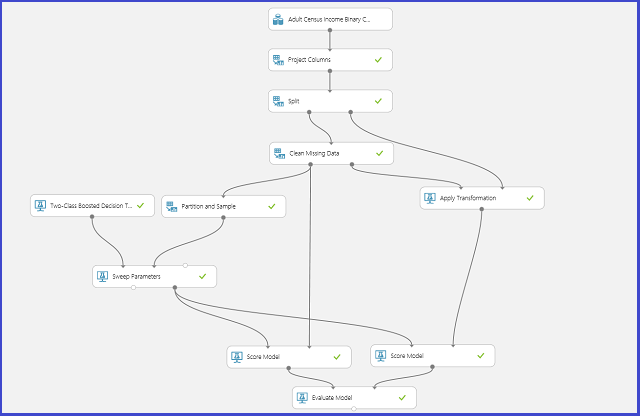

<properties
    pageTitle="Wählen Sie Parameter Optimieren Ihrer Algorithmen Azure Computer interessante | Microsoft Azure"
    description="Erläutert, wie die optimale Parameter für einen Algorithmus Azure Computer interessante festlegen aus."
    services="machine-learning"
    documentationCenter=""
    authors="bradsev"
    manager="jhubbard"
    editor="cgronlun"/>

<tags
    ms.service="machine-learning"
    ms.workload="data-services"
    ms.tgt_pltfrm="na"
    ms.devlang="na"
    ms.topic="article"
    ms.date="09/12/2016"
    ms.author="bradsev" />

# Wählen Sie Parameter die Algorithmen Azure Computer interessante optimieren

In diesem Thema beschrieben, wie Auswählen der richtigen Hyperparameter für einen Algorithmus Azure Computer interessante festlegen. Die meisten Computer Learning Algorithmen müssen Parameter festlegen. Wenn Sie ein Modell Schulen, müssen Sie Werte für diesen Parameter angeben. Der Effizienz des Modells geschultes hängt die Modellparameter, die Sie auswählen. Suchen Sie die optimale Gruppe von Parametern von wird als *Auswahl des Modells*bezeichnet.

[AZURE.INCLUDE [machine-learning-free-trial](../../includes/machine-learning-free-trial.md)]

Es gibt verschiedene Methoden für die Auswahl modellieren, gehen Sie wie folgt vor. Computer interessante, übergreifende Überprüfung ist eine der am häufigsten verwendeten Methoden für die Auswahl des Modells, und es ist die standardmäßige Modell Auswahl Verfahren in Azure Computer lernen. Da Azure maschinellen Learning sowohl R und Python unterstützt, können Sie eigene Auswahl Dokumentmodellmechanismen immer mit R oder Python implementieren.

Es gibt vier Schritte, suchen Sie die optimale Parameter festlegen:

1.  **Definieren der Parameter Speicherplatz**: für den Algorithmus, entscheiden Sie zuerst die genauen Parameterwerte, die Sie berücksichtigen möchten.
2.  **Definieren der übergreifende Überprüfung Einstellungen**: entscheiden, wie übergreifende Überprüfung Falten für das Dataset auswählen.
3.  **Definieren der Metrik**: entscheiden, welche Metrik für die optimale Gruppe von Parametern, z. B. Genauigkeit bestimmen, Stamm Mittel im Quadrat zurück, Genauigkeit, Rückruf oder f-Punktzahl.
4.  **Zug, der ausgewertet werden soll, und Vergleichen von**: übergreifende Überprüfung von durchgeführten ist, und die für jede eindeutige Kombination der Werte für Parameter, basierend auf den Fehler Metrisch Sie definieren. Nach Auswertung und Vergleich können Sie das Modell leistungsfähigsten auswählen.

Die folgende Abbildung zeigt, zeigt, wie dies in Azure maschinellen Learning erzielt werden kann.

## Definieren Sie den Parameter Abstand
Sie können den Parameter, legen Sie das Modell Initialisierungsschritt definieren. Des Bereichs für Parameter aller Computer Learning Algorithmen weist zwei Trainer Modi: *Einzelne Parameter* und *Parameter-Bereich*. Wählen Sie im Bereich Modus aus. Im Bereich Parameter-Modus können Sie mehrere Werte für jeden Parameter eingeben. Sie können durch Trennzeichen getrennte Werte in das Textfeld eingeben.

 Alternativ können Sie die maximalen und minimalen Punkte des Rasters und der Gesamtzahl von Punkten mit der **Verwendung Bereich-Generator**definieren. Standardmäßig werden die Parameterwerte auf einer linearen Skala generiert. Aber wenn **Log Maßstab** aktiviert ist, werden die Werte in den Log Maßstab generiert (d. h., ist das Verhältnis zwischen der angrenzenden Punkte anstelle von ihrer Differenz Konstante). Für ganzzahlige Parameter können Sie einen Bereich mit einem Bindestrich definieren. Beispielsweise "1-10" bedeutet, dass alle ganzen Zahlen zwischen 1 und 10 (beide einschließlich) der Parameter festgelegt bilden. Gemischter Modus wird ebenfalls unterstützt. Legen Sie beispielsweise der Parameter "1-10, 20; 50" zählen ganze Zahlen 1 bis 10, 20, bis 50.

## Übergreifende Überprüfung Falten definieren
[Beispiel und Partition] [ partition-and-sample] Modul kann verwendet werden, um die Daten zufällig Falten zuweisen. Im folgenden Beispiel Konfiguration für das Modul wir fünf Falten definieren und die Stichprobe Instanzen zufällig eine Zahl gefaltete zuweisen.

## Definieren der Metrik
Die [Abstimmung Modell Hyperparameters] [ tune-model-hyperparameters] -Modul für empirisch auswählen den besten Satz von Parametern für einen angegebenen Algorithmus und Dataset unterstützt. Sowie andere Informationen enthält ein Bezug Schulung Modell im Bereich **Eigenschaften** dieses Moduls die Metrik zum Bestimmen der beste Parameter festgelegt ist. Es verfügt über die zwei verschiedenen Dropdown-Listenfeld Feldern für Klassifizierung und Regression Algorithmen. Ist der Algorithmus unter Berücksichtigung eine Einstufung Algorithmus, die Regression Metrik wird ignoriert und umgekehrt. In diesem Beispiel wird die Metrik **Genauigkeit**.   

## Schulen, auswerten und vergleichen  
Die gleichen [Abstimmung Modell Hyperparameters] [ tune-model-hyperparameters] Modul Schulung Alle Modelle, die die Menge der Parameter entsprechen, wertet verschiedene Kennzahlen und erstellt dann optimalen ausgebildeten Modell basierend auf die Metrik, wählen Sie Sie aus. In diesem Modul besteht aus zwei obligatorische Eingaben:

* Den Teilnehmern ungeschulten
* Das dataset

Das Modul gibt es auch eine optionale Dataset Eingabemethoden. Verbinden Sie das Dataset mit gefaltete Informationen mit der Eingabe obligatorisch Dataset ein. Wenn das Dataset keine Informationen gefaltete zugewiesen ist, wird automatisch eine 10-fold übergreifende Überprüfung standardmäßig ausgeführt. Wenn gefaltete Zuordnung nicht abgeschlossen ist, und ein Dataset Überprüfung wird am Anschluss optional Dataset zur Verfügung gestellt, ein Zug-Test-Modus ausgewählt ist, und das erste Dataset wird verwendet, um das Modell für jede Parameterkombination Schulen.

Das Modell wird für die Überprüfung Dataset ausgewertet. Die Links Ausgang des Moduls zeigt unterschiedliche Maße als Funktionen der Parameterwerte ein. Die richtigen Ausgang bietet das ausgebildete Modell, das entspricht zum leistungsfähigsten Modell gemäß der ausgewählten Metrisch (in diesem Fall**Genauigkeit** ).  

Sie können die genauen Parameter mit einer der richtigen Ausgang Visualisierung ausgewählt anzeigen. Dieses Modell kann nach dem Speichern als ausgebildeten Modell in eine Reihe von Test bewerten oder in einem operationalized Webdienst verwendet werden.

<!-- Module References -->
[partition-and-sample]: https://msdn.microsoft.com/library/azure/a8726e34-1b3e-4515-b59a-3e4a475654b8/
[tune-model-hyperparameters]: https://msdn.microsoft.com/library/azure/038d91b6-c2f2-42a1-9215-1f2c20ed1b40/
