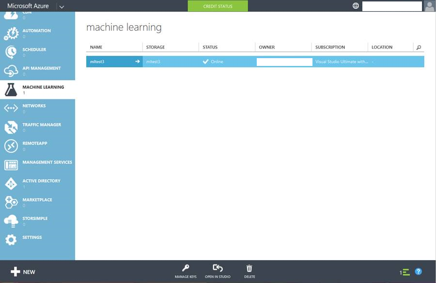
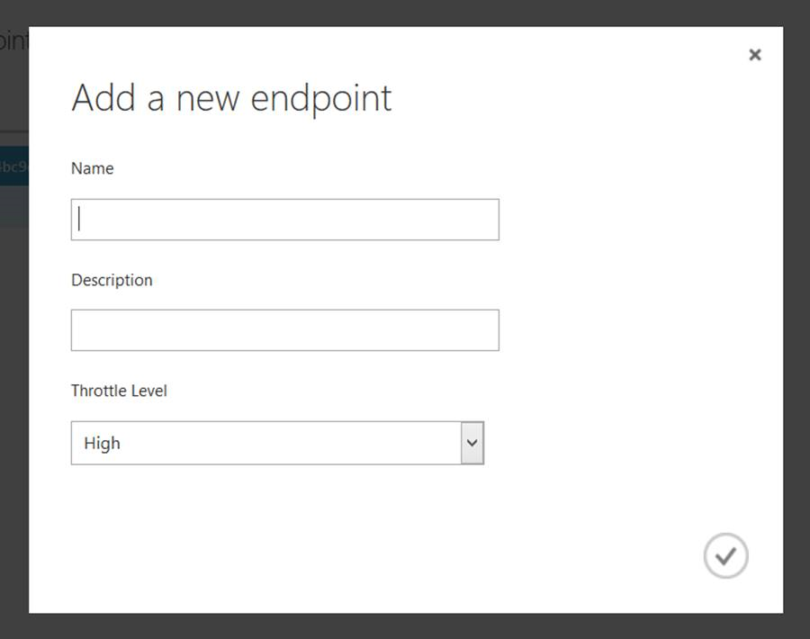

<properties
    pageTitle="Erstellen von Webdienst-Endpunkte Computer interessante | Microsoft Azure"
    description="Erstellen von Webdienst-Endpunkte Azure Computer-Schulung"
    services="machine-learning"
    documentationCenter=""
    authors="hiteshmadan"
    manager="padou"
    editor="cgronlun"/>

<tags
    ms.service="machine-learning"
    ms.devlang="multiple"
    ms.topic="article"
    ms.tgt_pltfrm="na"
    ms.workload="tbd"
    ms.date="10/04/2016"
    ms.author="himad"/>

# Erstellen von Endpunkten

>[AZURE.NOTE] In diesem Thema werden die Techniken zu einem klassischen Webdienst verfügbar.

Wenn Sie Webdienste, die Sie weiterleiten an Ihre Kunden verkaufen erstellen, müssen Sie bieten ausgebildeten Modelle jedem Kunden, die noch zukommen verknüpft sind, aus denen der Webdienst erstellt wurde. Darüber hinaus sollen alle Updates zukommen Selektives einen Endpunkt angewendet werden keine Anpassungen überschrieben.

Um dies zu erreichen, können mit Azure maschinellen Learning mehrere Endpunkte für einen bereitgestellten Webdienst erstellen. Jeder Endpunkt im Webdienst wird unabhängig voneinander berücksichtigt, gedrosselt und verwaltet. Jeder Endpunkt ist eine eindeutige URL und Schlüssel für die Autorisierung, die Sie an Ihre Kunden verteilen können.

[AZURE.INCLUDE [machine-learning-free-trial](../../includes/machine-learning-free-trial.md)]

## Hinzufügen von Endpunkten in einem Webdienst

Es gibt drei Methoden zum Hinzufügen von außen liegenden Tabellenblättern zu einem Webdienst aus.

* Programmgesteuert
* Über das Portal Azure maschinellen Learning-Webdiensten
* Obwohl die klassischen Azure-Portal

Nachdem der Endpunkt erstellt wurde, können Sie es über synchroner APIs, Stapel APIs, nutzen und excel-Arbeitsblättern. Über das Hinzufügen von Endpunkten mithilfe dieser Benutzeroberfläche, können Sie auch den Endpunkt Management-APIs verwenden, programmgesteuert Endpunkte hinzufügen.

 >[AZURE.NOTE] Wenn Sie zusätzliche Endpunkte an den Webdienst hinzugefügt haben, können Sie den standardmäßigen Endpunkt nicht löschen.

## Programmgesteuertes Hinzufügen von außen liegenden Tabellenblättern

Sie können einen Endpunkt der Webdienst programmgesteuert mithilfe des [AddEndpoint](https://github.com/raymondlaghaeian/AML_EndpointMgmt/blob/master/Program.cs) Codes hinzufügen.

## Hinzufügen von außen liegenden Tabellenblättern Verwenden des Portals Azure maschinellen Learning-Webdiensten

1. Klicken Sie in Computer Learning Studio auf die Spalte linken Navigationsbereich auf Webdienste.
2. Klicken Sie am Ende der Web Service-Dashboard **Verwalten Endpunkte**auf. Im Portal Azure maschinellen Learning-Webdiensten öffnet die Endpunkte-Seite für den Webdienst.
3. Klicken Sie auf **neu**.
4. Geben Sie einen Namen und eine Beschreibung für den neuen Endpunkt an. Endpunktnamen müssen 24 Zeichen oder weniger lang sein und darf Kleinbuchstaben Alphabeten oder Zahlen bestehen. Wählen Sie die Protokollierungsebene und gibt an, ob die Beispieldaten aktiviert ist. Weitere Informationen zur Protokollierung finden Sie unter [Aktivieren der Protokollierung für maschinelle Learning-Webdiensten](machine-learning-web-services-logging.md).

## Hinzufügen von außen liegenden Tabellenblättern über das klassische Azure-portal

1. Melden Sie sich bei der [Azure klassischen Portal](http://manage.windowsazure.com), klicken Sie in der linken Spalte auf **Computer Schulung** . Klicken Sie auf den Arbeitsbereich, der den Webdienst enthält, an dem Sie interessiert sind.

    

2. Klicken Sie auf **Webdienste**.

    

3. Klicken Sie auf den Webdienst, dem Sie interessiert, um die Liste der verfügbaren Endpunkte finden Sie unter sind.

    

4. Klicken Sie am unteren Rand der Seite auf **Endpunkt hinzufügen**. Geben Sie einen Namen und eine Beschreibung ein, stellen Sie sicher, dass es werden keine anderen Endpunkte mit demselben Namen in diesem Webdienst. Lassen Sie die Steuerung Ebene mit den Standardwert, es sei denn, Sie jedoch spezielle benötigen. Weitere Informationen zum begrenzungsebene finden Sie unter [Skalieren API Endpunkte](machine-learning-scaling-webservice.md).

    

## Nächste Schritte

[So einen veröffentlichten Azure maschinellen Learning-Webdienst nutzen](machine-learning-consume-web-services.md).
