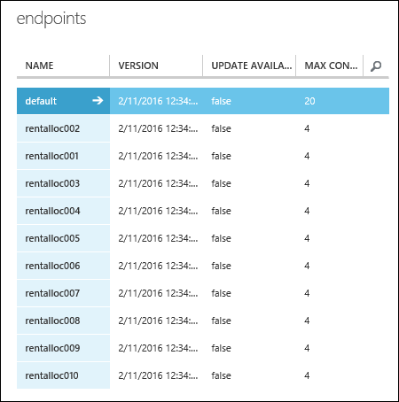

<properties
pageTitle="Erstellen Sie mehrere Modelle aus einem Versuch | Microsoft Azure"
description="Verwenden Sie PowerShell, um mehrere Computer Learning-Modelle und Web-Endpunkte mit denselben Algorithmus, aber andere Schulung Datasets erstellen."
services="machine-learning"
documentationCenter=""
authors="hning86"
manager="jhubbard"
editor="cgronlun"/>

<tags
ms.service="machine-learning"
ms.workload="data-services"
ms.tgt_pltfrm="na"
ms.devlang="na"
ms.topic="article"
ms.date="10/03/2016"
ms.author="garye;haining"/>

# Erstellen Sie viele Computer Learning-Modelle und Web-Endpunkte aus einem Versuch, die mithilfe der PowerShell

Hier ist ein häufig auftretendes Problem der Computer Schulung: viele Modelle zu erstellen, die verfügen über den gleichen Schulung Workflow und den gleichen Algorithmus verwenden, aber andere Schulung Datasets als Eingabe werden soll. In diesem Artikel wird gezeigt, wie bei in Azure maschinellen Learning Studio Aktion mit nur einem einzelnen experimentieren.

Beispielsweise angenommen, dass Sie der Besitzer ein globalen bewältigen kann Miete Franchise am effektivsten sind. Sie möchten ein Regressionsmodell Vorhersagen der Miete und bedarfsgerecht mittels Archiv Ihrer Daten zu erstellen. 1.000 Miete Orte auf der ganzen Welt stehen Ihnen, und Sie haben ein Dataset für jeden wichtigen Features wie Datum, Uhrzeit, Wetter enthält Speicherort sowie Datenverkehr, der an jeder Position spezifisch sind erfasst.

Sie können einmal an allen Standorten mithilfe einer verbundenen Version alle Datasets Modell Schulen. Aber da Ihre Speicherorte eine eindeutige Umgebung verfügen, eine bessere Möglichkeit zum Schulen von Regressionsmodell mit dem Dataset separat für jeden Standort wäre. Auf diese Weise konnte jedes ausgebildeten Modell berücksichtigen anderen Store Größen, Lautstärke, Geography, Population, bewältigen kann geeignete Datenverkehr-Umgebung, *usw.*.

Vielleicht am besten, aber Sie nicht die 1.000 Schulung Versuche Azure Computer interessante mit jeweils einen eindeutigen Speicherort darstellt erstellen möchten. Eine Aufgabe überwältigenden, sondern es ist auch scheint ziemlich nicht effizient, da für jeden Versuch alle dieselbe Komponenten, eine Ausnahme bilden jedoch die Schulung Dataset müssten.

Glücklicherweise können wir dies durch Verwenden der [Azure maschinellen Learning Umschulung API](machine-learning-retrain-models-programmatically.md) und den Vorgang mit [Azure maschinellen Learning PowerShell](machine-learning-powershell-module.md)automatisieren.

> [AZURE.NOTE] Um unserem Beispiel schneller ausgeführt haben, können wir die Anzahl der Speicherorten von 1.000 10 reduzieren. Dieselben Prinzipien und Vorgehensweisen gelten jedoch für 1.000 Speicherorte. Der einzige Unterschied ist, dass die gewünschte Schulen von 1.000 Datasets Sie wahrscheinlich stellen Sie sich die folgenden PowerShell Skripts parallel ausgeführt möchten. Wie das geht ist nicht Gegenstand dieses Artikels, aber finden Sie Beispiele für PowerShell Multi-Thread im Internet.  

## Einrichten des Versuchs Schulung

Wir nun eine [Schulung experimentieren](https://gallery.cortanaintelligence.com/Experiment/Bike-Rental-Training-Experiment-1) Beispiel zu verwenden, die wir bereits in der [Cortana Intelligence Katalog](http://gallery.cortanaintelligence.com)erstellt haben. Öffnen Sie im Arbeitsbereich [Azure maschinellen Learning Studio](https://studio.azureml.net) diesem Versuch ein.

>[AZURE.NOTE] Damit zusammen mit diesem Beispiel eingehalten wird, sollten Sie ein standard-Arbeitsbereich anstelle einer kostenlosen Arbeitsbereich verwenden. Wir zu erstellende einen Endpunkt für jeden Kunden - für insgesamt 10 Endpunkte - und, die wird einen standard-Arbeitsbereich ist erforderlich, da ein kostenloser Arbeitsbereich auf 3 Endpunkte beschränkt ist. Wenn Sie nur einen kostenlosen Arbeitsbereich haben, ändern Sie einfach die Skripts unten, um nur 3 Speicherorte zulässig ist.

Der Versuch verwendet ein Modul **Daten importieren** , um die Schulung Dataset *customer001.csv* von einem Konto Azure-Speicher zu importieren. Angenommen, wir Schulung Datasets alle bewältigen kann Miete Orten gesammelt und diese an derselben Stelle BLOB-Speicher mit Dateinamen von *rentalloc001.csv* bis hin zu *rentalloc10.csv*gespeichert haben.

Beachten Sie, dass ein **Web Service Ausgabe** Modul das Modul **Zug Modell** hinzugefügt wurde.
Bei diesem Versuch als Webdienst bereitgestellt wird, wird der Endpunkt zugeordnet, dass die Ausgabe ausgebildete Modell im Format einer Datei .ilearner zurückgegeben wird.

Beachten Sie auch, dass wir eine Web Service-Parameter für die URL einrichten, die das Modul **Importieren von Daten** verwendet. Dies kann wir den Parameter verwenden, um einzelne Schulung Datasets, um das Modell für jeden Standort Schulen angeben.
Es gibt andere Methoden, die wir, wie einfach über ein **Web Service Eingabe** -Modul in einem Dataset an den Webdienst übergeben oder Abrufen von Daten aus einer SQL Azure-Datenbank mithilfe einer SQL-Abfrage mit einem Web-Service-Parameter hätten.

Nun führen wir diese Schulung experimentieren, verwenden die standardmäßigen Wert *rental001.csv* als Dataset Schulung. Wenn Sie die Ausgabe des Moduls **Auswerten** anzeigen (klicken Sie auf die Ausgabe, und wählen Sie **visualisieren**), können Sie sehen, wir erhalten eine ordentliche Leistung von *AUC* = 0.91. An diesem Punkt sind wir zum Bereitstellen von eines Webdiensts aus diesem Versuch Schulung bereit.

## Bereitstellen der Ausbildung und bewerten Webdienste

Um den Webdienst Schulung bereitstellen möchten, klicken Sie auf die Schaltfläche **Web-Dienst** unter den Zeichenbereich experimentieren, und wählen Sie **Webdienst bereitstellen**. Rufen Sie diesen Webdienst "" bewältigen kann Miete Schulung".

Jetzt müssen wir den Punktzahl Webdienst bereitgestellt werden.
Hierzu können wir klicken Sie auf **Web-Dienst** unter den Zeichenbereich und **Vorhersage Webdienst**auswählen. Dies erstellt einen Punktzahl experimentieren.
Wir müssen ein paar Nebenversionen ändern zu vereinfachen als Webdienst, wie etwa die Bezeichnung Spalte "Cnt" Entfernen aus der eingegebenen Daten arbeiten möchten, und beschränken die Ausgabe nur die Instanz-Id und das entsprechende regressionsgleichung Wert.

Wenn Sie sich, dass die Arbeit speichern, können Sie einfach [Vorhersage experimentieren](https://gallery.cortanaintelligence.com/Experiment/Bike-Rental-Predicative-Experiment-1) im Katalog öffnen, die bereits vorbereitet ist.

Um den Webdienst bereitzustellen, führen Sie die Vorhersage experimentieren und dann klicken Sie auf die Schaltfläche **Webdienst bereitstellen** unter den Zeichenbereich. Benennen Sie den Punktzahl Webdienst "Miete bewerten bewältigen kann" ".

## Erstellen von 10 identischen Webdienst-Endpunkte mit PowerShell

Dieser Webdienst verfügt über ein Standardendpunkt. Aber wir sind nicht als den standardmäßigen Endpunkt interessiert, da sie nicht aktualisiert werden kann. Müssen wir werden 10 zusätzliche Endpunkte, für jeden Standort erstellt. Wir werden mit PowerShell ausführen.

Richten Sie zuerst wir unsere PowerShell-Umgebung:

    Import-Module .\AzureMLPS.dll
    # Assume the default configuration file exists and is properly set to point to the valid Workspace.
    $scoringSvc = Get-AmlWebService | where Name -eq 'Bike Rental Scoring'
    $trainingSvc = Get-AmlWebService | where Name -eq 'Bike Rental Training'

Führen Sie dann den folgenden PowerShell-Befehl aus:

    # Create 10 endpoints on the scoring web service.
    For ($i = 1; $i -le 10; $i++){
        $seq = $i.ToString().PadLeft(3, '0');
        $endpointName = 'rentalloc' + $seq;
        Write-Host ('adding endpoint ' + $endpointName + '...')
        Add-AmlWebServiceEndpoint -WebServiceId $scoringSvc.Id -EndpointName $endpointName -Description $endpointName     
    }

Jetzt haben wir 10 Endpunkte erstellt und enthalten das gleiche ausgebildete Modell auf *customer001.csv*gelernt. Sie können diese im Verwaltungsportal Azure anzeigen.

## Aktualisieren Sie die Endpunkte um separate Schulung Datasets mithilfe der PowerShell verwenden

Im nächsten Schritt wird die Endpunkte mit Modelle eindeutig auf jede einzelne Kundendaten gelernt aktualisieren. Jedoch zuerst müssen wir diese Modelle aus dem Webdienst **Bewältigen kann Miete Schulung** zu erzeugen. Wechseln Sie lassen Sie uns wieder zum Webdienst **Bewältigen kann Miete Schulung** . Müssen wir Endpunkts l 10 Mal mit 10 verschiedenen Schulung Datasets anrufen, um 10 verschiedene Modelle zu erzeugen. Wir verwenden das **InovkeAmlWebServiceBESEndpoint** PowerShell-Cmdlet Aktion.

Sie müssen außerdem für die Anmeldeinformationen für Ihr Konto des Blob-Speicher in `$configContent`, nämlich, in die Felder `AccountName`, `AccountKey` und `RelativeLocation`. Die `AccountName` kann eine mit den Namen Ihrer Firma, wie in der **Klassischen Azure-Verwaltungsportal** (Registerkarte "*Speicher* ") zu sehen. Nachdem Sie auf einem Speicherkonto, klicken Sie auf deren `AccountKey` , indem Sie die Schaltfläche **Verwalten Zugriffstasten** unten, und kopieren die *Access-Primärschlüssel*gefunden werden können. Die `RelativeLocation` ist der Pfad relativ zu Ihrem Storage Stelle, an der ein neues Modell gespeichert werden soll. Beispielsweise den Pfad `hai/retrain/bike_rental/` in das folgende Punkte zu einem Container mit dem Namen Skript `hai`, und `/retrain/bike_rental/` Unterordner sind. Derzeit können keine Unterordner über das Portal Benutzeroberfläche erstellt, aber es gibt [Mehrere Azure-Speicher Explorern](../storage/storage-explorers.md) , mit denen Sie dies tun können. Es wird empfohlen, dass Sie einen neuen Container in Ihrer zur Speicherung von den neuen ausgebildeten Modellen (.ilearner-Dateien) wie folgt erstellen: Klicken Sie auf Ihrer Speicherplatzseite, klicken Sie auf die Schaltfläche **Hinzufügen** , klicken Sie unten auf, und nennen Sie es `retrain`. Die erforderlichen Änderungen an das Skript unten im Überblick beziehen sich auf `AccountName`, `AccountKey` und `RelativeLocation` (:`"retrain/model' + $seq + '.ilearner"`).

    # Invoke the retraining API 10 times
    # This is the default (and the only) endpoint on the training web service
    $trainingSvcEp = (Get-AmlWebServiceEndpoint -WebServiceId $trainingSvc.Id)[0];
    $submitJobRequestUrl = $trainingSvcEp.ApiLocation + '/jobs?api-version=2.0';
    $apiKey = $trainingSvcEp.PrimaryKey;
    For ($i = 1; $i -le 10; $i++){
        $seq = $i.ToString().PadLeft(3, '0');
        $inputFileName = 'https://bostonmtc.blob.core.windows.net/hai/retrain/bike_rental/BikeRental' + $seq + '.csv';
        $configContent = '{ "GlobalParameters": { "URI": "' + $inputFileName + '" }, "Outputs": { "output1": { "ConnectionString": "DefaultEndpointsProtocol=https;AccountName=<myaccount>;AccountKey=<mykey>", "RelativeLocation": "hai/retrain/bike_rental/model' + $seq + '.ilearner" } } }';
        Write-Host ('training regression model on ' + $inputFileName + ' for rental location ' + $seq + '...');
        Invoke-AmlWebServiceBESEndpoint -JobConfigString $configContent -SubmitJobRequestUrl $submitJobRequestUrl -ApiKey $apiKey
    }

>[AZURE.NOTE] Der Endpunkt l ist der einzige unterstützte Modus für diesen Vorgang. RRS kann nicht für die Erstellung von ausgebildeten Modelle verwendet werden.

Wie Sie obigen sehen können, statt bauen 10 verschiedene l Auftrag Konfiguration Json-Dateien, erstellen Sie stattdessen die Zeichenfolge Config wir dynamisch, und leiten ihn an den Parameter *JobConfigString* des Cmdlets **InvokeAmlWebServceBESEndpoint** , da Sie wirklich brauchen keine Kopie auf dem Datenträger behalten nicht vorhanden ist.

Wenn alles gut geht, sollte nach einer Weile 10 .ilearner-Dateien aus *model001.ilearner* zu *model010.ilearner*, in Ihrem Konto Azure-Speicher angezeigt werden. Nun können wir unsere 10 Punktzahl Webdienst-Endpunkte mit dieser Modelle mithilfe des **Patch AmlWebServiceEndpoint** PowerShell-Cmdlets zu aktualisieren. Beachten Sie erneut, dass wir nur die Endpunkte nicht standardmäßige patch können wir programmgesteuert zuvor erstellten.

    # Patch the 10 endpoints with respective .ilearner models
    $baseLoc = 'http://bostonmtc.blob.core.windows.net/'
    $sasToken = '<my_blob_sas_token>'
    For ($i = 1; $i -le 10; $i++){
        $seq = $i.ToString().PadLeft(3, '0');
        $endpointName = 'rentalloc' + $seq;
        $relativeLoc = 'hai/retrain/bike_rental/model' + $seq + '.ilearner';
        Write-Host ('Patching endpoint ' + $endpointName + '...');
        Patch-AmlWebServiceEndpoint -WebServiceId $scoringSvc.Id -EndpointName $endpointName -ResourceName 'Bike Rental [trained model]' -BaseLocation $baseLoc -RelativeLocation $relativeLoc -SasBlobToken $sasToken
    }

Dies sollte relativ schnell ausgeführt. Klicken Sie nach Abschluss die Ausführung wird wir 10 Vorhersage Webdienst-Endpunkte mit jeweils einer ausgebildeten Modell eindeutig auf bestimmte Dataset an einem Speicherort vermieten, benötigen Sie nur ein einzelnes Schulung experimentieren gelernt erfolgreich erstellt. Um dies zu überprüfen, versuchen Sie diese Endpunkte mithilfe des Cmdlets **InvokeAmlWebServiceRRSEndpoint** aufrufen ihnen die gleichen Eingabedaten zur Verfügung zu stellen, und Sie erwarten, unterschiedliche Vorhersageergebnisse angezeigt werden, da die Modelle mit anderen Schulung gelernt werden.

## Vollständige PowerShell-Skript

So sieht die Auflistung des vollständigen Quellcodes aus:

    Import-Module .\AzureMLPS.dll
    # Assume the default configuration file exists and properly set to point to the valid workspace.
    $scoringSvc = Get-AmlWebService | where Name -eq 'Bike Rental Scoring'
    $trainingSvc = Get-AmlWebService | where Name -eq 'Bike Rental Training'

    # Create 10 endpoints on the scoring web service
    For ($i = 1; $i -le 10; $i++){
        $seq = $i.ToString().PadLeft(3, '0');
        $endpointName = 'rentalloc' + $seq;
        Write-Host ('adding endpoint ' + $endpontName + '...')
        Add-AmlWebServiceEndpoint -WebServiceId $scoringSvc.Id -EndpointName $endpointName -Description $endpointName     
    }

    # Invoke the retraining API 10 times to produce 10 regression models in .ilearner format
    $trainingSvcEp = (Get-AmlWebServiceEndpoint -WebServiceId $trainingSvc.Id)[0];
    $submitJobRequestUrl = $trainingSvcEp.ApiLocation + '/jobs?api-version=2.0';
    $apiKey = $trainingSvcEp.PrimaryKey;
    For ($i = 1; $i -le 10; $i++){
        $seq = $i.ToString().PadLeft(3, '0');
        $inputFileName = 'https://bostonmtc.blob.core.windows.net/hai/retrain/bike_rental/BikeRental' + $seq + '.csv';
        $configContent = '{ "GlobalParameters": { "URI": "' + $inputFileName + '" }, "Outputs": { "output1": { "ConnectionString": "DefaultEndpointsProtocol=https;AccountName=<myaccount>;AccountKey=<mykey>", "RelativeLocation": "hai/retrain/bike_rental/model' + $seq + '.ilearner" } } }';
        Write-Host ('training regression model on ' + $inputFileName + ' for rental location ' + $seq + '...');
        Invoke-AmlWebServiceBESEndpoint -JobConfigString $configContent -SubmitJobRequestUrl $submitJobRequestUrl -ApiKey $apiKey
    }

    # Patch the 10 endpoints with respective .ilearner models
    $baseLoc = 'http://bostonmtc.blob.core.windows.net/'
    $sasToken = '?test'
    For ($i = 1; $i -le 10; $i++){
        $seq = $i.ToString().PadLeft(3, '0');
        $endpointName = 'rentalloc' + $seq;
        $relativeLoc = 'hai/retrain/bike_rental/model' + $seq + '.ilearner';
        Write-Host ('Patching endpoint ' + $endpointName + '...');
        Patch-AmlWebServiceEndpoint -WebServiceId $scoringSvc.Id -EndpointName $endpointName -ResourceName 'Bike Rental [trained model]' -BaseLocation $baseLoc -RelativeLocation $relativeLoc -SasBlobToken $sasToken
    }
