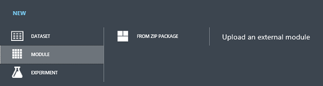

<properties 
    pageTitle="Verfassen Sie benutzerdefinierte R Module Azure-Computern interessante | Microsoft Azure" 
    description="Schnellstart für benutzerdefinierte R Module Azure Computer interessante Texterstellung." 
    services="machine-learning" 
    documentationCenter="" 
    authors="bradsev"  
    manager="jhubbard" 
    editor="cgronlun" />

<tags 
    ms.service="machine-learning" 
    ms.devlang="na" 
    ms.topic="article" 
    ms.tgt_pltfrm="na" 
    ms.workload="tbd" 
    ms.date="08/19/2016" 
    ms.author="bradsev;ankarloff" />

# Autor benutzerdefinierte R Module in Azure Computer lernen

In diesem Thema beschreibt das Erstellen und Bereitstellen eines benutzerdefinierten R Moduls Azure Computer interessante. Es wird erläutert, was benutzerdefinierte R Module sind und welche Dateien verwendet werden, um sie zu definieren. Es veranschaulicht, wie die Dateien zu erstellen, die ein Modul definieren und wie Sie das Modul für die Bereitstellung in einem Arbeitsbereich maschinellen Schulung registrieren. Die Elemente und Attribute in der Definition des benutzerdefinierten Moduls verwendet werden dann ausführlicher beschrieben. Verwenden von zusätzlichen Funktionen und Dateien und mehrere Ausgaben wird auch erläutert. 

[AZURE.INCLUDE [machine-learning-free-trial](../../includes/machine-learning-free-trial.md)]

## Was ist ein benutzerdefiniertes R Modul?

Ein **benutzerdefiniertes Modul** ist ein benutzerdefiniertes Modul, das dem Arbeitsbereich geladen und als Teil einer Azure maschinellen Learning experimentieren ausgeführt werden kann. Ein **benutzerdefiniertes R Modul** ist ein benutzerdefiniertes Modul, das eine benutzerdefinierte R-Funktion ausgeführt wird. **R** ist eine Programmiersprache für statistische computing und Grafiken, die Streuung von Statistiker und Daten Wissenschaftler für die Implementierung von Algorithmen verwendet werden. R ist derzeit die einzige Sprache unterstützt benutzerdefinierte Module, aber Unterstützung für zusätzliche Sprachen für zukünftige Versionen geplant ist.

Benutzerdefinierte Module haben **herausragende Status** Azure Computer interessante, d. h., sie genau wie einem beliebigen anderen Modul verwendet werden können. Sie können mit anderen Modulen, die in veröffentlichten Versuche oder in Visualisierungen enthalten ausgeführt werden. Sie können steuern, den Algorithmus durch das Modul, die Eingabe und Ausgangsports verwendet werden, die Parameter Modellierung und andere Laufzeit Verhaltensweisen implementiert. Ein Versuch, die benutzerdefinierte Module enthält kann auch in der Cortana Intelligence-Katalog für die einfache Freigabe veröffentlicht werden.

## Dateien in einem benutzerdefinierten R-Modul

Durch eine ZIP-Datei, die mindestens zwei Dateien enthält, ist ein benutzerdefiniertes R Modul definiert:

* Eine **Quelldatei** , die vom Modul R-Funktion implementiert
* Eine **XML-Datei** , die beschreibt die benutzerdefinierten Modul-Benutzeroberfläche

Weitere Hilfsdateien können auch in der ZIP-Datei aufgenommen werden, die Funktionen bereitstellt, die von der benutzerdefinierten Modul zugegriffen werden kann. Diese Option wird im Abschnitt "Daten" **in der Formulardefinitionsdatei XML-Elemente** im Schnellstart-Beispiel folgen Teil **Argumente** erläutert.

## Schnellstart-Beispiel: definieren, Verpacken und registriert ein benutzerdefiniertes R-Modul

In diesem Beispiel wird veranschaulicht, wie erstellen, indem Sie ein benutzerdefiniertes R Modul erforderlichen Dateien, Verpacken diese in einer Zip-Datei, und klicken Sie dann das Modul registrieren, in dem Computer Learning-Arbeitsbereich. Die Beispieldateien Zip-Paket und Beispiel können aus [Datei herunterladen CustomAddRows.zip](http://go.microsoft.com/fwlink/?LinkID=524916&clcid=0x409)heruntergeladen werden.

## Die Quelldatei
Betrachten Sie das Beispiel eines Moduls **Benutzerdefinierte Hinzufügen von Zeilen** , die ändert die standardmäßige Implementierung des Moduls **Zeilen hinzufügen** zum Verketten von Zeilen (Beobachtungen) aus zwei Datasets (Frames Daten) verwendet werden soll. Das **Hinzufügen von Zeilen** Standardmodul fügt die Zeilen des zweiten Eingabewerte Datasets an das Ende des ersten Eingabe-Dataset mithilfe der `rbind` Algorithmus. Die angepasste `CustomAddRows` (Funktion) auf ähnliche Weise akzeptiert zwei Datasets, aber auch als zusätzliche Eingabe boolesche austauschen Parameter akzeptiert. Wenn der Parameter austauschen auf **FALSE**festgelegt ist, wird dieselbe Datenmenge als standard-Implementierung zurückgegeben. Wenn der Parameter austauschen **TRUE**ist, die Funktion hängt jedoch Zeilen der ersten Eingabe-Dataset an das Ende der zweites Dataset stattdessen. Die CustomAddRows.R-Datei, die die Implementierung der R enthält `CustomAddRows` Funktion vom Modul **Benutzerdefinierte Hinzufügen von Zeilen** weist den folgenden Code R.

    CustomAddRows <- function(dataset1, dataset2, swap=FALSE) 
    {
        if (swap)
        {
            return (rbind(dataset2, dataset1));
        }
        else
        {
            return (rbind(dataset1, dataset2));
        } 
    } 

### Die XML-Definition-Datei
Um dies verfügbar zu machen `CustomAddRows` Funktion als Modul Azure maschinellen Learning, einer XML-Datei erstellt werden muss, um anzugeben, wie das **Benutzerdefinierte hinzufügen Zeilen** Modul Aussehen und Verhalten soll. 

    <!-- Defined a module using an R Script -->
    <Module name="Custom Add Rows">
        <Owner>Microsoft Corporation</Owner>
        <Description>Appends one dataset to another. Dataset 2 is concatenated to Dataset 1 when Swap is FALSE, and vice versa when Swap is TRUE.</Description>
    
    <!-- Specify the base language, script file and R function to use for this module. -->      
        <Language name="R" 
         sourceFile="CustomAddRows.R" 
         entryPoint="CustomAddRows" />  
        
    <!-- Define module input and output ports -->
    <!-- Note: The values of the id attributes in the Input and Arg elements must match the parameter names in the R Function CustomAddRows defined in CustomAddRows.R. -->
        <Ports>
            <Input id="dataset1" name="Dataset 1" type="DataTable">
                <Description>First input dataset</Description>
            </Input>
            <Input id="dataset2" name="Dataset 2" type="DataTable">
                <Description>Second input dataset</Description>
            </Input>
            <Output id="dataset" name="Dataset" type="DataTable">
                <Description>The combined dataset</Description>
            </Output>
        </Ports>
        
    <!-- Define module parameters -->
        <Arguments>
            <Arg id="swap" name="Swap" type="bool" >
                <Description>Swap input datasets.</Description>
            </Arg>
        </Arguments>
    </Module>

 
Es ist entscheidend, beachten Sie, dass der Wert der **Id** -Attribute der **Eingabe-** und **Argument** Elemente in der XML-Datei die Funktion Parameternamen R-Code in der Datei CustomAddRows.R genau entsprechen muss: (*dataset1*, *Datensatz2*und *austauschen* im Beispiel). Auf ähnliche Weise der Wert für das Attribut **Einstiegspunkt** des Elements **Sprache** muss den Namen der Funktion in das Skript R EXAKT übereinstimmen: (im Beispiel*CustomAddRows* ). 

Das **Id** -Attribut für die **Ausgabe** Element entsprechen hingegen keine Variablen in das Skript R. Wenn mehrere Ausgaben benötigt werden, einfach Zurückgeben einer Liste von der Funktion R mit Ergebnissen platziert *in derselben Reihenfolge* wie **Ausgaben** Elemente in der XML-Datei deklariert sind.

### Packen und das Modul registrieren
Speichern Sie diese beiden Dateien als *CustomAddRows.R* und *CustomAddRows.xml* und Packen Sie die beiden Dateien zusammen in einer Datei *CustomAddRows.zip* .

Um diese auf dem Computer Learning-Arbeitsbereich registrieren, wechseln Sie zu dem Arbeitsbereich in den Computer Learning Studio, klicken Sie auf die Schaltfläche **+ neu** an den Fuß, und wählen Sie das neue **Benutzerdefinierte hinzufügen Zeilen** Modul hochladen **Modul -> von ZIP-Paket** aus.

Das **Benutzerdefinierte hinzufügen Zeilen** Modul kann nun von Ihrem Computer Learning Versuche zugegriffen werden.

## Elemente in der XML-Formulardefinitionsdatei

### Modul Elemente
**Module** -Element wird zum Definieren eines benutzerdefinierten Moduls in der XML-Datei. Mehrere Module können in eine XML-Datei mehrere **Modul** Elemente definiert werden. Jedem Modul, in dem Arbeitsbereich muss einen eindeutigen Namen haben. Registrieren ein benutzerdefiniertes Modul mit demselben Namen wie eine vorhandene benutzerdefinierte Modul, und das vorhandene Modul durch den neuen ersetzt. Benutzerdefinierte Module können, allerdings werden mit demselben Namen wie ein vorhandenes Azure maschinellen Learning-Modul registriert. Wenn dies der Fall ist, werden sie in der Kategorie **Benutzerdefiniert** im Modul Palette angezeigt.

    <Module name="Custom Add Rows" isDeterministic="false"> 
        <Owner>Microsoft Corporation</Owner>
        <Description>Appends one dataset to another...</Description>/> 

Innerhalb des Elements **Modul** können Sie zwei zusätzliche optionale Elemente angeben:

- ein **Besitzer** -Element, das in das Modul eingebettet ist  
- ein Element der **Beschreibung** , die Text enthält, die in der Symbolleiste Hilfe für das Modul, und wenn Sie auf das Modul, in der Computer-Learning-Benutzeroberfläche zeigen angezeigt wird.

Regeln für Zeichen Grenzwerte in die Modul Elemente:

* Der Wert der **Name** -Attribut im **Module** -Element darf 64 Zeichen nicht überschreiten. 
* Der Inhalt des Elements **Beschreibung** muss 128 Zeichen nicht überschreiten.
* Der Inhalt des Elements **Besitzer** darf 32 Zeichen nicht überschreiten.

Ein Modul Ergebnisse können deterministisch oder nondeterministic.* * standardmäßig, alle Module werden als deterministisch sein. D. h., sollte einen unveränderlichen Satz von Eingabeparameter und Daten, das Modul zurück die gleichen Ergebnisse EacRAND oder einer Functionh Mal ausgeführt wird. Dieses Verhalten, Azure maschinellen Learning Studio führt nur deterministisch, wenn Parameter markiert Module erneut aus oder die Eingabedaten hat sich geändert. Zwischengespeicherte Ergebnisse zurückgeben enthält auch viel schnellere Ausführung von Versuche aus.

Es gibt Funktionen sind nicht deterministisch, z. B. RAND oder einer Funktion, die das aktuelle Datum oder Uhrzeit zurückgibt, in denen ein. Wenn Ihr Modul eine nicht deterministische Funktion verwendet, können Sie angeben, dass das Modul nicht deterministisch ist, indem Sie das Attribut optional **IsDeterministic** auf **FALSE**festlegen. So wird sichergestellt, dass das Modul erneut ausgeführt wird, wenn der Versuch ausgeführt wird, selbst wenn das Modul Eingabemethoden und Parameter nicht geändert wurden. 

### Definition Language
Das Element **Sprache** in der XML-Definition-Datei wird verwendet, die benutzerdefinierte Modul Sprache angeben. R ist derzeit die einzige unterstützte Sprache. Der Wert für das Attribut **Quelldatei** muss es sich um den Namen der Datei R sein, enthält die Funktion aufrufen, wenn das Modul ausgeführt wird. Diese Datei muss ein Teil des Zip-Pakets. Der Wert für das Attribut **Einstiegspunkt** ist der Name der Funktion aufgerufen wird und muss eine gültige Funktion mit definiert, in der Quelldatei übereinstimmen.

    <Language name="R" sourceFile="CustomAddRows.R" entryPoint="CustomAddRows" />

### Ports
Die Eingabe- und Ports für ein benutzerdefiniertes Modul werden in untergeordneten Elementen des Abschnitts **Ports** der XML-Datei angegeben. Die Reihenfolge der folgenden Elemente bestimmt das Layout erfahrene (UX) von Benutzern. Die erste untergeordnete **Eingabe-** oder **Ausgabe** aufgeführt, die das Element **Ports** der XML-Datei wird der am weitesten links Eingang in Computer Learning berücksichtigen
Jede Eingabe, und Ausgang möglicherweise müssen Sie ein optionales **Beschreibung** untergeordnetes Element, das angibt, den Text, der angezeigt wird, wenn Sie den Mauszeiger auf den Port in der Computer-Learning-Benutzeroberfläche zeigen.

**Regeln für die Ports**:

* Maximale Anzahl von **Eingabe- und Ports** ist 8 für jede.

### Eingabe Elemente
Eingabe-Ports können Sie Daten zu Ihren R (Funktion) und dem Arbeitsbereich zu übergeben. Die **Datentypen** , die unterstützt werden, für die Eingabewerte Ports sind, wie folgt: 

**Datentabelle:** Dieses Typs wird als eine data.frame zu Ihrer R-Funktion übergeben. Tatsächlich werden alle Typen (z. B. CSV-Dateien oder ARFF-Dateien), die vom Computer Learning unterstützt werden und, mit **Datentabelle** kompatibel sind, in einem data.frame automatisch konvertiert. 

        <Input id="dataset1" name="Input 1" type="DataTable" isOptional="false">
            <Description>Input Dataset 1</Description>
        </Input>

Das **ID-** Attribut jedes **Datentabelle** Eingabewerte Anschluss zugeordnete muss einen eindeutigen Wert und dieser Wert muss zugehörigen benannten Parameter in der Funktion R entsprechen.
Optionale **Datentabelle** Ports, die nicht übergeben werden, während der Eingabe in einem Versuch haben den Wert für die Funktion R **NULL** übergeben, und optional Zip-Ports werden ignoriert, wenn die Eingabe nicht verbunden ist. **IsOptional** -Attribut ist optional für die Typen **Datentabelle** und **packen** und Standardwert ist *falsch* .
       
**Packen:** Benutzerdefinierte Module können eine Zip-Datei als Eingabe übernehmen. Diese Eingabe wird in Ihrer Funktion Verzeichnis arbeiten R entpackt.

        <Input id="zippedData" name="Zip Input" type="Zip" IsOptional="false">
            <Description>Zip files to be extracted to the R working directory.</Description>
        </Input>

Für benutzerdefinierte R Module muss die Id für einen Zip-Port keine Parameter der Funktion R entsprechen. Dies ist, da die Zip-Datei automatisch in R Arbeitsverzeichnis extrahiert.

**Von Regeln:**

* Der Wert, der das **Id** -Attribut des Elements **Eingabe** muss ein gültiger Variablenname R.
* Der Wert, der das **Id** -Attribut des Elements **Eingabe** muss nicht mehr als 64 Zeichen.
* Der Wert der **Name** -Attribut des Elements **Eingabe** muss nicht mehr als 64 Zeichen.
* Der Inhalt des Elements **Beschreibung** darf nicht mehr als 128 Zeichen enthalten.
* Der Wert für das Attribut **Typ** des Elements **Eingabe** muss *Zip* oder *Datentabelle*.
* Der Wert der **IsOptional** -Attribut des Elements **Eingabe** ist nicht erforderlich (und ist *falsch* standardmäßig Wenn nicht angegeben). aber wenn sie angegeben wird, muss es *true* oder *false*.

### Die Ausgabeelemente

**Standard ausgeben Ports:** Die Rückgabewerte werden Ausgangsports von der Funktion R zugeordnet dann durch nachfolgende Module verwendet werden können. *Datentabelle* ist, der nur standardmäßige Ausgabe Port ein, die derzeit unterstützt wird. (Unterstützung für *Teilnehmern* und *transformiert* wird demnächst.) Die Ausgabe einer *Datentabelle* ist wie folgt definiert:

    <Output id="dataset" name="Dataset" type="DataTable">
        <Description>Combined dataset</Description>
    </Output>

Für Ausgaben in benutzerdefinierten R Module der Wert für das **ID-** Attribut muss nicht mit in das Skript R nichts entsprechen muss eindeutig sein. Für die Ausgabe eines einzelnen Modul muss der Rückgabewert der Funktion R eine *data.frame*aus. Um mehr als ein einziges Objekt, der einen unterstützten Datentyp ausgeben, müssen die entsprechenden Ausgangsports in der XML-Formulardefinitionsdatei angegeben werden, und die Objekte in einer Liste zurückgegeben werden müssen. Die Ausgabe Objekte sind Ausgabe-Ports von links nach rechts, über die Reihenfolge, in der die Objekte in der Liste zurückgegebenen platziert werden, die entsprechenden zugewiesen.

Beispielsweise, wenn Sie das **Benutzerdefinierte hinzufügen Zeilen** -Modul, um die ursprüngliche zwei Datasets ausgeben ändern möchten, *dataset1* und *Datensatz2*zusätzlich zu den neuen verknüpft Dataset, *Dataset*, (in Ordnung, von links nach rechts, als: *Datasets*, *dataset1*, *Datensatz2*), definieren Sie dann die Ausgangsports in der Datei CustomAddRows.xml wie folgt:

    <Ports> 
        <Output id="dataset" name="Dataset Out" type="DataTable"> 
            <Description>New Dataset</Description> 
        </Output> 
        <Output id="dataset1_out" name="Dataset 1 Out" type="DataTable"> 
            <Description>First Dataset</Description> 
        </Output> 
        <Output id="dataset2_out" name="Dataset 2 Out" type="DataTable"> 
            <Description>Second Dataset</Description> 
        </Output> 
        <Input id="dataset1" name="Dataset 1" type="DataTable"> 
            <Description>First Input Table</Description>
        </Input> 
        <Input id="dataset2" name="Dataset 2" type="DataTable"> 
            <Description>Second Input Table</Description> 
        </Input> 
    </Ports> 

Und geben Sie die Liste der Objekte in einer Liste in der richtigen Reihenfolge in 'CustomAddRows.R' zurück:

    CustomAddRows <- function(dataset1, dataset2, swap=FALSE) { 
        if (swap) { dataset <- rbind(dataset2, dataset1)) } 
        else { dataset <- rbind(dataset1, dataset2)) 
        } 
    return (list(dataset, dataset1, dataset2)) 
    } 
    
**Visualisierung Ausgabe:** Sie können auch eine Ausgang vom Typ *Visualisierung*angeben, die die Ausgabe vom Gerät R Grafiken und Ausgabe in der Konsole angezeigt. Dieser Port ist nicht Teil der Ausgabe R (Funktion) und nicht von der Reihenfolge der Ausgabe Port Typen beeinträchtigen. Um eine Visualisierung Port benutzerdefinierte Module hinzufügen, fügen Sie ein Element der **Ausgabe** mit einem Wert *Visualisierung* für dessen **Type** -Attribut hinzu:

    <Output id="deviceOutput" name="View Port" type="Visualization">
      <Description>View the R console graphics device output.</Description>
    </Output>
    
**Die Ausgabe Regeln:**

* Der Wert, der das **Id** -Attribut des Elements **Ausgabe** muss ein gültiger Variablenname R.
* Der Wert, der das **Id** -Attribut des Elements **Ausgabe** muss nicht mehr als 32 Zeichen.
* Der Wert für das Attribut **Name** des Elements **Ausgabe** darf nicht mehr als 64 Zeichen sein.
* Der Wert für das Attribut **Typ** des Elements **Ausgabe** muss *Visualisierung*.

### Argumente auf:
Weitere Daten können über Parameter für das Modul für die Funktion R übergeben werden die im **Argumente** -Element definiert sind. Diese Parameter in ganz rechts Eigenschaftenbereich der Computer Learning-Benutzeroberfläche angezeigt, wenn das Modul ausgewählt ist. Argumente können der unterstützten Typen verwendet werden, oder Sie können eine benutzerdefinierte Enumeration bei Bedarf erstellen. Ähnlich wie die Elemente **Ports** , kann **Argumente** Elemente ein optionales **Beschreibung** Element verfügen, das angibt, den Text, der angezeigt wird, wenn Sie den Mauszeiger auf den Namen des Parameters zeigen.
Optionale Eigenschaften für ein Modul, z. B. Standardwert, MinValue und MaxValue können eines der Argumente als Attribute auf ein Element **Eigenschaften** hinzugefügt werden. Gültige Eigenschaften für das Element **Eigenschaften** hängen vom Argumenttyp und mit den unterstützten Argumenttypen im nächsten Abschnitt beschrieben. Den Benutzer einen Wert eingeben erforderlich Argumente mit der Eigenschaft **IsOptional** als **"Wahr"** nicht. Wenn Sie ein Wert für das Argument nicht vorhanden ist, wird das Argument nicht für die Eingabe-Punkt-Funktion übergeben. Als Argumente der Funktion Punkt Eintrag optional explizit von der Funktion, z. B. einen Standardwert NULL in die Definition der Eintrag Punkt zugewiesen behandelt werden müssen. Ein optionales Argument erzwingt nur andere Argument Bedingung, d. h. min oder Max, wenn der Wert vom Benutzer bereitgestellt wird.
Wie bei Eingaben und Ausgaben, ist es entscheidend, dass jeder der Parameter eindeutige Id-Werte, die ihnen zugeordneten haben. In diesem Schnellstart-Beispiel wurde der zugeordnete-Id-Parameter *austauschen*.

### Argument element
Das **Argument** untergeordnetes Element des Abschnitts **Argumente** der XML-Datei mit ein Modul Parameter definiert. Als definiert mit den untergeordneten Elementen im Abschnitt **Ports** die Reihenfolge der Parameter im Abschnitt **Argumente** das Layout in berücksichtigen festgestellt Die Parameter werden von oben nach unten in der Benutzeroberfläche in der gleichen Reihenfolge, in der die XML-Datei definiert sind. Hier werden die Arten von maschinellen Learning für Parameter unterstützt aufgelistet. 

**Int** – eine ganze Zahl (32-Bit) Typparameter.

    <Arg id="intValue1" name="Int Param" type="int">
        <Properties min="0" max="100" default="0" />
        <Description>Integer Parameter</Description>
    </Arg>

* *Optionale Eigenschaften*: **min**, **max**, **Standard-** und **IsOptional**

**doppelte** – einen doppelten Type-Parameter.

    <Arg id="doubleValue1" name="Double Param" type="double">
        <Properties min="0.000" max="0.999" default="0.3" />
        <Description>Double Parameter</Description>
    </Arg>

* *Optionale Eigenschaften*: **min**, **max**, **Standard-** und **IsOptional**

**Bool** – ein boolescher Parameter, die durch ein Kontrollkästchen in UX dargestellt wird

    <Arg id="boolValue1" name="Boolean Param" type="bool">
        <Properties default="true" />
        <Description>Boolean Parameter</Description>
    </Arg>

* *Optionale Eigenschaften*: **Standard** - false, wenn nicht festgelegt

**Zeichenfolge**: eine standard-Zeichenfolge

    <Arg id="stringValue1" name="My string Param" type="string">
        <Properties isOptional="true" />
        <Description>String Parameter 1</Description>
    </Arg>  

* *Optionale Eigenschaften*: **Standard-** und **IsOptional**

**ColumnPicker**: eine Spalte Auswahl Parameter. Diese Art, die als eine Spaltenauswahl in bedienen gerendert werden. Das **Eigenschaft** Element wird hier die Id des Ports angegeben, aus denen Spalten ausgewählt sind, wobei der Ziel Anschlusstyp *Datentabelle*ausgewertet werden, verwendet. Das Ergebnis der Spaltenauswahl wird als eine Liste von Zeichenfolgen mit den Namen der ausgewählten Spalte für die Funktion R übergeben. 

        <Arg id="colset" name="Column set" type="ColumnPicker">   
          <Properties portId="datasetIn1" allowedTypes="Numeric" default="NumericAll"/>
          <Description>Column set</Description>
        </Arg>

* *Erforderlicher Eigenschaften*: **PortId** - entspricht die Id eines Elements mit Typ *Datentabelle*Eingabe.
* *Optionale Eigenschaften*:
    * **AllowedTypes** – filtert die Spaltentypen, aus denen Sie auswählen können. Gültige Werte sind: 
        *   Numerische
        *   Boolesch
        *   Kategorieliste
        *   Zeichenfolge
        *   Beschriftung
        *   Feature
        *   Punktzahl
        *   Alle

    * **Standard** - gehören gültige Standardauswahl für die Datumsauswahl Spalte: 
        * Keine
        * NumericFeature
        * NumericLabel
        * NumericScore
        * NumericAll
        * BooleanFeature
        * BooleanLabel
        * BooleanScore
        * BooleanAll
        * CategoricalFeature
        * CategoricalLabel
        * CategoricalScore
        * CategoricalAll
        * StringFeature
        * StringLabel
        * StringScore
        * StringAll
        * AllLabel
        * AllFeature
        * AllScore
        * Alle

                                                        
**Dropdownmenü**: eine Liste der Benutzer angegebenen aufgezählten (Dropdown). Die Dropdown-Elemente werden in den **Eigenschaften** Element mithilfe des Elements **Element** angegeben. Die **Id** für jedes **Element** muss eindeutig sein und eine gültige R Variable. Der Wert, der den **Namen** eines **Elements** dient als den Text, den Sie sehen, und der Wert, der für die Funktion R weitergegeben wird.

    <Arg id="color" name="Color" type="DropDown">
      <Properties default="red">
        <Item id="red" name="Red Value"/>
        <Item id="green" name="Green Value"/>
        <Item id="blue" name="Blue Value"/>
      </Properties>
      <Description>Select a color.</Description>
    </Arg>  

* *Optionale Eigenschaften*:
    * **Standard** - muss der Wert für die Standardeigenschaft mit einem ID-Wert aus einem **Element** Elemente entsprechen.

### Hilfsdateien

Jede Datei, die in Ihrer benutzerdefinierten Modul ZIP-Datei platziert wurde hinzuzufügende ist während der Ausführung zur Verwendung verfügbar sein soll. Alle präsentieren Directory-Strukturen werden beibehalten. Dies bedeutet dieser Datei als Quelle funktioniert die gleiche lokal und in Azure maschinellen Learning Datenausführungsverhinderung. 

> [AZURE.NOTE] Beachten Sie, dass alle Dateien 'Src' Verzeichnis extrahiert werden, damit alle Pfade sein soll ' Src /' Präfix.

Angenommen Sie, Sie alle Zeilen mit NAs aus dem Dataset entfernen, und Entfernen auch doppelt vorhandenen Zeilen, bevor Sie es in CustomAddRows ausgeben möchten, und Sie haben bereits eine R-Funktion, die das in einer Datei RemoveDupNARows.R geschrieben:

    RemoveDupNARows <- function(dataFrame) {
        #Remove Duplicate Rows:
        dataFrame <- unique(dataFrame)
        #Remove Rows with NAs:
        finalDataFrame <- dataFrame[complete.cases(dataFrame),]
        return(finalDataFrame)
    }
Sie können die zusätzliche Datei RemoveDupNARows.R in der Funktion CustomAddRows Datenquelle:

    CustomAddRows <- function(dataset1, dataset2, swap=FALSE) {
        source("src/RemoveDupNARows.R")
            if (swap) { 
                dataset <- rbind(dataset2, dataset1))
            } else { 
                dataset <- rbind(dataset1, dataset2)) 
            } 
        dataset <- removeDupNARows(dataset)
        return (dataset)
    }

Als Nächstes Hochladen einer Zip-Datei, die 'CustomAddRows.R', 'CustomAddRows.xml' und 'RemoveDupNARows.R' als ein benutzerdefiniertes R Modul enthält.

## Ausführung-Umgebung

Die Umgebung für das Skript R verwendet dieselbe Version von R wie das Modul **R Skript auszuführen** und die gleichen Standardpaketen verwenden kann. Sie können auch zusätzliche R Pakete Ihrem benutzerdefinierten Modul hinzufügen, indem sie in der benutzerdefinierten Modul Zip-Paket eingeschlossen werden. Laden sie einfach in Ihrem Skript R, wie Sie in Ihrer eigenen Umgebung R verwenden. 

**Schwächen der Umgebung** umfassen:

* Nicht-beständiger Dateisystem: Dateien geschrieben, wenn das benutzerdefinierte Modul ausgeführt wird nicht über mehrere Strecken von demselben Modul beibehalten werden.
* Keine Netzwerkzugriff

 
