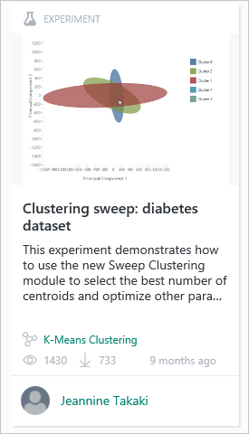
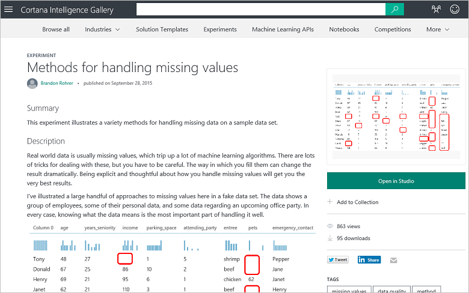

<properties
   pageTitle="Kopieren Sie Daten Wissenschaft Arbeiten anderer - Computer Learning Beispiel | Microsoft Azure"
   description="Betriebsgeheimnisse von Daten für Wissenschaft: erhalten Sie andere Personen Ihre Arbeit erledigen. Beispiele für Cortana Analytics Katalog wie ein Beispiel für Algorithmus."
   keywords="Daten Wissenschaft Beispielen maschinellen Learning Beispiel Clusteringalgorithmus Cluster Algorithmus Beispiel"
   services="machine-learning"
   documentationCenter="na"
   authors="cjgronlund"
   manager="jhubbard"
   editor="cjgronlund"/>

<tags
   ms.service="machine-learning"
   ms.devlang="na"
   ms.topic="article"
   ms.tgt_pltfrm="na"
   ms.workload="na"
   ms.date="10/20/2016"
   ms.author="cgronlun;garye"/>

# Kopieren Sie Gesprächspartner Arbeit zum Ausführen von Wissenschaft Daten

## Video 5: Daten Wissenschaft Anfänger Investition ohne Finanzierungskosten

Einen der Schlüssel der Daten Wissenschaft Trade kommen andere Personen Ihre Arbeit erledigen. Suchen Sie ein Beispiel für Algorithmus für Ihre eigenen Computer learning experimentieren verwendet werden soll.

Wenn Sie die Reihe optimal nutzen, schauen Sie sich alle. [Wechseln Sie zu der Liste von videos](#other-videos-in-this-series)

> [AZURE.VIDEO data-science-for-beginners-series-copy-other-peoples-work-to-do-data-science]

## Weitere Videos in dieser Reihe

*Daten Wissenschaft für Anfänger* ist eine schnelle Einführung Daten Wissenschaft in fünf kurzen Videos an.

  * Video 1: [5 Fragen Daten Wissenschaft Antworten](machine-learning-data-science-for-beginners-the-5-questions-data-science-answers.md) *(5 min 14 Sekunden)*
  * Video 2: [sind die Daten für Wissenschaft Daten bereit?](machine-learning-data-science-for-beginners-is-your-data-ready-for-data-science.md) *(4 min 56 Sekunden)*
  * Video 3: [Eine Frage mit Daten zu beantworten können](machine-learning-data-science-for-beginners-ask-a-question-you-can-answer-with-data.md) *(4 min 17 sec)*
  * Video 4: [Eine Antwort mit einem einfachen Modell Vorhersagen](machine-learning-data-science-for-beginners-predict-an-answer-with-a-simple-model.md) *(7 min 42 sec)*
  * Video 5: Kopieren Sie Gesprächspartner arbeiten, um Daten Wissenschaft führen

## Transkript: Kopieren Sie Gesprächspartner Arbeit zum Ausführen von Daten für Wissenschaft

Willkommen Sie bei der fünften Video in der Besprechungsserie "Daten Wissenschaft für Anfänger".

In diesen Termin erfahren Sie, einen Speicherort zum Suchen von Beispielen, die Sie aus als Ausgangspunkt für eine eigene Arbeit aufnehmen können. Sie können in diesem Video optimal nutzen, wenn Sie sich zuerst die früheren Videos in dieser Reihe ansehen.

Einen der Schlüssel der Daten Wissenschaft Trade kommen andere Personen Ihre Arbeit erledigen.

## Suchen Sie im Katalog Intelligence Cortana Beispiele

Microsoft hat einen cloudbasierten Dienst mit der Bezeichnung [Azure maschinellen Schulung]( https://azure.microsoft.com/services/machine-learning/) , denen Sie Willkommen bei kostenlos sind. Es bietet Ihnen einen Arbeitsbereich, in die Sie mit anderen Computer Learning Algorithmen experimentieren können, und wenn Sie Ihre Lösung gearbeitet haben haben, können Sie es als Webdienst starten.

Dieser Dienst gehört, dass ungefähr die **[Cortana Intelligence Katalog](http://aka.ms/CortanaIntelligenceGallery)**"". Es enthält eine Vielzahl von Ressourcen, von denen ist eine Sammlung von Azure maschinellen Learning Versuche oder Modellen, die Personen erstellt und für andere Personen verwenden beigetragen haben. Diese Versuche sind eine großartige Möglichkeit, die Nutzung der Gedanke und harte Arbeit anderer Personen können Ihnen als Ausgangspunkt für eigene Lösungen zu gelangen.

Sie können im Katalog am [aka.ms/CortanaIntelligenceGallery]( http://aka.ms/CortanaIntelligenceGallery)suchen. Jeder ist Willkommen bei sie durchsuchen.

Wenn Sie **Versuche** oben klicken, wird eine Anzahl von die letzten und beliebte Versuche im Katalog angezeigt. Sie können die restlichen Versuche durchsuchen, indem Sie auf **Alle durchsuchen** am oberen Rand des Bildschirms, und Sie können es eingeben Begriffe suchen, und wählen Sie Suchfilter.

## Suchen Sie und verwenden Sie ein Beispiel für Algorithmus

Ja, z. B. wir Sie möchten finden Sie unter Beispiel wie Cluster funktionieren, damit Sie nach **"Cluster"** Versuche suchen.

Hier ist ein interessant, die einer Person zu den Katalog zu zählen.

Klicken Sie auf die experimentieren und Sie erhalten eine Webseite anzuzeigen, die die Arbeit zu, die diese Mitwirkender hat beschrieben, sowie einige den Ergebnissen.

Beachten Sie die Verknüpfung, die besagt **in Studio geöffnet**.

Kann ich klicken Sie auf die, und es dauert für mich nach **Azure maschinellen Learning Studio**. Erstellt eine Kopie der Versuch, und es eigene Arbeitsbereich verschoben. Dies umfasst die Mitwirkenden Dataset, die Verarbeitung aus, die sie haben, alle den Algorithmen, die sie verwendet und wie sie sich die Ergebnisse gespeichert.

Und jetzt haben Sie diese als Ausgangsbasis. Ich kann, deren Daten für eigene austauschen, und führen Sie die eigene Anpassung des Modells. Erhalte ich einen schneller Start, und es kann ich die auf der Arbeit von Personen erstellen, die wirklich wissen, was sie tun.

## Suchen nach Versuche, die veranschaulichen maschinellen Learning Techniken

Es gibt andere Versuche im [Cortana Intelligence Katalog](http://aka.ms/CortanaIntelligenceGallery) , die speziell zum Bereitstellen von unterstützenden Beispiele für neue Daten Wissenschaft Menschen beigetragen wurden. Es gibt beispielsweise ein Versuch im Katalog, die veranschaulicht, wie Sie fehlende Werte ([Methoden zum Verarbeiten von fehlenden Werten](https://gallery.cortanaintelligence.com/Experiment/Methods-for-handling-missing-values-1)) behandelt. Es führt Sie durch 15 verschiedene Arten von leeren Werte ersetzen, und spricht über die Vorteile der einzelnen Methoden und wann sie verwendet werden.

[Cortana Intelligence Katalog](http://aka.ms/CortanaIntelligenceGallery) ist einen Speicherort zum Arbeiten Versuche zu finden, die Sie als Ausgangspunkt für eigene Lösungen verwenden können.

Achten Sie darauf, dass die anderen Videos in "Daten Wissenschaft für Anfänger" von Microsoft Azure maschinellen Learning Auschecken.

## Nächste Schritte

  * [Versuchen Sie Ihre erste Daten Wissenschaft dies mit Azure Computer-Schulung](machine-learning-create-experiment.md)
  * [Einführung in Computer Schulung auf Microsoft Azure](machine-learning-what-is-machine-learning.md)
