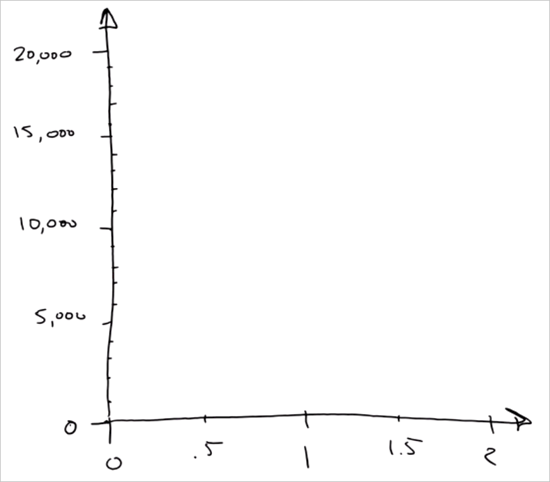

<properties
   pageTitle="Eine Antwort mit einem einfachen Modell - Regressionsmodell Vorhersagen | Microsoft Azure"
   description="Informationen zum Erstellen eines Modells für einfache Regression einen Preis in Daten Wissenschaft für Anfänger video 4 Vorhersagen. Enthält eine lineare Regression mit Zieldaten an."                                  
   keywords="Erstellen eines Modells einfaches Modell, Kurs Vorhersage, einfache Regressionsmodell"
   services="machine-learning"
   documentationCenter="na"
   authors="cjgronlund"
   manager="jhubbard"
   editor="cjgronlund"/>

<tags
   ms.service="machine-learning"
   ms.devlang="na"
   ms.topic="article"
   ms.tgt_pltfrm="na"
   ms.workload="na"
   ms.date="10/20/2016"
   ms.author="cgronlun;garye"/>

# Eine Antwort mit einem einfachen Modell Vorhersagen

## Video 4: Daten Wissenschaft Anfänger Investition ohne Finanzierungskosten

Informationen Sie zum Erstellen eines Modells für einfache Regression Preis von einer Raute in Daten Wissenschaft für Anfänger video 4 Vorhersagen. Zeichnen wir ein Regressionsmodell mit Zieldaten.

Wenn Sie die Reihe optimal nutzen, schauen Sie sich alle. [Wechseln Sie zu der Liste von videos](#other-videos-in-this-series)

> [AZURE.VIDEO data-science-for-beginners-series-predict-an-answer-with-a-simple-model]

## Weitere Videos in dieser Reihe

*Daten Wissenschaft für Anfänger* ist eine schnelle Einführung Daten Wissenschaft in fünf kurzen Videos an.

  * Video 1: [5 Fragen Daten Wissenschaft Antworten](machine-learning-data-science-for-beginners-the-5-questions-data-science-answers.md) *(5 min 14 Sekunden)*
  * Video 2: [sind die Daten für Wissenschaft Daten bereit?](machine-learning-data-science-for-beginners-is-your-data-ready-for-data-science.md) *(4 min 56 Sekunden)*
  * Video 3: [Eine Frage mit Daten zu beantworten können](machine-learning-data-science-for-beginners-ask-a-question-you-can-answer-with-data.md) *(4 min 17 sec)*
  * Video 4: Vorhersagen Sie eine Antwort mit einem einfachen Modell
  * Video 5: [Gesprächspartner Arbeit zum Ausführen von Wissenschaft Daten kopieren](machine-learning-data-science-for-beginners-copy-other-peoples-work-to-do-data-science.md) *(3 min 18 Sekunden)*

## Transkript: Vorhersagen Sie eine Antwort mit einem einfachen Modell

Willkommen Sie bei in der "Daten Wissenschaft für Anfänger" das vierte Video Reihe. In diesen Termin wir ein einfaches Modell erstellen und stellen Sie eine Vorhersage.

Ein *Modell* ist eine vereinfachte Geschichte zu unseren Daten. Ich werde Ihnen zeigen, was ich meine.

## Sammeln relevant, genau, verbundenen, genügend Daten

Angenommen Sie, dass ich für eine Raute kaufen möchten. Ich habe eine anrufen, die zu meiner Großmutter mit einer Einstellung für eine Raute 1,35 Caretzeichen gehören, und ich eine Vorstellung davon, wie viel kostet erhalten möchten. Kann ich einen Editor und Stift in den Schmuck Store bringen, und ich Notieren Sie sich den Preis aller die Rauten in der Groß-/Kleinschreibung und wie viel sie in Carats abzuwägen. Beginnend mit der ersten Raute - des 1.01 Carats und $7,366.

Ich habe jetzt aufzurufen, und führen Sie dies für alle anderen Rauten im Speicher.

Beachten Sie, dass die Liste zwei Spalten enthält. Jede Spalte besitzt ein anderes Attribut: Stärke in Carats und Preis- und jede Zeile wird einen einzelnen Datenpunkt, der eine einzelne Raute darstellt.

Wir haben ein kleines tatsächlich erstellt Hier - legen Sie Daten eine Tabelle. Beachten Sie, dass es unsere Kriterien für Qualität entspricht:

* Die Daten sind **relevante** - Stärke auf jeden Fall bezieht sich auf Kurs
* Es ist **genau** – wir sich die Preise, die wir notieren vergewissert
* Es ist **verbunden** – es gibt keine Leerzeichen in einem der folgenden Spalten
* Und wie wir sehen, ist es **ausreichend** Daten unserer zu bewerkstelligen

## Stellen Sie eine Frage scharfe

Jetzt wir unsere Frage scharfen So stellen werden: "wie viel wird es Kosten eine Raute 1,35 Caretzeichen erwerben?"

Die Liste keine Raute 1,35 Caretzeichen darin, wir die restlichen unsere Daten verwenden, um eine Antwort auf die Frage erhalten haben.

## Zeichnen Sie die vorhandenen Daten

Erstes wir vornehmen können ist eine horizontale Zahl Linie, eine Achse, um die-Stärken Diagramm bezeichnet. Der Zellbereich, der die-Stärken ist 0 bis 2, damit wir wird eine Linie, die behandelt, die Bereichs, und setzen Teilstriche für jede halbe Caretzeichen.

Als Nächstes zeichnen wir eine vertikale Achse aus, um den Kurs aufzeichnen und verbinden Sie es mit der Stärke der horizontalen Achse. Dies wird in einer anderen Einheit Dollar sein. Nachdem Sie nun eine Reihe von Achsen koordinieren müssen.

Wir werden diese Daten jetzt übernehmen, und wandeln Sie es in ein *Punkt (XY) darstellen*. Dies ist eine großartige Möglichkeit, numerischen Datasets darstellen.

Für den ersten Datenpunkt zu erfassen wir eine vertikale Linie am 1.01 Carats. Klicken Sie dann wir zu eine horizontale Linie am $7,366 erfassen. Wobei erreichen, zeichnen wir einen Punkt. Hierbei handelt es sich um unsere erste Raute.

Nun jeder Raute aufzurufen, klicken Sie auf diese Liste und führen Sie dieselben Schritte. Wenn wir damit fertig sind, dies ist das Ergebnis wir: eine Reihe von Punkten, eine für jede Raute.

## Zeichnen Sie das Modell durch die Datenpunkte

Wenn Sie die Punkte und Squint betrachten, sieht die Sammlung jetzt wie eine fat fuzzy Linie. Wir können unsere Marker und zeichnen eine gerade Linie, bis es.

Durch Zeichnen einer Linie, haben wir ein *Modell*erstellt. Betrachten Sie es als die Praxis aufzeichnen und eine Cartoon vereinfachte Version davon zu machen. Jetzt Cartoon ist falsch: die Zeile nicht alle Datenpunkte aufzurufen. Aber es ist eine hilfreiche Vereinfachung.

Ist die Fakultät, die alle die Punkte genau durch die Linie verlaufen nicht in Ordnung. Daten Wissenschaftler erläutert dies darauf hin, dass es -, die die Linie - Modell dann jeder Punkt sind und einige *Rauschen* oder *Varianz* zugeordnet. Es ist die zugrunde liegende perfekte Beziehung und vorliegt, die addiert Rauschen und Ungenauigkeit weltweit an, real.

Da wir versuchen, die Frage beantworten *wie viel?* Dies ist eine *Regressionsanalyse*bezeichnet. Und da wir eine gerade Linie verwenden, ist es eine *lineare Regression*.

## Verwenden Sie das Modell um die Antwort zu finden.

Jetzt wir ein Modell haben, und wir sie unseren Frage bitten: wie viel wird eine Raute 1,35 Caretzeichen Kosten?

Um unsere Frage beantworten, wir 1,35 Carats zu erfassen und eine vertikale Linie zu zeichnen. Schnittpunkt die Linie Modell zu erfassen wir eine horizontale Linie zur Achse DM. Ball rechts bei 10.000. Ausleger! Dies ist die Antwort: eine Raute 1,35 Caretzeichen kostet zu 10.000 €.

## Erstellen einer Konfidenzintervall

Es ist natürlich, fragen sich, wie präzise diese Vorhersage ist. Es ist sinnvoll, wissen, ob die Raute 1,35 Caretzeichen sehr ähnlich 10.000 US-Dollar, ist oder sehr höhere oder niedrigere. Um dies zu ermitteln, zeichnen Sie uns einen Umschlag um Regressionsgeraden, die meisten Punkte enthält. Umschlag heißt *Konfidenzintervall*: Wir sind ziemlich sicher, dass die Preise innerhalb dieser Umschlag; liegen, da die vergangenen Großteil haben. Wir können zwei weitere horizontale Linien zeichnen, aus, in dem die 1,35 Caretzeichen Linie am oberen und unteren Rand, der Umschlag schneidet.

Jetzt wir etwas über unsere Konfidenzintervall sagen können: Wir können zuverlässig angenommen, aber es möglicherweise so niedrig wie $8.000 und es möglicherweise so weit wie 12.000 Preis von einer Raute 1,35 Caretzeichen zu $10.000 ist -.

## Wir sind, ohne Mathematik oder Computern fertig

Wir konnten, welche Daten Wissenschaftler gezahlt zu tun ist, und wir, indem Sie einfach Zeichnung hat:

* Wir haben eine Frage, dass wir Sie mit Daten beantworten könnten
* Wir erstellt ein *Modell* *lineare regression*
* Wir eine *Vorhersage*vorgenommen, zusammen mit einem *Konfidenzintervall*

Und wir haben mathematischen oder Computern Vorgehensweise verwenden.

Nun, wenn wir weitere Informationen, wie hätten durchführen...

* das Ausschneiden von der Raute
* Farbvariationen (wie schließen die Raute besteht darin, wird weiß)
* die Anzahl der Inklusionen in die Raute

... anschließend übermitteln ein wir wären weitere Spalten. In diesem Fall wird die mathematische hilfreich. Wenn Sie mehr als zwei Spalten verfügen, ist es schwierig, um Punkte auf Papier zu zeichnen. Die mathematische können Sie die Linie oder die Ebene mit Ihren Daten sehr gut passt.

Auch wenn anstelle von nur ein paar Rauten, wir hatten zwei 1000 skaliert oder zwei Millionen und dann können Sie das Arbeit mit einem Computer viel schneller ausführen.

Heute, wir haben bereits Vorgehensweise lineare Regression, und wir die Daten mithilfe der Vorhersage vorgenommen.

Achten Sie darauf, dass die anderen Videos in "Daten Wissenschaft für Anfänger" von Microsoft Azure maschinellen Learning Auschecken.

## Nächste Schritte

  * [Versuchen Sie eine erste Daten Wissenschaft dies mit maschinellen Learning Studio](machine-learning-create-experiment.md)
  * [Einführung in Computer Schulung auf Microsoft Azure](machine-learning-what-is-machine-learning.md)
