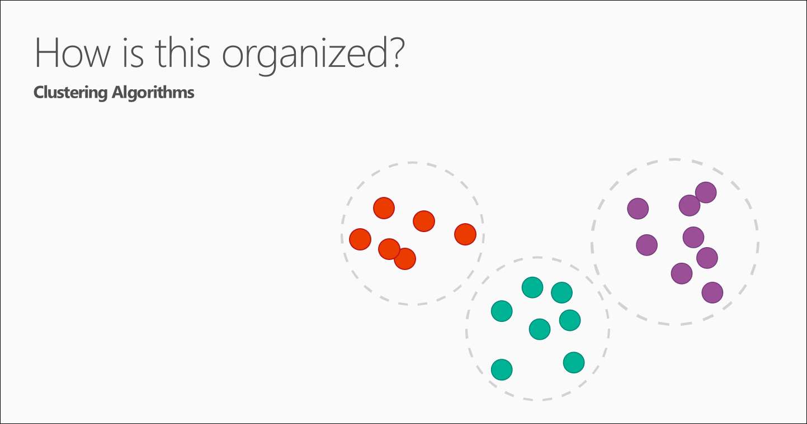

<properties
   pageTitle="5 Daten Wissenschaft Fragen - Daten Wissenschaft für Anfänger | Microsoft Azure"
   description="Erhalten Sie eine kurze Einführung in Wissenschaft Daten aus Daten Wissenschaft für Anfänger, fünf kurzen Videos an, die mit der 5 Fragen Daten Wissenschaft Antworten beginnen."
   keywords="Ausführen von Daten für Wissenschaft, Daten Wissenschaft Anfänger, Daten Wissenschaft für Anfänger, Arten von Fragen, die Daten Wissenschaft Fragen, die Daten Wissenschaft video"
   services="machine-learning"
   documentationCenter="na"
   authors="cjgronlund"
   manager="jhubbard"
   editor="cjgronlund"/>

<tags
   ms.service="machine-learning"
   ms.devlang="na"
   ms.topic="article"
   ms.tgt_pltfrm="na"
   ms.workload="na"
   ms.date="10/20/2016"
   ms.author="cgronlun;garye"/>

# Daten Wissenschaft für Anfänger video 1: der 5 Fragen Daten Wissenschaft Antworten

Rufen Sie eine kurze Einführung in Wissenschaft Daten aus *Daten Wissenschaft für Anfänger* in fünf kurzen Videos von einer Scientist verwendete Daten ein. Diese Videos an, sind grundlegende, aber sinnvoll, gleich, ob Sie Daten Wissenschaft daran interessiert, oder Sie mit Daten Wissenschaftlern arbeiten.

In diesem ersten Video geht die Arten von Fragen, die Daten für Wissenschaft beantwortet werden kann. Wenn Sie die Reihe optimal nutzen, schauen Sie sich alle. [Wechseln Sie zu der Liste von videos](#other-videos-in-this-series)

> [AZURE.VIDEO data-science-for-beginners-series-the-5-questions-data-science-answers]

## Weitere Videos in dieser Reihe

*Daten Wissenschaft für Anfänger* ist eine kurze Einführung in die Daten Wissenschaft aufzeichnen total etwa 25 Minuten. Schauen Sie sich die anderen vier Videos:

  * Video 1: Die 5 Fragen Daten Wissenschaft Antworten
  * Video 2: [sind die Daten für Wissenschaft Daten bereit?](machine-learning-data-science-for-beginners-is-your-data-ready-for-data-science.md) *(4 min 56 Sekunden)*
  * Video 3: [Eine Frage mit Daten zu beantworten können](machine-learning-data-science-for-beginners-ask-a-question-you-can-answer-with-data.md) *(4 min 17 sec)*
  * Video 4: [Eine Antwort mit einem einfachen Modell Vorhersagen](machine-learning-data-science-for-beginners-predict-an-answer-with-a-simple-model.md) *(7 min 42 sec)*
  * Video 5: [Gesprächspartner Arbeit zum Ausführen von Wissenschaft Daten kopieren](machine-learning-data-science-for-beginners-copy-other-peoples-work-to-do-data-science.md) *(3 min 18 Sekunden)*

## Transkript: Die 5 Fragen Daten Wissenschaft Antworten

Hallo! Willkommen Sie bei der Videoreihe *Daten Wissenschaft für Anfänger*.

Daten Wissenschaft kann furchterregend, sein, damit ich die Grundlagen ohne Formeln oder Computer programming Jargon vorstellen können.

In diesem Video ersten stellen wir Ihnen "Fragen an die 5 Daten Wissenschaft Antworten."

Daten Wissenschaft werden Zahlen und Namen (auch bekannt als Kategorien oder Etiketten) zum Antworten auf Fragen Vorhersagen verwendet.

Möglicherweise werden, aber *Es gibt nur fünf Fragen an die Daten Wissenschaft Antworten*überrascht es:

  * Ist dieser A oder B?
  * Handelt es sich um merkwürdig?
  * Wie viel – oder – wie viele?
  * Es ist wie folgt organisiert?
  * Was tun kann ich als Nächstes?

  Durch eine separate Familie von Computer-Learning-Methoden, nämlich Algorithmen wird jeweils dieser Fragen beantwortet.

Es empfiehlt sich ein Algorithmus als eine Anleitung und Ihre Daten als die Bestandteile anzustellen. Ein Algorithmus teilt wie kombinieren und mischen Sie die Daten, um eine Antwort zu erhalten. Computer, wie eines sind. Wie die meisten harte Arbeit des Algorithmus für Sie, und wie es ziemlich schnell.

## Frage 1: Ist dieser A oder B? Klassifizierung Algorithmen verwendet

Beginnen wir mit der Frage: ist dieser A oder B?

Diese Familie von Algorithmen heißt zwei-Klasse Klassifizierung.

Es ist sinnvoll, für jede Frage, die nur zwei mögliche Antworten enthält.

Beispiel:

  * Tritt dieses Tire in den nächsten 1.000 Meilen: Ja oder Nein?
  * Das bringt in mehr Kunden: $5 Gutschein oder einen Rabatt von 25 %?

Diese Frage kann auch rephrased werden, wenn Sie mehr als zwei Optionen: ist einer dieser A oder B oder C oder D, usw..?  Dies heißt multiclass Klassifizierung und es sinnvoll, wenn Sie mehrere haben – oder mehrere Tausend – mögliche Antworten. Multiclass Klassifizierung wählt das wahrscheinlich einen.

## Frage 2: Handelt es sich um merkwürdig? Anomalie Erkennung Algorithmen verwendet

Ist die nächste Frage Daten Wissenschaft beantworten kann: Diese seltsam ist? Durch eine Reihe von Algorithmen so genannte Normalbetriebswerte wird diese Frage beantwortet.

Wenn Sie eine Kreditkarte haben, haben Sie bereits aus Normalbetriebswerte gekommen. Ihr Unternehmen Kreditkarte analysiert Ihre Mustern erwerben, damit sie Sie auf mögliche Betrug aufmerksam machen können. Gebühren, die "merkwürdig" sind möglicherweise auf einer Bestellung bei einer Stelle, an der Sie normalerweise kaufen nicht Store oder kaufen ein Element ungewöhnlich hochpreisige.

Diese Frage kann viele Weise hilfreich sein. Zum Beispiel:

  * Wenn Sie ein Auto mit Druck Monitore haben, sollten Sie wissen: ist dieser Druck Monitor normalen lesen?
  * Wenn Sie mit dem Internet überwachen, würde wissen möchten,: Diese Nachricht aus dem Internet wird in der Regel?

Normalbetriebswerte kennzeichnet unerwartete oder ungewöhnliche Ereignissen oder Verhaltensweisen. Es gibt Hinweise, wo Sie nach Problemen suchen.

## Frage 3: Wie viel? oder wie viele? Regression Algorithmen verwendet

Die Antwort auf wie kann auch viel maschinellen Learning Vorhersagen? oder wie viele? Die Familie von Algorithmen, die diese Frage beantwortet wird als Regressionsanalyse bezeichnet.

Regression Algorithmen stellen numerische Vorhersagen, z. B.:

  * Was ist die Temperatur nächsten Dienstag gemeinsam?  
  * Was kann ich meine Umsatz im vierten Quartal?

Eine Frage beantworten, die eine Zahl anfordert verhelfen.

## Frage 4: Wie ist dies organisiert? Cluster Algorithmen verwendet

Die letzten beiden Fragen werden jetzt ein wenig mehr erweitert.

Manchmal möchten Sie die Struktur einer Datengruppe zurück - verstehen wie folgt organisiert? Für diese Frage verfügen Sie möglicherweise nicht Beispielen, denen Sie bereits für Aufgabenergebnisse kennen.

Es gibt zahlreiche Methoden zum tease, die Struktur der Daten aus. Eine Möglichkeit ist Cluster. Daten wird in "natürlich fasst zusammen," für einfacher Interpretation getrennt. Mit Cluster gibt es keine eine richtige Antwort.

Beispiele für allgemeine Fragen Cluster sind:

  * Die Betrachter wie die gleichen Arten von Filmen?
  * Welche Druckermodelle fehlschlagen genauso?

Verstehen, wie die Daten organisiert sind, können Sie besser verstehen – und Vorhersagen - Verhalten und Ereignisse.  

## Frage 5: Was tun kann ich jetzt? learning Algorithmen Ausbau verwendet

Die letzte Frage – was jetzt tun sollten? – eine Reihe von Algorithmen so genannte Ausbau Learning verwendet.

Learning Ausbau wurde durch wie des Gehirns Ratten und Menschen auf Bestrafung und Chancen reagieren inspired. Diese Algorithmen aus Aufgabenergebnisse lernen, und entscheiden Sie sich für die nächste Aktion.

Ausbau Schulung ist in der Regel gut für automatische Systeme, die viele kleine Entscheidungen ohne personenbezogenen Anleitung vornehmen müssen.

Fragen, die sie Antworten sind immer an, welche Aktion – normalerweise durch einen Computer oder ein Robot entnommen werden sollen. Beispiele für sind:

  * Wenn ich eine Temperatur Steuerelement-System für ein Haus bin: Anpassen die Temperatur oder lassen, ist es?  
  * Wenn ich versuche, dass ein Self steuernde Auto: Klicken Sie auf ein gelbes Licht, Bremse oder beschleunigen?  
  * Für eine Robot Vakuum: Vacuumer beibehalten, oder wechseln Sie zurück zur Station wird geladen?

Ausbau Learning Algorithmen sammeln Sie die Daten, die sie von ausprobieren learning zu wechseln, sind.

Relativ, die - kann die 5 Fragen Daten Wissenschaft beantworten.

## Nächste Schritte

  * [Versuchen Sie eine erste Daten Wissenschaft dies mit maschinellen Learning Studio](machine-learning-create-experiment.md)
  * [Einführung in Computer Schulung auf Microsoft Azure](machine-learning-what-is-machine-learning.md)
